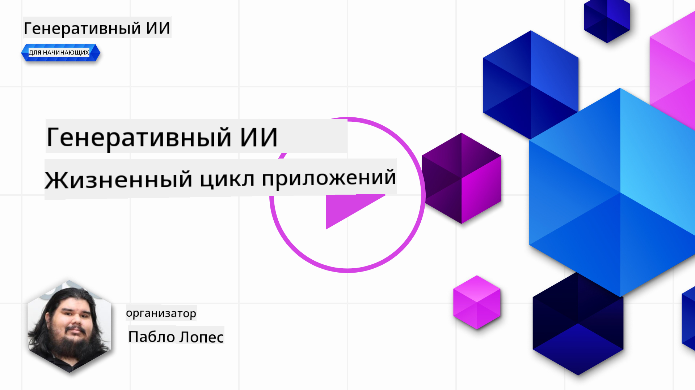
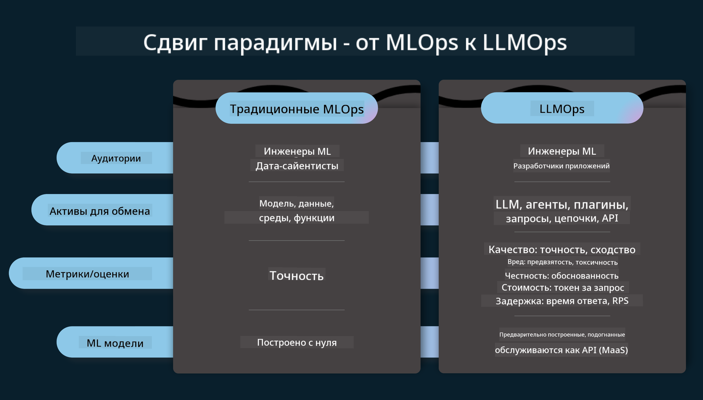
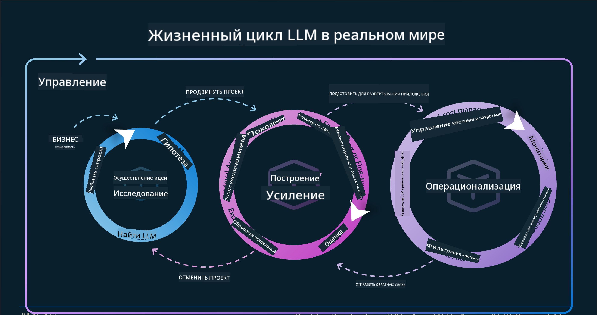
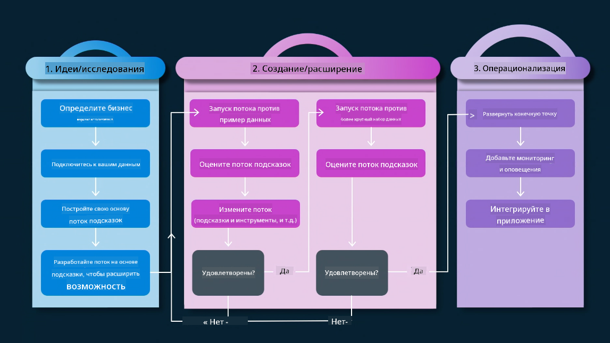
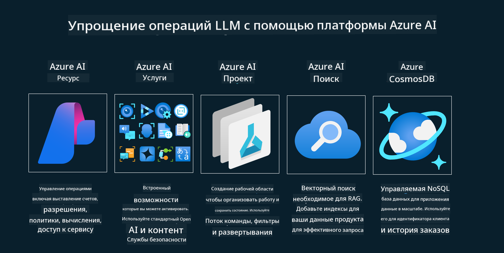
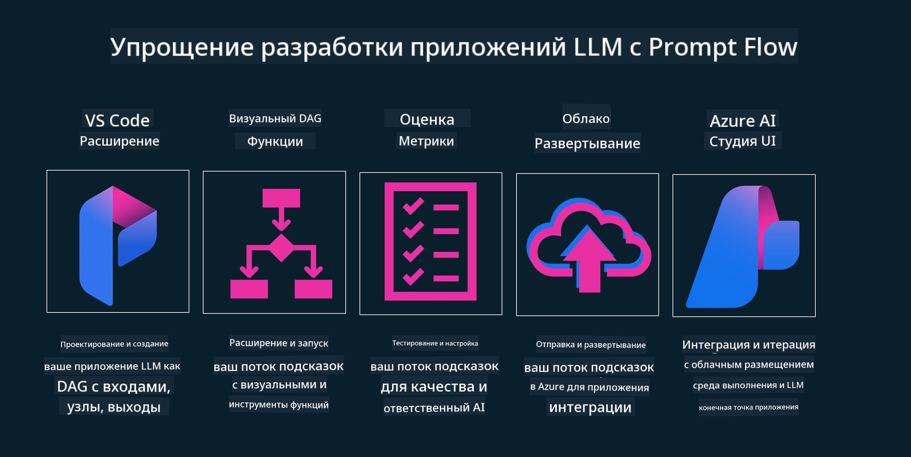

<!--
CO_OP_TRANSLATOR_METADATA:
{
  "original_hash": "27a5347a5022d5ef0a72ab029b03526a",
  "translation_date": "2025-06-25T21:54:43+00:00",
  "source_file": "14-the-generative-ai-application-lifecycle/README.md",
  "language_code": "ru"
}
-->

# Жизненный цикл приложения генеративного ИИ

Важный вопрос для всех приложений ИИ — это актуальность функций ИИ, поскольку ИИ — это быстро развивающаяся область. Чтобы ваше приложение оставалось актуальным, надежным и устойчивым, вам необходимо постоянно его отслеживать, оценивать и улучшать. Здесь вступает в действие жизненный цикл генеративного ИИ.

Жизненный цикл генеративного ИИ — это структура, которая проводит вас через этапы разработки, развертывания и поддержки приложения генеративного ИИ. Она помогает вам определить ваши цели, измерить производительность, выявить проблемы и реализовать решения. Также она помогает согласовать ваше приложение с этическими и правовыми стандартами вашей области и ваших заинтересованных сторон. Следуя жизненному циклу генеративного ИИ, вы можете быть уверены, что ваше приложение всегда приносит пользу и удовлетворяет пользователей.

## Введение

В этой главе вы:

- Поймете смену парадигмы от MLOps к LLMOps
- Изучите жизненный цикл LLM
- Ознакомитесь с инструментами жизненного цикла
- Узнаете о метрификации и оценке жизненного цикла

## Поймите смену парадигмы от MLOps к LLMOps

LLM — это новый инструмент в арсенале искусственного интеллекта, они невероятно мощны в задачах анализа и генерации для приложений, однако эта мощь имеет последствия для оптимизации задач ИИ и классического машинного обучения.

С этим нам нужна новая парадигма, чтобы адаптировать этот инструмент в динамике с правильными стимулами. Мы можем классифицировать старые приложения ИИ как "ML Apps", а новые — как "GenAI Apps" или просто "AI Apps", отражая основные технологии и методы, используемые в то время. Это изменяет наш подход во многих аспектах, взгляните на следующее сравнение.

Обратите внимание, что в LLMOps мы больше сосредоточены на разработчиках приложений, используя интеграции как ключевой момент, используя "Models-as-a-Service" и думая о следующих точках для метрик.

- Качество: Качество ответа
- Вред: Ответственный ИИ
- Честность: Обоснованность ответа (Имеет ли смысл? Это правильно?)
- Стоимость: Бюджет решения
- Задержка: Среднее время ответа токена

## Жизненный цикл LLM

Сначала, чтобы понять жизненный цикл и изменения, обратим внимание на следующую инфографику.

Как вы можете заметить, это отличается от обычных жизненных циклов MLOps. У LLM много новых требований, таких как Prompting, различные техники для улучшения качества (Fine-Tuning, RAG, Meta-Prompts), различные оценки и ответственность с ответственным ИИ, наконец, новые метрики оценки (Качество, Вред, Честность, Стоимость и Задержка).

Например, взгляните на то, как мы придумываем идеи. Используя инженеринг подсказок для экспериментов с различными LLM, чтобы исследовать возможности проверки гипотез.

Обратите внимание, что это не линейный процесс, а интегрированные циклы, итеративные и с общим циклом.

Как мы можем исследовать эти шаги? Давайте подробнее рассмотрим, как мы можем построить жизненный цикл.

Это может выглядеть немного сложно, давайте сначала сосредоточимся на трех больших шагах.

1. Идеация/Исследование: Исследование, здесь мы можем исследовать в соответствии с нашими бизнес-потребностями. Прототипирование, создание [PromptFlow](https://microsoft.github.io/promptflow/index.html?WT.mc_id=academic-105485-koreyst) и тестирование его эффективности для нашей гипотезы.
1. Создание/Увеличение: Реализация, теперь мы начинаем оценивать для больших наборов данных, внедрять техники, такие как Fine-tuning и RAG, чтобы проверить устойчивость нашего решения. Если это не так, повторная реализация, добавление новых шагов в наш поток или реструктуризация данных могут помочь. После тестирования нашего потока и масштаба, если он работает и проверяет наши метрики, он готов к следующему шагу.
1. Операционализация: Интеграция, теперь добавление систем мониторинга и оповещений в нашу систему, развертывание и интеграция приложения в наше приложение.

Затем у нас есть общий цикл управления, сосредоточенный на безопасности, соответствии и управлении.

Поздравляем, теперь ваше приложение ИИ готово к запуску и работе. Для практического опыта взгляните на [демо-чат Contoso.](https://nitya.github.io/contoso-chat/?WT.mc_id=academic-105485-koreys)

Теперь, какие инструменты мы можем использовать?

## Инструменты жизненного цикла

Для инструментов Microsoft предоставляет [Azure AI Platform](https://azure.microsoft.com/solutions/ai/?WT.mc_id=academic-105485-koreys) и [PromptFlow](https://microsoft.github.io/promptflow/index.html?WT.mc_id=academic-105485-koreyst), которые упрощают и делают ваш цикл легким в реализации и готовым к запуску.

[Azure AI Platform](https://azure.microsoft.com/solutions/ai/?WT.mc_id=academic-105485-koreys) позволяет вам использовать [AI Studio](https://ai.azure.com/?WT.mc_id=academic-105485-koreys). AI Studio — это веб-портал, который позволяет вам исследовать модели, примеры и инструменты. Управление вашими ресурсами, потоками разработки UI и вариантами SDK/CLI для разработки с использованием кода.

Azure AI позволяет вам использовать множество ресурсов для управления вашими операциями, услугами, проектами, поиском вектора и потребностями в базах данных.

Создайте, от Proof-of-Concept (POC) до крупномасштабных приложений с PromptFlow:

- Разрабатывайте и создавайте приложения из VS Code с визуальными и функциональными инструментами
- Тестируйте и дорабатывайте ваши приложения для качественного ИИ с легкостью
- Используйте Azure AI Studio для интеграции и итерации с облаком, Push и Deploy для быстрой интеграции.

## Отлично! Продолжайте обучение!

Замечательно, теперь узнайте больше о том, как мы структурируем приложение для использования концепций с [Contoso Chat App](https://nitya.github.io/contoso-chat/?WT.mc_id=academic-105485-koreyst), чтобы увидеть, как Cloud Advocacy добавляет эти концепции в демонстрации. Для получения дополнительного контента, ознакомьтесь с нашей [сессией на Ignite!
](https://www.youtube.com/watch?v=DdOylyrTOWg)

Теперь ознакомьтесь с Уроком 15, чтобы понять, как [Генерация с дополнением извлечения и векторные базы данных](../15-rag-and-vector-databases/README.md?WT.mc_id=academic-105485-koreyst) влияют на генеративный ИИ и делают приложения более увлекательными!

**Отказ от ответственности**:  
Этот документ был переведен с использованием службы автоматического перевода [Co-op Translator](https://github.com/Azure/co-op-translator). Хотя мы стремимся к точности, пожалуйста, имейте в виду, что автоматические переводы могут содержать ошибки или неточности. Оригинальный документ на его родном языке следует считать авторитетным источником. Для получения критически важной информации рекомендуется профессиональный перевод человеком. Мы не несем ответственности за любые недоразумения или неправильные толкования, возникающие в результате использования этого перевода.