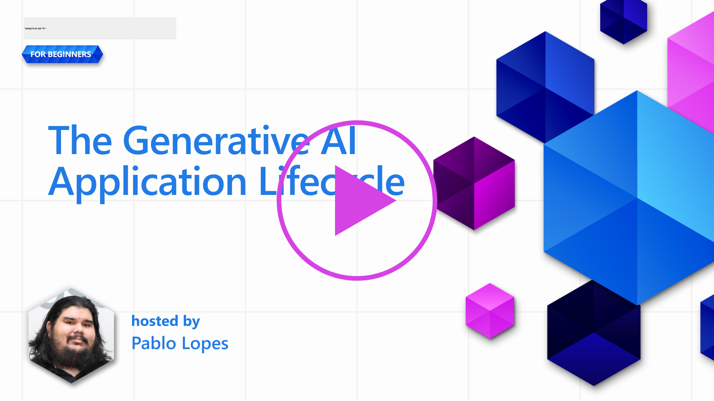

<!--
CO_OP_TRANSLATOR_METADATA:
{
  "original_hash": "27a5347a5022d5ef0a72ab029b03526a",
  "translation_date": "2025-07-09T15:47:14+00:00",
  "source_file": "14-the-generative-ai-application-lifecycle/README.md",
  "language_code": "ru"
}
-->

# Жизненный цикл приложений с генеративным ИИ

Важный вопрос для всех ИИ-приложений — актуальность ИИ-функций, ведь ИИ — быстро развивающаяся область. Чтобы ваше приложение оставалось востребованным, надежным и устойчивым, необходимо постоянно его отслеживать, оценивать и улучшать. Именно здесь на помощь приходит жизненный цикл генеративного ИИ.

Жизненный цикл генеративного ИИ — это рамки, которые помогают пройти этапы разработки, развертывания и поддержки генеративного ИИ-приложения. Он помогает определить цели, измерить эффективность, выявить проблемы и внедрить решения. Также он помогает согласовать приложение с этическими и правовыми нормами вашей области и заинтересованных сторон. Следуя жизненному циклу генеративного ИИ, вы обеспечиваете постоянную ценность и удовлетворение пользователей.

## Введение

В этой главе вы:

- Поймёте сдвиг парадигмы от MLOps к LLMOps
- Изучите жизненный цикл LLM
- Познакомитесь с инструментами жизненного цикла
- Узнаете о метриках и оценке жизненного цикла

## Понимание сдвига парадигмы от MLOps к LLMOps

LLM — новый инструмент в арсенале искусственного интеллекта, они невероятно мощны в задачах анализа и генерации для приложений, однако эта мощь влечёт за собой определённые последствия для оптимизации задач ИИ и классического машинного обучения.

В связи с этим нам нужна новая парадигма, чтобы адаптировать этот инструмент динамично и с правильными стимулами. Мы можем классифицировать старые ИИ-приложения как «ML Apps», а новые — как «GenAI Apps» или просто «AI Apps», отражая основные технологии и методы, используемые в то время. Это меняет наш взгляд во многих аспектах, посмотрите на следующее сравнение.

Обратите внимание, что в LLMOps мы больше ориентируемся на разработчиков приложений, используя интеграции как ключевой момент, применяя «Models-as-a-Service» и учитывая следующие показатели для метрик.

- Качество: качество ответа
- Вред: ответственный ИИ
- Честность: обоснованность ответа (Имеет ли смысл? Правильный ли ответ?)
- Стоимость: бюджет решения
- Задержка: среднее время ответа на токен

## Жизненный цикл LLM

Для начала, чтобы понять жизненный цикл и его особенности, обратите внимание на следующую инфографику.

Как вы можете заметить, это отличается от привычных жизненных циклов MLOps. LLM имеют множество новых требований, таких как Prompting, различные техники для улучшения качества (Fine-Tuning, RAG, Meta-Prompts), особые подходы к оценке и ответственности с учётом ответственного ИИ, а также новые метрики оценки (Качество, Вред, Честность, Стоимость и Задержка).

Например, посмотрите, как мы генерируем идеи. Используем prompt engineering для экспериментов с разными LLM, чтобы исследовать возможности и проверить, может ли их гипотеза быть верной.

Обратите внимание, что процесс не линейный, а представляет собой интегрированные циклы, итеративные и с общим циклом управления.

Как мы можем исследовать эти этапы? Давайте рассмотрим подробнее, как построить жизненный цикл.

Это может показаться немного сложным, давайте сначала сосредоточимся на трёх основных шагах.

1. Генерация идей/Исследование: Исследование, здесь мы можем изучать возможности в соответствии с бизнес-потребностями. Прототипирование, создание [PromptFlow](https://microsoft.github.io/promptflow/index.html?WT.mc_id=academic-105485-koreyst) и проверка его эффективности для нашей гипотезы.
1. Создание/Улучшение: Реализация, теперь мы начинаем оценивать на больших наборах данных, внедрять техники, такие как Fine-tuning и RAG, чтобы проверить устойчивость решения. Если решение не работает, повторная реализация, добавление новых шагов в поток или реструктуризация данных могут помочь. После тестирования потока и масштабирования, если всё работает и метрики удовлетворительны, можно переходить к следующему этапу.
1. Внедрение в эксплуатацию: Интеграция, теперь добавляем системы мониторинга и оповещений, развертывание и интеграцию приложения.

Затем у нас есть общий цикл управления, сосредоточенный на безопасности, соблюдении норм и управлении.

Поздравляем, теперь ваше ИИ-приложение готово к работе и эксплуатации. Для практического опыта посмотрите [демо Contoso Chat.](https://nitya.github.io/contoso-chat/?WT.mc_id=academic-105485-koreys)

А какие инструменты мы можем использовать?

## Инструменты жизненного цикла

Для инструментов Microsoft предлагает [Azure AI Platform](https://azure.microsoft.com/solutions/ai/?WT.mc_id=academic-105485-koreys) и [PromptFlow](https://microsoft.github.io/promptflow/index.html?WT.mc_id=academic-105485-koreyst), которые упрощают и делают ваш жизненный цикл лёгким для реализации и запуска.

[Azure AI Platform](https://azure.microsoft.com/solutions/ai/?WT.mc_id=academic-105485-koreys) позволяет использовать [AI Studio](https://ai.azure.com/?WT.mc_id=academic-105485-koreys). AI Studio — это веб-портал, который позволяет исследовать модели, примеры и инструменты, управлять ресурсами, создавать UI-потоки и использовать SDK/CLI для разработки с приоритетом на код.

Azure AI позволяет использовать множество ресурсов для управления операциями, сервисами, проектами, векторным поиском и базами данных.

Создавайте от Proof-of-Concept (POC) до масштабных приложений с помощью PromptFlow:

- Проектируйте и создавайте приложения из VS Code с визуальными и функциональными инструментами
- Тестируйте и дорабатывайте приложения для качественного ИИ с лёгкостью
- Используйте Azure AI Studio для интеграции и итераций с облаком, быстрого развертывания и интеграции

## Отлично! Продолжайте обучение!

Отлично, теперь узнайте больше о том, как мы структурируем приложение, чтобы использовать эти концепции, на примере [Contoso Chat App](https://nitya.github.io/contoso-chat/?WT.mc_id=academic-105485-koreyst), чтобы увидеть, как Cloud Advocacy внедряет эти идеи в демонстрациях. Для дополнительного материала смотрите нашу [сессию Ignite!](https://www.youtube.com/watch?v=DdOylyrTOWg)

А теперь переходите к уроку 15, чтобы понять, как [Retrieval Augmented Generation и векторные базы данных](../15-rag-and-vector-databases/README.md?WT.mc_id=academic-105485-koreyst) влияют на генеративный ИИ и помогают создавать более увлекательные приложения!

**Отказ от ответственности**:  
Этот документ был переведен с помощью сервиса автоматического перевода [Co-op Translator](https://github.com/Azure/co-op-translator). Несмотря на наши усилия по обеспечению точности, просим учитывать, что автоматический перевод может содержать ошибки или неточности. Оригинальный документ на его исходном языке следует считать авторитетным источником. Для получения критически важной информации рекомендуется обращаться к профессиональному переводу, выполненному человеком. Мы не несем ответственности за любые недоразумения или неправильные толкования, возникшие в результате использования данного перевода.