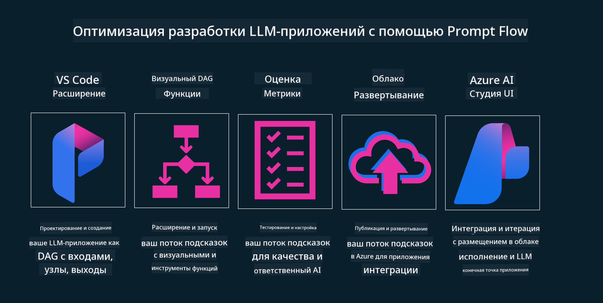

<!--
CO_OP_TRANSLATOR_METADATA:
{
  "original_hash": "b9d32511b27373a1b21b5789d4fda057",
  "translation_date": "2025-10-17T15:06:43+00:00",
  "source_file": "14-the-generative-ai-application-lifecycle/README.md",
  "language_code": "ru"
}
-->

# Жизненный цикл приложений генеративного ИИ

Важный вопрос для всех приложений ИИ — это актуальность функций ИИ, поскольку ИИ — это быстро развивающаяся область. Чтобы ваше приложение оставалось актуальным, надежным и устойчивым, необходимо постоянно его мониторить, оценивать и улучшать. Именно здесь вступает в игру жизненный цикл генеративного ИИ.

Жизненный цикл генеративного ИИ — это структура, которая помогает вам пройти этапы разработки, развертывания и поддержки приложения генеративного ИИ. Она помогает определить ваши цели, измерить производительность, выявить проблемы и внедрить решения. Также она помогает согласовать ваше приложение с этическими и правовыми стандартами вашей области и ожиданиями заинтересованных сторон. Следуя жизненному циклу генеративного ИИ, вы можете гарантировать, что ваше приложение всегда приносит пользу и удовлетворяет пользователей.

## Введение

В этой главе вы:

- Поймете сдвиг парадигмы от MLOps к LLMOps
- Узнаете о жизненном цикле LLM
- Изучите инструменты для жизненного цикла
- Оцените метрики жизненного цикла

## Понимание сдвига парадигмы от MLOps к LLMOps

LLM — это новый инструмент в арсенале искусственного интеллекта, невероятно мощный для задач анализа и генерации в приложениях. Однако эта мощь имеет последствия для того, как мы оптимизируем задачи ИИ и классического машинного обучения.

В связи с этим нам нужна новая парадигма, чтобы адаптировать этот инструмент динамично и с правильными стимулами. Мы можем классифицировать старые приложения ИИ как "ML-приложения", а новые приложения ИИ как "GenAI-приложения" или просто "AI-приложения", отражая основные технологии и методы, используемые в то время. Это меняет наш подход во многих аспектах, посмотрите на следующую сравнительную таблицу.

Обратите внимание, что в LLMOps мы больше сосредоточены на разработчиках приложений, используя интеграции как ключевой момент, применяя "Модели как услугу" и учитывая следующие метрики:

- Качество: качество ответа
- Вред: ответственный ИИ
- Честность: обоснованность ответа (имеет ли смысл? корректно ли?)
- Стоимость: бюджет решения
- Задержка: среднее время ответа на токен

## Жизненный цикл LLM

Для начала, чтобы понять жизненный цикл и его изменения, обратите внимание на следующую инфографику.

Как вы можете заметить, это отличается от обычных жизненных циклов MLOps. LLM имеет множество новых требований, таких как создание запросов (Prompting), различные техники для улучшения качества (Fine-Tuning, RAG, Meta-Prompts), оценка и ответственность в рамках ответственного ИИ, а также новые метрики оценки (качество, вред, честность, стоимость и задержка).

Например, обратите внимание на этап генерации идей. Использование инженерии запросов для экспериментов с различными LLM, чтобы исследовать возможности и проверить гипотезы.

Заметьте, что это не линейный процесс, а интегрированные циклы, итеративные и с общим циклом.

Как можно исследовать эти этапы? Давайте подробно рассмотрим, как можно построить жизненный цикл.

Это может показаться немного сложным, давайте сначала сосредоточимся на трех основных этапах.

1. Генерация идей/Исследование: Исследование, здесь мы можем изучать в соответствии с нашими бизнес-потребностями. Прототипирование, создание [PromptFlow](https://microsoft.github.io/promptflow/index.html?WT.mc_id=academic-105485-koreyst) и тестирование его эффективности для нашей гипотезы.
2. Построение/Улучшение: Реализация, теперь мы начинаем оценивать на больших наборах данных, внедрять техники, такие как Fine-tuning и RAG, чтобы проверить устойчивость нашего решения. Если оно не работает, повторная реализация, добавление новых шагов в наш поток или реструктуризация данных могут помочь. После тестирования нашего потока и масштаба, если он работает и соответствует нашим метрикам, он готов к следующему этапу.
3. Операционализация: Интеграция, теперь добавляем системы мониторинга и оповещения в нашу систему, развертывание и интеграцию приложения в наше приложение.

Затем у нас есть общий цикл управления, сосредоточенный на безопасности, соблюдении норм и управлении.

Поздравляем, теперь ваше приложение ИИ готово к работе и эксплуатации. Для практического опыта ознакомьтесь с [демо-версией Contoso Chat.](https://nitya.github.io/contoso-chat/?WT.mc_id=academic-105485-koreys)

Теперь, какие инструменты мы можем использовать?

## Инструменты для жизненного цикла

Для инструментов Microsoft предоставляет [Azure AI Platform](https://azure.microsoft.com/solutions/ai/?WT.mc_id=academic-105485-koreys) и [PromptFlow](https://microsoft.github.io/promptflow/index.html?WT.mc_id=academic-105485-koreyst), которые упрощают реализацию вашего цикла и делают его готовым к использованию.

[Azure AI Platform](https://azure.microsoft.com/solutions/ai/?WT.mc_id=academic-105485-koreys) позволяет использовать [AI Studio](https://ai.azure.com/?WT.mc_id=academic-105485-koreys). AI Studio — это веб-портал, который позволяет исследовать модели, примеры и инструменты, управлять вашими ресурсами, потоками разработки пользовательского интерфейса и вариантами SDK/CLI для разработки с использованием кода.

Azure AI позволяет использовать множество ресурсов для управления вашими операциями, сервисами, проектами, поиском вектора и потребностями баз данных.

Создавайте приложения от Proof-of-Concept (POC) до крупномасштабных приложений с помощью PromptFlow:

- Разрабатывайте и создавайте приложения из VS Code с визуальными и функциональными инструментами
- Тестируйте и настраивайте ваши приложения для качественного ИИ с легкостью
- Используйте Azure AI Studio для интеграции и итерации с облаком, публикации и развертывания для быстрой интеграции.

## Отлично! Продолжайте обучение!

Замечательно, теперь узнайте больше о том, как мы структурируем приложение для использования концепций с [Contoso Chat App](https://nitya.github.io/contoso-chat/?WT.mc_id=academic-105485-koreyst), чтобы увидеть, как Cloud Advocacy применяет эти концепции в демонстрациях. Для получения дополнительного контента ознакомьтесь с нашей [сессией на Ignite!](https://www.youtube.com/watch?v=DdOylyrTOWg)

Теперь перейдите к уроку 15, чтобы понять, как [Retrieval Augmented Generation и векторные базы данных](../15-rag-and-vector-databases/README.md?WT.mc_id=academic-105485-koreyst) влияют на генеративный ИИ и помогают создавать более увлекательные приложения!

---

**Отказ от ответственности**:  
Этот документ был переведен с использованием сервиса автоматического перевода [Co-op Translator](https://github.com/Azure/co-op-translator). Хотя мы стремимся к точности, пожалуйста, учитывайте, что автоматические переводы могут содержать ошибки или неточности. Оригинальный документ на его родном языке следует считать авторитетным источником. Для получения критически важной информации рекомендуется профессиональный перевод человеком. Мы не несем ответственности за любые недоразумения или неправильные интерпретации, возникающие в результате использования данного перевода.