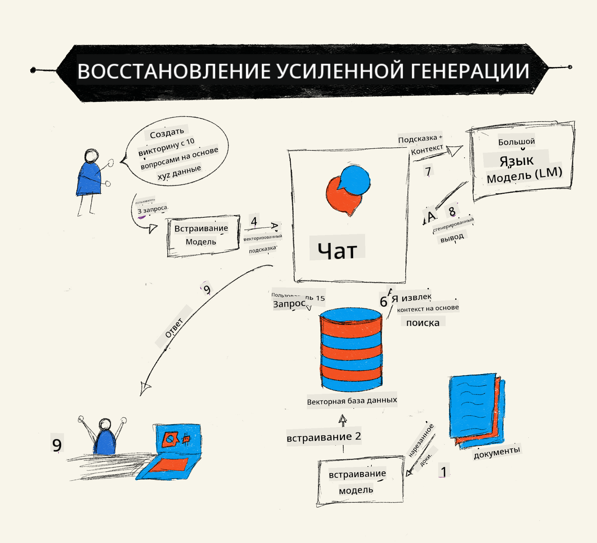
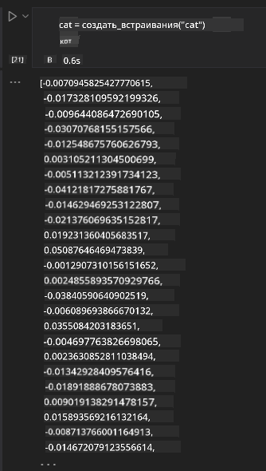

<!--
CO_OP_TRANSLATOR_METADATA:
{
  "original_hash": "e2861bbca91c0567ef32bc77fe054f9e",
  "translation_date": "2025-05-20T01:01:00+00:00",
  "source_file": "15-rag-and-vector-databases/README.md",
  "language_code": "ru"
}
-->
# Генерация с дополнением извлечением (RAG) и векторные базы данных

[](https://aka.ms/gen-ai-lesson15-gh?WT.mc_id=academic-105485-koreyst)

В уроке о поисковых приложениях мы кратко узнали, как интегрировать собственные данные в большие языковые модели (LLM). В этом уроке мы углубимся в концепции привязки ваших данных в приложении LLM, механики процесса и методы хранения данных, включая встраивания и текст.

> **Видео скоро появится**

## Введение

В этом уроке мы рассмотрим следующее:

- Введение в RAG, что это такое и почему оно используется в ИИ (искусственном интеллекте).

- Понимание, что такое векторные базы данных, и создание одной из них для нашего приложения.

- Практический пример интеграции RAG в приложение.

## Цели обучения

После завершения этого урока вы сможете:

- Объяснить значимость RAG в извлечении и обработке данных.

- Настроить приложение RAG и привязать ваши данные к LLM.

- Эффективная интеграция RAG и векторных баз данных в приложения LLM.

## Наш сценарий: улучшение наших LLM с помощью собственных данных

Для этого урока мы хотим добавить собственные заметки в образовательный стартап, который позволяет чат-боту получать больше информации по различным предметам. Используя имеющиеся у нас заметки, учащиеся смогут лучше изучать и понимать различные темы, что облегчит подготовку к экзаменам. Для создания нашего сценария мы будем использовать:

- `Azure OpenAI:` LLM, который мы будем использовать для создания нашего чат-бота

- `AI for beginners' lesson on Neural Networks`: это будут данные, на которые мы привяжем наш LLM

- `Azure AI Search` и `Azure Cosmos DB:` векторные базы данных для хранения наших данных и создания поискового индекса

Пользователи смогут создавать практические тесты из своих заметок, карточки для повторения и краткие обзоры. Чтобы начать, давайте посмотрим, что такое RAG и как это работает:

## Генерация с дополнением извлечением (RAG)

Чат-бот на основе LLM обрабатывает пользовательские запросы для генерации ответов. Он предназначен для интерактивного взаимодействия с пользователями по широкому кругу тем. Однако его ответы ограничены предоставленным контекстом и основными данными обучения. Например, знания GPT-4 ограничены сентябрем 2021 года, что означает, что ему не хватает информации о событиях, произошедших после этого периода. Кроме того, данные, используемые для обучения LLM, исключают конфиденциальную информацию, такую как личные заметки или руководство по продукту компании.

### Как работают RAG (Генерация с дополнением извлечением)



Предположим, вы хотите развернуть чат-бота, который создает тесты из ваших заметок, вам потребуется подключение к базе знаний. Здесь на помощь приходит RAG. RAG работают следующим образом:

- **База знаний:** Перед извлечением эти документы необходимо загрузить и предварительно обработать, обычно разбивая большие документы на более мелкие части, преобразуя их в текстовые встраивания и сохраняя в базе данных.

- **Запрос пользователя:** пользователь задает вопрос

- **Извлечение:** Когда пользователь задает вопрос, модель встраивания извлекает релевантную информацию из нашей базы знаний, чтобы предоставить больше контекста, который будет включен в запрос.

- **Дополненная генерация:** LLM улучшает свой ответ на основе извлеченных данных. Это позволяет сгенерированному ответу основываться не только на предварительно обученных данных, но и на релевантной информации из добавленного контекста. Извлеченные данные используются для дополнения ответов LLM. Затем LLM возвращает ответ на вопрос пользователя.


Архитектура RAG реализуется с помощью трансформеров, состоящих из двух частей: кодировщика и декодера. Например, когда пользователь задает вопрос, входной текст "кодируется" в векторы, захватывающие значение слов, и векторы "декодируются" в наш индекс документов и генерируют новый текст на основе запроса пользователя. LLM использует как модель кодировщик-декодер для генерации вывода.

Два подхода при реализации RAG в соответствии с предложенной статьей: [Генерация с дополнением извлечением для задач NLP (программное обеспечение обработки естественного языка), интенсивных по знаниям](https://arxiv.org/pdf/2005.11401.pdf?WT.mc_id=academic-105485-koreyst) это:

- **_RAG-Sequence_** использование извлеченных документов для предсказания наилучшего возможного ответа на запрос пользователя

- **RAG-Token** использование документов для генерации следующего токена, а затем их извлечение для ответа на запрос пользователя

### Зачем использовать RAG? 

- **Богатство информации:** обеспечивает актуальность и современность текстовых ответов. Таким образом, он повышает производительность в задачах, специфичных для домена, получая доступ к внутренней базе знаний.

- Снижает вымысел, используя **проверяемые данные** в базе знаний для предоставления контекста к пользовательским запросам.

- Это **экономически эффективно**, так как они более экономичны по сравнению с тонкой настройкой LLM.

## Создание базы знаний

Наше приложение основано на наших личных данных, то есть уроке о нейронных сетях в учебной программе AI For Beginners.

### Векторные базы данных

Векторная база данных, в отличие от традиционных баз данных, представляет собой специализированную базу данных, предназначенную для хранения, управления и поиска встроенных векторов. Она хранит числовые представления документов. Разбиение данных на числовые встраивания облегчает нашей системе ИИ понимание и обработку данных.

Мы храним наши встраивания в векторных базах данных, так как у LLM есть ограничение на количество токенов, которые они принимают в качестве ввода. Поскольку вы не можете передать все встраивания в LLM, нам нужно будет разбить их на части, и когда пользователь задает вопрос, встраивания, наиболее похожие на вопрос, будут возвращены вместе с запросом. Разбиение также снижает затраты на количество токенов, передаваемых через LLM.

Некоторые популярные векторные базы данных включают Azure Cosmos DB, Clarifyai, Pinecone, Chromadb, ScaNN, Qdrant и DeepLake. Вы можете создать модель Azure Cosmos DB с помощью Azure CLI с помощью следующей команды:

```bash
az login
az group create -n <resource-group-name> -l <location>
az cosmosdb create -n <cosmos-db-name> -r <resource-group-name>
az cosmosdb list-keys -n <cosmos-db-name> -g <resource-group-name>
```

### От текста к встраиваниям

Прежде чем мы сохраним наши данные, нам нужно будет преобразовать их в векторные встраивания, прежде чем они будут сохранены в базе данных. Если вы работаете с большими документами или длинными текстами, вы можете разбить их на части на основе ожидаемых запросов. Разбиение можно выполнять на уровне предложений или на уровне абзацев. Поскольку разбиение выводит значения из слов вокруг них, вы можете добавить некоторый другой контекст к части, например, добавив заголовок документа или включив некоторый текст до или после части. Вы можете разбить данные следующим образом:

```python
def split_text(text, max_length, min_length):
    words = text.split()
    chunks = []
    current_chunk = []

    for word in words:
        current_chunk.append(word)
        if len(' '.join(current_chunk)) < max_length and len(' '.join(current_chunk)) > min_length:
            chunks.append(' '.join(current_chunk))
            current_chunk = []

    # If the last chunk didn't reach the minimum length, add it anyway
    if current_chunk:
        chunks.append(' '.join(current_chunk))

    return chunks
```

После разбиения мы можем встроить наш текст с использованием различных моделей встраивания. Некоторые модели, которые вы можете использовать, включают: word2vec, ada-002 от OpenAI, Azure Computer Vision и многие другие. Выбор модели будет зависеть от языков, которые вы используете, типа кодируемого контента (текст/изображения/аудио), размера входных данных, которые она может кодировать, и длины выходного встраивания.

Пример встроенного текста с использованием модели `text-embedding-ada-002` от OpenAI:


## Извлечение и векторный поиск

Когда пользователь задает вопрос, извлекатель преобразует его в вектор с помощью кодировщика запросов, затем он ищет в нашем поисковом индексе документов релевантные векторы в документе, которые связаны с вводом. После этого он преобразует как входной вектор, так и векторы документа в текст и передает его через LLM.

### Извлечение

Извлечение происходит, когда система пытается быстро найти документы из индекса, которые удовлетворяют критериям поиска. Цель извлекателя - получить документы, которые будут использованы для предоставления контекста и привязки LLM к вашим данным.

Существует несколько способов выполнения поиска в нашей базе данных, таких как:

- **Поиск по ключевым словам** - используется для текстовых поисков

- **Семантический поиск** - использует семантическое значение слов

- **Векторный поиск** - преобразует документы из текста в векторные представления с использованием моделей встраивания. Извлечение будет выполняться путем запроса документов, чьи векторные представления наиболее близки к вопросу пользователя.

- **Гибридный** - комбинация как поиска по ключевым словам, так и векторного поиска.

Проблема с извлечением возникает, когда в базе данных нет аналогичного ответа на запрос, система тогда возвращает лучшую информацию, которую она может получить, однако вы можете использовать такие тактики, как установка максимального расстояния для релевантности или использование гибридного поиска, который сочетает как ключевые слова, так и векторный поиск. В этом уроке мы будем использовать гибридный поиск, комбинацию как векторного, так и поиска по ключевым словам. Мы будем хранить наши данные в фрейме данных с колонками, содержащими части, а также встраивания.

### Векторная схожесть

Извлекатель будет искать в базе знаний встраивания, которые находятся близко друг к другу, ближайшего соседа, так как это тексты, которые схожи. В случае, если пользователь задает запрос, он сначала встраивается, затем сопоставляется с аналогичными встраиваниями. Общая мера, которая используется для определения, насколько схожи различные векторы, это косинусная схожесть, которая основана на угле между двумя векторами.

Мы можем измерить схожесть с помощью других альтернатив, которые мы можем использовать, таких как евклидово расстояние, которое представляет собой прямую линию между конечными точками векторов, и скалярное произведение, которое измеряет сумму произведений соответствующих элементов двух векторов.

### Поисковый индекс

При выполнении извлечения нам нужно будет создать поисковый индекс для нашей базы знаний перед выполнением поиска. Индекс будет хранить наши встраивания и сможет быстро извлекать наиболее схожие части даже в большой базе данных. Мы можем создать наш индекс локально, используя:

```python
from sklearn.neighbors import NearestNeighbors

embeddings = flattened_df['embeddings'].to_list()

# Create the search index
nbrs = NearestNeighbors(n_neighbors=5, algorithm='ball_tree').fit(embeddings)

# To query the index, you can use the kneighbors method
distances, indices = nbrs.kneighbors(embeddings)
```

### Пересортировка

После запроса к базе данных вам может понадобиться отсортировать результаты от наиболее релевантных. Пересортировочный LLM использует машинное обучение для повышения релевантности результатов поиска, упорядочивая их от наиболее релевантных. Используя Azure AI Search, пересортировка выполняется автоматически для вас с использованием семантического пересортировщика. Пример того, как работает пересортировка с использованием ближайших соседей:

```python
# Find the most similar documents
distances, indices = nbrs.kneighbors([query_vector])

index = []
# Print the most similar documents
for i in range(3):
    index = indices[0][i]
    for index in indices[0]:
        print(flattened_df['chunks'].iloc[index])
        print(flattened_df['path'].iloc[index])
        print(flattened_df['distances'].iloc[index])
    else:
        print(f"Index {index} not found in DataFrame")
```

## Объединяем все вместе

Последний шаг - добавление нашего LLM в процесс, чтобы иметь возможность получать ответы, основанные на наших данных. Мы можем реализовать это следующим образом:

```python
user_input = "what is a perceptron?"

def chatbot(user_input):
    # Convert the question to a query vector
    query_vector = create_embeddings(user_input)

    # Find the most similar documents
    distances, indices = nbrs.kneighbors([query_vector])

    # add documents to query  to provide context
    history = []
    for index in indices[0]:
        history.append(flattened_df['chunks'].iloc[index])

    # combine the history and the user input
    history.append(user_input)

    # create a message object
    messages=[
        {"role": "system", "content": "You are an AI assistant that helps with AI questions."},
        {"role": "user", "content": history[-1]}
    ]

    # use chat completion to generate a response
    response = openai.chat.completions.create(
        model="gpt-4",
        temperature=0.7,
        max_tokens=800,
        messages=messages
    )

    return response.choices[0].message

chatbot(user_input)
```

## Оценка нашего приложения

### Метрики оценки

- Качество предоставленных ответов, чтобы они звучали естественно, плавно и по-человечески

- Основанность данных: оценка, пришел ли ответ из предоставленных документов

- Релевантность: оценка, соответствует ли ответ и связан ли он с заданным вопросом

- Грамматическая правильность - делает ли ответ смысл грамматически

## Примеры использования RAG (Генерация с дополнением извлечением) и векторных баз данных

Существует множество различных случаев использования, когда вызовы функций могут улучшить ваше приложение, например:

- Вопросы и ответы: привязка данных вашей компании к чату, который могут использовать сотрудники для задавания вопросов.

- Рекомендательные системы: где вы можете создать систему, которая сопоставляет наиболее схожие значения, например, фильмы, рестораны и многое другое.

- Услуги чат-ботов: вы можете хранить историю чата и персонализировать разговор на основе данных пользователя.

- Поиск изображений на основе векторных встраиваний, полезный при распознавании изображений и обнаружении аномалий.

## Резюме

Мы рассмотрели основные области RAG от добавления наших данных в приложение до пользовательского запроса и вывода. Чтобы упростить создание RAG, вы можете использовать такие фреймворки, как Semanti Kernel, Langchain или Autogen.

## Задание

Для продолжения обучения Генерации с дополнением извлечением (RAG) вы можете создать:

- Создать интерфейс для приложения, используя выбранный вами фреймворк

- Использовать фреймворк, например LangChain или Semantic Kernel, и воссоздать ваше приложение.

Поздравляем с завершением урока 👏.

## Обучение на этом не заканчивается, продолжайте путешествие

После завершения этого урока ознакомьтесь с нашей [Коллекцией обучения генеративному ИИ](https://aka.ms/genai-collection?WT.mc_id=academic-105485-koreyst), чтобы продолжить повышать свои знания в области генеративного ИИ!

**Отказ от ответственности**:  
Этот документ был переведен с использованием службы автоматического перевода [Co-op Translator](https://github.com/Azure/co-op-translator). Хотя мы стремимся к точности, пожалуйста, учитывайте, что автоматизированные переводы могут содержать ошибки или неточности. Оригинальный документ на его родном языке должен считаться авторитетным источником. Для получения критически важной информации рекомендуется профессиональный перевод человеком. Мы не несем ответственности за любые недоразумения или неправильные толкования, возникающие в результате использования этого перевода.