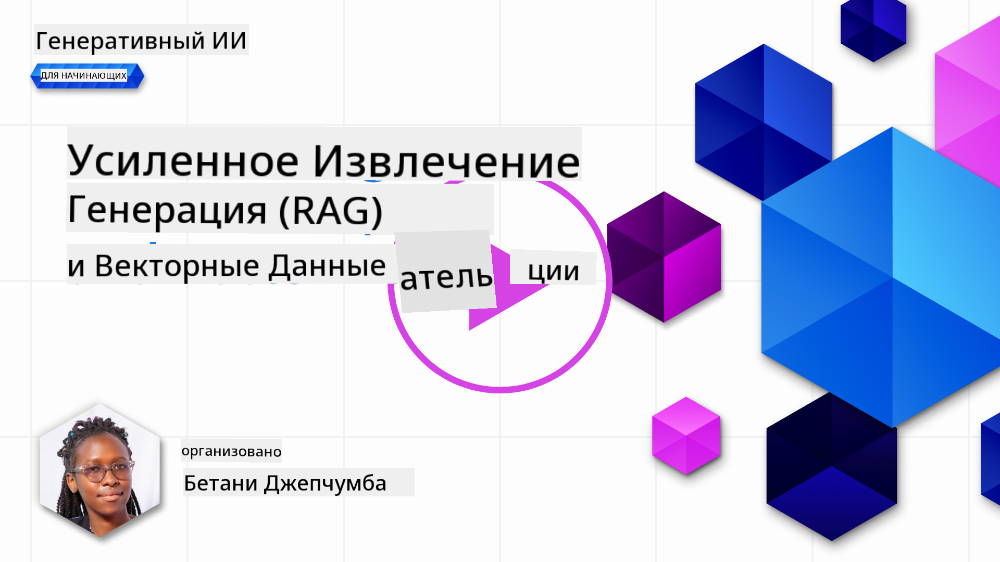
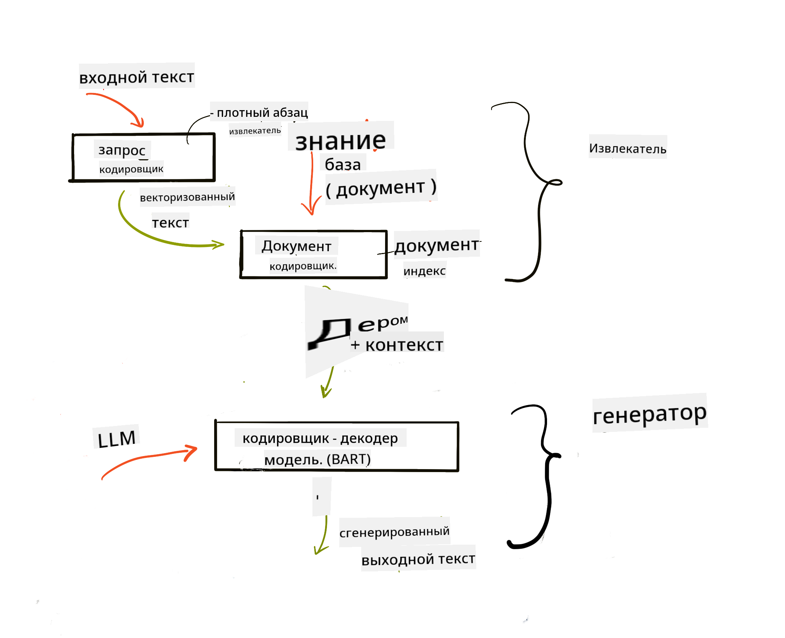
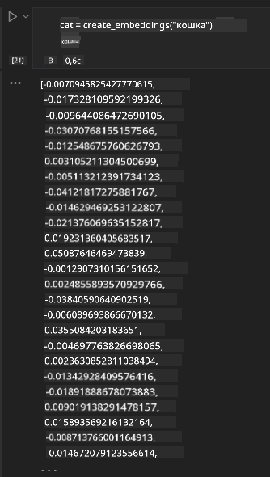

<!--
CO_OP_TRANSLATOR_METADATA:
{
  "original_hash": "b4b0266fbadbba7ded891b6485adc66d",
  "translation_date": "2025-10-17T15:04:35+00:00",
  "source_file": "15-rag-and-vector-databases/README.md",
  "language_code": "ru"
}
-->
# Генерация с дополнением извлечения (RAG) и векторные базы данных

[](https://youtu.be/4l8zhHUBeyI?si=BmvDmL1fnHtgQYkL)

В уроке о поисковых приложениях мы кратко рассмотрели, как интегрировать собственные данные в модели больших языков (LLMs). В этом уроке мы углубимся в концепции привязки данных к вашему приложению LLM, механизмы процесса и методы хранения данных, включая как эмбеддинги, так и текст.

> **Видео скоро появится**

## Введение

В этом уроке мы рассмотрим следующее:

- Введение в RAG: что это такое и почему оно используется в искусственном интеллекте (AI).

- Понимание, что такое векторные базы данных, и создание одной для нашего приложения.

- Практический пример интеграции RAG в приложение.

## Цели обучения

После завершения этого урока вы сможете:

- Объяснить значимость RAG в извлечении и обработке данных.

- Настроить приложение RAG и привязать свои данные к LLM.

- Эффективно интегрировать RAG и векторные базы данных в приложения LLM.

## Наш сценарий: улучшение LLM с помощью собственных данных

В этом уроке мы хотим добавить собственные заметки в образовательный стартап, чтобы чат-бот мог предоставлять больше информации по различным предметам. Используя наши заметки, учащиеся смогут лучше изучать материал и понимать различные темы, что облегчит подготовку к экзаменам. Для создания нашего сценария мы будем использовать:

- `Azure OpenAI:` LLM, который мы будем использовать для создания нашего чат-бота.

- `Урок для начинающих по нейронным сетям:` это будут данные, на которых мы привяжем наш LLM.

- `Azure AI Search` и `Azure Cosmos DB:` векторная база данных для хранения наших данных и создания поискового индекса.

Пользователи смогут создавать тренировочные тесты из своих заметок, карточки для повторения и краткие резюме. Чтобы начать, давайте рассмотрим, что такое RAG и как он работает:

## Генерация с дополнением извлечения (RAG)

Чат-бот на основе LLM обрабатывает запросы пользователей для генерации ответов. Он предназначен для взаимодействия и общения с пользователями на широкий спектр тем. Однако его ответы ограничены предоставленным контекстом и базовыми данными обучения. Например, GPT-4 имеет ограничение знаний на сентябрь 2021 года, что означает, что он не знает о событиях, произошедших после этого периода. Кроме того, данные, использованные для обучения LLM, исключают конфиденциальную информацию, такую как личные заметки или руководство по продукту компании.

### Как работают RAG (Генерация с дополнением извлечения)


Предположим, вы хотите развернуть чат-бота, который создает тесты из ваших заметок, вам потребуется подключение к базе знаний. Здесь на помощь приходит RAG. RAG работает следующим образом:

- **База знаний:** Перед извлечением документы необходимо загрузить и предварительно обработать, обычно разбивая большие документы на более мелкие части, преобразовывая их в текстовые эмбеддинги и сохраняя в базе данных.

- **Запрос пользователя:** пользователь задает вопрос.

- **Извлечение:** Когда пользователь задает вопрос, модель эмбеддинга извлекает релевантную информацию из нашей базы знаний, чтобы предоставить больше контекста, который будет включен в запрос.

- **Дополненная генерация:** LLM улучшает свой ответ на основе извлеченных данных. Это позволяет сгенерированному ответу быть основанным не только на предварительно обученных данных, но и на релевантной информации из добавленного контекста. Извлеченные данные используются для дополнения ответов LLM. Затем LLM возвращает ответ на вопрос пользователя.



Архитектура RAG реализуется с использованием трансформеров, состоящих из двух частей: кодировщика и декодировщика. Например, когда пользователь задает вопрос, входной текст "кодируется" в векторы, которые захватывают значение слов, а затем векторы "декодируются" в наш индекс документов и генерируют новый текст на основе запроса пользователя. LLM использует модель кодировщика-декодировщика для генерации результата.

Два подхода к реализации RAG, согласно предложенной статье: [Retrieval-Augmented Generation for Knowledge intensive NLP (natural language processing software) Tasks](https://arxiv.org/pdf/2005.11401.pdf?WT.mc_id=academic-105485-koreyst):

- **_RAG-Sequence_** использует извлеченные документы для предсказания наилучшего возможного ответа на запрос пользователя.

- **RAG-Token** использует документы для генерации следующего токена, затем извлекает их для ответа на запрос пользователя.

### Зачем использовать RAG? 

- **Информационная насыщенность:** обеспечивает актуальность и современность текстовых ответов. Таким образом, повышается производительность на задачах, специфичных для определенной области, благодаря доступу к внутренней базе знаний.

- Снижает вероятность ошибок, используя **проверяемые данные** из базы знаний для предоставления контекста к запросам пользователей.

- Это **экономически выгодно**, так как они более экономичны по сравнению с тонкой настройкой LLM.

## Создание базы знаний

Наше приложение основано на наших личных данных, а именно на уроке о нейронных сетях из учебной программы AI For Beginners.

### Векторные базы данных

В отличие от традиционных баз данных, векторная база данных — это специализированная база данных, предназначенная для хранения, управления и поиска эмбеддингов. Она хранит числовые представления документов. Разбиение данных на числовые эмбеддинги упрощает понимание и обработку данных нашей системой AI.

Мы храним наши эмбеддинги в векторных базах данных, так как LLM имеют ограничение на количество токенов, которые они принимают в качестве входных данных. Поскольку невозможно передать все эмбеддинги в LLM, нам нужно будет разбить их на части, и когда пользователь задает вопрос, эмбеддинги, наиболее похожие на вопрос, будут возвращены вместе с запросом. Разбиение также снижает затраты на количество токенов, передаваемых через LLM.

Некоторые популярные векторные базы данных включают Azure Cosmos DB, Clarifyai, Pinecone, Chromadb, ScaNN, Qdrant и DeepLake. Вы можете создать модель Azure Cosmos DB с помощью Azure CLI, используя следующую команду:

```bash
az login
az group create -n <resource-group-name> -l <location>
az cosmosdb create -n <cosmos-db-name> -r <resource-group-name>
az cosmosdb list-keys -n <cosmos-db-name> -g <resource-group-name>
```

### От текста к эмбеддингам

Перед тем как сохранить наши данные, нам нужно преобразовать их в векторные эмбеддинги перед сохранением в базе данных. Если вы работаете с большими документами или длинными текстами, вы можете разбить их на части, основываясь на ожидаемых запросах. Разбиение можно выполнять на уровне предложений или абзацев. Поскольку разбиение извлекает значения из слов вокруг них, вы можете добавить некоторый контекст к части, например, добавив заголовок документа или включив текст до или после части. Разбиение данных можно выполнить следующим образом:

```python
def split_text(text, max_length, min_length):
    words = text.split()
    chunks = []
    current_chunk = []

    for word in words:
        current_chunk.append(word)
        if len(' '.join(current_chunk)) < max_length and len(' '.join(current_chunk)) > min_length:
            chunks.append(' '.join(current_chunk))
            current_chunk = []

    # If the last chunk didn't reach the minimum length, add it anyway
    if current_chunk:
        chunks.append(' '.join(current_chunk))

    return chunks
```

После разбиения мы можем затем преобразовать наш текст в эмбеддинги, используя различные модели эмбеддинга. Некоторые модели, которые можно использовать, включают: word2vec, ada-002 от OpenAI, Azure Computer Vision и многие другие. Выбор модели будет зависеть от используемых языков, типа кодируемого контента (текст/изображения/аудио), размера входных данных, которые она может кодировать, и длины выходного эмбеддинга.

Пример векторного представления текста с использованием модели OpenAI `text-embedding-ada-002`:


## Извлечение и векторный поиск

Когда пользователь задает вопрос, извлекатель преобразует его в вектор с помощью кодировщика запросов, затем ищет в нашем индексе документов релевантные векторы, связанные с запросом. После этого он преобразует как входной вектор, так и векторы документов в текст и передает их через LLM.

### Извлечение

Извлечение происходит, когда система пытается быстро найти документы из индекса, которые соответствуют критериям поиска. Цель извлекателя — получить документы, которые будут использованы для предоставления контекста и привязки LLM к вашим данным.

Существует несколько способов выполнения поиска в нашей базе данных, таких как:

- **Поиск по ключевым словам** - используется для текстовых поисков.

- **Семантический поиск** - использует семантическое значение слов.

- **Векторный поиск** - преобразует документы из текста в векторные представления с использованием моделей эмбеддинга. Извлечение выполняется путем запроса документов, векторные представления которых наиболее близки к вопросу пользователя.

- **Гибридный поиск** - комбинация поиска по ключевым словам и векторного поиска.

Проблема с извлечением возникает, когда в базе данных нет похожего ответа на запрос, система тогда возвращает лучшую информацию, которую она может найти. Однако вы можете использовать такие тактики, как установка максимального расстояния для релевантности или использование гибридного поиска, который сочетает поиск по ключевым словам и векторный поиск. В этом уроке мы будем использовать гибридный поиск, комбинацию векторного и поиска по ключевым словам. Мы будем хранить наши данные в датафрейме с колонками, содержащими части текста, а также эмбеддинги.

### Векторное сходство

Извлекатель будет искать в базе знаний эмбеддинги, которые находятся близко друг к другу, ближайшего соседа, так как это тексты, которые схожи. В случае, если пользователь задает запрос, он сначала преобразуется в вектор, а затем сопоставляется с похожими эмбеддингами. Общая мера, используемая для определения степени сходства различных векторов, — косинусное сходство, которое основано на угле между двумя векторами.

Мы можем измерить сходство, используя другие альтернативы, такие как евклидово расстояние, которое представляет собой прямую линию между конечными точками векторов, и скалярное произведение, которое измеряет сумму произведений соответствующих элементов двух векторов.

### Поисковый индекс

При выполнении извлечения нам нужно будет построить поисковый индекс для нашей базы знаний перед выполнением поиска. Индекс будет хранить наши эмбеддинги и сможет быстро извлекать наиболее похожие части даже из большой базы данных. Мы можем создать наш индекс локально, используя:

```python
from sklearn.neighbors import NearestNeighbors

embeddings = flattened_df['embeddings'].to_list()

# Create the search index
nbrs = NearestNeighbors(n_neighbors=5, algorithm='ball_tree').fit(embeddings)

# To query the index, you can use the kneighbors method
distances, indices = nbrs.kneighbors(embeddings)
```

### Пересортировка

После выполнения запроса к базе данных может потребоваться отсортировать результаты от наиболее релевантных. LLM для пересортировки использует машинное обучение для улучшения релевантности результатов поиска, упорядочивая их от наиболее релевантных. Используя Azure AI Search, пересортировка выполняется автоматически с помощью семантического пересортировщика. Пример того, как работает пересортировка с использованием ближайших соседей:

```python
# Find the most similar documents
distances, indices = nbrs.kneighbors([query_vector])

index = []
# Print the most similar documents
for i in range(3):
    index = indices[0][i]
    for index in indices[0]:
        print(flattened_df['chunks'].iloc[index])
        print(flattened_df['path'].iloc[index])
        print(flattened_df['distances'].iloc[index])
    else:
        print(f"Index {index} not found in DataFrame")
```

## Объединение всех элементов

Последний шаг — добавление нашего LLM в процесс, чтобы получать ответы, основанные на наших данных. Мы можем реализовать это следующим образом:

```python
user_input = "what is a perceptron?"

def chatbot(user_input):
    # Convert the question to a query vector
    query_vector = create_embeddings(user_input)

    # Find the most similar documents
    distances, indices = nbrs.kneighbors([query_vector])

    # add documents to query  to provide context
    history = []
    for index in indices[0]:
        history.append(flattened_df['chunks'].iloc[index])

    # combine the history and the user input
    history.append(user_input)

    # create a message object
    messages=[
        {"role": "system", "content": "You are an AI assistant that helps with AI questions."},
        {"role": "user", "content": history[-1]}
    ]

    # use chat completion to generate a response
    response = openai.chat.completions.create(
        model="gpt-4",
        temperature=0.7,
        max_tokens=800,
        messages=messages
    )

    return response.choices[0].message

chatbot(user_input)
```

## Оценка нашего приложения

### Метрики оценки

- Качество предоставленных ответов, чтобы они звучали естественно, бегло и по-человечески.

- Привязка данных: оценка того, пришел ли ответ из предоставленных документов.

- Релевантность: оценка того, соответствует ли ответ вопросу и связан ли с ним.

- Беглость: проверка грамматической правильности ответа.

## Примеры использования RAG (Генерация с дополнением извлечения) и векторных баз данных

Существует множество различных примеров использования, где вызовы функций могут улучшить ваше приложение, например:

- Вопросы и ответы: привязка данных вашей компании к чату, который сотрудники могут использовать для задавания вопросов.

- Рекомендательные системы: создание системы, которая сопоставляет наиболее похожие значения, например фильмы, рестораны и многое другое.

- Сервисы чат-ботов: вы можете сохранять историю чатов и персонализировать разговор на основе данных пользователя.

- Поиск изображений на основе векторных эмбеддингов, полезный при распознавании изображений и обнаружении аномалий.

## Резюме

Мы рассмотрели основные аспекты RAG, начиная с добавления наших данных в приложение, запроса пользователя и вывода. Чтобы упростить создание RAG, вы можете использовать такие фреймворки, как Semantic Kernel, Langchain или Autogen.

## Задание

Чтобы продолжить изучение Генерации с дополнением извлечения (RAG), вы можете:

- Создать фронтенд для приложения, используя выбранный вами фреймворк.

- Использовать фреймворк, например LangChain или Semantic Kernel, и воссоздать ваше приложение.

Поздравляем с завершением урока 👏.

## Обучение не заканчивается здесь, продолжайте свой путь

После завершения этого урока ознакомьтесь с нашей [коллекцией обучения генеративному AI](https://aka.ms/genai-collection?WT.mc_id=academic-105485-koreyst), чтобы продолжить углублять свои знания о генеративном AI!

---

**Отказ от ответственности**:  
Этот документ был переведен с использованием сервиса автоматического перевода [Co-op Translator](https://github.com/Azure/co-op-translator). Хотя мы стремимся к точности, пожалуйста, учитывайте, что автоматические переводы могут содержать ошибки или неточности. Оригинальный документ на его родном языке следует считать авторитетным источником. Для получения критически важной информации рекомендуется профессиональный перевод человеком. Мы не несем ответственности за любые недоразумения или неправильные интерпретации, возникающие в результате использования данного перевода.