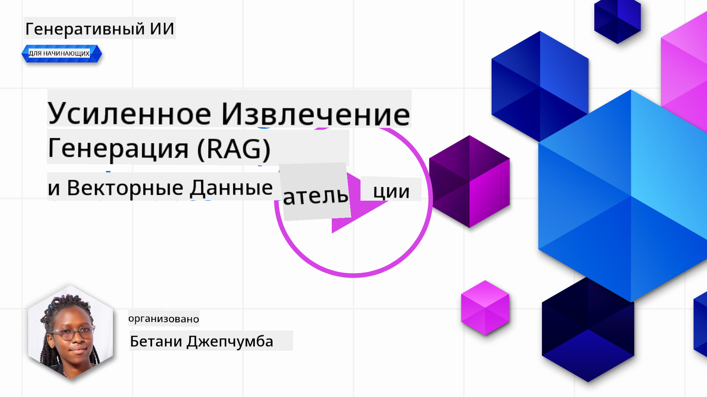
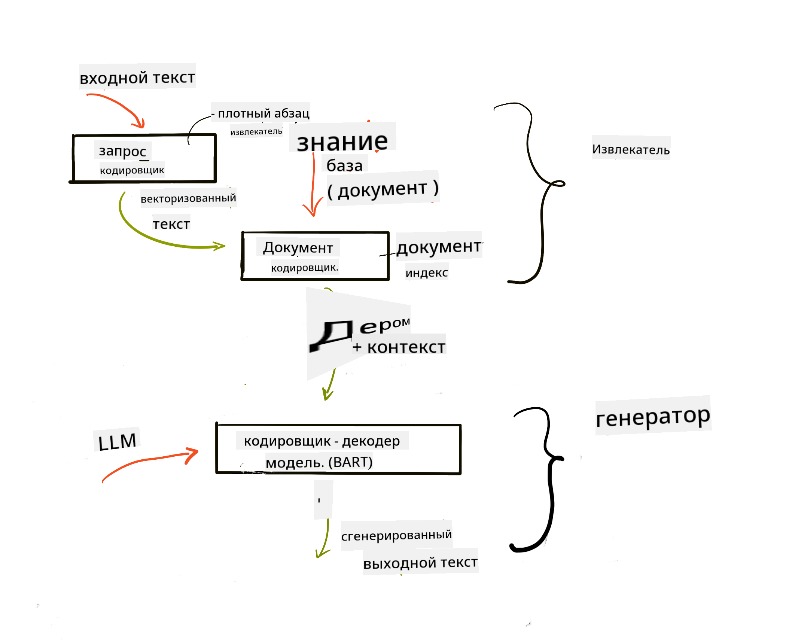
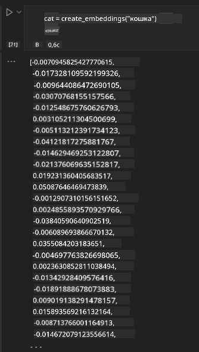

<!--
CO_OP_TRANSLATOR_METADATA:
{
  "original_hash": "e2861bbca91c0567ef32bc77fe054f9e",
  "translation_date": "2025-06-25T22:16:56+00:00",
  "source_file": "15-rag-and-vector-databases/README.md",
  "language_code": "ru"
}
-->
# Генерация с дополнением извлечением (RAG) и векторные базы данных

[](https://aka.ms/gen-ai-lesson15-gh?WT.mc_id=academic-105485-koreyst)

В уроке по поисковым приложениям мы кратко изучили, как интегрировать ваши собственные данные в большие языковые модели (LLM). В этом уроке мы углубимся в концепции заземления ваших данных в вашем LLM-приложении, механики процесса и методы хранения данных, включая как встраивания, так и текст.

> **Видео скоро появится**

## Введение

В этом уроке мы рассмотрим следующее:

- Введение в RAG, что это такое и почему оно используется в искусственном интеллекте (ИИ).

- Понимание, что такое векторные базы данных, и создание одной для нашего приложения.

- Практический пример интеграции RAG в приложение.

## Цели обучения

После завершения этого урока вы сможете:

- Объяснить значение RAG в извлечении и обработке данных.

- Настроить приложение RAG и заземлить ваши данные в LLM.

- Эффективная интеграция RAG и векторных баз данных в приложения LLM.

## Наш сценарий: улучшение наших LLM с помощью наших собственных данных

Для этого урока мы хотим добавить наши собственные заметки в образовательный стартап, что позволит чат-боту получить больше информации по разным предметам. Используя наши заметки, учащиеся смогут лучше изучать и понимать разные темы, что облегчит подготовку к экзаменам. Для создания нашего сценария мы будем использовать:

- `Azure OpenAI:` LLM, который мы будем использовать для создания нашего чат-бота

- `AI for beginners' lesson on Neural Networks`: это будут данные, на которых мы заземлим наш LLM

- `Azure AI Search` и `Azure Cosmos DB:` векторная база данных для хранения наших данных и создания поискового индекса

Пользователи смогут создавать практические тесты из своих заметок, карточки для повторения и кратко их резюмировать. Чтобы начать, давайте посмотрим, что такое RAG и как это работает:

## Генерация с дополнением извлечением (RAG)

Чат-бот, работающий на LLM, обрабатывает пользовательские запросы для генерации ответов. Он разработан для интерактивности и взаимодействия с пользователями по широкому кругу тем. Однако его ответы ограничены предоставленным контекстом и его основными обучающими данными. Например, отсечка знаний GPT-4 — сентябрь 2021 года, что означает, что он не имеет знаний о событиях, произошедших после этого периода. Кроме того, данные, используемые для обучения LLM, исключают конфиденциальную информацию, такую как личные заметки или руководство по продукту компании.

### Как работают RAG (Генерация с дополнением извлечением)


Предположим, вы хотите развернуть чат-бота, который создает тесты из ваших заметок, вам потребуется подключение к базе знаний. Здесь на помощь приходит RAG. RAG работают следующим образом:

- **База знаний:** Перед извлечением эти документы необходимо загрузить и предварительно обработать, обычно разбивая большие документы на более мелкие части, преобразуя их в текстовые встраивания и сохраняя их в базе данных.

- **Запрос пользователя:** пользователь задает вопрос

- **Извлечение:** Когда пользователь задает вопрос, модель встраивания извлекает релевантную информацию из нашей базы знаний, чтобы предоставить больше контекста, который будет включен в запрос.

- **Дополненная генерация:** LLM улучшает свой ответ на основе извлеченных данных. Это позволяет сгенерированному ответу основываться не только на предварительно обученных данных, но и на релевантной информации из добавленного контекста. Извлеченные данные используются для дополнения ответов LLM. Затем LLM возвращает ответ на вопрос пользователя.



Архитектура RAG реализована с использованием трансформеров, состоящих из двух частей: энкодера и декодера. Например, когда пользователь задает вопрос, входной текст "кодируется" в вектора, захватывающие значение слов, и вектора "декодируются" в наш индекс документов и генерируют новый текст на основе пользовательского запроса. LLM использует как модель энкодера-декодера для генерации вывода.

Два подхода при реализации RAG согласно предложенной статье: [Генерация с дополнением извлечением для задач NLP (программное обеспечение обработки естественного языка) с интенсивным использованием знаний](https://arxiv.org/pdf/2005.11401.pdf?WT.mc_id=academic-105485-koreyst) это:

- **_RAG-Sequence_** использование извлеченных документов для предсказания наилучшего возможного ответа на пользовательский запрос

- **RAG-Token** использование документов для генерации следующего токена, а затем их извлечение для ответа на запрос пользователя

### Почему стоит использовать RAG? 

- **Информационная насыщенность:** обеспечивает актуальность и современность текстовых ответов. Это, следовательно, улучшает производительность в задачах, специфичных для домена, благодаря доступу к внутренней базе знаний.

- Уменьшает вымысел, используя **проверяемые данные** в базе знаний для предоставления контекста к пользовательским запросам.

- Это **экономически эффективно**, так как они более экономичны по сравнению с тонкой настройкой LLM

## Создание базы знаний

Наше приложение основано на наших личных данных, то есть уроке по нейронным сетям в учебной программе AI For Beginners.

### Векторные базы данных

Векторная база данных, в отличие от традиционных баз данных, — это специализированная база данных, предназначенная для хранения, управления и поиска встроенных векторов. Она хранит числовые представления документов. Разбиение данных на числовые встраивания упрощает понимание и обработку данных нашей системой ИИ.

Мы храним наши встраивания в векторных базах данных, так как LLM имеют ограничение на количество токенов, которые они принимают на вход. Поскольку вы не можете передать все встраивания в LLM, нам нужно будет разбить их на части, и когда пользователь задает вопрос, встраивания, наиболее похожие на вопрос, будут возвращены вместе с запросом. Разбиение также снижает затраты на количество токенов, проходящих через LLM.

Некоторые популярные векторные базы данных включают Azure Cosmos DB, Clarifyai, Pinecone, Chromadb, ScaNN, Qdrant и DeepLake. Вы можете создать модель Azure Cosmos DB, используя Azure CLI с помощью следующей команды:

```bash
az login
az group create -n <resource-group-name> -l <location>
az cosmosdb create -n <cosmos-db-name> -r <resource-group-name>
az cosmosdb list-keys -n <cosmos-db-name> -g <resource-group-name>
```

### От текста к встраиваниям

Прежде чем мы сохраним наши данные, нам нужно будет преобразовать их в векторные встраивания перед сохранением в базе данных. Если вы работаете с большими документами или длинными текстами, вы можете разбить их на части на основе ожидаемых запросов. Разбиение может быть выполнено на уровне предложения или на уровне абзаца. Поскольку разбиение извлекает значения из слов вокруг них, вы можете добавить некоторый другой контекст к части, например, добавив заголовок документа или включив некоторый текст до или после части. Вы можете разбить данные следующим образом:

```python
def split_text(text, max_length, min_length):
    words = text.split()
    chunks = []
    current_chunk = []

    for word in words:
        current_chunk.append(word)
        if len(' '.join(current_chunk)) < max_length and len(' '.join(current_chunk)) > min_length:
            chunks.append(' '.join(current_chunk))
            current_chunk = []

    # If the last chunk didn't reach the minimum length, add it anyway
    if current_chunk:
        chunks.append(' '.join(current_chunk))

    return chunks
```

После разбиения мы можем встроить наш текст, используя различные модели встраивания. Некоторые модели, которые вы можете использовать, включают: word2vec, ada-002 от OpenAI, Azure Computer Vision и многие другие. Выбор модели для использования будет зависеть от языков, которые вы используете, типа кодируемого контента (текст/изображения/аудио), размера входных данных, которые она может кодировать, и длины выходного встраивания.

Пример встроенного текста с использованием модели OpenAI `text-embedding-ada-002`:


## Извлечение и векторный поиск

Когда пользователь задает вопрос, извлекатель преобразует его в вектор с помощью кодировщика запросов, затем ищет в нашем индексе поиска документов релевантные вектора в документе, которые связаны с входными данными. После этого он преобразует как входной вектор, так и вектора документов в текст и передает его через LLM.

### Извлечение

Извлечение происходит, когда система пытается быстро найти документы из индекса, которые соответствуют критериям поиска. Цель извлекателя — получить документы, которые будут использоваться для предоставления контекста и заземления LLM на ваших данных.

Существует несколько способов выполнения поиска в нашей базе данных, таких как:

- **Поиск по ключевым словам** - используется для текстовых поисков

- **Семантический поиск** - использует семантическое значение слов

- **Векторный поиск** - преобразует документы из текста в векторные представления с использованием моделей встраивания. Извлечение будет выполнено путем запроса документов, векторные представления которых наиболее близки к пользовательскому вопросу.

- **Гибридный** - сочетание как поиска по ключевым словам, так и векторного поиска.

Проблема с извлечением возникает, когда в базе данных нет аналогичного ответа на запрос, система тогда вернет лучшую информацию, которую они могут получить, однако, вы можете использовать тактики, такие как установка максимального расстояния для релевантности или использование гибридного поиска, который сочетает как ключевые слова, так и векторный поиск. В этом уроке мы будем использовать гибридный поиск, сочетание как векторного, так и поиска по ключевым словам. Мы будем хранить наши данные в датафрейме с колонками, содержащими части, а также встраивания.

### Векторное сходство

Извлекатель будет искать в базе знаний встраивания, которые близки друг к другу, ближайшего соседа, так как они являются текстами, которые похожи. В сценарии, когда пользователь задает запрос, он сначала встраивается, а затем сопоставляется с похожими встраиваниями. Общим измерением, используемым для определения, насколько похожи разные вектора, является косинусное сходство, основанное на угле между двумя векторами.

Мы можем измерить сходство, используя другие альтернативы, такие как евклидово расстояние, которое является прямой линией между конечными точками векторов, и скалярное произведение, которое измеряет сумму произведений соответствующих элементов двух векторов.

### Поисковый индекс

При выполнении извлечения нам нужно будет создать поисковый индекс для нашей базы знаний, прежде чем мы выполним поиск. Индекс будет хранить наши встраивания и может быстро извлекать наиболее похожие части даже в большой базе данных. Мы можем создать наш индекс локально, используя:

```python
from sklearn.neighbors import NearestNeighbors

embeddings = flattened_df['embeddings'].to_list()

# Create the search index
nbrs = NearestNeighbors(n_neighbors=5, algorithm='ball_tree').fit(embeddings)

# To query the index, you can use the kneighbors method
distances, indices = nbrs.kneighbors(embeddings)
```

### Пересортировка

После запроса базы данных вам может понадобиться отсортировать результаты от наиболее релевантных. Пересортировочный LLM использует машинное обучение для улучшения релевантности результатов поиска, упорядочивая их от наиболее релевантных. Используя Azure AI Search, пересортировка выполняется автоматически для вас с использованием семантического пересортировщика. Пример того, как работает пересортировка с использованием ближайших соседей:

```python
# Find the most similar documents
distances, indices = nbrs.kneighbors([query_vector])

index = []
# Print the most similar documents
for i in range(3):
    index = indices[0][i]
    for index in indices[0]:
        print(flattened_df['chunks'].iloc[index])
        print(flattened_df['path'].iloc[index])
        print(flattened_df['distances'].iloc[index])
    else:
        print(f"Index {index} not found in DataFrame")
```

## Объединение всех компонентов

Последний шаг — добавление нашего LLM в процесс, чтобы получить ответы, основанные на наших данных. Мы можем реализовать это следующим образом:

```python
user_input = "what is a perceptron?"

def chatbot(user_input):
    # Convert the question to a query vector
    query_vector = create_embeddings(user_input)

    # Find the most similar documents
    distances, indices = nbrs.kneighbors([query_vector])

    # add documents to query  to provide context
    history = []
    for index in indices[0]:
        history.append(flattened_df['chunks'].iloc[index])

    # combine the history and the user input
    history.append(user_input)

    # create a message object
    messages=[
        {"role": "system", "content": "You are an AI assistant that helps with AI questions."},
        {"role": "user", "content": history[-1]}
    ]

    # use chat completion to generate a response
    response = openai.chat.completions.create(
        model="gpt-4",
        temperature=0.7,
        max_tokens=800,
        messages=messages
    )

    return response.choices[0].message

chatbot(user_input)
```

## Оценка нашего приложения

### Метрики оценки

- Качество предоставленных ответов, обеспечивающее их естественность, плавность и человечность

- Заземленность данных: оценка того, пришел ли ответ из предоставленных документов

- Релевантность: оценка того, насколько ответ соответствует и связан с заданным вопросом

- Грамотность - соответствует ли ответ грамматически

## Примеры использования RAG (Генерация с дополнением извлечением) и векторных баз данных

Существует множество различных примеров использования, где вызовы функций могут улучшить ваше приложение, такие как:

- Вопросы и ответы: заземление данных вашей компании в чат, который могут использовать сотрудники для задавания вопросов.

- Системы рекомендаций: где вы можете создать систему, которая сопоставляет наиболее похожие значения, например, фильмы, рестораны и многое другое.

- Услуги чат-ботов: вы можете хранить историю чатов и персонализировать разговор на основе пользовательских данных.

- Поиск изображений на основе векторных встраиваний, полезный при распознавании изображений и обнаружении аномалий.

## Резюме

Мы рассмотрели основные области RAG от добавления наших данных в приложение до пользовательского запроса и вывода. Чтобы упростить создание RAG, вы можете использовать такие фреймворки, как Semanti Kernel, Langchain или Autogen.

## Задание

Чтобы продолжить изучение Генерации с дополнением извлечением (RAG), вы можете построить:

- Создать интерфейс для приложения, используя фреймворк на ваш выбор

- Использовать фреймворк, такой как LangChain или Semantic Kernel, и воссоздать ваше приложение.

Поздравляем с завершением урока 👏.

## Обучение на этом не заканчивается, продолжайте путешествие

После завершения этого урока ознакомьтесь с нашей [коллекцией обучения генеративному ИИ](https://aka.ms/genai-collection?WT.mc_id=academic-105485-koreyst), чтобы продолжить повышение уровня ваших знаний в области генеративного ИИ!

**Отказ от ответственности**:  
Этот документ был переведен с помощью AI-сервиса перевода [Co-op Translator](https://github.com/Azure/co-op-translator). Хотя мы стремимся к точности, пожалуйста, учитывайте, что автоматические переводы могут содержать ошибки или неточности. Оригинальный документ на его родном языке должен считаться авторитетным источником. Для получения критически важной информации рекомендуется профессиональный перевод человеком. Мы не несем ответственности за любые недоразумения или неправильные толкования, возникшие в результате использования этого перевода.