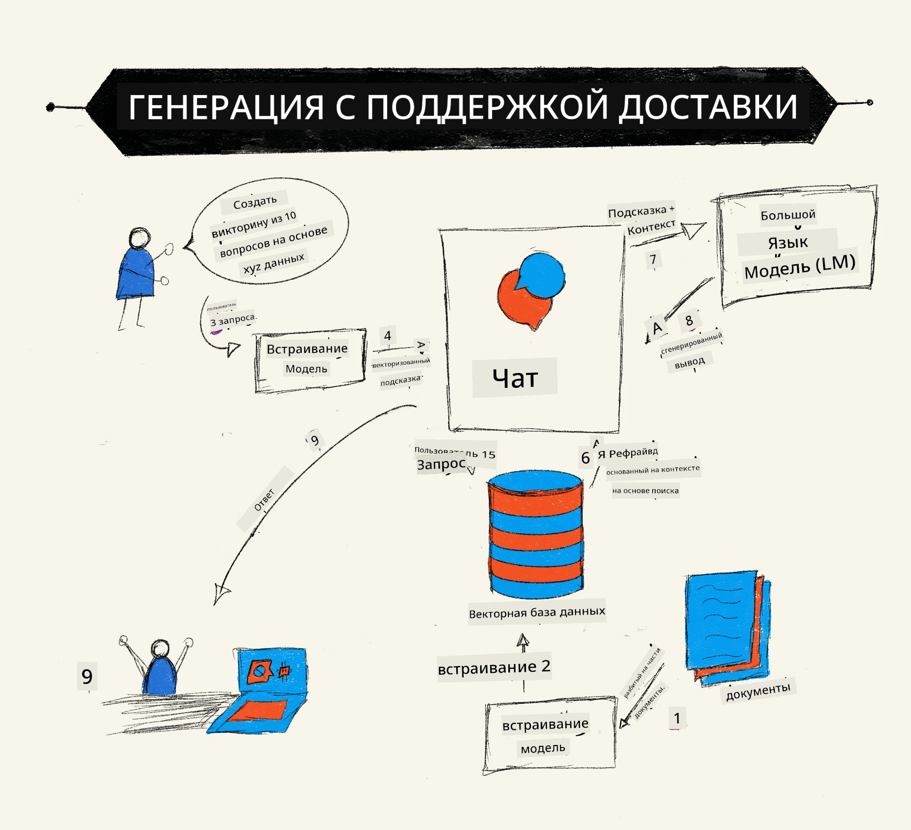
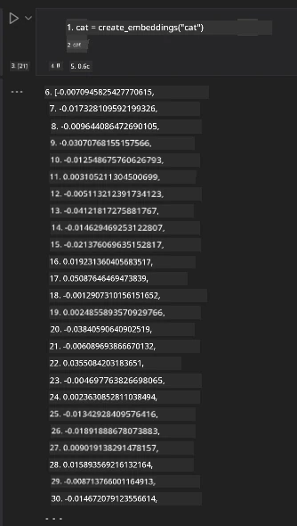

# Генерация с расширением поиска (RAG) и векторные базы данных

[](https://youtu.be/4l8zhHUBeyI?si=BmvDmL1fnHtgQYkL)

В уроке по поисковым приложениям мы кратко рассмотрели, как интегрировать ваши собственные данные в большие языковые модели (LLM). В этом уроке мы углубимся в понятия закрепления ваших данных в LLM-приложениях, механику процесса и методы хранения данных, включая как встраивания, так и текст.

> **Видео скоро будет**

## Введение

В этом уроке мы рассмотрим следующее:

- Введение в RAG: что это такое и почему оно используется в искусственном интеллекте (ИИ).

- Понимание того, что такое векторные базы данных и создание одной для нашего приложения.

- Практический пример интеграции RAG в приложение.

## Цели обучения

Закончив этот урок, вы сможете:

- Объяснить значение RAG в извлечении и обработке данных.

- Настроить приложение RAG и закрепить ваши данные на LLM.

- Эффективно интегрировать RAG и векторные базы данных в LLM-приложения.

## Наш сценарий: расширение LLM собственными данными

В этом уроке мы хотим добавить собственные заметки в образовательный стартап, что позволит чат-боту получать больше информации по разным предметам. Используя имеющиеся заметки, обучающиеся смогут лучше учиться и понимать различные темы, что облегчит подготовку к экзаменам. Для создания нашего сценария мы будем использовать:

- `Azure OpenAI:` LLM, который мы используем для создания нашего чат-бота

- `Урок «ИИ для начинающих» по нейронным сетям`: это будут данные, на которых мы основываем наш LLM

- `Azure AI Search` и `Azure Cosmos DB:` векторная база данных для хранения данных и создания поискового индекса

Пользователи смогут создавать практические викторины из заметок, карточки для повторения и кратко их обобщать. Для начала посмотрим, что такое RAG и как она работает:

## Генерация с расширением поиска (RAG)

Чат-бот, работающий на базе LLM, обрабатывает запросы пользователя для генерации ответов. Он предназначен быть интерактивным и взаимодействовать с пользователями по широкому спектру тем. Тем не менее, его ответы ограничены предоставленным контекстом и его базовыми тренировочными данными. Например, знание GPT-4 заканчивается сентябрём 2021 года, то есть он не знает о событиях, произошедших после этого периода. Кроме того, данные, используемые для обучения LLM, исключают конфиденциальную информацию, такую как личные заметки или руководство по продукту компании.

### Как работают RAG (Генерация с расширением поиска)



Предположим, вы хотите развернуть чат-бота, который создаёт викторины из ваших заметок, вам потребуется подключение к базе знаний. Здесь на помощь приходит RAG. RAG работает следующим образом:

- **База знаний:** Перед извлечением эти документы должны быть загружены и предварительно обработаны, обычно разбивая большие документы на небольшие части, преобразуя их в текстовые встраивания и храня в базе данных.

- **Запрос пользователя:** пользователь задаёт вопрос

- **Извлечение:** Когда пользователь задаёт вопрос, модель встраивания извлекает релевантную информацию из нашей базы знаний, чтобы обеспечить больший контекст, который будет включён в запрос.

- **Расширенная генерация:** LLM улучшает свой ответ на основе извлечённых данных. Это позволяет генерировать ответ не только на основе предварительно обученных данных, но и релевантной информации из добавленного контекста. Извлечённые данные используются для расширения ответов LLM. Затем LLM возвращает ответ на вопрос пользователя.


Архитектура RAG реализована с использованием трансформеров, состоящих из двух частей: энкодера и декодера. Например, когда пользователь задаёт вопрос, входной текст «кодируется» в векторы, передающие смысл слов, а векторы «декодируются» в нашем индексе документов и генерируют новый текст на основе запроса пользователя. LLM использует модель энкодер-декодер для генерации вывода.

Существуют два подхода к реализации RAG согласно предложенной статье: [Retrieval-Augmented Generation for Knowledge intensive NLP (natural language processing software) Tasks](https://arxiv.org/pdf/2005.11401.pdf?WT.mc_id=academic-105485-koreyst):

- **_RAG-Sequence_** — использование извлечённых документов для предсказания наилучшего возможного ответа на запрос пользователя

- **RAG-Token** — использование документов для генерации следующего токена, а затем извлечение их для ответа на запрос пользователя

### Почему стоит использовать RAG?

- **Богатство информации:** обеспечивает актуальность текстовых ответов и их современность. Тем самым улучшает производительность в специализированных задачах, обращаясь к внутренней базе знаний.

- Снижает вероятность выдумок, используя **проверяемые данные** из базы знаний для предоставления контекста к запросам пользователей.

- Является **экономически эффективным**, так как обходится дешевле по сравнению с тонкой настройкой LLM.

## Создание базы знаний

Наше приложение основано на наших личных данных, а именно уроку по нейронным сетям из учебной программы ИИ для начинающих.

### Векторные базы данных

Векторная база данных, в отличие от традиционных баз данных, — это специализированная база, предназначенная для хранения, управления и поиска встроенных векторов. Она хранит числовые представления документов. Разбиение данных на числовые встраивания облегчает понимание и обработку данных нашей системой ИИ.

Мы храним наши встраивания в векторных базах данных, так как LLM имеют ограничение на количество токенов во входных данных. Поскольку нельзя передать целиком все встраивания в LLM, необходимо разбить их на части, и когда пользователь задаёт вопрос, возвращаются встраивания, наиболее похожие на вопрос, вместе с запросом. Такое разбиение также снижает затраты на количество токенов, обрабатываемых LLM.

Некоторые популярные векторные базы данных включают Azure Cosmos DB, Clarifyai, Pinecone, Chromadb, ScaNN, Qdrant и DeepLake. Вы можете создать модель Azure Cosmos DB с помощью Azure CLI с помощью следующей команды:

```bash
az login
az group create -n <resource-group-name> -l <location>
az cosmosdb create -n <cosmos-db-name> -r <resource-group-name>
az cosmosdb list-keys -n <cosmos-db-name> -g <resource-group-name>
```

### От текста к встраиваниям

Перед тем, как хранить данные, их нужно конвертировать в векторные встраивания. Если вы работаете с большими документами или длинным текстом, вы можете разбивать их на части в зависимости от ожидаемых запросов. Разбиение можно делать на уровне предложений или абзацев. Поскольку разбиение зависит от слов вокруг, вы можете добавить дополнительный контекст к части, например, заголовок документа или некоторый текст перед или после части. Можно разбить данные следующим образом:

```python
def split_text(text, max_length, min_length):
    words = text.split()
    chunks = []
    current_chunk = []

    for word in words:
        current_chunk.append(word)
        if len(' '.join(current_chunk)) < max_length and len(' '.join(current_chunk)) > min_length:
            chunks.append(' '.join(current_chunk))
            current_chunk = []

    # Если последний блок не достиг минимальной длины, всё равно добавьте его
    if current_chunk:
        chunks.append(' '.join(current_chunk))

    return chunks
```

После разбиения мы можем встроить наш текст с помощью различных моделей встраивания. Некоторые модели, которые вы можете использовать, включают: word2vec, ada-002 от OpenAI, Azure Computer Vision и многие другие. Выбор модели зависит от используемых языков, типов кодируемого контента (текст/изображения/аудио), размера входных данных и длины выходных встраиваний.

Пример текстового встраивания с использованием модели `text-embedding-ada-002` от OpenAI:


## Извлечение и векторный поиск

Когда пользователь задаёт вопрос, извлекатель преобразует его в вектор с помощью кодировщика запроса, затем ищет в индексе документов векторы, которые относятся к запросу. После этого он преобразует как входной вектор, так и векторы документов в текст и передаёт их в LLM.

### Извлечение

Извлечение происходит, когда система пытается быстро найти документы в индексе, которые соответствуют критериям поиска. Цель извлекателя — получить документы, которые будут использоваться для предоставления контекста и закрепления LLM на ваших данных.

Существуют несколько способов поиска в базе данных, такие как:

- **Поиск по ключевым словам** — используется для текстовых поисков

- **Векторный поиск** — преобразует документы из текста в векторные представления с помощью моделей встраивания, позволяя выполнять **семантический поиск** по смыслу слов. Извлечение производится путём запроса документов, чьи векторные представления наиболее близки к вопросу пользователя.

- **Гибридный** — сочетание поиска по ключевым словам и векторного поиска.

Проблема с извлечением возникает, когда в базе данных нет похожего ответа на запрос, система тогда возвращает максимально возможную информацию, однако можно использовать такие методы, как установка максимального расстояния для релевантности или использование гибридного поиска, который объединяет поиск по ключевым словам и векторный поиск. В этом уроке мы будем использовать гибридный поиск — сочетание векторного и поискового по ключевым словам. Мы сохраним данные в датафрейме со столбцами, содержащими части и встраивания.

### Векторное сходство

Извлекатель будет искать в базе знаний встраивания, которые расположены близко друг к другу, ближайшие соседи, так как это похожие тексты. В нашем сценарии, когда пользователь задаёт запрос, он сначала встраивается, затем сопоставляется с похожими встраиваниями. Общая метрика сходства, используемая для определения похожести векторов — косинусное сходство, основанное на угле между двумя векторами.

Другие альтернативы для измерения сходства включают евклидово расстояние — прямую линию между концами векторов и скалярное произведение — сумму произведений соответствующих элементов двух векторов.

### Поисковый индекс

Для выполнения извлечения необходимо построить поисковый индекс для базы знаний перед проведением поиска. Индекс будет хранить наши встраивания и сможет быстро находить наиболее похожие части даже в большой базе данных. Мы можем создать наш индекс локально с помощью:

```python
from sklearn.neighbors import NearestNeighbors

embeddings = flattened_df['embeddings'].to_list()

# Создать поисковый индекс
nbrs = NearestNeighbors(n_neighbors=5, algorithm='ball_tree').fit(embeddings)

# Для запроса индекса вы можете использовать метод kneighbors
distances, indices = nbrs.kneighbors(embeddings)
```

### Повторная сортировка (Re-ranking)

После запроса к базе данных может потребоваться отсортировать результаты по релевантности. LLM для повторной сортировки использует машинное обучение для улучшения релевантности результатов поиска, упорядочивая их от наиболее к менее релевантным. При использовании Azure AI Search повторная сортировка выполняется автоматически с помощью семантического повторного ранжирования. Пример того, как работает повторная сортировка с ближайшими соседями:

```python
# Найти наиболее похожие документы
distances, indices = nbrs.kneighbors([query_vector])

index = []
# Вывести наиболее похожие документы
for i in range(3):
    index = indices[0][i]
    for index in indices[0]:
        print(flattened_df['chunks'].iloc[index])
        print(flattened_df['path'].iloc[index])
        print(flattened_df['distances'].iloc[index])
    else:
        print(f"Index {index} not found in DataFrame")
```

## Объединяем всё вместе

Последний шаг — добавить наш LLM, чтобы получать ответы, основанные на наших данных. Мы можем реализовать это следующим образом:

```python
user_input = "what is a perceptron?"

def chatbot(user_input):
    # Преобразовать вопрос в вектор запроса
    query_vector = create_embeddings(user_input)

    # Найти наиболее похожие документы
    distances, indices = nbrs.kneighbors([query_vector])

    # добавить документы к запросу для предоставления контекста
    history = []
    for index in indices[0]:
        history.append(flattened_df['chunks'].iloc[index])

    # объединить историю и ввод пользователя
    history.append(user_input)

    # создать объект сообщения
    messages=[
        {"role": "system", "content": "You are an AI assistant that helps with AI questions."},
        {"role": "user", "content": "\n\n".join(history) }
    ]

    # использовать Responses API для генерации ответа
    response = client.responses.create(
        model="gpt-4o-mini",
        temperature=0.7,
        max_output_tokens=800,
        input=messages,
        store=False,
    )

    return response.output_text

chatbot(user_input)
```

## Оценка нашего приложения

### Метрики оценки

- Качество предоставленных ответов: обеспечение того, чтобы они звучали естественно, бегло и похоже на человеческие.

- Закреплённость данных: оценка того, был ли ответ основан на предоставленных документах.

- Релевантность: оценка того, совпадает ли и относится ли ответ к заданному вопросу.

- Грамотность — оценивается, имеет ли ответ смысл с точки зрения грамматики.

## Случаи использования RAG и векторных баз данных

Существует много разных случаев, когда вызовы функций могут улучшить ваше приложение, например:

- Вопросы и ответы: закрепление данных вашей компании в чате, которым сотрудники могут пользоваться для задавания вопросов.

- Рекомендательные системы: создание системы, которая сопоставляет наиболее похожие значения, например фильмы, рестораны и многое другое.

- Сервисы чат-ботов: можно хранить историю чата и персонализировать разговор на основе данных пользователя.

- Поиск по изображениям на основе векторных встраиваний, полезно при распознавании изображений и обнаружении аномалий.

## Резюме

Мы рассмотрели основные аспекты RAG — от добавления данных в приложение, запроса пользователя и вывода. Для упрощения создания RAG вы можете использовать фреймворки, такие как Semantic Kernel, Langchain или Autogen.

## Задание

Чтобы продолжить изучение Генерации с расширением поиска (RAG), вы можете создать:

- Интерфейс для приложения, используя выбранный вами фреймворк

- Использовать фреймворк, такой как LangChain или Semantic Kernel, и воссоздать приложение.

Поздравляем с завершением урока 👏.

## Обучение на этом не заканчивается, продолжайте путь

После завершения урока ознакомьтесь с нашей [коллекцией по обучению генеративному ИИ](https://aka.ms/genai-collection?WT.mc_id=academic-105485-koreyst), чтобы продолжить совершенствование своих знаний в области генеративного ИИ!

---

<!-- CO-OP TRANSLATOR DISCLAIMER START -->
**Отказ от ответственности**:
Этот документ был переведен с использованием сервиса машинного перевода [Co-op Translator](https://github.com/Azure/co-op-translator). Несмотря на наши усилия по обеспечению точности, имейте в виду, что автоматический перевод может содержать ошибки или неточности. Оригинальный документ на его исходном языке следует считать авторитетным источником. Для получения критически важной информации рекомендуется обратиться к профессиональному человеческому переводу. Мы не несем ответственности за любые недоразумения или неправильные толкования, возникшие в результате использования этого перевода.
<!-- CO-OP TRANSLATOR DISCLAIMER END -->