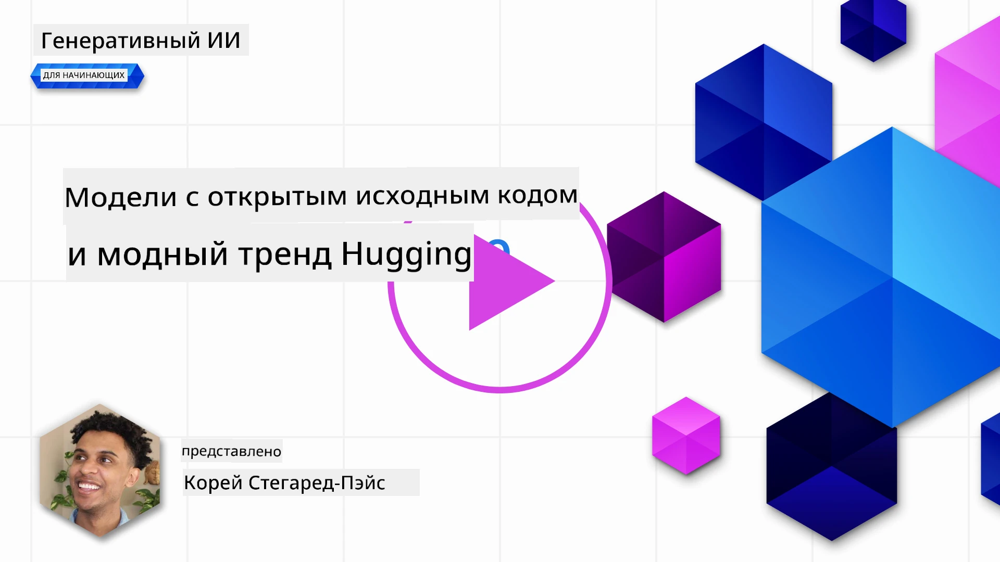
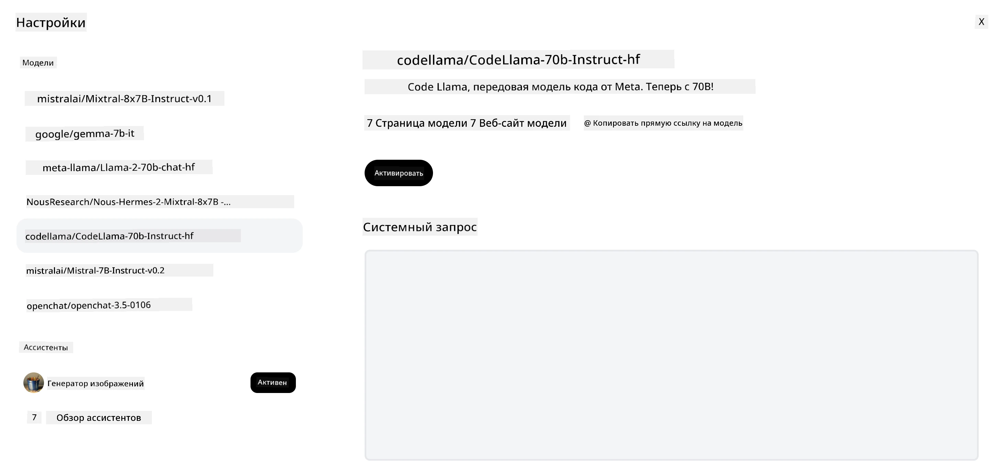

<!--
CO_OP_TRANSLATOR_METADATA:
{
  "original_hash": "85b754d4dc980f270f264d17116d9a5f",
  "translation_date": "2025-12-19T12:51:00+00:00",
  "source_file": "16-open-source-models/README.md",
  "language_code": "ru"
}
-->

## Введение

Мир открытых LLM захватывающий и постоянно развивается. Эта лекция направлена на глубокое изучение открытых моделей. Если вы ищете информацию о том, как проприетарные модели сравниваются с открытыми, перейдите к уроку ["Изучение и сравнение различных LLM"](../02-exploring-and-comparing-different-llms/README.md?WT.mc_id=academic-105485-koreyst). В этом уроке также будет рассмотрена тема дообучения, но более подробное объяснение можно найти в уроке ["Дообучение LLM"](../18-fine-tuning/README.md?WT.mc_id=academic-105485-koreyst).

## Цели обучения

- Получить понимание открытых моделей
- Понять преимущества работы с открытыми моделями
- Изучить открытые модели, доступные на Hugging Face и в Azure AI Studio

## Что такое открытые модели?

Открытое программное обеспечение сыграло ключевую роль в развитии технологий в различных областях. Инициатива Open Source (OSI) определила [10 критериев для программного обеспечения](https://web.archive.org/web/20241126001143/https://opensource.org/osd?WT.mc_id=academic-105485-koreyst), чтобы оно классифицировалось как открытое. Исходный код должен быть открыто доступен под лицензией, одобренной OSI.

Хотя разработка LLM имеет сходные элементы с разработкой программного обеспечения, процесс не совсем одинаков. Это вызвало много обсуждений в сообществе о том, что означает открытость в контексте LLM. Чтобы модель соответствовала традиционному определению открытого ПО, следующая информация должна быть общедоступной:

- Наборы данных, использованные для обучения модели.
- Полные веса модели как часть обучения.
- Код для оценки.
- Код для дообучения.
- Полные веса модели и метрики обучения.

В настоящее время существует лишь несколько моделей, соответствующих этим критериям. [Модель OLMo, созданная Allen Institute for Artificial Intelligence (AllenAI)](https://huggingface.co/allenai/OLMo-7B?WT.mc_id=academic-105485-koreyst) — одна из таких моделей.

В этой лекции мы будем называть модели "открытыми моделями", поскольку на момент написания они могут не полностью соответствовать вышеуказанным критериям.

## Преимущества открытых моделей

**Высокая настраиваемость** — Поскольку открытые модели выпускаются с подробной информацией об обучении, исследователи и разработчики могут модифицировать внутренние части модели. Это позволяет создавать высокоспециализированные модели, дообученные для конкретной задачи или области. Примеры включают генерацию кода, математические операции и биологию.

**Стоимость** — Стоимость за токен при использовании и развертывании этих моделей ниже, чем у проприетарных моделей. При создании приложений Generative AI следует учитывать соотношение производительности и цены для вашей задачи.

Источник: Artificial Analysis

**Гибкость** — Работа с открытыми моделями позволяет быть гибким в использовании различных моделей или их комбинаций. Примером являются [HuggingChat Assistants](https://huggingface.co/chat?WT.mc_id=academic-105485-koreyst), где пользователь может выбрать модель прямо в интерфейсе:

## Изучение различных открытых моделей

### Llama 2

[LLama2](https://huggingface.co/meta-llama?WT.mc_id=academic-105485-koreyst), разработанная Meta, — это открытая модель, оптимизированная для чат-приложений. Это связано с методом дообучения, который включал большое количество диалогов и обратную связь от людей. Благодаря этому модель выдает результаты, более соответствующие ожиданиям человека, что улучшает пользовательский опыт.

Примеры дообученных версий Llama включают [Japanese Llama](https://huggingface.co/elyza/ELYZA-japanese-Llama-2-7b?WT.mc_id=academic-105485-koreyst), специализирующуюся на японском языке, и [Llama Pro](https://huggingface.co/TencentARC/LLaMA-Pro-8B?WT.mc_id=academic-105485-koreyst), улучшенную версию базовой модели.

### Mistral

[Mistral](https://huggingface.co/mistralai?WT.mc_id=academic-105485-koreyst) — открытая модель с сильным акцентом на высокую производительность и эффективность. Она использует подход Mixture-of-Experts, который объединяет группу специализированных экспертных моделей в одну систему, где в зависимости от входных данных выбираются определённые модели. Это делает вычисления более эффективными, так как модели обрабатывают только те входы, в которых они специализируются.

Примеры дообученных версий Mistral включают [BioMistral](https://huggingface.co/BioMistral/BioMistral-7B?text=Mon+nom+est+Thomas+et+mon+principal?WT.mc_id=academic-105485-koreyst), ориентированную на медицинскую область, и [OpenMath Mistral](https://huggingface.co/nvidia/OpenMath-Mistral-7B-v0.1-hf?WT.mc_id=academic-105485-koreyst), выполняющую математические вычисления.

### Falcon

[Falcon](https://huggingface.co/tiiuae?WT.mc_id=academic-105485-koreyst) — LLM, созданная Technology Innovation Institute (**TII**). Falcon-40B обучалась на 40 миллиардах параметров и показала лучшие результаты, чем GPT-3, при меньших вычислительных затратах. Это связано с использованием алгоритма FlashAttention и multiquery attention, которые снижают требования к памяти во время вывода. Благодаря сокращенному времени вывода Falcon-40B подходит для чат-приложений.

Примеры дообученных версий Falcon — [OpenAssistant](https://huggingface.co/OpenAssistant/falcon-40b-sft-top1-560?WT.mc_id=academic-105485-koreyst), ассистент на базе открытых моделей, и [GPT4ALL](https://huggingface.co/nomic-ai/gpt4all-falcon?WT.mc_id=academic-105485-koreyst), обеспечивающий более высокую производительность, чем базовая модель.

## Как выбрать

Однозначного ответа на выбор открытой модели нет. Хорошей отправной точкой является использование функции фильтрации по задачам в Azure AI Studio. Это поможет понять, для каких типов задач обучена модель. Hugging Face также поддерживает таблицу лидеров LLM, показывающую лучшие модели по определённым метрикам.

Для сравнения LLM разных типов отличным ресурсом является [Artificial Analysis](https://artificialanalysis.ai/?WT.mc_id=academic-105485-koreyst):

Источник: Artificial Analysis

Если вы работаете над конкретным кейсом, поиск дообученных версий, ориентированных на ту же область, может быть эффективным. Эксперименты с несколькими открытыми моделями, чтобы оценить их производительность с точки зрения ваших и пользовательских ожиданий, — ещё одна хорошая практика.

## Следующие шаги

Лучшее в открытых моделях — это то, что вы можете быстро начать с ними работать. Ознакомьтесь с [Каталогом моделей Azure AI Foundry](https://ai.azure.com?WT.mc_id=academic-105485-koreyst), который содержит специальную коллекцию Hugging Face с моделями, обсуждаемыми здесь.

## Обучение не заканчивается здесь, продолжайте путь

После завершения этого урока ознакомьтесь с нашей [коллекцией по обучению Generative AI](https://aka.ms/genai-collection?WT.mc_id=academic-105485-koreyst), чтобы продолжить повышать свои знания в области Generative AI!

---

<!-- CO-OP TRANSLATOR DISCLAIMER START -->
**Отказ от ответственности**:  
Этот документ был переведен с помощью сервиса автоматического перевода [Co-op Translator](https://github.com/Azure/co-op-translator). Несмотря на наши усилия по обеспечению точности, имейте в виду, что автоматический перевод может содержать ошибки или неточности. Оригинальный документ на его исходном языке следует считать авторитетным источником. Для получения критически важной информации рекомендуется обращаться к профессиональному переводу, выполненному человеком. Мы не несем ответственности за любые недоразумения или неправильные толкования, возникшие в результате использования данного перевода.
<!-- CO-OP TRANSLATOR DISCLAIMER END -->