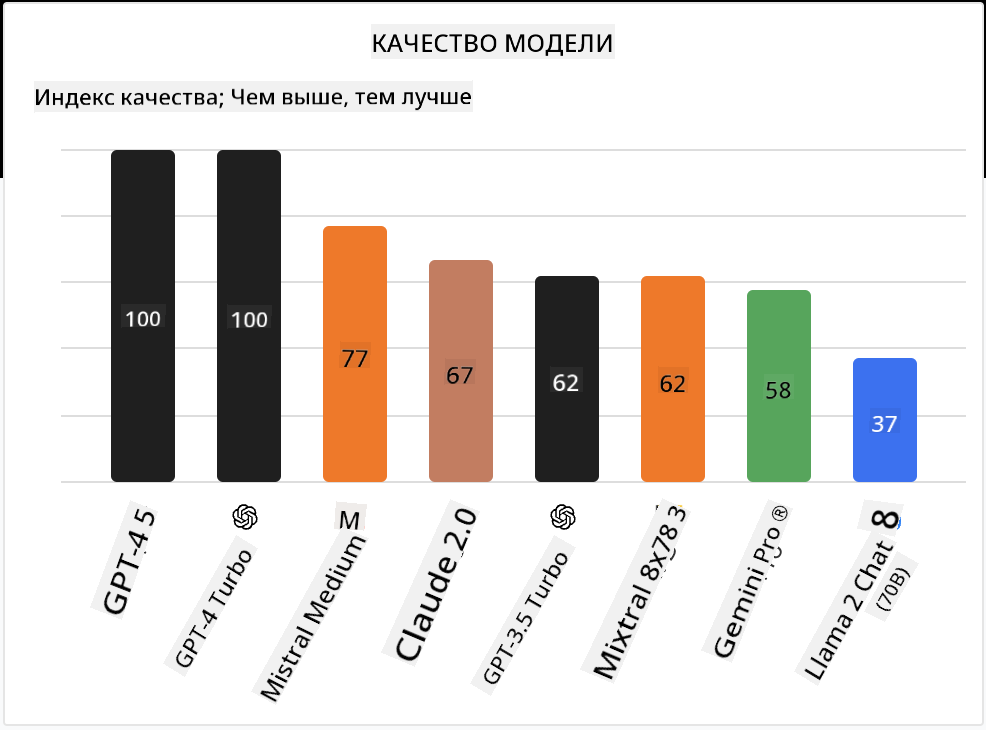

<!--
CO_OP_TRANSLATOR_METADATA:
{
  "original_hash": "0bba96e53ab841d99db731892a51fab8",
  "translation_date": "2025-05-20T06:46:36+00:00",
  "source_file": "16-open-source-models/README.md",
  "language_code": "ru"
}
-->

## Введение

Мир LLM с открытым исходным кодом захватывающий и постоянно меняется. Этот урок направлен на то, чтобы предоставить подробный обзор моделей с открытым исходным кодом. Если вы ищете информацию о том, как коммерческие модели сравниваются с моделями с открытым исходным кодом, перейдите к уроку ["Изучение и сравнение различных LLM"](../02-exploring-and-comparing-different-llms/README.md?WT.mc_id=academic-105485-koreyst). Этот урок также затронет тему тонкой настройки, но более подробное объяснение можно найти в уроке ["Тонкая настройка LLM"](../18-fine-tuning/README.md?WT.mc_id=academic-105485-koreyst).

## Цели обучения

- Понять модели с открытым исходным кодом
- Понять преимущества работы с моделями с открытым исходным кодом
- Изучить доступные открытые модели на Hugging Face и Azure AI Studio

## Что такое модели с открытым исходным кодом?

Программное обеспечение с открытым исходным кодом сыграло важную роль в развитии технологий в различных областях. Инициатива Open Source (OSI) определила [10 критериев для программного обеспечения](https://web.archive.org/web/20241126001143/https://opensource.org/osd?WT.mc_id=academic-105485-koreyst), чтобы классифицировать его как открытое. Исходный код должен быть открыто опубликован под лицензией, утвержденной OSI.

Хотя разработка LLM имеет сходные элементы с разработкой программного обеспечения, процесс не совсем одинаковый. Это вызвало много обсуждений в сообществе относительно определения открытого исходного кода в контексте LLM. Чтобы модель соответствовала традиционному определению открытого исходного кода, должна быть публично доступна следующая информация:

- Наборы данных, использованные для обучения модели.
- Полные веса модели как часть обучения.
- Код оценки.
- Код для тонкой настройки.
- Полные веса модели и метрики обучения.

В настоящее время существует лишь несколько моделей, которые соответствуют этим критериям. [Модель OLMo, созданная Институтом искусственного интеллекта Аллена (AllenAI)](https://huggingface.co/allenai/OLMo-7B?WT.mc_id=academic-105485-koreyst), является одной из таких моделей.

В этом уроке мы будем называть модели "открытыми моделями", так как они могут не соответствовать вышеуказанным критериям на момент написания.

## Преимущества открытых моделей

**Высокая настраиваемость** - Поскольку открытые модели публикуются с подробной информацией об обучении, исследователи и разработчики могут изменять внутренние механизмы модели. Это позволяет создавать высокоспециализированные модели, которые тонко настроены для конкретной задачи или области исследования. Примеры включают генерацию кода, математические операции и биологию.

**Стоимость** - Стоимость за токен при использовании и развертывании этих моделей ниже, чем у коммерческих моделей. При создании приложений на основе генеративного ИИ следует учитывать производительность и цену при работе с этими моделями для вашего случая использования.

  
Источник: Artificial Analysis

**Гибкость** - Работа с открытыми моделями позволяет быть гибким в использовании различных моделей или их комбинировании. Примером этого является [HuggingChat Assistants](https://huggingface.co/chat?WT.mc_id=academic-105485-koreyst), где пользователь может выбрать модель, используемую непосредственно в интерфейсе:

## Изучение различных открытых моделей

### Llama 2

[LLama2](https://huggingface.co/meta-llama?WT.mc_id=academic-105485-koreyst), разработанная Meta, является открытой моделью, оптимизированной для приложений на основе чата. Это связано с методом тонкой настройки, который включал большое количество диалогов и обратную связь от людей. Благодаря этому методу модель генерирует больше результатов, соответствующих ожиданиям человека, что обеспечивает лучший пользовательский опыт.

Примеры тонко настроенных версий Llama включают [Japanese Llama](https://huggingface.co/elyza/ELYZA-japanese-Llama-2-7b?WT.mc_id=academic-105485-koreyst), которая специализируется на японском языке, и [Llama Pro](https://huggingface.co/TencentARC/LLaMA-Pro-8B?WT.mc_id=academic-105485-koreyst), которая является улучшенной версией базовой модели.

### Mistral

[Mistral](https://huggingface.co/mistralai?WT.mc_id=academic-105485-koreyst) является открытой моделью с сильным акцентом на высокой производительности и эффективности. Она использует подход Mixture-of-Experts, который объединяет группу специализированных экспертных моделей в одну систему, где в зависимости от ввода выбираются определенные модели для использования. Это делает вычисления более эффективными, так как модели обрабатывают только те входные данные, в которых они специализируются.

Примеры тонко настроенных версий Mistral включают [BioMistral](https://huggingface.co/BioMistral/BioMistral-7B?text=Mon+nom+est+Thomas+et+mon+principal?WT.mc_id=academic-105485-koreyst), которая сосредоточена на медицинской области, и [OpenMath Mistral](https://huggingface.co/nvidia/OpenMath-Mistral-7B-v0.1-hf?WT.mc_id=academic-105485-koreyst), которая выполняет математические вычисления.

### Falcon

[Falcon](https://huggingface.co/tiiuae?WT.mc_id=academic-105485-koreyst) - это LLM, созданная Институтом технологических инноваций (**TII**). Falcon-40B был обучен на 40 миллиардах параметров, что, как было показано, дает лучшие результаты, чем GPT-3, с меньшими вычислительными ресурсами. Это связано с использованием алгоритма FlashAttention и multiquery attention, которые позволяют уменьшить требования к памяти во время вывода. Благодаря сокращенному времени вывода, Falcon-40B подходит для приложений на основе чата.

Примеры тонко настроенных версий Falcon включают [OpenAssistant](https://huggingface.co/OpenAssistant/falcon-40b-sft-top1-560?WT.mc_id=academic-105485-koreyst), помощник, построенный на открытых моделях, и [GPT4ALL](https://huggingface.co/nomic-ai/gpt4all-falcon?WT.mc_id=academic-105485-koreyst), который обеспечивает более высокую производительность, чем базовая модель.

## Как выбрать

Нет единого ответа на вопрос, как выбрать открытую модель. Хорошее место для начала - использование функции фильтрации по задачам в Azure AI Studio. Это поможет вам понять, для каких типов задач модель была обучена. Hugging Face также поддерживает рейтинг LLM, который показывает лучшие модели по определенным метрикам.

Когда вы хотите сравнить LLM между различными типами, [Artificial Analysis](https://artificialanalysis.ai/?WT.mc_id=academic-105485-koreyst) является еще одним отличным ресурсом:

  
Источник: Artificial Analysis

Если вы работаете над конкретным случаем использования, поиск тонко настроенных версий, ориентированных на ту же область, может быть эффективным. Экспериментирование с несколькими открытыми моделями, чтобы увидеть, как они работают в соответствии с вашими ожиданиями и ожиданиями ваших пользователей, является хорошей практикой.

## Следующие шаги

Лучшее в открытых моделях - это то, что вы можете начать работать с ними довольно быстро. Ознакомьтесь с [каталогом моделей Azure AI Studio](https://ai.azure.com?WT.mc_id=academic-105485-koreyst), который содержит специальную коллекцию Hugging Face с обсуждаемыми здесь моделями.

## Обучение не заканчивается здесь, продолжайте путешествие

После завершения этого урока ознакомьтесь с нашей [коллекцией обучения генеративному ИИ](https://aka.ms/genai-collection?WT.mc_id=academic-105485-koreyst), чтобы продолжить повышать свои знания о генеративном ИИ!

**Отказ от ответственности**:  
Этот документ был переведен с использованием службы автоматического перевода [Co-op Translator](https://github.com/Azure/co-op-translator). Несмотря на то, что мы стремимся к точности, имейте в виду, что автоматические переводы могут содержать ошибки или неточности. Оригинальный документ на его родном языке следует считать авторитетным источником. Для критически важной информации рекомендуется профессиональный перевод человеком. Мы не несем ответственности за любые недоразумения или неправильные интерпретации, возникшие в результате использования этого перевода.