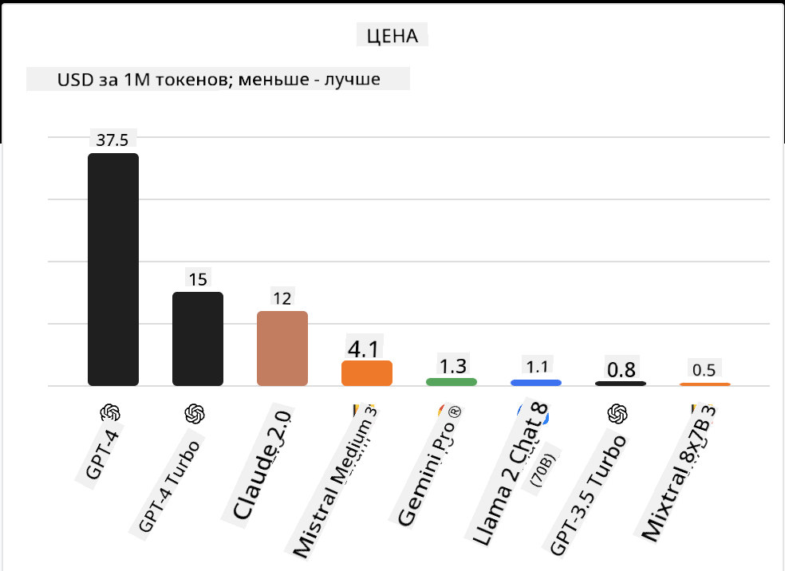
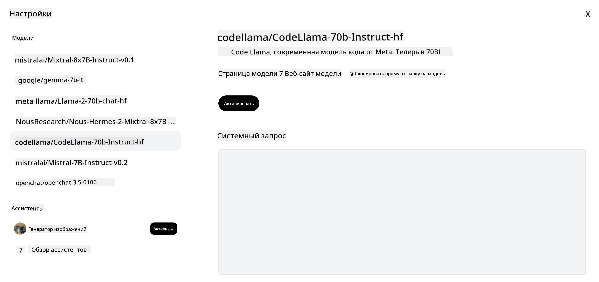
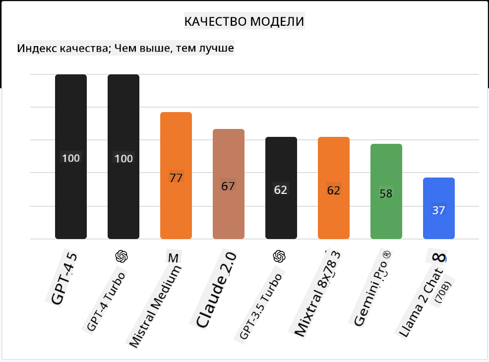

<!--
CO_OP_TRANSLATOR_METADATA:
{
  "original_hash": "0bba96e53ab841d99db731892a51fab8",
  "translation_date": "2025-06-25T23:48:15+00:00",
  "source_file": "16-open-source-models/README.md",
  "language_code": "ru"
}
-->

## Введение

Мир LLM с открытым исходным кодом захватывающий и постоянно меняется. Этот урок нацелен на предоставление подробного обзора моделей с открытым исходным кодом. Если вас интересует информация о сравнении проприетарных моделей с моделями с открытым исходным кодом, перейдите к уроку ["Исследование и сравнение различных LLM"](../02-exploring-and-comparing-different-llms/README.md?WT.mc_id=academic-105485-koreyst). В этом уроке также будет рассмотрена тема тонкой настройки, но более подробное объяснение можно найти в уроке ["Тонкая настройка LLM"](../18-fine-tuning/README.md?WT.mc_id=academic-105485-koreyst).

## Цели обучения

- Понять модели с открытым исходным кодом
- Осознать преимущества работы с моделями с открытым исходным кодом
- Исследовать доступные открытые модели на Hugging Face и Azure AI Studio

## Что такое модели с открытым исходным кодом?

Программное обеспечение с открытым исходным кодом сыграло ключевую роль в развитии технологий в различных областях. Инициатива Open Source (OSI) определила [10 критериев для программного обеспечения](https://web.archive.org/web/20241126001143/https://opensource.org/osd?WT.mc_id=academic-105485-koreyst), чтобы классифицировать его как открытый исходный код. Исходный код должен быть открыто распространен под лицензией, утвержденной OSI.

Хотя разработка LLM имеет схожие элементы с разработкой программного обеспечения, процесс не совсем одинаков. Это вызвало много обсуждений в сообществе о определении открытого исходного кода в контексте LLM. Чтобы модель соответствовала традиционному определению открытого исходного кода, следующая информация должна быть публично доступна:

- Наборы данных, использованные для обучения модели.
- Полные веса модели как часть обучения.
- Код оценки.
- Код тонкой настройки.
- Полные веса модели и метрики обучения.

В настоящее время существует лишь несколько моделей, которые соответствуют этим критериям. [Модель OLMo, созданная Институтом Аллена для искусственного интеллекта (AllenAI)](https://huggingface.co/allenai/OLMo-7B?WT.mc_id=academic-105485-koreyst) относится к этой категории.

Для этого урока мы будем использовать термин "открытые модели", так как они могут не соответствовать вышеуказанным критериям на момент написания.

## Преимущества открытых моделей

**Высокая кастомизация** - Поскольку открытые модели выпускаются с подробной информацией об обучении, исследователи и разработчики могут изменять внутренние компоненты модели. Это позволяет создавать высокоспециализированные модели, которые тонко настроены для конкретной задачи или области исследования. Некоторые примеры включают генерацию кода, математические операции и биологию.

**Стоимость** - Стоимость за токен при использовании и развертывании этих моделей ниже, чем у проприетарных моделей. При создании приложений Generative AI следует учитывать производительность и цену, работая с этими моделями для вашего случая использования.

Источник: Artificial Analysis

**Гибкость** - Работа с открытыми моделями позволяет вам быть гибкими в использовании различных моделей или их комбинации. Примером этого является [HuggingChat Assistants](https://huggingface.co/chat?WT.mc_id=academic-105485-koreyst), где пользователь может выбрать модель, используемую непосредственно в интерфейсе пользователя:

## Исследование различных открытых моделей

### Llama 2

[LLama2](https://huggingface.co/meta-llama?WT.mc_id=academic-105485-koreyst), разработанная Meta, является открытой моделью, оптимизированной для приложений на основе чата. Это связано с методом тонкой настройки, который включал большое количество диалогов и обратной связи от людей. С помощью этого метода модель генерирует больше результатов, соответствующих ожиданиям людей, что обеспечивает лучший пользовательский опыт.

Некоторые примеры тонко настроенных версий Llama включают [Japanese Llama](https://huggingface.co/elyza/ELYZA-japanese-Llama-2-7b?WT.mc_id=academic-105485-koreyst), специализирующуюся на японском языке, и [Llama Pro](https://huggingface.co/TencentARC/LLaMA-Pro-8B?WT.mc_id=academic-105485-koreyst), являющуюся улучшенной версией базовой модели.

### Mistral

[Mistral](https://huggingface.co/mistralai?WT.mc_id=academic-105485-koreyst) является открытой моделью с сильным акцентом на высокую производительность и эффективность. Она использует подход Mixture-of-Experts, который объединяет группу специализированных экспертных моделей в одну систему, где в зависимости от входных данных выбираются определенные модели для использования. Это делает вычисления более эффективными, так как модели обрабатывают только те входные данные, в которых они специализированы.

Некоторые примеры тонко настроенных версий Mistral включают [BioMistral](https://huggingface.co/BioMistral/BioMistral-7B?text=Mon+nom+est+Thomas+et+mon+principal?WT.mc_id=academic-105485-koreyst), ориентированную на медицинскую область, и [OpenMath Mistral](https://huggingface.co/nvidia/OpenMath-Mistral-7B-v0.1-hf?WT.mc_id=academic-105485-koreyst), выполняющую математические вычисления.

### Falcon

[Falcon](https://huggingface.co/tiiuae?WT.mc_id=academic-105485-koreyst) является LLM, созданной Институтом технологических инноваций (TII). Falcon-40B был обучен на 40 миллиардах параметров, что, как показано, дает лучшие результаты, чем GPT-3, с меньшими вычислительными затратами. Это связано с использованием алгоритма FlashAttention и мультизапросного внимания, которые позволяют сократить требования к памяти во время вывода. С уменьшенным временем вывода Falcon-40B подходит для приложений на основе чата.

Некоторые примеры тонко настроенных версий Falcon включают [OpenAssistant](https://huggingface.co/OpenAssistant/falcon-40b-sft-top1-560?WT.mc_id=academic-105485-koreyst), помощника, построенного на открытых моделях, и [GPT4ALL](https://huggingface.co/nomic-ai/gpt4all-falcon?WT.mc_id=academic-105485-koreyst), который обеспечивает более высокую производительность, чем базовая модель.

## Как выбрать

Нет одного ответа на вопрос, как выбрать открытую модель. Хорошее место для начала — использование функции фильтрации по задачам в Azure AI Studio. Это поможет вам понять, для каких типов задач модель была обучена. Hugging Face также поддерживает таблицу лидеров LLM, которая показывает лучшие модели по определенным метрикам.

При сравнении LLM по различным типам [Artificial Analysis](https://artificialanalysis.ai/?WT.mc_id=academic-105485-koreyst) является еще одним отличным ресурсом:

Источник: Artificial Analysis

Если вы работаете над конкретным случаем использования, поиск тонко настроенных версий, ориентированных на ту же область, может быть эффективным. Экспериментирование с несколькими открытыми моделями, чтобы увидеть, как они соответствуют вашим ожиданиям и ожиданиям ваших пользователей, является еще одной хорошей практикой.

## Следующие шаги

Лучше всего в открытых моделях то, что вы можете начать работать с ними довольно быстро. Ознакомьтесь с [каталогом моделей Azure AI Studio](https://ai.azure.com?WT.mc_id=academic-105485-koreyst), который содержит специальную коллекцию Hugging Face с моделями, обсужденными здесь.

## Обучение не заканчивается здесь, продолжайте путешествие

После завершения этого урока ознакомьтесь с нашей [коллекцией обучения Generative AI](https://aka.ms/genai-collection?WT.mc_id=academic-105485-koreyst), чтобы продолжить повышать свои знания в области Generative AI!

**Отказ от ответственности**:  
Этот документ был переведен с использованием службы автоматического перевода [Co-op Translator](https://github.com/Azure/co-op-translator). Хотя мы стремимся к точности, пожалуйста, имейте в виду, что автоматические переводы могут содержать ошибки или неточности. Оригинальный документ на его родном языке следует считать авторитетным источником. Для критически важной информации рекомендуется профессиональный перевод человеком. Мы не несем ответственности за любые недоразумения или неправильные толкования, возникающие в результате использования этого перевода.