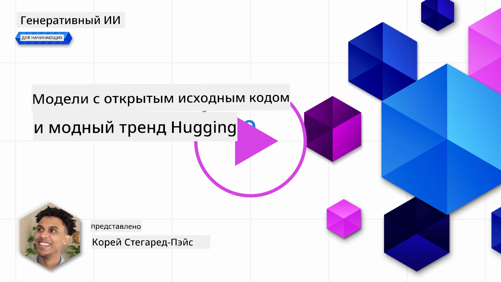
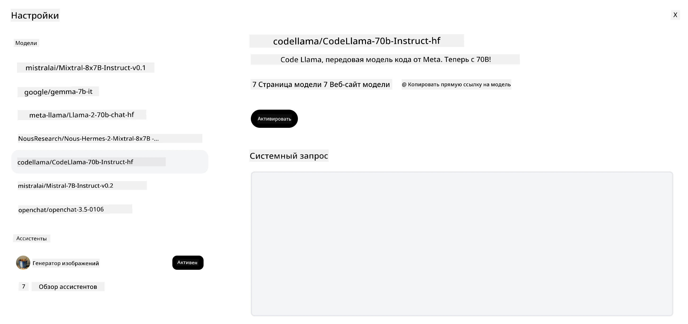

## Введение

Мир моделей с открытым исходным кодом LLM захватывающий и постоянно развивается. Цель этого урока — предоставить глубокий обзор open source моделей. Если вы ищете информацию о том, как проприетарные модели сравниваются с моделями открытого исходного кода, перейдите к уроку ["Изучение и сравнение различных LLM"](../02-exploring-and-comparing-different-llms/README.md?WT.mc_id=academic-105485-koreyst). Этот урок также затронет тему дообучения, но более подробное объяснение вы найдете в уроке ["Дообучение LLM"](../18-fine-tuning/README.md?WT.mc_id=academic-105485-koreyst).

## Цели обучения

- Получить понимание моделей с открытым исходным кодом
- Понять преимущества работы с моделями с открытым исходным кодом
- Изучить доступные открытые модели на Hugging Face и в каталоге моделей Microsoft Foundry

## Что такое модели с открытым исходным кодом?

Программное обеспечение с открытым исходным кодом сыграло ключевую роль в развитии технологий в различных областях. Инициатива Open Source Initiative (OSI) определила [10 критериев для программного обеспечения](https://web.archive.org/web/20241126001143/https://opensource.org/osd?WT.mc_id=academic-105485-koreyst), чтобы оно классифицировалось как открытое. Исходный код должен быть открыто доступен под лицензией, одобренной OSI.

Хотя разработка LLM имеет сходные элементы с разработкой ПО, процесс не совсем одинаков. Это вызвало много обсуждений в сообществе относительно определения open source в контексте LLM. Чтобы модель соответствовала традиционному определению open source, следующая информация должна быть общедоступной:

- Датасеты, использованные для обучения модели.
- Полные веса модели как часть обучения.
- Код оценки модели.
- Код дообучения модели.
- Полные веса модели и метрики обучения.

В настоящее время лишь несколько моделей соответствуют этим критериям. [Модель OLMo, созданная Allen Institute for Artificial Intelligence (AllenAI)](https://huggingface.co/allenai/OLMo-7B?WT.mc_id=academic-105485-koreyst) — одна из них.

В этом уроке мы будем называть модели "открытыми моделями", поскольку на момент написания они могут не полностью соответствовать приведенным выше критериям.

## Преимущества открытых моделей

**Высокая настраиваемость** — Поскольку открытые модели выпускаются с подробной информацией об обучении, исследователи и разработчики могут модифицировать внутренние структуры модели. Это позволяет создавать высокоспециализированные модели, дообученные для конкретных задач или областей. Примеры включают генерацию кода, математические операции и биологию.

**Стоимость** — Стоимость за токен при использовании и развертывании этих моделей ниже, чем у проприетарных моделей. При создании Generative AI приложений следует оценивать производительность и цену моделей на вашем кейсе.

Источник: Artificial Analysis

**Гибкость** — Работа с открытыми моделями позволяет использовать разные модели или комбинировать их. Пример — [HuggingChat Assistants](https://huggingface.co/chat?WT.mc_id=academic-105485-koreyst), где пользователь может выбрать модель прямо в интерфейсе:

## Исследование различных открытых моделей

### Llama 2

[LLama2](https://huggingface.co/meta-llama?WT.mc_id=academic-105485-koreyst), разработанная Meta, является открытой моделью, оптимизированной для чат-приложений. Это связано с методом дообучения, включающим большое количество диалогов и обратную связь с пользователем. Благодаря этому модель генерирует результаты, лучше соответствующие человеческим ожиданиям, что улучшает пользовательский опыт.

Примеры дообученных версий Llama включают [Japanese Llama](https://huggingface.co/elyza/ELYZA-japanese-Llama-2-7b?WT.mc_id=academic-105485-koreyst), специализирующуюся на японском языке, и [Llama Pro](https://huggingface.co/TencentARC/LLaMA-Pro-8B?WT.mc_id=academic-105485-koreyst), улучшенную версию базовой модели.

### Mistral

[Mistral](https://huggingface.co/mistralai?WT.mc_id=academic-105485-koreyst) — открытая модель с сильным акцентом на высокую производительность и эффективность. Она использует подход Mixture-of-Experts, который объединяет группу специализированных экспертов в одну систему, где в зависимости от входных данных выбираются определённые модели для обработки. Это делает вычисления более эффективными, поскольку модели обрабатывают только специализированные для них входы.

Примеры дообученных версий Mistral включают [BioMistral](https://huggingface.co/BioMistral/BioMistral-7B?text=Mon+nom+est+Thomas+et+mon+principal?WT.mc_id=academic-105485-koreyst), ориентированную на медицинскую область, и [OpenMath Mistral](https://huggingface.co/nvidia/OpenMath-Mistral-7B-v0.1-hf?WT.mc_id=academic-105485-koreyst), выполняющую математические вычисления.

### Falcon

[Falcon](https://huggingface.co/tiiuae?WT.mc_id=academic-105485-koreyst) — LLM, созданная Институтом технологических инноваций (**TII**). Falcon-40B была обучена на 40 миллиардах параметров и показала лучшие результаты, чем GPT-3 при меньших вычислительных ресурсах. Это достигается благодаря использованию алгоритма FlashAttention и multiquery attention, что снижает потребление памяти во время вывода. С уменьшенным временем вывода Falcon-40B подходит для чат-приложений.

Примеры дообученных версий Falcon — [OpenAssistant](https://huggingface.co/OpenAssistant/falcon-40b-sft-top1-560?WT.mc_id=academic-105485-koreyst), ассистент, построенный на открытых моделях, и [GPT4ALL](https://huggingface.co/nomic-ai/gpt4all-falcon?WT.mc_id=academic-105485-koreyst), который обеспечивает лучшую производительность по сравнению с базовой моделью.

## Как выбрать

Нет единого ответа на вопрос выбора открытой модели. Хорошей отправной точкой является использование функции фильтра по задаче в каталоге моделей Microsoft Foundry. Это поможет понять, для каких задач модель была обучена. Hugging Face также ведёт LLM Leaderboard, показывающий лучшие модели по определённым метрикам.

При сравнении LLM разных типов [Artificial Analysis](https://artificialanalysis.ai/?WT.mc_id=academic-105485-koreyst) — ещё один отличный ресурс:

Источник: Artificial Analysis

При работе над конкретной задачей поиск дообученных версий, сфокусированных на той же области, может быть эффективным. Эксперименты с несколькими открытыми моделями, чтобы увидеть их производительность в соответствии с вашими и ожиданиями пользователей — хорошая практика.

## Следующие шаги

Лучшее в открытых моделях — вы можете начать работать с ними довольно быстро. Ознакомьтесь с [каталогом моделей Microsoft Foundry](https://ai.azure.com?WT.mc_id=academic-105485-koreyst), который содержит специальную коллекцию Hugging Face с обсуждаемыми здесь моделями.

## Обучение на этом не заканчивается, продолжайте путешествие

После завершения этого урока ознакомьтесь с нашей [коллекцией по генеративному ИИ](https://aka.ms/genai-collection?WT.mc_id=academic-105485-koreyst), чтобы продолжить совершенствовать знания в области Generative AI!

---

<!-- CO-OP TRANSLATOR DISCLAIMER START -->
**Отказ от ответственности**:
Этот документ был переведен с использованием сервиса машинного перевода [Co-op Translator](https://github.com/Azure/co-op-translator). Несмотря на наши усилия по обеспечению точности, имейте в виду, что автоматический перевод может содержать ошибки или неточности. Оригинальный документ на его исходном языке следует считать авторитетным источником. Для получения критически важной информации рекомендуется обратиться к профессиональному человеческому переводу. Мы не несем ответственности за любые недоразумения или неправильные толкования, возникшие в результате использования этого перевода.
<!-- CO-OP TRANSLATOR DISCLAIMER END -->