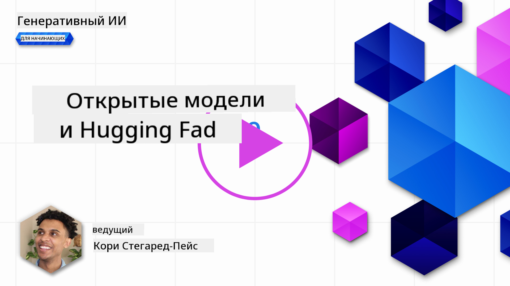

<!--
CO_OP_TRANSLATOR_METADATA:
{
  "original_hash": "a2a83aac52158c23161046cbd13faa2b",
  "translation_date": "2025-10-17T15:09:55+00:00",
  "source_file": "16-open-source-models/README.md",
  "language_code": "ru"
}
-->

## Введение

Мир LLM с открытым исходным кодом захватывающий и постоянно развивается. Этот урок нацелен на глубокое изучение моделей с открытым исходным кодом. Если вы ищете информацию о том, как проприетарные модели сравниваются с моделями с открытым исходным кодом, перейдите к уроку ["Изучение и сравнение различных LLM"](../02-exploring-and-comparing-different-llms/README.md?WT.mc_id=academic-105485-koreyst). В этом уроке также будет рассмотрена тема тонкой настройки, но более подробное объяснение можно найти в уроке ["Тонкая настройка LLM"](../18-fine-tuning/README.md?WT.mc_id=academic-105485-koreyst).

## Цели обучения

- Понять, что такое модели с открытым исходным кодом
- Осознать преимущества работы с моделями с открытым исходным кодом
- Изучить доступные модели на Hugging Face и в Azure AI Studio

## Что такое модели с открытым исходным кодом?

Программное обеспечение с открытым исходным кодом сыграло ключевую роль в развитии технологий в различных областях. Инициатива Open Source (OSI) определила [10 критериев для программного обеспечения](https://web.archive.org/web/20241126001143/https://opensource.org/osd?WT.mc_id=academic-105485-koreyst), чтобы оно классифицировалось как открытое. Исходный код должен быть открыто опубликован под лицензией, одобренной OSI.

Хотя разработка LLM имеет схожие элементы с разработкой программного обеспечения, процесс не совсем идентичен. Это вызвало множество обсуждений в сообществе о том, как определить открытый исходный код в контексте LLM. Чтобы модель соответствовала традиционному определению открытого исходного кода, следующая информация должна быть общедоступной:

- Наборы данных, использованные для обучения модели.
- Полные веса модели как часть обучения.
- Код для оценки.
- Код для тонкой настройки.
- Полные веса модели и метрики обучения.

На данный момент существует лишь несколько моделей, соответствующих этим критериям. [Модель OLMo, созданная Институтом искусственного интеллекта Аллена (AllenAI)](https://huggingface.co/allenai/OLMo-7B?WT.mc_id=academic-105485-koreyst), является одной из таких моделей.

Для целей этого урока мы будем называть такие модели "открытыми моделями", так как они могут не соответствовать вышеуказанным критериям на момент написания.

## Преимущества открытых моделей

**Высокая настраиваемость** - Поскольку открытые модели публикуются с подробной информацией об обучении, исследователи и разработчики могут модифицировать внутреннюю структуру модели. Это позволяет создавать высокоспециализированные модели, настроенные для выполнения конкретных задач или исследований. Примеры включают генерацию кода, математические операции и биологию.

**Стоимость** - Стоимость за токен при использовании и развертывании таких моделей ниже, чем у проприетарных моделей. При создании приложений на основе генеративного ИИ следует учитывать соотношение производительности и цены для вашего конкретного случая использования.

  
Источник: Artificial Analysis

**Гибкость** - Работа с открытыми моделями позволяет быть гибким в использовании различных моделей или их комбинаций. Примером может служить [HuggingChat Assistants](https://huggingface.co/chat?WT.mc_id=academic-105485-koreyst), где пользователь может выбрать модель, используемую непосредственно в интерфейсе:

## Изучение различных открытых моделей

### Llama 2

[LLama2](https://huggingface.co/meta-llama?WT.mc_id=academic-105485-koreyst), разработанная Meta, является открытой моделью, оптимизированной для приложений на основе чатов. Это связано с методом тонкой настройки, который включал большое количество диалогов и обратной связи от пользователей. Благодаря этому методу модель выдает результаты, которые больше соответствуют ожиданиям человека, что улучшает пользовательский опыт.

Примеры тонко настроенных версий Llama включают [Japanese Llama](https://huggingface.co/elyza/ELYZA-japanese-Llama-2-7b?WT.mc_id=academic-105485-koreyst), которая специализируется на японском языке, и [Llama Pro](https://huggingface.co/TencentARC/LLaMA-Pro-8B?WT.mc_id=academic-105485-koreyst), которая является улучшенной версией базовой модели.

### Mistral

[Mistral](https://huggingface.co/mistralai?WT.mc_id=academic-105485-koreyst) — это открытая модель, ориентированная на высокую производительность и эффективность. Она использует подход Mixture-of-Experts, который объединяет группу специализированных экспертных моделей в одну систему, где в зависимости от входных данных выбираются определенные модели. Это делает вычисления более эффективными, так как модели обрабатывают только те входные данные, в которых они специализируются.

Примеры тонко настроенных версий Mistral включают [BioMistral](https://huggingface.co/BioMistral/BioMistral-7B?text=Mon+nom+est+Thomas+et+mon+principal?WT.mc_id=academic-105485-koreyst), которая ориентирована на медицинскую область, и [OpenMath Mistral](https://huggingface.co/nvidia/OpenMath-Mistral-7B-v0.1-hf?WT.mc_id=academic-105485-koreyst), которая выполняет математические вычисления.

### Falcon

[Falcon](https://huggingface.co/tiiuae?WT.mc_id=academic-105485-koreyst) — это LLM, созданная Институтом технологических инноваций (**TII**). Falcon-40B была обучена на 40 миллиардах параметров, что показало лучшую производительность, чем у GPT-3, при меньших вычислительных затратах. Это стало возможным благодаря использованию алгоритма FlashAttention и многозапросного внимания, которые позволяют сократить требования к памяти во время вывода. Благодаря сокращенному времени вывода Falcon-40B подходит для приложений на основе чатов.

Примеры тонко настроенных версий Falcon включают [OpenAssistant](https://huggingface.co/OpenAssistant/falcon-40b-sft-top1-560?WT.mc_id=academic-105485-koreyst), помощник, построенный на открытых моделях, и [GPT4ALL](https://huggingface.co/nomic-ai/gpt4all-falcon?WT.mc_id=academic-105485-koreyst), который обеспечивает более высокую производительность, чем базовая модель.

## Как выбрать

Нет единого ответа на вопрос, как выбрать открытую модель. Хорошим началом может быть использование функции фильтрации по задачам в Azure AI Studio. Это поможет вам понять, для каких задач была обучена модель. Hugging Face также поддерживает рейтинг LLM, который показывает лучшие модели на основе определенных метрик.

Если вы хотите сравнить LLM разных типов, [Artificial Analysis](https://artificialanalysis.ai/?WT.mc_id=academic-105485-koreyst) — еще один отличный ресурс:

  
Источник: Artificial Analysis

Если вы работаете над конкретным случаем использования, эффективным может быть поиск тонко настроенных версий, ориентированных на ту же область. Экспериментирование с несколькими открытыми моделями, чтобы понять, как они соответствуют вашим ожиданиям и ожиданиям ваших пользователей, также является хорошей практикой.

## Следующие шаги

Лучшее в открытых моделях — это то, что вы можете начать работать с ними довольно быстро. Ознакомьтесь с [каталогом моделей Azure AI Foundry](https://ai.azure.com?WT.mc_id=academic-105485-koreyst), который включает в себя специальную коллекцию Hugging Face с обсуждаемыми здесь моделями.

## Обучение не заканчивается здесь, продолжайте свой путь

После завершения этого урока ознакомьтесь с нашей [коллекцией обучения генеративному ИИ](https://aka.ms/genai-collection?WT.mc_id=academic-105485-koreyst), чтобы продолжить углублять свои знания в области генеративного ИИ!

---

**Отказ от ответственности**:  
Этот документ был переведен с использованием сервиса автоматического перевода [Co-op Translator](https://github.com/Azure/co-op-translator). Хотя мы стремимся к точности, пожалуйста, учитывайте, что автоматические переводы могут содержать ошибки или неточности. Оригинальный документ на его родном языке следует считать авторитетным источником. Для получения критически важной информации рекомендуется профессиональный перевод человеком. Мы не несем ответственности за любые недоразумения или неправильные интерпретации, возникающие в результате использования данного перевода.