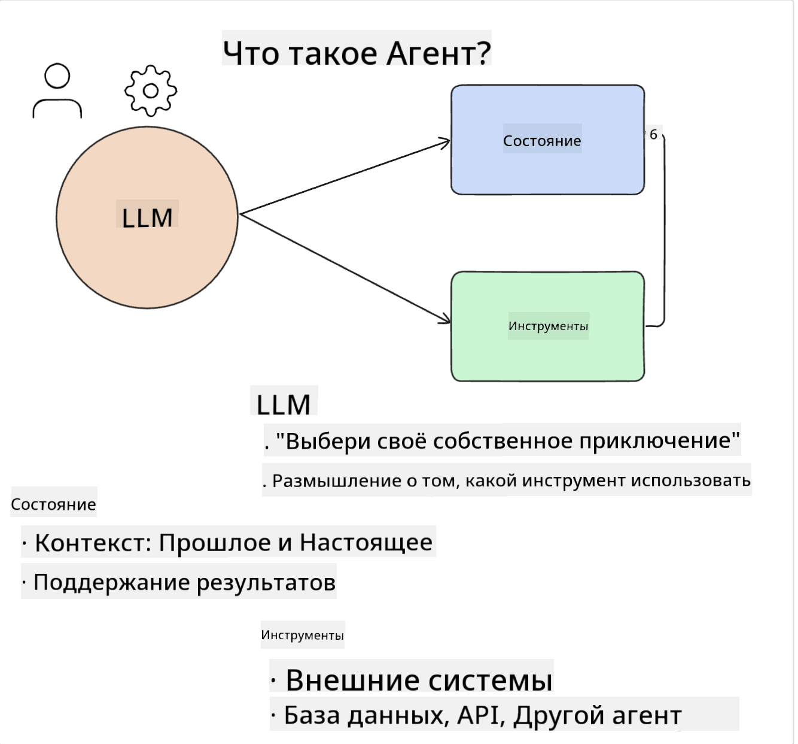
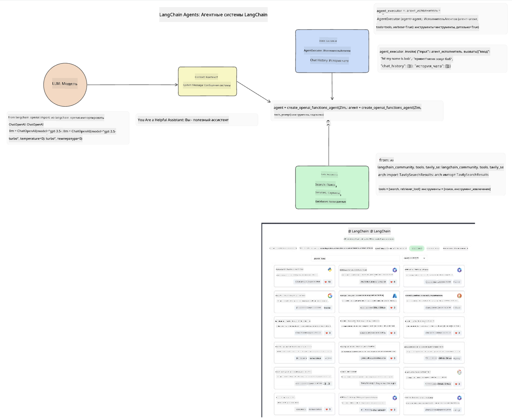
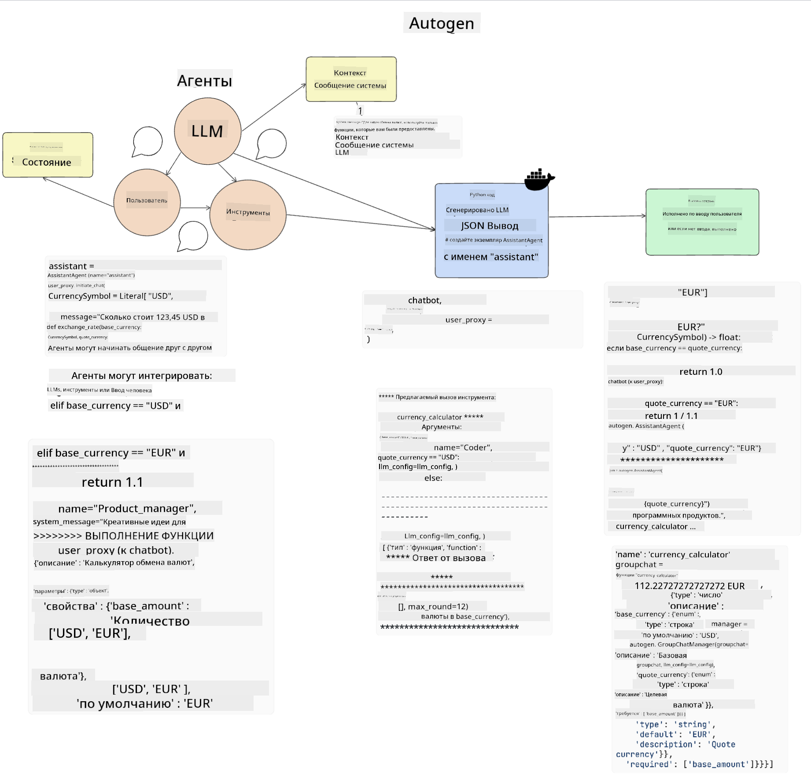
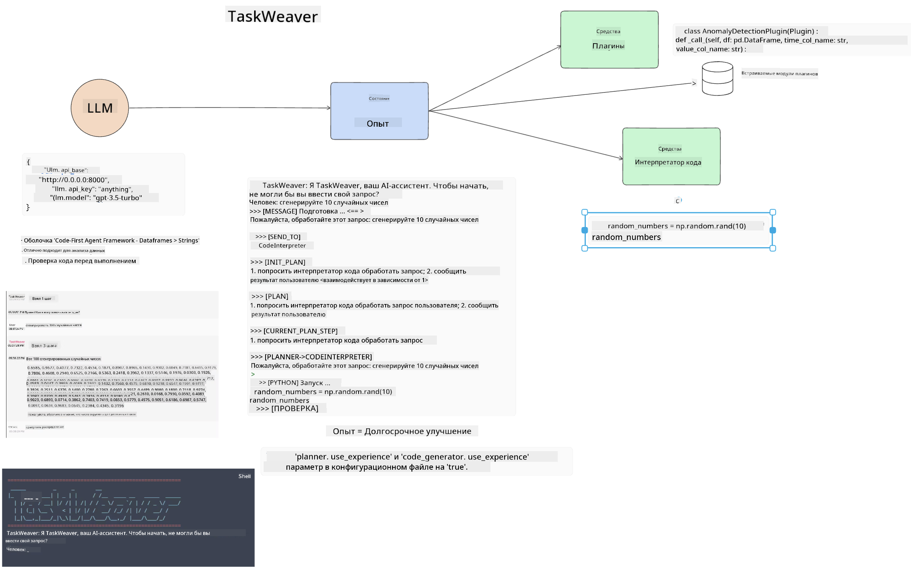

<!--
CO_OP_TRANSLATOR_METADATA:
{
  "original_hash": "11f03c81f190d9cbafd0f977dcbede6c",
  "translation_date": "2025-06-26T00:08:54+00:00",
  "source_file": "17-ai-agents/README.md",
  "language_code": "ru"
}
-->
[](https://aka.ms/gen-ai-lesson17-gh?WT.mc_id=academic-105485-koreyst)

## Введение

AI-агенты представляют собой захватывающее развитие в области генеративного ИИ, позволяя крупным языковым моделям (LLM) эволюционировать от помощников до агентов, способных совершать действия. Фреймворки AI-агентов позволяют разработчикам создавать приложения, которые предоставляют LLM доступ к инструментам и управлению состоянием. Эти фреймворки также повышают видимость, позволяя пользователям и разработчикам контролировать действия, запланированные LLM, тем самым улучшая управление опытом.

Урок охватит следующие области:

- Понимание, что такое AI-агент - Что именно представляет собой AI-агент?
- Исследование четырех различных фреймворков AI-агентов - Что делает их уникальными?
- Применение этих AI-агентов к различным случаям использования - Когда следует использовать AI-агентов?

## Цели обучения

После прохождения этого урока вы сможете:

- Объяснить, что такое AI-агенты и как их можно использовать.
- Иметь представление о различиях между некоторыми популярными фреймворками AI-агентов и как они отличаются.
- Понять, как функционируют AI-агенты, чтобы создавать приложения с их использованием.

## Что такое AI-агенты?

AI-агенты - это очень захватывающая область в мире генеративного ИИ. С этим волнением иногда приходит путаница в терминах и их применении. Чтобы упростить и включить большинство инструментов, относящихся к AI-агентам, мы будем использовать следующее определение:

AI-агенты позволяют крупным языковым моделям (LLM) выполнять задачи, предоставляя им доступ к **состоянию** и **инструментам**.



Давайте определим эти термины:

**Крупные языковые модели** - Это модели, упоминаемые на протяжении всего курса, такие как GPT-3.5, GPT-4, Llama-2 и т.д.

**Состояние** - Это относится к контексту, в котором работает LLM. LLM использует контекст своих прошлых действий и текущий контекст, направляя принятие решений для последующих действий. Фреймворки AI-агентов позволяют разработчикам легче поддерживать этот контекст.

**Инструменты** - Для выполнения задачи, которую запросил пользователь и которую LLM запланировал, LLM нужен доступ к инструментам. Некоторые примеры инструментов могут быть базой данных, API, внешним приложением или даже другим LLM!

Эти определения, надеюсь, дадут вам хорошую основу для дальнейшего изучения того, как они реализуются. Давайте изучим несколько различных фреймворков AI-агентов:

## LangChain Agents

[LangChain Agents](https://python.langchain.com/docs/how_to/#agents?WT.mc_id=academic-105485-koreyst) - это реализация определений, которые мы предоставили выше.

Для управления **состоянием** используется встроенная функция, называемая `AgentExecutor`. Она принимает определенные `agent` и `tools`, доступные ей.

`Agent Executor` также хранит историю чата, чтобы предоставить контекст общения.



LangChain предлагает [каталог инструментов](https://integrations.langchain.com/tools?WT.mc_id=academic-105485-koreyst), которые можно импортировать в ваше приложение, к которому LLM может получить доступ. Они созданы сообществом и командой LangChain.

Вы можете затем определить эти инструменты и передать их в `Agent Executor`.

Видимость - еще один важный аспект, когда речь идет об AI-агентах. Важно, чтобы разработчики приложений понимали, какой инструмент использует LLM и почему. Для этого команда LangChain разработала LangSmith.

## AutoGen

Следующий фреймворк AI-агентов, который мы обсудим, это [AutoGen](https://microsoft.github.io/autogen/?WT.mc_id=academic-105485-koreyst). Основное внимание AutoGen уделяет разговорам. Агенты могут быть **общительными** и **настраиваемыми**.

**Общительные -** LLM могут начинать и продолжать разговор с другим LLM для выполнения задачи. Это достигается путем создания `AssistantAgents` и предоставления им конкретного системного сообщения.

```python

autogen.AssistantAgent( name="Coder", llm_config=llm_config, ) pm = autogen.AssistantAgent( name="Product_manager", system_message="Creative in software product ideas.", llm_config=llm_config, )

```

**Настраиваемые** - Агенты могут быть определены не только как LLM, но также как пользователь или инструмент. Как разработчик, вы можете определить `UserProxyAgent`, который отвечает за взаимодействие с пользователем для получения обратной связи при выполнении задачи. Эта обратная связь может либо продолжить выполнение задачи, либо остановить его.

```python
user_proxy = UserProxyAgent(name="user_proxy")
```

### Состояние и инструменты

Для изменения и управления состоянием вспомогательный агент генерирует код на Python для выполнения задачи.

Вот пример процесса:



#### LLM определен с системным сообщением

```python
system_message="For weather related tasks, only use the functions you have been provided with. Reply TERMINATE when the task is done."
```

Это системное сообщение направляет конкретный LLM на то, какие функции являются актуальными для его задачи. Помните, с AutoGen вы можете иметь несколько определенных AssistantAgents с различными системными сообщениями.

#### Чат инициируется пользователем

```python
user_proxy.initiate_chat( chatbot, message="I am planning a trip to NYC next week, can you help me pick out what to wear? ", )

```

Это сообщение от user_proxy (Человек) запускает процесс агента для исследования возможных функций, которые он должен выполнить.

#### Функция выполняется

```bash
chatbot (to user_proxy):

***** Suggested tool Call: get_weather ***** Arguments: {"location":"New York City, NY","time_periond:"7","temperature_unit":"Celsius"} ******************************************************** --------------------------------------------------------------------------------

>>>>>>>> EXECUTING FUNCTION get_weather... user_proxy (to chatbot): ***** Response from calling function "get_weather" ***** 112.22727272727272 EUR ****************************************************************

```

После обработки начального чата агент отправит предложенный инструмент для вызова. В этом случае это функция, называемая `get_weather`. Depending on your configuration, this function can be automatically executed and read by the Agent or can be executed based on user input.

You can find a list of [AutoGen code samples](https://microsoft.github.io/autogen/docs/Examples/?WT.mc_id=academic-105485-koreyst) to further explore how to get started building.

## Taskweaver

The next agent framework we will explore is [Taskweaver](https://microsoft.github.io/TaskWeaver/?WT.mc_id=academic-105485-koreyst). It is known as a "code-first" agent because instead of working strictly with `strings` , it can work with DataFrames in Python. This becomes extremely useful for data analysis and generation tasks. This can be things like creating graphs and charts or generating random numbers.

### State and Tools

To manage the state of the conversation, TaskWeaver uses the concept of a `Planner`. The `Planner` is a LLM that takes the request from the users and maps out the tasks that need to be completed to fulfill this request.

To complete the tasks the `Planner` is exposed to the collection of tools called `Plugins`. Это могут быть классы Python или общий интерпретатор кода. Эти плагины хранятся как встраивания, чтобы LLM мог лучше искать правильный плагин.



Вот пример плагина для обработки обнаружения аномалий:

```python
class AnomalyDetectionPlugin(Plugin): def __call__(self, df: pd.DataFrame, time_col_name: str, value_col_name: str):
```

Код проверяется перед выполнением. Еще одной функцией для управления контекстом в Taskweaver является `experience`. Experience allows for the context of a conversation to be stored over to the long term in a YAML file. This can be configured so that the LLM improves over time on certain tasks given that it is exposed to prior conversations.

## JARVIS

The last agent framework we will explore is [JARVIS](https://github.com/microsoft/JARVIS?tab=readme-ov-file?WT.mc_id=academic-105485-koreyst). What makes JARVIS unique is that it uses an LLM to manage the `state` беседы, и `tools` являются другими моделями AI. Каждая из моделей AI - это специализированные модели, выполняющие определенные задачи, такие как обнаружение объектов, транскрипция или описание изображений.


LLM, являясь моделью общего назначения, получает запрос от пользователя и идентифицирует конкретную задачу и любые аргументы/данные, необходимые для выполнения задачи.

```python
[{"task": "object-detection", "id": 0, "dep": [-1], "args": {"image": "e1.jpg" }}]
```

Затем LLM форматирует запрос таким образом, чтобы специализированная модель AI могла его интерпретировать, например, в формате JSON. После того, как модель AI вернула свой прогноз на основе задачи, LLM получает ответ.

Если для выполнения задачи требуется несколько моделей, он также интерпретирует ответы от этих моделей, прежде чем объединить их для генерации ответа пользователю.

Пример ниже показывает, как это будет работать, когда пользователь запрашивает описание и количество объектов на картинке:

## Задание

Чтобы продолжить изучение AI-агентов, вы можете создать с AutoGen:

- Приложение, имитирующее деловую встречу с различными отделами образовательного стартапа.
- Создайте системные сообщения, которые помогут LLM понять разные персонажи и приоритеты, и позволят пользователю предложить новую идею продукта.
- Затем LLM должен сгенерировать последующие вопросы от каждого отдела, чтобы уточнить и улучшить предложение и идею продукта.

## Обучение не останавливается здесь, продолжайте путешествие

После завершения этого урока, ознакомьтесь с нашей [коллекцией обучения генеративному ИИ](https://aka.ms/genai-collection?WT.mc_id=academic-105485-koreyst), чтобы продолжить повышать свои знания о генеративном ИИ!

**Отказ от ответственности**:  
Этот документ был переведен с использованием сервиса автоматического перевода [Co-op Translator](https://github.com/Azure/co-op-translator). Хотя мы стремимся к точности, пожалуйста, имейте в виду, что автоматизированные переводы могут содержать ошибки или неточности. Оригинальный документ на его родном языке следует считать авторитетным источником. Для критически важной информации рекомендуется профессиональный перевод человеком. Мы не несем ответственности за любые недоразумения или неверные толкования, возникающие в результате использования этого перевода.