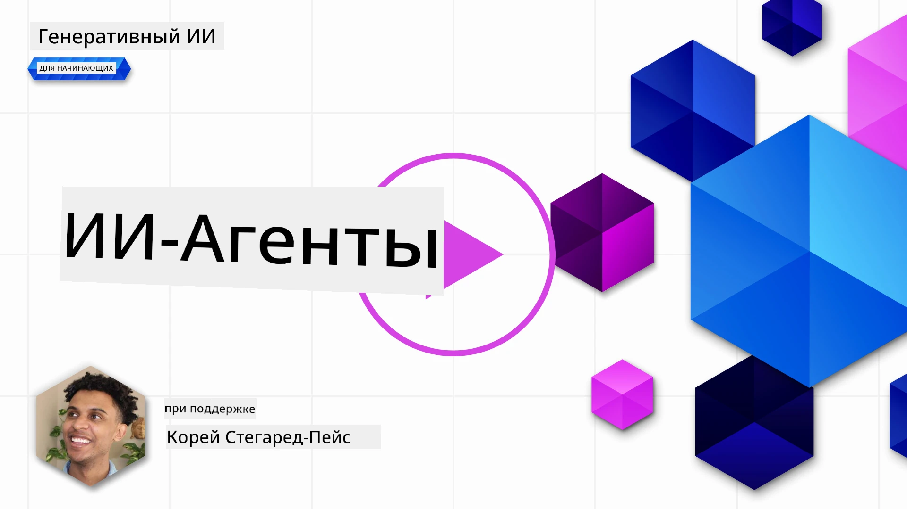
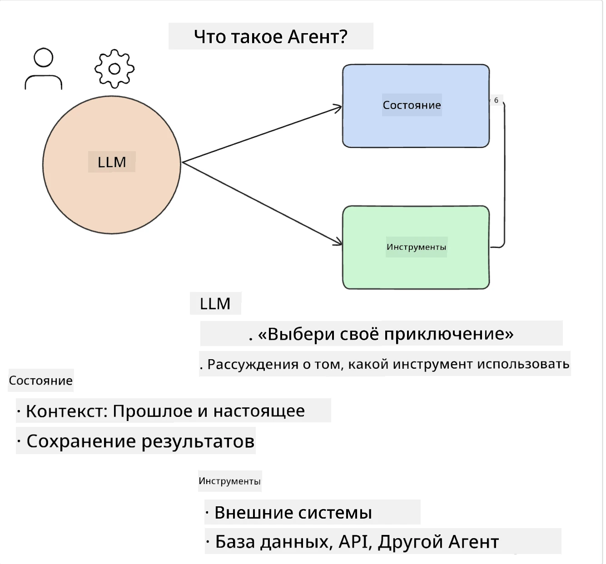
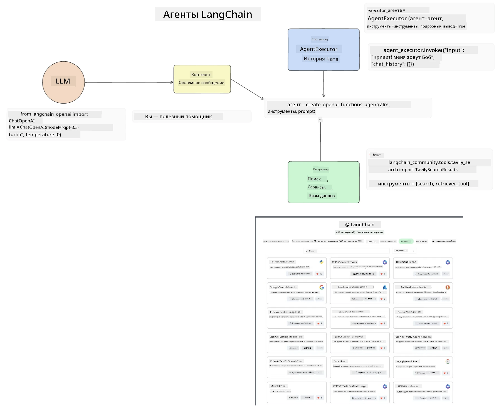
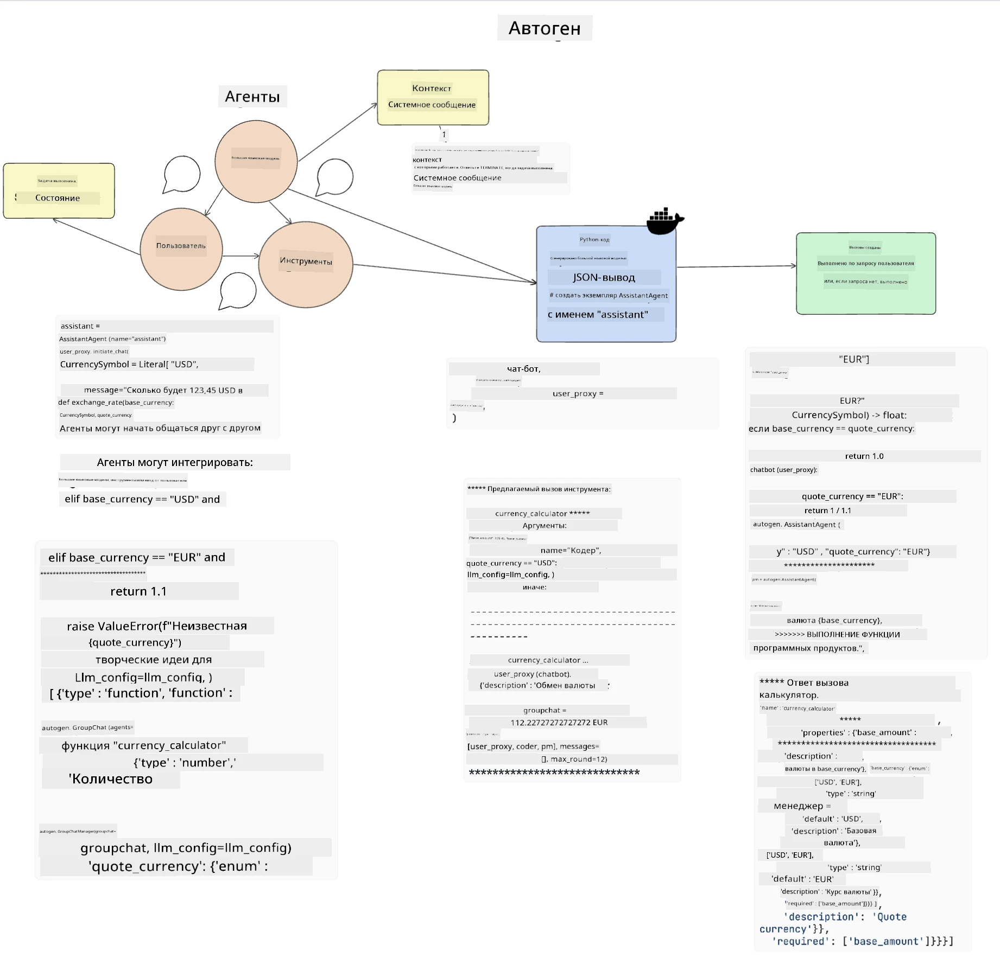
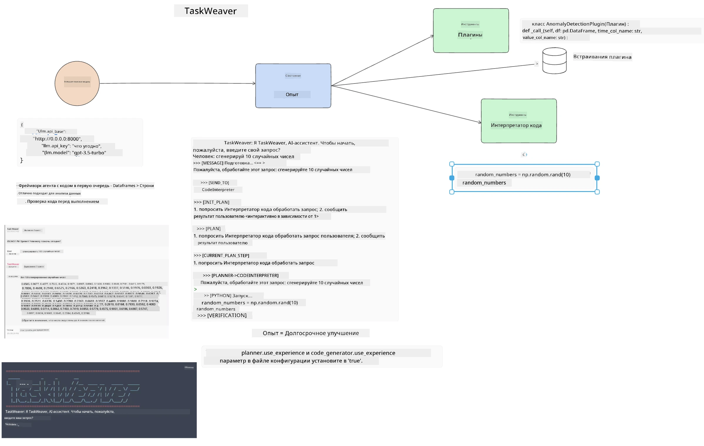
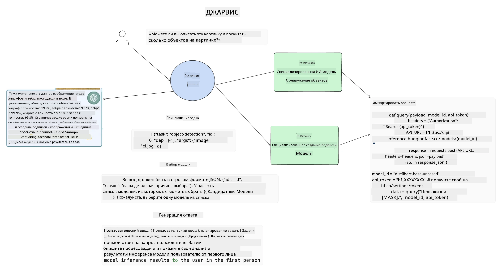

[](https://youtu.be/yAXVW-lUINc?si=bOtW9nL6jc3XJgOM)

## Введение

AI-агенты представляют собой захватывающее развитие в области генеративного ИИ, позволяя большим языковым моделям (LLM) эволюционировать от помощников к агентам, способным выполнять действия. Фреймворки AI-агентов дают разработчикам возможность создавать приложения, предоставляющие LLM доступ к инструментам и управлению состоянием. Эти фреймворки также улучшают прозрачность, позволяя пользователям и разработчикам отслеживать действия, запланированные LLM, что повышает качество управления опытом.

В уроке будут рассмотрены следующие темы:

- Понимание, что такое AI-агент — что именно представляет собой AI-агент?
- Изучение четырех различных фреймворков для AI-агентов — что делает их уникальными?
- Применение этих AI-агентов к разным сценариям использования — когда следует использовать AI-агентов?

## Цели обучения

После прохождения этого урока вы сможете:

- Объяснять, что такое AI-агенты и как их можно использовать.
- Понимать различия между некоторыми популярными фреймворками AI-агентов и как они отличаются.
- Понимать, как работают AI-агенты, чтобы создавать приложения с их использованием.

## Что такое AI-агенты?

AI-агенты — это очень увлекательная область в мире генеративного ИИ. С этим воодушевлением иногда возникает путаница с терминами и их применением. Чтобы упростить и охватить большинство инструментов, которые относятся к AI-агентам, мы будем использовать следующее определение:

AI-агенты позволяют большим языковым моделям (LLM) выполнять задачи, предоставляя им доступ к **состоянию** и **инструментам**.



Давайте определим эти термины:

**Большие языковые модели** — это модели, упоминаемые в этом курсе, такие как GPT-3.5, GPT-4, Llama-2 и другие.

**Состояние** — это контекст, в котором работает LLM. LLM использует контекст своих прошлых действий и текущий контекст для управления принятием решений при выполнении последующих действий. Фреймворки AI-агентов позволяют разработчикам проще поддерживать этот контекст.

**Инструменты** — чтобы выполнить задачу, которую запросил пользователь и которую спланировал LLM, LLM нужен доступ к инструментам. Примерами инструментов могут быть база данных, API, внешнее приложение или даже другая LLM!

Эти определения помогут вам лучше понять дальнейший материал о том, как они реализованы. Давайте рассмотрим несколько различных фреймворков AI-агентов:

## LangChain Agents

[LangChain Agents](https://python.langchain.com/docs/how_to/#agents?WT.mc_id=academic-105485-koreyst) — реализация приведенных выше определений.

Для управления **состоянием** используется встроенная функция `AgentExecutor`. Она принимает определенного `агента` и доступные `инструменты`.

`AgentExecutor` также хранит историю чата для предоставления контекста при диалоге.



LangChain предлагает [каталог инструментов](https://integrations.langchain.com/tools?WT.mc_id=academic-105485-koreyst), которые можно импортировать в ваше приложение, чтобы предоставить к ним доступ LLM. Эти инструменты созданы сообществом и командой LangChain.

Вы затем можете определить эти инструменты и передать их `AgentExecutor`.

Видимость — еще один важный аспект при работе с AI-агентами. Важно для разработчиков приложений понимать, какой инструмент использует LLM и почему. Для этого команда LangChain разработала LangSmith.

## AutoGen

Следующий фреймворк AI-агентов, который мы рассмотрим, — [AutoGen](https://microsoft.github.io/autogen/?WT.mc_id=academic-105485-koreyst). Основное внимание в AutoGen уделяется разговорам. Агенты могут быть как **общающимися**, так и **настраиваемыми**.

**Общаемые —** LLM могут начать и вести разговор с другой LLM, чтобы выполнить задачу. Это достигается созданием `AssistantAgents` и предоставлением им определенного системного сообщения.

```python

autogen.AssistantAgent( name="Coder", llm_config=llm_config, ) pm = autogen.AssistantAgent( name="Product_manager", system_message="Creative in software product ideas.", llm_config=llm_config, )

```

**Настраиваемые** — агенты могут быть определены не только как LLM, но и как пользователь или инструмент. Как разработчик, вы можете определить `UserProxyAgent`, который отвечает за взаимодействие с пользователем для получения обратной связи при выполнении задачи. Эта обратная связь может либо продолжить выполнение задачи, либо прекратить его.

```python
user_proxy = UserProxyAgent(name="user_proxy")
```

### Состояние и инструменты

Для изменения и управления состоянием помощник-агент генерирует Python-код для выполнения задачи.

Вот пример процесса:



#### LLM с определенным системным сообщением

```python
system_message="For weather related tasks, only use the functions you have been provided with. Reply TERMINATE when the task is done."
```

Это системное сообщение направляет конкретный LLM на те функции, которые релевантны для его задачи. Помните, с AutoGen вы можете иметь несколько определенных AssistantAgents с разными системными сообщениями.

#### Чат инициируется пользователем

```python
user_proxy.initiate_chat( chatbot, message="I am planning a trip to NYC next week, can you help me pick out what to wear? ", )

```

Это сообщение от user_proxy (человека) запускает процесс, в ходе которого агент исследует возможные функции, которые должен выполнить.

#### Выполнение функции

```bash
chatbot (to user_proxy):

***** Suggested tool Call: get_weather ***** Arguments: {"location":"New York City, NY","time_periond:"7","temperature_unit":"Celsius"} ******************************************************** --------------------------------------------------------------------------------

>>>>>>>> EXECUTING FUNCTION get_weather... user_proxy (to chatbot): ***** Response from calling function "get_weather" ***** 112.22727272727272 EUR ****************************************************************

```

После обработки начального чата агент предложит вызов инструмента. В данном случае это функция `get_weather`. В зависимости от вашей конфигурации эта функция может выполняться автоматически и читаться агентом, либо выполняться на основе пользовательского ввода.

Вы можете найти список [примеров кода AutoGen](https://microsoft.github.io/autogen/docs/Examples/?WT.mc_id=academic-105485-koreyst), чтобы углубленно изучить, как начать разработку.

## Taskweaver

Следующий фреймворк, который мы рассмотрим, — [Taskweaver](https://microsoft.github.io/TaskWeaver/?WT.mc_id=academic-105485-koreyst). Его называют "code-first" агентом, потому что вместо работы строго со `строками` он работает с DataFrame в Python. Это становится крайне полезным для задач анализа данных и генерации. Это может быть создание графиков, диаграмм или генерация случайных чисел.

### Состояние и инструменты

Для управления состоянием разговора TaskWeaver использует концепцию `Planner`. `Planner` — это LLM, который принимает запрос пользователя и разбивает его на задачи, которые нужно выполнить для удовлетворения этого запроса.

Для выполнения задач `Planner` получает доступ к набору инструментов под названием `Plugins`. Это могут быть классы Python или общий интерпретатор кода. Эти плагины хранятся в виде embedding для улучшения поиска подходящего плагина LLM.



Вот пример плагина для обнаружения аномалий:

```python
class AnomalyDetectionPlugin(Plugin): def __call__(self, df: pd.DataFrame, time_col_name: str, value_col_name: str):
```

Код проверяется перед выполнением. Еще одна возможность для управления контекстом в Taskweaver — это `experience`. Experience позволяет сохранять контекст разговора на длительный срок в YAML-файле. Это можно настроить так, чтобы LLM со временем улучшалась в определенных задачах, получая доступ к предыдущим разговорам.

## JARVIS

Последний фреймворк, который мы рассмотрим, — [JARVIS](https://github.com/microsoft/JARVIS?tab=readme-ov-file&WT.mc_id=academic-105485-koreyst). Уникальность JARVIS в том, что он использует LLM для управления `состоянием` разговора, а `инструментами` служат другие AI-модели. Каждая из этих AI-моделей — специализированная модель, выполняющая определённые задачи, такие как обнаружение объектов, транскрипция или создание описаний изображений.



LLM, являясь моделью общего назначения, получает запрос от пользователя, определяет конкретную задачу и любые аргументы/данные, необходимые для выполнения задачи.

```python
[{"task": "object-detection", "id": 0, "dep": [-1], "args": {"image": "e1.jpg" }}]
```

Затем LLM форматирует запрос в формате, который может интерпретировать специализированная AI-модель, например JSON. После того, как AI-модель вернет прогноз по задаче, LLM получает ответ.

Если для выполнения задачи требуется несколько моделей, LLM также интерпретирует ответы этих моделей перед объединением их в итоговый ответ пользователю.

Пример ниже показывает, как это работает, когда пользователь запрашивает описание и подсчет объектов на изображении:

## Задание

Для продолжения изучения AI-агентов вы можете построить с AutoGen:

- Приложение, симулирующее деловое совещание с разными отделами образовательного стартапа.
- Создайте системные сообщения, которые направляют LLM в понимании разных персон и приоритетов, позволяя пользователю представить новую идею продукта.
- LLM затем должен сформировать последующие вопросы от каждого отдела для уточнения и улучшения презентации и идеи продукта.

## Обучение на этом не заканчивается, продолжайте путешествие

После завершения этого урока ознакомьтесь с нашей [коллекцией по генеративному ИИ](https://aka.ms/genai-collection?WT.mc_id=academic-105485-koreyst), чтобы продолжать повышать свои знания в области генеративного ИИ!

---

<!-- CO-OP TRANSLATOR DISCLAIMER START -->
**Отказ от ответственности**:  
Этот документ был переведен с использованием сервиса автоматического перевода [Co-op Translator](https://github.com/Azure/co-op-translator). Несмотря на наши усилия по обеспечению точности, пожалуйста, имейте в виду, что автоматический перевод может содержать ошибки или неточности. Оригинальный документ на языке оригинала следует считать авторитетным источником. Для получения критически важной информации рекомендуется воспользоваться услугами профессионального переводчика. Мы не несем ответственности за любые недоразумения или неправильные толкования, возникающие при использовании этого перевода.
<!-- CO-OP TRANSLATOR DISCLAIMER END -->