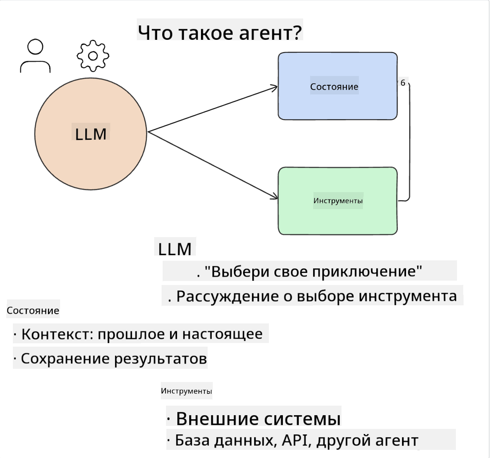
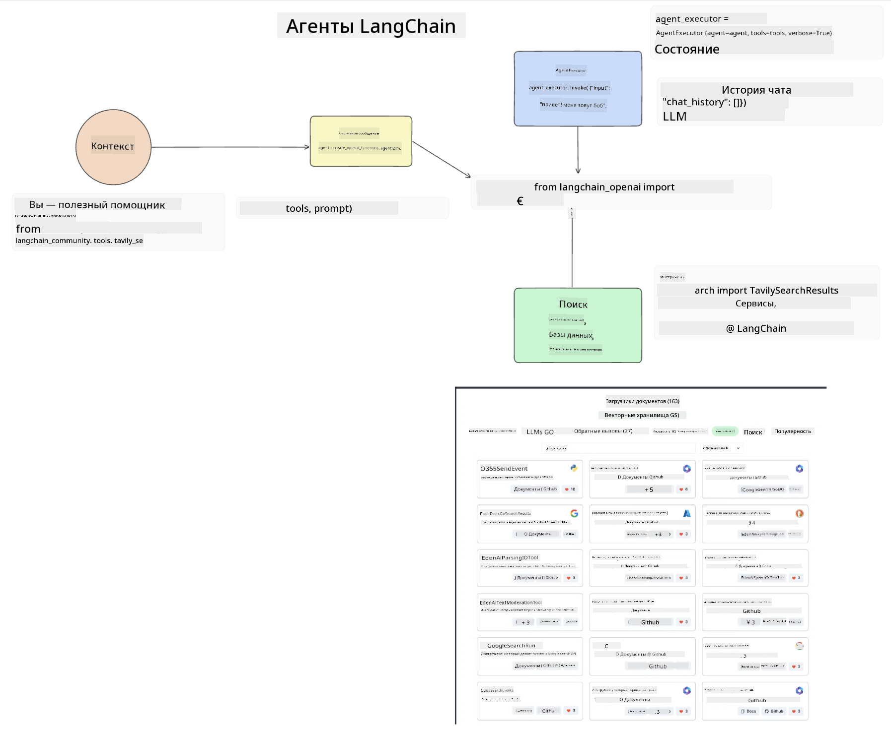
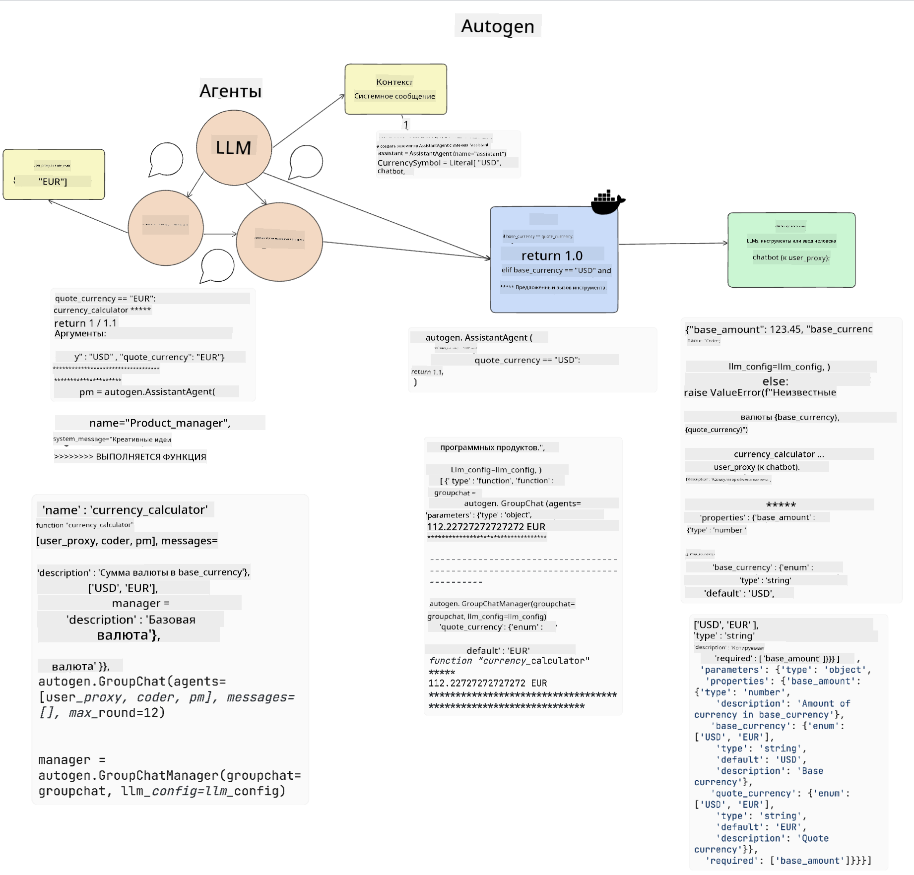

<!--
CO_OP_TRANSLATOR_METADATA:
{
  "original_hash": "8e8d1f6a63da606af7176a87ff8e92b6",
  "translation_date": "2025-10-17T15:09:36+00:00",
  "source_file": "17-ai-agents/README.md",
  "language_code": "ru"
}
-->
[](https://youtu.be/yAXVW-lUINc?si=bOtW9nL6jc3XJgOM)

## Введение

AI-агенты представляют собой захватывающее развитие в области генеративного ИИ, позволяя большим языковым моделям (LLM) эволюционировать от помощников к агентам, способным выполнять действия. Фреймворки AI-агентов дают разработчикам возможность создавать приложения, предоставляющие LLM доступ к инструментам и управлению состоянием. Эти фреймворки также повышают прозрачность, позволяя пользователям и разработчикам отслеживать действия, запланированные LLM, что улучшает управление опытом.

В уроке будут рассмотрены следующие темы:

- Понимание, что такое AI-агент - Что именно представляет собой AI-агент?
- Изучение четырех различных фреймворков AI-агентов - Чем они уникальны?
- Применение этих AI-агентов к различным сценариям использования - Когда следует использовать AI-агентов?

## Цели обучения

После прохождения этого урока вы сможете:

- Объяснить, что такое AI-агенты и как их можно использовать.
- Понять различия между некоторыми популярными фреймворками AI-агентов и их особенности.
- Осознать, как работают AI-агенты, чтобы создавать приложения с их использованием.

## Что такое AI-агенты?

AI-агенты — это очень интересная область в мире генеративного ИИ. С этим интересом иногда приходит путаница в терминах и их применении. Чтобы упростить понимание и охватить большинство инструментов, относящихся к AI-агентам, мы будем использовать следующее определение:

AI-агенты позволяют большим языковым моделям (LLM) выполнять задачи, предоставляя им доступ к **состоянию** и **инструментам**.



Давайте определим эти термины:

**Большие языковые модели** - Это модели, упоминаемые в этом курсе, такие как GPT-3.5, GPT-4, Llama-2 и другие.

**Состояние** - Это контекст, в котором работает LLM. LLM использует контекст своих предыдущих действий и текущий контекст, направляя свои решения для последующих действий. Фреймворки AI-агентов позволяют разработчикам легче поддерживать этот контекст.

**Инструменты** - Чтобы выполнить задачу, которую запросил пользователь и которую LLM спланировал, LLM нужен доступ к инструментам. Примеры инструментов: база данных, API, внешнее приложение или даже другой LLM!

Эти определения, надеемся, дадут вам хорошую основу для дальнейшего изучения их реализации. Давайте рассмотрим несколько различных фреймворков AI-агентов:

## LangChain Agents

[LangChain Agents](https://python.langchain.com/docs/how_to/#agents?WT.mc_id=academic-105485-koreyst) — это реализация вышеуказанных определений.

Для управления **состоянием** используется встроенная функция `AgentExecutor`. Она принимает определенного `агента` и доступные ему `инструменты`.

`AgentExecutor` также сохраняет историю чата, чтобы предоставить контекст общения.



LangChain предлагает [каталог инструментов](https://integrations.langchain.com/tools?WT.mc_id=academic-105485-koreyst), которые можно импортировать в ваше приложение, чтобы LLM мог получить к ним доступ. Эти инструменты создаются сообществом и командой LangChain.

Вы можете определить эти инструменты и передать их в `AgentExecutor`.

Прозрачность — еще один важный аспект при обсуждении AI-агентов. Важно, чтобы разработчики приложений понимали, какой инструмент использует LLM и почему. Для этого команда LangChain разработала LangSmith.

## AutoGen

Следующий фреймворк AI-агентов, который мы обсудим, — это [AutoGen](https://microsoft.github.io/autogen/?WT.mc_id=academic-105485-koreyst). Основное внимание в AutoGen уделяется разговорам. Агенты являются одновременно **разговорными** и **настраиваемыми**.

**Разговорные** - LLM могут начинать и продолжать разговор с другим LLM, чтобы выполнить задачу. Это достигается путем создания `AssistantAgents` и предоставления им определенного системного сообщения.

```python

autogen.AssistantAgent( name="Coder", llm_config=llm_config, ) pm = autogen.AssistantAgent( name="Product_manager", system_message="Creative in software product ideas.", llm_config=llm_config, )

```

**Настраиваемые** - Агенты могут быть определены не только как LLM, но и как пользователь или инструмент. Как разработчик, вы можете определить `UserProxyAgent`, который отвечает за взаимодействие с пользователем для получения обратной связи при выполнении задачи. Эта обратная связь может либо продолжить выполнение задачи, либо остановить его.

```python
user_proxy = UserProxyAgent(name="user_proxy")
```

### Состояние и инструменты

Для изменения и управления состоянием помощник-агент генерирует код на Python для выполнения задачи.

Вот пример процесса:



#### LLM, определенный с системным сообщением

```python
system_message="For weather related tasks, only use the functions you have been provided with. Reply TERMINATE when the task is done."
```

Это системное сообщение направляет конкретный LLM к функциям, которые имеют отношение к его задаче. Помните, что с AutoGen вы можете иметь несколько определенных AssistantAgents с различными системными сообщениями.

#### Чат инициируется пользователем

```python
user_proxy.initiate_chat( chatbot, message="I am planning a trip to NYC next week, can you help me pick out what to wear? ", )

```

Это сообщение от user_proxy (человека) запускает процесс, в котором агент исследует возможные функции, которые он должен выполнить.

#### Функция выполняется

```bash
chatbot (to user_proxy):

***** Suggested tool Call: get_weather ***** Arguments: {"location":"New York City, NY","time_periond:"7","temperature_unit":"Celsius"} ******************************************************** --------------------------------------------------------------------------------

>>>>>>>> EXECUTING FUNCTION get_weather... user_proxy (to chatbot): ***** Response from calling function "get_weather" ***** 112.22727272727272 EUR ****************************************************************

```

После обработки начального чата агент предложит инструмент для вызова. В данном случае это функция `get_weather`. В зависимости от вашей конфигурации эта функция может быть автоматически выполнена и прочитана агентом или выполнена на основе ввода пользователя.

Вы можете найти список [примеров кода AutoGen](https://microsoft.github.io/autogen/docs/Examples/?WT.mc_id=academic-105485-koreyst), чтобы подробнее изучить, как начать разработку.

## Taskweaver

Следующий фреймворк агентов, который мы рассмотрим, — это [Taskweaver](https://microsoft.github.io/TaskWeaver/?WT.mc_id=academic-105485-koreyst). Он известен как агент "сначала код", потому что вместо работы строго со `строками` он может работать с DataFrame в Python. Это становится чрезвычайно полезным для задач анализа данных и генерации. Например, создание графиков и диаграмм или генерация случайных чисел.

### Состояние и инструменты

Для управления состоянием разговора Taskweaver использует концепцию `Planner`. `Planner` — это LLM, который принимает запрос от пользователей и планирует задачи, которые необходимо выполнить для выполнения этого запроса.

Для выполнения задач `Planner` имеет доступ к коллекции инструментов, называемых `Plugins`. Это могут быть классы Python или общий интерпретатор кода. Эти плагины хранятся в виде эмбеддингов, чтобы LLM мог лучше искать подходящий плагин.


Вот пример плагина для обработки обнаружения аномалий:

```python
class AnomalyDetectionPlugin(Plugin): def __call__(self, df: pd.DataFrame, time_col_name: str, value_col_name: str):
```

Код проверяется перед выполнением. Еще одна функция для управления контекстом в Taskweaver — это `experience`. Опыт позволяет сохранять контекст разговора в долгосрочной перспективе в YAML-файле. Это можно настроить так, чтобы LLM улучшался со временем в определенных задачах, учитывая, что он сталкивался с предыдущими разговорами.

## JARVIS

Последний фреймворк агентов, который мы рассмотрим, — это [JARVIS](https://github.com/microsoft/JARVIS?tab=readme-ov-file?WT.mc_id=academic-105485-koreyst). Уникальность JARVIS заключается в том, что он использует LLM для управления `состоянием` разговора, а `инструменты` — это другие модели ИИ. Каждая из моделей ИИ является специализированной и выполняет определенные задачи, такие как обнаружение объектов, транскрипция или описание изображений.


LLM, будучи универсальной моделью, получает запрос от пользователя и определяет конкретную задачу и любые аргументы/данные, необходимые для выполнения задачи.

```python
[{"task": "object-detection", "id": 0, "dep": [-1], "args": {"image": "e1.jpg" }}]
```

LLM затем форматирует запрос таким образом, чтобы специализированная модель ИИ могла его интерпретировать, например, в формате JSON. После того как модель ИИ возвращает свой прогноз на основе задачи, LLM получает ответ.

Если для выполнения задачи требуется несколько моделей, LLM также интерпретирует ответы от этих моделей, прежде чем объединить их для генерации ответа пользователю.

Пример ниже показывает, как это работает, когда пользователь запрашивает описание и количество объектов на изображении:

## Задание

Чтобы продолжить изучение AI-агентов, вы можете создать с AutoGen:

- Приложение, которое симулирует бизнес-встречу с различными отделами образовательного стартапа.
- Создайте системные сообщения, которые помогут LLM понять разные роли и приоритеты, и позволят пользователю представить новую идею продукта.
- LLM затем должен сгенерировать последующие вопросы от каждого отдела, чтобы уточнить и улучшить презентацию и идею продукта.

## Обучение не заканчивается здесь, продолжайте путь

После завершения этого урока ознакомьтесь с нашей [коллекцией обучения генеративному ИИ](https://aka.ms/genai-collection?WT.mc_id=academic-105485-koreyst), чтобы продолжить углублять свои знания в области генеративного ИИ!

---

**Отказ от ответственности**:  
Этот документ был переведен с использованием сервиса автоматического перевода [Co-op Translator](https://github.com/Azure/co-op-translator). Несмотря на наши усилия обеспечить точность, автоматические переводы могут содержать ошибки или неточности. Оригинальный документ на его родном языке следует считать авторитетным источником. Для получения критически важной информации рекомендуется профессиональный перевод человеком. Мы не несем ответственности за любые недоразумения или неправильные интерпретации, возникающие в результате использования данного перевода.