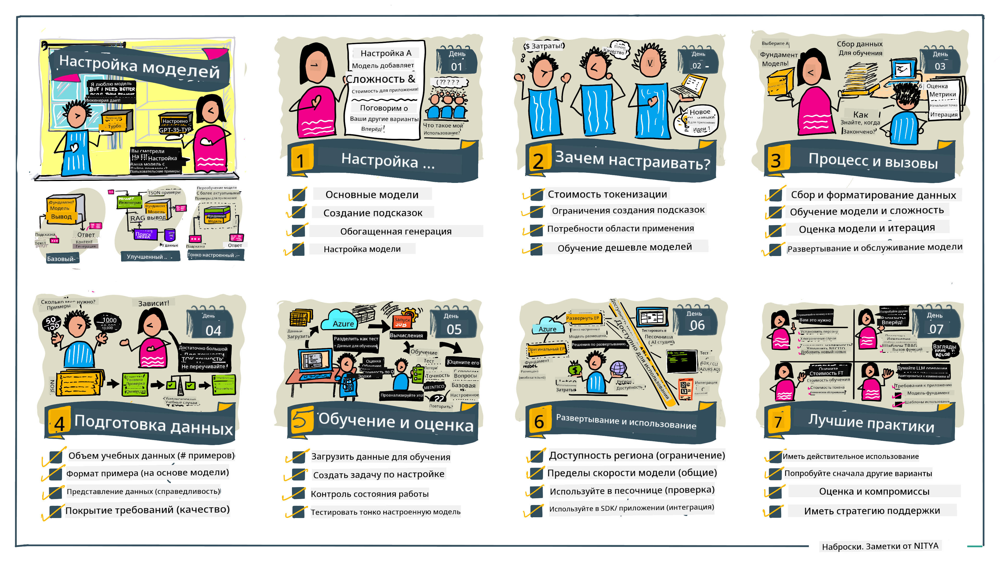

<!--
CO_OP_TRANSLATOR_METADATA:
{
  "original_hash": "807f0d9fc1747e796433534e1be6a98a",
  "translation_date": "2025-10-17T15:06:58+00:00",
  "source_file": "18-fine-tuning/README.md",
  "language_code": "ru"
}
-->

# Тонкая настройка вашего LLM

Использование больших языковых моделей для создания приложений генеративного ИИ связано с новыми вызовами. Одной из ключевых проблем является обеспечение качества ответов (точности и релевантности) в контенте, создаваемом моделью по запросу пользователя. В предыдущих уроках мы обсуждали такие техники, как инженерия подсказок и генерация с дополнением извлечения, которые пытаются решить проблему путем _модификации входных данных подсказки_ для существующей модели.

На сегодняшнем уроке мы обсудим третью технику — **тонкую настройку**, которая пытается решить задачу путем _переподготовки самой модели_ с использованием дополнительных данных. Давайте разберем детали.

## Цели обучения

Этот урок вводит понятие тонкой настройки для предварительно обученных языковых моделей, исследует преимущества и вызовы этого подхода, а также дает рекомендации о том, когда и как использовать тонкую настройку для улучшения производительности ваших моделей генеративного ИИ.

К концу урока вы сможете ответить на следующие вопросы:

- Что такое тонкая настройка языковых моделей?
- Когда и почему тонкая настройка полезна?
- Как можно настроить предварительно обученную модель?
- Каковы ограничения тонкой настройки?

Готовы? Давайте начнем.

## Иллюстрированное руководство

Хотите получить общее представление о том, что мы будем изучать, прежде чем углубляться? Ознакомьтесь с этим иллюстрированным руководством, которое описывает учебный процесс для этого урока — от изучения основных концепций и мотивации для тонкой настройки до понимания процесса и лучших практик выполнения задачи тонкой настройки. Это увлекательная тема для изучения, поэтому не забудьте заглянуть на страницу [Ресурсы](./RESOURCES.md?WT.mc_id=academic-105485-koreyst) для дополнительных ссылок, которые помогут вам в самостоятельном обучении!

## Что такое тонкая настройка языковых моделей?

По определению, большие языковые модели _предварительно обучены_ на больших объемах текста, полученного из различных источников, включая интернет. Как мы узнали из предыдущих уроков, нам нужны такие техники, как _инженерия подсказок_ и _генерация с дополнением извлечения_, чтобы улучшить качество ответов модели на вопросы пользователя ("подсказки").

Популярная техника инженерии подсказок включает в себя предоставление модели большего количества указаний о том, что ожидается в ответе, либо путем предоставления _инструкций_ (явное руководство), либо _нескольких примеров_ (неявное руководство). Это называется _обучением с несколькими примерами_, но у него есть два ограничения:

- Ограничения на количество токенов модели могут ограничивать количество примеров, которые вы можете предоставить, и снижать эффективность.
- Стоимость токенов модели может сделать добавление примеров к каждой подсказке дорогим и ограничить гибкость.

Тонкая настройка — это распространенная практика в системах машинного обучения, когда мы берем предварительно обученную модель и переподготавливаем ее с новыми данными, чтобы улучшить ее производительность для конкретной задачи. В контексте языковых моделей мы можем настроить предварительно обученную модель _с помощью тщательно подобранного набора примеров для конкретной задачи или области применения_, чтобы создать **кастомизированную модель**, которая может быть более точной и релевантной для этой задачи или области. Дополнительным преимуществом тонкой настройки является то, что она может также уменьшить количество примеров, необходимых для обучения с несколькими примерами, снижая использование токенов и связанные с этим расходы.

## Когда и почему следует настраивать модели?

В _этом_ контексте, когда мы говорим о тонкой настройке, мы имеем в виду **супервайзинговую** тонкую настройку, где переподготовка осуществляется путем **добавления новых данных**, которые не были частью оригинального набора данных для обучения. Это отличается от подхода несупервайзинговой тонкой настройки, где модель переподготавливается на оригинальных данных, но с другими гиперпараметрами.

Ключевое, что нужно помнить, — тонкая настройка является сложной техникой, которая требует определенного уровня экспертизы для достижения желаемых результатов. Если она выполнена неправильно, она может не дать ожидаемых улучшений и даже ухудшить производительность модели для вашей целевой области.

Итак, прежде чем вы узнаете "как" настроить языковые модели, вам нужно понять "почему" вы должны выбрать этот путь и "когда" начать процесс тонкой настройки. Начните с того, чтобы задать себе следующие вопросы:

- **Сценарий использования**: Каков ваш _сценарий использования_ для тонкой настройки? Какой аспект текущей предварительно обученной модели вы хотите улучшить?
- **Альтернативы**: Пробовали ли вы _другие техники_ для достижения желаемых результатов? Используйте их для создания базового уровня для сравнения.
  - Инженерия подсказок: Попробуйте техники, такие как подсказки с несколькими примерами, с примерами релевантных ответов на подсказки. Оцените качество ответов.
  - Генерация с дополнением извлечения: Попробуйте дополнить подсказки результатами запросов, полученными путем поиска в ваших данных. Оцените качество ответов.
- **Расходы**: Определили ли вы расходы на тонкую настройку?
  - Настраиваемость — доступна ли предварительно обученная модель для тонкой настройки?
  - Усилия — для подготовки данных для обучения, оценки и уточнения модели.
  - Вычислительные ресурсы — для выполнения задач тонкой настройки и развертывания настроенной модели.
  - Данные — доступ к достаточному количеству качественных примеров для влияния тонкой настройки.
- **Преимущества**: Подтвердили ли вы преимущества тонкой настройки?
  - Качество — превзошла ли настроенная модель базовый уровень?
  - Расходы — снижает ли она использование токенов, упрощая подсказки?
  - Расширяемость — можно ли адаптировать базовую модель для новых областей?

Ответив на эти вопросы, вы сможете решить, является ли тонкая настройка правильным подходом для вашего сценария использования. Идеально, если подход оправдан только в том случае, если преимущества перевешивают расходы. Как только вы решите продолжить, пора подумать о том, _как_ можно настроить предварительно обученную модель.

Хотите получить больше информации о процессе принятия решений? Посмотрите [Настраивать или не настраивать](https://www.youtube.com/watch?v=0Jo-z-MFxJs)

## Как можно настроить предварительно обученную модель?

Для тонкой настройки предварительно обученной модели вам потребуется:

- предварительно обученная модель для настройки
- набор данных для использования в тонкой настройке
- среда обучения для выполнения задачи тонкой настройки
- среда хостинга для развертывания настроенной модели

## Тонкая настройка на практике

Следующие ресурсы предоставляют пошаговые руководства, которые проведут вас через реальный пример с использованием выбранной модели и тщательно подобранного набора данных. Чтобы пройти эти руководства, вам потребуется учетная запись у конкретного провайдера, а также доступ к соответствующей модели и наборам данных.

| Провайдер     | Руководство                                                                                                                                                                       | Описание                                                                                                                                                                                                                                                                                                                                                                                                                        |
| ------------- | -------------------------------------------------------------------------------------------------------------------------------------------------------------------------------- | -------------------------------------------------------------------------------------------------------------------------------------------------------------------------------------------------------------------------------------------------------------------------------------------------------------------------------------------------------------------------------------------------------------------------------- |
| OpenAI        | [Как настроить чат-модели](https://github.com/openai/openai-cookbook/blob/main/examples/How_to_finetune_chat_models.ipynb?WT.mc_id=academic-105485-koreyst)                        | Узнайте, как настроить `gpt-35-turbo` для конкретной области ("помощник по рецептам"), подготовив данные для обучения, запустив задачу тонкой настройки и используя настроенную модель для вывода.                                                                                                                                                                                                                              |
| Azure OpenAI  | [Руководство по тонкой настройке GPT 3.5 Turbo](https://learn.microsoft.com/azure/ai-services/openai/tutorials/fine-tune?tabs=python-new%2Ccommand-line?WT.mc_id=academic-105485-koreyst) | Узнайте, как настроить модель `gpt-35-turbo-0613` **на Azure**, выполняя шаги по созданию и загрузке данных для обучения, запуску задачи тонкой настройки. Разверните и используйте новую модель.                                                                                                                                                                                                                                 |
| Hugging Face  | [Тонкая настройка LLM с Hugging Face](https://www.philschmid.de/fine-tune-llms-in-2024-with-trl?WT.mc_id=academic-105485-koreyst)                                                 | Этот блог-пост проведет вас через тонкую настройку _открытой LLM_ (например, `CodeLlama 7B`) с использованием библиотеки [transformers](https://huggingface.co/docs/transformers/index?WT.mc_id=academic-105485-koreyst) и [Transformer Reinforcement Learning (TRL)](https://huggingface.co/docs/trl/index?WT.mc_id=academic-105485-koreyst]) с открытыми [наборами данных](https://huggingface.co/docs/datasets/index?WT.mc_id=academic-105485-koreyst) на Hugging Face. |
|               |                                                                                                                                                                                  |                                                                                                                                                                                                                                                                                                                                                                                                                                |
| 🤗 AutoTrain  | [Тонкая настройка LLM с AutoTrain](https://github.com/huggingface/autotrain-advanced/?WT.mc_id=academic-105485-koreyst)                                                           | AutoTrain (или AutoTrain Advanced) — это библиотека на Python, разработанная Hugging Face, которая позволяет выполнять тонкую настройку для множества различных задач, включая настройку LLM. AutoTrain — это решение без кода, и настройка может быть выполнена в вашем облаке, на Hugging Face Spaces или локально. Оно поддерживает как веб-интерфейс, так и CLI, а также обучение через конфигурационные файлы yaml.                                                                 |

## Задание

Выберите одно из руководств выше и пройдите его. _Мы можем воспроизвести версию этих руководств в Jupyter Notebooks в этом репозитории только для справки. Пожалуйста, используйте оригинальные источники напрямую, чтобы получить последние версии_.

## Отличная работа! Продолжайте обучение.

После завершения этого урока ознакомьтесь с нашей [коллекцией обучения генеративному ИИ](https://aka.ms/genai-collection?WT.mc_id=academic-105485-koreyst), чтобы продолжить углублять свои знания в области генеративного ИИ!

Поздравляем!! Вы завершили последний урок из серии v2 для этого курса! Не останавливайтесь на достигнутом и продолжайте учиться и создавать. \*\*Ознакомьтесь с [РЕСУРСАМИ](RESOURCES.md?WT.mc_id=academic-105485-koreyst) для списка дополнительных предложений по этой теме.

Наша серия уроков v1 также была обновлена с добавлением новых заданий и концепций. Поэтому уделите минуту, чтобы освежить свои знания — и, пожалуйста, [поделитесь своими вопросами и отзывами](https://github.com/microsoft/generative-ai-for-beginners/issues?WT.mc_id=academic-105485-koreyst), чтобы помочь нам улучшить эти уроки для сообщества.

---

**Отказ от ответственности**:  
Этот документ был переведен с использованием сервиса автоматического перевода [Co-op Translator](https://github.com/Azure/co-op-translator). Несмотря на наши усилия обеспечить точность, автоматические переводы могут содержать ошибки или неточности. Оригинальный документ на его родном языке следует считать авторитетным источником. Для получения критически важной информации рекомендуется профессиональный перевод человеком. Мы не несем ответственности за любые недоразумения или неправильные интерпретации, возникающие в результате использования данного перевода.