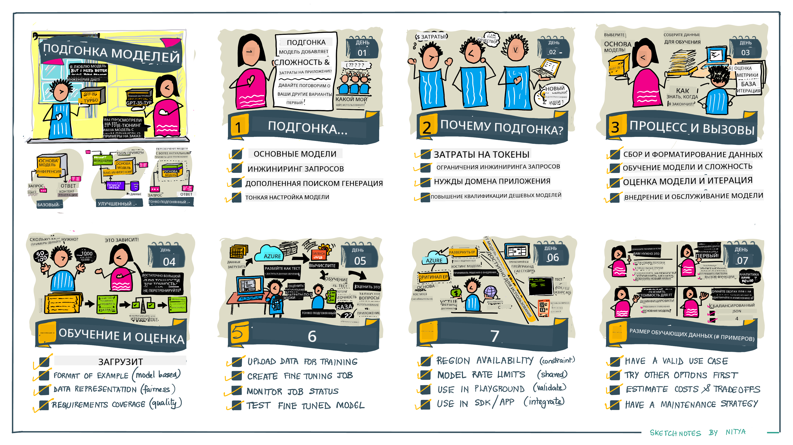

<!--
CO_OP_TRANSLATOR_METADATA:
{
  "original_hash": "68664f7e754a892ae1d8d5e2b7bd2081",
  "translation_date": "2025-05-20T07:35:54+00:00",
  "source_file": "18-fine-tuning/README.md",
  "language_code": "ru"
}
-->

# Тонкая настройка вашего LLM

Использование больших языковых моделей для создания генеративных AI-приложений сопряжено с новыми вызовами. Основная проблема заключается в обеспечении качества ответов (точности и релевантности) в контенте, генерируемом моделью по запросу пользователя. В предыдущих уроках мы обсуждали такие техники, как проектирование подсказок и генерация с дополнением извлечения, которые пытаются решить проблему, _изменяя входную подсказку_ для существующей модели.

Сегодня на уроке мы обсудим третью технику — **тонкую настройку**, которая пытается решить проблему путем _переподготовки самой модели_ с использованием дополнительных данных. Давайте погрузимся в детали.

## Цели обучения

Этот урок вводит концепцию тонкой настройки для предварительно обученных языковых моделей, исследует преимущества и трудности этого подхода и дает рекомендации о том, когда и как использовать тонкую настройку для улучшения производительности ваших генеративных AI-моделей.

К концу этого урока вы должны быть в состоянии ответить на следующие вопросы:

- Что такое тонкая настройка для языковых моделей?
- Когда и почему тонкая настройка полезна?
- Как можно тонко настроить предварительно обученную модель?
- Каковы ограничения тонкой настройки?

Готовы? Начнем.

## Иллюстрированное руководство

Хотите получить общее представление о том, что мы рассмотрим, прежде чем погрузиться в детали? Ознакомьтесь с этим иллюстрированным руководством, которое описывает процесс обучения на этом уроке — от изучения основных концепций и мотивации для тонкой настройки до понимания процесса и лучших практик выполнения задачи тонкой настройки. Это увлекательная тема для изучения, так что не забудьте заглянуть на страницу [Ресурсы](./RESOURCES.md?WT.mc_id=academic-105485-koreyst) для получения дополнительных ссылок, которые поддержат ваше самостоятельное обучение!

## Что такое тонкая настройка для языковых моделей?

По определению, большие языковые модели _предварительно обучены_ на больших объемах текста, полученного из разнообразных источников, включая интернет. Как мы узнали из предыдущих уроков, нам нужны такие техники, как _проектирование подсказок_ и _генерация с дополнением извлечения_, чтобы улучшить качество ответов модели на вопросы пользователя ("подсказки").

Популярная техника проектирования подсказок включает в себя предоставление модели большего количества указаний о том, что ожидается в ответе, либо путем предоставления _инструкций_ (явное руководство), либо _предоставлением нескольких примеров_ (неявное руководство). Это называется _обучение с небольшим количеством примеров_, но у него есть два ограничения:

- Ограничения на количество токенов в модели могут ограничивать количество примеров, которые вы можете предоставить, и снижать эффективность.
- Стоимость токенов модели может сделать добавление примеров к каждой подсказке дорогим, ограничивая гибкость.

Тонкая настройка — это обычная практика в системах машинного обучения, когда мы берем предварительно обученную модель и переобучаем ее с использованием новых данных, чтобы улучшить ее производительность в конкретной задаче. В контексте языковых моделей мы можем тонко настроить предварительно обученную модель _с помощью специально подобранного набора примеров для данной задачи или области применения_, чтобы создать **пользовательскую модель**, которая может быть более точной и релевантной для этой конкретной задачи или области. Дополнительным преимуществом тонкой настройки является то, что она может также уменьшить количество примеров, необходимых для обучения с небольшим количеством примеров, снижая использование токенов и связанные с этим затраты.

## Когда и почему следует тонко настраивать модели?

В _этом_ контексте, когда мы говорим о тонкой настройке, мы имеем в виду **контролируемую** тонкую настройку, когда переобучение выполняется путем **добавления новых данных**, которые не были частью исходного набора данных для обучения. Это отличается от неконтролируемого подхода к тонкой настройке, когда модель переобучается на исходных данных, но с другими гиперпараметрами.

Главное, что нужно помнить, это то, что тонкая настройка — это продвинутая техника, требующая определенного уровня экспертизы для достижения желаемых результатов. Если она выполнена неправильно, она может не дать ожидаемых улучшений и даже ухудшить производительность модели для вашей целевой области.

Поэтому, прежде чем вы узнаете "как" тонко настраивать языковые модели, вам нужно знать "почему" вы должны выбрать этот путь и "когда" начинать процесс тонкой настройки. Начните с того, чтобы задать себе следующие вопросы:

- **Случай использования**: Каков ваш _случай использования_ для тонкой настройки? Какой аспект текущей предварительно обученной модели вы хотите улучшить?
- **Альтернативы**: Пробовали ли вы _другие техники_, чтобы достичь желаемых результатов? Используйте их, чтобы создать базу для сравнения.
  - Проектирование подсказок: Попробуйте такие техники, как подача нескольких примеров с примерами релевантных ответов на подсказки. Оцените качество ответов.
  - Генерация с дополнением извлечения: Попробуйте дополнить подсказки результатами запросов, извлеченными из вашего поиска данных. Оцените качество ответов.
- **Затраты**: Определили ли вы затраты на тонкую настройку?
  - Настраиваемость — доступна ли предварительно обученная модель для тонкой настройки?
  - Усилия — для подготовки данных для обучения, оценки и уточнения модели.
  - Вычисления — для запуска задач тонкой настройки и развертывания тонко настроенной модели.
  - Данные — доступ к достаточному количеству качественных примеров для воздействия тонкой настройки.
- **Преимущества**: Подтвердили ли вы преимущества тонкой настройки?
  - Качество — превзошла ли тонко настроенная модель базовую модель?
  - Стоимость — снижает ли она использование токенов, упрощая подсказки?
  - Расширяемость — можете ли вы адаптировать базовую модель для новых областей?

Отвечая на эти вопросы, вы сможете решить, является ли тонкая настройка правильным подходом для вашего случая использования. В идеале, подход будет обоснован только в том случае, если преимущества перевешивают затраты. После того как вы решите продолжить, пора подумать о том, _как_ вы можете тонко настроить предварительно обученную модель.

Хотите получить больше информации о процессе принятия решений? Посмотрите [Тонкая настройка или нет](https://www.youtube.com/watch?v=0Jo-z-MFxJs).

## Как мы можем тонко настроить предварительно обученную модель?

Чтобы тонко настроить предварительно обученную модель, вам нужно иметь:

- предварительно обученную модель для тонкой настройки
- набор данных для использования в тонкой настройке
- среду обучения для запуска задачи тонкой настройки
- среду размещения для развертывания тонко настроенной модели

## Тонкая настройка в действии

Следующие ресурсы предоставляют пошаговые руководства, которые проведут вас через реальный пример использования выбранной модели с специально подобранным набором данных. Чтобы пройти эти руководства, вам понадобится учетная запись у конкретного поставщика, а также доступ к соответствующей модели и наборам данных.

| Поставщик    | Руководство                                                                                                                                                                       | Описание                                                                                                                                                                                                                                                                                                                                                                                                                        |
| ------------ | -------------------------------------------------------------------------------------------------------------------------------------------------------------------------------- | ---------------------------------------------------------------------------------------------------------------------------------------------------------------------------------------------------------------------------------------------------------------------------------------------------------------------------------------------------------------------------------------------------------------------------------- |
| OpenAI       | [Как настроить модели чата](https://github.com/openai/openai-cookbook/blob/main/examples/How_to_finetune_chat_models.ipynb?WT.mc_id=academic-105485-koreyst)                      | Узнайте, как настроить `gpt-35-turbo` для конкретной области ("помощник по рецептам"), подготовив данные для обучения, запустив задачу тонкой настройки и используя тонко настроенную модель для вывода.                                                                                                                                                                                                                       |
| Azure OpenAI | [Учебное пособие по тонкой настройке GPT 3.5 Turbo](https://learn.microsoft.com/azure/ai-services/openai/tutorials/fine-tune?tabs=python-new%2Ccommand-line?WT.mc_id=academic-105485-koreyst) | Узнайте, как настроить модель `gpt-35-turbo-0613` **на Azure**, предприняв шаги для создания и загрузки данных для обучения, запуска задачи тонкой настройки. Разверните и используйте новую модель.                                                                                                                                                                                                                                 |
| Hugging Face | [Тонкая настройка LLM с Hugging Face](https://www.philschmid.de/fine-tune-llms-in-2024-with-trl?WT.mc_id=academic-105485-koreyst)                                                 | Этот блог-пост проведет вас через процесс тонкой настройки _открытой LLM_ (например, `CodeLlama 7B`) с использованием библиотеки [transformers](https://huggingface.co/docs/transformers/index?WT.mc_id=academic-105485-koreyst) и [Transformer Reinforcement Learning (TRL)](https://huggingface.co/docs/trl/index?WT.mc_id=academic-105485-koreyst]) с открытыми [наборами данных](https://huggingface.co/docs/datasets/index?WT.mc_id=academic-105485-koreyst) на Hugging Face. |
|              |                                                                                                                                                                                    |                                                                                                                                                                                                                                                                                                                                                                                                                                    |
| 🤗 AutoTrain | [Тонкая настройка LLM с AutoTrain](https://github.com/huggingface/autotrain-advanced/?WT.mc_id=academic-105485-koreyst)                                                           | AutoTrain (или AutoTrain Advanced) — это библиотека на языке Python, разработанная Hugging Face, которая позволяет выполнять тонкую настройку для множества различных задач, включая тонкую настройку LLM. AutoTrain — это решение без кода, и тонкую настройку можно выполнить в вашем собственном облаке, на Hugging Face Spaces или локально. Оно поддерживает как веб-интерфейс, так и CLI и обучение через файлы конфигурации yaml.                                     |
|              |                                                                                                                                                                                    |                                                                                                                                                                                                                                                                                                                                                                                                                                    |

## Задание

Выберите одно из вышеперечисленных руководств и пройдите его. _Мы можем воспроизвести версию этих руководств в Jupyter Notebooks в этом репозитории только для справки. Пожалуйста, используйте оригинальные источники напрямую, чтобы получить последние версии_.

## Отличная работа! Продолжайте учиться.

После завершения этого урока ознакомьтесь с нашей [коллекцией обучения генеративному AI](https://aka.ms/genai-collection?WT.mc_id=academic-105485-koreyst), чтобы продолжить повышать свои знания в области генеративного AI!

Поздравляем!! Вы завершили финальный урок из серии v2 этого курса! Не останавливайтесь на достигнутом и продолжайте учиться и строить. \*\*Посмотрите страницу [РЕСУРСЫ](RESOURCES.md?WT.mc_id=academic-105485-koreyst) для списка дополнительных предложений именно по этой теме.

Наша серия уроков v1 также была обновлена с добавлением большего количества заданий и концепций. Поэтому потратьте минуту, чтобы освежить свои знания — и, пожалуйста, [поделитесь своими вопросами и отзывами](https://github.com/microsoft/generative-ai-for-beginners/issues?WT.mc_id=academic-105485-koreyst), чтобы помочь нам улучшить эти уроки для сообщества.

**Отказ от ответственности**:  
Этот документ был переведен с помощью сервиса автоматического перевода [Co-op Translator](https://github.com/Azure/co-op-translator). Хотя мы стремимся к точности, имейте в виду, что автоматические переводы могут содержать ошибки или неточности. Оригинальный документ на его родном языке следует считать авторитетным источником. Для критически важной информации рекомендуется профессиональный перевод человеком. Мы не несем ответственности за любые недоразумения или неправильные толкования, возникшие в результате использования этого перевода.