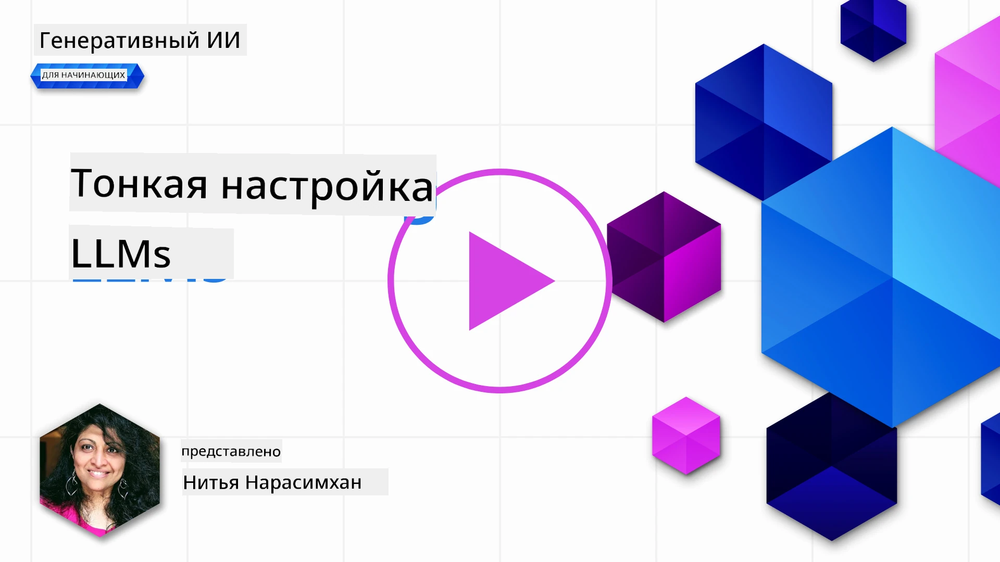
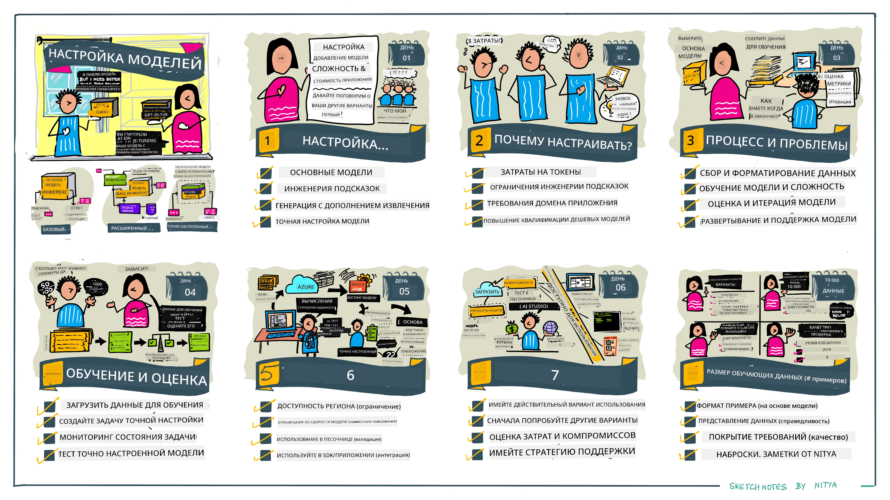

# Тонкая настройка вашего LLM

Использование больших языковых моделей для создания приложений генеративного ИИ сопряжено с новыми вызовами. Ключевая проблема — обеспечение качества ответов (точности и релевантности) в сгенерированном моделью контенте для данного запроса пользователя. В предыдущих уроках мы обсуждали такие техники, как инженерия подсказок и генерация с дополнением из поиска, которые пытаются решить проблему путём _изменения входа-подсказки_ для существующей модели.

В сегодняшнем уроке мы рассмотрим третий подход — **тонкую настройку**, которая пытается решить задачу путём _переподготовки самой модели_ с использованием дополнительных данных. Давайте углубимся в детали.

## Учебные цели

Этот урок вводит понятие тонкой настройки для предварительно обученных языковых моделей, исследует преимущества и сложности этого подхода, а также предоставляет рекомендации, когда и как использовать тонкую настройку для улучшения производительности ваших генеративных моделей ИИ.

К концу урока вы должны уметь отвечать на следующие вопросы:

- Что такое тонкая настройка языковых моделей?
- Когда и почему тонкая настройка полезна?
- Как можно дообучить предварительно обученную модель?
- Каковы ограничения тонкой настройки?

Готовы? Начнём.

## Иллюстрированное руководство

Хотите получить общее представление о том, что мы будем рассматривать, прежде чем углубиться? Ознакомьтесь с этим иллюстрированным руководством, которое описывает учебный путь для этого урока — от изучения основных концепций и мотивации тонкой настройки до понимания процесса и лучших практик выполнения задачи тонкой настройки. Это увлекательная тема для изучения, не забудьте также заглянуть на страницу [Ресурсы](./RESOURCES.md?WT.mc_id=academic-105485-koreyst) для дополнительных ссылок, которые поддержат ваше самостоятельное обучение!

## Что такое тонкая настройка языковых моделей?

По определению, большие языковые модели _предварительно обучены_ на огромных объёмах текстов, взятых из различных источников, включая интернет. Как мы узнали в предыдущих уроках, нам нужны техники типа _инженерии подсказок_ и _генерации с дополнением из поиска_, чтобы улучшить качество ответов модели на вопросы пользователя ("подсказки").

Популярная техника инженерии подсказок включает в себя предоставление модели более подробных указаний о том, что ожидается в ответе, либо через _инструкции_ (явное руководство), либо через _несколько примеров_ (неявное руководство). Это называется _обучением с малым количеством примеров_ (few-shot learning), но у неё есть два ограничения:

- Лимиты по токенам модели ограничивают количество примеров, которые вы можете дать, и снижают эффективность.
- Стоимость токенов может сделать дорогим добавление примеров к каждой подсказке, ограничивая гибкость.

Тонкая настройка — это распространённая практика в системах машинного обучения, когда мы берём предварительно обученную модель и дообучаем её на новых данных для повышения производительности на конкретной задаче. В контексте языковых моделей мы можем дообучить предварительно обученную модель _на тщательно подобранном наборе примеров для конкретной задачи или предметной области_, чтобы создать **кастомизированную модель**, которая будет более точной и релевантной именно для этой задачи или области. Побочным эффектом тонкой настройки является снижение количества примеров, необходимых для обучения с малым количеством примеров, что уменьшает использование токенов и связанные с этим затраты.

## Когда и зачем стоит дообучивать модели?

В _этом_ контексте под тонкой настройкой подразумевается **контролируемая** тонкая настройка, когда переподготовка происходит за счёт **добавления новых данных**, которые не входили в исходный тренировочный набор. Это отличается от неконтролируемой тонкой настройки, когда модель дообучают на исходных данных с другими гиперпараметрами.

Главное, что нужно помнить — тонкая настройка это продвинутый метод, требующий определённого уровня экспертизы для достижения желаемых результатов. Если сделать это неправильно, она может не дать ожидаемых улучшений и даже ухудшить производительность модели в вашей целевой области.

Поэтому прежде чем изучать, "как" дообучать языковые модели, нужно понять "почему" стоит пойти этим путём и "когда" начинать процесс тонкой настройки. Начните с ответов на следующие вопросы:

- **Сценарий использования**: Каков ваш _случай использования_ для тонкой настройки? Что именно вы хотите улучшить в текущей предварительно обученной модели?
- **Альтернативы**: Пробовали ли вы _другие методы_ для достижения нужного результата? Используйте их как базовый уровень для сравнения.
  - Инженерия подсказок: Попробуйте техники вроде few-shot с примерами релевантных ответов на подсказки. Оцените качество ответов.
  - Генерация с дополнением из поиска: Попробуйте дополнить подсказки результатами поиска по вашим данным. Оцените качество ответов.
- **Затраты**: Определили ли вы затраты для тонкой настройки?
  - Возможность настройки — доступна ли выбранная модель для дообучения?
  - Усилия — подготовка тренировочных данных, оценка и доработка модели.
  - Вычислительные ресурсы — для выполнения задач тонкой настройки и деплой модели.
  - Данные — наличие достаточно качественных примеров для эффекта тонкой настройки.
- **Преимущества**: Подтвердили ли вы преимущества тонкой настройки?
  - Качество — превзошла ли тонко настроенная модель исходную?
  - Затраты — помогает ли она снизить использование токенов за счёт упрощения подсказок?
  - Расширяемость — можно ли использовать базовую модель для новых областей?

Отвечая на эти вопросы, вы сможете решить, подходит ли тонкая настройка для вашего кейса. В идеале этот подход оправдан, если выгоды превышают затраты. Приняв решение, можно переходить к размышлениям о том, _как_ можно дообучать предварительно обученную модель.

Хотите узнать больше о принятии решения? Посмотрите видео [To fine-tune or not to fine-tune](https://www.youtube.com/watch?v=0Jo-z-MFxJs)

## Как можно дообучить предварительно обученную модель?

Для тонкой настройки заранее обученной модели вам понадобятся:

- предварительно обученная модель для дообучения
- набор данных для тонкой настройки
- среда обучения для запуска задачи тонкой настройки
- среда размещения для развертывания дообученной модели

## Тонкая настройка на практике

Ниже приведены ресурсы с пошаговыми уроками, которые проведут вас через реальный пример с выбранной моделью и подобранным набором данных. Чтобы пройти эти уроки, вам потребуется аккаунт у соответствующего провайдера, а также доступ к нужным моделям и данным.

| Провайдер    | Учебник                                                                                                                                                                     | Описание                                                                                                                                                                                                                                                                                                                                                                                                                         |
| ------------ | --------------------------------------------------------------------------------------------------------------------------------------------------------------------------- | -------------------------------------------------------------------------------------------------------------------------------------------------------------------------------------------------------------------------------------------------------------------------------------------------------------------------------------------------------------------------------------------------------------------------------- |
| OpenAI       | [Как дообучить чат-модели](https://github.com/openai/openai-cookbook/blob/main/examples/How_to_finetune_chat_models.ipynb?WT.mc_id=academic-105485-koreyst)                  | Научитесь дообучать `gpt-35-turbo` для конкретной области ("ассистент по рецептам") с подготовкой тренировочных данных, запуском задачи тонкой настройки и использованием дообученной модели для вывода.                                                                                                                                                                                                                     |
| Azure OpenAI | [Учебник по тонкой настройке GPT 3.5 Turbo](https://learn.microsoft.com/azure/ai-services/openai/tutorials/fine-tune?tabs=python-new%2Ccommand-line&WT.mc_id=academic-105485-koreyst) | Научитесь дообучать модель `gpt-35-turbo-0613` **на Azure**, создав и загрузив тренировочные данные, запустив задачу тонкой настройки, развернув и используя новую модель.                                                                                                                                                                                                                                               |
| Hugging Face | [Тонкая настройка LLM с Hugging Face](https://www.philschmid.de/fine-tune-llms-in-2024-with-trl?WT.mc_id=academic-105485-koreyst)                                          | В этом посте рассказывается о тонкой настройке _открытой LLM_ (например, `CodeLlama 7B`) с использованием библиотеки [transformers](https://huggingface.co/docs/transformers/index?WT.mc_id=academic-105485-koreyst) и [Transformer Reinforcement Learning (TRL)](https://huggingface.co/docs/trl/index?WT.mc_id=academic-105485-koreyst), а также открытых [наборов данных](https://huggingface.co/docs/datasets/index?WT.mc_id=academic-105485-koreyst) Hugging Face. |
|              |                                                                                                                                                                             |                                                                                                                                                                                                                                                                                                                                                                                                                                 |
| 🤗 AutoTrain | [Тонкая настройка LLM с AutoTrain](https://github.com/huggingface/autotrain-advanced/?WT.mc_id=academic-105485-koreyst)                                                    | AutoTrain (или AutoTrain Advanced) — это python-библиотека от Hugging Face, которая позволяет выполнять тонкую настройку для множества задач, включая тонкую настройку LLM. AutoTrain — это решение без кода, и дообучать можно как в собственном облаке, так и на Hugging Face Spaces или локально. Поддерживает как веб-интерфейс, так и CLI, а также обучение через yaml-конфигурационные файлы.                                                                            |
|              |                                                                                                                                                                             |                                                                                                                                                                                                                                                                                                                                                                                                                                 |
| 🦥 Unsloth    | [Тонкая настройка LLM с Unsloth](https://github.com/unslothai/unsloth)                                                                                                    | Unsloth — это open-source фреймворк, поддерживающий тонкую настройку LLM и обучение с подкреплением (RL). Unsloth упрощает локальное обучение, оценку и развертывание с помощью готовых к использованию [ноутбуков](https://github.com/unslothai/notebooks). Также поддерживает text-to-speech (TTS), BERT и мультимодальные модели. Чтобы начать, ознакомьтесь с их пошаговым [Руководством по тонкой настройке LLM](https://docs.unsloth.ai/get-started/fine-tuning-llms-guide).                           |
|              |                                                                                                                                                                             |                                                                                                                                                                                                                                                                                                                                                                                                                                 |
## Задание

Выберите один из приведённых учебников и пройдите его. _Возможно, мы воспроизведем версию этих уроков в Jupyter Notebooks в этом репозитории только для справки. Пожалуйста, используйте оригинальные источники напрямую, чтобы получить последние версии_.

## Отличная работа! Продолжайте обучение.

После завершения этого урока посетите нашу коллекцию [Обучение генеративному ИИ](https://aka.ms/genai-collection?WT.mc_id=academic-105485-koreyst), чтобы продолжать повышать свои знания в области генеративного ИИ!

Поздравляем!! Вы завершили последний урок серии v2 данного курса! Не останавливайтесь на достигнутом и продолжайте изучать и создавать. \*\*Загляните на страницу [РЕСУРСЫ](RESOURCES.md?WT.mc_id=academic-105485-koreyst) для списка дополнительных рекомендаций именно по этой теме.

Наша серия уроков v1 также была обновлена с новыми заданиями и концепциями. Так что посвятите минутку обновлению своих знаний — и, пожалуйста, [делитесь своими вопросами и отзывами](https://github.com/microsoft/generative-ai-for-beginners/issues?WT.mc_id=academic-105485-koreyst), чтобы помочь нам улучшить эти уроки для сообщества.

---

<!-- CO-OP TRANSLATOR DISCLAIMER START -->
**Отказ от ответственности**:  
Этот документ был переведен с помощью сервиса автоматического перевода [Co-op Translator](https://github.com/Azure/co-op-translator). Несмотря на наши усилия по обеспечению точности, пожалуйста, имейте в виду, что автоматические переводы могут содержать ошибки или неточности. Оригинальный документ на его исходном языке должен считаться авторитетным источником. Для критически важной информации рекомендуется обращаться к профессиональному переводу, выполненному человеком. Мы не несем ответственности за любые недоразумения или неправильные толкования, возникшие в результате использования данного перевода.
<!-- CO-OP TRANSLATOR DISCLAIMER END -->