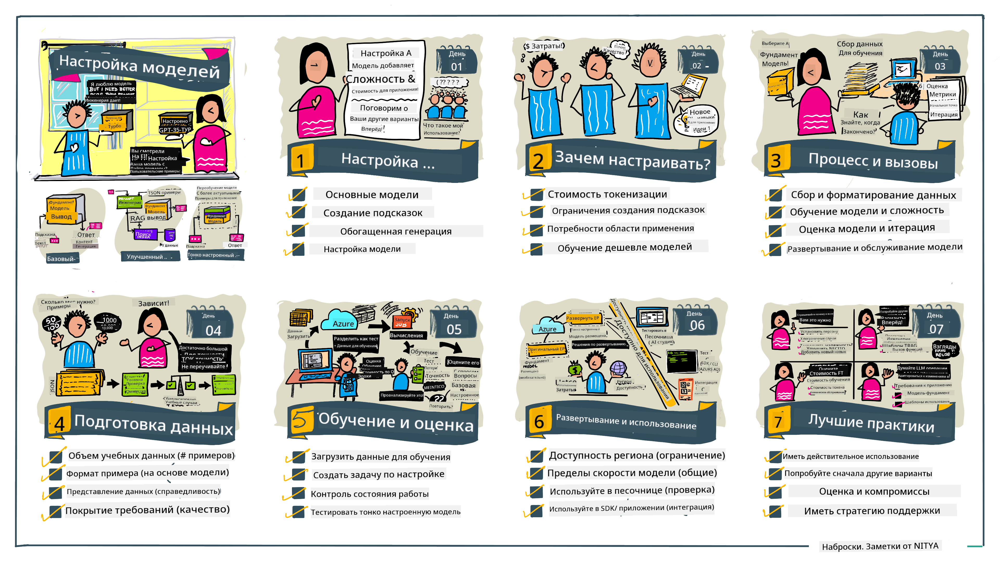

<!--
CO_OP_TRANSLATOR_METADATA:
{
  "original_hash": "68664f7e754a892ae1d8d5e2b7bd2081",
  "translation_date": "2025-06-26T00:30:44+00:00",
  "source_file": "18-fine-tuning/README.md",
  "language_code": "ru"
}
-->

# Тонкая настройка вашего LLM

Использование больших языковых моделей для создания приложений с генеративным ИИ связано с новыми вызовами. Ключевая проблема — обеспечение качества ответов (точности и релевантности) в контенте, генерируемом моделью по запросу пользователя. В предыдущих уроках мы обсуждали такие техники, как проектирование запросов и генерация с дополнением извлечения, которые пытаются решить проблему путем _модификации входного запроса_ к существующей модели.

В сегодняшнем уроке мы обсудим третью технику — **тонкую настройку**, которая пытается решить задачу путем _переподготовки самой модели_ с дополнительными данными. Давайте углубимся в детали.

## Цели обучения

Этот урок вводит понятие тонкой настройки для предварительно обученных языковых моделей, исследует преимущества и вызовы этого подхода и предоставляет рекомендации о том, когда и как использовать тонкую настройку для улучшения производительности ваших генеративных ИИ моделей.

К концу этого урока вы должны быть в состоянии ответить на следующие вопросы:

- Что такое тонкая настройка для языковых моделей?
- Когда и почему полезна тонкая настройка?
- Как я могу провести тонкую настройку предварительно обученной модели?
- Каковы ограничения тонкой настройки?

Готовы? Давайте начнем.

## Иллюстрированное руководство

Хотите получить общее представление о том, что мы будем обсуждать, прежде чем углубляться? Ознакомьтесь с этим иллюстрированным руководством, которое описывает процесс обучения для этого урока — от изучения основных концепций и мотивации для тонкой настройки до понимания процесса и лучших практик выполнения задачи тонкой настройки. Это захватывающая тема для исследования, поэтому не забудьте заглянуть на страницу [Ресурсы](./RESOURCES.md?WT.mc_id=academic-105485-koreyst) для дополнительных ссылок, поддерживающих ваше самостоятельное обучение!

## Что такое тонкая настройка для языковых моделей?

По определению, большие языковые модели _предварительно обучены_ на больших объемах текста, взятых из разнообразных источников, включая интернет. Как мы узнали в предыдущих уроках, нам нужны такие техники, как _проектирование запросов_ и _генерация с дополнением извлечения_, чтобы улучшить качество ответов модели на вопросы пользователя ("запросы").

Популярная техника проектирования запросов включает в себя предоставление модели более четкого руководства о том, что ожидается в ответе, либо путем предоставления _инструкций_ (явное руководство), либо _предоставлением нескольких примеров_ (неявное руководство). Это называется _обучением с несколькими примерами_, но у него есть два ограничения:

- Ограничения на количество токенов модели могут ограничивать количество примеров, которые вы можете предоставить, и снижать эффективность.
- Стоимость токенов модели может сделать добавление примеров к каждому запросу дорогим и ограничивать гибкость.

Тонкая настройка — это распространенная практика в системах машинного обучения, когда мы берем предварительно обученную модель и переподготавливаем ее с новыми данными, чтобы улучшить ее производительность для конкретной задачи. В контексте языковых моделей мы можем провести тонкую настройку предварительно обученной модели _с набором примеров для конкретной задачи или области применения_, чтобы создать **пользовательскую модель**, которая может быть более точной и релевантной для этой конкретной задачи или области. Побочным преимуществом тонкой настройки является то, что она может также уменьшить количество примеров, необходимых для обучения с несколькими примерами — сокращая использование токенов и связанные с этим расходы.

## Когда и почему мы должны проводить тонкую настройку моделей?

В _этом_ контексте, когда мы говорим о тонкой настройке, мы имеем в виду **управляемую** тонкую настройку, где переподготовка осуществляется путем **добавления новых данных**, которые не были частью исходного набора данных для обучения. Это отличается от подхода неуправляемой тонкой настройки, где модель переподготавливается на исходных данных, но с различными гиперпараметрами.

Ключевое, что нужно помнить, — это то, что тонкая настройка является сложной техникой, требующей определенного уровня экспертизы для достижения желаемых результатов. Если она выполнена неправильно, она может не обеспечить ожидаемых улучшений и даже ухудшить производительность модели для вашей целевой области.

Итак, прежде чем изучать "как" проводить тонкую настройку языковых моделей, вы должны знать "почему" вы должны выбрать этот путь и "когда" начать процесс тонкой настройки. Начните с ответа на эти вопросы:

- **Сценарий использования**: Каков ваш _сценарий использования_ для тонкой настройки? Какой аспект текущей предварительно обученной модели вы хотите улучшить?
- **Альтернативы**: Пробовали ли вы _другие техники_ для достижения желаемых результатов? Используйте их для создания базового уровня для сравнения.
  - Проектирование запросов: Попробуйте техники, такие как запросы с несколькими примерами с примерами релевантных ответов на запросы. Оцените качество ответов.
  - Генерация с дополнением извлечения: Попробуйте дополнить запросы результатами поиска в ваших данных. Оцените качество ответов.
- **Расходы**: Определили ли вы расходы на тонкую настройку?
  - Настраиваемость — доступна ли предварительно обученная модель для тонкой настройки?
  - Усилия — для подготовки данных для обучения, оценки и уточнения модели.
  - Вычислительные ресурсы — для выполнения задач тонкой настройки и развертывания модели с тонкой настройкой.
  - Данные — доступ к достаточному количеству качественных примеров для влияния тонкой настройки.
- **Преимущества**: Подтвердили ли вы преимущества тонкой настройки?
  - Качество — превзошла ли модель с тонкой настройкой базовый уровень?
  - Расходы — сокращает ли она использование токенов, упрощая запросы?
  - Расширяемость — можете ли вы перепрофилировать базовую модель для новых областей?

Ответив на эти вопросы, вы должны быть в состоянии решить, является ли тонкая настройка правильным подходом для вашего сценария использования. Идеально, если подход оправдан только в том случае, если преимущества перевешивают расходы. Как только вы решите продолжить, пора подумать о _том, как_ вы можете провести тонкую настройку предварительно обученной модели.

Хотите получить больше информации о процессе принятия решений? Посмотрите [Тонкая настройка или нетонкая настройка](https://www.youtube.com/watch?v=0Jo-z-MFxJs)

## Как мы можем провести тонкую настройку предварительно обученной модели?

Чтобы провести тонкую настройку предварительно обученной модели, вам нужно иметь:

- предварительно обученную модель для тонкой настройки
- набор данных для использования при тонкой настройке
- среду обучения для выполнения задачи тонкой настройки
- среду хостинга для развертывания модели с тонкой настройкой

## Тонкая настройка в действии

Следующие ресурсы предоставляют пошаговые руководства, чтобы провести вас через реальный пример, используя выбранную модель с курированным набором данных. Чтобы пройти эти руководства, вам нужен аккаунт у конкретного провайдера, а также доступ к соответствующим моделям и наборам данных.

| Провайдер    | Руководство                                                                                                                                                                        | Описание                                                                                                                                                                                                                                                                                                                                                                                                                        |
| ------------ | --------------------------------------------------------------------------------------------------------------------------------------------------------------------------------- | -------------------------------------------------------------------------------------------------------------------------------------------------------------------------------------------------------------------------------------------------------------------------------------------------------------------------------------------------------------------------------------------------------------------------------- |
| OpenAI       | [Как провести тонкую настройку моделей чата](https://github.com/openai/openai-cookbook/blob/main/examples/How_to_finetune_chat_models.ipynb?WT.mc_id=academic-105485-koreyst)     | Узнайте, как провести тонкую настройку `gpt-35-turbo` для конкретной области ("помощник по рецептам"), подготовив данные для обучения, запустив задачу тонкой настройки и используя модель с тонкой настройкой для вывода.                                                                                                                                                                                                                                              |
| Azure OpenAI | [Руководство по тонкой настройке GPT 3.5 Turbo](https://learn.microsoft.com/azure/ai-services/openai/tutorials/fine-tune?tabs=python-new%2Ccommand-line?WT.mc_id=academic-105485-koreyst) | Узнайте, как провести тонкую настройку модели `gpt-35-turbo-0613` **на Azure**, выполнив шаги по созданию и загрузке данных для обучения, запуску задачи тонкой настройки. Разверните и используйте новую модель.                                                                                                                                                                                                                                                                 |
| Hugging Face | [Тонкая настройка LLMs с Hugging Face](https://www.philschmid.de/fine-tune-llms-in-2024-with-trl?WT.mc_id=academic-105485-koreyst)                                                | Этот блог пост проведет вас через тонкую настройку _открытого LLM_ (например, `CodeLlama 7B`) с использованием библиотеки [transformers](https://huggingface.co/docs/transformers/index?WT.mc_id=academic-105485-koreyst) и [Transformer Reinforcement Learning (TRL)](https://huggingface.co/docs/trl/index?WT.mc_id=academic-105485-koreyst]) с открытыми [наборами данных](https://huggingface.co/docs/datasets/index?WT.mc_id=academic-105485-koreyst) на Hugging Face. |
|              |                                                                                                                                                                                   |                                                                                                                                                                                                                                                                                                                                                                                                                                |
| 🤗 AutoTrain | [Тонкая настройка LLMs с AutoTrain](https://github.com/huggingface/autotrain-advanced/?WT.mc_id=academic-105485-koreyst)                                                          | AutoTrain (или AutoTrain Advanced) — это библиотека на Python, разработанная Hugging Face, которая позволяет проводить тонкую настройку для множества различных задач, включая тонкую настройку LLM. AutoTrain — это решение без кода, и тонкую настройку можно провести в вашем облаке, на Hugging Face Spaces или локально. Он поддерживает как веб-ориентированный интерфейс, CLI, так и обучение с помощью yaml конфигурационных файлов.                                                                                 |
|              |                                                                                                                                                                                   |                                                                                                                                                                                                                                                                                                                                                                                                                                |

## Задание

Выберите одно из руководств выше и пройдите его. _Мы можем воспроизвести версию этих руководств в Jupyter Notebooks в этом репозитории только для справки. Пожалуйста, используйте оригинальные источники напрямую, чтобы получить последние версии_.

## Отличная работа! Продолжайте обучение.

После завершения этого урока ознакомьтесь с нашей [Коллекцией обучения Generative AI](https://aka.ms/genai-collection?WT.mc_id=academic-105485-koreyst), чтобы продолжить повышение уровня ваших знаний о Generative AI!

Поздравляем!! Вы завершили последний урок из серии v2 для этого курса! Не прекращайте обучение и создание. \*\*Посмотрите [РЕСУРСЫ](RESOURCES.md?WT.mc_id=academic-105485-koreyst) страницу для списка дополнительных предложений по этой теме.

Наша серия уроков v1 также была обновлена с большим количеством заданий и концепций. Поэтому уделите минуту, чтобы освежить свои знания — и пожалуйста, [поделитесь своими вопросами и отзывами](https://github.com/microsoft/generative-ai-for-beginners/issues?WT.mc_id=academic-105485-koreyst), чтобы помочь нам улучшить эти уроки для сообщества.

**Отказ от ответственности**:  
Этот документ был переведен с помощью сервиса автоматического перевода [Co-op Translator](https://github.com/Azure/co-op-translator). Хотя мы стремимся к точности, пожалуйста, имейте в виду, что автоматические переводы могут содержать ошибки или неточности. Оригинальный документ на его родном языке должен считаться авторитетным источником. Для получения критически важной информации рекомендуется профессиональный перевод человеком. Мы не несем ответственности за любые недоразумения или неправильные толкования, возникающие в результате использования этого перевода.