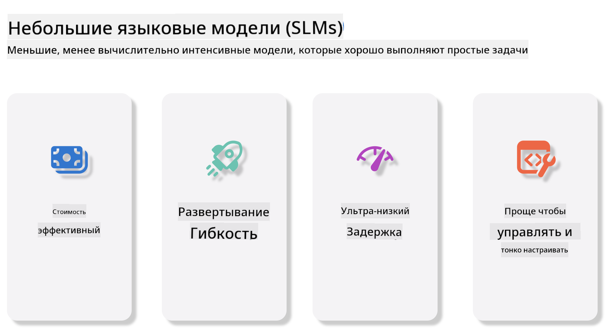
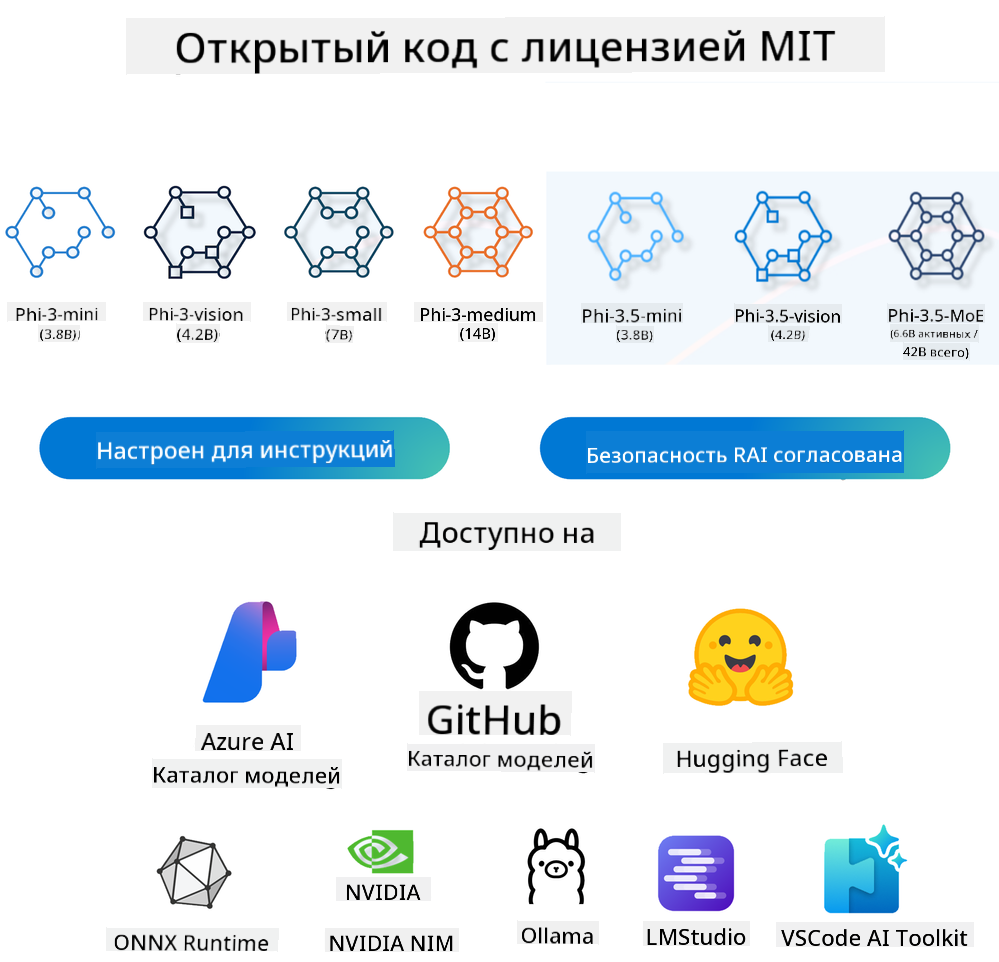
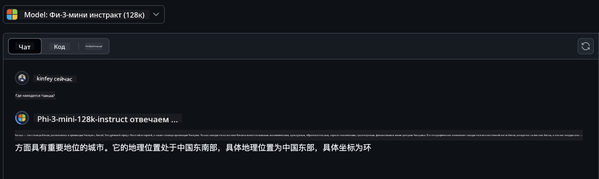
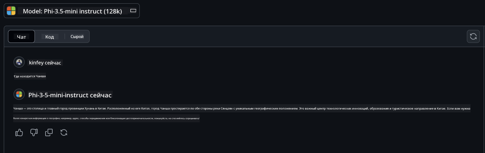

<!--
CO_OP_TRANSLATOR_METADATA:
{
  "original_hash": "124ad36cfe96f74038811b6e2bb93e9d",
  "translation_date": "2025-05-20T09:02:31+00:00",
  "source_file": "19-slm/README.md",
  "language_code": "ru"
}
-->
# Введение в малые языковые модели для генеративного ИИ для начинающих

Генеративный ИИ — это захватывающая область искусственного интеллекта, которая сосредоточена на создании систем, способных генерировать новый контент. Этот контент может варьироваться от текста и изображений до музыки и даже целых виртуальных сред. Одним из самых интересных приложений генеративного ИИ является область языковых моделей.

## Что такое малые языковые модели?

Малая языковая модель (SLM) представляет собой уменьшенный вариант большой языковой модели (LLM), использующий многие архитектурные принципы и техники LLM, но с значительно уменьшенной вычислительной нагрузкой. SLM — это подмножество языковых моделей, предназначенных для генерации текста, похожего на человеческий. В отличие от своих более крупных аналогов, таких как GPT-4, SLM более компактны и эффективны, что делает их идеальными для приложений, где вычислительные ресурсы ограничены. Несмотря на меньший размер, они могут выполнять множество задач. Обычно SLM создаются путем сжатия или дистилляции LLM, стремясь сохранить значительную часть функциональности и языковых возможностей оригинальной модели. Это уменьшение размера модели снижает общую сложность, делая SLM более эффективными с точки зрения использования памяти и вычислительных требований. Несмотря на эти оптимизации, SLM могут выполнять широкий спектр задач обработки естественного языка (NLP):

- Генерация текста: создание связных и контекстуально релевантных предложений или абзацев.
- Завершение текста: предсказание и завершение предложений на основе данного запроса.
- Перевод: преобразование текста с одного языка на другой.
- Суммаризация: сокращение длинных текстов до более кратких и понятных резюме.

Хотя с некоторыми компромиссами в производительности или глубине понимания по сравнению с их более крупными аналогами.

## Как работают малые языковые модели?

SLM обучаются на огромных объемах текстовых данных. В процессе обучения они изучают шаблоны и структуры языка, что позволяет им генерировать текст, который является как грамматически правильным, так и контекстуально подходящим. Процесс обучения включает:

- Сбор данных: сбор больших наборов текстовых данных из различных источников.
- Предварительная обработка: очистка и организация данных, чтобы сделать их подходящими для обучения.
- Обучение: использование алгоритмов машинного обучения для обучения модели пониманию и генерации текста.
- Тонкая настройка: корректировка модели для улучшения ее производительности в конкретных задачах.

Разработка SLM соответствует возрастающей необходимости в моделях, которые могут быть развернуты в условиях ограниченных ресурсов, таких как мобильные устройства или платформы периферийных вычислений, где полноразмерные LLM могут быть непрактичны из-за их высокой ресурсоемкости. Уделяя внимание эффективности, SLM уравновешивают производительность и доступность, обеспечивая более широкое применение в различных областях.



## Учебные цели

В этом уроке мы надеемся познакомить вас с знаниями о SLM и объединить их с Microsoft Phi-3, чтобы изучить различные сценарии в текстовом контенте, зрении и MoE. К концу этого урока вы должны быть в состоянии ответить на следующие вопросы:

- Что такое SLM
- В чем разница между SLM и LLM
- Что такое семейство Microsoft Phi-3/3.5
- Как проводить вывод с использованием семейства Microsoft Phi-3/3.5

Готовы? Давайте начнем.

## Отличия между большими языковыми моделями (LLM) и малыми языковыми моделями (SLM)

И LLM, и SLM основываются на фундаментальных принципах вероятностного машинного обучения, следуя аналогичным подходам в архитектурном дизайне, методологиях обучения, процессах генерации данных и техниках оценки моделей. Однако существует несколько ключевых факторов, которые различают эти два типа моделей.

## Применение малых языковых моделей

SLM имеют широкий спектр применений, включая:

- Чат-боты: предоставление поддержки клиентам и взаимодействие с пользователями в разговорной манере.
- Создание контента: помощь писателям в генерации идей или даже написании целых статей.
- Образование: помощь студентам в выполнении письменных заданий или изучении новых языков.
- Доступность: создание инструментов для людей с ограниченными возможностями, таких как системы преобразования текста в речь.

**Размер**

Основное различие между LLM и SLM заключается в масштабе моделей. LLM, такие как ChatGPT (GPT-4), могут содержать приблизительно 1,76 триллиона параметров, в то время как открытые SLM, такие как Mistral 7B, разработаны с значительно меньшим количеством параметров — примерно 7 миллиардов. Это различие в основном связано с различиями в архитектуре модели и процессах обучения. Например, ChatGPT использует механизм самовнимания в рамках кодировщика-декодера, тогда как Mistral 7B использует скользящее окно внимания, что позволяет более эффективно обучаться в модели только с декодером. Это архитектурное различие имеет значительные последствия для сложности и производительности этих моделей.

**Понимание**

SLM обычно оптимизированы для производительности в определенных областях, что делает их высокоспециализированными, но потенциально ограниченными в их способности обеспечивать широкое контекстное понимание в различных областях знаний. Напротив, LLM стремятся имитировать интеллект, подобный человеческому, на более всеобъемлющем уровне. Обученные на огромных, разнообразных наборах данных, LLM разработаны для успешного выполнения задач в различных областях, предлагая большую универсальность и адаптируемость. Следовательно, LLM более подходят для более широкого круга задач, таких как обработка естественного языка и программирование.

**Вычисления**

Обучение и развертывание LLM — это ресурсоемкие процессы, часто требующие значительной вычислительной инфраструктуры, включая крупномасштабные кластеры GPU. Например, обучение модели, такой как ChatGPT, с нуля может потребовать тысячи GPU в течение длительных периодов. В отличие от этого, SLM с меньшим количеством параметров более доступны с точки зрения вычислительных ресурсов. Модели, такие как Mistral 7B, могут быть обучены и запущены на локальных машинах, оснащенных умеренными возможностями GPU, хотя обучение все равно требует нескольких часов на нескольких GPU.

**Смещение**

Смещение является известной проблемой в LLM, в основном из-за характера обучающих данных. Эти модели часто полагаются на необработанные, открыто доступные данные из интернета, которые могут недостаточно представлять или искажать определенные группы, вводить ошибочные метки или отражать лингвистические предвзятости, вызванные диалектами, географическими вариациями и грамматическими правилами. Кроме того, сложность архитектур LLM может непреднамеренно усугублять смещение, которое может остаться незамеченным без тщательной настройки. С другой стороны, SLM, обученные на более ограниченных, специфичных для области наборах данных, по своей природе менее подвержены таким смещениям, хотя они не защищены от них.

**Вывод**

Уменьшенный размер SLM дает им значительное преимущество с точки зрения скорости вывода, позволяя им эффективно генерировать выходные данные на локальном оборудовании без необходимости в обширной параллельной обработке. В отличие от этого, LLM из-за их размера и сложности часто требуют значительных параллельных вычислительных ресурсов для достижения приемлемого времени вывода. Наличие множества одновременных пользователей дополнительно замедляет время отклика LLM, особенно при развертывании в масштабе.

В заключение, хотя и LLM, и SLM имеют общую основу в машинном обучении, они значительно различаются по размеру модели, требованиям к ресурсам, контекстному пониманию, подверженности смещениям и скорости вывода. Эти различия отражают их соответствующую пригодность для различных случаев использования, при этом LLM более универсальны, но ресурсоемки, а SLM предлагают более специфичную для области эффективность с уменьшенными вычислительными требованиями.

***Примечание: в этой главе мы представим SLM, используя Microsoft Phi-3 / 3.5 в качестве примера.***

## Введение в семейство Phi-3 / Phi-3.5

Семейство Phi-3 / 3.5 в основном ориентировано на текстовые, визуальные и агентные (MoE) сценарии применения:

### Phi-3 / 3.5 Instruct

В основном для генерации текста, завершения чатов и извлечения информации из контента и т. д.

**Phi-3-mini**

Языковая модель 3.8B доступна на Microsoft Azure AI Studio, Hugging Face и Ollama. Модели Phi-3 значительно превосходят языковые модели равного и большего размера по ключевым контрольным показателям (см. цифры контрольных показателей ниже, более высокие числа лучше). Phi-3-mini превосходит модели вдвое большего размера, в то время как Phi-3-small и Phi-3-medium превосходят более крупные модели, включая GPT-3.5.

**Phi-3-small & medium**

С всего лишь 7B параметрами, Phi-3-small превосходит GPT-3.5T в различных языковых, логических, кодирующих и математических тестах. Phi-3-medium с 14B параметрами продолжает эту тенденцию и превосходит Gemini 1.0 Pro.

**Phi-3.5-mini**

Мы можем рассматривать это как обновление Phi-3-mini. Хотя параметры остаются неизменными, улучшается способность поддерживать несколько языков (поддержка более 20 языков: арабский, китайский, чешский, датский, голландский, английский, финский, французский, немецкий, иврит, венгерский, итальянский, японский, корейский, норвежский, польский, португальский, русский, испанский, шведский, тайский, турецкий, украинский) и добавляется более сильная поддержка длинного контекста. Phi-3.5-mini с 3.8B параметрами превосходит языковые модели того же размера и на уровне моделей вдвое большего размера.

### Phi-3 / 3.5 Vision

Мы можем рассматривать модель Instruct Phi-3/3.5 как способность Phi понимать, а Vision — как то, что дает Phi глаза для понимания мира.

**Phi-3-Vision**

Phi-3-vision с всего лишь 4.2B параметрами продолжает эту тенденцию и превосходит более крупные модели, такие как Claude-3 Haiku и Gemini 1.0 Pro V, в общих задачах визуального мышления, OCR и задачах понимания таблиц и диаграмм.

**Phi-3.5-Vision**

Phi-3.5-Vision также является обновлением Phi-3-Vision, добавляя поддержку нескольких изображений. Вы можете рассматривать это как улучшение зрения: не только можно видеть изображения, но и видео. Phi-3.5-vision превосходит более крупные модели, такие как Claude-3.5 Sonnet и Gemini 1.5 Flash, в задачах OCR, понимания таблиц и графиков и на уровне в общих задачах рассуждений о визуальных знаниях. Поддержка ввода нескольких кадров, т.е. выполнение рассуждений на основе нескольких входных изображений.

### Phi-3.5-MoE

***Смесь экспертов (MoE)*** позволяет моделям быть предварительно обученными с гораздо меньшими вычислениями, что означает, что вы можете значительно увеличить размер модели или набора данных с тем же бюджетом вычислений, что и плотная модель. В частности, модель MoE должна достигать того же качества, что и ее плотный аналог, намного быстрее во время предварительного обучения. Phi-3.5-MoE включает 16x3.8B экспертных модулей. Phi-3.5-MoE с всего лишь 6.6B активных параметров достигает аналогичного уровня рассуждений, понимания языка и математики, как и гораздо более крупные модели.

Мы можем использовать модель семейства Phi-3/3.5 в зависимости от различных сценариев. В отличие от LLM, вы можете развернуть Phi-3/3.5-mini или Phi-3/3.5-Vision на периферийных устройствах.

## Как использовать модели семейства Phi-3/3.5

Мы надеемся использовать Phi-3/3.5 в различных сценариях. Далее мы будем использовать Phi-3/3.5 на основе различных сценариев.



### Различия в выводе

Облачный API

**Модели GitHub**

GitHub
Модели - это самый прямой способ. Вы можете быстро получить доступ к модели Phi-3/3.5-Instruct через GitHub Models. В сочетании с Azure AI Inference SDK / OpenAI SDK вы можете получить доступ к API через код для завершения вызова Phi-3/3.5-Instruct. Вы также можете тестировать различные эффекты через Playground. - Демонстрация: Сравнение эффектов Phi-3-mini и Phi-3.5-mini в китайских сценариях   **Azure AI Studio** Или, если мы хотим использовать модели Vision и MoE, вы можете использовать Azure AI Studio для завершения вызова. Если вам интересно, вы можете прочитать Phi-3 Cookbook, чтобы узнать, как вызвать Phi-3/3.5 Instruct, Vision, MoE через Azure AI Studio [Нажмите на эту ссылку](https://github.com/microsoft/Phi-3CookBook/blob/main/md/02.QuickStart/AzureAIStudio_QuickStart.md?WT.mc_id=academic-105485-koreyst) **NVIDIA NIM** В дополнение к облачным решениям Model Catalog, предоставляемым Azure и GitHub, вы также можете использовать [Nivida NIM](https://developer.nvidia.com/nim?WT.mc_id=academic-105485-koreyst) для завершения связанных вызовов. Вы можете посетить NIVIDA NIM, чтобы завершить вызовы API семейства Phi-3/3.5. NVIDIA NIM (NVIDIA Inference Microservices) - это набор микросервисов ускоренного вывода, разработанных для помощи разработчикам в развертывании моделей ИИ в различных средах, включая облака, центры обработки данных и рабочие станции. Вот некоторые ключевые особенности NVIDIA NIM: - **Легкость развертывания:** NIM позволяет развертывать модели ИИ с помощью одной команды, что делает его простым для интеграции в существующие рабочие процессы. - **Оптимизированная производительность:** Он использует предоптимизированные движки вывода NVIDIA, такие как TensorRT и TensorRT-LLM, чтобы обеспечить низкую задержку и высокую пропускную способность. - **Масштабируемость:** NIM поддерживает автоматическое масштабирование на Kubernetes, что позволяет ему эффективно обрабатывать различные рабочие нагрузки. - **Безопасность и контроль:** Организации могут поддерживать контроль над своими данными и приложениями, самостоятельно размещая микросервисы NIM на своей управляемой инфраструктуре. - **Стандартные API:** NIM предоставляет API, соответствующие отраслевым стандартам, что упрощает создание и интеграцию приложений ИИ, таких как чат-боты, ассистенты ИИ и многое другое. NIM является частью NVIDIA AI Enterprise, который направлен на упрощение развертывания и эксплуатации моделей ИИ, обеспечивая их эффективную работу на GPU NVIDIA. - Демонстрация: Использование Nividia NIM для вызова Phi-3.5-Vision-API [[Нажмите на эту ссылку](../../../19-slm/python/Phi-3-Vision-Nividia-NIM.ipynb)] ### Вывод Phi-3/3.5 в локальной среде Вывод в отношении Phi-3 или любой языковой модели, такой как GPT-3, относится к процессу генерации ответов или предсказаний на основе полученного ввода. Когда вы предоставляете запрос или вопрос Phi-3, он использует свою обученную нейронную сеть для вывода наиболее вероятного и релевантного ответа, анализируя шаблоны и связи в данных, на которых он был обучен. **Hugging Face Transformer** Hugging Face Transformers - это мощная библиотека, разработанная для обработки естественного языка (NLP) и других задач машинного обучения. Вот некоторые ключевые моменты о ней: 1. **Предобученные модели**: Она предоставляет тысячи предобученных моделей, которые можно использовать для различных задач, таких как классификация текста, распознавание именованных сущностей, ответ на вопросы, суммаризация, перевод и генерация текста. 2. **Совместимость с фреймворками**: Библиотека поддерживает несколько фреймворков глубокого обучения, включая PyTorch, TensorFlow и JAX. Это позволяет обучить модель в одном фреймворке и использовать ее в другом. 3. **Мультимодальные возможности**: Помимо NLP, Hugging Face Transformers также поддерживает задачи в области компьютерного зрения (например, классификация изображений, обнаружение объектов) и обработки аудио (например, распознавание речи, классификация аудио). 4. **Удобство использования**: Библиотека предлагает API и инструменты для легкой загрузки и тонкой настройки моделей, делая ее доступной как для начинающих, так и для экспертов. 5. **Сообщество и ресурсы**: Hugging Face имеет активное сообщество и обширную документацию, учебные пособия и руководства, чтобы помочь пользователям начать работу и максимально использовать библиотеку. [официальная документация](https://huggingface.co/docs/transformers/index?WT.mc_id=academic-105485-koreyst) или их [репозиторий GitHub](https://github.com/huggingface/transformers?WT.mc_id=academic-105485-koreyst). Это самый часто используемый метод, но он также требует ускорения на GPU. В конце концов, такие сцены, как Vision и MoE, требуют много вычислений, которые будут очень ограничены на CPU, если они не будут квантованы. - Демонстрация: Использование Transformer для вызова Phi-3.5-Instuct [Нажмите на эту ссылку](../../../19-slm/python/phi35-instruct-demo.ipynb) - Демонстрация: Использование Transformer для вызова Phi-3.5-Vision[Нажмите на эту ссылку](../../../19-slm/python/phi35-vision-demo.ipynb) - Демонстрация: Использование Transformer для вызова Phi-3.5-MoE[Нажмите на эту ссылку](../../../19-slm/python/phi35_moe_demo.ipynb) **Ollama** [Ollama](https://ollama.com/?WT.mc_id=academic-105485-koreyst) - это платформа, разработанная для упрощения запуска больших языковых моделей (LLMs) локально на вашем компьютере. Она поддерживает различные модели, такие как Llama 3.1, Phi 3, Mistral и Gemma 2, среди прочих. Платформа упрощает процесс, объединяя веса модели, конфигурацию и данные в один пакет, делая его более доступным для пользователей для настройки и создания собственных моделей. Ollama доступна для macOS, Linux и Windows. Это отличный инструмент, если вы хотите экспериментировать с LLM или развертывать их без использования облачных сервисов. Ollama - это самый прямой способ, вам просто нужно выполнить следующую команду. ```bash

ollama run phi3.5

``` **ONNX Runtime для GenAI** [ONNX Runtime](https://github.com/microsoft/onnxruntime-genai?WT.mc_id=academic-105485-koreyst) - это кросс-платформенный ускоритель вывода и обучения машинного обучения. ONNX Runtime для Generative AI (GENAI) - это мощный инструмент, который помогает вам эффективно запускать генеративные модели ИИ на различных платформах. ## Что такое ONNX Runtime? ONNX Runtime - это проект с открытым исходным кодом, который позволяет выполнять высокопроизводительный вывод моделей машинного обучения. Он поддерживает модели в формате Open Neural Network Exchange (ONNX), который является стандартом для представления моделей машинного обучения. Вывод ONNX Runtime может обеспечить более быстрый клиентский опыт и снизить затраты, поддерживая модели из фреймворков глубокого обучения, таких как PyTorch и TensorFlow/Keras, а также из классических библиотек машинного обучения, таких как scikit-learn, LightGBM, XGBoost и др. ONNX Runtime совместим с различным оборудованием, драйверами и операционными системами и обеспечивает оптимальную производительность за счет использования аппаратных ускорителей, где это применимо, вместе с оптимизациями графов и преобразованиями. ## Что такое генеративный ИИ? Генеративный ИИ относится к системам ИИ, которые могут генерировать новый контент, такой как текст, изображения или музыка, на основе данных, на которых они были обучены. Примеры включают языковые модели, такие как GPT-3, и модели генерации изображений, такие как Stable Diffusion. Библиотека ONNX Runtime для GenAI предоставляет генеративный цикл ИИ для моделей ONNX, включая вывод с помощью ONNX Runtime, обработку логитов, поиск и выборку, а также управление кешем KV. ## ONNX Runtime для GENAI ONNX Runtime для GENAI расширяет возможности ONNX Runtime для поддержки генеративных моделей ИИ. Вот некоторые ключевые особенности: - **Широкая поддержка платформ:** Он работает на различных платформах, включая Windows, Linux, macOS, Android и iOS. - **Поддержка моделей:** Он поддерживает многие популярные генеративные модели ИИ, такие как LLaMA, GPT-Neo, BLOOM и др. - **Оптимизация производительности:** Он включает оптимизации для различных аппаратных ускорителей, таких как GPU NVIDIA, GPU AMD и др. - **Удобство использования:** Он предоставляет API для легкой интеграции в приложения, позволяя генерировать текст, изображения и другой контент с минимальным количеством кода - Пользователи могут вызывать метод generate() высокого уровня или запускать каждую итерацию модели в цикле, генерируя один токен за раз и, при необходимости, обновляя параметры генерации внутри цикла. - ONNX Runtime также поддерживает жадный/лучевой поиск и выборку TopP, TopK для генерации последовательностей токенов и встроенную обработку логитов, такую как штрафы за повторение. Вы также можете легко добавить пользовательскую оценку. ## Начало работы Чтобы начать работу с ONNX Runtime для GENAI, вы можете следовать следующим шагам: ### Установите ONNX Runtime: ```Python
pip install onnxruntime
``` ### Установите расширения Generative AI: ```Python
pip install onnxruntime-genai
``` ### Запустите модель: Вот простой пример на Python: ```Python
import onnxruntime_genai as og

model = og.Model('path_to_your_model.onnx')

tokenizer = og.Tokenizer(model)

input_text = "Hello, how are you?"

input_tokens = tokenizer.encode(input_text)

output_tokens = model.generate(input_tokens)

output_text = tokenizer.decode(output_tokens)

print(output_text) 
``` ### Демонстрация: Использование ONNX Runtime GenAI для вызова Phi-3.5-Vision ```python

import onnxruntime_genai as og

model_path = './Your Phi-3.5-vision-instruct ONNX Path'

img_path = './Your Image Path'

model = og.Model(model_path)

processor = model.create_multimodal_processor()

tokenizer_stream = processor.create_stream()

text = "Your Prompt"

prompt = "<|user|>\n"

prompt += "<|image_1|>\n"

prompt += f"{text}<|end|>\n"

prompt += "<|assistant|>\n"

image = og.Images.open(img_path)

inputs = processor(prompt, images=image)

params = og.GeneratorParams(model)

params.set_inputs(inputs)

params.set_search_options(max_length=3072)

generator = og.Generator(model, params)

while not generator.is_done():

    generator.compute_logits()
    
    generator.generate_next_token()

    new_token = generator.get_next_tokens()[0]
    
    code += tokenizer_stream.decode(new_token)
    
    print(tokenizer_stream.decode(new_token), end='', flush=True)

``` **Прочие** В дополнение к методам ссылки ONNX Runtime и Ollama мы также можем завершить ссылку на количественные модели на основе методов ссылки на модели, предоставляемых различными производителями. Например, Apple MLX с Apple Metal, Qualcomm QNN с NPU, Intel OpenVINO с CPU/GPU и т.д. Вы также можете получить больше контента из [Phi-3 Cookbook](https://github.com/microsoft/phi-3cookbook?WT.mc_id=academic-105485-koreyst) ## Больше Мы изучили основы семейства Phi-3/3.5, но чтобы узнать больше о SLM, нам нужно больше знаний. Вы можете найти ответы в Phi-3 Cookbook. Если вы хотите узнать больше, пожалуйста, посетите [Phi-3 Cookbook](https://github.com/microsoft/phi-3cookbook?WT.mc_id=academic-105485-koreyst).

**Отказ от ответственности**:  
Этот документ был переведен с использованием службы автоматического перевода [Co-op Translator](https://github.com/Azure/co-op-translator). Несмотря на наши усилия по обеспечению точности, пожалуйста, имейте в виду, что автоматические переводы могут содержать ошибки или неточности. Оригинальный документ на его родном языке должен считаться авторитетным источником. Для получения критически важной информации рекомендуется профессиональный перевод человеком. Мы не несем ответственности за любые недоразумения или неправильные толкования, возникающие в результате использования этого перевода.