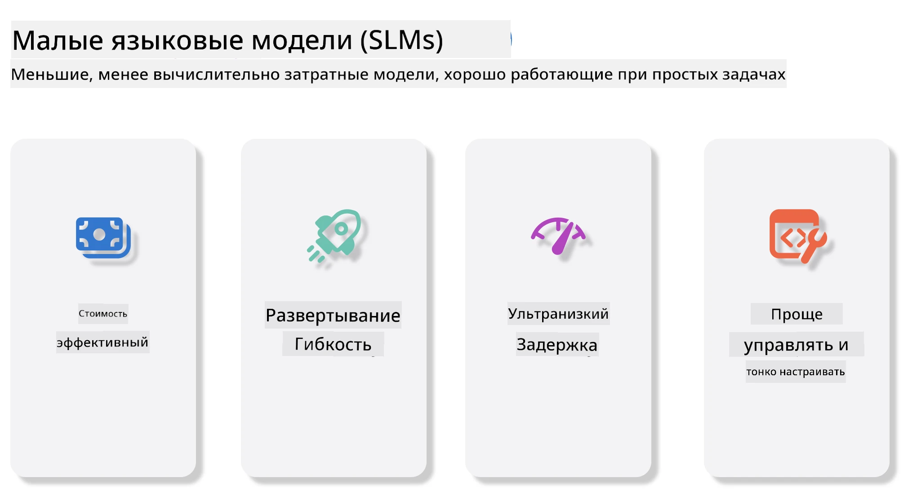
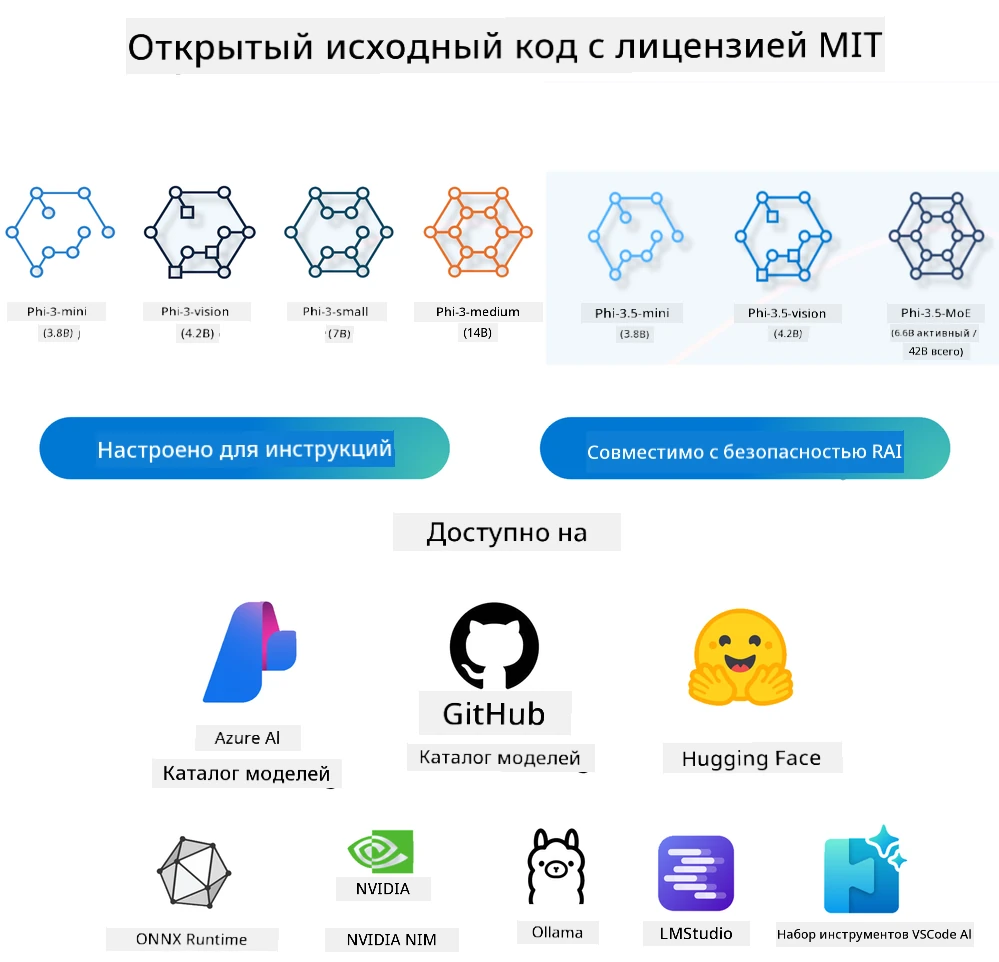
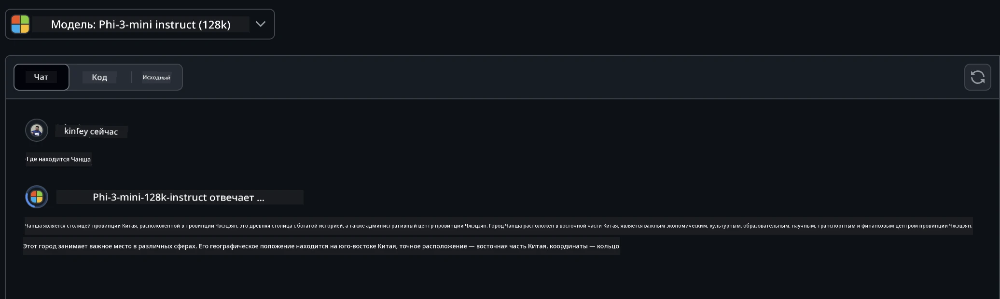
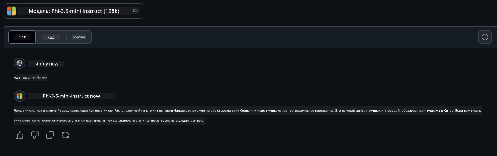

# Введение в малые языковые модели для генеративного ИИ для начинающих
Генеративный ИИ — это увлекательная область искусственного интеллекта, которая сосредоточена на создании систем, способных генерировать новый контент. Этот контент может варьироваться от текста и изображений до музыки и даже целых виртуальных сред. Одно из самых захватывающих применений генеративного ИИ — в области языковых моделей.

## Что такое малые языковые модели?

Малая языковая модель (SLM) представляет собой уменьшенный вариант большой языковой модели (LLM), используя многие архитектурные принципы и техники LLM, при этом демонстрируя значительно сниженные вычислительные затраты.

SLM — это подмножество языковых моделей, предназначенных для генерации текста, похожего на человеческий. В отличие от их больших аналогов, таких как GPT-4, SLM более компактны и эффективны, что делает их идеальными для приложений с ограниченными вычислительными ресурсами. Несмотря на меньший размер, они способны выполнять множество задач. Обычно SLM создаются путем сжатия или дистилляции LLM с целью сохранить существенную часть функциональности и лингвистических возможностей оригинальной модели. Это уменьшение размера модели снижает общую сложность, делает SLM более эффективными как с точки зрения использования памяти, так и вычислительных требований. Несмотря на эти оптимизации, SLM способны выполнять широкий спектр задач обработки естественного языка (NLP):

- Генерация текста: создание связных и контекстуально релевантных предложений или абзацев.
- Дополнение текста: прогнозирование и завершение предложений на основе заданного запроса.
- Перевод: преобразование текста с одного языка на другой.
- Суммирование: сокращение длинных текстов до коротких, более удобоваримых аннотаций.

Хотя с некоторыми компромиссами в производительности или глубине понимания по сравнению с их большими аналогами.

## Как работают малые языковые модели?
SLM обучаются на огромных объемах текстовых данных. Во время обучения они учатся распознавать паттерны и структуры языка, что позволяет им генерировать текст, который является грамматически правильным и контекстуально уместным. Процесс обучения включает:

- Сбор данных: получение больших наборов текстов из различных источников.
- Предобработка: очистка и организация данных, чтобы сделать их подходящими для обучения.
- Обучение: использование алгоритмов машинного обучения для обучения модели пониманию и генерации текста.
- Тонкая настройка: корректировка модели для повышения её производительности в конкретных задачах.

Разработка SLM обусловлена растущей потребностью в моделях, которые могут быть развернуты в условиях ограниченных ресурсов, таких как мобильные устройства или граничные вычислительные платформы, где полноразмерные LLM могут быть непрактичны из-за высокой требовательности к ресурсам. Сосредотачиваясь на эффективности, SLM находят баланс между производительностью и доступностью, обеспечивая более широкое применение в различных областях.



## Учебные цели

В этом уроке мы хотим познакомить вас с SLM и объединить это знание с Microsoft Phi-3, чтобы изучить различные сценарии в области текстового контента, зрения и MoE.

К концу урока вы должны уметь ответить на следующие вопросы:

- Что такое SLM?
- В чем разница между SLM и LLM?
- Что такое семейство Microsoft Phi-3/3.5?
- Как осуществлять инференс с Microsoft Phi-3/3.5?

Готовы? Начнем.

## Отличия между большими языковыми моделями (LLM) и малыми языковыми моделями (SLM)

И LLM, и SLM строятся на основе фундаментальных принципов вероятностного машинного обучения, следуя схожим подходам в архитектуре, методах обучения, процессах генерации данных и методах оценки моделей. Тем не менее, есть ряд ключевых факторов, которые отличают эти два типа моделей.

## Применение малых языковых моделей

SLM находят широкое применение, включая:

- Чат-боты: предоставление поддержки клиентов и взаимодействие с пользователями в формате диалога.
- Создание контента: помощь авторам в генерации идей или даже написании целых статей.
- Образование: помощь студентам в написании заданий или изучении новых языков.
- Доступность: создание инструментов для людей с ограниченными возможностями, таких как системы преобразования текста в речь.

**Размер**

Основное отличие между LLM и SLM заключается в масштабе моделей. LLM, такие как ChatGPT (GPT-4), могут содержать примерно 1,76 триллиона параметров, в то время как открытые SLM, например, Mistral 7B, имеют значительно меньше параметров — примерно 7 миллиардов. Это расхождение обусловлено различиями в архитектуре и процессе обучения моделей. Например, ChatGPT использует механизм self-attention в рамках энкодер-декодерного подхода, тогда как Mistral 7B применяет скользящее окно внимания, что позволяет более эффективно обучаться в модели только декодера. Эта архитектурная разница имеет существенное влияние на сложность и производительность моделей.

**Понимание**

SLM обычно оптимизированы для работы в конкретных областях, что делает их высокоспециализированными, но с потенциальными ограничениями в способности обеспечивать широкое контекстуальное понимание в разных областях знаний. В отличие от них, LLM стремятся имитировать человеческий интеллект на более всеобъемлющем уровне. Обученные на обширных и разнообразных датасетах, LLM предназначены для хорошей работы в различных областях, обеспечивая большую универсальность и адаптивность. Следовательно, LLM более подходят для широкого спектра последующих задач, таких как обработка естественного языка и программирование.

**Вычислительные ресурсы**

Обучение и развёртывание LLM требует значительных ресурсов, включая крупномасштабные кластеры GPU. Например, обучение модели вроде ChatGPT с нуля может потребовать тысячи GPU в течение длительного времени. В отличие от этого, SLM с меньшим количеством параметров более доступны с точки зрения вычислительных ресурсов. Модели типа Mistral 7B можно обучать и запускать на локальных машинах со средними возможностями GPU, хотя обучение все еще занимает несколько часов на нескольких GPU.

**Смещение**

Смещение — известная проблема у LLM, обусловленная природой обучающих данных. Эти модели часто используют сырые, открытые данные из интернета, которые могут недооценивать или искажать представление о некоторых группах, вносить ошибочные метки или отражать лингвистические предвзятости, вызванные диалектами, географическими вариантами и грамматическими правилами. Кроме того, сложность архитектуры LLM может непреднамеренно усиливать смещение, которое может остаться незамеченным без тщательной тонкой настройки. С другой стороны, SLM, обучаемые на более ограниченных, специфичных доменах наборов данных, менее подвержены таким предвзятостям, хотя полностью от них не застрахованы.

**Инференс**

Меньший размер SLM даёт им значительное преимущество в скорости инференса, позволяя эффективно генерировать результаты на локальном оборудовании без необходимости в масштабных параллельных вычислениях. Тогда как LLM из-за своих размеров и сложности часто требуют значительных параллельных ресурсов для приемлемой скорости инференса. Наличие множества одновременных пользователей дополнительно замедляет время отклика LLM, особенно при больших нагрузках.

В целом, несмотря на то, что LLM и SLM базируются на одних и тех же принципах машинного обучения, они значительно отличаются по размеру модели, требованиям к ресурсам, уровню контекстного понимания, подверженности смещениям и скорости инференса. Эти различия отражают их соответствующую пригодность для различных случаев применения: LLM более универсальны, но ресурсоёмки, а SLM предлагают специфичную для домена эффективность при сниженных вычислительных затратах.

***Примечание: в этом уроке мы познакомим вас с SLM на примере Microsoft Phi-3 / 3.5.***

## Представление семейства Phi-3 / Phi-3.5

Семейство Phi-3 / 3.5 ориентировано преимущественно на задачи работы с текстом, зрением и приложениями Агентов (MoE):

### Phi-3 / 3.5 Instruct

Основное применение — генерация текста, завершение чатов и извлечение информации из контента и т. д.

**Phi-3-mini**

Языковая модель с 3,8 млрд параметров доступна в Microsoft Azure AI Studio, Hugging Face и Ollama. Модели Phi-3 значительно превосходят языковые модели равного и большего размера по ключевым бенчмаркам (см. показатели ниже, чем выше — тем лучше). Phi-3-mini превосходит модели вдвое большего размера, а Phi-3-small и Phi-3-medium — крупные модели, включая GPT-3.5.

**Phi-3-small & medium**

Имея всего 7 млрд параметров, Phi-3-small превосходит GPT-3.5T по множеству тестов на язык, логическое мышление, программирование и математику.

Phi-3-medium с 14 млрд параметров продолжает эту тенденцию и превосходит Gemini 1.0 Pro.

**Phi-3.5-mini**

Её можно считать апгрейдом Phi-3-mini. При неизменном количестве параметров улучшена поддержка нескольких языков (более 20 языков: арабский, китайский, чешский, датский, нидерландский, английский, финский, французский, немецкий, иврит, венгерский, итальянский, японский, корейский, норвежский, польский, португальский, русский, испанский, шведский, тайский, турецкий, украинский) и добавлена усиленная поддержка длинного контекста.

Phi-3.5-mini с 3,8 млрд параметров превосходит языковые модели того же размера и сопоставима с моделями вдвое больше.

### Phi-3 / 3.5 Vision

Можно считать, что Instruct-модель Phi-3/3.5 отвечает за способность Phi понимать, а Vision даёт Phi глаза, чтобы видеть и понимать мир.

**Phi-3-Vision**

Phi-3-vision с только 4,2 млрд параметров продолжает тенденцию и превосходит более крупные модели, такие как Claude-3 Haiku и Gemini 1.0 Pro V, в задачах общего визуального рассуждения, оптического распознавания символов (OCR), а также понимания таблиц и диаграмм.

**Phi-3.5-Vision**

Phi-3.5-Vision является улучшением Phi-3-Vision, добавляя поддержку множественных изображений. Эту модель можно рассматривать как развитие зрения — теперь Phi может видеть не только картинки, но и видео.

Phi-3.5-vision превосходит более крупные модели, такие как Claude-3.5 Sonnet и Gemini 1.5 Flash, по задачам OCR, понимания таблиц и графиков, и сравнима с ними в задачах общего визуального рассуждения. Поддерживает ввод нескольких кадров, то есть выполнение рассуждений по нескольким изображениям.

### Phi-3.5-MoE

***Mixture of Experts (MoE)*** позволяет обучать модели с гораздо меньшими вычислительными затратами, что означает возможность значительного увеличения размера модели или набора данных при том же бюджете вычислений, что и у плотных моделей. В частности, MoE-модель должна достигать того же качества, что и её плотный аналог, гораздо быстрее во время предварительного обучения.

Phi-3.5-MoE состоит из 16 модулей экспертов по 3,8 млрд параметров каждый. Phi-3.5-MoE с всего 6,6 млрд активных параметров достигает уровня рассуждения, понимания языка и математики, сопоставимого с более крупными моделями.

Мы можем использовать модели семейства Phi-3/3.5 в различных сценариях. В отличие от LLM, Phi-3/3.5-mini или Phi-3/3.5-Vision можно развернуть на edge-устройствах.

## Как использовать модели семейства Phi-3/3.5

Мы хотим использовать Phi-3/3.5 в различных сценариях. Далее мы рассмотрим применение Phi-3/3.5 для разных задач.



### Инференс через облачные API

**GitHub Models**

GitHub Models — самый прямой способ. Вы можете быстро получить доступ к модели Phi-3/3.5-Instruct через GitHub Models. В сочетании с Azure AI Inference SDK / OpenAI SDK вы можете обращаться к API через код для вызова Phi-3/3.5-Instruct. Различные эффекты также можно протестировать через Playground.

- Демонстрация: сравнение результатов Phi-3-mini и Phi-3.5-mini в китайском сценарии






**Azure AI Studio**

Или если вы хотите использовать модели зрения и MoE, можно воспользоваться Azure AI Studio для вызовов. Если интересно, можно прочитать Phi-3 Cookbook, чтобы узнать, как вызывать Phi-3/3.5 Instruct, Vision, MoE через Azure AI Studio [Ссылка](https://github.com/microsoft/Phi-3CookBook/blob/main/md/02.QuickStart/AzureAIStudio_QuickStart.md?WT.mc_id=academic-105485-koreyst)


**NVIDIA NIM**

Помимо облачных решений Model Catalog от Azure и GitHub, вы также можете использовать [NVIDIA NIM](https://developer.nvidia.com/nim?WT.mc_id=academic-105485-koreyst) для выполнения соответствующих вызовов. Вы можете посетить NVIDIA NIM, чтобы выполнить API-вызовы семейства Phi-3/3.5. NVIDIA NIM (NVIDIA Inference Microservices) — это набор ускоренных микросервисов инференса, созданных для помощи разработчикам в эффективном развёртывании моделей ИИ в различных средах, включая облака, дата-центры и рабочие станции.

Ключевые особенности NVIDIA NIM:
- **Простота развертывания:** NIM позволяет развернуть модели ИИ одной командой, что упрощает интеграцию в существующие рабочие процессы.
- **Оптимизированная производительность:** Он использует предварительно оптимизированные движки вывода NVIDIA, такие как TensorRT и TensorRT-LLM, обеспечивая низкую задержку и высокую пропускную способность.
- **Масштабируемость:** NIM поддерживает автоскейлинг на Kubernetes, позволяя эффективно обрабатывать различные нагрузки.
- **Безопасность и контроль:** Организации могут сохранять контроль над своими данными и приложениями, самостоятельно размещая микросервисы NIM на собственной инфраструктуре.
- **Стандартные API:** NIM предоставляет API, соответствующие отраслевым стандартам, что упрощает создание и интеграцию ИИ-приложений, таких как чат-боты, ИИ-ассистенты и другие.

NIM является частью NVIDIA AI Enterprise, которая направлена на упрощение развертывания и эксплуатации моделей ИИ, обеспечивая их эффективную работу на графических процессорах NVIDIA.

- Демонстрация: Использование NVIDIA NIM для вызова Phi-3.5-Vision-API  [[Щелкните эту ссылку](./python/Phi-3-Vision-Nividia-NIM.ipynb?WT.mc_id=academic-105485-koreyst)]


### Запуск Phi-3/3.5 локально
Инферирование в отношении Phi-3 или любой языковой модели, такой как GPT-3, означает процесс генерации ответов или предсказаний на основе входных данных. Когда вы задаёте подсказку или вопрос Phi-3, он использует свою обученную нейронную сеть для вывода наиболее вероятного и релевантного ответа, анализируя шаблоны и связи в данных, на которых он обучался.

**Hugging Face Transformer**  
Hugging Face Transformers — это мощная библиотека, предназначенная для обработки естественного языка (NLP) и других задач машинного обучения. Вот некоторые ключевые моменты о ней:

1. **Предобученные модели:** Она предоставляет тысячи предобученных моделей, которые можно использовать для различных задач, таких как классификация текста, распознавание именованных сущностей, ответ на вопросы, суммирование, перевод и генерация текста.

2. **Взаимодействие с фреймворками:** Библиотека поддерживает несколько фреймворков глубокого обучения, включая PyTorch, TensorFlow и JAX. Это позволяет обучать модель в одном фреймворке и использовать ее в другом.

3. **Мультимодальные возможности:** Помимо NLP, Hugging Face Transformers поддерживает задачи компьютерного зрения (например, классификация изображений, обнаружение объектов) и обработки аудио (например, распознавание речи, классификация аудиосигналов).

4. **Простота использования:** Библиотека предлагает API и инструменты для лёгкой загрузки и тонкой настройки моделей, делая её доступной как для новичков, так и для экспертов.

5. **Сообщество и ресурсы:** Hugging Face имеет активное сообщество и обширную документацию, руководства и обучающие материалы, которые помогают пользователям быстро начать работу и максимально эффективно использовать библиотеку.  
[официальная документация](https://huggingface.co/docs/transformers/index?WT.mc_id=academic-105485-koreyst) или их [репозиторий на GitHub](https://github.com/huggingface/transformers?WT.mc_id=academic-105485-koreyst).

Это наиболее распространённый метод, но он также требует ускорения с помощью GPU. Ведь задачи такие как Vision и MoE требуют большого объёма вычислений, которые на CPU будут идти очень медленно, если они не квантизированы.


- Демонстрация: Использование Transformer для вызова Phi-3.5-Instruct [Щелкните эту ссылку](./python/phi35-instruct-demo.ipynb?WT.mc_id=academic-105485-koreyst)

- Демонстрация: Использование Transformer для вызова Phi-3.5-Vision [Щелкните эту ссылку](./python/phi35-vision-demo.ipynb?WT.mc_id=academic-105485-koreyst)

- Демонстрация: Использование Transformer для вызова Phi-3.5-MoE [Щелкните эту ссылку](./python/phi35_moe_demo.ipynb?WT.mc_id=academic-105485-koreyst)

**Ollama**  
[Ollama](https://ollama.com/?WT.mc_id=academic-105485-koreyst) — это платформа, созданная для упрощения запуска больших языковых моделей (LLM) локально на вашем устройстве. Она поддерживает различные модели, такие как Llama 3.1, Phi 3, Mistral и Gemma 2, и другие. Платформа упрощает процесс, объединяя веса модели, конфигурацию и данные в один пакет, что делает её более доступной для пользователей, желающих настроить и создавать собственные модели. Ollama доступна для macOS, Linux и Windows. Это отличный инструмент, если вы хотите экспериментировать с LLM или развернуть их без использования облачных сервисов. Ollama — самый прямой способ, вам нужно просто выполнить следующую команду.


```bash

ollama run phi3.5

```


**ONNX Runtime для GenAI**

[ONNX Runtime](https://github.com/microsoft/onnxruntime-genai?WT.mc_id=academic-105485-koreyst) — это кроссплатформенный ускоритель вывода и обучения моделей машинного обучения. ONNX Runtime для Generative AI (GENAI) — это мощный инструмент, который помогает эффективно запускать генеративные модели ИИ на различных платформах.

## Что такое ONNX Runtime?  
ONNX Runtime — это проект с открытым исходным кодом, обеспечивающий высокопроизводительный вывод моделей машинного обучения. Он поддерживает модели в формате Open Neural Network Exchange (ONNX), который является стандартом для представления моделей машинного обучения. Вывод ONNX Runtime может обеспечить более быстрый пользовательский опыт и снизить затраты, поддерживая модели из фреймворков глубокого обучения, таких как PyTorch и TensorFlow/Keras, а также классические библиотеки машинного обучения, такие как scikit-learn, LightGBM, XGBoost и другие. ONNX Runtime совместим с различным оборудованием, драйверами и операционными системами, обеспечивает оптимальную производительность, используя ускорители оборудования, а также оптимизации и трансформации графов.

## Что такое Генеративный ИИ?  
Генеративный ИИ относится к системам ИИ, которые способны создавать новый контент, такой как текст, изображения или музыку, на основе данных, на которых они обучены. Примерами являются языковые модели, такие как GPT-3, и модели генерации изображений, такие как Stable Diffusion. Библиотека ONNX Runtime для GenAI обеспечивает цикл генеративного ИИ для ONNX-моделей, включая вывод с помощью ONNX Runtime, обработку логитов, поиск и семплирование, а также управление кешем KV.

## ONNX Runtime для GENAI  
ONNX Runtime для GENAI расширяет возможности ONNX Runtime, поддерживая генеративные модели ИИ. Вот некоторые ключевые особенности:

- **Широкая поддержка платформ:** Работает на различных платформах, включая Windows, Linux, macOS, Android и iOS.
- **Поддержка моделей:** Поддерживает многие популярные генеративные модели, такие как LLaMA, GPT-Neo, BLOOM и другие.
- **Оптимизация производительности:** Включает оптимизации для различных аппаратных ускорителей, таких как графические процессоры NVIDIA, AMD и др.
- **Простота использования:** Предоставляет API для лёгкой интеграции в приложения, позволяя генерировать текст, изображения и другой контент с минимальным количеством кода.
- Пользователи могут вызывать высокоуровневый метод generate() или запускать каждую итерацию модели в цикле, генерируя один токен за раз и при необходимости обновляя параметры генерации внутри цикла.
- ONNX runtime также поддерживает жадный/лучевой поиск и семплирование TopP, TopK для генерации последовательностей токенов, а также встроенную обработку логитов, например, штрафы за повторения. Вы также можете легко добавить пользовательскую оценку.

## Начало работы  
Чтобы начать работу с ONNX Runtime для GENAI, вы можете выполнить следующие шаги:

### Установите ONNX Runtime:  
```Python
pip install onnxruntime
```
### Установите расширения для генеративного ИИ:  
```Python
pip install onnxruntime-genai
```
  
### Запустите модель: Вот простой пример на Python:  
```Python
import onnxruntime_genai as og

model = og.Model('path_to_your_model.onnx')

tokenizer = og.Tokenizer(model)

input_text = "Hello, how are you?"

input_tokens = tokenizer.encode(input_text)

output_tokens = model.generate(input_tokens)

output_text = tokenizer.decode(output_tokens)

print(output_text) 
```
### Демонстрация: Использование ONNX Runtime GenAI для вызова Phi-3.5-Vision

```python

import onnxruntime_genai as og

model_path = './Your Phi-3.5-vision-instruct ONNX Path'

img_path = './Your Image Path'

model = og.Model(model_path)

processor = model.create_multimodal_processor()

tokenizer_stream = processor.create_stream()

text = "Your Prompt"

prompt = "<|user|>\n"

prompt += "<|image_1|>\n"

prompt += f"{text}<|end|>\n"

prompt += "<|assistant|>\n"

image = og.Images.open(img_path)

inputs = processor(prompt, images=image)

params = og.GeneratorParams(model)

params.set_inputs(inputs)

params.set_search_options(max_length=3072)

generator = og.Generator(model, params)

while not generator.is_done():

    generator.compute_logits()
    
    generator.generate_next_token()

    new_token = generator.get_next_tokens()[0]
    
    output = tokenizer_stream.decode(new_token)
    
    print(tokenizer_stream.decode(new_token), end='', flush=True)

```


**Другие**

В дополнение к ONNX Runtime и Ollama, можно также использовать справочные методы для квантифицированных моделей, основанные на методах от различных производителей. Например, Apple MLX framework с Apple Metal, Qualcomm QNN с NPU, Intel OpenVINO с CPU/GPU и др. Вы также можете получить больше материалов из [Phi-3 Cookbook](https://github.com/microsoft/phi-3cookbook?WT.mc_id=academic-105485-koreyst)


## Больше

Мы изучили основы семьи Phi-3/3.5, но чтобы узнать больше о SLM, нам нужно больше знаний. Вы можете найти ответы в Phi-3 Cookbook. Если хотите узнать больше, пожалуйста, посетите [Phi-3 Cookbook](https://github.com/microsoft/phi-3cookbook?WT.mc_id=academic-105485-koreyst).

---

<!-- CO-OP TRANSLATOR DISCLAIMER START -->
**Отказ от ответственности**:  
Этот документ был переведен с использованием сервиса автоматического перевода [Co-op Translator](https://github.com/Azure/co-op-translator). Несмотря на наши усилия по обеспечению точности, пожалуйста, имейте в виду, что автоматические переводы могут содержать ошибки или неточности. Оригинальный документ на его исходном языке следует считать авторитетным источником. Для критически важной информации рекомендуется обращаться к профессиональному переводу, выполненному человеком. Мы не несем ответственности за любые недоразумения или неправильные толкования, возникшие в результате использования этого перевода.
<!-- CO-OP TRANSLATOR DISCLAIMER END -->