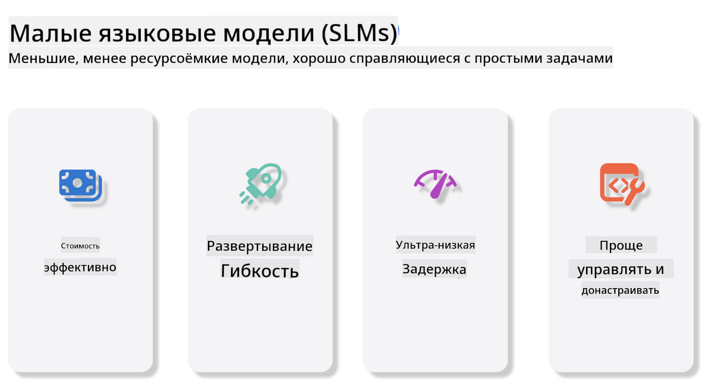
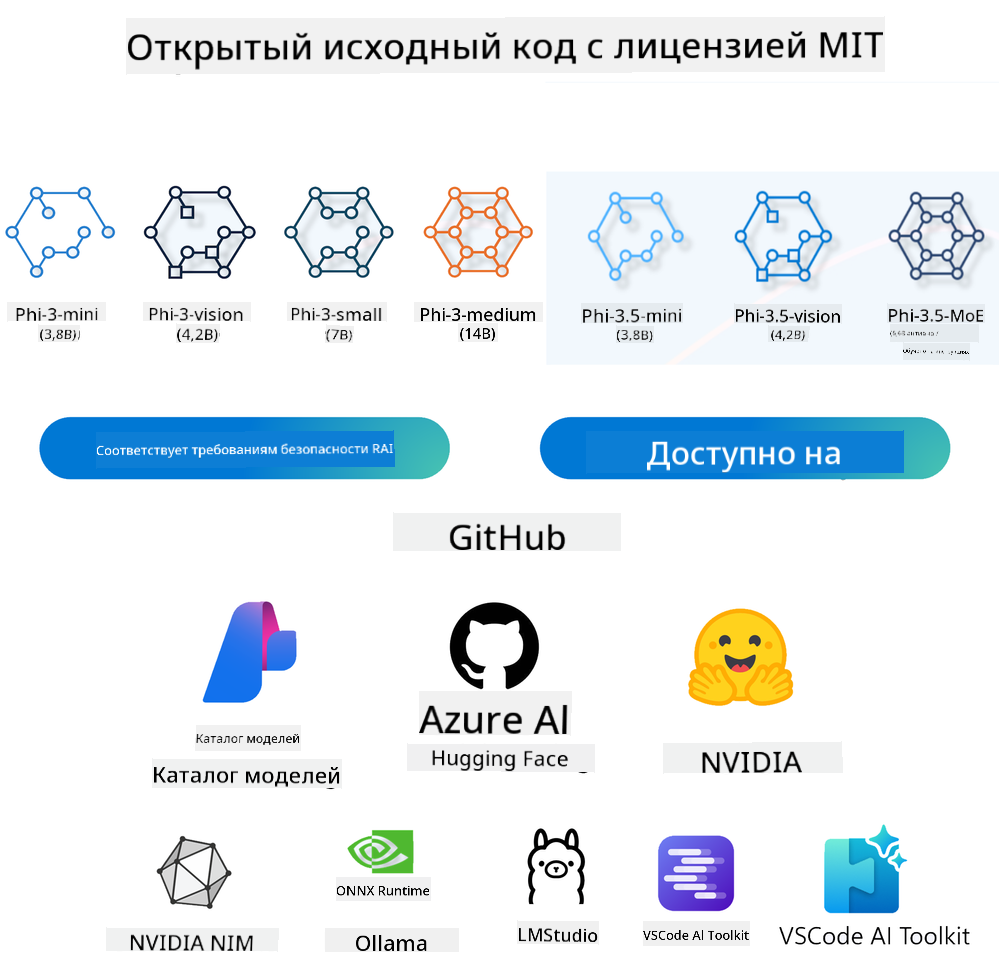
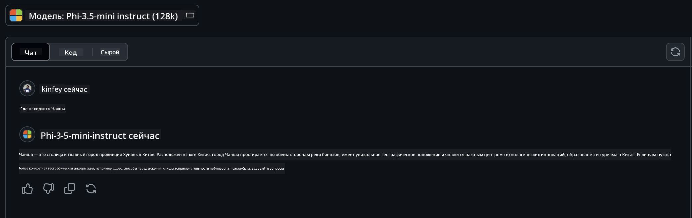

<!--
CO_OP_TRANSLATOR_METADATA:
{
  "original_hash": "124ad36cfe96f74038811b6e2bb93e9d",
  "translation_date": "2025-07-09T18:14:07+00:00",
  "source_file": "19-slm/README.md",
  "language_code": "ru"
}
-->
# Введение в малые языковые модели для генеративного ИИ для начинающих  
Генеративный ИИ — это увлекательная область искусственного интеллекта, которая сосредоточена на создании систем, способных генерировать новый контент. Этот контент может включать текст, изображения, музыку и даже целые виртуальные среды. Одним из самых захватывающих применений генеративного ИИ являются языковые модели.

## Что такое малые языковые модели?  

Малая языковая модель (SLM) — это уменьшенная версия большой языковой модели (LLM), которая использует многие архитектурные принципы и методы LLM, но при этом требует значительно меньше вычислительных ресурсов.

SLM — это подмножество языковых моделей, предназначенных для генерации текста, похожего на человеческий. В отличие от своих больших аналогов, таких как GPT-4, SLM более компактны и эффективны, что делает их идеальными для приложений с ограниченными вычислительными ресурсами. Несмотря на меньший размер, они способны выполнять разнообразные задачи. Обычно SLM создаются путём сжатия или дистилляции LLM с целью сохранить значительную часть функциональности и языковых возможностей исходной модели. Уменьшение размера модели снижает общую сложность, делая SLM более эффективными как по использованию памяти, так и по вычислительным требованиям. Несмотря на эти оптимизации, SLM способны выполнять широкий спектр задач обработки естественного языка (NLP):

- Генерация текста: создание связных и контекстуально релевантных предложений или абзацев.  
- Дополнение текста: предсказание и завершение предложений на основе заданного начала.  
- Перевод: преобразование текста с одного языка на другой.  
- Суммирование: сокращение длинных текстов до более коротких и удобоваримых резюме.  

Хотя при этом возможны некоторые компромиссы в производительности или глубине понимания по сравнению с большими моделями.

## Как работают малые языковые модели?  
SLM обучаются на огромных объёмах текстовых данных. В процессе обучения они изучают закономерности и структуры языка, что позволяет им генерировать грамматически правильный и контекстуально уместный текст. Процесс обучения включает:

- Сбор данных: накопление больших наборов текстов из различных источников.  
- Предобработка: очистка и организация данных для подготовки к обучению.  
- Обучение: использование алгоритмов машинного обучения для обучения модели пониманию и генерации текста.  
- Тонкая настройка: корректировка модели для улучшения её работы на конкретных задачах.  

Разработка SLM отвечает растущей потребности в моделях, которые можно запускать в условиях ограниченных ресурсов, например, на мобильных устройствах или платформах edge computing, где полноразмерные LLM могут быть непрактичны из-за высоких требований к ресурсам. Сосредоточившись на эффективности, SLM обеспечивают баланс между производительностью и доступностью, расширяя возможности применения в различных областях.



## Цели обучения  

В этом уроке мы познакомим вас с концепцией SLM и рассмотрим её на примере Microsoft Phi-3, изучая различные сценарии работы с текстом, изображениями и MoE.

К концу урока вы сможете ответить на следующие вопросы:

- Что такое SLM  
- В чём разница между SLM и LLM  
- Что такое семейство Microsoft Phi-3/3.5  
- Как выполнять инференс с помощью Microsoft Phi-3/3.5  

Готовы? Поехали.

## Отличия больших языковых моделей (LLM) и малых языковых моделей (SLM)  

И LLM, и SLM основаны на принципах вероятностного машинного обучения, используют схожие подходы в архитектуре, методах обучения, процессах генерации данных и оценке моделей. Однако существует несколько ключевых факторов, которые отличают эти два типа моделей.

## Применение малых языковых моделей  

SLM находят применение в самых разных областях, включая:

- Чат-боты: предоставление поддержки клиентам и взаимодействие с пользователями в формате диалога.  
- Создание контента: помощь авторам в генерации идей или даже написании целых статей.  
- Образование: поддержка студентов при выполнении письменных заданий или изучении новых языков.  
- Доступность: создание инструментов для людей с ограниченными возможностями, например, систем преобразования текста в речь.  

**Размер**  

Основное отличие между LLM и SLM заключается в масштабе моделей. LLM, такие как ChatGPT (GPT-4), могут содержать около 1,76 триллиона параметров, тогда как открытые SLM, например Mistral 7B, имеют значительно меньше параметров — примерно 7 миллиардов. Это различие обусловлено архитектурой и процессами обучения. Например, ChatGPT использует механизм самовнимания в рамках энкодер-декодерной архитектуры, тогда как Mistral 7B применяет скользящее внимание, что позволяет более эффективно обучать модель только с декодером. Такая архитектурная разница существенно влияет на сложность и производительность моделей.

**Понимание**  

SLM обычно оптимизированы для работы в конкретных областях, что делает их высокоспециализированными, но с ограниченной способностью к широкому контекстуальному пониманию в разных сферах знаний. В отличие от них, LLM стремятся имитировать человеческий интеллект на более широком уровне. Обученные на огромных и разнообразных наборах данных, LLM хорошо справляются с задачами в различных областях, обеспечивая большую универсальность и адаптивность. Поэтому LLM подходят для более широкого спектра задач, таких как обработка естественного языка и программирование.

**Вычисления**  

Обучение и запуск LLM требуют значительных вычислительных ресурсов, включая крупномасштабные GPU-кластеры. Например, обучение модели вроде ChatGPT с нуля может занять тысячи GPU в течение длительного времени. В отличие от этого, SLM с меньшим количеством параметров более доступны с точки зрения вычислительных ресурсов. Модели вроде Mistral 7B можно обучать и запускать на локальных машинах с умеренными GPU, хотя обучение всё равно занимает несколько часов на нескольких GPU.

**Смещение**  

Смещение — известная проблема LLM, связанная с характером обучающих данных. Эти модели часто обучаются на необработанных, открытых данных из интернета, которые могут недооценивать или искажать представление о некоторых группах, содержать ошибочную маркировку или отражать лингвистические предубеждения, вызванные диалектами, географическими особенностями и грамматическими правилами. Кроме того, сложность архитектуры LLM может непреднамеренно усиливать смещение, которое сложно выявить без тщательной тонкой настройки. В свою очередь, SLM, обучаемые на более ограниченных и специализированных наборах данных, менее подвержены таким смещениям, хотя полностью от них не застрахованы.

**Инференс**  

Меньший размер SLM даёт им значительное преимущество в скорости инференса, позволяя эффективно генерировать результаты на локальном оборудовании без необходимости в масштабной параллельной обработке. В то время как LLM из-за своего размера и сложности часто требуют значительных параллельных вычислительных ресурсов для достижения приемлемого времени отклика. Наличие множества одновременных пользователей дополнительно замедляет работу LLM, особенно при масштабном развертывании.

В итоге, несмотря на общую основу в машинном обучении, LLM и SLM существенно различаются по размеру модели, требованиям к ресурсам, уровню контекстуального понимания, уязвимости к смещению и скорости инференса. Эти различия отражают их пригодность для разных задач: LLM более универсальны, но требуют много ресурсов, а SLM обеспечивают эффективность в узких областях при меньших вычислительных затратах.

***Note：В этой главе мы рассмотрим SLM на примере Microsoft Phi-3 / 3.5.***

## Введение в семейство Phi-3 / Phi-3.5  

Семейство Phi-3 / 3.5 ориентировано на сценарии работы с текстом, изображениями и агентами (MoE):

### Phi-3 / 3.5 Instruct  

В основном предназначено для генерации текста, завершения диалогов и извлечения информации из контента.

**Phi-3-mini**  

Языковая модель с 3.8 миллиардами параметров доступна в Microsoft Azure AI Studio, Hugging Face и Ollama. Модели Phi-3 значительно превосходят языковые модели равного и большего размера по ключевым бенчмаркам (см. показатели ниже, где выше — лучше). Phi-3-mini превосходит модели вдвое большего размера, а Phi-3-small и Phi-3-medium обгоняют даже более крупные модели, включая GPT-3.5.

**Phi-3-small и medium**  

С 7 миллиардами параметров Phi-3-small превосходит GPT-3.5T по ряду языковых, логических, программных и математических тестов.

Phi-3-medium с 14 миллиардами параметров продолжает эту тенденцию и превосходит Gemini 1.0 Pro.

**Phi-3.5-mini**  

Можно рассматривать как улучшенную версию Phi-3-mini. Параметры остались прежними, но улучшена поддержка множества языков (поддержка более 20 языков: арабский, китайский, чешский, датский, голландский, английский, финский, французский, немецкий, иврит, венгерский, итальянский, японский, корейский, норвежский, польский, португальский, русский, испанский, шведский, тайский, турецкий, украинский) и добавлена более мощная поддержка длинного контекста.

Phi-3.5-mini с 3.8 миллиардами параметров превосходит языковые модели того же размера и сопоставима с моделями вдвое большего размера.

### Phi-3 / 3.5 Vision  

Модель Instruct Phi-3/3.5 можно рассматривать как способность Phi понимать, а Vision — как «глаза» Phi для восприятия мира.

**Phi-3-Vision**  

Phi-3-Vision с 4.2 миллиардами параметров продолжает тенденцию и превосходит более крупные модели, такие как Claude-3 Haiku и Gemini 1.0 Pro V, в задачах общего визуального рассуждения, OCR, а также понимания таблиц и диаграмм.

**Phi-3.5-Vision**  

Phi-3.5-Vision — это улучшенная версия Phi-3-Vision, добавляющая поддержку нескольких изображений. Можно сказать, что это улучшение зрения: теперь модель может воспринимать не только отдельные картинки, но и видео.

Phi-3.5-Vision превосходит более крупные модели, такие как Claude-3.5 Sonnet и Gemini 1.5 Flash, в задачах OCR, понимания таблиц и графиков, а также сопоставима с ними в задачах общего визуального рассуждения. Поддерживает многокадровый ввод, то есть может выполнять рассуждения на основе нескольких изображений.

### Phi-3.5-MoE  

***Mixture of Experts (MoE)*** позволяет моделям обучаться с гораздо меньшими вычислительными затратами, что даёт возможность значительно увеличить размер модели или объём данных при том же бюджете вычислений, что и у плотных моделей. В частности, MoE-модель достигает того же качества, что и плотная, но гораздо быстрее на этапе предобучения.

Phi-3.5-MoE состоит из 16 экспертных модулей по 3.8 миллиарда параметров каждый. Phi-3.5-MoE с всего 6.6 миллиардами активных параметров достигает уровня рассуждений, понимания языка и математики, сопоставимого с гораздо более крупными моделями.

Мы можем использовать модели семейства Phi-3/3.5 в зависимости от сценариев. В отличие от LLM, Phi-3/3.5-mini или Phi-3/3.5-Vision можно развернуть на edge-устройствах.

## Как использовать модели семейства Phi-3/3.5  

Мы хотим применять Phi-3/3.5 в разных сценариях. Далее мы рассмотрим использование Phi-3/3.5 в различных ситуациях.



### Различия в инференсе через облачный API  

**GitHub Models**  

GitHub Models — самый прямой способ. Вы можете быстро получить доступ к модели Phi-3/3.5-Instruct через GitHub Models. В сочетании с Azure AI Inference SDK / OpenAI SDK можно обращаться к API через код для вызова Phi-3/3.5-Instruct. Также можно протестировать разные варианты через Playground.

- Демонстрация: сравнение работы Phi-3-mini и Phi-3.5-mini в китайских сценариях




**Azure AI Studio**  

Если вы хотите использовать модели Vision и MoE, можно обращаться к ним через Azure AI Studio. Если интересно, можно ознакомиться с Phi-3 Cookbook, чтобы узнать, как вызывать Phi-3/3.5 Instruct, Vision, MoE через Azure AI Studio [Перейти по ссылке](https://github.com/microsoft/Phi-3CookBook/blob/main/md/02.QuickStart/AzureAIStudio_QuickStart.md?WT.mc_id=academic-105485-koreyst)

**NVIDIA NIM**  

Помимо облачных решений Model Catalog от Azure и GitHub, вы можете использовать [NVIDIA NIM](https://developer.nvidia.com/nim?WT.mc_id=academic-105485-koreyst) для вызова моделей. NVIDIA NIM (NVIDIA Inference Microservices) — это набор ускоренных микросервисов инференса, предназначенных для эффективного развертывания ИИ-моделей в различных средах, включая облака, дата-центры и рабочие станции.

Основные возможности NVIDIA NIM:

- **Простота развертывания:** NIM позволяет запускать ИИ-модели одной командой, что облегчает интеграцию в существующие рабочие процессы.  
- **Оптимизированная производительность:** Использует предварительно оптимизированные движки инференса NVIDIA, такие как TensorRT и TensorRT-LLM, обеспечивая низкую задержку и высокую пропускную способность.  
- **Масштабируемость:** Поддерживает автоскейлинг на Kubernetes, что позволяет эффективно обрабатывать изменяющиеся нагрузки.
- **Безопасность и контроль:** Организации могут сохранять контроль над своими данными и приложениями, самостоятельно размещая микросервисы NIM на собственной управляемой инфраструктуре.  
- **Стандартные API:** NIM предоставляет API, соответствующие отраслевым стандартам, что облегчает создание и интеграцию AI-приложений, таких как чат-боты, AI-ассистенты и другие.

NIM является частью NVIDIA AI Enterprise, цель которого — упростить развертывание и эксплуатацию AI-моделей, обеспечивая их эффективную работу на GPU NVIDIA.

- Демонстрация: Использование Nividia NIM для вызова Phi-3.5-Vision-API  [[Перейти по ссылке](../../../19-slm/python/Phi-3-Vision-Nividia-NIM.ipynb)]


### Инференс Phi-3/3.5 в локальной среде  
Инференс в контексте Phi-3 или любой языковой модели, такой как GPT-3, означает процесс генерации ответов или предсказаний на основе полученного ввода. Когда вы даёте запрос или вопрос Phi-3, модель использует свою обученную нейронную сеть, чтобы определить наиболее вероятный и релевантный ответ, анализируя закономерности и связи в данных, на которых она обучалась.

**Hugging Face Transformer**  
Hugging Face Transformers — мощная библиотека, предназначенная для обработки естественного языка (NLP) и других задач машинного обучения. Вот основные моменты о ней:

1. **Предобученные модели:** Библиотека предоставляет тысячи предобученных моделей для различных задач, таких как классификация текста, распознавание именованных сущностей, ответы на вопросы, суммирование, перевод и генерация текста.

2. **Совместимость с фреймворками:** Поддерживает несколько фреймворков глубокого обучения, включая PyTorch, TensorFlow и JAX. Это позволяет обучать модель в одном фреймворке и использовать в другом.

3. **Мультимодальные возможности:** Помимо NLP, Hugging Face Transformers поддерживает задачи компьютерного зрения (например, классификация изображений, обнаружение объектов) и обработки аудио (например, распознавание речи, классификация звуков).

4. **Простота использования:** Библиотека предлагает API и инструменты для удобной загрузки и дообучения моделей, что делает её доступной как для новичков, так и для экспертов.

5. **Сообщество и ресурсы:** Hugging Face имеет активное сообщество и обширную документацию, учебные материалы и руководства, которые помогут быстро начать работу и максимально эффективно использовать библиотеку.  
[официальная документация](https://huggingface.co/docs/transformers/index?WT.mc_id=academic-105485-koreyst) или их [репозиторий на GitHub](https://github.com/huggingface/transformers?WT.mc_id=academic-105485-koreyst).

Это самый распространённый метод, но он требует ускорения на GPU. Ведь такие задачи, как Vision и MoE, требуют больших вычислительных ресурсов, которые на CPU без квантизации будут сильно ограничены.


- Демонстрация: Использование Transformer для вызова Phi-3.5-Instuct [Перейти по ссылке](../../../19-slm/python/phi35-instruct-demo.ipynb)

- Демонстрация: Использование Transformer для вызова Phi-3.5-Vision [Перейти по ссылке](../../../19-slm/python/phi35-vision-demo.ipynb)

- Демонстрация: Использование Transformer для вызова Phi-3.5-MoE [Перейти по ссылке](../../../19-slm/python/phi35_moe_demo.ipynb)

**Ollama**  
[Ollama](https://ollama.com/?WT.mc_id=academic-105485-koreyst) — платформа, созданная для упрощения запуска больших языковых моделей (LLM) локально на вашем устройстве. Она поддерживает различные модели, такие как Llama 3.1, Phi 3, Mistral и Gemma 2, и другие. Платформа упрощает процесс, объединяя веса модели, конфигурацию и данные в один пакет, что делает её более доступной для пользователей, желающих настраивать и создавать собственные модели. Ollama доступна для macOS, Linux и Windows. Это отличный инструмент, если вы хотите экспериментировать с LLM или развертывать их без использования облачных сервисов. Ollama — самый прямой способ, вам просто нужно выполнить следующую команду.


```bash

ollama run phi3.5

```


**ONNX Runtime для GenAI**

[ONNX Runtime](https://github.com/microsoft/onnxruntime-genai?WT.mc_id=academic-105485-koreyst) — кроссплатформенный ускоритель инференса и обучения моделей машинного обучения. ONNX Runtime для Generative AI (GENAI) — мощный инструмент, который помогает эффективно запускать генеративные AI-модели на различных платформах.

## Что такое ONNX Runtime?  
ONNX Runtime — это проект с открытым исходным кодом, обеспечивающий высокопроизводительный инференс моделей машинного обучения. Он поддерживает модели в формате Open Neural Network Exchange (ONNX), который является стандартом для представления моделей машинного обучения. Инференс с помощью ONNX Runtime позволяет ускорить взаимодействие с пользователями и снизить затраты, поддерживая модели из фреймворков глубокого обучения, таких как PyTorch и TensorFlow/Keras, а также классические библиотеки машинного обучения, например scikit-learn, LightGBM, XGBoost и другие. ONNX Runtime совместим с различным оборудованием, драйверами и операционными системами, обеспечивая оптимальную производительность за счёт использования аппаратных ускорителей, а также оптимизаций и преобразований графа.

## Что такое Generative AI?  
Генеративный AI — это системы искусственного интеллекта, которые могут создавать новый контент, например текст, изображения или музыку, на основе данных, на которых они обучались. Примеры включают языковые модели, такие как GPT-3, и модели генерации изображений, например Stable Diffusion. Библиотека ONNX Runtime для GenAI обеспечивает полный цикл генеративного AI для ONNX-моделей, включая инференс с ONNX Runtime, обработку логитов, поиск и сэмплинг, а также управление кешем KV.

## ONNX Runtime для GENAI  
ONNX Runtime для GENAI расширяет возможности ONNX Runtime, поддерживая генеративные AI-модели. Вот основные особенности:

- **Широкая поддержка платформ:** Работает на различных платформах, включая Windows, Linux, macOS, Android и iOS.  
- **Поддержка моделей:** Поддерживает множество популярных генеративных AI-моделей, таких как LLaMA, GPT-Neo, BLOOM и другие.  
- **Оптимизация производительности:** Включает оптимизации для различных аппаратных ускорителей, таких как GPU NVIDIA, GPU AMD и другие.  
- **Простота использования:** Предоставляет API для лёгкой интеграции в приложения, позволяя генерировать текст, изображения и другой контент с минимальным количеством кода.  
- Пользователи могут вызывать высокоуровневый метод generate() или запускать каждую итерацию модели в цикле, генерируя по одному токену за раз и при необходимости обновляя параметры генерации внутри цикла.  
- ONNX Runtime также поддерживает жадный и beam search, а также сэмплинг TopP и TopK для генерации последовательностей токенов, а также встроенную обработку логитов, например штрафы за повторения. Вы также можете легко добавить собственные методы оценки.

## Начало работы  
Чтобы начать работу с ONNX Runtime для GENAI, выполните следующие шаги:

### Установите ONNX Runtime:  
```Python
pip install onnxruntime
```  
### Установите расширения для Generative AI:  
```Python
pip install onnxruntime-genai
```

### Запустите модель: простой пример на Python:  
```Python
import onnxruntime_genai as og

model = og.Model('path_to_your_model.onnx')

tokenizer = og.Tokenizer(model)

input_text = "Hello, how are you?"

input_tokens = tokenizer.encode(input_text)

output_tokens = model.generate(input_tokens)

output_text = tokenizer.decode(output_tokens)

print(output_text) 
```  
### Демонстрация: Использование ONNX Runtime GenAI для вызова Phi-3.5-Vision


```python

import onnxruntime_genai as og

model_path = './Your Phi-3.5-vision-instruct ONNX Path'

img_path = './Your Image Path'

model = og.Model(model_path)

processor = model.create_multimodal_processor()

tokenizer_stream = processor.create_stream()

text = "Your Prompt"

prompt = "<|user|>\n"

prompt += "<|image_1|>\n"

prompt += f"{text}<|end|>\n"

prompt += "<|assistant|>\n"

image = og.Images.open(img_path)

inputs = processor(prompt, images=image)

params = og.GeneratorParams(model)

params.set_inputs(inputs)

params.set_search_options(max_length=3072)

generator = og.Generator(model, params)

while not generator.is_done():

    generator.compute_logits()
    
    generator.generate_next_token()

    new_token = generator.get_next_tokens()[0]
    
    code += tokenizer_stream.decode(new_token)
    
    print(tokenizer_stream.decode(new_token), end='', flush=True)

```


**Другие**

Помимо ONNX Runtime и Ollama, мы можем также использовать методы, основанные на количественных моделях, предоставляемых разными производителями. Например, Apple MLX framework с Apple Metal, Qualcomm QNN с NPU, Intel OpenVINO с CPU/GPU и другие. Дополнительную информацию можно найти в [Phi-3 Cookbook](https://github.com/microsoft/phi-3cookbook?WT.mc_id=academic-105485-koreyst).


## Дополнительно

Мы изучили основы семейства Phi-3/3.5, но чтобы глубже понять SLM, потребуется больше знаний. Ответы вы найдёте в Phi-3 Cookbook. Если хотите узнать больше, посетите [Phi-3 Cookbook](https://github.com/microsoft/phi-3cookbook?WT.mc_id=academic-105485-koreyst).

**Отказ от ответственности**:  
Этот документ был переведен с помощью сервиса автоматического перевода [Co-op Translator](https://github.com/Azure/co-op-translator). Несмотря на наши усилия по обеспечению точности, просим учитывать, что автоматический перевод может содержать ошибки или неточности. Оригинальный документ на его исходном языке следует считать авторитетным источником. Для получения критически важной информации рекомендуется обращаться к профессиональному переводу, выполненному человеком. Мы не несем ответственности за любые недоразумения или неправильные толкования, возникшие в результате использования данного перевода.