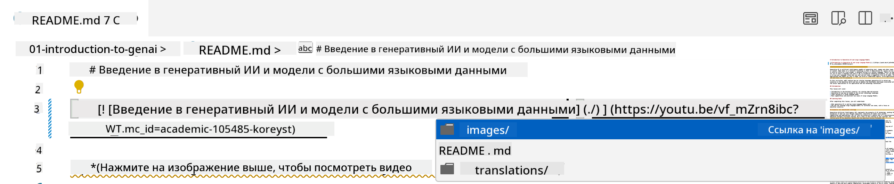
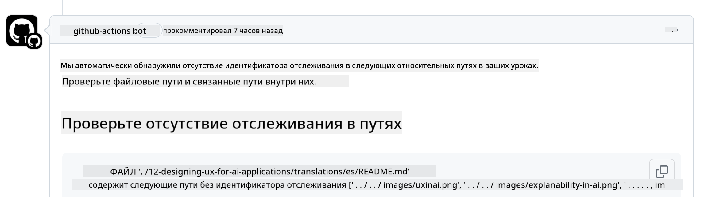
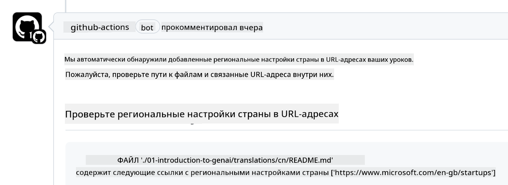

<!--
CO_OP_TRANSLATOR_METADATA:
{
  "original_hash": "57c41f2af71001a2cff9d8eb797cb843",
  "translation_date": "2025-05-19T11:09:07+00:00",
  "source_file": "CONTRIBUTING.md",
  "language_code": "ru"
}
-->
# Участие

Этот проект приветствует вклад и предложения. Большинство вкладов требуют, чтобы вы согласились с Соглашением о Лицензировании Вкладчиков (CLA), заявляющим, что у вас есть право и вы действительно предоставляете нам права на использование вашего вклада. Для подробностей посетите <https://cla.microsoft.com>.

> Важно: при переводе текста в этом репозитории, пожалуйста, не используйте машинный перевод. Мы будем проверять переводы через сообщество, поэтому, пожалуйста, участвуйте в переводах только на те языки, в которых вы хорошо разбираетесь.

Когда вы отправляете запрос на слияние, CLA-бот автоматически определит, нужно ли вам предоставить CLA, и оформит PR соответствующим образом (например, добавит метку, комментарий). Просто следуйте инструкциям, предоставленным ботом. Вам нужно будет сделать это только один раз для всех репозиториев, использующих наш CLA.

## Кодекс Поведения

Этот проект принял [Кодекс поведения Microsoft Open Source](https://opensource.microsoft.com/codeofconduct/?WT.mc_id=academic-105485-koreyst). Для получения дополнительной информации прочитайте [Часто задаваемые вопросы о Кодексе поведения](https://opensource.microsoft.com/codeofconduct/faq/?WT.mc_id=academic-105485-koreyst) или свяжитесь с [opencode@microsoft.com](mailto:opencode@microsoft.com) с любыми дополнительными вопросами или комментариями.

## Вопрос или проблема?

Пожалуйста, не открывайте вопросы на GitHub для общих вопросов поддержки, так как список GitHub должен использоваться для запросов на добавление функций и отчетов об ошибках. Таким образом, мы можем легче отслеживать реальные проблемы или ошибки в коде и держать общие обсуждения отдельно от самого кода.

## Опечатки, проблемы, ошибки и вклады

Когда вы вносите какие-либо изменения в репозиторий Generative AI for Beginners, пожалуйста, следуйте этим рекомендациям.

* Всегда создавайте форк репозитория в свой собственный аккаунт перед тем, как вносить изменения
* Не объединяйте несколько изменений в один запрос на слияние. Например, отправляйте исправления ошибок и обновления документации с использованием отдельных PR
* Если ваш запрос на слияние показывает конфликты слияния, убедитесь, что ваш локальный main обновлен и является зеркалом того, что находится в основном репозитории, перед тем как вносить изменения
* Если вы отправляете перевод, пожалуйста, создайте один PR для всех переведенных файлов, так как мы не принимаем частичные переводы контента
* Если вы отправляете исправление опечатки или документации, вы можете объединить изменения в один PR, где это уместно

## Общие рекомендации по написанию

- Убедитесь, что все ваши URL-адреса обернуты в квадратные скобки, за которыми следует скобка без лишних пробелов вокруг них или внутри них ``.
- Убедитесь, что любая относительная ссылка (т.е. ссылки на другие файлы и папки в репозитории) начинается с `./`, ссылаясь на файл или папку, расположенные в текущем рабочем каталоге, или `../`, ссылаясь на файл или папку, расположенные в родительском рабочем каталоге.
- Убедитесь, что любая относительная ссылка (т.е. ссылки на другие файлы и папки в репозитории) имеет идентификатор отслеживания (т.е. `?` или `&`, затем `wt.mc_id=` или `WT.mc_id=`) в конце.
- Убедитесь, что любой URL-адрес из следующих доменов _github.com, microsoft.com, visualstudio.com, aka.ms и azure.com_ имеет идентификатор отслеживания (т.е. `?` или `&`, затем `wt.mc_id=` или `WT.mc_id=`) в конце.
- Убедитесь, что ваши ссылки не содержат локали, специфичной для страны (т.е. `/en-us/` или `/en/`).
- Убедитесь, что все изображения хранятся в папке `./images`.
- Убедитесь, что изображения имеют описательные названия с использованием английских символов, чисел и дефисов в названии вашего изображения.

## Рабочие процессы GitHub

Когда вы отправляете запрос на слияние, будут запущены четыре различных рабочих процесса для проверки предыдущих правил. Просто следуйте инструкциям, перечисленным здесь, чтобы пройти проверки рабочих процессов.

- [Проверка сломанных относительных путей](../..)
- [Проверка наличия отслеживания у путей](../..)
- [Проверка наличия отслеживания у URL](../..)
- [Проверка отсутствия локали у URL](../..)

### Проверка сломанных относительных путей

Этот рабочий процесс обеспечивает работоспособность любого относительного пути в ваших файлах. Этот репозиторий развернут на страницах GitHub, поэтому вам нужно быть очень внимательными при вводе ссылок, которые связывают все вместе, чтобы не направить кого-либо в неправильное место.

Чтобы убедиться, что ваши ссылки работают правильно, просто используйте VS Code для проверки этого.

Например, когда вы наводите курсор на любую ссылку в ваших файлах, вам будет предложено следовать по ссылке, нажав **ctrl + клик**.

Если вы нажмете на ссылку и она не работает локально, то, скорее всего, она вызовет ошибку в рабочем процессе и не будет работать на GitHub.

Чтобы исправить эту проблему, попробуйте ввести ссылку с помощью VS Code.

Когда вы вводите `./` или `../`, VS Code предложит вам выбрать из доступных вариантов в соответствии с тем, что вы ввели.

Следуйте по пути, нажав на нужный файл или папку, и вы будете уверены, что ваш путь не сломан.

Как только вы добавите правильный относительный путь, сохраните и отправьте ваши изменения, рабочий процесс будет запущен снова для проверки ваших изменений. Если вы прошли проверку, то вы готовы идти дальше.

### Проверка наличия отслеживания у путей

Этот рабочий процесс обеспечивает наличие отслеживания у любого относительного пути. Этот репозиторий развернут на страницах GitHub, поэтому нам нужно отслеживать перемещение между различными файлами и папками.

Чтобы убедиться, что у ваших относительных путей есть отслеживание, просто проверьте наличие следующего текста `?wt.mc_id=` в конце пути. Если он добавлен к вашим относительным путям, то вы пройдете эту проверку.

Если нет, вы можете получить следующую ошибку.

Чтобы исправить эту проблему, попробуйте открыть путь файла, который выделил рабочий процесс, и добавьте идентификатор отслеживания в конец относительных путей.

Как только вы добавите идентификатор отслеживания, сохраните и отправьте ваши изменения, рабочий процесс будет запущен снова для проверки ваших изменений. Если вы прошли проверку, то вы готовы идти дальше.

### Проверка наличия отслеживания у URL

Этот рабочий процесс обеспечивает наличие отслеживания у любого веб-URL. Этот репозиторий доступен всем, поэтому вам нужно убедиться, что отслеживание доступа включено, чтобы знать, откуда идет трафик.

Чтобы убедиться, что у ваших URL есть отслеживание, просто проверьте наличие следующего текста `?wt.mc_id=` в конце URL. Если он добавлен к вашим URL, то вы пройдете эту проверку.

Если нет, вы можете получить следующую ошибку.

Чтобы исправить эту проблему, попробуйте открыть путь файла, который выделил рабочий процесс, и добавьте идентификатор отслеживания в конец URL.

Как только вы добавите идентификатор отслеживания, сохраните и отправьте ваши изменения, рабочий процесс будет запущен снова для проверки ваших изменений. Если вы прошли проверку, то вы готовы идти дальше.

### Проверка отсутствия локали у URL

Этот рабочий процесс обеспечивает отсутствие локали, специфичной для страны, у любого веб-URL. Этот репозиторий доступен всем по всему миру, поэтому вам нужно убедиться, что в URL не включена локаль вашей страны.

Чтобы убедиться, что у ваших URL нет локали страны, просто проверьте наличие следующего текста `/en-us/` или `/en/` или любой другой языковой локали в любом месте URL. Если он не присутствует в ваших URL, то вы пройдете эту проверку.

Если нет, вы можете получить следующую ошибку.

Чтобы исправить эту проблему, попробуйте открыть путь файла, который выделил рабочий процесс, и удалите локаль страны из URL.

Как только вы удалите локаль страны, сохраните и отправьте ваши изменения, рабочий процесс будет запущен снова для проверки ваших изменений. Если вы прошли проверку, то вы готовы идти дальше.

Поздравляем! Мы свяжемся с вами как можно скорее с отзывами о вашем вкладе.

**Отказ от ответственности**:  
Этот документ был переведен с использованием службы автоматического перевода [Co-op Translator](https://github.com/Azure/co-op-translator). Хотя мы стремимся к точности, пожалуйста, учитывайте, что автоматические переводы могут содержать ошибки или неточности. Оригинальный документ на его родном языке следует считать авторитетным источником. Для критически важной информации рекомендуется профессиональный перевод человеком. Мы не несем ответственности за любые недопонимания или неверные толкования, возникающие в результате использования этого перевода.