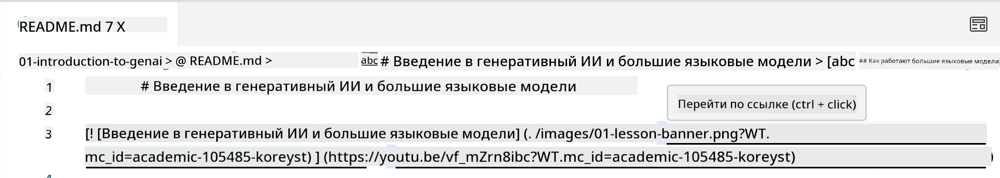
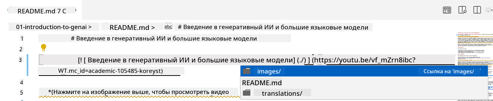
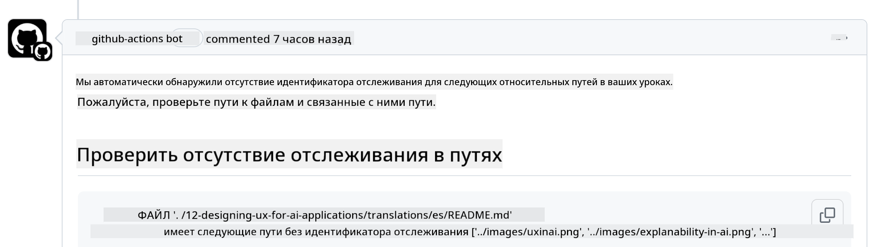
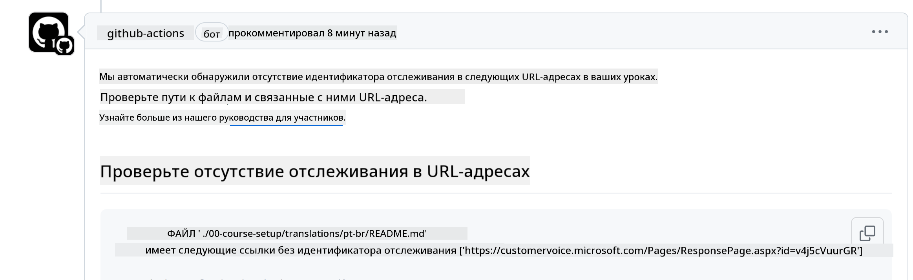
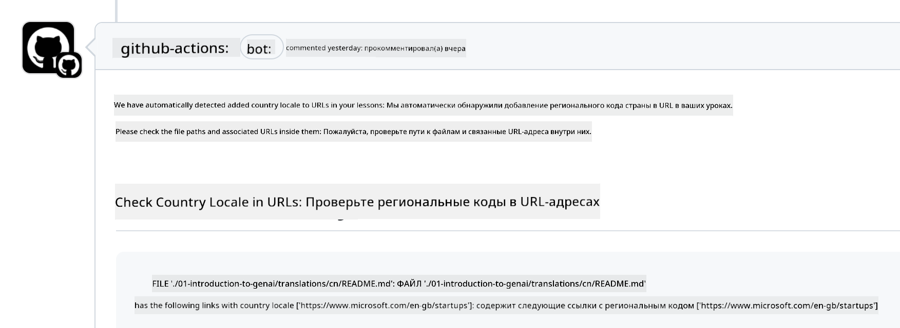

<!--
CO_OP_TRANSLATOR_METADATA:
{
  "original_hash": "57c41f2af71001a2cff9d8eb797cb843",
  "translation_date": "2025-06-25T06:59:56+00:00",
  "source_file": "CONTRIBUTING.md",
  "language_code": "ru"
}
-->
# Участие

Этот проект приветствует участие и предложения. Большинство вкладов требуют, чтобы вы согласились с Лицензионным соглашением участника (CLA), подтверждающим, что у вас есть право, и вы действительно предоставляете нам права на использование вашего вклада. Подробности можно найти на <https://cla.microsoft.com>.

> Важно: при переводе текста в этом репозитории, пожалуйста, убедитесь, что вы не используете машинный перевод. Мы будем проверять переводы через сообщество, поэтому, пожалуйста, добровольно участвуйте в переводах только на те языки, в которых вы хорошо разбираетесь.

Когда вы отправляете запрос на слияние, CLA-бот автоматически определит, нужно ли вам предоставить CLA и соответствующим образом оформить PR (например, добавить метку, комментарий). Просто следуйте инструкциям, предоставленным ботом. Вам нужно будет сделать это только один раз для всех репозиториев, использующих наш CLA.

## Кодекс поведения

Этот проект принял [Кодекс поведения Microsoft для проектов с открытым исходным кодом](https://opensource.microsoft.com/codeofconduct/?WT.mc_id=academic-105485-koreyst).
Для получения дополнительной информации ознакомьтесь с [FAQ по Кодексу поведения](https://opensource.microsoft.com/codeofconduct/faq/?WT.mc_id=academic-105485-koreyst) или свяжитесь с [opencode@microsoft.com](mailto:opencode@microsoft.com) для любых дополнительных вопросов или комментариев.

## Вопрос или проблема?

Пожалуйста, не открывайте проблемы на GitHub для общих вопросов поддержки, так как список GitHub должен использоваться для запросов на добавление функций и сообщений об ошибках. Таким образом, мы можем легче отслеживать реальные проблемы или ошибки в коде и держать общую дискуссию отдельно от самого кода.

## Ошибки, проблемы, баги и вклад

Всякий раз, когда вы отправляете изменения в репозиторий Generative AI for Beginners, пожалуйста, следуйте этим рекомендациям.

* Всегда форкайте репозиторий в свой аккаунт перед внесением изменений
* Не объединяйте несколько изменений в один запрос на слияние. Например, отправьте исправление ошибки и обновления документации, используя отдельные PR
* Если ваш запрос на слияние показывает конфликты слияния, убедитесь, что ваш локальный main обновлен, чтобы быть зеркалом того, что находится в основном репозитории, прежде чем вносить изменения
* Если вы отправляете перевод, пожалуйста, создайте один PR для всех переведенных файлов, так как мы не принимаем частичные переводы контента
* Если вы отправляете исправление опечатки или документации, вы можете объединить изменения в один PR, где это уместно

## Общие рекомендации по написанию

- Убедитесь, что все ваши URL-адреса заключены в квадратные скобки, за которыми следует круглые скобки без лишних пробелов вокруг них или внутри них ``.
- Убедитесь, что любая относительная ссылка (т.е. ссылки на другие файлы и папки в репозитории) начинается с `./`, ссылаясь на файл или папку, расположенную в текущем рабочем каталоге, или `../`, ссылаясь на файл или папку, расположенную в родительском рабочем каталоге.
- Убедитесь, что любая относительная ссылка (т.е. ссылки на другие файлы и папки в репозитории) имеет идентификатор отслеживания (т.е. `?` или `&`, затем `wt.mc_id=` или `WT.mc_id=`) в конце.
- Убедитесь, что любой URL-адрес из следующих доменов _github.com, microsoft.com, visualstudio.com, aka.ms и azure.com_ имеет идентификатор отслеживания (т.е. `?` или `&`, затем `wt.mc_id=` или `WT.mc_id=`) в конце.
- Убедитесь, что ваши ссылки не содержат локали, специфичной для страны (т.е. `/en-us/` или `/en/`).
- Убедитесь, что все изображения хранятся в папке `./images`.
- Убедитесь, что изображения имеют описательные названия, используя английские символы, цифры и дефисы в названии вашего изображения.

## Рабочие процессы GitHub

Когда вы отправляете запрос на слияние, запускаются четыре разных рабочих процесса для проверки предыдущих правил.
Просто следуйте инструкциям, перечисленным здесь, чтобы пройти проверки рабочих процессов.

- [Проверка сломанных относительных путей](../..)
- [Проверка путей на наличие отслеживания](../..)
- [Проверка URL-адресов на наличие отслеживания](../..)
- [Проверка URL-адресов на отсутствие локали](../..)

### Проверка сломанных относительных путей

Этот рабочий процесс гарантирует, что любой относительный путь в ваших файлах работает.
Этот репозиторий развернут на GitHub Pages, поэтому вам нужно быть очень осторожным, когда вы вводите ссылки, связывающие все вместе, чтобы не направить кого-либо не в то место.

Чтобы убедиться, что ваши ссылки работают правильно, просто используйте VS Code для проверки.

Например, когда вы наводите курсор на любую ссылку в ваших файлах, вам будет предложено перейти по ссылке, нажав **ctrl + click**

Если вы нажмете на ссылку и она не работает локально, то, конечно, она вызовет рабочий процесс и не будет работать на GitHub.

Чтобы исправить эту проблему, попробуйте ввести ссылку с помощью VS Code.

Когда вы вводите `./` или `../`, VS Code предложит вам выбрать из доступных вариантов в соответствии с тем, что вы ввели.

Следуйте по пути, нажав на нужный файл или папку, и вы будете уверены, что ваш путь не сломан.

Как только вы добавите правильный относительный путь, сохраните и отправьте свои изменения, рабочий процесс будет запущен снова для проверки ваших изменений.
Если вы пройдете проверку, то все в порядке.

### Проверка путей на наличие отслеживания

Этот рабочий процесс гарантирует, что любой относительный путь имеет отслеживание в нем.
Этот репозиторий развернут на GitHub Pages, поэтому нам нужно отслеживать перемещение между различными файлами и папками.

Чтобы убедиться, что ваши относительные пути имеют отслеживание, просто проверьте наличие следующего текста `?wt.mc_id=` в конце пути.
Если он добавлен к вашим относительным путям, то вы пройдете эту проверку.

Если нет, вы можете получить следующую ошибку.

Чтобы исправить эту проблему, попробуйте открыть путь к файлу, который выделил рабочий процесс, и добавьте идентификатор отслеживания в конец относительных путей.

Как только вы добавите идентификатор отслеживания, сохраните и отправьте свои изменения, рабочий процесс будет запущен снова для проверки ваших изменений.
Если вы пройдете проверку, то все в порядке.

### Проверка URL-адресов на наличие отслеживания

Этот рабочий процесс гарантирует, что любой веб-URL имеет отслеживание в нем.
Этот репозиторий доступен всем, поэтому вам нужно убедиться, что отслеживание доступа позволяет узнать, откуда идет трафик.

Чтобы убедиться, что ваши URL-адреса имеют отслеживание, просто проверьте наличие следующего текста `?wt.mc_id=` в конце URL-адреса.
Если он добавлен к вашим URL-адресам, то вы пройдете эту проверку.

Если нет, вы можете получить следующую ошибку.

Чтобы исправить эту проблему, попробуйте открыть путь к файлу, который выделил рабочий процесс, и добавьте идентификатор отслеживания в конец URL-адресов.

Как только вы добавите идентификатор отслеживания, сохраните и отправьте свои изменения, рабочий процесс будет запущен снова для проверки ваших изменений.
Если вы пройдете проверку, то все в порядке.

### Проверка URL-адресов на отсутствие локали

Этот рабочий процесс гарантирует, что любой веб-URL не содержит локали, специфичной для страны.
Этот репозиторий доступен всем по всему миру, поэтому вам нужно убедиться, что в URL-адресах не включена локаль вашей страны.

Чтобы убедиться, что ваши URL-адреса не содержат локали страны, просто проверьте наличие следующего текста `/en-us/` или `/en/` или любой другой языковой локали в любом месте URL-адреса.
Если он отсутствует в ваших URL-адресах, то вы пройдете эту проверку.

Если нет, вы можете получить следующую ошибку.

Чтобы исправить эту проблему, попробуйте открыть путь к файлу, который выделил рабочий процесс, и удалите локаль страны из URL-адресов.

Как только вы удалите локаль страны, сохраните и отправьте свои изменения, рабочий процесс будет запущен снова для проверки ваших изменений.
Если вы пройдете проверку, то все в порядке.

Поздравляем! Мы свяжемся с вами как можно скорее с отзывом о вашем вкладе.

**Отказ от ответственности**:  
Этот документ был переведен с помощью службы автоматического перевода [Co-op Translator](https://github.com/Azure/co-op-translator). Хотя мы стремимся к точности, пожалуйста, учитывайте, что автоматические переводы могут содержать ошибки или неточности. Оригинальный документ на его родном языке следует считать авторитетным источником. Для критически важной информации рекомендуется профессиональный перевод человеком. Мы не несем ответственности за любые недоразумения или неправильные толкования, возникшие в результате использования этого перевода.