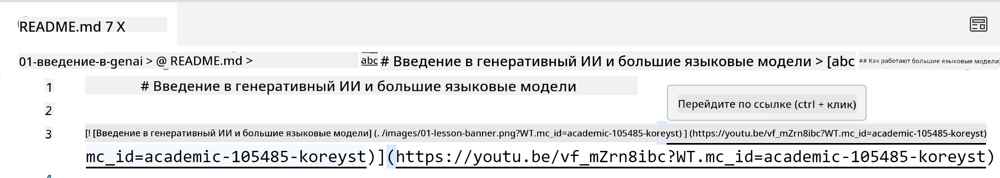
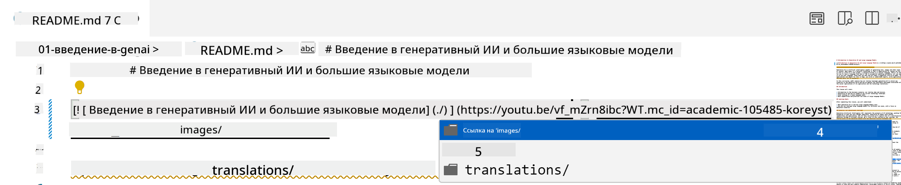
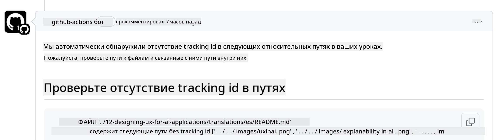
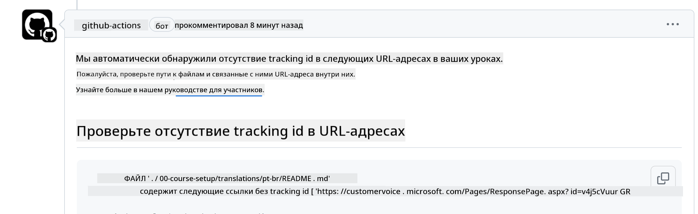
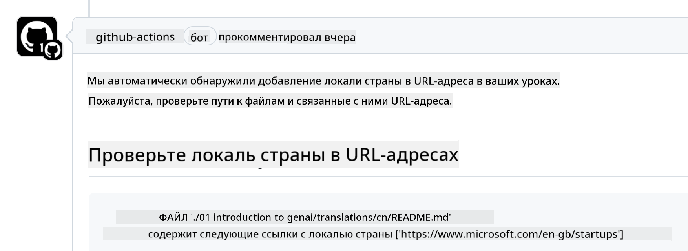

<!--
CO_OP_TRANSLATOR_METADATA:
{
  "original_hash": "57c41f2af71001a2cff9d8eb797cb843",
  "translation_date": "2025-07-09T05:48:15+00:00",
  "source_file": "CONTRIBUTING.md",
  "language_code": "ru"
}
-->
# Вклад в проект

Этот проект приветствует ваши предложения и вклад. Большинство вкладов требуют вашего согласия с Contributor License Agreement (CLA) — соглашением, в котором вы подтверждаете, что имеете право и действительно предоставляете нам права на использование вашего вклада. Подробнее на <https://cla.microsoft.com>.

> Важно: при переводе текста в этом репозитории убедитесь, что вы не используете машинный перевод. Мы проверяем переводы через сообщество, поэтому беритесь за перевод только тех языков, которыми вы владеете.

При отправке pull request, CLA-бот автоматически определит, нужно ли вам предоставить CLA, и отметит PR соответствующим образом (например, ярлыком или комментарием). Просто следуйте инструкциям бота. Это нужно сделать только один раз для всех репозиториев, использующих наш CLA.

## Кодекс поведения

В этом проекте принят [Microsoft Open Source Code of Conduct](https://opensource.microsoft.com/codeofconduct/?WT.mc_id=academic-105485-koreyst).
Для дополнительной информации прочитайте [Часто задаваемые вопросы о Кодексе поведения](https://opensource.microsoft.com/codeofconduct/faq/?WT.mc_id=academic-105485-koreyst) или свяжитесь с нами по адресу [opencode@microsoft.com](mailto:opencode@microsoft.com) для любых вопросов или комментариев.

## Вопросы или проблемы?

Пожалуйста, не создавайте issues на GitHub для общих вопросов поддержки, так как список на GitHub предназначен для запросов новых функций и сообщений об ошибках. Это поможет нам легче отслеживать реальные проблемы и баги в коде и отделять общие обсуждения от технических вопросов.

## Опечатки, проблемы, баги и вклад

При внесении изменений в репозиторий Generative AI for Beginners, пожалуйста, следуйте этим рекомендациям.

* Всегда форкайте репозиторий в свой аккаунт перед внесением изменений
* Не объединяйте несколько изменений в один pull request. Например, исправления багов и обновления документации отправляйте отдельными PR
* Если в вашем pull request есть конфликты слияния, обновите локальную ветку main, чтобы она соответствовала основной ветке репозитория, перед внесением изменений
* Если вы отправляете перевод, создайте один PR для всех переведённых файлов, так как частичные переводы не принимаются
* Если вы исправляете опечатку или документацию, можно объединить изменения в один PR, если это уместно

## Общие рекомендации по написанию

- Убедитесь, что все ваши URL заключены в квадратные скобки, за которыми сразу следуют круглые скобки без лишних пробелов ``.
- Убедитесь, что все относительные ссылки (т.е. ссылки на другие файлы и папки в репозитории) начинаются с `./` (файл или папка в текущей директории) или `../` (файл или папка в родительской директории).
- Убедитесь, что все относительные ссылки содержат идентификатор отслеживания (например, `?` или `&` с `wt.mc_id=` или `WT.mc_id=`) в конце.
- Убедитесь, что все URL с доменов _github.com, microsoft.com, visualstudio.com, aka.ms и azure.com_ содержат идентификатор отслеживания (например, `?` или `&` с `wt.mc_id=` или `WT.mc_id=`) в конце.
- Убедитесь, что в ссылках нет указания локали страны (например, `/en-us/` или `/en/`).
- Убедитесь, что все изображения хранятся в папке `./images`.
- Убедитесь, что имена изображений описательные и содержат английские буквы, цифры и дефисы.

## GitHub Workflows

При отправке pull request запускаются четыре разных workflow для проверки соблюдения вышеуказанных правил.
Просто следуйте инструкциям ниже, чтобы пройти проверки.

- [Проверка относительных путей](../..)
- [Проверка наличия отслеживания в путях](../..)
- [Проверка наличия отслеживания в URL](../..)
- [Проверка отсутствия локали в URL](../..)

### Проверка относительных путей

Этот workflow проверяет, что все относительные пути в ваших файлах работают корректно.
Репозиторий размещён на GitHub Pages, поэтому важно, чтобы ссылки не вели в неправильные места.

Чтобы убедиться, что ссылки работают, используйте VS Code.

Например, при наведении на ссылку в файле вы увидите подсказку перейти по ней, нажав **ctrl + клик**.

Если ссылка не работает локально, workflow тоже её не пропустит.

Чтобы исправить, вводите ссылку с помощью VS Code.

При вводе `./` или `../` VS Code предложит варианты файлов и папок.

Выберите нужный файл или папку, чтобы быть уверенным, что путь корректен.

После добавления правильного пути сохраните и отправьте изменения — workflow проверит их снова.
Если проверка пройдена, можно продолжать.

### Проверка наличия отслеживания в путях

Этот workflow проверяет, что все относительные пути содержат идентификатор отслеживания.
Репозиторий размещён на GitHub Pages, и нам важно отслеживать переходы между файлами и папками.

Чтобы проверить, что в относительных путях есть отслеживание, убедитесь, что в конце пути есть `?wt.mc_id=`.

Если его нет, вы получите ошибку.

Чтобы исправить, откройте файл, указанный в ошибке, и добавьте идентификатор отслеживания в конец относительных путей.

После сохранения и отправки изменений workflow проверит их снова.
Если проверка пройдена, можно продолжать.

### Проверка наличия отслеживания в URL

Этот workflow проверяет, что все веб-URL содержат идентификатор отслеживания.
Репозиторий доступен всем, поэтому важно отслеживать источник трафика.

Чтобы проверить, что в URL есть отслеживание, убедитесь, что в конце URL есть `?wt.mc_id=`.

Если его нет, вы получите ошибку.

Чтобы исправить, откройте файл, указанный в ошибке, и добавьте идентификатор отслеживания в конец URL.

После сохранения и отправки изменений workflow проверит их снова.
Если проверка пройдена, можно продолжать.

### Проверка отсутствия локали в URL

Этот workflow проверяет, что в веб-URL нет указания локали страны.
Репозиторий доступен всем по всему миру, поэтому важно не включать локаль вашей страны в URL.

Чтобы проверить, что в URL нет локали, убедитесь, что в URL отсутствуют `/en-us/`, `/en/` или другие языковые локали.

Если локаль есть, вы получите ошибку.

Чтобы исправить, откройте файл, указанный в ошибке, и удалите локаль из URL.

После сохранения и отправки изменений workflow проверит их снова.
Если проверка пройдена, можно продолжать.

Поздравляем! Мы свяжемся с вами как можно скорее с отзывами о вашем вкладе.

**Отказ от ответственности**:  
Этот документ был переведен с помощью сервиса автоматического перевода [Co-op Translator](https://github.com/Azure/co-op-translator). Несмотря на наши усилия по обеспечению точности, просим учитывать, что автоматический перевод может содержать ошибки или неточности. Оригинальный документ на его исходном языке следует считать авторитетным источником. Для получения критически важной информации рекомендуется обращаться к профессиональному человеческому переводу. Мы не несем ответственности за любые недоразумения или неправильные толкования, возникшие в результате использования данного перевода.