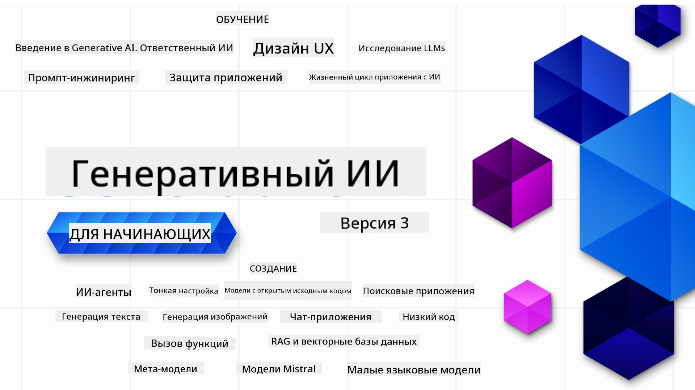

<!--
CO_OP_TRANSLATOR_METADATA:
{
  "original_hash": "c2ee25895ebbfa1a52868bb6eab686fc",
  "translation_date": "2025-05-19T11:28:44+00:00",
  "source_file": "README.md",
  "language_code": "ru"
}
-->

### 21 урок, объясняющий все, что вам нужно знать, чтобы начать создавать приложения на основе генеративного ИИ

### 🌐 Поддержка нескольких языков

#### Поддерживается через GitHub Action (автоматизировано и всегда актуально)
[Французский](../fr/README.md) | [Испанский](../es/README.md) | [Немецкий](../de/README.md) | [Русский](./README.md) | [Арабский](../ar/README.md) | [Персидский (Фарси)](../fa/README.md) | [Урду](../ur/README.md) | [Китайский (Упрощенный)](../zh/README.md) | [Китайский (Традиционный, Макао)](../mo/README.md) | [Китайский (Традиционный, Гонконг)](../hk/README.md) | [Китайский (Традиционный, Тайвань)](../tw/README.md) | [Японский](../ja/README.md) | [Корейский](../ko/README.md) | [Хинди](../hi/README.md) | [Бенгальский](../bn/README.md) | [Маратхи](../mr/README.md) | [Непальский](../ne/README.md) | [Панджаби (Гурмукхи)](../pa/README.md) | [Португальский (Португалия)](../pt/README.md) | [Португальский (Бразилия)](../br/README.md) | [Итальянский](../it/README.md) | [Польский](../pl/README.md) | [Турецкий](../tr/README.md) | [Греческий](../el/README.md) | [Тайский](../th/README.md) | [Шведский](../sv/README.md) | [Датский](../da/README.md) | [Норвежский](../no/README.md) | [Финский](../fi/README.md) | [Голландский](../nl/README.md) | [Иврит](../he/README.md) | [Вьетнамский](../vi/README.md) | [Индонезийский](../id/README.md) | [Малайский](../ms/README.md) | [Тагальский (Филиппинский)](../tl/README.md) | [Суахили](../sw/README.md) | [Венгерский](../hu/README.md) | [Чешский](../cs/README.md) | [Словацкий](../sk/README.md) | [Румынский](../ro/README.md) | [Болгарский](../bg/README.md) | [Сербский (Кириллица)](../sr/README.md) | [Хорватский](../hr/README.md) | [Словенский](../sl/README.md)
# Генеративный ИИ для начинающих (Версия 3) - Курс

Изучите основы создания приложений с Генеративным ИИ с помощью нашего всестороннего курса из 21 урока от Microsoft Cloud Advocates.

## 🌱 Начало работы

Этот курс состоит из 21 урока. Каждый урок охватывает свою тему, поэтому начинайте с любого!

Уроки обозначены либо как "Учебные", объясняющие концепцию Генеративного ИИ, либо как "Практические", которые объясняют концепцию и примеры кода как на **Python**, так и на **TypeScript**, если это возможно.

Для разработчиков .NET ознакомьтесь с [Генеративным ИИ для начинающих (.NET Edition)](https://github.com/microsoft/Generative-AI-for-beginners-dotnet?WT.mc_id=academic-105485-koreyst)!

Каждый урок также включает раздел "Продолжайте учиться" с дополнительными учебными материалами.

## Что вам нужно
### Чтобы запустить код этого курса, вы можете использовать:
- [Azure OpenAI Service](https://aka.ms/genai-beginners/azure-open-ai?WT.mc_id=academic-105485-koreyst) - **Уроки:** "aoai-assignment"
- [GitHub Marketplace Model Catalog](https://aka.ms/genai-beginners/gh-models?WT.mc_id=academic-105485-koreyst) - **Уроки:** "githubmodels"
- [OpenAI API](https://aka.ms/genai-beginners/open-ai?WT.mc_id=academic-105485-koreyst) - **Уроки:** "oai-assignment"

- Базовые знания Python или TypeScript будут полезны - \*Для абсолютных новичков ознакомьтесь с этими курсами [Python](https://aka.ms/genai-beginners/python?WT.mc_id=academic-105485-koreyst) и [TypeScript](https://aka.ms/genai-beginners/typescript?WT.mc_id=academic-105485-koreyst)
- Аккаунт GitHub, чтобы [форкнуть этот репозиторий](https://aka.ms/genai-beginners/github?WT.mc_id=academic-105485-koreyst) в свой аккаунт GitHub

Мы создали урок **[Course Setup](./00-course-setup/README.md?WT.mc_id=academic-105485-koreyst)**, чтобы помочь вам с настройкой вашей среды разработки.

Не забудьте [добавить звездочку (🌟) этому репозиторию](https://docs.github.com/en/get-started/exploring-projects-on-github/saving-repositories-with-stars?WT.mc_id=academic-105485-koreyst), чтобы легче найти его позже.

## 🧠 Готовы к развертыванию?

Если вы ищете более сложные примеры кода, ознакомьтесь с нашей [коллекцией примеров кода Генеративного ИИ](https://aka.ms/genai-beg-code?WT.mc_id=academic-105485-koreyst) как на **Python**, так и на **TypeScript**.

## 🗣️ Познакомьтесь с другими учащимися, получите поддержку

Присоединяйтесь к нашему [официальному серверу Discord Azure AI Foundry](https://aka.ms/genai-discord?WT.mc_id=academic-105485-koreyst), чтобы встретиться и пообщаться с другими учащимися, проходящими этот курс, и получить поддержку.

Задавайте вопросы или делитесь отзывами о продукте на нашем [форуме разработчиков Azure AI Foundry](https://aka.ms/azureaifoundry/forum) на Github.

## 🚀 Строите стартап?

Подпишитесь на [Microsoft для стартапов Founders Hub](https://aka.ms/genai-foundershub?WT.mc_id=academic-105485-koreyst), чтобы получить **бесплатные кредиты OpenAI** и до **$150k на кредиты Azure для доступа к моделям OpenAI через Azure OpenAI Services**.

## 🙏 Хотите помочь?

У вас есть предложения или вы нашли орфографические или кодовые ошибки? [Создайте проблему](https://github.com/microsoft/generative-ai-for-beginners/issues?WT.mc_id=academic-105485-koreyst) или [создайте pull request](https://github.com/microsoft/generative-ai-for-beginners/pulls?WT.mc_id=academic-105485-koreyst)

## 📂 Каждый урок включает:

- Краткое видео введение в тему
- Письменный урок, расположенный в README
- Примеры кода на Python и TypeScript, поддерживающие Azure OpenAI и OpenAI API
- Ссылки на дополнительные ресурсы для продолжения обучения

## 🗃️ Уроки

| #   | **Ссылка на урок**                                                                                                                              | **Описание**                                                                                 | **Видео**                                                                   | **Дополнительное обучение**                                                             |
| --- | -------------------------------------------------------------------------------------------------------------------------------------------- | ----------------------------------------------------------------------------------------------- | --------------------------------------------------------------------------- | ------------------------------------------------------------------------------ |
| 00  | [Course Setup](./00-course-setup/README.md?WT.mc_id=academic-105485-koreyst)                                                                 | **Учебный:** Как настроить вашу среду разработки                                            | Видео скоро появится                                                                 | [Узнать больше](https://aka.ms/genai-collection?WT.mc_id=academic-105485-koreyst) |
| 01  | [Введение в Генеративный ИИ и LLMs](./01-introduction-to-genai/README.md?WT.mc_id=academic-105485-koreyst)                              | **Учебный:** Понимание, что такое Генеративный ИИ и как работают большие языковые модели (LLMs).       | [Видео](https://aka.ms/gen-ai-lesson-1-gh?WT.mc_id=academic-105485-koreyst) | [Узнать больше](https://aka.ms/genai-collection?WT.mc_id=academic-105485-koreyst) |
| 02  | [Исследование и сравнение различных LLMs](./02-exploring-and-comparing-different-llms/README.md?WT.mc_id=academic-105485-koreyst)             | **Учебный:** Как выбрать подходящую модель для вашего случая                                      | [Видео](https://aka.ms/gen-ai-lesson2-gh?WT.mc_id=academic-105485-koreyst)  | [Узнать больше](https://aka.ms/genai-collection?WT.mc_id=academic-105485-koreyst) |
| 03  | [Использование Генеративного ИИ ответственно](./03-using-generative-ai-responsibly/README.md?WT.mc_id=academic-105485-koreyst)                           | **Учебный:** Как создавать приложения Генеративного ИИ ответственно                                  | [Видео](https://aka.ms/gen-ai-lesson3-gh?WT.mc_id=academic-105485-koreyst)  | [Узнать больше](https://aka.ms/genai-collection?WT.mc_id=academic-105485-koreyst) |
| 04  | [Понимание основ инженерии запросов](./04-prompt-engineering-fundamentals/README.md?WT.mc_id=academic-105485-koreyst)             | **Учебный:** Практические лучшие практики инженерии запросов                                           | [Видео](https://aka.ms/gen-ai-lesson4-gh?WT.mc_id=academic-105485-koreyst)  | [Узнать больше](https://aka.ms/genai-collection?WT.mc_id=academic-105485-koreyst) |
| 05  | [Создание сложных запросов](./05-advanced-prompts/README.md?WT.mc_id=academic-105485-koreyst)                                                | **Изучите:** Как применять методы разработки запросов для улучшения их результата. | [Видео](https://aka.ms/gen-ai-lesson5-gh?WT.mc_id=academic-105485-koreyst)  | [Узнать больше](https://aka.ms/genai-collection?WT.mc_id=academic-105485-koreyst) |
| 06  | [Создание приложений для генерации текста](./06-text-generation-apps/README.md?WT.mc_id=academic-105485-koreyst)                                | **Создайте:** Приложение для генерации текста с использованием Azure OpenAI / OpenAI API                                | [Видео](https://aka.ms/gen-ai-lesson6-gh?WT.mc_id=academic-105485-koreyst)  | [Узнать больше](https://aka.ms/genai-collection?WT.mc_id=academic-105485-koreyst) |
| 07  | [Создание чат-приложений](./07-building-chat-applications/README.md?WT.mc_id=academic-105485-koreyst)                                     | **Создайте:** Техники эффективного создания и интеграции чат-приложений.               | [Видео](https://aka.ms/gen-ai-lessons7-gh?WT.mc_id=academic-105485-koreyst) | [Узнать больше](https://aka.ms/genai-collection?WT.mc_id=academic-105485-koreyst) |
| 08  | [Создание поисковых приложений с векторными базами данных](./08-building-search-applications/README.md?WT.mc_id=academic-105485-koreyst)                        | **Создайте:** Приложение для поиска, использующее Embeddings для поиска данных.                        | [Видео](https://aka.ms/gen-ai-lesson8-gh?WT.mc_id=academic-105485-koreyst)  | [Узнать больше](https://aka.ms/genai-collection?WT.mc_id=academic-105485-koreyst) |
| 09  | [Создание приложений для генерации изображений](./09-building-image-applications/README.md?WT.mc_id=academic-105485-koreyst)                        | **Создайте:** Приложение для генерации изображений                                                       | [Видео](https://aka.ms/gen-ai-lesson9-gh?WT.mc_id=academic-105485-koreyst)  | [Узнать больше](https://aka.ms/genai-collection?WT.mc_id=academic-105485-koreyst) |
| 10  | [Создание AI-приложений с низким кодом](./10-building-low-code-ai-applications/README.md?WT.mc_id=academic-105485-koreyst)                       | **Создайте:** Приложение Generative AI с использованием инструментов низкого кода                                     | [Видео](https://aka.ms/gen-ai-lesson10-gh?WT.mc_id=academic-105485-koreyst) | [Узнать больше](https://aka.ms/genai-collection?WT.mc_id=academic-105485-koreyst) |
| 11  | [Интеграция внешних приложений с вызовом функций](./11-integrating-with-function-calling/README.md?WT.mc_id=academic-105485-koreyst) | **Создайте:** Что такое вызов функций и его применение для приложений                          | [Видео](https://aka.ms/gen-ai-lesson11-gh?WT.mc_id=academic-105485-koreyst) | [Узнать больше](https://aka.ms/genai-collection?WT.mc_id=academic-105485-koreyst) |
| 12  | [Проектирование UX для AI-приложений](./12-designing-ux-for-ai-applications/README.md?WT.mc_id=academic-105485-koreyst)                         | **Изучите:** Как применять принципы дизайна UX при разработке приложений Generative AI         | [Видео](https://aka.ms/gen-ai-lesson12-gh?WT.mc_id=academic-105485-koreyst) | [Узнать больше](https://aka.ms/genai-collection?WT.mc_id=academic-105485-koreyst) |
| 13  | [Защита ваших приложений Generative AI](./13-securing-ai-applications/README.md?WT.mc_id=academic-105485-koreyst)                         | **Изучите:** Угрозы и риски для AI-систем и методы их защиты.             | [Видео](https://aka.ms/gen-ai-lesson13-gh?WT.mc_id=academic-105485-koreyst) | [Узнать больше](https://aka.ms/genai-collection?WT.mc_id=academic-105485-koreyst) |
| 14  | [Жизненный цикл приложения Generative AI](./14-the-generative-ai-application-lifecycle/README.md?WT.mc_id=academic-105485-koreyst)           | **Изучите:** Инструменты и метрики для управления жизненным циклом LLM и LLMOps                         | [Видео](https://aka.ms/gen-ai-lesson14-gh?WT.mc_id=academic-105485-koreyst) | [Узнать больше](https://aka.ms/genai-collection?WT.mc_id=academic-105485-koreyst) |
| 15  | [Извлечение с дополнением генерации (RAG) и векторные базы данных](./15-rag-and-vector-databases/README.md?WT.mc_id=academic-105485-koreyst) | **Создание:** Приложение с использованием фреймворка RAG для извлечения эмбеддингов из векторных баз данных | [Видео](https://aka.ms/gen-ai-lesson15-gh?WT.mc_id=academic-105485-koreyst) | [Узнать больше](https://aka.ms/genai-collection?WT.mc_id=academic-105485-koreyst) |
| 16  | [Открытые модели и Hugging Face](./16-open-source-models/README.md?WT.mc_id=academic-105485-koreyst) | **Создание:** Приложение с использованием открытых моделей, доступных на Hugging Face | [Видео](https://aka.ms/gen-ai-lesson16-gh?WT.mc_id=academic-105485-koreyst) | [Узнать больше](https://aka.ms/genai-collection?WT.mc_id=academic-105485-koreyst) |
| 17  | [AI агенты](./17-ai-agents/README.md?WT.mc_id=academic-105485-koreyst) | **Создание:** Приложение с использованием фреймворка AI агента | [Видео](https://aka.ms/gen-ai-lesson17-gh?WT.mc_id=academic-105485-koreyst) | [Узнать больше](https://aka.ms/genai-collection?WT.mc_id=academic-105485-koreyst) |
| 18  | [Тонкая настройка LLMs](./18-fine-tuning/README.md?WT.mc_id=academic-105485-koreyst) | **Изучение:** Что, почему и как тонкой настройки LLMs | [Видео](https://aka.ms/gen-ai-lesson18-gh?WT.mc_id=academic-105485-koreyst) | [Узнать больше](https://aka.ms/genai-collection?WT.mc_id=academic-105485-koreyst) |
| 19  | [Создание с SLMs](./19-slm/README.md?WT.mc_id=academic-105485-koreyst) | **Изучение:** Преимущества создания с использованием малых языковых моделей | Видео скоро | [Узнать больше](https://aka.ms/genai-collection?WT.mc_id=academic-105485-koreyst) |
| 20  | [Создание с моделями Mistral](./20-mistral/README.md?WT.mc_id=academic-105485-koreyst) | **Изучение:** Особенности и различия моделей семейства Mistral | Видео скоро | [Узнать больше](https://aka.ms/genai-collection?WT.mc_id=academic-105485-koreyst) |
| 21  | [Создание с моделями Meta](./21-meta/README.md?WT.mc_id=academic-105485-koreyst) | **Изучение:** Особенности и различия моделей семейства Meta | Видео скоро | [Узнать больше](https://aka.ms/genai-collection?WT.mc_id=academic-105485-koreyst) |

### 🌟 Особая благодарность

Особая благодарность [**Джону Азизу**](https://www.linkedin.com/in/john0isaac/) за создание всех GitHub Actions и рабочих процессов

[**Бернхарду Меркле**](https://www.linkedin.com/in/bernhard-merkle-738b73/) за ключевые вклад в каждое занятие для улучшения опыта обучения и работы с кодом.

## 🎒 Другие курсы

Наша команда создает и другие курсы! Ознакомьтесь:

- [**НОВЫЙ** AI агенты для начинающих](https://github.com/microsoft/ai-agents-for-beginners?WT.mc_id=academic-105485-koreyst)
- [**НОВЫЙ** Генеративный AI для начинающих с использованием .NET](https://github.com/microsoft/Generative-AI-for-beginners-dotnet?WT.mc_id=academic-105485-koreyst)
- [**НОВЫЙ** Генеративный AI для начинающих с использованием JavaScript](https://aka.ms/genai-js-course?WT.mc_id=academic-105485-koreyst)
- [ML для начинающих](https://aka.ms/ml-beginners?WT.mc_id=academic-105485-koreyst)
- [Наука о данных для начинающих](https://aka.ms/datascience-beginners?WT.mc_id=academic-105485-koreyst)
- [AI для начинающих](https://aka.ms/ai-beginners?WT.mc_id=academic-105485-koreyst)
- [Кибербезопасность для начинающих](https://github.com/microsoft/Security-101??WT.mc_id=academic-96948-sayoung)
- [Веб-разработка для начинающих](https://aka.ms/webdev-beginners?WT.mc_id=academic-105485-koreyst)
- [IoT для начинающих](https://aka.ms/iot-beginners?WT.mc_id=academic-105485-koreyst)
- [Разработка XR для начинающих](https://github.com/microsoft/xr-development-for-beginners?WT.mc_id=academic-105485-koreyst)
- [Освоение GitHub Copilot для парного программирования с ИИ](https://aka.ms/GitHubCopilotAI?WT.mc_id=academic-105485-koreyst)
- [Освоение GitHub Copilot для разработчиков C#/.NET](https://github.com/microsoft/mastering-github-copilot-for-dotnet-csharp-developers?WT.mc_id=academic-105485-koreyst)
- [Выберите свое собственное приключение с Copilot](https://github.com/microsoft/CopilotAdventures?WT.mc_id=academic-105485-koreyst)

**Отказ от ответственности**:  
Этот документ был переведен с использованием сервиса автоматического перевода [Co-op Translator](https://github.com/Azure/co-op-translator). Хотя мы стремимся к точности, пожалуйста, имейте в виду, что автоматические переводы могут содержать ошибки или неточности. Оригинальный документ на родном языке следует считать авторитетным источником. Для критически важной информации рекомендуется профессиональный перевод человеком. Мы не несем ответственности за любые недопонимания или неверные толкования, возникающие в результате использования этого перевода.