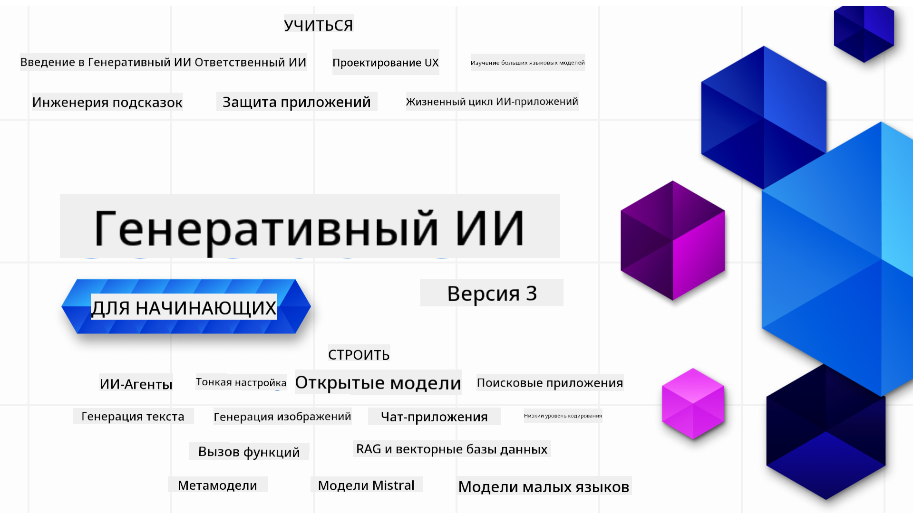

<!--
CO_OP_TRANSLATOR_METADATA:
{
  "original_hash": "6e3f4c8a4f323b8eab1cf11ded304b0f",
  "translation_date": "2025-06-25T07:29:51+00:00",
  "source_file": "README.md",
  "language_code": "ru"
}
-->

### 21 урок, которые научат всему, что нужно знать для создания приложений с генеративным ИИ

### 🌐 Поддержка нескольких языков

#### Поддерживается через GitHub Action (Автоматически и всегда актуально)

# Генеративный ИИ для начинающих (Версия 3) - Курс

Изучите основы создания приложений Генеративного ИИ с помощью нашего комплексного курса из 21 урока от Microsoft Cloud Advocates.

## 🌱 Начало работы

Этот курс состоит из 21 урока. Каждый урок охватывает свою собственную тему, так что начинайте с любого!

Уроки помечены либо как уроки "Изучение", объясняющие концепцию Генеративного ИИ, либо как уроки "Создание", которые объясняют концепцию и содержат примеры кода на **Python** и **TypeScript**, если это возможно.

Для разработчиков .NET ознакомьтесь с [Генеративный ИИ для начинающих (.NET Edition)](https://github.com/microsoft/Generative-AI-for-beginners-dotnet?WT.mc_id=academic-105485-koreyst)!

Каждый урок также включает раздел "Продолжайте изучать" с дополнительными инструментами для обучения.

## Что вам нужно
### Чтобы запустить код этого курса, вы можете использовать либо:
 - [Сервис Azure OpenAI](https://aka.ms/genai-beginners/azure-open-ai?WT.mc_id=academic-105485-koreyst) - **Уроки:** "aoai-assignment"
 - [Каталог моделей GitHub Marketplace](https://aka.ms/genai-beginners/gh-models?WT.mc_id=academic-105485-koreyst) - **Уроки:** "githubmodels"
 - [API OpenAI](https://aka.ms/genai-beginners/open-ai?WT.mc_id=academic-105485-koreyst) - **Уроки:** "oai-assignment"

- Базовые знания Python или TypeScript будут полезны - \*Для абсолютных новичков ознакомьтесь с этими курсами [Python](https://aka.ms/genai-beginners/python?WT.mc_id=academic-105485-koreyst) и [TypeScript](https://aka.ms/genai-beginners/typescript?WT.mc_id=academic-105485-koreyst)
- Аккаунт GitHub, чтобы [сделать форк этого репозитория](https://aka.ms/genai-beginners/github?WT.mc_id=academic-105485-koreyst) на ваш собственный аккаунт GitHub

Мы создали урок **[Настройка курса](./00-course-setup/README.md?WT.mc_id=academic-105485-koreyst)**, чтобы помочь вам с настройкой вашей среды разработки.

Не забудьте [поставить звезду (🌟) этому репозиторию](https://docs.github.com/en/get-started/exploring-projects-on-github/saving-repositories-with-stars?WT.mc_id=academic-105485-koreyst), чтобы легче найти его позже.

## 🧠 Готовы к развертыванию?

Если вы ищете более сложные примеры кода, ознакомьтесь с нашей [коллекцией примеров кода Генеративного ИИ](https://aka.ms/genai-beg-code?WT.mc_id=academic-105485-koreyst) на **Python** и **TypeScript**.

## 🗣️ Познакомьтесь с другими учениками, получите поддержку

Присоединяйтесь к нашему [официальному серверу Discord Azure AI Foundry](https://aka.ms/genai-discord?WT.mc_id=academic-105485-koreyst), чтобы познакомиться и установить контакты с другими учащимися, проходящими этот курс, и получить поддержку.

Задавайте вопросы или делитесь отзывами о продукте на нашем [форуме разработчиков Azure AI Foundry](https://aka.ms/azureaifoundry/forum) на Github.

## 🚀 Создаете стартап?

Зарегистрируйтесь в [Microsoft для стартапов Founders Hub](https://aka.ms/genai-foundershub?WT.mc_id=academic-105485-koreyst), чтобы получить **бесплатные кредиты OpenAI** и до **$150k на кредиты Azure для доступа к моделям OpenAI через Azure OpenAI Services**.

## 🙏 Хотите помочь?

У вас есть предложения или вы нашли орфографические или кодовые ошибки? [Создайте вопрос](https://github.com/microsoft/generative-ai-for-beginners/issues?WT.mc_id=academic-105485-koreyst) или [Создайте запрос на изменение](https://github.com/microsoft/generative-ai-for-beginners/pulls?WT.mc_id=academic-105485-koreyst)

## 📂 Каждый урок включает:

- Краткое видео-введение в тему
- Письменный урок, расположенный в README
- Примеры кода на Python и TypeScript, поддерживающие Azure OpenAI и OpenAI API
- Ссылки на дополнительные ресурсы для продолжения обучения

## 🗃️ Уроки

| #   | **Ссылка на урок**                                                                                                                              | **Описание**                                                                                 | **Видео**                                                                   | **Дополнительное обучение**                                                             |
| --- | -------------------------------------------------------------------------------------------------------------------------------------------- | ----------------------------------------------------------------------------------------------- | --------------------------------------------------------------------------- | ------------------------------------------------------------------------------ |
| 00  | [Настройка курса](./00-course-setup/README.md?WT.mc_id=academic-105485-koreyst)                                                                 | **Изучение:** Как настроить вашу среду разработки                                            | Видео скоро появится                                                                 | [Узнать больше](https://aka.ms/genai-collection?WT.mc_id=academic-105485-koreyst) |
| 01  | [Введение в Генеративный ИИ и LLM](./01-introduction-to-genai/README.md?WT.mc_id=academic-105485-koreyst)                              | **Изучение:** Понимание, что такое Генеративный ИИ и как работают большие языковые модели (LLM).       | [Видео](https://aka.ms/gen-ai-lesson-1-gh?WT.mc_id=academic-105485-koreyst) | [Узнать больше](https://aka.ms/genai-collection?WT.mc_id=academic-105485-koreyst) |
| 02  | [Изучение и сравнение различных LLM](./02-exploring-and-comparing-different-llms/README.md?WT.mc_id=academic-105485-koreyst)             | **Изучение:** Как выбрать подходящую модель для вашего использования                                      | [Видео](https://aka.ms/gen-ai-lesson2-gh?WT.mc_id=academic-105485-koreyst)  | [Узнать больше](https://aka.ms/genai-collection?WT.mc_id=academic-105485-koreyst) |
| 03  | [Ответственное использование Генеративного ИИ](./03-using-generative-ai-responsibly/README.md?WT.mc_id=academic-105485-koreyst)                           | **Изучение:** Как ответственно создавать приложения Генеративного ИИ                                  | [Видео](https://aka.ms/gen-ai-lesson3-gh?WT.mc_id=academic-105485-koreyst)  | [Узнать больше](https://aka.ms/genai-collection?WT.mc_id=academic-105485-koreyst) |
| 04  | [Понимание основ инженерии запросов](./04-prompt-engineering-fundamentals/README.md?WT.mc_id=academic-105485-koreyst)             | **Изучение:** Практические лучшие практики инженерии запросов                                           | [Видео](https://aka.ms/gen-ai-lesson4-gh?WT.mc_id=academic-105485-koreyst)  | [Узнать больше](https://aka.ms/genai-collection?WT.mc_id=academic-105485-koreyst) |
| 05  | [Создание продвинутых подсказок](./05-advanced-prompts/README.md?WT.mc_id=academic-105485-koreyst)                                                | **Узнайте:** Как применять методы создания подсказок, которые улучшают результаты ваших подсказок. | [Видео](https://aka.ms/gen-ai-lesson5-gh?WT.mc_id=academic-105485-koreyst)  | [Узнать больше](https://aka.ms/genai-collection?WT.mc_id=academic-105485-koreyst) |
| 06  | [Создание приложений для генерации текста](./06-text-generation-apps/README.md?WT.mc_id=academic-105485-koreyst)                                | **Создайте:** Приложение для генерации текста с использованием Azure OpenAI / OpenAI API                                | [Видео](https://aka.ms/gen-ai-lesson6-gh?WT.mc_id=academic-105485-koreyst)  | [Узнать больше](https://aka.ms/genai-collection?WT.mc_id=academic-105485-koreyst) |
| 07  | [Создание чат-приложений](./07-building-chat-applications/README.md?WT.mc_id=academic-105485-koreyst)                                     | **Создайте:** Техники для эффективного создания и интеграции чат-приложений.               | [Видео](https://aka.ms/gen-ai-lessons7-gh?WT.mc_id=academic-105485-koreyst) | [Узнать больше](https://aka.ms/genai-collection?WT.mc_id=academic-105485-koreyst) |
| 08  | [Создание поисковых приложений с векторными базами данных](./08-building-search-applications/README.md?WT.mc_id=academic-105485-koreyst)                        | **Создайте:** Поисковое приложение, которое использует эмбеддинги для поиска данных.                        | [Видео](https://aka.ms/gen-ai-lesson8-gh?WT.mc_id=academic-105485-koreyst)  | [Узнать больше](https://aka.ms/genai-collection?WT.mc_id=academic-105485-koreyst) |
| 09  | [Создание приложений для генерации изображений](./09-building-image-applications/README.md?WT.mc_id=academic-105485-koreyst)                        | **Создайте:** Приложение для генерации изображений                                                       | [Видео](https://aka.ms/gen-ai-lesson9-gh?WT.mc_id=academic-105485-koreyst)  | [Узнать больше](https://aka.ms/genai-collection?WT.mc_id=academic-105485-koreyst) |
| 10  | [Создание приложений с низким кодом на базе ИИ](./10-building-low-code-ai-applications/README.md?WT.mc_id=academic-105485-koreyst)                       | **Создайте:** Приложение с генеративным ИИ, используя инструменты с низким кодом                                     | [Видео](https://aka.ms/gen-ai-lesson10-gh?WT.mc_id=academic-105485-koreyst) | [Узнать больше](https://aka.ms/genai-collection?WT.mc_id=academic-105485-koreyst) |
| 11  | [Интеграция внешних приложений с вызовом функций](./11-integrating-with-function-calling/README.md?WT.mc_id=academic-105485-koreyst) | **Создайте:** Что такое вызов функций и его применение в приложениях                          | [Видео](https://aka.ms/gen-ai-lesson11-gh?WT.mc_id=academic-105485-koreyst) | [Узнать больше](https://aka.ms/genai-collection?WT.mc_id=academic-105485-koreyst) |
| 12  | [Проектирование UX для приложений на базе ИИ](./12-designing-ux-for-ai-applications/README.md?WT.mc_id=academic-105485-koreyst)                         | **Узнайте:** Как применять принципы проектирования UX при разработке приложений с генеративным ИИ         | [Видео](https://aka.ms/gen-ai-lesson12-gh?WT.mc_id=academic-105485-koreyst) | [Узнать больше](https://aka.ms/genai-collection?WT.mc_id=academic-105485-koreyst) |
| 13  | [Обеспечение безопасности ваших приложений с генеративным ИИ](./13-securing-ai-applications/README.md?WT.mc_id=academic-105485-koreyst)                         | **Узнайте:** Угрозы и риски для ИИ-систем и методы их защиты.             | [Видео](https://aka.ms/gen-ai-lesson13-gh?WT.mc_id=academic-105485-koreyst) | [Узнать больше](https://aka.ms/genai-collection?WT.mc_id=academic-105485-koreyst) |
| 14  | [Жизненный цикл приложения с генеративным ИИ](./14-the-generative-ai-application-lifecycle/README.md?WT.mc_id=academic-105485-koreyst)           | **Узнайте:** Инструменты и метрики для управления жизненным циклом LLM и LLMOps                         | [Видео](https://aka.ms/gen-ai-lesson14-gh?WT.mc_id=academic-105485-koreyst) | [Узнать больше](https://aka.ms/genai-collection?WT.mc_id=academic-105485-koreyst) |
| 15  | [Получение с помощью генерации (RAG) и векторные базы данных](./15-rag-and-vector-databases/README.md?WT.mc_id=academic-105485-koreyst)        | **Создать:** Приложение с использованием RAG Framework для получения векторных представлений из векторных баз данных  | [Видео](https://aka.ms/gen-ai-lesson15-gh?WT.mc_id=academic-105485-koreyst) | [Узнать больше](https://aka.ms/genai-collection?WT.mc_id=academic-105485-koreyst) |
| 16  | [Модели с открытым исходным кодом и Hugging Face](./16-open-source-models/README.md?WT.mc_id=academic-105485-koreyst)                                    | **Создать:** Приложение с использованием моделей с открытым исходным кодом, доступных на Hugging Face                    | [Видео](https://aka.ms/gen-ai-lesson16-gh?WT.mc_id=academic-105485-koreyst) | [Узнать больше](https://aka.ms/genai-collection?WT.mc_id=academic-105485-koreyst) |
| 17  | [AI-агенты](./17-ai-agents/README.md?WT.mc_id=academic-105485-koreyst)                                                                       | **Создать:** Приложение с использованием AI Agent Framework                                           | [Видео](https://aka.ms/gen-ai-lesson17-gh?WT.mc_id=academic-105485-koreyst) | [Узнать больше](https://aka.ms/genai-collection?WT.mc_id=academic-105485-koreyst) |
| 18  | [Тонкая настройка LLM](./18-fine-tuning/README.md?WT.mc_id=academic-105485-koreyst)                                                              | **Изучить:** Что, зачем и как тонкой настройки LLM                                            | [Видео](https://aka.ms/gen-ai-lesson18-gh?WT.mc_id=academic-105485-koreyst) | [Узнать больше](https://aka.ms/genai-collection?WT.mc_id=academic-105485-koreyst) |
| 19  | [Создание с использованием SLM](./19-slm/README.md?WT.mc_id=academic-105485-koreyst)                                                              | **Изучить:** Преимущества создания с использованием малых языковых моделей                                            | Видео скоро появится | [Узнать больше](https://aka.ms/genai-collection?WT.mc_id=academic-105485-koreyst) |
| 20  | [Создание с использованием моделей Mistral](./20-mistral/README.md?WT.mc_id=academic-105485-koreyst)                                                              | **Изучить:** Особенности и различия моделей семейства Mistral                                           | Видео скоро появится | [Узнать больше](https://aka.ms/genai-collection?WT.mc_id=academic-105485-koreyst) |
| 21  | [Создание с использованием моделей Meta](./21-meta/README.md?WT.mc_id=academic-105485-koreyst)                                                              | **Изучить:** Особенности и различия моделей семейства Meta                                           | Видео скоро появится | [Узнать больше](https://aka.ms/genai-collection?WT.mc_id=academic-105485-koreyst) |

### 🌟 Особая благодарность

Особая благодарность [**Джону Азизу**](https://www.linkedin.com/in/john0isaac/) за создание всех GitHub Actions и рабочих процессов

[**Бернхарду Меркле**](https://www.linkedin.com/in/bernhard-merkle-738b73/) за ключевой вклад в каждое занятие для улучшения опыта учащихся и работы с кодом. 

## 🎒 Другие курсы

Наша команда выпускает и другие курсы! Ознакомьтесь с:

- [**НОВИНКА** Протокол контекста модели для начинающих](https://github.com/microsoft/mcp-for-beginners?WT.mc_id=academic-105485-koreyst)
- [AI-агенты для начинающих](https://github.com/microsoft/ai-agents-for-beginners?WT.mc_id=academic-105485-koreyst)
- [Генеративный ИИ для начинающих с использованием .NET](https://github.com/microsoft/Generative-AI-for-beginners-dotnet?WT.mc_id=academic-105485-koreyst)
- [Генеративный ИИ для начинающих с использованием JavaScript](https://aka.ms/genai-js-course?WT.mc_id=academic-105485-koreyst)
- [Машинное обучение для начинающих](https://aka.ms/ml-beginners?WT.mc_id=academic-105485-koreyst)
- [Наука о данных для начинающих](https://aka.ms/datascience-beginners?WT.mc_id=academic-105485-koreyst)
- [ИИ для начинающих](https://aka.ms/ai-beginners?WT.mc_id=academic-105485-koreyst)
- [Кибербезопасность для начинающих](https://github.com/microsoft/Security-101??WT.mc_id=academic-96948-sayoung)
- [Веб-разработка для начинающих](https://aka.ms/webdev-beginners?WT.mc_id=academic-105485-koreyst)
- [Интернет вещей для начинающих](https://aka.ms/iot-beginners?WT.mc_id=academic-105485-koreyst)
- [Разработка XR для начинающих](https://github.com/microsoft/xr-development-for-beginners?WT.mc_id=academic-105485-koreyst)
- [Освоение GitHub Copilot для парного программирования с AI](https://aka.ms/GitHubCopilotAI?WT.mc_id=academic-105485-koreyst)
- [Освоение GitHub Copilot для разработчиков C#/.NET](https://github.com/microsoft/mastering-github-copilot-for-dotnet-csharp-developers?WT.mc_id=academic-105485-koreyst)
- [Выбери свое приключение с Copilot](https://github.com/microsoft/CopilotAdventures?WT.mc_id=academic-105485-koreyst)

**Отказ от ответственности**:  
Этот документ был переведен с использованием службы автоматического перевода [Co-op Translator](https://github.com/Azure/co-op-translator). Хотя мы стремимся к точности, пожалуйста, имейте в виду, что автоматические переводы могут содержать ошибки или неточности. Оригинальный документ на его родном языке следует считать авторитетным источником. Для получения критически важной информации рекомендуется профессиональный перевод человеком. Мы не несем ответственности за недопонимания или неверные толкования, возникающие в результате использования этого перевода.