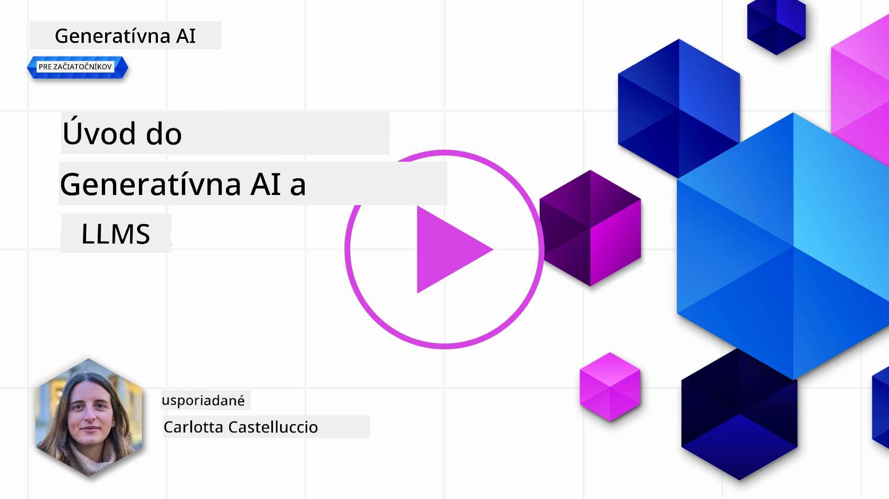
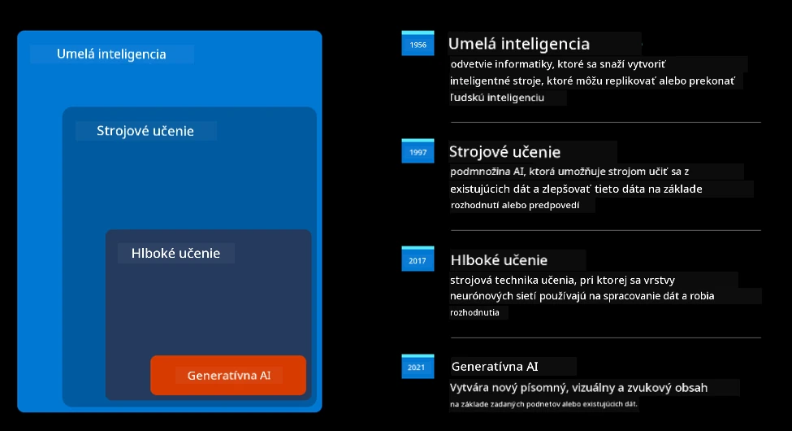
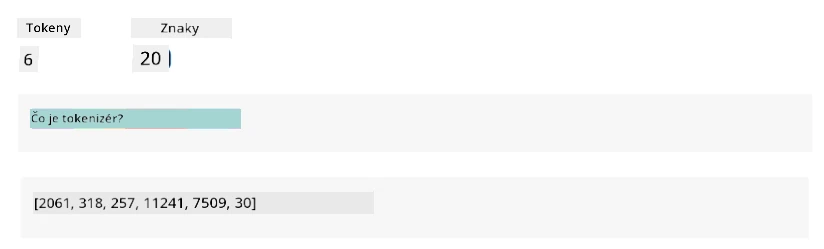
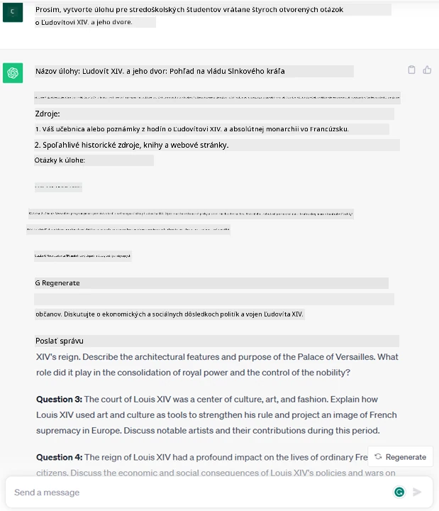
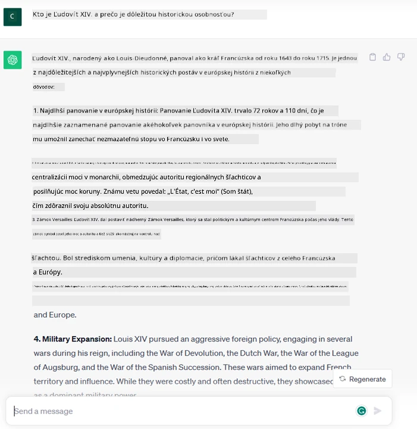
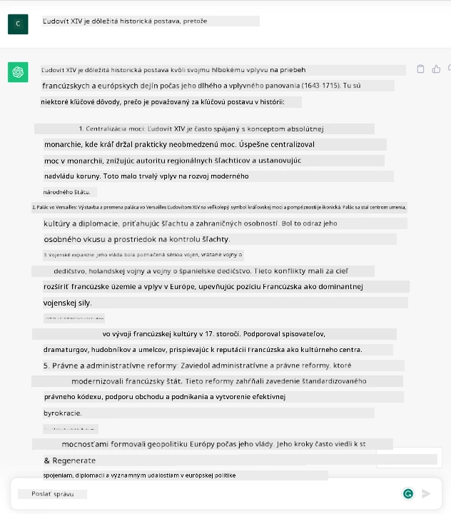
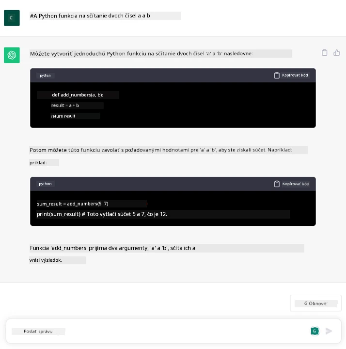

# Úvod do generatívnej AI a veľkých jazykových modelov

_(Kliknite na obrázok vyššie na zobrazenie videa k tejto lekcii)_

Generatívna AI je umelá inteligencia schopná generovať text, obrázky a iné druhy obsahu. To, čo ju robí fantastickou technológiou, je jej demokratizácia AI – každý ju môže používať s tak málo ako textovým promptom, vetou napísanou v prirodzenom jazyku. Netreba sa učiť jazyk ako Java alebo SQL, aby ste dosiahli niečo hodnotné, stačí použiť svoj jazyk, uviesť, čo chcete, a vyjde návrh od AI modelu. Aplikácie a dopad na to sú obrovské, píšete alebo rozumiete správam, píšete aplikácie a oveľa viac, všetko za sekundy.

V tomto učebnom pláne preskúmame, ako náš startup využíva generatívnu AI na odomknutie nových scenárov vo svete vzdelávania a ako riešime nevyhnutné výzvy spojené so sociálnymi dôsledkami jej použitia a technologickými obmedzeniami.

## Úvod

Táto lekcia pokryje:

- Úvod do biznis scenára: náš nápad a misia startupu.
- Generatívna AI a ako sme sa dostali ku súčasnému technologickému prostrediu.
- Vnútorné fungovanie veľkého jazykového modelu.
- Hlavné schopnosti a praktické použitia veľkých jazykových modelov.

## Ciele učenia

Po dokončení tejto lekcie porozumiete:

- Čo je generatívna AI a ako veľké jazykové modely fungujú.
- Ako môžete využiť veľké jazykové modely pre rôzne použitia, so zameraním na vzdelávacie scenáre.

## Scenár: náš vzdelávací startup

Generatívna umelá inteligencia (AI) predstavuje vrchol AI technológie, posúvajúci hranice toho, čo bolo kedysi považované za nemožné. Generatívne AI modely majú niekoľko schopností a aplikácií, ale v tomto učebnom pláne preskúmame, ako menia vzdelávanie prostredníctvom fiktívneho startupu. Tento startup budeme nazývať _náš startup_. Náš startup pôsobí v oblasti vzdelávania s ambicióznym vyhlásením misie

> _zlepšiť prístupnosť vzdelávania na globálnej úrovni, zabezpečiť rovnaký prístup ku vzdelaniu a poskytovať personalizované vzdelávacie skúsenosti každému študentovi podľa jeho potrieb_.

Náš tím startupu si uvedomuje, že tento cieľ nedosiahneme bez využitia jedného z najsilnejších nástrojov moderných čias – veľkých jazykových modelov (LLM).

Očakáva sa, že generatívna AI zrevolucionalizuje dnešný spôsob učenia a vyučovania, pričom študenti budú mať k dispozícii virtuálnych učiteľov 24 hodín denne, ktorí poskytujú obrovské množstvá informácií a príkladov, a učitelia budú môcť využívať inovatívne nástroje na hodnotenie svojich študentov a poskytovanie spätnej väzby.

Na úvod si definujme niektoré základné pojmy a terminológiu, ktorú budeme používať v celom učebnom programe.

## Ako sa dostala generatívna AI?

Napriek mimoriadnemu _hype_, ktorý vznikol nedávno oznámením generatívnych AI modelov, je táto technológia vo vývoji už desaťročia, pričom prvé výskumné snahy siahajú do 60. rokov. Dnes sme na úrovni, kedy AI má ľudské kognitívne schopnosti, ako je konverzácia, ktorú demonštrujú napríklad [OpenAI ChatGPT](https://openai.com/chatgpt) alebo [Microsoft Copilot](https://copilot.microsoft.com/?WT.mc_id=academic-105485-koreyst), ktorý tiež využíva GPT model pre svoj konverzačný webový vyhľadávač.

Trochu späť v čase, prvé prototypy AI sa skladali z typizovaných chatbotov, ktoré sa spoliehali na databázu vedomostí vytvorenú skupinou expertov a reprezentovanú v počítači. Odpovede v databáze vedomostí boli vyvolané kľúčovými slovami, ktoré sa objavili v zadanom texte.
Čoskoro sa však ukázalo, že takýto prístup založený na typizovaných chatbotov nebol efektívne škálovateľný.

### Štatistický prístup k AI: strojové učenie

Zlom nastal počas 90. rokov použitím štatistického prístupu na analýzu textu. To viedlo k vývoju nových algoritmov – známych ako strojové učenie – ktoré boli schopné učiť sa vzory z dát bez explicitného programovania. Tento prístup umožňuje strojom simulovať porozumenie ľudského jazyka: štatistický model je trénovaný na pároch text-štítok, čo modelu umožňuje klasifikovať neznámy vstupný text s preddefinovaným štítkom reprezentujúcim zámer správy.

### Neurónové siete a moderní virtuálni asistenti

V posledných rokoch technologický vývoj hardvéru schopného spracovať väčšie množstvá dát a náročnejšie výpočty podnietil výskum v AI, vedúci k vývoju pokročilých algoritmov strojového učenia známych ako neurónové siete alebo hlboké učenie.

Neurónové siete (najmä rekurentné neurónové siete – RNN) výrazne zlepšili spracovanie prirodzeného jazyka, umožňujúc reprezentáciu významu textu zmysluplnejším spôsobom, pričom zohľadňujú kontext slova vo vete.

Toto je technológia, ktorá poháňala virtuálnych asistentov narodených v prvej dekáde nového tisícročia, veľmi zdatných v interpretácii ľudského jazyka, identifikovaní potrieb a vykonávaní akcií na ich uspokojenie – ako odpovedanie podľa predpísaného skriptu alebo využívanie služieb tretích strán.

### Súčasnosť, generatívna AI

Takto sme sa dostali ku generatívnej AI dnes, ktorú možno považovať za podmnožinu hlbokého učenia.

Po desaťročiach výskumu v oblasti AI nový model architektúry – nazývaný _Transformer_ – prekonal obmedzenia RNN, keď bol schopný spracovávať oveľa dlhšie sekvencie textu ako vstup. Transformery sú založené na mechanizme pozornosti, ktorý umožňuje modelu priraďovať rôzne váhy vstupom, „venovať viac pozornosti“ tam, kde je koncentrovaná najrelevantnejšia informácia, nezávisle od ich poradia v textovej sekvencii.

Väčšina nedávnych generatívnych AI modelov – známych tiež ako veľké jazykové modely (LLM), keďže pracujú s textovými vstupmi a výstupmi – je skutočne založená na tejto architektúre. Zaujímavé na týchto modeloch – trénovaných na obrovskom množstve neoznačených dát z rôznych zdrojov ako knihy, články a webové stránky – je, že sa dajú prispôsobiť širokej škále úloh a generovať gramaticky správny text s náznakom kreativity. Takže nielenže výrazne zlepšili schopnosť stroja „rozumieť“ vstupnému textu, ale umožnili aj jeho schopnosť vytvárať originálnu odpoveď v ľudskom jazyku.

## Ako fungujú veľké jazykové modely?

V ďalšej kapitole preskúmame rôzne typy generatívnych AI modelov, ale zatiaľ sa pozrime na to, ako fungujú veľké jazykové modely, so zameraním na OpenAI GPT (Generative Pre-trained Transformer) modely.

- **Tokenizer, text na čísla**: Veľké jazykové modely dostávajú ako vstup text a generujú text ako výstup. Avšak keďže sú to štatistické modely, pracujú oveľa lepšie s číslami než s textovými sekvenciami. Preto je každý vstup do modelu spracovaný tokenizérom pred tým, ako ho použije jadro modelu. Token je kus textu – skladajúci sa z premenlivého počtu znakov, pričom hlavnou úlohou tokenizéra je rozdeliť vstup na pole tokenov. Potom je každý token namapovaný na tokenový index, čo je celočíselné kódovanie pôvodného textového kusa.

- **Predpovedanie výstupných tokenov**: Za predpokladu n tokenov ako vstupu (s max n rôznym model od modelu) je model schopný predpovedať jeden token ako výstup. Tento token je potom začlenený do vstupu ďalšej iterácie, v rozširujúcom sa okne, čo umožňuje lepší používateľský zážitok pri získavaní jednej (alebo viacerých) viet ako odpovede. To vysvetľuje, prečo, ak ste niekedy pracovali s ChatGPT, možno ste si všimli, že niekedy sa zdá, že prestane uprostred vety.

- **Výberový proces, pravdepodobnostné rozdelenie**: Výstupný token je vybraný modelom podľa jeho pravdepodobnosti výskytu po aktuálnej textovej sekvencii. Model predpovedá pravdepodobnostné rozdelenie pre všetky možné „ďalšie tokeny“, vypočítané na základe jeho tréningu. Avšak nie vždy je zo vzniknutého rozdelenia vybraný token s najvyššou pravdepodobnosťou. K výberu sa pridáva miera náhodnosti tak, že model funguje nedeterministicky – nedostávame vždy presne rovnaký výstup k rovnakému vstupu. Táto miera náhodnosti simuluje proces kreatívneho myslenia a dá sa upraviť pomocou parametra modelu nazývaného teplota.

## Ako môže náš startup využiť veľké jazykové modely?

Teraz, keď máme lepšie pochopenie vnútra veľkého jazykového modelu, pozrime sa na niekoľko praktických príkladov najbežnejších úloh, ktoré dokážu veľmi dobre realizovať, s ohľadom na náš biznis scenár.
Povedali sme, že hlavnou schopnosťou veľkého jazykového modelu je _generovať text od základu, začínajúc od textového vstupu, napísaného v prirodzenom jazyku_.

Ale aký druh textového vstupu a výstupu?
Vstup veľkého jazykového modelu je známy ako prompt, zatiaľ čo výstup sa nazýva completion, čo odkazuje na mechanizmus modelu na generovanie ďalšieho tokenu na dokončenie aktuálneho vstupu. Podrobne sa pozrieme, čo je prompt a ako ho navrhnúť tak, aby sme z modelu dostali čo najviac. Ale zatiaľ povedzme, že prompt môže obsahovať:

- **inštrukciu**, ktorá špecifikuje typ výstupu, ktorý od modelu očakávame. Táto inštrukcia môže niekedy obsahovať aj príklady alebo ďalšie dáta.

  1. Zhrnutie článku, knihy, recenzií produktu a viac, spolu s vyťažením poznatkov z nestruktúrovaných dát.
    
    
  
  2. Kreatívna ideácia a návrh článku, eseje, zadania alebo viac.
      
     

- **otázku**, položenú v rámci konverzácie s agentom.
  
  

- Kus **textu na dokončenie**, čo implicitne znamená žiadosť o pomoc pri písaní.
  
  

- Kus **kódu** spolu so žiadosťou o jeho vysvetlenie a dokumentáciu, alebo komentár žiadajúci vygenerovať kus kódu vykonávajúci konkrétnu úlohu.
  
  

Vyššie uvedené príklady sú celkom jednoduché a nie sú určené na vyčerpávajúcu ukážku schopností veľkých jazykových modelov. Majú ukázať potenciál využitia generatívnej AI, najmä, ale nielen vo vzdelávacom kontexte.

Výstup generatívneho AI modelu nie je vždy dokonalý a niekedy môže kreativita modelu pôsobiť proti nemu, čo môže viesť k výsledku, ktorý používateľ vníma ako mystifikáciu reality, alebo môže byť urážlivý. Generatívna AI nie je inteligentná - aspoň nie v širšom zmysle inteligencie, zahŕňajúcom kritické a kreatívne uvažovanie alebo emočnú inteligenciu; nie je deterministická a nedá sa na ňu spoľahnúť, keďže fabrikáty ako nesprávne odkazy, obsah a tvrdenia môžu byť skombinované so správnymi informáciami a prezentované presvedčivo a sebavedome. V nasledujúcich lekciách sa budeme zaoberať všetkými týmito obmedzeniami a uvidíme, čo môžeme urobiť, aby sme ich zmiernili.

## Zadanie

Vaším zadaním je prečítať si viac o [generatívnej AI](https://en.wikipedia.org/wiki/Generative_artificial_intelligence?WT.mc_id=academic-105485-koreyst) a pokúsiť sa identifikovať oblasť, kde by ste dnes pridali generatívnu AI, ak ju ešte nemá. Ako by bol dopad iný oproti „starému spôsobu“, môžete urobiť niečo, čo ste predtým nemohli, alebo ste rýchlejší? Napíšte 300 slovné zhrnutie o tom, ako by váš vysnívaný AI startup vyzeral a zahrňte nadpisy ako „Problém“, „Ako by som použil AI“, „Dopad“ a voliteľne biznis plán.

Ak toto zadanie splníte, možno budete pripravení sa prihlásiť do Microsoft inkubátora, [Microsoft for Startups Founders Hub](https://www.microsoft.com/startups?WT.mc_id=academic-105485-koreyst), kde ponúkame kredity na Azure, OpenAI, mentoring a mnoho ďalšieho, pozrite sa na to!

## Kontrola znalostí

Čo je pravda o veľkých jazykových modeloch?

1. Dostanete vždy presne rovnakú odpoveď.
1. Robia veci dokonale, sú skvelé v sčítavaní čísel, vytváraní funkčného kódu atď.
1. Odpoveď môže byť rôzna aj pri použití toho istého promptu. Sú tiež skvelé na vytvorenie prvého konceptu niečoho, či už textu alebo kódu. Ale výsledky je potrebné ešte vylepšiť.

A: 3, LLM je nedeterministický, odpoveď sa líši, avšak môžete jeho variabilitu regulovať nastavením teploty. Tiež by ste nemali očakávať, že bude robiť veci dokonale, jeho úlohou je uľahčiť náročnú prácu, čo často znamená, že dostanete dobrý prvý pokus, ktorý budete postupne vylepšovať.

## Skvelá práca! Pokračujte na ceste

Po dokončení tejto lekcie si pozrite našu [kolekciu na učenie generatívnej AI](https://aka.ms/genai-collection?WT.mc_id=academic-105485-koreyst), aby ste pokračovali v rozvíjaní svojich znalostí o generatívnej AI!

Prejdite na Lekciu 2, kde sa pozrieme na to, ako [preskúmať a porovnať rôzne typy LLM](../02-exploring-and-comparing-different-llms/README.md?WT.mc_id=academic-105485-koreyst)!

---

<!-- CO-OP TRANSLATOR DISCLAIMER START -->
**Vyhlásenie o zodpovednosti**:
Tento dokument bol preložený pomocou AI prekladateľskej služby [Co-op Translator](https://github.com/Azure/co-op-translator). Hoci sa snažíme o presnosť, vezmite prosím na vedomie, že automatické preklady môžu obsahovať chyby alebo nepresnosti. Pôvodný dokument v jeho natívnom jazyku by mal byť považovaný za autoritatívny zdroj. Pre kritické informácie sa odporúča profesionálny ľudský preklad. Nie sme zodpovední za žiadne nedorozumenia alebo nesprávne interpretácie vyplývajúce z použitia tohto prekladu.
<!-- CO-OP TRANSLATOR DISCLAIMER END -->