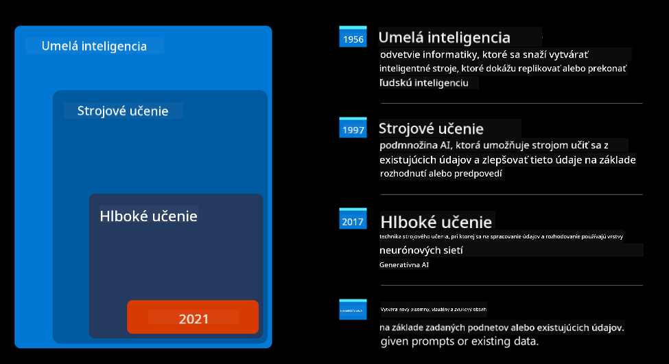

<!--
CO_OP_TRANSLATOR_METADATA:
{
  "original_hash": "f53ba0fa49164f9323043f1c6b11f2b1",
  "translation_date": "2025-07-09T08:01:18+00:00",
  "source_file": "01-introduction-to-genai/README.md",
  "language_code": "sk"
}
-->
# Úvod do generatívnej AI a veľkých jazykových modelov

_(Kliknite na obrázok vyššie pre zobrazenie videa k tejto lekcii)_

Generatívna AI je umelá inteligencia schopná generovať text, obrázky a iné typy obsahu. To, čo ju robí skvelou technológiou, je jej demokratizácia – každý ju môže používať len na základe textového podnetu, vety napísanej v prirodzenom jazyku. Nemusíte sa učiť jazyky ako Java alebo SQL, aby ste dosiahli niečo hodnotné, stačí použiť svoj jazyk, povedať, čo chcete, a AI model vám navrhne odpoveď. Aplikácie a dopad sú obrovské – píšete alebo rozumiete správam, tvoríte aplikácie a oveľa viac, a to všetko za pár sekúnd.

V tomto kurze preskúmame, ako náš startup využíva generatívnu AI na odomknutie nových možností vo svete vzdelávania a ako riešime nevyhnutné výzvy spojené so spoločenskými dôsledkami jej použitia a technologickými obmedzeniami.

## Úvod

Táto lekcia pokryje:

- Úvod do obchodného scenára: náš startup, jeho myšlienka a poslanie.
- Generatívna AI a ako sme sa dostali k súčasnému technologickému prostrediu.
- Vnútorné fungovanie veľkého jazykového modelu.
- Hlavné schopnosti a praktické použitia veľkých jazykových modelov.

## Ciele učenia

Po dokončení tejto lekcie budete rozumieť:

- Čo je generatívna AI a ako fungujú veľké jazykové modely.
- Ako môžete využiť veľké jazykové modely pre rôzne prípady použitia, so zameraním na vzdelávacie scenáre.

## Scenár: náš vzdelávací startup

Generatívna umelá inteligencia (AI) predstavuje vrchol AI technológie, posúvajúci hranice toho, čo sa kedysi považovalo za nemožné. Generatívne AI modely majú množstvo schopností a využití, no v tomto kurze sa zameriame na to, ako menia vzdelávanie prostredníctvom fiktívneho startupu, ktorý budeme nazývať _náš startup_. Náš startup pôsobí vo vzdelávacej oblasti s ambicióznym poslaním

> _zlepšiť prístupnosť vzdelávania na globálnej úrovni, zabezpečiť spravodlivý prístup k vzdelaniu a poskytovať personalizované vzdelávacie skúsenosti každému študentovi podľa jeho potrieb_.

Náš tím si uvedomuje, že tento cieľ nedosiahneme bez využitia jedného z najsilnejších nástrojov dnešnej doby – veľkých jazykových modelov (LLM).

Očakáva sa, že generatívna AI zrevolucionalizuje spôsob, akým dnes učíme a učíme sa, pričom študenti budú mať k dispozícii virtuálnych učiteľov 24 hodín denne, ktorí poskytujú obrovské množstvo informácií a príkladov, a učitelia budú môcť využívať inovatívne nástroje na hodnotenie študentov a poskytovanie spätnej väzby.

Na začiatok si definujme niektoré základné pojmy a terminológiu, ktoré budeme používať počas celého kurzu.

## Ako sme sa dostali k generatívnej AI?

Napriek obrovskému _hype_, ktorý sa v poslednej dobe vytvoril okolo generatívnych AI modelov, táto technológia sa vyvíja už desaťročia, pričom prvé výskumné snahy siahajú až do 60. rokov. Dnes sme na úrovni AI s ľudskými kognitívnymi schopnosťami, ako je konverzácia, čo dokazujú napríklad [OpenAI ChatGPT](https://openai.com/chatgpt) alebo [Bing Chat](https://www.microsoft.com/edge/features/bing-chat?WT.mc_id=academic-105485-koreyst), ktorý tiež používa GPT model pre webové vyhľadávanie a konverzácie.

Trochu späť – prvé prototypy AI tvorili písané chatboty, ktoré sa spoliehali na databázu znalostí vytvorenú skupinou expertov a zakódovanú do počítača. Odpovede v databáze sa spúšťali na základe kľúčových slov v zadanom texte. Čoskoro však bolo jasné, že takýto prístup, založený na písaných chatbotov, nie je škálovateľný.

### Štatistický prístup k AI: strojové učenie

Zlom nastal v 90. rokoch, keď sa začal používať štatistický prístup k analýze textu. To viedlo k vývoju nových algoritmov – známych ako strojové učenie – ktoré sa dokážu učiť vzory z dát bez explicitného programovania. Tento prístup umožňuje strojom simulovať porozumenie ľudského jazyka: štatistický model sa trénuje na pároch text-štítok, čo mu umožňuje klasifikovať neznámy vstupný text podľa preddefinovaného štítku, ktorý reprezentuje zámer správy.

### Neurónové siete a moderní virtuálni asistenti

V posledných rokoch technologický pokrok hardvéru, schopného spracovať väčšie množstvo dát a zložitejšie výpočty, podporil výskum v AI, čo viedlo k vývoju pokročilých algoritmov strojového učenia známych ako neurónové siete alebo hlboké učenie.

Neurónové siete (najmä rekurentné neurónové siete – RNN) výrazne zlepšili spracovanie prirodzeného jazyka, umožňujúc lepšie zachytiť význam textu a zohľadniť kontext slova vo vete.

Táto technológia poháňala virtuálnych asistentov, ktorí sa objavili v prvej dekáde nového storočia, veľmi zdatných v interpretácii ľudského jazyka, identifikovaní potreby a vykonaní akcie na jej uspokojenie – napríklad odpovedaním podľa preddefinovaného skriptu alebo využitím služby tretej strany.

### Súčasnosť, generatívna AI

Takto sme sa dostali k dnešnej generatívnej AI, ktorú možno považovať za podmnožinu hlbokého učenia.

Po desaťročiach výskumu v oblasti AI prekonala nová architektúra modelu – nazývaná _Transformer_ – obmedzenia RNN, keďže dokáže spracovať oveľa dlhšie textové sekvencie ako vstup. Transformery sú založené na mechanizme pozornosti, ktorý umožňuje modelu priradiť rôzne váhy vstupom, „venovať viac pozornosti“ tam, kde je sústredená najrelevantnejšia informácia, bez ohľadu na ich poradie v texte.

Väčšina nedávnych generatívnych AI modelov – známych tiež ako veľké jazykové modely (LLM), pretože pracujú s textovými vstupmi a výstupmi – je založená práve na tejto architektúre. Zaujímavé na týchto modeloch je, že sú trénované na obrovskom množstve neoznačených dát z rôznych zdrojov, ako sú knihy, články a webové stránky, a môžu byť prispôsobené na širokú škálu úloh a generovať gramaticky správny text s náznakom kreativity. Takže nielenže výrazne zlepšili schopnosť stroja „rozumieť“ vstupnému textu, ale umožnili mu aj generovať originálnu odpoveď v ľudskom jazyku.

## Ako fungujú veľké jazykové modely?

V ďalšej kapitole preskúmame rôzne typy generatívnych AI modelov, no teraz sa pozrime na to, ako fungujú veľké jazykové modely, so zameraním na OpenAI GPT (Generative Pre-trained Transformer) modely.

- **Tokenizer, text na čísla**: Veľké jazykové modely prijímajú text ako vstup a generujú text ako výstup. Keďže ide o štatistické modely, pracujú oveľa lepšie s číslami než s textovými sekvenciami. Preto každý vstup do modelu spracuje tokenizer predtým, než ho použije jadro modelu. Token je časť textu – pozostávajúca z premenlivého počtu znakov, takže hlavnou úlohou tokenizeru je rozdeliť vstup na pole tokenov. Každý token je potom mapovaný na token index, čo je celočíselné kódovanie pôvodného textového úseku.

- **Predikcia výstupných tokenov**: Model dostane n tokenov ako vstup (maximálny počet n sa líši model od modelu) a dokáže predpovedať jeden token ako výstup. Tento token sa potom zahrnie do vstupu ďalšej iterácie v rozširujúcom sa okne, čo umožňuje lepší používateľský zážitok, keď dostanete jednu (alebo viac) viet ako odpoveď. To vysvetľuje, prečo, ak ste niekedy používali ChatGPT, ste si mohli všimnúť, že niekedy sa zdá, že sa zastaví uprostred vety.

- **Proces výberu, pravdepodobnostné rozdelenie**: Výstupný token vyberá model podľa pravdepodobnosti jeho výskytu po aktuálnej textovej sekvencii. Model predpovedá pravdepodobnostné rozdelenie všetkých možných „nasledujúcich tokenov“ na základe svojho tréningu. Avšak nie vždy je vybraný token s najvyššou pravdepodobnosťou. Do výberu sa pridáva určitá miera náhodnosti, aby model fungoval nedeterministicky – nedostanete presne rovnaký výstup pre rovnaký vstup. Táto náhodnosť simuluje proces kreatívneho myslenia a dá sa nastaviť pomocou parametra modelu nazývaného teplota.

## Ako môže náš startup využiť veľké jazykové modely?

Keď už lepšie rozumieme vnútornému fungovaniu veľkého jazykového modelu, pozrime sa na niektoré praktické príklady najbežnejších úloh, ktoré dokážu veľmi dobre zvládnuť, s ohľadom na náš obchodný scenár. Hovorili sme, že hlavnou schopnosťou veľkého jazykového modelu je _generovať text od začiatku na základe textového vstupu napísaného v prirodzenom jazyku_.

Ale aký typ textového vstupu a výstupu?
Vstup veľkého jazykového modelu sa nazýva prompt, zatiaľ čo výstup sa nazýva completion, čo označuje mechanizmus modelu generovať nasledujúci token na doplnenie aktuálneho vstupu. Podrobne sa pozrieme na to, čo je prompt a ako ho navrhnúť tak, aby sme z modelu dostali maximum. Zatiaľ však povedzme, že prompt môže obsahovať:

- **Inštrukciu**, ktorá špecifikuje typ výstupu, ktorý od modelu očakávame. Táto inštrukcia môže niekedy obsahovať príklady alebo ďalšie údaje.

  1. Zhrnutie článku, knihy, recenzií produktov a podobne, spolu s extrakciou poznatkov z neštruktúrovaných dát.
    
    
  
  2. Kreatívne nápady a tvorba článku, eseje, zadania a podobne.
      
     

- **Otázku**, položenú formou konverzácie s agentom.
  
  

- Časť **textu na doplnenie**, čo implicitne znamená žiadosť o pomoc s písaním.
  
  

- Časť **kódu** spolu so žiadosťou o jeho vysvetlenie a dokumentáciu, alebo komentár žiadajúci vygenerovať kus kódu vykonávajúci konkrétnu úlohu.
  
  

Príklady vyššie sú pomerne jednoduché a nemajú byť vyčerpávajúcou ukážkou schopností veľkých jazykových modelov. Majú ukázať potenciál využitia generatívnej AI, najmä, ale nie výlučne, vo vzdelávacom kontexte.

Výstup generatívneho AI modelu nie je vždy dokonalý a niekedy môže kreativita modelu pracovať proti nemu, čo vedie k výstupu, ktorý používateľ môže vnímať ako skreslenie reality alebo môže byť urážlivý. Generatívna AI nie je inteligentná – aspoň nie v širšom zmysle inteligencie, ktorá zahŕňa kritické a kreatívne myslenie či emocionálnu inteligenciu; nie je deterministická a nie je úplne spoľahlivá, pretože môže kombinovať nesprávne odkazy, obsah a tvrdenia s pravdivými informáciami a prezentovať ich presvedčivo a sebavedome. V nasledujúcich lekciách sa budeme zaoberať týmito obmedzeniami a uvidíme, čo môžeme urobiť, aby sme ich zmiernili.

## Zadanie

Vašou úlohou je prečítať si viac o [generatívnej AI](https://en.wikipedia.org/wiki/Generative_artificial_intelligence?WT.mc_id=academic-105485-koreyst) a pokúsiť sa identifikovať oblasť, kde by ste dnes pridali generatívnu AI, ktorá ju ešte nemá. Ako by sa dopad líšil oproti „starému spôsobu“? Môžete urobiť niečo, čo ste predtým nemohli, alebo ste rýchlejší? Napíšte 300 slovný súhrn o tom, ako by vyzeral váš vysnívaný AI startup a zahrňte nadpisy ako „Problém“, „Ako by som použil AI“, „Dopad“ a voliteľne aj podnikateľský plán.

Ak túto úlohu splníte, môžete byť pripravení uchádzať sa o Microsoft inkubátor, [Microsoft for Startups Founders Hub](https://www.microsoft.com/startups?WT.mc_id=academic-105485-koreyst), kde ponúkame kredity na Azure, OpenAI, mentoring a oveľa viac, určite to vyskúšajte!

## Kontrola vedomostí

Čo platí o veľkých jazykových modeloch?

1. Vždy dostanete presne rovnakú odpoveď.
1. Robia všetko perfektne, sú skvelé v sčítavaní, generovaní funkčného kódu atď.
1. Odpoveď sa môže líšiť aj pri použití rovnakého promptu. Sú tiež skvelé na vytvorenie prvého návrhu niečoho, či už textu alebo kódu. Výsledky však treba vylepšiť.

Odpoveď: 3, LLM sú nedeterministické, odpoveď sa líši, no variabilitu môžete ovplyvniť nastavením teploty. Tiež by ste nemali očakávať, že všetko urobia perfektne, ich úlohou je uľahčiť vám prácu tým, že získate dobrý prvý návrh, ktorý je potrebné postupne vylepšovať.

## Výborná práca! Pokračujte v ceste

Po dokončení tejto lekcie si pozrite našu [kolekciu Generatívnej AI](https://aka.ms/genai-collection?WT.mc_id=academic-105485-koreyst) a pokračujte v rozširovaní svojich znalostí o generatívnej AI!
Prejdite na Lekciu 2, kde sa pozrieme na to, ako [preskúmať a porovnať rôzne typy LLM](../02-exploring-and-comparing-different-llms/README.md?WT.mc_id=academic-105485-koreyst)!

**Vyhlásenie o zodpovednosti**:  
Tento dokument bol preložený pomocou AI prekladateľskej služby [Co-op Translator](https://github.com/Azure/co-op-translator). Aj keď sa snažíme o presnosť, prosím, majte na pamäti, že automatizované preklady môžu obsahovať chyby alebo nepresnosti. Originálny dokument v jeho pôvodnom jazyku by mal byť považovaný za autoritatívny zdroj. Pre kritické informácie sa odporúča profesionálny ľudský preklad. Nie sme zodpovední za akékoľvek nedorozumenia alebo nesprávne interpretácie vyplývajúce z použitia tohto prekladu.