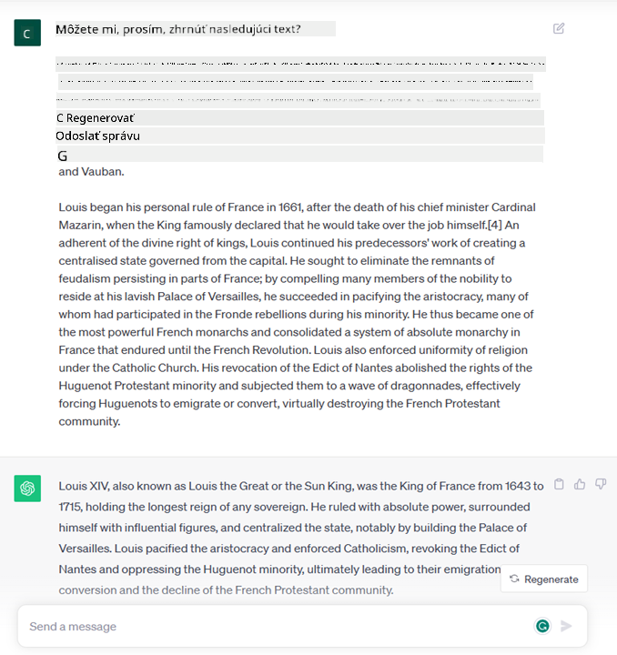
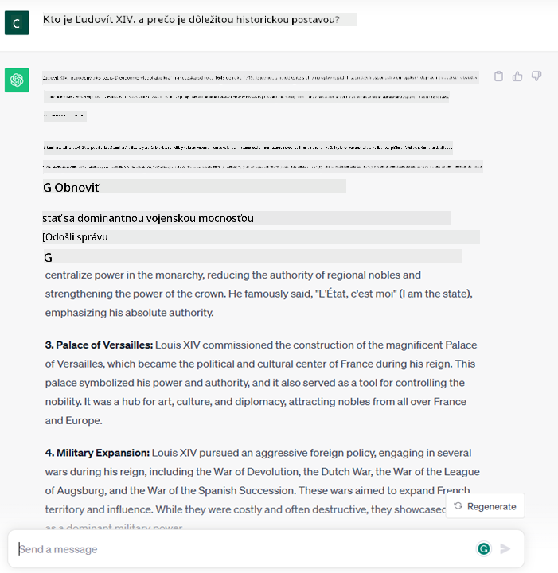
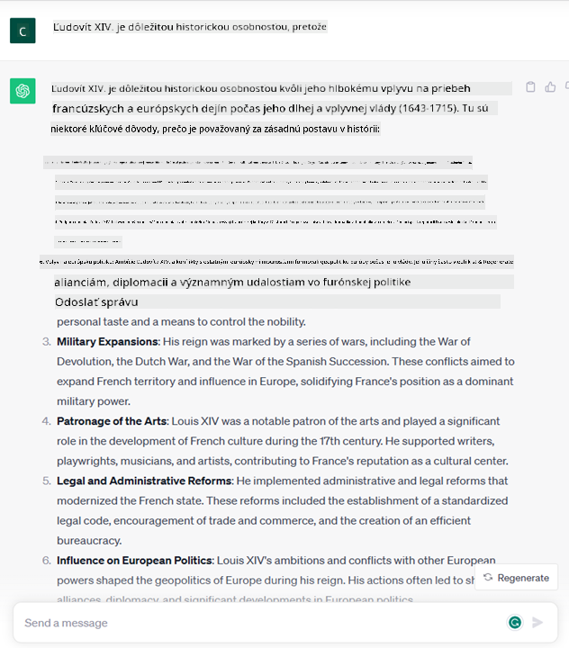

<!--
CO_OP_TRANSLATOR_METADATA:
{
  "original_hash": "bfb7901bdbece1ba3e9f35c400ca33e8",
  "translation_date": "2025-10-17T21:59:58+00:00",
  "source_file": "01-introduction-to-genai/README.md",
  "language_code": "sk"
}
-->
# Úvod do generatívnej AI a veľkých jazykových modelov

_(Kliknite na obrázok vyššie, aby ste si pozreli video k tejto lekcii)_

Generatívna AI je umelá inteligencia schopná generovať text, obrázky a iné typy obsahu. Čo ju robí úžasnou technológiou, je to, že demokratizuje AI – každý ju môže používať len s jednoduchým textovým príkazom, vetou napísanou v prirodzenom jazyku. Nemusíte sa učiť programovacie jazyky ako Java alebo SQL, aby ste dosiahli niečo hodnotné, stačí použiť svoj jazyk, vyjadriť, čo chcete, a AI model vám poskytne návrh. Aplikácie a dopad tejto technológie sú obrovské – môžete písať alebo rozumieť správam, vytvárať aplikácie a oveľa viac, a to všetko v priebehu niekoľkých sekúnd.

V tomto kurze preskúmame, ako náš startup využíva generatívnu AI na odomknutie nových scenárov vo svete vzdelávania a ako sa vyrovnávame s nevyhnutnými výzvami spojenými so sociálnymi dôsledkami jej aplikácie a technologickými obmedzeniami.

## Úvod

Táto lekcia pokryje:

- Úvod do obchodného scenára: náš startupový nápad a misia.
- Generatívna AI a ako sme sa dostali k súčasnému technologickému prostrediu.
- Vnútorné fungovanie veľkého jazykového modelu.
- Hlavné schopnosti a praktické použitie veľkých jazykových modelov.

## Ciele učenia

Po dokončení tejto lekcie budete rozumieť:

- Čo je generatívna AI a ako fungujú veľké jazykové modely.
- Ako môžete využiť veľké jazykové modely na rôzne účely, so zameraním na vzdelávacie scenáre.

## Scenár: náš vzdelávací startup

Generatívna umelá inteligencia (AI) predstavuje vrchol AI technológie, posúvajúc hranice toho, čo sa kedysi považovalo za nemožné. Generatívne AI modely majú niekoľko schopností a aplikácií, ale v tomto kurze preskúmame, ako revolučne menia vzdelávanie prostredníctvom fiktívneho startupu. Tento startup budeme nazývať _náš startup_. Náš startup pôsobí v oblasti vzdelávania s ambicióznym poslaním:

> _zlepšiť prístup k vzdelávaniu na globálnej úrovni, zabezpečiť rovnaký prístup k vzdelaniu a poskytovať personalizované vzdelávacie skúsenosti každému študentovi podľa jeho potrieb_.

Tím nášho startupu si uvedomuje, že tento cieľ nedokážeme dosiahnuť bez využitia jedného z najvýkonnejších nástrojov modernej doby – veľkých jazykových modelov (LLMs).

Generatívna AI má potenciál revolučne zmeniť spôsob, akým sa dnes učíme a učíme iných, pričom študenti majú k dispozícii virtuálnych učiteľov 24 hodín denne, ktorí poskytujú obrovské množstvo informácií a príkladov, a učitelia môžu využívať inovatívne nástroje na hodnotenie svojich študentov a poskytovanie spätnej väzby.

Na začiatok si definujme niektoré základné pojmy a terminológiu, ktorú budeme používať počas celého kurzu.

## Ako sme sa dostali ku generatívnej AI?

Napriek mimoriadnemu _hype_, ktorý v poslednej dobe vyvolalo oznámenie generatívnych AI modelov, táto technológia sa vyvíjala celé desaťročia, pričom prvé výskumné snahy siahajú až do 60. rokov. Dnes sme na bode, kedy AI dosahuje ľudské kognitívne schopnosti, ako je konverzácia, čo ukazujú napríklad [OpenAI ChatGPT](https://openai.com/chatgpt) alebo [Bing Chat](https://www.microsoft.com/edge/features/bing-chat?WT.mc_id=academic-105485-koreyst), ktorý tiež používa GPT model na konverzácie pri vyhľadávaní na webe Bing.

Ak sa pozrieme späť, prvé prototypy AI pozostávali z písaných chatbotov, ktoré sa spoliehali na znalostnú základňu získanú od skupiny odborníkov a reprezentovanú v počítači. Odpovede v znalostnej základni boli aktivované kľúčovými slovami, ktoré sa objavili v zadanom texte. Čoskoro sa však ukázalo, že takýto prístup, využívajúci písané chatboty, nie je dostatočne škálovateľný.

### Štatistický prístup k AI: strojové učenie

Zlom nastal v 90. rokoch, keď sa začal aplikovať štatistický prístup k analýze textu. To viedlo k vývoju nových algoritmov – známych ako strojové učenie – schopných učiť sa vzory z dát bez explicitného programovania. Tento prístup umožnil strojom simulovať porozumenie ľudského jazyka: štatistický model je trénovaný na pároch text-štítok, čo umožňuje modelu klasifikovať neznámy vstupný text s preddefinovaným štítkom reprezentujúcim zámer správy.

### Neurónové siete a moderní virtuálni asistenti

V posledných rokoch technologický vývoj hardvéru, schopného spracovávať väčšie množstvo dát a zložitejšie výpočty, podporil výskum v oblasti AI, čo viedlo k vývoju pokročilých algoritmov strojového učenia známych ako neurónové siete alebo algoritmy hlbokého učenia.

Neurónové siete (a najmä rekurentné neurónové siete – RNNs) významne zlepšili spracovanie prirodzeného jazyka, umožňujúc reprezentáciu významu textu zmysluplnejším spôsobom, pričom zohľadňujú kontext slova vo vete.

Táto technológia poháňala virtuálnych asistentov, ktorí sa objavili v prvej dekáde nového storočia, veľmi zdatných v interpretácii ľudského jazyka, identifikácii potreby a vykonaní akcie na jej uspokojenie – ako odpovedanie preddefinovaným skriptom alebo využitie služby tretej strany.

### Súčasnosť, generatívna AI

Takto sme sa dostali k dnešnej generatívnej AI, ktorú možno považovať za podmnožinu hlbokého učenia.

Po desaťročiach výskumu v oblasti AI nová architektúra modelov – nazývaná _Transformer_ – prekonala obmedzenia RNNs, umožňujúc spracovanie oveľa dlhších sekvencií textu ako vstup. Transformery sú založené na mechanizme pozornosti, ktorý umožňuje modelu priradiť rôzne váhy vstupom, ktoré dostáva, „venovať väčšiu pozornosť“ tam, kde je sústredená najrelevantnejšia informácia, bez ohľadu na ich poradie v textovej sekvencii.

Väčšina nedávnych generatívnych AI modelov – známych aj ako veľké jazykové modely (LLMs), keďže pracujú s textovými vstupmi a výstupmi – je skutočne založená na tejto architektúre. Zaujímavé na týchto modeloch – trénovaných na obrovskom množstve neoznačených dát z rôznych zdrojov, ako sú knihy, články a webové stránky – je to, že môžu byť prispôsobené na širokú škálu úloh a generovať gramaticky správny text s náznakom kreativity. Takže nielenže neuveriteľne zlepšili schopnosť stroja „rozumieť“ vstupnému textu, ale umožnili jeho schopnosť generovať originálnu odpoveď v ľudskom jazyku.

## Ako fungujú veľké jazykové modely?

V ďalšej kapitole preskúmame rôzne typy generatívnych AI modelov, ale teraz sa pozrime na to, ako fungujú veľké jazykové modely, so zameraním na modely OpenAI GPT (Generative Pre-trained Transformer).

- **Tokenizér, text na čísla**: Veľké jazykové modely prijímajú text ako vstup a generujú text ako výstup. Avšak, keďže ide o štatistické modely, pracujú oveľa lepšie s číslami než s textovými sekvenciami. Preto každý vstup do modelu je spracovaný tokenizérom predtým, než ho použije hlavný model. Token je časť textu – pozostávajúca z variabilného počtu znakov, takže hlavnou úlohou tokenizéra je rozdelenie vstupu na pole tokenov. Potom je každý token mapovaný na index tokenu, čo je číselné kódovanie pôvodného textového úseku.

- **Predikcia výstupných tokenov**: Na základe n tokenov ako vstupu (s maximálnym n, ktoré sa líši od modelu k modelu) je model schopný predpovedať jeden token ako výstup. Tento token je potom začlenený do vstupu ďalšej iterácie, v rozširujúcom sa okne, čo umožňuje lepší používateľský zážitok z získania jednej (alebo viacerých) vety ako odpovede. To vysvetľuje, prečo, ak ste niekedy používali ChatGPT, mohli ste si všimnúť, že niekedy sa zdá, že sa zastaví uprostred vety.

- **Proces výberu, pravdepodobnostné rozdelenie**: Výstupný token je vybraný modelom podľa jeho pravdepodobnosti výskytu po aktuálnej textovej sekvencii. Je to preto, že model predpovedá pravdepodobnostné rozdelenie všetkých možných „nasledujúcich tokenov“, vypočítané na základe jeho tréningu. Avšak, nie vždy je token s najvyššou pravdepodobnosťou vybraný z výsledného rozdelenia. Do tejto voľby je pridaný stupeň náhodnosti, aby model konal nedeterministickým spôsobom – nedostaneme presne rovnaký výstup pre rovnaký vstup. Tento stupeň náhodnosti je pridaný na simuláciu procesu kreatívneho myslenia a môže byť upravený pomocou parametra modelu nazývaného teplota.

## Ako môže náš startup využiť veľké jazykové modely?

Teraz, keď lepšie rozumieme vnútornému fungovaniu veľkého jazykového modelu, pozrime sa na niektoré praktické príklady najbežnejších úloh, ktoré dokážu vykonávať veľmi dobre, s ohľadom na náš obchodný scenár. Povedali sme, že hlavnou schopnosťou veľkého jazykového modelu je _generovanie textu od nuly, začínajúc od textového vstupu, napísaného v prirodzenom jazyku_.

Ale aký druh textového vstupu a výstupu?
Vstup veľkého jazykového modelu je známy ako prompt, zatiaľ čo výstup je známy ako completion, čo sa vzťahuje na mechanizmus modelu generovania ďalšieho tokenu na dokončenie aktuálneho vstupu. Budeme sa podrobne zaoberať tým, čo je prompt a ako ho navrhnúť tak, aby sme z modelu získali maximum. Ale zatiaľ povedzme, že prompt môže obsahovať:

- **Inštrukciu**, ktorá špecifikuje typ výstupu, ktorý od modelu očakávame. Táto inštrukcia môže niekedy obsahovať príklady alebo dodatočné údaje.

  1. Zhrnutie článku, knihy, recenzií produktov a ďalších, spolu s extrakciou poznatkov z nestruktúrovaných dát.
    
    
  
  2. Kreatívne nápady a návrh článku, eseje, zadania a ďalších.
      
     

- **Otázku**, položenú vo forme konverzácie s agentom.
  
  

- Časť **textu na dokončenie**, čo implicitne znamená žiadosť o pomoc pri písaní.
  
  

- Časť **kódu** spolu s požiadavkou na vysvetlenie a dokumentáciu, alebo komentár žiadajúci o generovanie kódu vykonávajúceho konkrétnu úlohu.
  
  

Vyššie uvedené príklady sú pomerne jednoduché a nie sú určené na to, aby boli vyčerpávajúcou ukážkou schopností veľkých jazykových modelov. Majú za cieľ ukázať potenciál využitia generatívnej AI, najmä ale nielen v kontexte vzdelávania.

Okrem toho výstup generatívneho AI modelu nie je dokonalý a niekedy môže kreativita modelu pôsobiť proti nemu, čo vedie k výstupu, ktorý je kombináciou slov, ktoré ľudský používateľ môže interpretovať ako mystifikáciu reality, alebo môže byť urážlivý. Generatívna AI nie je inteligentná – aspoň nie v komplexnejšej definícii inteligencie, zahŕňajúcej kritické a kreatívne myslenie alebo emocionálnu inteligenciu; nie je deterministická a nie je dôveryhodná, pretože výmysly, ako chybné odkazy, obsah a tvrdenia, môžu byť kombinované so správnymi informáciami a prezentované presvedčivým a sebavedomým spôsobom. V nasledujúcich lekciách sa budeme zaoberať všetkými týmito obmedzeniami a uvidíme, čo môžeme urobiť na ich zmiernenie.

## Zadanie

Vašou úlohou je prečítať si viac o [generatívnej AI](https://en.wikipedia.org/wiki/Generative_artificial_intelligence?WT.mc_id=academic-105485-koreyst) a pokúsiť sa identifikovať oblasť, kde by ste dnes mohli pridať generatívnu AI, ktorá ju zatiaľ nemá. Ako by bol dopad odlišný od toho, keby sa to robilo „starým spôsobom“, môžete urobiť niečo, čo ste predtým nemohli, alebo ste rýchlejší? Napíšte 300-slovné zhrnutie o tom, ako by vyzeral váš vysnívaný AI startup, a zahrňte nadpisy ako „Problém“, „Ako by som použil AI“, „Dopad“ a voliteľne obchodný plán.

Ak ste túto úlohu splnili, možno ste pripravení uchádzať sa o miesto v inkubátore Microsoftu, [Microsoft for Startups Founders Hub](https://www.microsoft.com/startups?WT.mc_id=academic-105485-koreyst), kde ponúkame kredity na Azure, OpenAI, mentoring a oveľa viac, pozrite si to!

## Kontrola vedomostí

Čo je pravda o veľkých jazykových modeloch?

1. Dostanete presne rovnakú odpoveď zakaždým.
1. Robí veci dokonale, je skvelý v sčítavaní čísel, produkcii funkčného kódu atď.
1. Odpoveď sa môže líšiť napriek použitiu rovnakého promptu. Je tiež skvelý na poskytnutie prvého návrhu niečoho, či už textu alebo kódu. Ale výsledky musíte vylepšiť.

Odpoveď: 
Prejdite na Lekciu 2, kde sa pozrieme na to, ako [preskúmať a porovnať rôzne typy LLM](../02-exploring-and-comparing-different-llms/README.md?WT.mc_id=academic-105485-koreyst)!

---

**Zrieknutie sa zodpovednosti**:  
Tento dokument bol preložený pomocou služby AI prekladu [Co-op Translator](https://github.com/Azure/co-op-translator). Hoci sa snažíme o presnosť, prosím, berte na vedomie, že automatizované preklady môžu obsahovať chyby alebo nepresnosti. Pôvodný dokument v jeho rodnom jazyku by mal byť považovaný za autoritatívny zdroj. Pre kritické informácie sa odporúča profesionálny ľudský preklad. Nenesieme zodpovednosť za akékoľvek nedorozumenia alebo nesprávne interpretácie vyplývajúce z použitia tohto prekladu.