<!--
CO_OP_TRANSLATOR_METADATA:
{
  "original_hash": "e2f686f2eb794941761252ac5e8e090b",
  "translation_date": "2025-07-09T08:38:50+00:00",
  "source_file": "02-exploring-and-comparing-different-llms/README.md",
  "language_code": "sk"
}
-->
# Preskúmanie a porovnanie rôznych LLM

> _Kliknite na obrázok vyššie pre zobrazenie videa k tejto lekcii_

V predchádzajúcej lekcii sme videli, ako Generatívna AI mení technologickú krajinu, ako fungujú veľké jazykové modely (LLM) a ako ich môže firma – napríklad náš startup – využiť pre svoje prípady použitia a rásť! V tejto kapitole sa zameriame na porovnanie rôznych typov veľkých jazykových modelov (LLM), aby sme pochopili ich výhody a nevýhody.

Ďalším krokom na ceste nášho startupu je preskúmať súčasnú ponuku LLM a zistiť, ktoré sú vhodné pre náš prípad použitia.

## Úvod

Táto lekcia pokryje:

- Rôzne typy LLM v súčasnom prostredí.
- Testovanie, iterovanie a porovnávanie rôznych modelov pre váš prípad použitia v Azure.
- Ako nasadiť LLM.

## Ciele učenia

Po dokončení tejto lekcie budete vedieť:

- Vybrať správny model pre váš prípad použitia.
- Pochopiť, ako testovať, iterovať a zlepšovať výkon modelu.
- Vedieť, ako firmy nasadzujú modely.

## Pochopenie rôznych typov LLM

LLM môžu byť rozdelené podľa architektúry, tréningových dát a prípadu použitia. Pochopenie týchto rozdielov pomôže nášmu startupu vybrať správny model pre daný scenár a pochopiť, ako testovať, iterovať a zlepšovať výkon.

Existuje mnoho rôznych typov LLM modelov, výber závisí od toho, na čo ich chcete použiť, aké máte dáta, koľko ste ochotní zaplatiť a ďalšie faktory.

Podľa toho, či chcete modely použiť na text, audio, video, generovanie obrázkov a podobne, môžete zvoliť iný typ modelu.

- **Audio a rozpoznávanie reči**. Pre tento účel sú skvelou voľbou modely typu Whisper, ktoré sú univerzálne a zamerané na rozpoznávanie reči. Sú trénované na rôznorodom audio materiáli a zvládajú viacjazyčné rozpoznávanie reči. Viac o [modeloch typu Whisper tu](https://platform.openai.com/docs/models/whisper?WT.mc_id=academic-105485-koreyst).

- **Generovanie obrázkov**. Pre generovanie obrázkov sú veľmi známe modely DALL-E a Midjourney. DALL-E je dostupný cez Azure OpenAI. [Viac o DALL-E tu](https://platform.openai.com/docs/models/dall-e?WT.mc_id=academic-105485-koreyst) a tiež v kapitole 9 tohto kurikula.

- **Generovanie textu**. Väčšina modelov je trénovaná na generovanie textu a máte na výber širokú škálu od GPT-3.5 po GPT-4. Cena sa líši, pričom GPT-4 je najdrahší. Oplatí sa pozrieť na [Azure OpenAI playground](https://oai.azure.com/portal/playground?WT.mc_id=academic-105485-koreyst), kde môžete vyhodnotiť, ktoré modely najlepšie vyhovujú vašim potrebám z hľadiska schopností a ceny.

- **Multimodalita**. Ak chcete pracovať s viacerými typmi dát na vstupe aj výstupe, môžete sa pozrieť na modely ako [gpt-4 turbo s vizuálnymi schopnosťami alebo gpt-4o](https://learn.microsoft.com/azure/ai-services/openai/concepts/models#gpt-4-and-gpt-4-turbo-models?WT.mc_id=academic-105485-koreyst) – najnovšie verzie OpenAI modelov, ktoré kombinujú spracovanie prirodzeného jazyka s vizuálnym porozumením a umožňujú interakciu cez multimodálne rozhrania.

Výber modelu znamená, že získate základné schopnosti, ktoré však nemusia vždy stačiť. Často máte firemné špecifické dáta, o ktorých musíte LLM nejako informovať. Existuje niekoľko možností, ako to riešiť, o čom bude reč v nasledujúcich častiach.

### Foundation Models verzus LLM

Termín Foundation Model bol [zavedený výskumníkmi zo Stanfordu](https://arxiv.org/abs/2108.07258?WT.mc_id=academic-105485-koreyst) a definuje sa ako AI model, ktorý spĺňa určité kritériá, napríklad:

- **Sú trénované pomocou neoznačeného alebo samo-označeného učenia**, čo znamená, že sú trénované na neoznačených multimodálnych dátach a nevyžadujú ľudskú anotáciu alebo označovanie dát počas tréningu.
- **Sú veľmi veľké modely**, založené na hlbokých neurónových sieťach trénovaných na miliardách parametrov.
- **Zvyčajne slúžia ako „základ“ pre iné modely**, teda môžu byť použité ako východiskový bod pre ďalšie modely, ktoré sa na nich môžu ďalej doladiť.

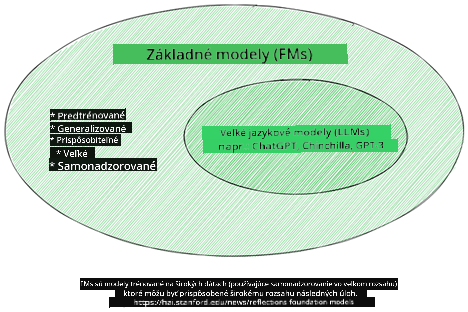

Zdroj obrázka: [Essential Guide to Foundation Models and Large Language Models | by Babar M Bhatti | Medium](https://thebabar.medium.com/essential-guide-to-foundation-models-and-large-language-models-27dab58f7404)

Pre lepšie pochopenie si vezmime príklad ChatGPT. Pri tvorbe prvej verzie ChatGPT slúžil model GPT-3.5 ako základný model. To znamená, že OpenAI použilo špecifické dáta pre chat, aby vytvorilo doladenú verziu GPT-3.5, ktorá bola špecializovaná na konverzačné scenáre, ako sú chatboti.

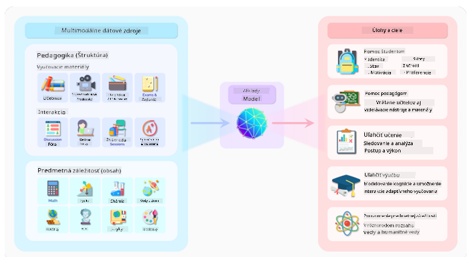

Zdroj obrázka: [2108.07258.pdf (arxiv.org)](https://arxiv.org/pdf/2108.07258.pdf?WT.mc_id=academic-105485-koreyst)

### Open Source verzus proprietárne modely

Ďalším spôsobom kategorizácie LLM je podľa toho, či sú open source alebo proprietárne.

Open source modely sú verejne dostupné a môže ich používať ktokoľvek. Často ich sprístupňuje firma, ktorá ich vytvorila, alebo výskumná komunita. Tieto modely je možné skúmať, upravovať a prispôsobovať rôznym prípadom použitia. Nie vždy sú však optimalizované pre produkčné nasadenie a nemusia byť tak výkonné ako proprietárne modely. Financovanie open source modelov môže byť obmedzené, nemusia byť dlhodobo udržiavané alebo aktualizované podľa najnovšieho výskumu. Príklady populárnych open source modelov sú [Alpaca](https://crfm.stanford.edu/2023/03/13/alpaca.html?WT.mc_id=academic-105485-koreyst), [Bloom](https://huggingface.co/bigscience/bloom) a [LLaMA](https://llama.meta.com).

Proprietárne modely sú vo vlastníctve firmy a nie sú verejne dostupné. Často sú optimalizované pre produkčné použitie. Nie je dovolené ich skúmať, upravovať alebo prispôsobovať rôznym prípadom použitia. Zvyčajne nie sú zadarmo a vyžadujú predplatné alebo platbu za používanie. Používatelia tiež nemajú kontrolu nad dátami, na ktorých sa model trénuje, a preto musia dôverovať majiteľovi modelu, že dodržiava zásady ochrany súkromia a zodpovedného používania AI. Príklady populárnych proprietárnych modelov sú [OpenAI modely](https://platform.openai.com/docs/models/overview?WT.mc_id=academic-105485-koreyst), [Google Bard](https://sapling.ai/llm/bard?WT.mc_id=academic-105485-koreyst) alebo [Claude 2](https://www.anthropic.com/index/claude-2?WT.mc_id=academic-105485-koreyst).

### Embedding verzus generovanie obrázkov verzus generovanie textu a kódu

LLM možno tiež kategorizovať podľa výstupu, ktorý generujú.

Embeddingy sú modely, ktoré prevádzajú text do číselnej podoby, nazývanej embedding, čo je číselná reprezentácia vstupného textu. Embeddingy uľahčujú strojom pochopiť vzťahy medzi slovami alebo vetami a môžu slúžiť ako vstupy pre iné modely, napríklad klasifikačné alebo zhlukovacie modely, ktoré lepšie pracujú s číselnými dátami. Embedding modely sa často používajú na transfer learning, kde sa model trénuje na náhradnej úlohe s veľkým množstvom dát a potom sa váhy modelu (embeddingy) znovu používajú pre ďalšie úlohy. Príkladom sú [OpenAI embeddings](https://platform.openai.com/docs/models/embeddings?WT.mc_id=academic-105485-koreyst).

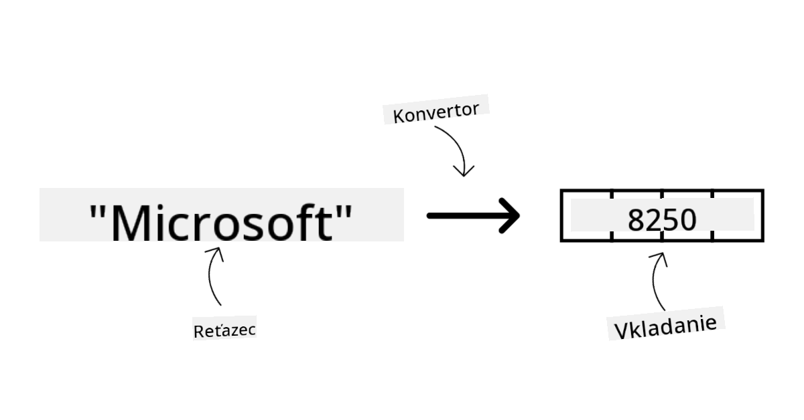

Modely na generovanie obrázkov vytvárajú obrázky. Používajú sa na úpravu obrázkov, syntézu a preklad obrázkov. Sú trénované na veľkých datasetoch obrázkov, ako je [LAION-5B](https://laion.ai/blog/laion-5b/?WT.mc_id=academic-105485-koreyst), a môžu generovať nové obrázky alebo upravovať existujúce pomocou techník ako inpainting, superrozlíšenie a kolorovanie. Príklady sú [DALL-E-3](https://openai.com/dall-e-3?WT.mc_id=academic-105485-koreyst) a [Stable Diffusion modely](https://github.com/Stability-AI/StableDiffusion?WT.mc_id=academic-105485-koreyst).

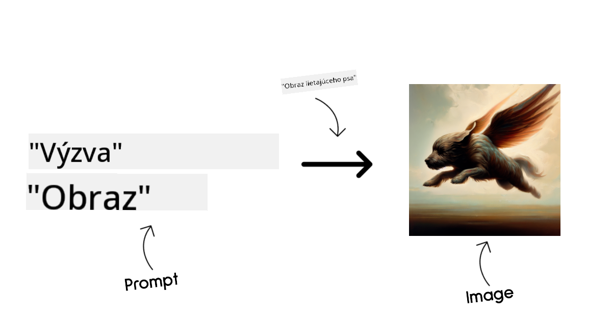

Modely na generovanie textu a kódu vytvárajú text alebo kód. Používajú sa na sumarizáciu textu, preklad a odpovedanie na otázky. Sú trénované na veľkých datasetoch textu, ako je [BookCorpus](https://www.cv-foundation.org/openaccess/content_iccv_2015/html/Zhu_Aligning_Books_and_ICCV_2015_paper.html?WT.mc_id=academic-105485-koreyst), a môžu generovať nový text alebo odpovedať na otázky. Modely na generovanie kódu, ako [CodeParrot](https://huggingface.co/codeparrot?WT.mc_id=academic-105485-koreyst), sú trénované na veľkých datasetoch kódu, napríklad z GitHubu, a môžu generovať nový kód alebo opravovať chyby v existujúcom kóde.

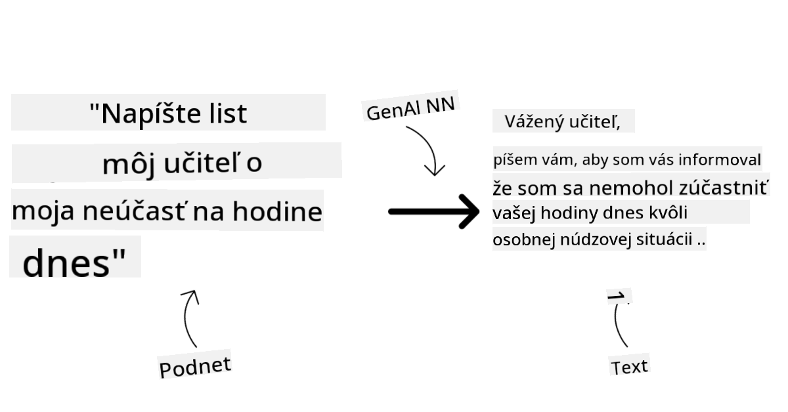

### Encoder-Decoder verzus iba Decoder

Na vysvetlenie rôznych architektúr LLM použijeme analógiu.

Predstavte si, že váš manažér vám zadal úlohu vytvoriť kvíz pre študentov. Máte dvoch kolegov; jeden sa stará o tvorbu obsahu a druhý o jeho kontrolu.

Tvorca obsahu je ako model iba s Decoderom, môže sa pozrieť na tému a to, čo ste už napísali, a na základe toho vytvoriť kurz. Sú veľmi dobrí v písaní pútavého a informatívneho obsahu, ale nie sú veľmi dobrí v pochopení témy a vzdelávacích cieľov. Príkladmi Decoder modelov sú modely rodiny GPT, napríklad GPT-3.

Kontrolór je ako model iba s Encoderom, pozrie sa na napísaný kurz a odpovede, všimne si vzťahy medzi nimi a chápe kontext, ale nie je dobrý v generovaní obsahu. Príkladom Encoder modelu je BERT.

Predstavte si, že by sme mali niekoho, kto by mohol vytvárať aj kontrolovať kvíz zároveň – to je Encoder-Decoder model. Príkladmi sú BART a T5.

### Služba verzus Model

Teraz si vysvetlíme rozdiel medzi službou a modelom. Služba je produkt ponúkaný poskytovateľom cloudových služieb a často je kombináciou modelov, dát a ďalších komponentov. Model je jadrom služby a často ide o základný model, ako je LLM.

Služby sú často optimalizované pre produkčné použitie a sú jednoduchšie na používanie cez grafické rozhranie. Nie vždy sú zadarmo a môžu vyžadovať predplatné alebo platbu, pričom využívate vybavenie a zdroje poskytovateľa služby, čo optimalizuje náklady a umožňuje jednoduché škálovanie. Príkladom služby je [Azure OpenAI Service](https://learn.microsoft.com/azure/ai-services/openai/overview?WT.mc_id=academic-105485-koreyst), ktorá ponúka platbu podľa spotreby. Azure OpenAI Service tiež poskytuje bezpečnosť na úrovni podnikov a rámec zodpovedného používania AI nad schopnosťami modelov.

Modely sú len neurónové siete s parametrami a váhami. Firmy si ich môžu spustiť lokálne, ale musia si zaobstarať hardvér, vybudovať infraštruktúru na škálovanie a kúpiť licenciu alebo použiť open source model. Model ako LLaMA je dostupný na použitie, ale vyžaduje výpočtový výkon na jeho prevádzku.

## Ako testovať a iterovať s rôznymi modelmi na pochopenie výkonu v Azure

Keď náš tím preskúma súčasnú ponuku LLM a vyberie niekoľko vhodných kandidátov pre svoje scenáre, ďalším krokom je ich testovanie na vlastných dátach a pracovnej záťaži. Ide o iteratívny proces, ktorý prebieha prostredníctvom experimentov a meraní.
Väčšina modelov, ktoré sme spomenuli v predchádzajúcich odstavcoch (modely OpenAI, open source modely ako Llama2 a Hugging Face transformery) je dostupná v [Model Catalog](https://learn.microsoft.com/azure/ai-studio/how-to/model-catalog-overview?WT.mc_id=academic-105485-koreyst) v [Azure AI Studio](https://ai.azure.com/?WT.mc_id=academic-105485-koreyst).

[Azure AI Studio](https://learn.microsoft.com/azure/ai-studio/what-is-ai-studio?WT.mc_id=academic-105485-koreyst) je cloudová platforma navrhnutá pre vývojárov na tvorbu generatívnych AI aplikácií a správu celého vývojového cyklu – od experimentovania až po vyhodnocovanie – kombinovaním všetkých Azure AI služieb do jedného centra s prehľadným GUI. Model Catalog v Azure AI Studio umožňuje používateľovi:

- Nájsť základný model, ktorý ho zaujíma, v katalógu – či už proprietárny alebo open source, filtrovať podľa úlohy, licencie alebo názvu. Pre lepšiu vyhľadateľnosť sú modely usporiadané do kolekcií, ako napríklad Azure OpenAI kolekcia, Hugging Face kolekcia a ďalšie.

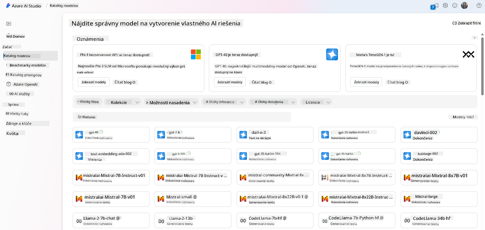

- Prezrieť si model card, vrátane podrobného popisu zamýšľaného použitia a tréningových dát, ukážok kódu a výsledkov vyhodnotenia v rámci internej knižnice hodnotení.

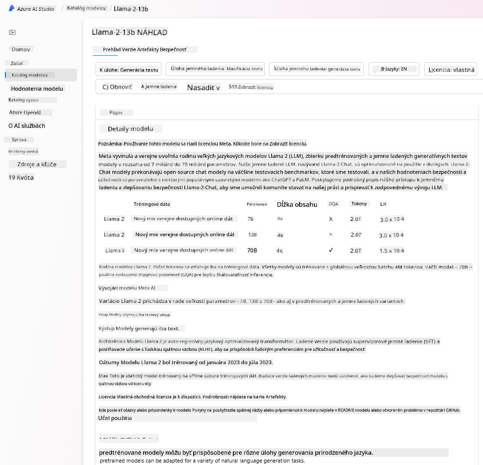

- Porovnať benchmarky medzi modelmi a datasetmi dostupnými v priemysle, aby sa zistilo, ktorý najlepšie vyhovuje danému obchodnému scenáru, cez panel [Model Benchmarks](https://learn.microsoft.com/azure/ai-studio/how-to/model-benchmarks?WT.mc_id=academic-105485-koreyst).

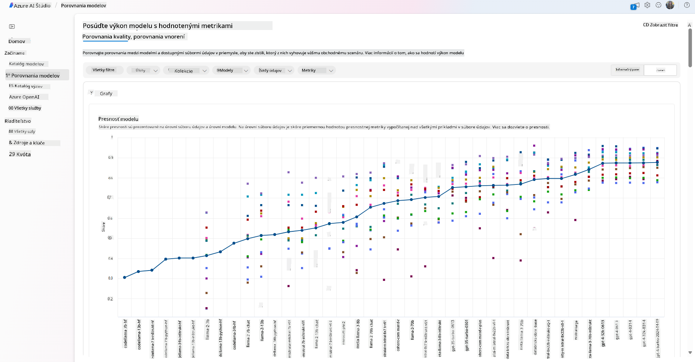

- Doladiť model na vlastných tréningových dátach, aby sa zlepšil výkon modelu v konkrétnej úlohe, využívajúc možnosti experimentovania a sledovania v Azure AI Studio.

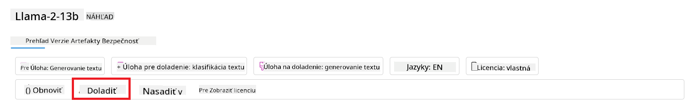

- Nasadiť pôvodný predtrénovaný model alebo doladenú verziu na vzdialený real-time inference – spravovaný výpočtový výkon – alebo serverless API endpoint – [pay-as-you-go](https://learn.microsoft.com/azure/ai-studio/how-to/model-catalog-overview#model-deployment-managed-compute-and-serverless-api-pay-as-you-go?WT.mc_id=academic-105485-koreyst) – aby aplikácie mohli model využívať.

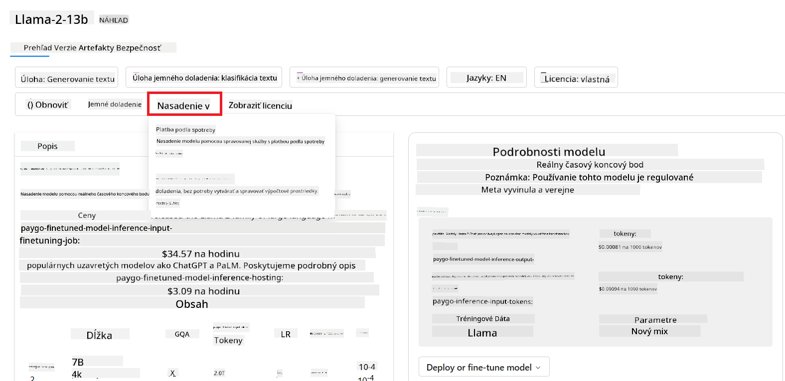

> [!NOTE]
> Nie všetky modely v katalógu sú momentálne dostupné na doladenie a/alebo nasadenie na pay-as-you-go báze. Pre podrobnosti o možnostiach a obmedzeniach modelu si pozrite model card.

## Zlepšovanie výsledkov LLM

S naším startup tímom sme skúmali rôzne typy LLM a cloudovú platformu (Azure Machine Learning), ktorá nám umožňuje porovnávať rôzne modely, vyhodnocovať ich na testovacích dátach, zlepšovať výkon a nasadzovať ich na inference endpointy.

Kedy by však mali zvážiť doladenie modelu namiesto použitia predtrénovaného? Existujú aj iné spôsoby, ako zlepšiť výkon modelu na konkrétnych úlohách?

Podniky môžu použiť niekoľko prístupov, aby dosiahli požadované výsledky z LLM. Pri nasadzovaní LLM do produkcie môžete vybrať rôzne typy modelov s rôznou mierou tréningu, pričom každý má inú úroveň zložitosti, nákladov a kvality. Tu sú niektoré prístupy:

- **Prompt engineering s kontextom**. Myšlienka je poskytnúť dostatok kontextu pri zadávaní promptu, aby ste dostali požadované odpovede.

- **Retrieval Augmented Generation, RAG**. Vaše dáta môžu byť napríklad v databáze alebo webovom endpoint-e, a aby sa tieto dáta alebo ich časť zahrnuli do promptu, môžete vyhľadať relevantné informácie a pridať ich do promptu používateľa.

- **Doladený model**. Tu ste model ďalej trénovali na vlastných dátach, čo viedlo k presnejšiemu a citlivejšiemu modelu na vaše potreby, ale môže to byť nákladné.

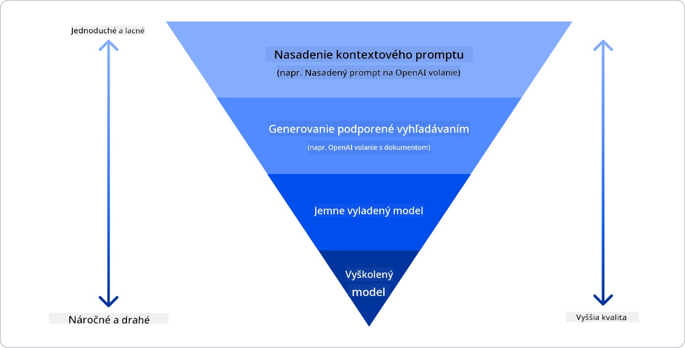

Zdroj obrázku: [Four Ways that Enterprises Deploy LLMs | Fiddler AI Blog](https://www.fiddler.ai/blog/four-ways-that-enterprises-deploy-llms?WT.mc_id=academic-105485-koreyst)

### Prompt Engineering s Kontextom

Predtrénované LLM veľmi dobre fungujú na všeobecných úlohách spracovania prirodzeného jazyka, dokonca aj pri krátkom prompte, ako je veta na doplnenie alebo otázka – tzv. „zero-shot“ učenie.

Avšak čím viac používateľ dokáže svoj dotaz špecifikovať, s podrobnou požiadavkou a príkladmi – teda Kontextom – tým presnejšia a bližšia očakávaniam používateľa bude odpoveď. V tomto prípade hovoríme o „one-shot“ učení, ak prompt obsahuje len jeden príklad, a o „few-shot“ učení, ak obsahuje viacero príkladov.
Prompt engineering s kontextom je najnákladovo efektívnejší spôsob, ako začať.

### Retrieval Augmented Generation (RAG)

LLM majú obmedzenie, že môžu použiť len dáta, ktoré boli použité počas ich tréningu na generovanie odpovede. To znamená, že nepoznajú fakty, ktoré sa udiali po ich tréningu, a nemajú prístup k neverejným informáciám (napríklad firemným dátam).
Toto sa dá prekonať pomocou RAG, techniky, ktorá rozširuje prompt o externé dáta vo forme častí dokumentov, pričom sa berú do úvahy limity dĺžky promptu. Podporujú to nástroje vektorových databáz (ako [Azure Vector Search](https://learn.microsoft.com/azure/search/vector-search-overview?WT.mc_id=academic-105485-koreyst)), ktoré vyhľadávajú užitočné časti z rôznych preddefinovaných zdrojov dát a pridávajú ich do kontextu promptu.

Táto technika je veľmi užitočná, keď podnik nemá dostatok dát, času alebo zdrojov na doladenie LLM, ale chce zlepšiť výkon na konkrétnej úlohe a znížiť riziko vymýšľania si faktov, teda mystifikácie reality alebo škodlivého obsahu.

### Doladený model

Doladenie je proces, ktorý využíva transfer learning na „prispôsobenie“ modelu na konkrétnu úlohu alebo riešenie špecifického problému. Na rozdiel od few-shot učenia a RAG vedie k vytvoreniu nového modelu s aktualizovanými váhami a biasmi. Vyžaduje si súbor tréningových príkladov pozostávajúcich z jedného vstupu (promptu) a jeho priradeného výstupu (dokončenia).
Toto je preferovaný prístup, ak:

- **Používate doladené modely**. Podnik chce použiť doladené menej výkonné modely (napríklad embedding modely) namiesto vysoko výkonných, čo vedie k nákladovo efektívnejšiemu a rýchlejšiemu riešeniu.

- **Zohľadňujete latenciu**. Latencia je dôležitá pre konkrétny prípad použitia, takže nie je možné použiť veľmi dlhé prompty alebo počet príkladov, z ktorých by sa mal model učiť, nevyhovuje limitu dĺžky promptu.

- **Chcete byť aktuálni**. Podnik má veľa kvalitných dát a overených označení (ground truth) a zdroje potrebné na ich priebežnú aktualizáciu.

### Trénovaný model

Tréning LLM od začiatku je bezpochyby najnáročnejší a najzložitejší prístup, vyžadujúci obrovské množstvo dát, skúsených odborníkov a adekvátny výpočtový výkon. Túto možnosť by mal podnik zvážiť len v prípade, že má doménovo špecifický prípad použitia a veľké množstvo doménovo špecializovaných dát.

## Overenie vedomostí

Aký by mohol byť dobrý prístup na zlepšenie výsledkov dokončovania LLM?

1. Prompt engineering s kontextom  
2. RAG  
3. Doladený model

Odpoveď: 3, ak máte čas, zdroje a kvalitné dáta, doladenie je lepšia voľba na udržanie aktuálnosti. Ak však chcete veci zlepšiť a nemáte dostatok času, stojí za to najskôr zvážiť RAG.

## 🚀 Výzva

Prečítajte si viac o tom, ako môžete [využiť RAG](https://learn.microsoft.com/azure/search/retrieval-augmented-generation-overview?WT.mc_id=academic-105485-koreyst) pre vaše podnikanie.

## Skvelá práca, pokračujte v učení

Po dokončení tejto lekcie si pozrite našu [kolekciu Generative AI Learning](https://aka.ms/genai-collection?WT.mc_id=academic-105485-koreyst), aby ste naďalej rozvíjali svoje znalosti o generatívnej AI!

Prejdite na Lekciu 3, kde sa pozrieme na to, ako [zodpovedne pracovať s generatívnou AI](../03-using-generative-ai-responsibly/README.md?WT.mc_id=academic-105485-koreyst)!

**Vyhlásenie o zodpovednosti**:  
Tento dokument bol preložený pomocou AI prekladateľskej služby [Co-op Translator](https://github.com/Azure/co-op-translator). Aj keď sa snažíme o presnosť, prosím, majte na pamäti, že automatizované preklady môžu obsahovať chyby alebo nepresnosti. Originálny dokument v jeho pôvodnom jazyku by mal byť považovaný za autoritatívny zdroj. Pre kritické informácie sa odporúča profesionálny ľudský preklad. Nie sme zodpovední za akékoľvek nedorozumenia alebo nesprávne interpretácie vyplývajúce z použitia tohto prekladu.