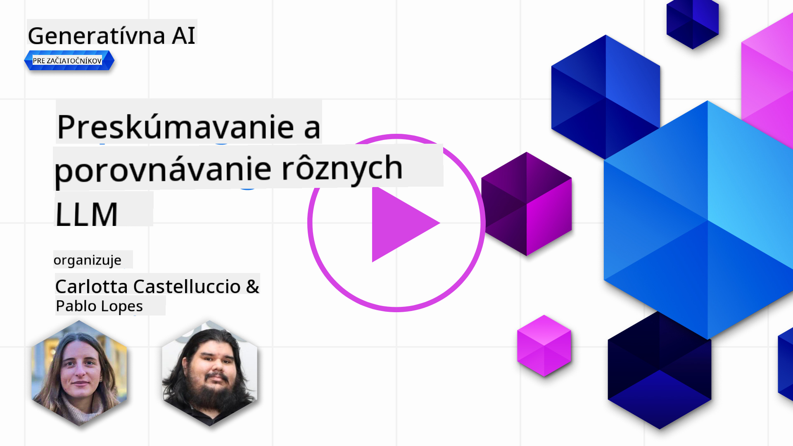
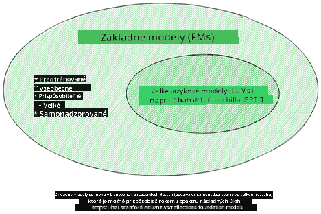
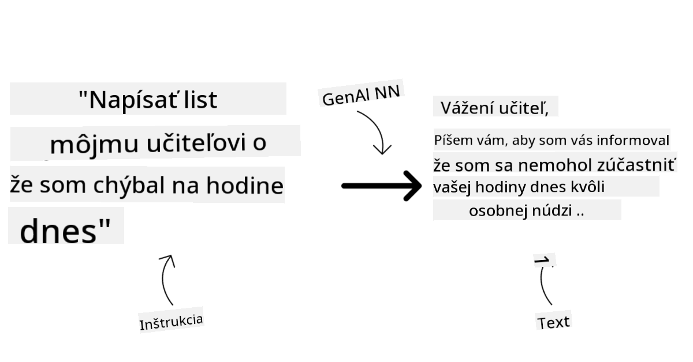
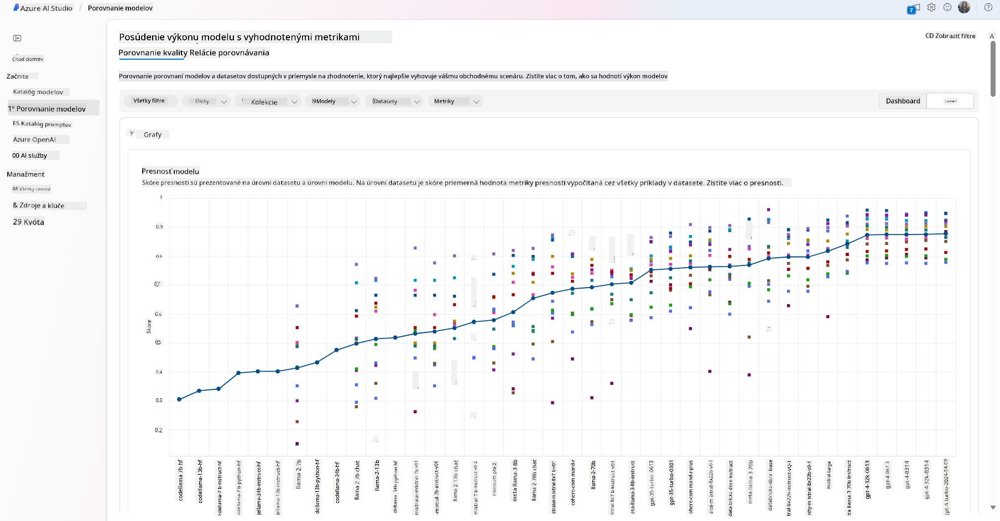
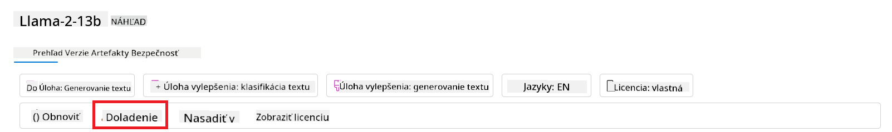
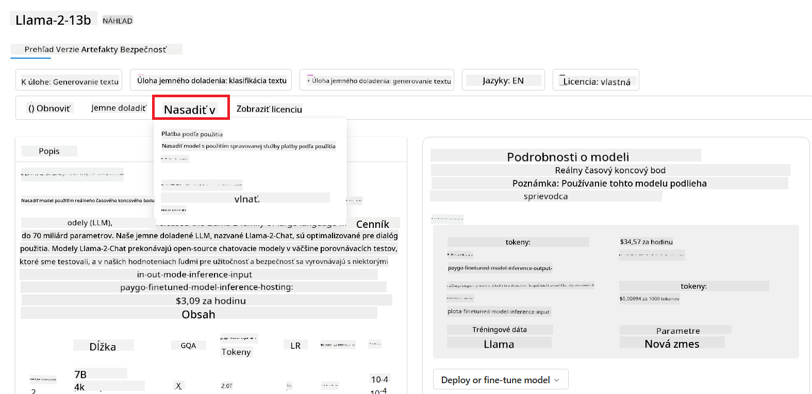
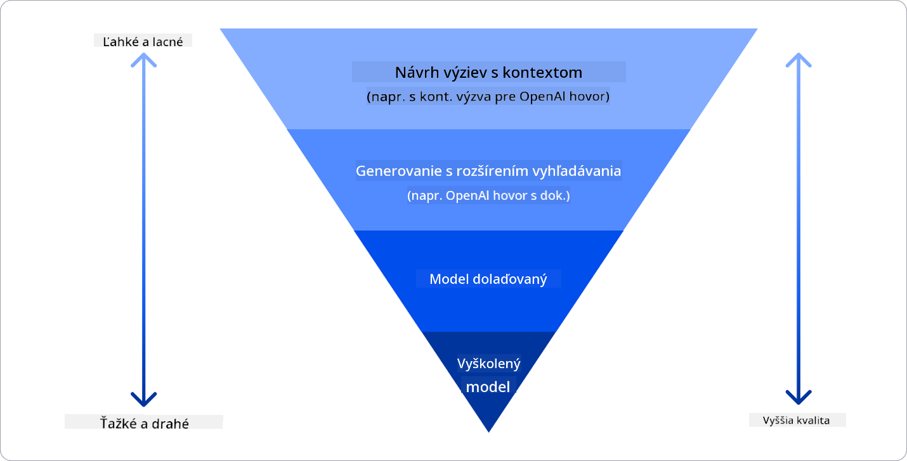

<!--
CO_OP_TRANSLATOR_METADATA:
{
  "original_hash": "e2f686f2eb794941761252ac5e8e090b",
  "translation_date": "2025-05-19T14:21:05+00:00",
  "source_file": "02-exploring-and-comparing-different-llms/README.md",
  "language_code": "sk"
}
-->
# Skúmanie a porovnávanie rôznych LLM

> _Kliknite na obrázok vyššie, aby ste si pozreli video k tejto lekcii_

V predchádzajúcej lekcii sme videli, ako Generatívna AI mení technologický svet, ako fungujú Veľké jazykové modely (LLM) a ako ich podnik, ako napríklad náš startup, môže aplikovať na svoje prípady použitia a rásť! V tejto kapitole sa zameriame na porovnanie a kontrast rôznych typov veľkých jazykových modelov (LLM), aby sme pochopili ich výhody a nevýhody.

Ďalším krokom v ceste nášho startupu je preskúmať aktuálnu krajinu LLM a pochopiť, ktoré sú vhodné pre náš prípad použitia.

## Úvod

Táto lekcia pokryje:

- Rôzne typy LLM v aktuálnej krajine.
- Testovanie, iteráciu a porovnávanie rôznych modelov pre váš prípad použitia v Azure.
- Ako nasadiť LLM.

## Ciele učenia

Po dokončení tejto lekcie budete schopní:

- Vybrať správny model pre váš prípad použitia.
- Pochopiť, ako testovať, iterovať a zlepšovať výkon vášho modelu.
- Vedieť, ako podniky nasadzujú modely.

## Pochopenie rôznych typov LLM

LLM môžu mať rôzne kategorizácie na základe ich architektúry, tréningových dát a prípadu použitia. Pochopenie týchto rozdielov pomôže nášmu startupu vybrať správny model pre daný scenár a pochopiť, ako testovať, iterovať a zlepšovať výkon.

Existuje mnoho rôznych typov LLM modelov, výber modelu závisí od toho, na čo ich chcete použiť, vašich dát, koľko ste pripravení zaplatiť a ďalších faktorov.

V závislosti od toho, či chcete modely použiť na text, audio, video, generovanie obrázkov a podobne, môžete zvoliť iný typ modelu.

- **Rozpoznávanie zvuku a reči**. Pre tento účel sú modely typu Whisper skvelou voľbou, pretože sú univerzálne a zamerané na rozpoznávanie reči. Sú trénované na rôznorodých audiodátach a dokážu vykonávať viacjazyčné rozpoznávanie reči. Viac sa dozviete o [modeloch typu Whisper tu](https://platform.openai.com/docs/models/whisper?WT.mc_id=academic-105485-koreyst).

- **Generovanie obrázkov**. Pre generovanie obrázkov sú DALL-E a Midjourney dve veľmi známe voľby. DALL-E je ponúkaný Azure OpenAI. [Prečítajte si viac o DALL-E tu](https://platform.openai.com/docs/models/dall-e?WT.mc_id=academic-105485-koreyst) a tiež v kapitole 9 tohto kurikula.

- **Generovanie textu**. Väčšina modelov je trénovaná na generovanie textu a máte veľký výber od GPT-3.5 po GPT-4. Prichádzajú s rôznymi nákladmi, pričom GPT-4 je najdrahší. Stojí za to sa pozrieť na [Azure OpenAI playground](https://oai.azure.com/portal/playground?WT.mc_id=academic-105485-koreyst), aby ste zhodnotili, ktoré modely najlepšie vyhovujú vašim potrebám z hľadiska schopností a nákladov.

- **Multimodalita**. Ak hľadáte riešenie, ktoré zvládne viaceré typy dát na vstupe a výstupe, môžete sa pozrieť na modely ako [gpt-4 turbo s víziou alebo gpt-4o](https://learn.microsoft.com/azure/ai-services/openai/concepts/models#gpt-4-and-gpt-4-turbo-models?WT.mc_id=academic-105485-koreyst) - najnovšie vydania modelov OpenAI - ktoré sú schopné kombinovať spracovanie prirodzeného jazyka s vizuálnym porozumením, čo umožňuje interakcie prostredníctvom multimodálnych rozhraní.

Výber modelu znamená, že získate niektoré základné schopnosti, ktoré však nemusia byť dostačujúce. Často máte špecifické firemné dáta, ktoré musíte nejako oznámiť LLM. Existuje niekoľko rôznych možností, ako k tomu pristúpiť, viac o tom v nadchádzajúcich sekciách.

### Základné modely verzus LLM

Termín Základný model bol [vytvorený výskumníkmi zo Stanfordu](https://arxiv.org/abs/2108.07258?WT.mc_id=academic-105485-koreyst) a definovaný ako AI model, ktorý spĺňa určité kritériá, ako sú:

- **Sú trénované pomocou neovereného učenia alebo samoučenia**, čo znamená, že sú trénované na neoznačených multimodálnych dátach a nevyžadujú ľudskú anotáciu alebo označovanie dát pre svoj tréningový proces.
- **Sú veľmi veľké modely**, založené na veľmi hlbokých neurónových sieťach trénovaných na miliardách parametrov.
- **Sú normálne určené na to, aby slúžili ako 'základ' pre iné modely**, čo znamená, že môžu byť použité ako východiskový bod pre iné modely, ktoré sa na nich dajú postaviť, čo sa dá dosiahnuť doladením.

Zdroj obrázka: [Essential Guide to Foundation Models and Large Language Models | by Babar M Bhatti | Medium
](https://thebabar.medium.com/essential-guide-to-foundation-models-and-large-language-models-27dab58f7404)

Aby sme túto rozdielnosť ďalej objasnili, vezmime si ChatGPT ako príklad. Na vytvorenie prvej verzie ChatGPT slúžil model GPT-3.5 ako základný model. To znamená, že OpenAI použilo niektoré dáta špecifické pre chat, aby vytvorilo doladenú verziu GPT-3.5, ktorá bola špecializovaná na výkonnosť v konverzačných scenároch, ako sú chatboti.

Zdroj obrázka: [2108.07258.pdf (arxiv.org)](https://arxiv.org/pdf/2108.07258.pdf?WT.mc_id=academic-105485-koreyst)

### Otvorené zdroje verzus Vlastné modely

Ďalší spôsob, ako kategorizovať LLM, je, či sú otvoreného zdroja alebo vlastné.

Modely otvoreného zdroja sú modely, ktoré sú sprístupnené verejnosti a môže ich použiť ktokoľvek. Často sú sprístupnené spoločnosťou, ktorá ich vytvorila, alebo výskumnou komunitou. Tieto modely môžu byť skontrolované, modifikované a prispôsobené pre rôzne prípady použitia v LLM. Avšak, nie sú vždy optimalizované pre produkčné použitie a nemusia byť tak výkonné ako vlastné modely. Okrem toho, financovanie pre modely otvoreného zdroja môže byť obmedzené a nemusia byť dlhodobo udržiavané alebo aktualizované s najnovším výskumom. Príklady populárnych modelov otvoreného zdroja zahŕňajú [Alpaca](https://crfm.stanford.edu/2023/03/13/alpaca.html?WT.mc_id=academic-105485-koreyst), [Bloom](https://huggingface.co/bigscience/bloom) a [LLaMA](https://llama.meta.com).

Vlastné modely sú modely, ktoré vlastní spoločnosť a nie sú sprístupnené verejnosti. Tieto modely sú často optimalizované pre produkčné použitie. Avšak, nie je dovolené ich kontrolovať, modifikovať alebo prispôsobovať pre rôzne prípady použitia. Okrem toho, nie sú vždy dostupné zadarmo a môžu vyžadovať predplatné alebo platbu za používanie. Taktiež, používatelia nemajú kontrolu nad dátami, ktoré sú použité na tréning modelu, čo znamená, že by mali dôverovať vlastníkovi modelu, že zabezpečí záväzok k ochrane dát a zodpovednému používaniu AI. Príklady populárnych vlastných modelov zahŕňajú [OpenAI models](https://platform.openai.com/docs/models/overview?WT.mc_id=academic-105485-koreyst), [Google Bard](https://sapling.ai/llm/bard?WT.mc_id=academic-105485-koreyst) alebo [Claude 2](https://www.anthropic.com/index/claude-2?WT.mc_id=academic-105485-koreyst).

### Vkladanie verzus Generovanie obrázkov verzus Generovanie textu a kódu

LLM môžu byť tiež kategorizované podľa výstupu, ktorý generujú.

Vkladania sú sada modelov, ktoré dokážu previesť text do numerickej formy, nazývanej vkladanie, čo je numerická reprezentácia vstupného textu. Vkladania uľahčujú strojom pochopiť vzťahy medzi slovami alebo vetami a môžu byť použité ako vstupy pre iné modely, ako sú klasifikačné modely alebo modely zoskupovania, ktoré majú lepší výkon na numerických dátach. Modely vkladania sú často používané pre transfer learning, kde je model postavený pre náhradnú úlohu, pre ktorú je dostatok dát, a potom sú váhy modelu (vkladania) znovu použité pre iné úlohy. Príkladom tejto kategórie je [OpenAI embeddings](https://platform.openai.com/docs/models/embeddings?WT.mc_id=academic-105485-koreyst).

Modely generovania obrázkov sú modely, ktoré generujú obrázky. Tieto modely sú často používané pre úpravu obrázkov, syntézu obrázkov a preklad obrázkov. Modely generovania obrázkov sú často trénované na veľkých datasetoch obrázkov, ako je [LAION-5B](https://laion.ai/blog/laion-5b/?WT.mc_id=academic-105485-koreyst), a môžu byť použité na generovanie nových obrázkov alebo úpravu existujúcich obrázkov pomocou techník ako inpainting, super-resolution a kolorovanie. Príklady zahŕňajú [DALL-E-3](https://openai.com/dall-e-3?WT.mc_id=academic-105485-koreyst) a [Stable Diffusion models](https://github.com/Stability-AI/StableDiffusion?WT.mc_id=academic-105485-koreyst).

Modely generovania textu a kódu sú modely, ktoré generujú text alebo kód. Tieto modely sú často používané pre sumarizáciu textu, preklad a odpovedanie na otázky. Modely generovania textu sú často trénované na veľkých datasetoch textu, ako je [BookCorpus](https://www.cv-foundation.org/openaccess/content_iccv_2015/html/Zhu_Aligning_Books_and_ICCV_2015_paper.html?WT.mc_id=academic-105485-koreyst), a môžu byť použité na generovanie nového textu alebo na odpovedanie na otázky. Modely generovania kódu, ako [CodeParrot](https://huggingface.co/codeparrot?WT.mc_id=academic-105485-koreyst), sú často trénované na veľkých datasetoch kódu, ako je GitHub, a môžu byť použité na generovanie nového kódu alebo opravu chýb v existujúcom kóde.

### Kódovač-dekodér verzus Iba dekodér

Aby sme hovorili o rôznych typoch architektúr LLM, použime analógiu.

Predstavte si, že váš manažér vám dal úlohu napísať kvíz pre študentov. Máte dvoch kolegov; jeden má na starosti vytváranie obsahu a druhý má na starosti ich kontrolu.

Tvorca obsahu je ako model Iba dekodér, môže sa pozrieť na tému a vidieť, čo ste už napísali, a potom môže napísať kurz na základe toho. Sú veľmi dobrí v písaní pútavého a informatívneho obsahu, ale nie sú veľmi dobrí v pochopení témy a cieľov učenia. Niektoré príklady modelov Iba dekodér sú modely rodiny GPT, ako je GPT-3.

Kontrolór je ako model Iba kódovač, pozerajú sa na napísaný kurz a odpovede, všímajú si vzťah medzi nimi a chápu kontext, ale nie sú dobrí v generovaní obsahu. Príkladom modelu Iba kódovač by bol BERT.

Predstavte si, že by sme mohli mať niekoho, kto by mohol vytvárať aj kontrolovať kvíz, to je model Kódovač-dekodér. Niektoré príklady by boli BART a T5.

### Služba verzus Model

Teraz sa poďme baviť o rozdiele medzi službou a modelom. Služba je produkt, ktorý je ponúkaný poskytovateľom cloudových služieb a je často kombináciou modelov, dát a ďalších komponentov. Model je jadrovou súčasťou služby a je často základným modelom, ako je LLM.

Služby sú často optimalizované pre produkčné použitie a sú často ľahšie použiteľné ako modely, prostredníctvom grafického užívateľského rozhrania. Avšak, služby nie sú vždy dostupné zadarmo a môžu vyžadovať predplatné alebo platbu za používanie, výmenou za využívanie vybavenia a zdrojov vlastníka služby, optimalizáciu nákladov a ľahké škálovanie. Príkladom služby je [Azure OpenAI Service](https://learn.microsoft.com/azure/ai-services/openai/overview?WT.mc_id=academic-105485-koreyst), ktorá ponúka plán s platbou podľa použitia, čo znamená, že používatelia sú účtovaní proporcionálne k tomu, koľko používajú službu. Taktiež, Azure OpenAI Service ponúka bezpečnosť na podnikovej úrovni a zodpovedný AI rámec na vrchole schopností modelov.

Modely sú len neurónová sieť, s parametrami, váhami a ďalšími. Umožňujú spoločnostiam bežať lokálne, avšak by potrebovali kúpiť vybavenie, vybudovať štruktúru na škálovanie a kúpiť licenciu alebo použiť model otvoreného zdroja. Model ako LLaMA je dostupný na použitie, vyžadujúci výpočtový výkon na spustenie modelu.

## Ako testovať a iterovať s rôznymi modelmi, aby ste pochopili výkon na Azure

Keď náš tím preskúmal aktuálnu krajinu LLM a identifikoval niekoľko dobrých kandidátov pre svoje scenáre, ďalším krokom je ich testovanie na ich dátach a pracovnej záťaži. Toto je iteratívny proces, vykonávaný experimentami a meraniami. Väčšina modelov, ktoré sme spomenuli v predchádzajúcich odsekoch (modely OpenAI, modely otvoreného zdroja ako Llama2 a Hugging Face transformers) sú dostupné v [Modelovom katalógu](https://learn.microsoft.com/azure/ai-studio/how-to/model-catalog-overview?WT.mc_id=academic-105485-koreyst) v [Azure AI Studio](https://ai.azure.com/?WT.mc_id=academic-105485-koreyst).

[Azure AI Studio](https://learn.microsoft.com/azure/ai-studio/what-is-ai-studio?WT.mc_id=academic-105485-koreyst) je cloudová platforma navrhnutá pre vývojárov na vytváranie generatívnych AI aplikácií a riadenie celého vývojového cyklu - od experimentovania po hodnotenie - kombináciou všetkých Azure AI služieb do jedného centra s praktickým GUI. Modelový katalóg v Azure AI Studio umožňuje užívateľovi:

- Nájsť Základný Model záujmu v katalógu - buď vlastný alebo otvoreného zdroja, filtrovaním podľa úlohy, licencie alebo mena. Na zlepšenie hľad
- Porovnajte výkonnostné testy medzi modelmi a dátovými súbormi dostupnými v priemysle, aby ste posúdili, ktorý z nich vyhovuje obchodnému scenáru, prostredníctvom panela [Model Benchmarks](https://learn.microsoft.com/azure/ai-studio/how-to/model-benchmarks?WT.mc_id=academic-105485-koreyst).

- Doladte model na vlastných tréningových dátach, aby ste zlepšili jeho výkon v konkrétnej pracovnej záťaži, využívajúc možnosti experimentovania a sledovania v Azure AI Studio.

- Nasadte pôvodný predtrénovaný model alebo jeho doladenú verziu na vzdialenú inferenčnú službu v reálnom čase - spravovaný výpočtový výkon - alebo serverless API endpoint - [pay-as-you-go](https://learn.microsoft.com/azure/ai-studio/how-to/model-catalog-overview#model-deployment-managed-compute-and-serverless-api-pay-as-you-go?WT.mc_id=academic-105485-koreyst) - aby ho aplikácie mohli využívať.

> [!NOTE]
> Nie všetky modely v katalógu sú momentálne dostupné na doladenie a/alebo nasadenie s platbou za použitie. Skontrolujte kartu modelu pre podrobnosti o schopnostiach a obmedzeniach modelu.

## Zlepšenie výsledkov LLM

Preskúmali sme s naším startup tímom rôzne typy LLM a cloudovú platformu (Azure Machine Learning), ktorá nám umožňuje porovnávať rôzne modely, hodnotiť ich na testovacích dátach, zlepšovať výkon a nasadzovať ich na inferenčné endpointy.

Ale kedy by mali zvážiť doladenie modelu namiesto použitia predtrénovaného? Existujú aj iné prístupy na zlepšenie výkonu modelu v konkrétnych pracovných záťažiach?

Existuje niekoľko prístupov, ktoré môže firma použiť na dosiahnutie požadovaných výsledkov z LLM. Pri nasadzovaní LLM v produkcii môžete vybrať rôzne typy modelov s rôznymi úrovňami tréningu, s rôznou úrovňou komplexnosti, nákladov a kvality. Tu sú niektoré rôzne prístupy:

- **Návrh promptov s kontextom**. Ide o to, aby ste pri zadávaní promptu poskytli dostatok kontextu, aby ste získali požadované odpovede.

- **Retrieval Augmented Generation, RAG**. Vaše dáta môžu existovať napríklad v databáze alebo webovom endpointu, aby sa zabezpečilo, že tieto dáta, alebo ich podmnožina, sú zahrnuté pri zadávaní promptu, môžete vyhľadať relevantné dáta a zahrnúť ich do promptu používateľa.

- **Doladený model**. Tu ste model ďalej trénovali na vlastných dátach, čo viedlo k tomu, že model je presnejší a reaguje na vaše potreby, ale môže byť nákladný.

Zdroj obrázku: [Four Ways that Enterprises Deploy LLMs | Fiddler AI Blog](https://www.fiddler.ai/blog/four-ways-that-enterprises-deploy-llms?WT.mc_id=academic-105485-koreyst)

### Návrh promptov s kontextom

Predtrénované LLM fungujú veľmi dobre na všeobecných úlohách prirodzeného jazyka, aj keď ich vyvoláte krátkym promptom, ako je veta na dokončenie alebo otázka – takzvané „zero-shot“ učenie.

Avšak čím viac môže používateľ formulovať svoju otázku, s podrobnou požiadavkou a príkladmi – kontextom – tým presnejšia a bližšia očakávaniam používateľa bude odpoveď. V tomto prípade hovoríme o „one-shot“ učení, ak prompt obsahuje iba jeden príklad, a o „few-shot learning“, ak obsahuje viacero príkladov.
Návrh promptov s kontextom je najefektívnejší prístup na začiatok.

### Retrieval Augmented Generation (RAG)

LLM majú obmedzenie, že môžu použiť iba dáta, ktoré boli použité počas ich tréningu na generovanie odpovede. To znamená, že nevedia nič o faktoch, ktoré sa stali po ich tréningovom procese, a nemôžu pristupovať k neverejným informáciám (ako sú firemné dáta).
To sa dá prekonať pomocou RAG, techniky, ktorá rozširuje prompt o externé dáta vo forme blokov dokumentov, berúc do úvahy limity dĺžky promptu. Toto je podporované nástrojmi na vyhľadávanie vo vektorových databázach (ako [Azure Vector Search](https://learn.microsoft.com/azure/search/vector-search-overview?WT.mc_id=academic-105485-koreyst)), ktoré vyhľadávajú užitočné bloky z rôznych preddefinovaných dátových zdrojov a pridávajú ich do kontextu promptu.

Táto technika je veľmi užitočná, keď firma nemá dostatok dát, času alebo zdrojov na doladenie LLM, ale stále chce zlepšiť výkon na konkrétnej pracovnej záťaži a znížiť riziká falošných informácií, t.j. mystifikácie reality alebo škodlivého obsahu.

### Doladený model

Doladenie je proces, ktorý využíva transferové učenie na „prispôsobenie“ modelu na následnú úlohu alebo na riešenie konkrétneho problému. Na rozdiel od učenia s niekoľkými príkladmi a RAG, výsledkom je nový model s aktualizovanými váhami a biasmi. Vyžaduje si súbor tréningových príkladov pozostávajúcich z jediného vstupu (promptu) a jeho pridruženého výstupu (dokončenia).
Toto by bol preferovaný prístup, ak:

- **Používanie doladených modelov**. Firma by chcela používať doladené menej schopné modely (ako embedding modely) namiesto vysokovýkonných modelov, čo vedie k nákladovo efektívnejšiemu a rýchlejšiemu riešeniu.

- **Zohľadnenie latencie**. Latencia je dôležitá pre konkrétny prípad použitia, takže nie je možné používať veľmi dlhé prompty alebo počet príkladov, z ktorých by sa model mal učiť, nevyhovuje limitu dĺžky promptu.

- **Aktualizácia dát**. Firma má veľa kvalitných dát a pravdivých označení a zdroje potrebné na udržiavanie týchto dát aktuálnych v priebehu času.

### Trénovaný model

Tréning LLM od začiatku je bezpochyby najťažší a najkomplexnejší prístup, ktorý vyžaduje obrovské množstvo dát, kvalifikované zdroje a primeraný výpočtový výkon. Táto možnosť by sa mala zvážiť iba v scenári, kde firma má špecifický prípad použitia v oblasti a veľké množstvo dát zameraných na danú oblasť.

## Kontrola vedomostí

Aký by mohol byť dobrý prístup na zlepšenie výsledkov LLM?

1. Návrh promptov s kontextom
2. RAG
3. Doladený model

A:3, ak máte čas a zdroje a kvalitné dáta, doladenie je lepšou možnosťou, ako zostať aktuálny. Avšak, ak sa zameriavate na zlepšenie vecí a chýba vám čas, stojí za zváženie najprv RAG.

## 🚀 Výzva

Prečítajte si viac o tom, ako môžete [použiť RAG](https://learn.microsoft.com/azure/search/retrieval-augmented-generation-overview?WT.mc_id=academic-105485-koreyst) pre vašu firmu.

## Skvelá práca, pokračujte vo svojom učení

Po dokončení tejto lekcie si pozrite našu [Generative AI Learning collection](https://aka.ms/genai-collection?WT.mc_id=academic-105485-koreyst), aby ste pokračovali v zvyšovaní vašich vedomostí o generatívnej AI!

Prejdite na Lekciu 3, kde sa pozrieme na to, ako [budovať s generatívnou AI zodpovedne](../03-using-generative-ai-responsibly/README.md?WT.mc_id=academic-105485-koreyst)!

**Upozornenie**:  
Tento dokument bol preložený pomocou služby AI prekladateľa [Co-op Translator](https://github.com/Azure/co-op-translator). Hoci sa snažíme o presnosť, uvedomte si, že automatizované preklady môžu obsahovať chyby alebo nepresnosti. Pôvodný dokument v jeho pôvodnom jazyku by mal byť považovaný za autoritatívny zdroj. Pre dôležité informácie sa odporúča profesionálny preklad ľudským prekladateľom. Nie sme zodpovední za žiadne nedorozumenia alebo nesprávne interpretácie vyplývajúce z použitia tohto prekladu.