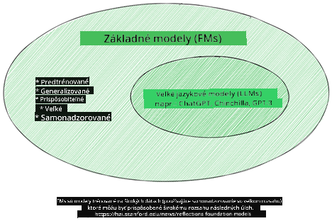
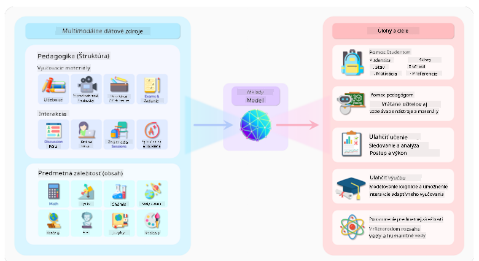
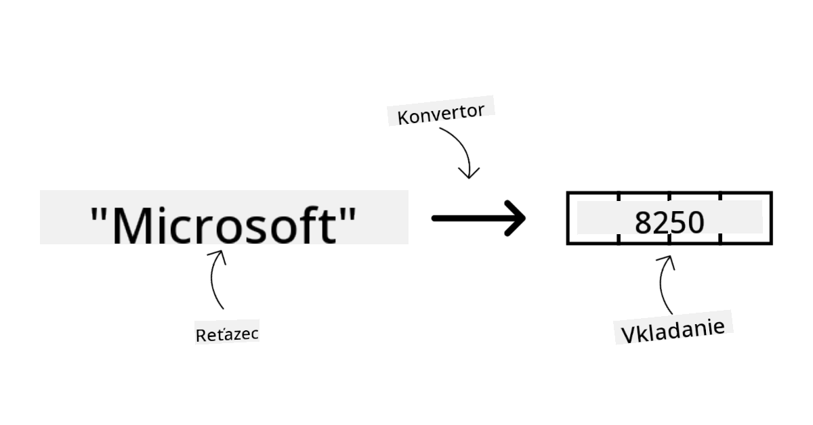
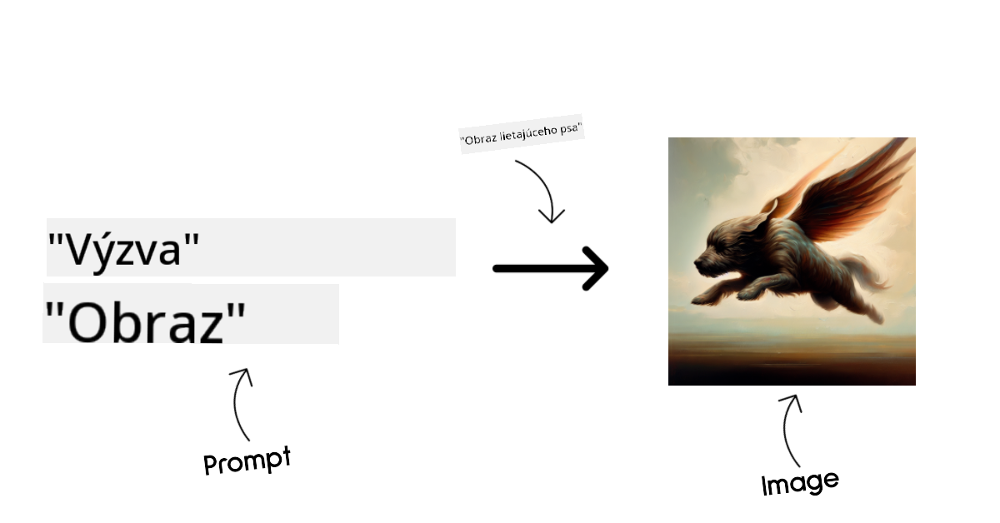
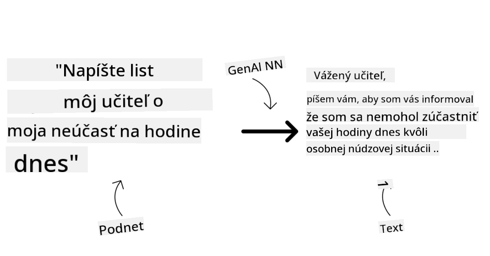
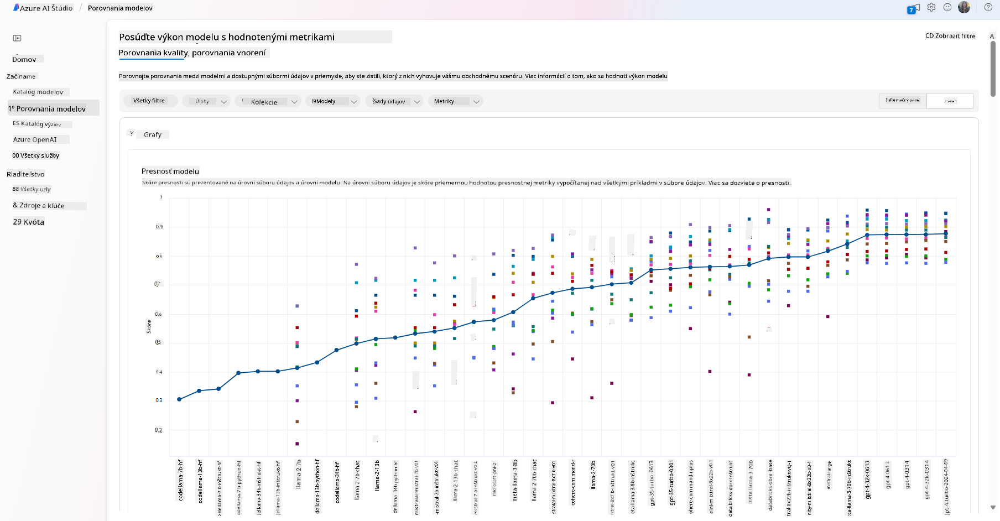
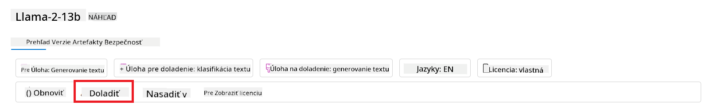
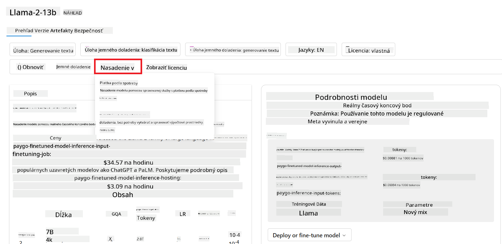
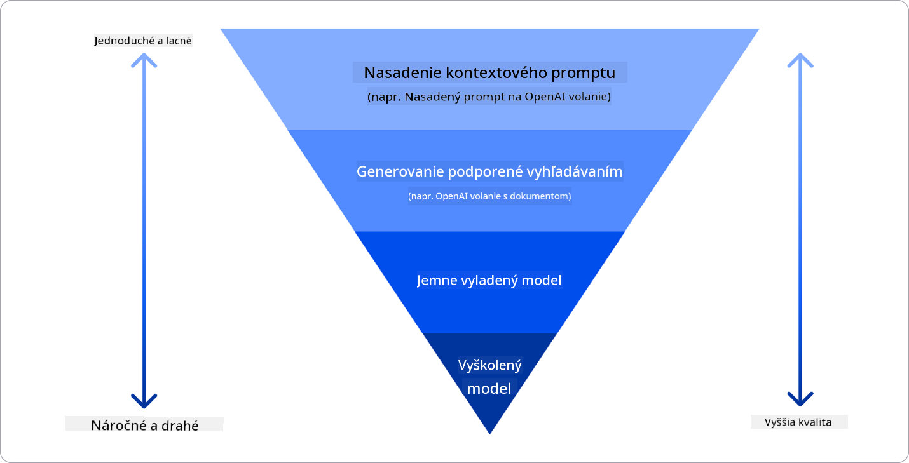

<!--
CO_OP_TRANSLATOR_METADATA:
{
  "original_hash": "e2f686f2eb794941761252ac5e8e090b",
  "translation_date": "2025-06-25T10:59:29+00:00",
  "source_file": "02-exploring-and-comparing-different-llms/README.md",
  "language_code": "sk"
}
-->
# Skúmanie a porovnávanie rôznych LLM

> _Kliknite na obrázok vyššie a pozrite si video tejto lekcie_

V predchádzajúcej lekcii sme videli, ako Generatívna AI mení technologickú krajinu, ako fungujú Veľké jazykové modely (LLM) a ako ich podnik - ako náš startup - môže aplikovať na svoje prípady použitia a rásť! V tejto kapitole sa chystáme porovnať a kontrastovať rôzne typy veľkých jazykových modelov (LLM), aby sme pochopili ich výhody a nevýhody.

Ďalším krokom v našej startupovej ceste je skúmanie súčasnej krajiny LLM a pochopenie, ktoré sú vhodné pre náš prípad použitia.

## Úvod

Táto lekcia pokryje:

- Rôzne typy LLM v súčasnej krajine.
- Testovanie, iterovanie a porovnávanie rôznych modelov pre váš prípad použitia v Azure.
- Ako nasadiť LLM.

## Ciele učenia

Po dokončení tejto lekcie budete schopní:

- Vybrať správny model pre váš prípad použitia.
- Pochopiť, ako testovať, iterovať a zlepšovať výkon vášho modelu.
- Vedieť, ako podniky nasadzujú modely.

## Pochopenie rôznych typov LLM

LLM môžu mať viacero kategorizácií na základe ich architektúry, tréningových dát a prípadov použitia. Pochopenie týchto rozdielov pomôže nášmu startupu vybrať správny model pre daný scenár a pochopiť, ako testovať, iterovať a zlepšovať výkon.

Existuje mnoho rôznych typov modelov LLM, váš výber modelu závisí od toho, na čo ich plánujete použiť, aké máte dáta, koľko ste pripravení zaplatiť a ďalšie faktory.

V závislosti od toho, či plánujete použiť modely na generovanie textu, zvuku, videa, obrázkov atď., môžete sa rozhodnúť pre iný typ modelu.

- **Rozpoznávanie zvuku a reči**. Pre tento účel sú modely typu Whisper skvelou voľbou, pretože sú univerzálne a zamerané na rozpoznávanie reči. Sú trénované na rôznorodom zvuku a dokážu vykonávať viacjazyčné rozpoznávanie reči. Viac informácií o [modeloch typu Whisper nájdete tu](https://platform.openai.com/docs/models/whisper?WT.mc_id=academic-105485-koreyst).

- **Generovanie obrázkov**. Pre generovanie obrázkov sú DALL-E a Midjourney dve veľmi známe voľby. DALL-E je ponúkaný Azure OpenAI. [Prečítajte si viac o DALL-E tu](https://platform.openai.com/docs/models/dall-e?WT.mc_id=academic-105485-koreyst) a tiež v kapitole 9 tohto kurikula.

- **Generovanie textu**. Väčšina modelov je trénovaná na generovanie textu a máte širokú škálu možností od GPT-3.5 po GPT-4. Prichádzajú s rôznymi nákladmi, pričom GPT-4 je najdrahší. Stojí za to pozrieť sa na [Azure OpenAI playground](https://oai.azure.com/portal/playground?WT.mc_id=academic-105485-koreyst), aby ste zhodnotili, ktoré modely najlepšie vyhovujú vašim potrebám z hľadiska schopností a nákladov.

- **Multimodalita**. Ak sa snažíte spracovávať viacero typov dát na vstupe a výstupe, môžete sa pozrieť na modely ako [gpt-4 turbo s víziou alebo gpt-4o](https://learn.microsoft.com/azure/ai-services/openai/concepts/models#gpt-4-and-gpt-4-turbo-models?WT.mc_id=academic-105485-koreyst) - najnovšie verzie modelov OpenAI - ktoré sú schopné kombinovať spracovanie prirodzeného jazyka s vizuálnym porozumením, čo umožňuje interakcie prostredníctvom multimodálnych rozhraní.

Výber modelu znamená, že získate základné schopnosti, ktoré však nemusia byť dostatočné. Často máte špecifické dáta spoločnosti, o ktorých musíte nejako informovať LLM. Existuje niekoľko rôznych možností, ako k tomu pristúpiť, viac o tom v nasledujúcich sekciách.

### Základné modely verzus LLM

Termín Základný model bol [vytvorený výskumníkmi zo Stanfordu](https://arxiv.org/abs/2108.07258?WT.mc_id=academic-105485-koreyst) a definovaný ako AI model, ktorý spĺňa určité kritériá, ako napríklad:

- **Sú trénované pomocou nesupervízovaného učenia alebo samo-supervízovaného učenia**, čo znamená, že sú trénované na neoznačených multimodálnych dátach a nevyžadujú ľudskú anotáciu alebo označovanie dát pre ich tréningový proces.
- **Sú veľmi veľké modely**, založené na veľmi hlbokých neurónových sieťach trénovaných na miliardách parametrov.
- **Zvyčajne sú určené ako ‘základ’ pre iné modely**, čo znamená, že môžu byť použité ako východiskový bod pre iné modely, ktoré sa môžu na nich stavať, čo sa dá dosiahnuť jemným doladením.

Zdroj obrázku: [Essential Guide to Foundation Models and Large Language Models | by Babar M Bhatti | Medium](https://thebabar.medium.com/essential-guide-to-foundation-models-and-large-language-models-27dab58f7404)

Aby sme ďalej objasnili toto rozlíšenie, vezmime si ChatGPT ako príklad. Na vytvorenie prvej verzie ChatGPT slúžil model nazývaný GPT-3.5 ako základný model. To znamená, že OpenAI použil niektoré chat-špecifické dáta na vytvorenie vyladeného modelu GPT-3.5, ktorý bol špecializovaný na dobré výkony v konverzačných scenároch, ako sú chatboti.

Zdroj obrázku: [2108.07258.pdf (arxiv.org)](https://arxiv.org/pdf/2108.07258.pdf?WT.mc_id=academic-105485-koreyst)

### Otvorený zdroj verzus Vlastnícke modely

Ďalším spôsobom, ako kategorizovať LLM, je, či sú otvorené alebo vlastnícke.

Otvorené modely sú modely, ktoré sú sprístupnené verejnosti a môžu byť použité kýmkoľvek. Často sú sprístupnené spoločnosťou, ktorá ich vytvorila, alebo výskumnou komunitou. Tieto modely je možné kontrolovať, upravovať a prispôsobovať pre rôzne prípady použitia v LLM. Avšak nie sú vždy optimalizované pre produkčné použitie a nemusia byť tak výkonné ako vlastnícke modely. Navyše, financovanie otvorených modelov môže byť obmedzené a nemusia byť dlhodobo udržiavané alebo aktualizované s najnovším výskumom. Príklady populárnych otvorených modelov zahŕňajú [Alpaca](https://crfm.stanford.edu/2023/03/13/alpaca.html?WT.mc_id=academic-105485-koreyst), [Bloom](https://huggingface.co/bigscience/bloom) a [LLaMA](https://llama.meta.com).

Vlastnícke modely sú modely, ktoré sú vlastnené spoločnosťou a nie sú sprístupnené verejnosti. Tieto modely sú často optimalizované pre produkčné použitie. Avšak nie sú povolené na kontrolu, úpravu alebo prispôsobenie pre rôzne prípady použitia. Navyše, nie sú vždy dostupné zadarmo a môžu vyžadovať predplatné alebo platbu za použitie. Používatelia tiež nemajú kontrolu nad dátami, ktoré sú použité na tréning modelu, čo znamená, že by mali dôverovať vlastníkovi modelu, že zabezpečí záväzok k ochrane údajov a zodpovednému používaniu AI. Príklady populárnych vlastníckych modelov zahŕňajú [OpenAI modely](https://platform.openai.com/docs/models/overview?WT.mc_id=academic-105485-koreyst), [Google Bard](https://sapling.ai/llm/bard?WT.mc_id=academic-105485-koreyst) alebo [Claude 2](https://www.anthropic.com/index/claude-2?WT.mc_id=academic-105485-koreyst).

### Vloženie verzus Generovanie obrázkov verzus Generovanie textu a kódu

LLM môžu byť tiež kategorizované podľa výstupu, ktorý generujú.

Vloženia sú súbor modelov, ktoré dokážu konvertovať text na číselnú formu, nazývanú vloženie, čo je číselná reprezentácia vstupného textu. Vloženia uľahčujú strojom porozumieť vzťahom medzi slovami alebo vetami a môžu byť použité ako vstupy pre iné modely, ako sú klasifikačné modely alebo modely zhlukovania, ktoré majú lepší výkon na číselných dátach. Modely vložení sú často používané pre transferové učenie, kde je model postavený pre náhradnú úlohu, pre ktorú je dostatok dát, a potom sú váhy modelu (vloženia) znovu použité pre iné následné úlohy. Príkladom tejto kategórie je [OpenAI vloženia](https://platform.openai.com/docs/models/embeddings?WT.mc_id=academic-105485-koreyst).

Modely generovania obrázkov sú modely, ktoré generujú obrázky. Tieto modely sú často používané pre úpravu obrázkov, syntézu obrázkov a preklad obrázkov. Modely generovania obrázkov sú často trénované na veľkých datasetoch obrázkov, ako je [LAION-5B](https://laion.ai/blog/laion-5b/?WT.mc_id=academic-105485-koreyst), a môžu byť použité na generovanie nových obrázkov alebo na úpravu existujúcich obrázkov pomocou techník ako doplňovanie, super-rozlíšenie a kolorovanie. Príklady zahŕňajú [DALL-E-3](https://openai.com/dall-e-3?WT.mc_id=academic-105485-koreyst) a [Stable Diffusion modely](https://github.com/Stability-AI/StableDiffusion?WT.mc_id=academic-105485-koreyst).

Modely generovania textu a kódu sú modely, ktoré generujú text alebo kód. Tieto modely sú často používané pre sumarizáciu textu, preklad a odpovedanie na otázky. Modely generovania textu sú často trénované na veľkých datasetoch textu, ako je [BookCorpus](https://www.cv-foundation.org/openaccess/content_iccv_2015/html/Zhu_Aligning_Books_and_ICCV_2015_paper.html?WT.mc_id=academic-105485-koreyst), a môžu byť použité na generovanie nového textu alebo na odpovedanie na otázky. Modely generovania kódu, ako [CodeParrot](https://huggingface.co/codeparrot?WT.mc_id=academic-105485-koreyst), sú často trénované na veľkých datasetoch kódu, ako je GitHub, a môžu byť použité na generovanie nového kódu alebo na opravu chýb v existujúcom kóde.

### Encoder-Decoder verzus Iba Decoder

Aby sme hovorili o rôznych typoch architektúr LLM, použijeme analógiu.

Predstavte si, že váš manažér vám dal úlohu napísať kvíz pre študentov. Máte dvoch kolegov; jeden má na starosti vytváranie obsahu a druhý má na starosti ich kontrolu.

Tvorca obsahu je ako model Iba Decoder, dokáže sa pozrieť na tému a vidieť, čo ste už napísali, a potom môže napísať kurz na základe toho. Sú veľmi dobrí v písaní pútavého a informatívneho obsahu, ale nie sú veľmi dobrí v porozumení témy a cieľov učenia. Niektoré príklady modelov Decoder sú modely rodiny GPT, ako je GPT-3.

Kontrolór je ako model Iba Encoder, pozerá sa na napísaný kurz a odpovede, všimne si vzťah medzi nimi a rozumie kontextu, ale nie je dobrý v generovaní obsahu. Príkladom modelu Iba Encoder by bol BERT.

Predstavte si, že by sme mohli mať niekoho, kto by mohol vytvárať a kontrolovať kvíz, toto je model Encoder-Decoder. Niektoré príklady by boli BART a T5.

### Služba verzus Model

Teraz si poďme povedať o rozdiele medzi službou a modelom. Služba je produkt, ktorý ponúka poskytovateľ cloudových služieb a je často kombináciou modelov, dát a ďalších komponentov. Model je základná súčasť služby a je často základným modelom, ako je LLM.

Služby sú často optimalizované pre produkčné použitie a sú často jednoduchšie na používanie ako modely, prostredníctvom grafického užívateľského rozhrania. Avšak služby nie sú vždy dostupné zadarmo a môžu vyžadovať predplatné alebo platbu za použitie, výmenou za využívanie vybavenia a zdrojov vlastníka služby, optimalizovanie výdavkov a jednoduché škálovanie. Príkladom služby je [Azure OpenAI Service](https://learn.microsoft.com/azure/ai-services/openai/overview?WT.mc_id=academic-105485-koreyst), ktorá ponúka plán platieb podľa použitia, čo znamená, že používatelia sú účtovaní proporcionálne k tomu, koľko služby využívajú. Tiež Azure OpenAI Service ponúka bezpečnosť na úrovni podniku a zodpovedný AI rámec na vrchole schopností modelov.

Modely sú len Neurónová sieť, s parametrami, váhami a ďalšími. Umožňujú spoločnostiam prevádzkovať lokálne, avšak potrebovali by zakúpiť vybavenie, vybudovať štruktúru na škálovanie a zakúpiť licenciu alebo použiť otvorený model. Model ako LLaMA je dostupný na použitie, vyžadujúci výpočtový výkon na spustenie modelu.

## Ako testovať a iterovať s rôznymi modelmi na pochopenie výkonu v Azure

Keď náš tím preskúmal súčasnú krajinu LLM a identifikoval niektoré dobré kandidáty pre svoje scenáre, ďalším krokom je ich testovanie na ich dátach a pracovnom zaťažení. Toto je iteratívny proces, vykonávaný experimentmi a meraniami. Väčšina modelov, ktoré sme spomenuli v predchádzajúcich odsekoch (OpenAI modely, otvorené modely ako Llama2 a Hugging Face transformátory) sú dostupné v [Katalógu modelov](https://learn.microsoft.com/azure/ai-studio/how-to/model-catalog-overview?WT.mc_id=academic-105485-koreyst) v [Azure AI Studio](https://ai.azure.com/?WT.mc_id=academic-105485-koreyst).

[Azure AI Studio](https://learn.microsoft.com/azure/ai-studio/what-is-ai-studio?WT.mc_id=academic-105485-koreyst) je cloudová platforma navrhnutá pre vývojárov na vytváranie generatívnych AI aplikácií a správu celého životného cyklu vývoja - od experimentovania po hodnotenie - kombinovaním všetkých Azure AI služieb do jedného centra s praktickým GUI. Katalóg modelov v Azure AI Studio umožňuje užívateľovi:

- Nájsť Základný model záujmu v katalógu - buď vlastnícky alebo otvorený, filtrovaním podľa úlohy, licencie alebo mena. Na zlepšenie vyhľadávania sú modely organizované do kolekcií, ako je kole
- Porovnajte referenčné hodnoty medzi modelmi a datasetmi dostupnými v priemysle, aby ste zistili, ktorý z nich vyhovuje obchodnému scenáru, cez panel [Model Benchmarks](https://learn.microsoft.com/azure/ai-studio/how-to/model-benchmarks?WT.mc_id=academic-105485-koreyst).

- Doladte model na vlastných tréningových dátach, aby ste zlepšili výkon modelu v konkrétnej pracovnej záťaži, využívajúc experimentačné a sledovacie schopnosti Azure AI Studio.

- Nasadte pôvodný predtrénovaný model alebo doladenú verziu na vzdialený inferenčný výpočtový uzol v reálnom čase alebo serverless api endpoint - [pay-as-you-go](https://learn.microsoft.com/azure/ai-studio/how-to/model-catalog-overview#model-deployment-managed-compute-and-serverless-api-pay-as-you-go?WT.mc_id=academic-105485-koreyst) - aby aplikácie mohli model využívať.

> [!NOTE]
> Nie všetky modely v katalógu sú momentálne dostupné na doladenie a/alebo nasadenie formou pay-as-you-go. Skontrolujte kartu modelu pre podrobnosti o schopnostiach a obmedzeniach modelu.

## Zlepšovanie výsledkov LLM

Skúmali sme s našim startupovým tímom rôzne druhy LLM a Cloud Platformu (Azure Machine Learning), ktoré nám umožňujú porovnávať rôzne modely, hodnotiť ich na testovacích dátach, zlepšovať výkon a nasadzovať ich na inferenčné koncové body.

Ale kedy by mali zvážiť doladenie modelu namiesto použitia predtrénovaného? Existujú iné prístupy na zlepšenie výkonu modelu pri konkrétnych pracovných záťažiach?

Existuje niekoľko prístupov, ktoré môže firma použiť na dosiahnutie požadovaných výsledkov z LLM. Pri nasadení LLM do produkcie môžete vybrať rôzne typy modelov s rôznymi stupňami tréningu, s rôznymi úrovňami zložitosti, nákladov a kvality. Tu sú niektoré rôzne prístupy:

- **Inžinierstvo promptov s kontextom**. Idea je poskytnúť dostatok kontextu pri vytváraní promptu, aby ste zabezpečili, že dostanete potrebné odpovede.

- **Retrieval Augmented Generation, RAG**. Vaše dáta môžu existovať napríklad v databáze alebo webovom koncovom bode. Aby ste zabezpečili, že tieto dáta alebo ich podmnožina sú zahrnuté pri vytváraní promptu, môžete načítať relevantné dáta a zahrnúť ich do užívateľského promptu.

- **Doladený model**. Tu ste model ďalej trénovali na vlastných dátach, čo viedlo k tomu, že model je presnejší a lepšie reaguje na vaše potreby, ale môže byť nákladný.

Zdroj obrázku: [Four Ways that Enterprises Deploy LLMs | Fiddler AI Blog](https://www.fiddler.ai/blog/four-ways-that-enterprises-deploy-llms?WT.mc_id=academic-105485-koreyst)

### Inžinierstvo promptov s kontextom

Predtrénované LLM fungujú veľmi dobre na všeobecných úlohách s prirodzeným jazykom, dokonca aj pri ich použití s krátkym promptom, ako je veta na dokončenie alebo otázka – tzv. “zero-shot” učenie.

Avšak čím viac môže užívateľ definovať svoju otázku, s podrobnou požiadavkou a príkladmi – Kontext – tým presnejšia a bližšia očakávaniam užívateľa bude odpoveď. V tomto prípade hovoríme o “one-shot” učení, ak prompt obsahuje len jeden príklad, a “few-shot learning”, ak obsahuje viacero príkladov.
Inžinierstvo promptov s kontextom je najnákladovo efektívnejší prístup na začiatok.

### Retrieval Augmented Generation (RAG)

LLM majú obmedzenie, že môžu použiť len dáta, ktoré boli použité počas ich tréningu na generovanie odpovede. To znamená, že nevedia nič o faktoch, ktoré sa stali po ich tréningovom procese, a nemôžu pristupovať k neverejným informáciám (ako firemné dáta).
Toto sa dá prekonať pomocou RAG, techniky, ktorá rozširuje prompt o externé dáta vo forme blokov dokumentov, s ohľadom na limity dĺžky promptu. Toto je podporované nástrojmi pre vektorové databázy (ako [Azure Vector Search](https://learn.microsoft.com/azure/search/vector-search-overview?WT.mc_id=academic-105485-koreyst)), ktoré získavajú užitočné bloky z rôznych preddefinovaných zdrojov dát a pridávajú ich do kontextu promptu.

Táto technika je veľmi užitočná, keď firma nemá dostatok dát, času alebo zdrojov na doladenie LLM, ale stále chce zlepšiť výkon pri konkrétnej pracovnej záťaži a znížiť riziko fabrikácií, t.j. mystifikácie reality alebo škodlivého obsahu.

### Doladený model

Doladenie je proces, ktorý využíva transferové učenie na ‘prispôsobenie’ modelu k následnej úlohe alebo na riešenie konkrétneho problému. Na rozdiel od few-shot učenia a RAG, výsledkom je nový model, ktorý je generovaný s aktualizovanými váhami a biasmi. Vyžaduje súbor tréningových príkladov pozostávajúcich z jedného vstupu (promptu) a jeho súvisiaceho výstupu (dokončenie).
Toto by bol preferovaný prístup, ak:

- **Použitie doladených modelov**. Firma by chcela použiť doladené menej schopné modely (ako embedding modely) namiesto vysoko výkonných modelov, čo vedie k nákladovo efektívnejšiemu a rýchlejšiemu riešeniu.

- **Zohľadnenie latencie**. Latencia je dôležitá pre konkrétny prípad použitia, takže nie je možné použiť veľmi dlhé prompty alebo počet príkladov, ktoré by sa mali naučiť z modelu, nesúhlasí s limitom dĺžky promptu.

- **Udržiavanie aktuálnosti**. Firma má veľa vysokokvalitných dát a ground truth labelov a zdroje potrebné na udržanie týchto dát aktuálnymi v priebehu času.

### Trénovaný model

Tréning LLM od začiatku je bezpochyby najťažší a najkomplexnejší prístup na prijatie, vyžadujúci obrovské množstvo dát, kvalifikované zdroje a vhodnú výpočtovú silu. Táto možnosť by mala byť zvažovaná len v scenári, kde firma má prípad použitia špecifický pre doménu a veľké množstvo dát zameraných na doménu.

## Kontrola vedomostí

Čo by mohol byť dobrý prístup na zlepšenie výsledkov dokončenia LLM?

1. Inžinierstvo promptov s kontextom
1. RAG
1. Doladený model

A:3, ak máte čas a zdroje a vysokokvalitné dáta, doladenie je lepšou možnosťou na udržanie aktuálnosti. Avšak, ak sa zameriavate na zlepšenie vecí a chýba vám čas, stojí za to zvážiť najprv RAG.

## 🚀 Výzva

Prečítajte si viac o tom, ako môžete [použiť RAG](https://learn.microsoft.com/azure/search/retrieval-augmented-generation-overview?WT.mc_id=academic-105485-koreyst) pre váš biznis.

## Skvelá práca, pokračujte vo svojom vzdelávaní

Po dokončení tejto lekcie si pozrite našu [kolekciu Generative AI Learning](https://aka.ms/genai-collection?WT.mc_id=academic-105485-koreyst), aby ste pokračovali v zvyšovaní svojej znalosti o Generative AI!

Prejdite na Lekciu 3, kde sa pozrieme na to, ako [budovať s Generative AI zodpovedne](../03-using-generative-ai-responsibly/README.md?WT.mc_id=academic-105485-koreyst)!

**Upozornenie**:  
Tento dokument bol preložený pomocou služby pre automatický preklad [Co-op Translator](https://github.com/Azure/co-op-translator). Aj keď sa snažíme o presnosť, uvedomte si, že automatizované preklady môžu obsahovať chyby alebo nepresnosti. Pôvodný dokument v jeho rodnom jazyku by mal byť považovaný za autoritatívny zdroj. Pre kritické informácie sa odporúča profesionálny ľudský preklad. Nie sme zodpovední za akékoľvek nedorozumenia alebo nesprávne interpretácie vyplývajúce z použitia tohto prekladu.