# Preskúmanie a porovnávanie rôznych LLM

[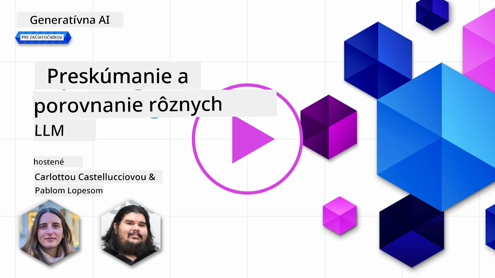](https://youtu.be/KIRUeDKscfI?si=8BHX1zvwzQBn-PlK)

> _Kliknite na obrázok vyššie pre zobrazenie videa tejto lekcie_

V predchádzajúcej lekcii sme videli, ako Generatívna AI mení technologickú krajinu, ako fungujú Veľké jazykové modely (LLM) a ako ich môže podnik - ako náš startup - aplikovať na svoje prípadové použitia a rásť! V tejto kapitole sa zameriame na porovnanie a kontrast rôznych typov veľkých jazykových modelov (LLM), aby sme porozumeli ich výhodám a nevýhodám.

Ďalším krokom v našej startupovej ceste je preskúmať súčasnú krajinu LLM a zistiť, ktoré sú vhodné pre náš prípad použitia.

## Úvod

Táto lekcia pokryje:

- Rôzne typy LLM v súčasnej krajine.
- Testovanie, iterovanie a porovnávanie rôznych modelov pre váš prípad použitia v Azure.
- Ako nasadiť LLM.

## Ciele učenia

Po dokončení tejto lekcie budete schopní:

- Vybrať správny model pre váš prípad použitia.
- Pochopiť, ako testovať, iterovať a zlepšovať výkon vášho modelu.
- Vedieť, ako podniky nasadzujú modely.

## Pochopenie rôznych typov LLM

LLM môžu mať rôzne kategorizácie založené na ich architektúre, tréningových dátach a prípadov použitia. Pochopenie týchto rozdielov pomôže nášmu startupu vybrať správny model pre daný scenár a porozumieť, ako testovať, iterovať a zlepšovať výkon.

Existuje mnoho rôznych typov LLM modelov, váš výber modelu závisí od toho, na čo ich chcete používať, vašich dát, koľko ste ochotní zaplatiť a ďalších faktorov.

Podľa toho, či chcete modely používať na text, zvuk, video, generovanie obrázkov a podobne, môžete zvoliť iný typ modelu.

- **Audio a rozpoznávanie reči**. Modely typu Whisper sú stále užitočné ako všeobecné modely pre rozpoznávanie reči, no produkčné možnosti teraz zahŕňajú aj novšie modely na konverziu reči na text, ako sú `gpt-4o-transcribe`, `gpt-4o-mini-transcribe` a varianty na diarizáciu. Vyhodnoťte jazykové pokrytie, diarizáciu, podporu v reálnom čase, latenciu a náklady pre váš scenár. Viac sa dozviete v [OpenAI dokumentácii pre konverziu reči na text](https://platform.openai.com/docs/guides/speech-to-text?WT.mc_id=academic-105485-koreyst).

- **Generovanie obrázkov**. DALL-E a Midjourney sú známe možnosti generovania obrázkov, no aktuálne OpenAI API pre obrázky sa sústredí na GPT Image modely ako `gpt-image-2`, pričom modelové rodiny Stable Diffusion, Imagen, Flux a ďalšie sú tiež bežnou voľbou. Porovnajte vernosť promptu, podporu úprav, kontrolu štýlu, požiadavky na bezpečnosť a licencovanie. Viac informácií nájdete v [OpenAI návode na generovanie obrázkov](https://platform.openai.com/docs/guides/images?WT.mc_id=academic-105485-koreyst) a v kapitole 9 tohto kurikula.

- **Generovanie textu**. Textové modely teraz zahŕňajú špičkové modely, modely na uvažovanie, menšie nízkolatentné modely a open-weight modely. Príklady zahŕňajú OpenAI GPT-5.x modely, Anthropic Claude 4.x modely, Google Gemini 3.x modely, Meta Llama 4 modely a Mistral modely. Nevyberajte iba podľa dátumu vydania alebo ceny; porovnajte kvalitu úlohy, latenciu, kontextové okno, používanie nástrojov, správanie za bezpečnosť, dostupnosť podľa regiónu a celkové náklady. [Microsoft Foundry modelový katalóg](https://ai.azure.com/catalog?WT.mc_id=academic-105485-koreyst) je dobrým miestom na porovnanie modelov dostupných v Azure.

- **Multi-modálne modely**. Mnohé súčasné modely dokážu spracovávať viac než len text. Niektoré prijímajú vstupy obrázkov, zvuku alebo videa; iné môžu volať nástroje; a špecializované modely vedia generovať obrázky, zvuk alebo video. Napríklad aktuálne OpenAI modely podporujú textový a obrazový vstup, Gemini modely môžu podporovať text, kód, obrázky, zvuk a video podľa verzie a Llama 4 Scout a Maverick sú natively multimodálne open-weight modely. Vždy skontrolujte kartu modelu pre podporované vstupy a výstupy predtým, ako začnete budovať workflow.

Výber modelu znamená, že získate základné schopnosti, ktoré však nemusia byť dostatočné. Často máte špecifické dáta spoločnosti, o ktorých potrebujete LLM nejako informovať. Existuje niekoľko rôznych spôsobov, ako k tomu pristúpiť, o ktorých bude viac v nasledujúcich sekciách.

### Základné modely verzus LLM

Termín Základný model (Foundation Model) bol [vymyslený výskumníkmi zo Stanfordu](https://arxiv.org/abs/2108.07258?WT.mc_id=academic-105485-koreyst) a definuje sa ako AI model, ktorý spĺňa niektoré kritériá, ako napríklad:

- **Sú trénované pomocou neoznačeného učenia alebo samo-učenia**, čo znamená, že sú trénované na neoznačených multimodálnych dátach a nevyžadujú ľudskú anotáciu alebo označovanie dát pre tréning.
- **Sú veľmi veľké modely**, založené na veľmi hlbokých neurónových sieťach trénovaných na miliardách parametrov.
- **Normálne sú určené na použitie ako 'základ' pre iné modely**, teda môžu slúžiť ako východiskový bod pre iné modely, ktoré sa potom môžu doladiť.

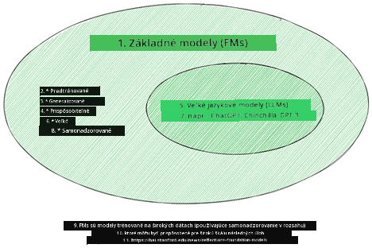

Zdroj obrázka: [Essential Guide to Foundation Models and Large Language Models | by Babar M Bhatti | Medium
](https://thebabar.medium.com/essential-guide-to-foundation-models-and-large-language-models-27dab58f7404)

Aby sme túto distinkciu viac objasnili, vezmime ako historický príklad ChatGPT. Skoré verzie ChatGPT používali GPT-3.5 ako základný model. OpenAI potom použila chatovo špecifické dáta a techniky zosúladenia na vytvorenie vyladených verzií, ktoré lepšie fungovali v konverzačných scenároch, ako sú chatboty. Moderné AI služby často prepínajú medzi niekoľkými variantmi modelov, takže názov služby a základný model nie sú vždy tou istou vecou.

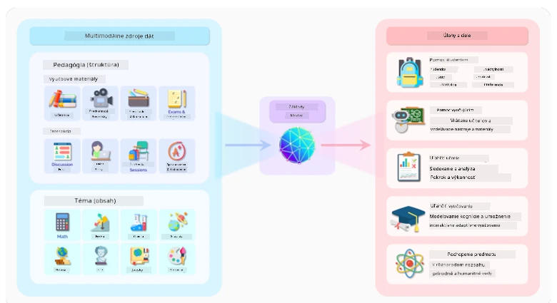

Zdroj obrázka: [2108.07258.pdf (arxiv.org)](https://arxiv.org/pdf/2108.07258.pdf?WT.mc_id=academic-105485-koreyst)

### Open-weight/Open-Source verzus Proprietárne modely

Ďalším spôsobom, ako kategorizovať LLM, je podľa toho, či sú open-weight, open-source alebo proprietárne.

Open-source a open-weight modely sprístupňujú artefakty modelu na inšpekciu, stiahnutie alebo prispôsobenie, ale ich licencie sa líšia. Niektoré sú úplne open source, iné sú open-weight modely s obmedzeniami použitia. Môžu byť užitočné, keď podnik potrebuje väčšiu kontrolu nad nasadením, lokalitou dát, nákladmi alebo prispôsobením. Tímy však musia stále preskúmať licenčné podmienky, náklady na prevádzku, údržbu, bezpečnostné aktualizácie a kvalitu evaluácie pred použitím v produkcii. Príklady zahŕňajú [Meta Llama 4](https://ai.meta.com/blog/llama-4-multimodal-intelligence/?WT.mc_id=academic-105485-koreyst), niektoré [Mistral modely](https://docs.mistral.ai/models/overview?WT.mc_id=academic-105485-koreyst) a množstvo modelov hosťovaných na [Hugging Face](https://huggingface.co/models?WT.mc_id=academic-105485-koreyst).

Proprietárne modely sú vlastnené a hosťované poskytovateľom. Tieto modely sú často optimalizované pre spravovanú produkčnú prevádzku a môžu ponúknuť silnú podporu, bezpečnostné systémy, integráciu nástrojov a škálovateľnosť. Zákazníci však obvykle nemôžu inšpektovať alebo modifikovať váhy modelu a musia si preštudovať podmienky poskytovateľa týkajúce sa súkromia, uchovávania, súladu a akceptovateľného použitia. Príklady zahŕňajú [OpenAI modely](https://platform.openai.com/docs/models?WT.mc_id=academic-105485-koreyst), [Google Gemini](https://deepmind.google/models/gemini/pro/?WT.mc_id=academic-105485-koreyst) a [Anthropic Claude](https://platform.claude.com/docs/en/about-claude/models/overview?WT.mc_id=academic-105485-koreyst).

### Embedding verzus Generovanie obrázkov verzus Generovanie textu a kódu

LLM sa dajú kategorizovať podľa výstupu, ktorý generujú.

Embeddingy sú súbor modelov, ktoré vedia previesť text do číselnej formy, nazývanej embedding, čo je číselná reprezentácia vstupného textu. Embeddingy uľahčujú strojom pochopiť vzťahy medzi slovami alebo vetami a môžu byť použité ako vstupy pre ďalšie modely, napríklad klasifikačné modely alebo modely zhlukovania, ktoré majú lepší výkon na číselných dátach. Embedding modely sa často používajú na transfer learning, kde sa model vybuduje pre surrogátny úlohu, pre ktorú je veľa dát, a potom sa váhy modelu (embeddingy) znovu použijú pre ďalšie downstream úlohy. Príkladom tejto kategórie sú [OpenAI embeddingy](https://platform.openai.com/docs/models/embeddings?WT.mc_id=academic-105485-koreyst).

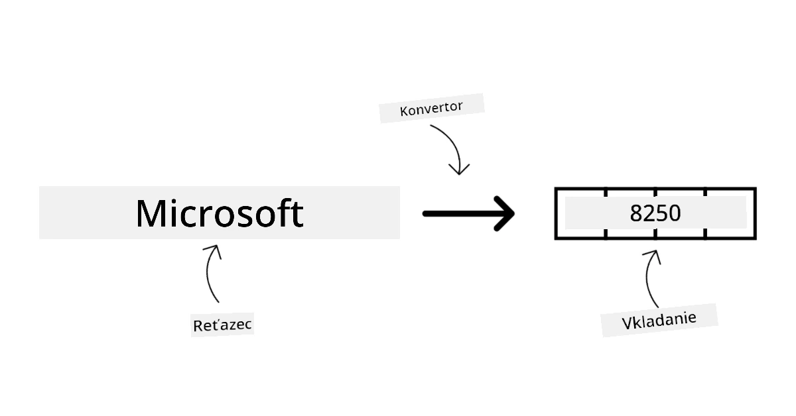

Generovanie obrázkov sú modely, ktoré generujú obrázky. Tieto modely sa často používajú na úpravu obrázkov, syntézu obrázkov a preklad obrázkov. Modely na generovanie obrázkov sa často trénujú na veľkých dátových sadách obrázkov, napríklad na [LAION-5B](https://laion.ai/blog/laion-5b/?WT.mc_id=academic-105485-koreyst) a môžu sa používať na generovanie nových obrázkov alebo na úpravu existujúcich obrázkov pomocou techník inpaintingu, super-rozlíšenia a kolorovania. Príklady sú [GPT Image modely](https://platform.openai.com/docs/guides/images?WT.mc_id=academic-105485-koreyst), [Stable Diffusion modely](https://github.com/Stability-AI/StableDiffusion?WT.mc_id=academic-105485-koreyst) a Imagen modely.

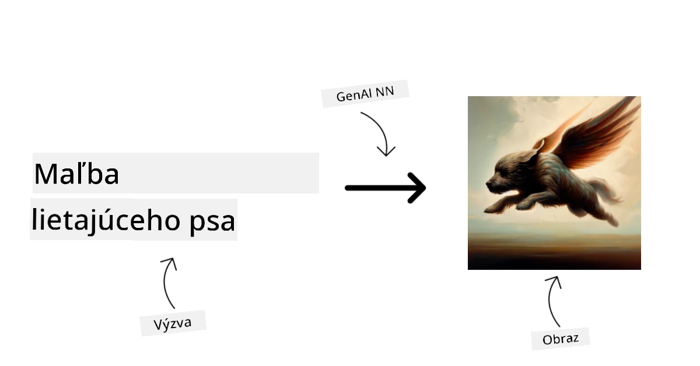

Modely na generovanie textu a kódu sú modely, ktoré generujú text alebo kód. Tieto modely sa často používajú na zhrnutie textu, prekladanie alebo odpovedanie na otázky. Textové generatívne modely sa často trénujú na veľkých dátových sadách textu, napríklad [BookCorpus](https://www.cv-foundation.org/openaccess/content_iccv_2015/html/Zhu_Aligning_Books_and_ICCV_2015_paper.html?WT.mc_id=academic-105485-koreyst) a môžu sa používať na generovanie nového textu alebo na odpovedanie na otázky. Modely na generovanie kódu, ako [CodeParrot](https://huggingface.co/codeparrot?WT.mc_id=academic-105485-koreyst), sa často trénujú na veľkých dátových sadách kódu, napríklad GitHub, a môžu sa používať na generovanie nového kódu alebo na opravu chýb v existujúcom kóde.

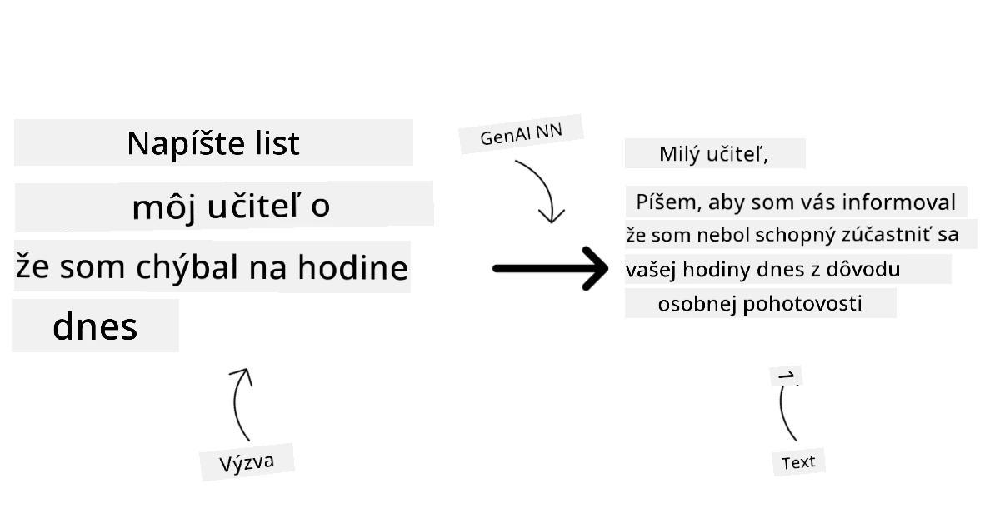

### Encoder-Decoder verzus Iba Decoder

Na rozhovor o rôznych typoch architektúr LLM použijeme analógiu.

Predstavte si, že vám manažér zadal úlohu napísať kvíz pre študentov. Máte dvoch kolegov; jeden z nich dohliada na tvorbu obsahu a druhý na jeho kontrolu.

Tvorca obsahu je ako model iba s decoderom: môže sa pozrieť na tému, vidieť, čo už ste napísali, a potom pokračovať v generovaní obsahu na základe tohto kontextu. Sú veľmi dobrí v písaní pútavého a informatívneho obsahu, no nie sú vždy najlepšou voľbou, keď je úlohou iba klasifikovať, vyhľadávať alebo kódovať informácie. Príklady rodín decoder-only modelov zahŕňajú GPT a Llama modely.

Kontrolór je ako model iba s encoderom, pozerá sa na napísaný kurz a odpovede, všíma si vzťah medzi nimi a chápe kontext, no nie je dobrý v generovaní obsahu. Príkladom encoder-only modelu je BERT.

Predstavte si, že by sme mohli mať niekoho, kto by mohol tvorbu aj kontrolu kvízu robiť súčasne, to je Encoder-Decoder model. Niektoré príklady sú BART a T5.

### Služba verzus Model

Teraz si porozprávajme o rozdiele medzi službou a modelom. Služba je produkt, ktorý ponúka poskytovateľ cloudových služieb, a často je to kombinácia modelov, dát a ďalších komponentov. Model je jadro služby a často je to základný model, ako LLM.

Služby sú často optimalizované pre produkčné použitie a sú často jednoduchšie na používanie ako modely cez grafické užívateľské rozhranie. Avšak služby nie sú vždy k dispozícii zadarmo a môžu vyžadovať predplatné alebo platbu za použitie, výmenou za využívanie vybavenia a zdrojov vlastníka služby, optimalizáciu nákladov a jednoduché škálovanie. Príkladom služby je [Azure OpenAI Service](https://learn.microsoft.com/azure/ai-services/openai/overview?WT.mc_id=academic-105485-koreyst), ktorá ponúka tarifný plán pay-as-you-go, teda používateľ je účtovaný proporcionálne podľa toho, koľko službu využíva. Azure OpenAI Service tiež ponúka podnikovej úrovne bezpečnosť a rámec zodpovednej AI nad schopnosťami modelov.

Modely sú artefakty neurónovej siete: parametre, váhy, architektúra, tokenizer a podporná konfigurácia. Spustenie modelu lokálne alebo v súkromnom prostredí vyžaduje vhodný hardvér, infraštruktúru pre prevádzku, monitorovanie a buď kompatibilnú open-source/open-weight licenciu alebo komerčnú licenciu. Open-weight modely ako Llama 4 alebo Mistral modely je možné hosťovať samostatne, ale stále vyžadujú výpočtový výkon a prevádzkové znalosti.

## Ako testovať a iterovať s rôznymi modelmi na pochopenie výkonu v Azure

Keď náš tím preskúmal súčasný stav LLM a identifikoval niekoľko vhodných kandidátov pre ich scenáre, ďalším krokom je ich testovanie na ich dátach a pracovnej záťaži. Je to iteratívny proces, ktorý prebieha prostredníctvom experimentov a meraní.
Väčšina modelov, ktoré sme spomenuli v predchádzajúcich odstavcoch (modely OpenAI, modely s otvorenou váhou ako Llama 4 a Mistral a modely Hugging Face), je k dispozícii v [Microsoft Foundry Models](https://learn.microsoft.com/azure/foundry/concepts/foundry-models-overview?WT.mc_id=academic-105485-koreyst).

[Microsoft Foundry](https://learn.microsoft.com/azure/foundry/what-is-foundry?WT.mc_id=academic-105485-koreyst), predtým Azure AI Studio/Azure AI Foundry, je jednotná platforma Azure na budovanie aplikácií AI a agentov. Pomáha vývojárom spravovať životný cyklus od experimentovania a hodnotenia až po nasadenie, monitorovanie a správu. Katalóg modelov v Microsoft Foundry umožňuje používateľovi:

- Nájsť základný model záujmu v katalógu, vrátane modelov predávaných Azure a modelov od partnerov a poskytovateľov komunity. Používatelia môžu filtrovať podľa úlohy, poskytovateľa, licencie, možnosti nasadenia alebo názvu.

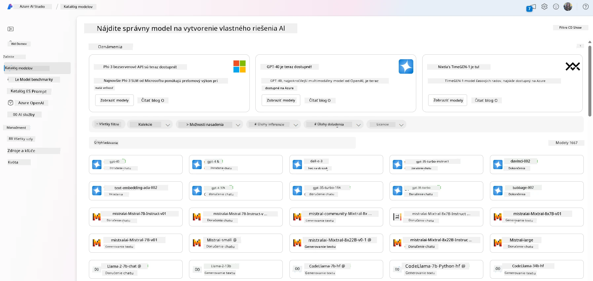

- Prezrieť si kartu modelu, vrátane podrobného popisu zamýšľaného použitia a tréningových dát, ukážok kódu a výsledkov hodnotenia v internej knižnici hodnotení.

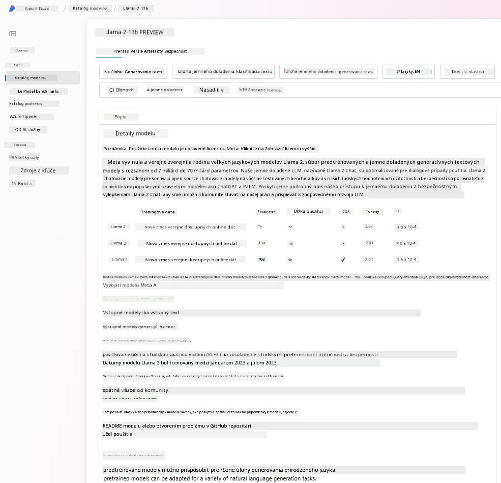

- Porovnať benchmarky naprieč modelmi a datasetmi dostupnými v odvetví, aby ste zistili, ktorý najlepšie vyhovuje obchodnému scenáru, prostredníctvom panelu [Model Benchmarks](https://learn.microsoft.com/azure/ai-studio/how-to/model-benchmarks?WT.mc_id=academic-105485-koreyst).

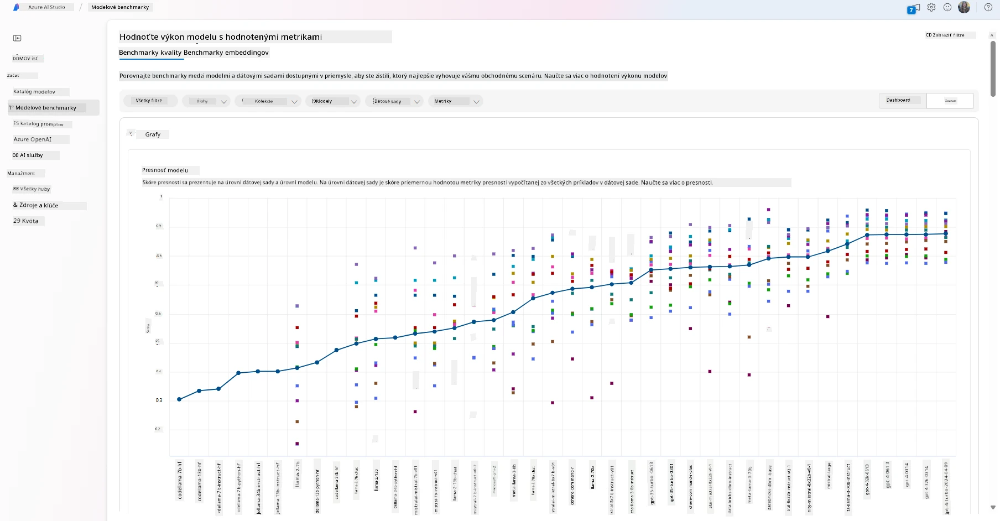

- Vylaďovať podporované modely na vlastných tréningových dátach na zlepšenie výkonu modelu v konkrétnej pracovnej záťaži, využívajúc schopnosti experimentovania a sledovania v Microsoft Foundry.

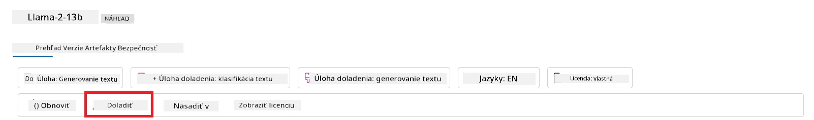

- Nasadiť pôvodný predtrénovaný model alebo vylaďovanú verziu na vzdialený endpoint pre inferenciu v reálnom čase, využívajúc spravované výpočty alebo serverless možnosti nasadenia, aby aplikácie mohli model využívať.

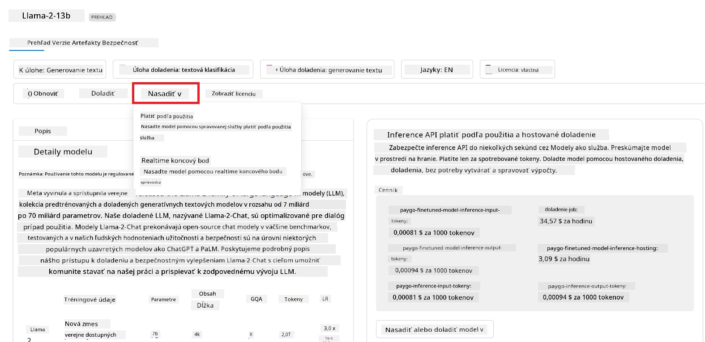

> [!NOTE]
> Nie všetky modely v katalógu sú momentálne dostupné na vylaďovanie a/alebo platby podľa využitia pri nasadení. Skontrolujte kartu modelu pre detaily o schopnostiach a obmedzeniach modelu.

## Zlepšovanie výsledkov LLM

Náš startupový tím preskúmal rôzne druhy LLM a cloudovú platformu (Microsoft Foundry), ktorá nám umožňuje porovnávať rôzne modely, hodnotiť ich na testovacích dátach, zlepšovať výkon a nasadzovať ich na inferenčných endpointoch.

Ale kedy by mali uvažovať o vylaďovaní modelu namiesto použitia predtrénovaného? Existujú iné prístupy na zlepšenie výkonu modelu v konkrétnych pracovných záťažiach?

Existuje niekoľko prístupov, ktoré môže firma použiť, aby dosiahla potrebné výsledky z LLM. Pri nasadení LLM do produkcie si môžete vybrať rôzne typy modelov s rôznymi stupňami tréningu, s rôznou úrovňou komplexnosti, nákladov a kvality. Tu sú niektoré prístupy:

- **Prompt engineering s kontextom**. Myšlienkou je poskytnúť dostatok kontextu pri vyvolaní (prompte), aby ste dostali požadované odpovede.

- **Retrieval Augmented Generation, RAG**. Vaše dáta môžu existovať napríklad v databáze alebo webovom endpoint-e, a aby sa tieto dáta, alebo ich podmnožina, zahrnuli v čase vyvolania, môžete načítať relevantné dáta a spraviť ich súčasťou promptu používateľa.

- **Model vylaďovaný na mieru**. Tu ste model ďalej trénovali na vlastných dátach, čo viedlo k tomu, že model je presnejší a citlivejší na vaše potreby, ale môže to byť nákladné.

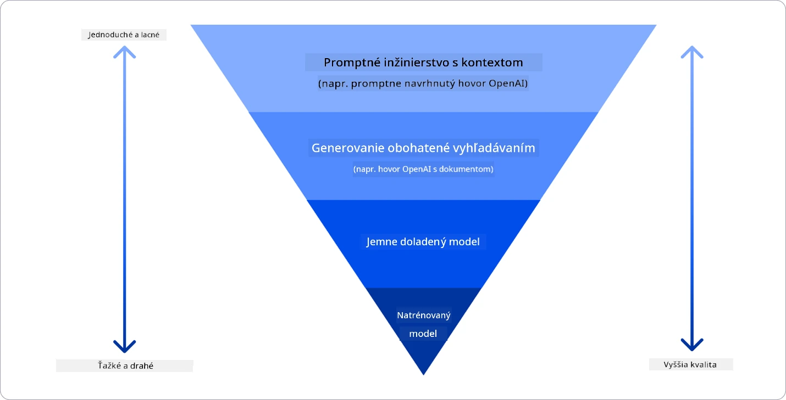

Zdroj obrázka: [Four Ways that Enterprises Deploy LLMs | Fiddler AI Blog](https://www.fiddler.ai/blog/four-ways-that-enterprises-deploy-llms?WT.mc_id=academic-105485-koreyst)

### Prompt Engineering s Kontextom

Predtrénované LLM fungujú veľmi dobre na všeobecných úlohách spracovania prirodzeného jazyka, dokonca aj keď ich voláte s krátkym promptom, napríklad vetou na doplnenie alebo otázkou – tzv. „zero-shot“ učenie.

Avšak čím viac používateľ dokáže rámcovať svoj dotaz, s podrobnou požiadavkou a príkladmi – Kontekstom – tým je odpoveď presnejšia a bližšia očakávaniam používateľa. V tomto prípade hovoríme o „one-shot“ učení, ak prompt zahŕňa iba jeden príklad, a o „few-shot“ učení, ak obsahuje viac príkladov.
Prompt engineering s kontextom je najefektívnejší prístup z hľadiska nákladov na začatie práce.

### Retrieval Augmented Generation (RAG)

LLM majú limit, že môžu použiť iba dáta, ktoré boli použité počas ich tréningu na vytvorenie odpovede. To znamená, že nevedia nič o udalostiach, ktoré nastali po ich tréningovom procese, a nemajú prístup k neverejným informáciám (ako sú firemné dáta).
Tento problém je možné prekonať pomocou RAG, techniky, ktorá rozširuje prompt o externé dáta vo forme častí dokumentov, pričom zohľadňuje limity dĺžky promptu. Toto podporujú nástroje s databázou vektorov (ako [Azure Vector Search](https://learn.microsoft.com/azure/search/vector-search-overview?WT.mc_id=academic-105485-koreyst)), ktoré vyhľadávajú užitočné časti z rôznych preddefinovaných zdrojov dát a pridávajú ich do kontextu promptu.

Táto technika je veľmi užitočná, keď firma nemá dostatok dát, času alebo zdrojov na vylaďovanie LLM, ale stále chce zlepšiť výkon na konkrétnej pracovnej záťaži a znížiť riziko vymyslených, zastaraných alebo nepodporovaných odpovedí.

### Model vylaďovaný na mieru

Vylaďovanie je proces, ktorý využíva transfer learning na „adaptovanie“ modelu na nasledujúcu úlohu alebo na riešenie konkrétneho problému. Na rozdiel od few-shot učenia a RAG, výsledkom je nový model s aktualizovanými váhami a biasmi. Vyžaduje si množinu tréningových príkladov pozostávajúcich z jedného vstupu (promptu) a jeho priradeného výstupu (dokončenia).
Toto by bol preferovaný prístup, ak:

- **Používate menšie, špecifické modely**. Firma chce vylaďovať menší model na úzku úlohu namiesto opakovaného promptovania väčšieho frontier modelu, čo vedie k efektívnejšiemu a rýchlejšiemu riešeniu.

- **Zvažujete latenciu**. Latencia je dôležitá pre konkrétny prípad použitia, takže nie je možné použiť veľmi dlhé prompty alebo počet príkladov, z ktorých sa má model učiť, nezodpovedá limitu dĺžky promptu.

- **Adaptujete stabilné správanie**. Firma má veľa kvalitných príkladov a chce, aby model konzistentne nasledoval vzor úlohy, formát výstupu, tón alebo špecifický štýl domény. Ak je hlavný problém čerstvé fakty alebo súkromné vedomosti, ktoré sa často menia, použite miesto vylaďovania RAG.

### Trénovaný model

Trénovanie LLM od základov je bezpochyby najťažší a najkomplexnejší prístup, ktorý si vyžaduje obrovské množstvá dát, kvalifikované zdroje a vhodnú výpočtovú kapacitu. Túto možnosť by mala firma zvážiť iba v prípade, že má doménovo špecifický prípad použitia a veľké množstvo doménovo zameraných dát.

## Kontrola znalostí

Aký by mohol byť dobrý prístup na zlepšenie výsledkov dokončenia LLM?

1. Prompt engineering s kontextom
1. RAG
1. Model vylaďovaný na mieru

A: Všetky tri môžu pomôcť. Začnite s prompt engineeringom a kontextom pre rýchle zlepšenia a použite RAG, keď model potrebuje aktuálne fakty alebo súkromné firemné údaje. Vyberte vylaďovanie, keď máte dostatok kvalitných príkladov a potrebujete, aby model konzistentne nasledoval úlohu, formát, tón alebo vzor domény.

## 🚀 Výzva

Prečítajte si viac o tom, ako môžete [použiť RAG](https://learn.microsoft.com/azure/search/retrieval-augmented-generation-overview?WT.mc_id=academic-105485-koreyst) pre vaše podnikanie.

## Výborná práca, pokračujte v učení

Po dokončení tejto lekcie si pozrite našu [Generative AI Learning collection](https://aka.ms/genai-collection?WT.mc_id=academic-105485-koreyst), aby ste pokračovali vo zvyšovaní vašich znalostí Generative AI!

Prejdite na Lekciu 3, kde sa pozrieme na to, ako [budovať s Generative AI zodpovedne](../03-using-generative-ai-responsibly/README.md?WT.mc_id=academic-105485-koreyst)!

---

<!-- CO-OP TRANSLATOR DISCLAIMER START -->
**Vyhlásenie o zodpovednosti**:
Tento dokument bol preložený pomocou AI prekladateľskej služby [Co-op Translator](https://github.com/Azure/co-op-translator). Hoci sa snažíme o presnosť, vezmite prosím na vedomie, že automatické preklady môžu obsahovať chyby alebo nepresnosti. Pôvodný dokument v jeho natívnom jazyku by mal byť považovaný za autoritatívny zdroj. Pre kritické informácie sa odporúča profesionálny ľudský preklad. Nie sme zodpovední za žiadne nedorozumenia alebo nesprávne interpretácie vyplývajúce z použitia tohto prekladu.
<!-- CO-OP TRANSLATOR DISCLAIMER END -->