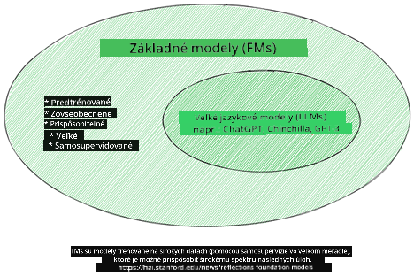
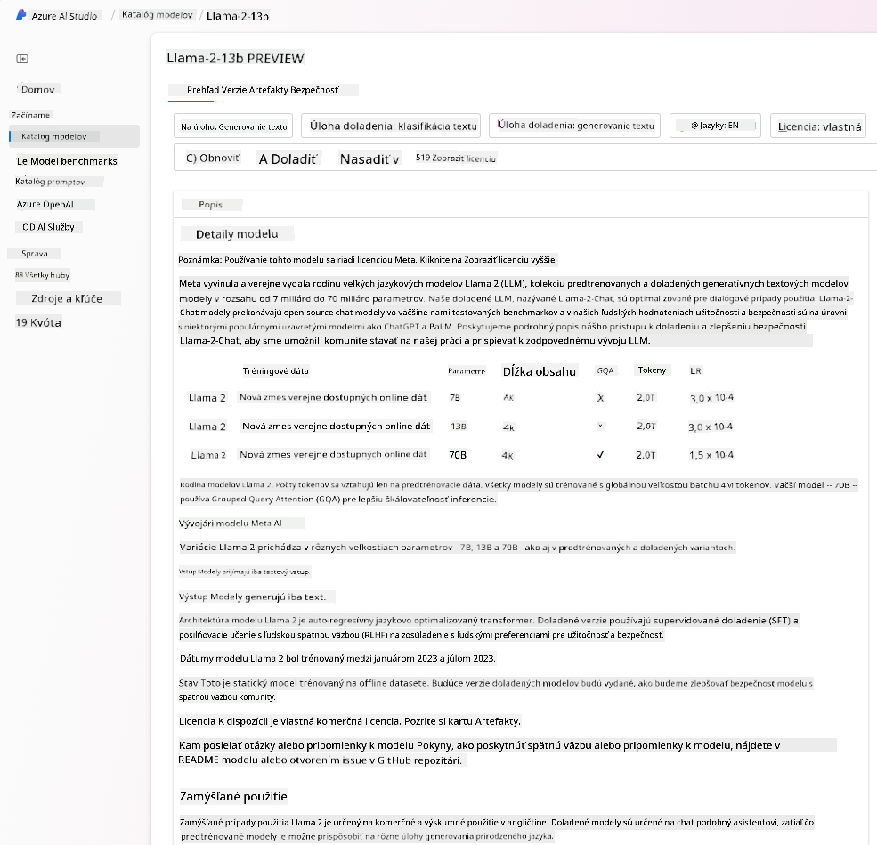

<!--
CO_OP_TRANSLATOR_METADATA:
{
  "original_hash": "6b7629b8ee4d7d874a27213e903d86a7",
  "translation_date": "2025-10-17T21:56:46+00:00",
  "source_file": "02-exploring-and-comparing-different-llms/README.md",
  "language_code": "sk"
}
-->
# Preskúmanie a porovnanie rôznych LLM

> _Kliknite na obrázok vyššie, aby ste si pozreli video k tejto lekcii_

V predchádzajúcej lekcii sme videli, ako Generatívna AI mení technologickú krajinu, ako fungujú veľké jazykové modely (LLM) a ako ich podnik - ako náš startup - môže aplikovať na svoje prípady použitia a rásť! V tejto kapitole sa zameriame na porovnanie a kontrast rôznych typov veľkých jazykových modelov (LLM), aby sme pochopili ich výhody a nevýhody.

Ďalším krokom na ceste nášho startupu je preskúmanie aktuálnej krajiny LLM a pochopenie, ktoré sú vhodné pre náš prípad použitia.

## Úvod

Táto lekcia pokryje:

- Rôzne typy LLM v súčasnej krajine.
- Testovanie, iterovanie a porovnávanie rôznych modelov pre váš prípad použitia v Azure.
- Ako nasadiť LLM.

## Ciele učenia

Po dokončení tejto lekcie budete schopní:

- Vybrať správny model pre váš prípad použitia.
- Pochopiť, ako testovať, iterovať a zlepšovať výkon vášho modelu.
- Vedieť, ako podniky nasadzujú modely.

## Pochopenie rôznych typov LLM

LLM môžu byť kategorizované na základe ich architektúry, tréningových dát a prípadu použitia. Pochopenie týchto rozdielov pomôže nášmu startupu vybrať správny model pre daný scenár a pochopiť, ako testovať, iterovať a zlepšovať výkon.

Existuje mnoho rôznych typov LLM modelov, váš výber modelu závisí od toho, na čo ich chcete použiť, aké máte dáta, koľko ste ochotní zaplatiť a ďalšie faktory.

V závislosti od toho, či chcete modely použiť na generovanie textu, zvuku, videa, obrázkov a podobne, môžete si zvoliť iný typ modelu.

- **Rozpoznávanie zvuku a reči**. Na tento účel sú skvelou voľbou modely typu Whisper, ktoré sú univerzálne a zamerané na rozpoznávanie reči. Sú trénované na rôznorodých zvukoch a dokážu vykonávať viacjazyčné rozpoznávanie reči. Viac informácií o [modeloch typu Whisper nájdete tu](https://platform.openai.com/docs/models/whisper?WT.mc_id=academic-105485-koreyst).

- **Generovanie obrázkov**. Pre generovanie obrázkov sú DALL-E a Midjourney dve veľmi známe voľby. DALL-E je ponúkaný spoločnosťou Azure OpenAI. [Prečítajte si viac o DALL-E tu](https://platform.openai.com/docs/models/dall-e?WT.mc_id=academic-105485-koreyst) a tiež v kapitole 9 tejto učebnice.

- **Generovanie textu**. Väčšina modelov je trénovaná na generovanie textu a máte na výber širokú škálu modelov od GPT-3.5 po GPT-4. Prichádzajú s rôznymi nákladmi, pričom GPT-4 je najdrahší. Stojí za to pozrieť sa na [Azure OpenAI playground](https://oai.azure.com/portal/playground?WT.mc_id=academic-105485-koreyst), aby ste zhodnotili, ktoré modely najlepšie vyhovujú vašim potrebám z hľadiska schopností a nákladov.

- **Multimodalita**. Ak chcete pracovať s viacerými typmi dát na vstupe a výstupe, môžete sa pozrieť na modely ako [gpt-4 turbo s vizuálnymi schopnosťami alebo gpt-4o](https://learn.microsoft.com/azure/ai-services/openai/concepts/models#gpt-4-and-gpt-4-turbo-models?WT.mc_id=academic-105485-koreyst) - najnovšie verzie modelov OpenAI - ktoré dokážu kombinovať spracovanie prirodzeného jazyka s vizuálnym porozumením, umožňujúc interakcie prostredníctvom multimodálnych rozhraní.

Výber modelu znamená, že získate určité základné schopnosti, ktoré však nemusia byť dostatočné. Často máte špecifické firemné dáta, ktoré musíte nejako oznámiť LLM. Existuje niekoľko rôznych možností, ako k tomu pristúpiť, viac o tom v nasledujúcich sekciách.

### Základné modely verzus LLM

Termín Základný model bol [vytvorený výskumníkmi zo Stanfordu](https://arxiv.org/abs/2108.07258?WT.mc_id=academic-105485-koreyst) a definovaný ako AI model, ktorý spĺňa určité kritériá, ako napríklad:

- **Sú trénované pomocou neštruktúrovaného učenia alebo samostatne štruktúrovaného učenia**, čo znamená, že sú trénované na neoznačených multimodálnych dátach a nevyžadujú ľudskú anotáciu alebo označovanie dát pre ich tréningový proces.
- **Sú veľmi veľké modely**, založené na veľmi hlbokých neurónových sieťach trénovaných na miliardách parametrov.
- **Sú zvyčajne určené ako „základ“ pre iné modely**, čo znamená, že môžu byť použité ako východiskový bod pre iné modely, ktoré môžu byť postavené na ich základe, čo sa dá dosiahnuť jemným doladením.

Zdroj obrázku: [Essential Guide to Foundation Models and Large Language Models | by Babar M Bhatti | Medium
](https://thebabar.medium.com/essential-guide-to-foundation-models-and-large-language-models-27dab58f7404)

Aby sme tento rozdiel ešte viac objasnili, vezmime si ako príklad ChatGPT. Na vytvorenie prvej verzie ChatGPT slúžil model nazývaný GPT-3.5 ako základný model. To znamená, že OpenAI použil niektoré špecifické dáta pre chat na vytvorenie upravenej verzie GPT-3.5, ktorá bola špecializovaná na dobrý výkon v konverzačných scenároch, ako sú chatboty.

Zdroj obrázku: [2108.07258.pdf (arxiv.org)](https://arxiv.org/pdf/2108.07258.pdf?WT.mc_id=academic-105485-koreyst)

### Open Source verzus Proprietárne modely

Ďalším spôsobom kategorizácie LLM je, či sú open source alebo proprietárne.

Open-source modely sú modely, ktoré sú sprístupnené verejnosti a môžu byť použité kýmkoľvek. Často ich sprístupňuje spoločnosť, ktorá ich vytvorila, alebo výskumná komunita. Tieto modely je možné preskúmať, upraviť a prispôsobiť pre rôzne prípady použitia v LLM. Nie sú však vždy optimalizované pre produkčné použitie a nemusia byť tak výkonné ako proprietárne modely. Navyše, financovanie open-source modelov môže byť obmedzené, nemusia byť dlhodobo udržiavané alebo aktualizované najnovším výskumom. Príklady populárnych open-source modelov zahŕňajú [Alpaca](https://crfm.stanford.edu/2023/03/13/alpaca.html?WT.mc_id=academic-105485-koreyst), [Bloom](https://huggingface.co/bigscience/bloom) a [LLaMA](https://llama.meta.com).

Proprietárne modely sú modely, ktoré vlastní spoločnosť a nie sú sprístupnené verejnosti. Tieto modely sú často optimalizované pre produkčné použitie. Nie je však povolené ich preskúmavať, upravovať alebo prispôsobovať pre rôzne prípady použitia. Navyše, nie sú vždy dostupné zadarmo a ich používanie môže vyžadovať predplatné alebo platbu. Používatelia tiež nemajú kontrolu nad dátami, ktoré sa používajú na tréning modelu, čo znamená, že by mali dôverovať vlastníkovi modelu, že zabezpečí záväzok k ochrane dát a zodpovednému používaniu AI. Príklady populárnych proprietárnych modelov zahŕňajú [OpenAI models](https://platform.openai.com/docs/models/overview?WT.mc_id=academic-105485-koreyst), [Google Bard](https://sapling.ai/llm/bard?WT.mc_id=academic-105485-koreyst) alebo [Claude 2](https://www.anthropic.com/index/claude-2?WT.mc_id=academic-105485-koreyst).

### Embedding verzus Generovanie obrázkov verzus Generovanie textu a kódu

LLM môžu byť tiež kategorizované podľa výstupu, ktorý generujú.

Embeddings sú súbor modelov, ktoré dokážu previesť text do numerickej formy, nazývanej embedding, čo je numerická reprezentácia vstupného textu. Embeddings uľahčujú strojom pochopenie vzťahov medzi slovami alebo vetami a môžu byť použité ako vstupy pre iné modely, ako sú klasifikačné modely alebo modely zoskupovania, ktoré majú lepší výkon na numerických dátach. Embedding modely sa často používajú na transfer learning, kde je model postavený na náhradnej úlohe, pre ktorú je dostatok dát, a potom sa váhy modelu (embeddings) znovu používajú pre iné úlohy. Príkladom tejto kategórie je [OpenAI embeddings](https://platform.openai.com/docs/models/embeddings?WT.mc_id=academic-105485-koreyst).

Modely generovania obrázkov sú modely, ktoré generujú obrázky. Tieto modely sa často používajú na úpravu obrázkov, syntézu obrázkov a preklad obrázkov. Modely generovania obrázkov sú často trénované na veľkých datasetoch obrázkov, ako je [LAION-5B](https://laion.ai/blog/laion-5b/?WT.mc_id=academic-105485-koreyst), a môžu byť použité na generovanie nových obrázkov alebo na úpravu existujúcich obrázkov pomocou techník ako inpainting, super-rezolučné a kolorizačné techniky. Príklady zahŕňajú [DALL-E-3](https://openai.com/dall-e-3?WT.mc_id=academic-105485-koreyst) a [Stable Diffusion models](https://github.com/Stability-AI/StableDiffusion?WT.mc_id=academic-105485-koreyst).

Modely generovania textu a kódu sú modely, ktoré generujú text alebo kód. Tieto modely sa často používajú na sumarizáciu textu, preklad a odpovedanie na otázky. Modely generovania textu sú často trénované na veľkých datasetoch textu, ako je [BookCorpus](https://www.cv-foundation.org/openaccess/content_iccv_2015/html/Zhu_Aligning_Books_and_ICCV_2015_paper.html?WT.mc_id=academic-105485-koreyst), a môžu byť použité na generovanie nového textu alebo na odpovedanie na otázky. Modely generovania kódu, ako [CodeParrot](https://huggingface.co/codeparrot?WT.mc_id=academic-105485-koreyst), sú často trénované na veľkých datasetoch kódu, ako je GitHub, a môžu byť použité na generovanie nového kódu alebo na opravu chýb v existujúcom kóde.

### Encoder-Decoder verzus Iba Decoder

Aby sme hovorili o rôznych typoch architektúr LLM, použime analógiu.

Predstavte si, že váš manažér vám dal úlohu napísať kvíz pre študentov. Máte dvoch kolegov; jeden sa stará o vytváranie obsahu a druhý o jeho kontrolu.

Tvorca obsahu je ako model Iba Decoder, dokáže sa pozrieť na tému a na to, čo ste už napísali, a potom môže napísať kurz na základe toho. Sú veľmi dobrí v písaní pútavého a informatívneho obsahu, ale nie sú veľmi dobrí v pochopení témy a učebných cieľov. Niektoré príklady modelov Iba Decoder sú modely rodiny GPT, ako GPT-3.

Recenzent je ako model Iba Encoder, pozrie sa na napísaný kurz a odpovede, všimne si vzťah medzi nimi a pochopí kontext, ale nie je dobrý v generovaní obsahu. Príkladom modelu Iba Encoder by bol BERT.

Predstavte si, že by sme mohli mať niekoho, kto by mohol vytvárať aj kontrolovať kvíz, to je model Encoder-Decoder. Niektoré príklady by boli BART a T5.

### Služba verzus Model

Teraz si poďme povedať o rozdiele medzi službou a modelom. Služba je produkt, ktorý ponúka poskytovateľ cloudových služieb a často je kombináciou modelov, dát a ďalších komponentov. Model je základná súčasť služby a často je to základný model, ako napríklad LLM.

Služby sú často optimalizované pre produkčné použitie a často sa ľahšie používajú ako modely, prostredníctvom grafického užívateľského rozhrania. Služby však nie sú vždy dostupné zadarmo a ich používanie môže vyžadovať predplatné alebo platbu, výmenou za využívanie vybavenia a zdrojov vlastníka služby, optimalizáciu nákladov a jednoduché škálovanie. Príkladom služby je [Azure OpenAI Service](https://learn.microsoft.com/azure/ai-services/openai/overview?WT.mc_id=academic-105485-koreyst), ktorá ponúka plán sadzby „pay-as-you-go“, čo znamená, že používatelia sú účtovaní proporcionálne k tomu, koľko služby využívajú. Azure OpenAI Service tiež ponúka bezpečnosť na úrovni podniku a rámec zodpovednej AI nad schopnosťami modelov.

Modely sú len neurónová sieť, s parametrami, váhami a ďalšími. Umožňujú spoločnostiam prevádzkovať lokálne, avšak by si museli kúpiť vybavenie, vybudovať štruktúru na škálovanie a kúpiť licenciu alebo použiť open-source model. Model ako LLaMA je dostupný na použitie, vyžaduje však výpočtový výkon na prevádzku modelu.

## Ako testovať a iterovať s rôznymi modelmi na pochopenie výkonu v Azure

Keď náš tím preskúmal aktuálnu krajinu LLM a identifikoval niekoľko dobrých kandidátov pre ich scenáre, ďalším krokom je ich testovanie na ich dátach a pracovnej záťaži. Toto je iteratívny proces, vykonávaný prostredníctvom experimentov a meraní.
Väčšina modelov, ktoré sme spomenuli v predchádzajúcich odsekoch (modely OpenAI, open source modely ako Llama2 a Hugging Face transformers), sú dostupné v [Modelovom katalógu](https://learn.microsoft.com/azure/ai-studio/how-to/model-catalog-overview?WT.mc_id=academic-105485-koreyst) v [Azure AI Studio](https://ai.azure.com/?WT.mc_id=academic-105485-koreyst).

[Azure AI Studio](https://learn.microsoft.com/azure/ai-studio/what-is-ai-studio?WT.mc_id=academic-105485-koreyst) je cloudová platforma navrhnutá pre vývojárov na vytváranie generatívnych AI aplikácií a správu celého vývojového cyklu - od experimentovania po hodnotenie - kombinovaním všetkých služieb Azure AI do jedného centra s praktickým grafickým rozhraním. Modelový katalóg v Azure AI Studio umožňuje používateľovi:

- Nájsť základný model, ktorý ho zaujíma, v katalógu - či už proprietárny alebo open source, filtrovaním podľa úlohy, licencie alebo názvu. Na zlepšenie vyhľadávania sú modely organizované do kolekcií, ako napríklad kolekcia Azure OpenAI, kolekcia Hugging Face a ďalšie.

- Prezrieť si kartu modelu, vrátane podrobného popisu zamýšľaného použitia a tréningových dát, ukážok kódu a výsledkov hodnotenia v internej knižnici hodnotení.

- Porovnať benchmarky medzi modelmi a dostupnými dátovými sadami v priemysle, aby ste mohli posúdiť, ktorý model najlepšie vyhovuje obchodnému scenáru, prostredníctvom panelu [Model Benchmarks](https://learn.microsoft.com/azure/ai-studio/how-to/model-benchmarks?WT.mc_id=academic-105485-koreyst).

- Jemne doladiť model na vlastných tréningových dátach, aby sa zlepšil výkon modelu v konkrétnej pracovnej záťaži, využitím experimentálnych a sledovacích schopností Azure AI Studio.

- Nasadiť pôvodný predtrénovaný model alebo jemne doladenú verziu na vzdialené inferenčné prostredie v reálnom čase - spravovaný výpočtový výkon - alebo serverless API endpoint - [pay-as-you-go](https://learn.microsoft.com/azure/ai-studio/how-to/model-catalog-overview#model-deployment-managed-compute-and-serverless-api-pay-as-you-go?WT.mc_id=academic-105485-koreyst) - aby ho aplikácie mohli využívať.

> [!NOTE]
> Nie všetky modely v katalógu sú momentálne dostupné na jemné doladenie a/alebo nasadenie formou pay-as-you-go. Skontrolujte kartu modelu pre podrobnosti o schopnostiach a obmedzeniach modelu.

## Zlepšenie výsledkov LLM

Preskúmali sme s naším startupovým tímom rôzne typy LLM a cloudovú platformu (Azure Machine Learning), ktorá nám umožňuje porovnávať rôzne modely, hodnotiť ich na testovacích dátach, zlepšovať výkon a nasadzovať ich na inferenčné endpointy.

Kedy by mali zvážiť jemné doladenie modelu namiesto použitia predtrénovaného? Existujú aj iné prístupy na zlepšenie výkonu modelu pri konkrétnych pracovných záťažiach?

Existuje niekoľko prístupov, ktoré môže podnik použiť na dosiahnutie požadovaných výsledkov z LLM. Pri nasadzovaní LLM do produkcie môžete vybrať rôzne typy modelov s rôznymi stupňami tréningu, pričom sa líšia zložitosťou, nákladmi a kvalitou. Tu sú niektoré z rôznych prístupov:

- **Prompt engineering s kontextom**. Ide o to, poskytnúť dostatok kontextu pri zadávaní promptu, aby ste získali požadované odpovede.

- **Retrieval Augmented Generation, RAG**. Vaše dáta môžu existovať napríklad v databáze alebo webovom endpointu. Aby ste zabezpečili, že tieto dáta alebo ich podmnožina budú zahrnuté pri zadávaní promptu, môžete vyhľadať relevantné dáta a zahrnúť ich do promptu používateľa.

- **Jemne doladený model**. Tu model ďalej trénujete na vlastných dátach, čo vedie k tomu, že model je presnejší a lepšie reaguje na vaše potreby, ale môže byť nákladný.

Zdroj obrázku: [Four Ways that Enterprises Deploy LLMs | Fiddler AI Blog](https://www.fiddler.ai/blog/four-ways-that-enterprises-deploy-llms?WT.mc_id=academic-105485-koreyst)

### Prompt engineering s kontextom

Predtrénované LLM fungujú veľmi dobre na všeobecných úlohách s prirodzeným jazykom, dokonca aj pri ich použití s krátkym promptom, ako je veta na dokončenie alebo otázka – tzv. učenie „zero-shot“.

Avšak čím viac používateľ dokáže formulovať svoju otázku, s podrobnou požiadavkou a príkladmi – Kontext – tým presnejšia a bližšia očakávaniam používateľa bude odpoveď. V tomto prípade hovoríme o „one-shot“ učení, ak prompt obsahuje iba jeden príklad, a o „few-shot“ učení, ak obsahuje viacero príkladov. Prompt engineering s kontextom je najnákladovo efektívnejší prístup na začiatok.

### Retrieval Augmented Generation (RAG)

LLM majú obmedzenie, že môžu používať iba dáta, ktoré boli použité počas ich tréningu na generovanie odpovede. To znamená, že nevedia nič o faktoch, ktoré sa stali po ich tréningovom procese, a nemôžu pristupovať k neverejným informáciám (ako sú firemné dáta). 

Toto sa dá prekonať prostredníctvom RAG, techniky, ktorá rozširuje prompt o externé dáta vo forme útržkov dokumentov, pričom berie do úvahy limity dĺžky promptu. To je podporované nástrojmi pre vektorové databázy (ako [Azure Vector Search](https://learn.microsoft.com/azure/search/vector-search-overview?WT.mc_id=academic-105485-koreyst)), ktoré vyhľadávajú užitočné útržky z rôznych preddefinovaných zdrojov dát a pridávajú ich do kontextu promptu.

Táto technika je veľmi užitočná, keď podnik nemá dostatok dát, času alebo zdrojov na jemné doladenie LLM, ale stále si želá zlepšiť výkon pri konkrétnej pracovnej záťaži a znížiť riziko mystifikácií, t. j. skreslenia reality alebo škodlivého obsahu.

### Jemne doladený model

Jemné doladenie je proces, ktorý využíva transferové učenie na „prispôsobenie“ modelu na konkrétnu úlohu alebo na riešenie konkrétneho problému. Na rozdiel od few-shot učenia a RAG, výsledkom je nový model s aktualizovanými váhami a biasmi. Vyžaduje si súbor tréningových príkladov pozostávajúcich z jedného vstupu (promptu) a jeho pridruženého výstupu (dokončenia). 

Toto by bol preferovaný prístup, ak:

- **Používanie jemne doladených modelov**. Podnik by chcel používať jemne doladené menej schopné modely (ako embedding modely) namiesto vysoko výkonných modelov, čo by viedlo k nákladovo efektívnejšiemu a rýchlejšiemu riešeniu.

- **Zohľadnenie latencie**. Latencia je dôležitá pre konkrétny prípad použitia, takže nie je možné používať veľmi dlhé prompty alebo počet príkladov, ktoré by sa mali naučiť z modelu, nevyhovuje limitu dĺžky promptu.

- **Udržiavanie aktuálnosti**. Podnik má veľa kvalitných dát a pravdivých označení a zdroje potrebné na udržiavanie týchto dát aktuálnych v priebehu času.

### Trénovaný model

Trénovanie LLM od začiatku je bezpochyby najťažší a najkomplexnejší prístup, ktorý si vyžaduje obrovské množstvo dát, kvalifikované zdroje a primeraný výpočtový výkon. Táto možnosť by sa mala zvážiť iba v scenári, kde má podnik špecifický prípad použitia a veľké množstvo dát zameraných na danú oblasť.

## Kontrola vedomostí

Aký by mohol byť dobrý prístup na zlepšenie výsledkov dokončenia LLM?

1. Prompt engineering s kontextom  
1. RAG  
1. Jemne doladený model  

A:3, ak máte čas a zdroje a kvalitné dáta, jemné doladenie je lepšou možnosťou na udržiavanie aktuálnosti. Ak však chcete veci zlepšiť a nemáte dostatok času, stojí za zváženie najskôr RAG.

## 🚀 Výzva

Prečítajte si viac o tom, ako môžete [použiť RAG](https://learn.microsoft.com/azure/search/retrieval-augmented-generation-overview?WT.mc_id=academic-105485-koreyst) pre váš podnik.

## Skvelá práca, pokračujte vo vzdelávaní

Po dokončení tejto lekcie si pozrite našu [kolekciu učenia o generatívnej AI](https://aka.ms/genai-collection?WT.mc_id=academic-105485-koreyst), aby ste si naďalej rozširovali svoje znalosti o generatívnej AI!

Prejdite na Lekciu 3, kde sa pozrieme na to, ako [zodpovedne pracovať s generatívnou AI](../03-using-generative-ai-responsibly/README.md?WT.mc_id=academic-105485-koreyst)!

---

**Zrieknutie sa zodpovednosti**:  
Tento dokument bol preložený pomocou služby AI prekladu [Co-op Translator](https://github.com/Azure/co-op-translator). Hoci sa snažíme o presnosť, prosím, berte na vedomie, že automatizované preklady môžu obsahovať chyby alebo nepresnosti. Pôvodný dokument v jeho rodnom jazyku by mal byť považovaný za autoritatívny zdroj. Pre kritické informácie sa odporúča profesionálny ľudský preklad. Nenesieme zodpovednosť za akékoľvek nedorozumenia alebo nesprávne interpretácie vyplývajúce z použitia tohto prekladu.