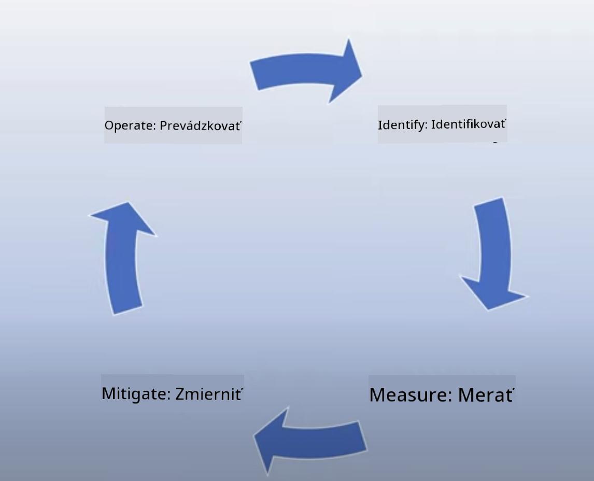

<!--
CO_OP_TRANSLATOR_METADATA:
{
  "original_hash": "13084c6321a2092841b9a081b29497ba",
  "translation_date": "2025-05-19T14:49:37+00:00",
  "source_file": "03-using-generative-ai-responsibly/README.md",
  "language_code": "sk"
}
-->
# Zodpovedné používanie generatívnej AI

> _Kliknite na obrázok vyššie a pozrite si video tejto lekcie_

Je ľahké byť fascinovaný AI, obzvlášť generatívnou AI, ale je potrebné zvážiť, ako ju používať zodpovedne. Je potrebné zvážiť veci ako zabezpečenie spravodlivého a neškodného výstupu a ďalšie. Táto kapitola sa snaží poskytnúť vám uvedený kontext, čo zvážiť a ako podniknúť aktívne kroky na zlepšenie používania AI.

## Úvod

Táto lekcia pokryje:

- Prečo by ste mali uprednostniť zodpovednú AI pri budovaní aplikácií generatívnej AI.
- Základné princípy zodpovednej AI a ako sa vzťahujú na generatívnu AI.
- Ako uplatniť tieto princípy zodpovednej AI v praxi prostredníctvom stratégie a nástrojov.

## Ciele učenia

Po dokončení tejto lekcie budete vedieť:

- Dôležitosť zodpovednej AI pri budovaní aplikácií generatívnej AI.
- Kedy premýšľať a uplatniť základné princípy zodpovednej AI pri budovaní aplikácií generatívnej AI.
- Aké nástroje a stratégie sú dostupné, aby ste koncept zodpovednej AI uviedli do praxe.

## Princípy zodpovednej AI

Nadšenie z generatívnej AI nikdy nebolo vyššie. Toto nadšenie prinieslo do tejto oblasti množstvo nových vývojárov, pozornosť a financovanie. Aj keď je to veľmi pozitívne pre každého, kto chce budovať produkty a spoločnosti pomocou generatívnej AI, je tiež dôležité pokračovať zodpovedne.

Počas tohto kurzu sa zameriavame na budovanie nášho startupu a nášho vzdelávacieho produktu AI. Použijeme princípy zodpovednej AI: Spravodlivosť, Inkluzívnosť, Spoľahlivosť/Bezpečnosť, Zabezpečenie a Súkromie, Transparentnosť a Zodpovednosť. S týmito princípmi preskúmame, ako sa vzťahujú na naše používanie generatívnej AI v našich produktoch.

## Prečo by ste mali uprednostniť zodpovednú AI

Pri budovaní produktu, zaujatie prístupu zameraného na človeka tým, že máte na pamäti najlepší záujem vašich používateľov, vedie k najlepším výsledkom.

Unikátnosť generatívnej AI je jej schopnosť vytvárať užitočné odpovede, informácie, rady a obsah pre používateľov. To sa dá urobiť bez mnohých manuálnych krokov, čo môže viesť k veľmi pôsobivým výsledkom. Bez správneho plánovania a stratégií to môže bohužiaľ tiež viesť k škodlivým výsledkom pre vašich používateľov, váš produkt a spoločnosť ako celok.

Pozrime sa na niektoré (ale nie všetky) z týchto potenciálne škodlivých výsledkov:

### Halucinácie

Halucinácie sú termín používaný na popis, keď LLM produkuje obsah, ktorý je buď úplne nezmyselný, alebo niečo, o čom vieme, že je fakticky nesprávne na základe iných zdrojov informácií.

Predstavme si, že vytvoríme funkciu pre náš startup, ktorá umožní študentom klásť historické otázky modelu. Študent sa pýta otázku `Who was the sole survivor of Titanic?`

Model produkuje odpoveď, ako je tá nižšie:

> _(Zdroj: [Flying bisons](https://flyingbisons.com?WT.mc_id=academic-105485-koreyst))_

Toto je veľmi sebavedomá a dôkladná odpoveď. Bohužiaľ, je nesprávna. Aj s minimálnym množstvom výskumu by sa zistilo, že z katastrofy Titanicu prežilo viac ako jedna osoba. Pre študenta, ktorý práve začína skúmať túto tému, môže byť táto odpoveď presvedčivá natoľko, že ju nebude spochybňovať a bude ju považovať za fakt. Dôsledky tohto môžu viesť k tomu, že AI systém bude nespoľahlivý a negatívne ovplyvní reputáciu nášho startupu.

Pri každej iterácii daného LLM sme zaznamenali zlepšenie výkonu pri minimalizovaní halucinácií. Aj pri tomto zlepšení, my ako tvorcovia aplikácií a používatelia stále musíme byť si vedomí týchto obmedzení.

### Škodlivý obsah

V predchádzajúcej časti sme sa venovali tomu, keď LLM produkuje nesprávne alebo nezmyselné odpovede. Ďalším rizikom, ktoré musíme mať na pamäti, je, keď model odpovedá škodlivým obsahom.

Škodlivý obsah môže byť definovaný ako:

- Poskytovanie pokynov alebo podpora sebapoškodzovania alebo poškodzovania určitých skupín.
- Nenávistný alebo ponižujúci obsah.
- Návody na plánovanie akéhokoľvek typu útoku alebo násilných činov.
- Poskytovanie pokynov na nájdenie nelegálneho obsahu alebo spáchanie nelegálnych činov.
- Zobrazovanie sexuálne explicitného obsahu.

Pre náš startup chceme zabezpečiť, že máme správne nástroje a stratégie na zabránenie tomu, aby sa tento typ obsahu dostal k študentom.

### Nedostatok spravodlivosti

Spravodlivosť je definovaná ako „zabezpečenie, že AI systém je bez predsudkov a diskriminácie a že zaobchádza so všetkými spravodlivo a rovnako“. Vo svete generatívnej AI chceme zabezpečiť, že vylučujúce svetonázory marginalizovaných skupín nie sú posilnené výstupom modelu.

Tieto typy výstupov sú nielen deštruktívne pre budovanie pozitívnych produktových zážitkov pre našich používateľov, ale tiež spôsobujú ďalšie spoločenské škody. Ako tvorcovia aplikácií by sme mali vždy mať na pamäti širokú a rozmanitú základňu používateľov pri budovaní riešení s generatívnou AI.

## Ako používať generatívnu AI zodpovedne

Teraz, keď sme identifikovali dôležitosť zodpovednej generatívnej AI, pozrime sa na 4 kroky, ktoré môžeme podniknúť, aby sme zodpovedne budovali naše AI riešenia:

### Meranie potenciálnych škôd

V softvérovom testovaní testujeme očakávané akcie používateľa na aplikácii. Podobne, testovanie rôznorodého súboru výziev, ktoré používatelia pravdepodobne použijú, je dobrý spôsob, ako merať potenciálnu škodu.

Keďže náš startup buduje vzdelávací produkt, bolo by dobré pripraviť zoznam výziev súvisiacich so vzdelávaním. To by mohlo pokrývať určitý predmet, historické fakty a výzvy týkajúce sa života študentov.

### Zmiernenie potenciálnych škôd

Teraz je čas nájsť spôsoby, ako môžeme zabrániť alebo obmedziť potenciálnu škodu spôsobenú modelom a jeho odpoveďami. Môžeme sa na to pozrieť v 4 rôznych vrstvách:

- **Model**. Výber správneho modelu pre správny prípad použitia. Väčšie a zložitejšie modely ako GPT-4 môžu spôsobiť väčšie riziko škodlivého obsahu, keď sú aplikované na menšie a špecifické prípady použitia. Použitie vašich tréningových dát na jemné doladenie tiež znižuje riziko škodlivého obsahu.

- **Bezpečnostný systém**. Bezpečnostný systém je súbor nástrojov a konfigurácií na platforme, ktorá poskytuje model, ktoré pomáhajú zmierniť škodu. Príkladom je systém filtrovania obsahu na službe Azure OpenAI. Systémy by tiež mali detekovať útoky typu jailbreak a nežiaducu aktivitu, ako sú požiadavky od botov.

- **Metaprompt**. Metaprompt a ukotvenie sú spôsoby, ako môžeme usmerniť alebo obmedziť model na základe určitých správaní a informácií. To by mohlo byť použitie systémových vstupov na definovanie určitých limitov modelu. Okrem toho poskytovanie výstupov, ktoré sú relevantnejšie pre rozsah alebo doménu systému.

Môže to byť tiež použitie techník ako Retrieval Augmented Generation (RAG), aby model čerpal informácie iba z výberu dôveryhodných zdrojov. V tejto lekcii je neskôr lekcia pre [budovanie vyhľadávacích aplikácií](../08-building-search-applications/README.md?WT.mc_id=academic-105485-koreyst)

- **Používateľská skúsenosť**. Posledná vrstva je miesto, kde používateľ interaguje priamo s modelom prostredníctvom rozhrania našej aplikácie určitým spôsobom. Týmto spôsobom môžeme navrhnúť UI/UX tak, aby sme obmedzili používateľa na typy vstupov, ktoré môže posielať modelu, ako aj text alebo obrázky zobrazované používateľovi. Pri nasadzovaní AI aplikácie musíme tiež byť transparentní ohľadom toho, čo naša generatívna AI aplikácia môže a nemôže robiť.

Máme celú lekciu venovanú [navrhovaniu UX pre AI aplikácie](../12-designing-ux-for-ai-applications/README.md?WT.mc_id=academic-105485-koreyst)

- **Vyhodnotenie modelu**. Práca s LLM môže byť náročná, pretože nemáme vždy kontrolu nad dátami, na ktorých bol model trénovaný. Bez ohľadu na to, by sme mali vždy vyhodnotiť výkon a výstupy modelu. Je stále dôležité merať presnosť, podobnosť, ukotvenie a relevantnosť výstupu modelu. To pomáha poskytovať transparentnosť a dôveru pre zainteresované strany a používateľov.

### Prevádzkovanie zodpovedného riešenia generatívnej AI

Budovanie operačnej praxe okolo vašich AI aplikácií je posledná fáza. To zahŕňa partnerstvo s inými časťami nášho startupu, ako sú Právne a Bezpečnosť, aby sme zabezpečili, že sme v súlade so všetkými regulačnými politikami. Pred uvedením na trh tiež chceme budovať plány okolo doručovania, riešenia incidentov a rollbacku, aby sme zabránili akémukoľvek poškodeniu našich používateľov.

## Nástroje

Aj keď sa práca na vývoji zodpovedných AI riešení môže zdať veľa, je to práca, ktorá stojí za to. Ako sa oblasť generatívnej AI rozrastá, viac nástrojov na pomoc vývojárom efektívne integrovať zodpovednosť do ich pracovných tokov bude dozrievať. Napríklad, [Azure AI Content Safety](https://learn.microsoft.com/azure/ai-services/content-safety/overview?WT.mc_id=academic-105485-koreyst) môže pomôcť detekovať škodlivý obsah a obrázky prostredníctvom API požiadavky.

## Kontrola vedomostí

Na čo je potrebné dbať, aby sa zabezpečilo zodpovedné používanie AI?

1. Že odpoveď je správna.
1. Škodlivé použitie, aby AI nebola použitá na kriminálne účely.
1. Zabezpečenie, že AI je bez predsudkov a diskriminácie.

A: 2 a 3 sú správne. Zodpovedná AI vám pomáha zvážiť, ako zmierniť škodlivé účinky a predsudky a viac.

## 🚀 Výzva

Prečítajte si o [Azure AI Content Safety](https://learn.microsoft.com/azure/ai-services/content-safety/overview?WT.mc_id=academic-105485-koreyst) a zistite, čo môžete prijať pre svoje použitie.

## Skvelá práca, pokračujte vo svojom učení

Po dokončení tejto lekcie si pozrite našu [kolekciu učenia o generatívnej AI](https://aka.ms/genai-collection?WT.mc_id=academic-105485-koreyst), aby ste pokračovali v rozširovaní svojich vedomostí o generatívnej AI!

Prejdite na lekciu 4, kde sa pozrieme na [Základy inžinierstva výziev](../04-prompt-engineering-fundamentals/README.md?WT.mc_id=academic-105485-koreyst)!

**Upozornenie**:  
Tento dokument bol preložený pomocou AI prekladovej služby [Co-op Translator](https://github.com/Azure/co-op-translator). Hoci sa snažíme o presnosť, prosím uvedomte si, že automatizované preklady môžu obsahovať chyby alebo nepresnosti. Pôvodný dokument v jeho rodnom jazyku by mal byť považovaný za autoritatívny zdroj. Pre kritické informácie sa odporúča profesionálny ľudský preklad. Nie sme zodpovední za žiadne nedorozumenia alebo nesprávne interpretácie vyplývajúce z použitia tohto prekladu.