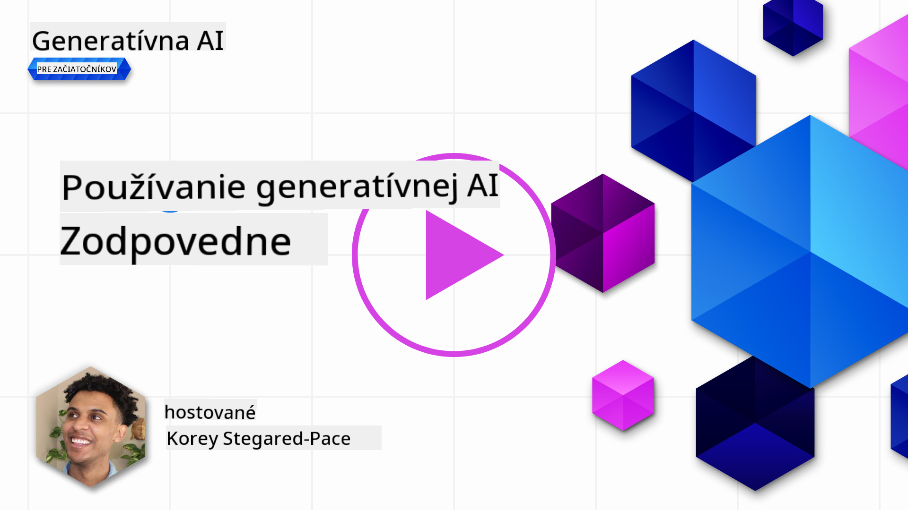
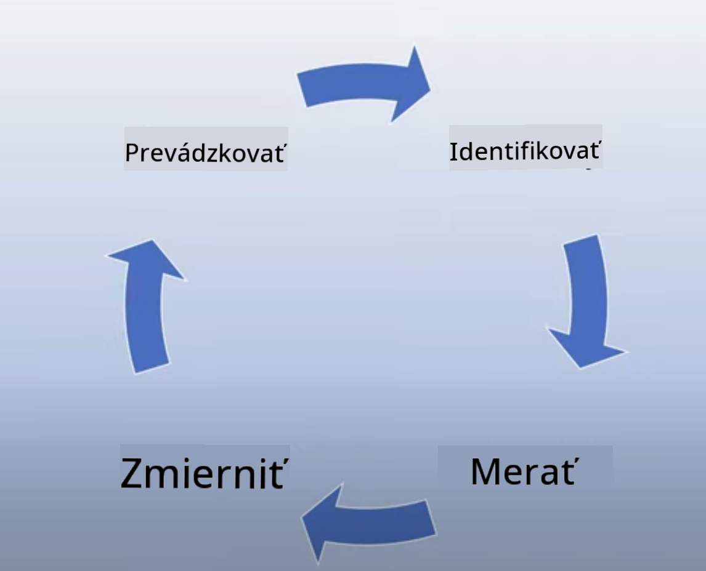
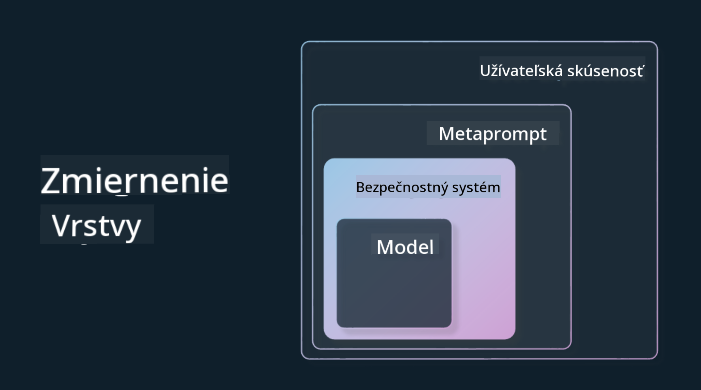

<!--
CO_OP_TRANSLATOR_METADATA:
{
  "original_hash": "7f8f4c11f8c1cb6e1794442dead414ea",
  "translation_date": "2025-07-09T09:02:35+00:00",
  "source_file": "03-using-generative-ai-responsibly/README.md",
  "language_code": "sk"
}
-->
# Používanie generatívnej AI zodpovedne

> _Kliknite na obrázok vyššie pre zobrazenie videa k tejto lekcii_

Je ľahké byť fascinovaný AI, najmä generatívnou AI, no je potrebné zvážiť, ako ju používať zodpovedne. Treba brať do úvahy, ako zabezpečiť, aby výstupy boli spravodlivé, neškodné a ďalšie aspekty. Táto kapitola vám poskytne potrebný kontext, na čo myslieť a ako aktívne zlepšiť svoje používanie AI.

## Úvod

V tejto lekcii sa dozviete:

- Prečo by ste mali uprednostniť Zodpovednú AI pri tvorbe aplikácií s generatívnou AI.
- Základné princípy Zodpovednej AI a ich vzťah k generatívnej AI.
- Ako tieto princípy Zodpovednej AI uviesť do praxe pomocou stratégie a nástrojov.

## Ciele učenia

Po dokončení tejto lekcie budete vedieť:

- Aký význam má Zodpovedná AI pri tvorbe aplikácií s generatívnou AI.
- Kedy myslieť na a aplikovať základné princípy Zodpovednej AI pri tvorbe generatívnych AI aplikácií.
- Aké nástroje a stratégie máte k dispozícii na praktickú implementáciu konceptu Zodpovednej AI.

## Princípy Zodpovednej AI

Nadšenie pre generatívnu AI nikdy nebolo väčšie. Toto nadšenie pritiahlo množstvo nových vývojárov, pozornosť a financovanie do tejto oblasti. Hoci je to veľmi pozitívne pre každého, kto chce budovať produkty a firmy využívajúce generatívnu AI, je rovnako dôležité postupovať zodpovedne.

V priebehu tohto kurzu sa zameriavame na budovanie nášho startupu a nášho vzdelávacieho AI produktu. Použijeme princípy Zodpovednej AI: Spravodlivosť, Inkluzívnosť, Spoľahlivosť/Bezpečnosť, Bezpečnosť a Ochrana súkromia, Transparentnosť a Zodpovednosť. Pomocou týchto princípov preskúmame, ako súvisia s naším využitím generatívnej AI v našich produktoch.

## Prečo by ste mali uprednostniť Zodpovednú AI

Pri tvorbe produktu vedie k najlepším výsledkom prístup zameraný na človeka, ktorý má na pamäti najlepší záujem používateľa.

Jedinečnosť generatívnej AI spočíva v jej schopnosti vytvárať užitočné odpovede, informácie, usmernenia a obsah pre používateľov. To môže byť dosiahnuté bez mnohých manuálnych krokov, čo vedie k veľmi pôsobivým výsledkom. Bez správneho plánovania a stratégií však môže, žiaľ, viesť aj k škodlivým dôsledkom pre vašich používateľov, váš produkt a spoločnosť ako celok.

Pozrime sa na niektoré (ale nie všetky) z týchto potenciálne škodlivých dôsledkov:

### Halucinácie

Halucinácie sú termín používaný na opis situácie, keď LLM vytvorí obsah, ktorý je buď úplne nezmyselný, alebo vieme, že je fakticky nesprávny na základe iných zdrojov informácií.

Napríklad, ak vytvoríme funkciu pre náš startup, ktorá umožňuje študentom klásť historické otázky modelu. Študent sa opýta: `Kto bol jediným preživším Titanicu?`

Model vygeneruje odpoveď ako táto:

> _(Zdroj: [Flying bisons](https://flyingbisons.com?WT.mc_id=academic-105485-koreyst))_

Ide o veľmi sebavedomú a dôkladnú odpoveď. Bohužiaľ, je nesprávna. Aj pri minimálnom výskume by sme zistili, že prežilo viac ako jedna osoba z katastrofy Titanicu. Pre študenta, ktorý práve začína skúmať túto tému, môže byť táto odpoveď dostatočne presvedčivá na to, aby ju nepochyboval a považoval za fakt. Dôsledkom môže byť, že AI systém bude považovaný za nespoľahlivý a negatívne to ovplyvní reputáciu nášho startupu.

S každou novou verziou LLM sme zaznamenali zlepšenia v minimalizácii halucinácií. Napriek tomu ako tvorcovia aplikácií a používatelia musíme byť stále vedomí týchto obmedzení.

### Škodlivý obsah

V predchádzajúcej časti sme sa venovali situáciám, keď LLM vytvára nesprávne alebo nezmyselné odpovede. Ďalším rizikom, na ktoré musíme dávať pozor, je, keď model odpovedá škodlivým obsahom.

Škodlivý obsah možno definovať ako:

- Poskytovanie inštrukcií alebo povzbudzovanie k sebapoškodzovaniu alebo poškodeniu určitých skupín.
- Nenávistný alebo ponižujúci obsah.
- Usmerňovanie plánovania akéhokoľvek útoku alebo násilných činov.
- Poskytovanie návodov, ako nájsť nelegálny obsah alebo spáchať nelegálne činy.
- Zobrazovanie sexuálne explicitného obsahu.

Pre náš startup chceme zabezpečiť, aby sme mali správne nástroje a stratégie na zabránenie tomu, aby študenti videli takýto obsah.

### Nedostatok spravodlivosti

Spravodlivosť znamená „zabezpečiť, aby AI systém bol bez predsudkov a diskriminácie a aby všetkých spravodlivo a rovnako zaobchádzal.“ V oblasti generatívnej AI chceme zabezpečiť, aby model nevytváral výstupy, ktoré by posilňovali vylučujúce pohľady na svet voči marginalizovaným skupinám.

Takéto výstupy nielenže ničia pozitívne používateľské skúsenosti, ale spôsobujú aj ďalšiu spoločenskú ujmu. Ako tvorcovia aplikácií by sme mali vždy myslieť na širokú a rôznorodú používateľskú základňu pri budovaní riešení s generatívnou AI.

## Ako používať generatívnu AI zodpovedne

Keďže sme si uvedomili význam Zodpovednej generatívnej AI, pozrime sa na 4 kroky, ktoré môžeme podniknúť, aby sme naše AI riešenia budovali zodpovedne:

### Meranie potenciálnych škôd

Pri testovaní softvéru testujeme očakávané akcie používateľa v aplikácii. Podobne je dobré otestovať rôzne typy promptov, ktoré používatelia pravdepodobne použijú, aby sme zmerali potenciálne škody.

Keďže náš startup buduje vzdelávací produkt, je vhodné pripraviť zoznam promptov súvisiacich so vzdelávaním. Môžu pokrývať konkrétny predmet, historické fakty alebo otázky o študentskom živote.

### Zmiernenie potenciálnych škôd

Teraz je čas nájsť spôsoby, ako zabrániť alebo obmedziť potenciálne škody spôsobené modelom a jeho odpoveďami. Môžeme to posudzovať v 4 rôznych vrstvách:

- **Model**. Vybrať správny model pre konkrétny prípad použitia. Väčšie a zložitejšie modely ako GPT-4 môžu predstavovať väčšie riziko škodlivého obsahu pri použití v menších a špecifickejších prípadoch. Použitie vlastných tréningových dát na doladenie modelu tiež znižuje riziko škodlivého obsahu.

- **Bezpečnostný systém**. Bezpečnostný systém je súbor nástrojov a nastavení na platforme, ktorá model poskytuje, a pomáha zmierniť škody. Príkladom je systém filtrovania obsahu v službe Azure OpenAI. Systémy by mali tiež detegovať útoky typu jailbreak a nežiaducu aktivitu, napríklad požiadavky od botov.

- **Metaprompt**. Metaprompt a zakotvenie sú spôsoby, ako môžeme model usmerniť alebo obmedziť na základe určitých správaní a informácií. Môže to byť použitie systémových vstupov na definovanie určitých limitov modelu. Okrem toho poskytovanie výstupov, ktoré sú relevantnejšie pre rozsah alebo doménu systému.

Môže to tiež zahŕňať techniky ako Retrieval Augmented Generation (RAG), kde model čerpá informácie len z vybraných dôveryhodných zdrojov. V tomto kurze je neskôr lekcia o [budovaní vyhľadávacích aplikácií](../08-building-search-applications/README.md?WT.mc_id=academic-105485-koreyst).

- **Používateľská skúsenosť**. Posledná vrstva je, kde používateľ priamo interaguje s modelom cez rozhranie našej aplikácie. Môžeme navrhnúť UI/UX tak, aby sme obmedzili typy vstupov, ktoré môže používateľ posielať modelu, ako aj text alebo obrázky, ktoré sa mu zobrazujú. Pri nasadzovaní AI aplikácie musíme byť tiež transparentní o tom, čo naša generatívna AI aplikácia dokáže a čo nie.

Máme celú lekciu venovanú [navrhovaniu UX pre AI aplikácie](../12-designing-ux-for-ai-applications/README.md?WT.mc_id=academic-105485-koreyst).

- **Vyhodnotenie modelu**. Práca s LLM môže byť náročná, pretože nemáme vždy kontrolu nad dátami, na ktorých bol model trénovaný. Napriek tomu by sme mali vždy vyhodnocovať výkon a výstupy modelu. Je dôležité merať presnosť modelu, podobnosť, zakotvenosť a relevantnosť výstupu. To pomáha zabezpečiť transparentnosť a dôveru u zainteresovaných strán a používateľov.

### Prevádzka zodpovedného generatívneho AI riešenia

Vybudovanie prevádzkovej praxe okolo vašich AI aplikácií je záverečným krokom. Zahŕňa spoluprácu s ďalšími časťami nášho startupu, ako sú právne a bezpečnostné oddelenia, aby sme zabezpečili súlad so všetkými regulačnými požiadavkami. Pred spustením chceme tiež vytvoriť plány na doručenie, riešenie incidentov a návrat k predchádzajúcej verzii, aby sme predišli škodám na používateľoch.

## Nástroje

Hoci sa vývoj riešení Zodpovednej AI môže zdať náročný, je to práca, ktorá sa oplatí. Ako oblasť generatívnej AI rastie, vyvíjajú sa aj nástroje, ktoré pomáhajú vývojárom efektívne začleniť zodpovednosť do ich pracovných postupov. Napríklad [Azure AI Content Safety](https://learn.microsoft.com/azure/ai-services/content-safety/overview?WT.mc_id=academic-105485-koreyst) dokáže cez API požiadavku detegovať škodlivý obsah a obrázky.

## Kontrola vedomostí

Na čo by ste mali dbať, aby ste zabezpečili zodpovedné používanie AI?

1. Aby bola odpoveď správna.
1. Aby sa AI nepoužívala na kriminálne účely.
1. Aby AI bola bez predsudkov a diskriminácie.

Odpoveď: Správne sú body 2 a 3. Zodpovedná AI vám pomáha zvážiť, ako zmierniť škodlivé účinky, predsudky a ďalšie.

## 🚀 Výzva

Prečítajte si o [Azure AI Content Safety](https://learn.microsoft.com/azure/ai-services/content-safety/overview?WT.mc_id=academic-105485-koreyst) a zistite, čo môžete vo svojom používaní prijať.

## Skvelá práca, pokračujte v učení

Po dokončení tejto lekcie si pozrite našu [kolekciu Generatívne AI učenia](https://aka.ms/genai-collection?WT.mc_id=academic-105485-koreyst) a pokračujte v rozširovaní svojich znalostí o generatívnej AI!

Prejdite na Lekciu 4, kde sa pozrieme na [Základy prompt engineeringu](../04-prompt-engineering-fundamentals/README.md?WT.mc_id=academic-105485-koreyst)!

**Zrieknutie sa zodpovednosti**:  
Tento dokument bol preložený pomocou AI prekladateľskej služby [Co-op Translator](https://github.com/Azure/co-op-translator). Aj keď sa snažíme o presnosť, prosím, majte na pamäti, že automatizované preklady môžu obsahovať chyby alebo nepresnosti. Pôvodný dokument v jeho rodnom jazyku by mal byť považovaný za autoritatívny zdroj. Pre kritické informácie sa odporúča profesionálny ľudský preklad. Nie sme zodpovední za akékoľvek nedorozumenia alebo nesprávne interpretácie vyplývajúce z použitia tohto prekladu.