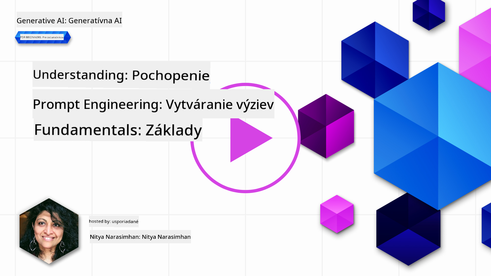
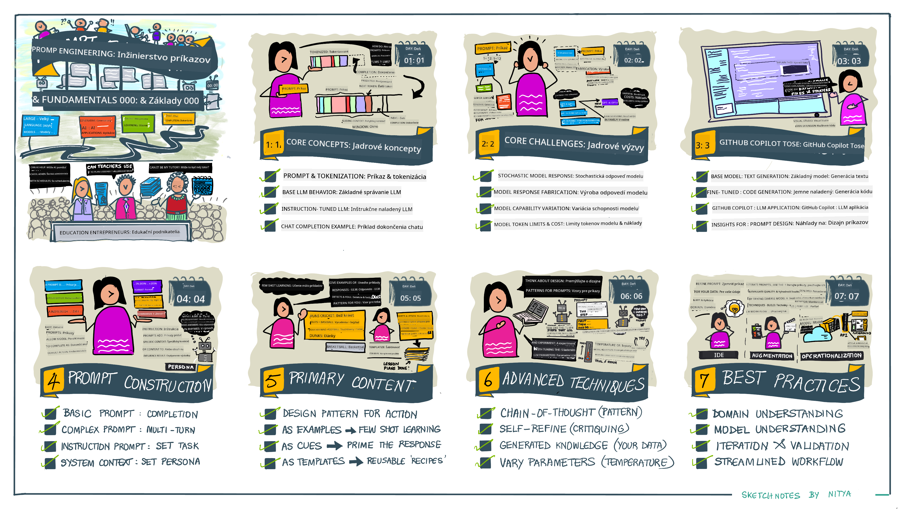
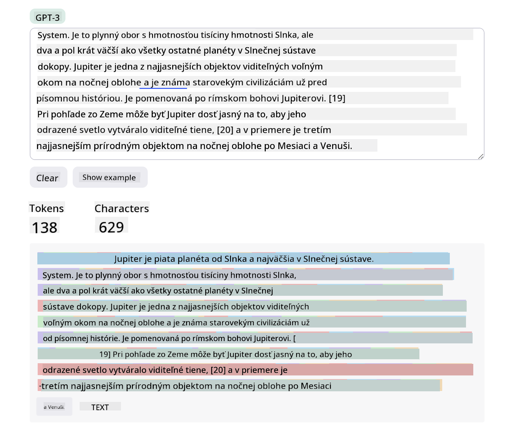
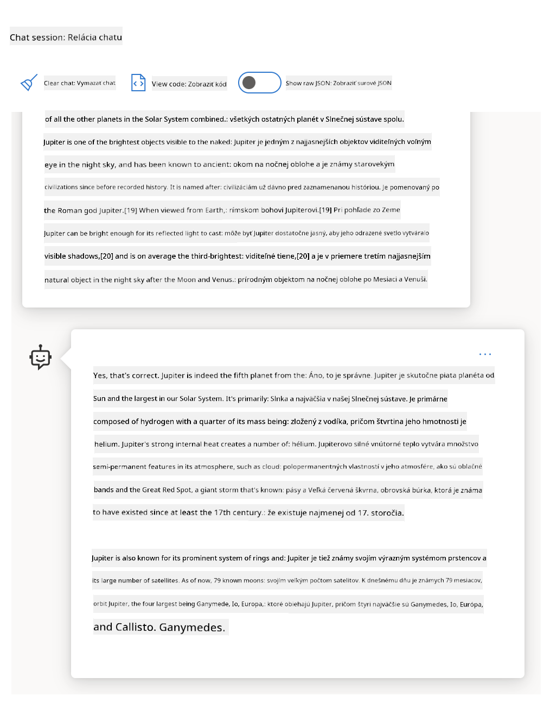
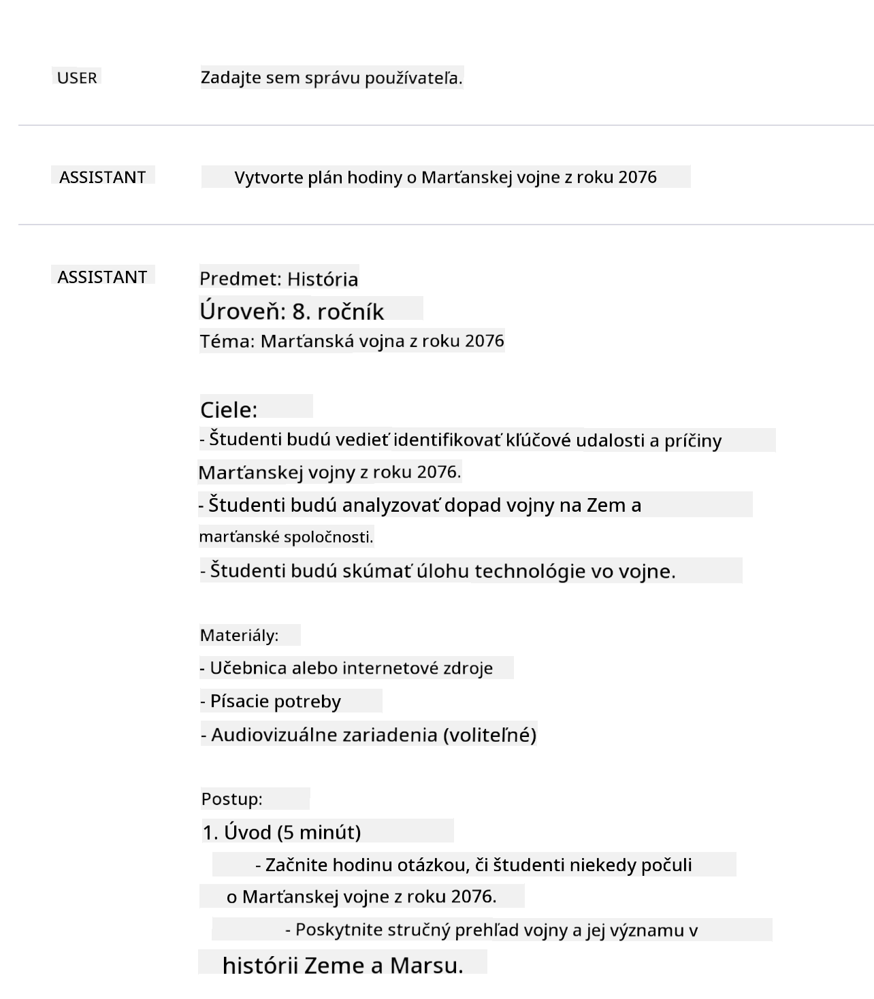
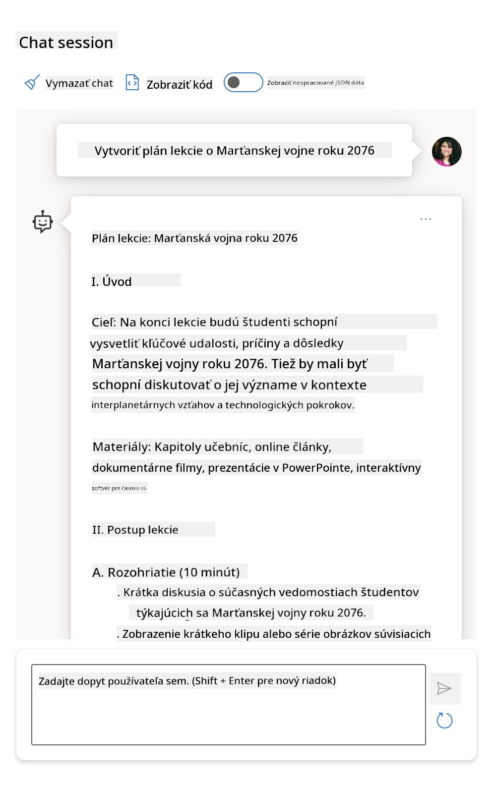
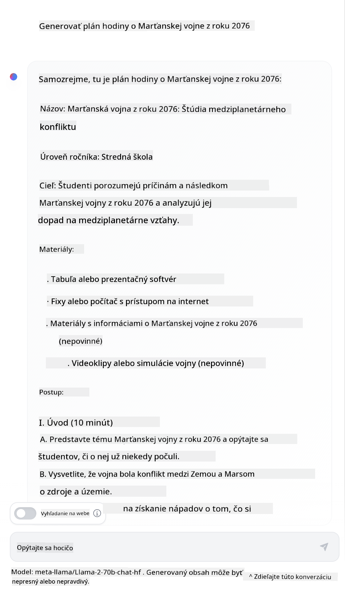

<!--
CO_OP_TRANSLATOR_METADATA:
{
  "original_hash": "a45c318dc6ebc2604f35b8b829f93af2",
  "translation_date": "2025-07-09T10:58:54+00:00",
  "source_file": "04-prompt-engineering-fundamentals/README.md",
  "language_code": "sk"
}
-->
# Základy návrhu promptov

[](https://aka.ms/gen-ai-lesson4-gh?WT.mc_id=academic-105485-koreyst)

## Úvod  
Tento modul pokrýva základné koncepty a techniky na tvorbu efektívnych promptov v generatívnych AI modeloch. Spôsob, akým napíšete prompt pre LLM, tiež zohráva dôležitú úlohu. Starostlivo vytvorený prompt môže priniesť lepšiu kvalitu odpovede. Ale čo presne znamenajú pojmy ako _prompt_ a _prompt engineering_? A ako zlepšiť prompt _vstup_, ktorý posielam LLM? Na tieto otázky sa pokúsime odpovedať v tejto kapitole a nasledujúcej.

_Generatívna AI_ je schopná vytvárať nový obsah (napr. text, obrázky, zvuk, kód a pod.) na základe požiadaviek používateľa. Dosahuje to pomocou _Large Language Models_ ako séria GPT od OpenAI („Generative Pre-trained Transformer“), ktoré sú trénované na prácu s prirodzeným jazykom a kódom.

Používatelia môžu teraz s týmito modelmi komunikovať pomocou známych formátov, ako je chat, bez potreby technických znalostí alebo školení. Modely sú _prompt-based_ – používatelia posielajú textový vstup (prompt) a dostávajú späť odpoveď AI (completion). Môžu potom s AI „chatovať“ iteratívne, v niekoľkých kolách, a upravovať prompt, kým odpoveď nebude vyhovovať ich očakávaniam.

„Prompty“ sa tak stávajú hlavným _programovacím rozhraním_ pre generatívne AI aplikácie, ktoré modelom hovoria, čo majú robiť, a ovplyvňujú kvalitu vrátených odpovedí. „Prompt Engineering“ je rýchlo rastúca oblasť, ktorá sa zameriava na _návrh a optimalizáciu_ promptov, aby sa dosahovali konzistentné a kvalitné odpovede vo veľkom meradle.

## Ciele učenia

V tejto lekcii sa naučíme, čo je Prompt Engineering, prečo je dôležitý a ako môžeme vytvárať efektívnejšie prompty pre daný model a cieľ aplikácie. Pochopíme základné koncepty a osvedčené postupy v návrhu promptov – a zoznámime sa s interaktívnym prostredím Jupyter Notebooku, kde si tieto koncepty môžeme vyskúšať na reálnych príkladoch.

Na konci lekcie budeme vedieť:

1. Vysvetliť, čo je prompt engineering a prečo je dôležitý.  
2. Opísať zložky promptu a ich použitie.  
3. Naučiť sa osvedčené postupy a techniky prompt engineeringu.  
4. Aplikovať naučené techniky na reálne príklady pomocou OpenAI endpointu.

## Kľúčové pojmy

Prompt Engineering: Prax navrhovania a dolaďovania vstupov, ktoré vedú AI modely k produkcii požadovaných výstupov.  
Tokenizácia: Proces rozdelenia textu na menšie jednotky, nazývané tokeny, ktoré model dokáže spracovať a pochopiť.  
Instruction-Tuned LLMs: Veľké jazykové modely (LLM), ktoré boli doladené pomocou špecifických inštrukcií na zlepšenie presnosti a relevantnosti odpovedí.

## Učebné prostredie (Learning Sandbox)

Prompt engineering je zatiaľ skôr umením než vedou. Najlepší spôsob, ako si zlepšiť intuíciu, je _viac cvičiť_ a prijať prístup pokus-omyl, ktorý kombinuje odborné znalosti v danej oblasti s odporúčanými technikami a optimalizáciami špecifickými pre model.

Jupyter Notebook, ktorý je súčasťou tejto lekcie, poskytuje _sandbox_ prostredie, kde si môžete vyskúšať, čo sa naučíte – priebežne alebo ako súčasť záverečnej úlohy. Na spustenie cvičení budete potrebovať:

1. **Azure OpenAI API kľúč** – endpoint služby pre nasadený LLM.  
2. **Python Runtime** – prostredie, v ktorom sa Notebook spustí.  
3. **Lokálne premenné prostredia** – _teraz dokončite kroky v [SETUP](./../00-course-setup/SETUP.md?WT.mc_id=academic-105485-koreyst), aby ste boli pripravení_.

Notebook obsahuje _štartovacie_ cvičenia – ale odporúčame pridať si vlastné sekcie _Markdown_ (popis) a _Code_ (požiadavky promptov), aby ste mohli skúšať viac príkladov alebo nápadov a budovať si intuíciu pre návrh promptov.

## Ilustrovaný sprievodca

Chcete získať prehľad o tom, čo táto lekcia pokrýva, ešte predtým, než sa do nej pustíte? Pozrite si tento ilustrovaný sprievodca, ktorý vám poskytne predstavu o hlavných témach a kľúčových bodoch, nad ktorými sa môžete zamyslieť. Plán lekcie vás prevedie od pochopenia základných konceptov a výziev až po ich riešenie pomocou relevantných techník prompt engineeringu a osvedčených postupov. Upozorňujeme, že sekcia „Pokročilé techniky“ v tomto sprievodcovi sa týka obsahu, ktorý je pokrytý v _nasledujúcej_ kapitole tohto kurzu.



## Naša startupová misia

Teraz si povedzme, ako sa _táto téma_ vzťahuje na našu misiu startupu, ktorou je [priniesť AI inovácie do vzdelávania](https://educationblog.microsoft.com/2023/06/collaborating-to-bring-ai-innovation-to-education?WT.mc_id=academic-105485-koreyst). Chceme vytvárať AI aplikácie pre _personalizované učenie_ – tak si predstavme, ako by rôzni používatelia našej aplikácie mohli „navrhovať“ prompty:

- **Administrátori** môžu požiadať AI o _analýzu dát učebných osnov na identifikáciu medzier v pokrytí_. AI môže zhrnúť výsledky alebo ich vizualizovať pomocou kódu.  
- **Učitelia** môžu požiadať AI o _vytvorenie plánu hodiny pre cieľovú skupinu a tému_. AI môže zostaviť personalizovaný plán v požadovanom formáte.  
- **Študenti** môžu požiadať AI o _doučovanie v náročnom predmete_. AI ich môže viesť lekciami, nápovedami a príkladmi prispôsobenými ich úrovni.

To je len špička ľadovca. Pozrite si [Prompts For Education](https://github.com/microsoft/prompts-for-edu/tree/main?WT.mc_id=academic-105485-koreyst) – open-source knižnicu promptov zostavenú odborníkmi na vzdelávanie – aby ste získali širší prehľad o možnostiach! _Vyskúšajte niektoré z týchto promptov v sandboxe alebo v OpenAI Playground a uvidíte, čo sa stane!_

<!--  
LESSON TEMPLATE:  
This unit should cover core concept #1.  
Reinforce the concept with examples and references.

CONCEPT #1:  
Prompt Engineering.  
Define it and explain why it is needed.  
-->

## Čo je Prompt Engineering?

Lekciu sme začali definíciou **Prompt Engineering** ako procesu _navrhovania a optimalizácie_ textových vstupov (promptov), ktoré prinášajú konzistentné a kvalitné odpovede (completions) pre daný cieľ aplikácie a model. Môžeme to vnímať ako dvojstupňový proces:

- _navrhnúť_ počiatočný prompt pre daný model a cieľ  
- _iteratívne dolaďovať_ prompt, aby sa zlepšila kvalita odpovede

Toto je nevyhnutne proces pokus-omyl, ktorý vyžaduje používateľskú intuíciu a úsilie na dosiahnutie optimálnych výsledkov. Prečo je to teda dôležité? Na odpoveď musíme najprv pochopiť tri koncepty:

- _Tokenizácia_ = ako model „vidí“ prompt  
- _Základné LLM_ = ako základný model „spracováva“ prompt  
- _Instruction-Tuned LLM_ = ako model teraz dokáže rozpoznať „úlohy“

### Tokenizácia

LLM vníma prompty ako _sekvenciu tokenov_, pričom rôzne modely (alebo verzie modelu) môžu ten istý prompt tokenizovať rôzne. Keďže LLM sú trénované na tokenoch (a nie na surovom texte), spôsob tokenizácie promptu priamo ovplyvňuje kvalitu generovanej odpovede.

Aby ste získali predstavu, ako tokenizácia funguje, vyskúšajte nástroje ako [OpenAI Tokenizer](https://platform.openai.com/tokenizer?WT.mc_id=academic-105485-koreyst) uvedený nižšie. Skopírujte svoj prompt a pozrite sa, ako sa rozdelí na tokeny, venujte pozornosť tomu, ako sa spracovávajú medzery a interpunkcia. Upozorňujeme, že tento príklad ukazuje starší LLM (GPT-3) – pri novšom modeli môže byť výsledok odlišný.



### Koncept: Základné modely (Foundation Models)

Keď je prompt tokenizovaný, hlavnou funkciou ["Base LLM"](https://blog.gopenai.com/an-introduction-to-base-and-instruction-tuned-large-language-models-8de102c785a6?WT.mc_id=academic-105485-koreyst) (alebo základného modelu) je predpovedať ďalší token v sekvencii. Keďže LLM sú trénované na obrovských textových dátach, majú dobrý prehľad o štatistických vzťahoch medzi tokenmi a dokážu túto predpoveď urobiť s istou istotou. Treba však poznamenať, že nerozumejú _významu_ slov v prompte alebo tokene; vidia len vzor, ktorý môžu „dokončiť“ ďalšou predpoveďou. Môžu pokračovať v predpovedaní sekvencie, kým ich nezastaví používateľ alebo nejaká prednastavená podmienka.

Chcete vidieť, ako funguje dokončovanie na základe promptu? Zadajte vyššie uvedený prompt do Azure OpenAI Studio [_Chat Playground_](https://oai.azure.com/playground?WT.mc_id=academic-105485-koreyst) s predvolenými nastaveniami. Systém je nastavený tak, aby považoval prompty za požiadavky na informácie – takže by ste mali vidieť odpoveď, ktorá zodpovedá tomuto kontextu.

Ale čo ak používateľ chce vidieť niečo konkrétne, čo spĺňa nejaké kritériá alebo cieľ úlohy? Tu prichádzajú do hry _instruction-tuned_ LLM.



### Koncept: Instruction Tuned LLM

[Instruction Tuned LLM](https://blog.gopenai.com/an-introduction-to-base-and-instruction-tuned-large-language-models-8de102c785a6?WT.mc_id=academic-105485-koreyst) vychádza zo základného modelu a doladí ho pomocou príkladov alebo vstupno-výstupných párov (napr. viackolových „správ“), ktoré obsahujú jasné inštrukcie – a odpoveď AI sa snaží tieto inštrukcie dodržať.

Používa techniky ako Reinforcement Learning with Human Feedback (RLHF), ktoré model naučia _dodržiavať inštrukcie_ a _učiť sa z spätnej väzby_, aby produkoval odpovede lepšie prispôsobené praktickým aplikáciám a relevantnejšie pre používateľské ciele.

Vyskúšajme to – vráťte sa k vyššie uvedenému promptu, ale teraz zmeňte _systémovú správu_ tak, aby obsahovala nasledujúcu inštrukciu ako kontext:

> _Zhrň obsah, ktorý dostaneš, pre žiaka druhého ročníka. Výsledok udrž na jeden odsek s 3-5 odrážkami._

Vidíte, ako je výsledok teraz prispôsobený požadovanému cieľu a formátu? Učiteľ môže túto odpoveď priamo použiť vo svojich prezentáciách pre danú triedu.


## Prečo potrebujeme Prompt Engineering?

Keď už vieme, ako LLM spracovávajú prompty, poďme sa pozrieť na to, _prečo_ potrebujeme prompt engineering. Odpoveď spočíva v tom, že súčasné LLM predstavujú niekoľko výziev, ktoré sťažujú dosiahnutie _spoľahlivých a konzistentných odpovedí_ bez vynaloženia úsilia na tvorbu a optimalizáciu promptov. Napríklad:

1. **Odpovede modelu sú náhodné.** _Ten istý prompt_ pravdepodobne vygeneruje rôzne odpovede pri rôznych modeloch alebo verziách modelu. A môže dokonca priniesť rôzne výsledky pri _tom istom modeli_ v rôznych časoch. _Techniky prompt engineeringu nám pomáhajú minimalizovať tieto odchýlky lepšími pravidlami_.

2. **Modely môžu vymýšľať odpovede.** Modely sú predtrénované na _veľkých, ale konečných_ dátach, čo znamená, že nemajú vedomosti o konceptoch mimo rozsah tréningu. Výsledkom môžu byť odpovede, ktoré sú nepresné, vymyslené alebo priamo protirečia známym faktom. _Techniky prompt engineeringu pomáhajú používateľom identifikovať a zmierniť takéto vymýšľanie napr. žiadosťou o citácie alebo zdôvodnenie_.

3. **Schopnosti modelov sa líšia.** Novšie modely alebo generácie modelov majú bohatšie schopnosti, ale prinášajú aj špecifické zvláštnosti a kompromisy v nákladoch a zložitosti. _Prompt engineering nám pomáha vyvíjať osvedčené postupy a pracovné postupy, ktoré abstrahujú tieto rozdiely a prispôsobujú sa špecifickým požiadavkám modelu škálovateľným a plynulým spôsobom_.

Pozrime sa na to v praxi v OpenAI alebo Azure OpenAI Playground:

- Použite ten istý prompt s rôznymi nasadeniami LLM (napr. OpenAI, Azure OpenAI, Hugging Face) – videli ste rozdiely?  
- Použite ten istý prompt opakovane s _tým istým_ nasadením LLM (napr. Azure OpenAI playground) – ako sa tieto odpovede líšili?

### Príklad vymýšľania (Fabrications)

V tomto kurze používame pojem **„fabrication“** na označenie javu, keď LLM niekedy generujú fakticky nesprávne informácie kvôli obmedzeniam v tréningu alebo iným faktorom. Tento jav ste možno počuli aj pod názvom _„halucinácie“_ v populárnych článkoch alebo vedeckých prácach. My však dôrazne odporúčame používať termín _„fabrication“_, aby sme sa vyhli antropomorfizácii správania a nepripisovali stroju ľudské vlastnosti. Tým tiež podporujeme [zásady zodpovednej AI](https://www.microsoft.com/ai/responsible-ai?WT.mc_id=academic-105485-koreyst) z hľadiska terminológie, vyhýbajúc sa výrazom, ktoré môžu byť v niektorých kontextoch považované za nevhodné alebo neinkluzívne.

Chcete si urobiť predstavu, ako funguje vymýšľanie? Predstavte si prompt, ktorý inštruuje AI vytvoriť obsah o neexistujúcej téme (aby ste sa uistili, že sa nenachádza v tréningovej množine). Napríklad – vyskúšal som tento prompt:
# Plán lekcie: Marsianská vojna v roku 2076

## Ciele lekcie
- Pochopiť príčiny a priebeh Marsianskej vojny v roku 2076
- Analyzovať hlavné udalosti a ich dopad na ľudstvo a Mars
- Diskutovať o technologických a spoločenských zmenách vyvolaných vojnou

## Úvod (10 minút)
- Predstavenie témy: Čo bola Marsianská vojna?
- Krátky prehľad historického kontextu pred rokom 2076
- Otázky na zamyslenie: Prečo by mohlo dôjsť k vojne medzi Zemou a Marsom?

## Hlavná časť (30 minút)
### Príčiny vojny
- Politické napätie medzi Zemou a Marsom
- Zdroje a kontrola nad Marsom
- Vývoj technológií a zbrojenia

### Priebeh vojny
- Kľúčové bitky a udalosti
- Použité zbrane a taktiky
- Úloha medziplanetárnych spojenectiev

### Dôsledky vojny
- Dopad na civilné obyvateľstvo a infraštruktúru
- Zmeny v medziplanetárnej politike
- Technologický pokrok a jeho využitie po vojne

## Diskusia a záver (15 minút)
- Otvorená diskusia: Mohla sa vojna vyhnúť? Ako?
- Reflexia: Čo sa môžeme naučiť z Marsianskej vojny?
- Zhrnutie hlavných bodov lekcie

## Domáca úloha
- Napísať krátku esej o tom, ako by sa mohla vyvíjať budúcnosť Marsu po vojne
- Pripraviť prezentáciu o jednej z technológií použitých počas Marsianskej vojny
Webové vyhľadávanie mi ukázalo, že existujú fiktívne príbehy (napr. televízne seriály alebo knihy) o martianskych vojnách – ale žiadne z roku 2076. Zdravý rozum nám tiež hovorí, že rok 2076 je _v budúcnosti_ a preto nemôže byť spojený so skutočnou udalosťou.

Čo sa teda stane, keď spustíme tento prompt u rôznych poskytovateľov LLM?

> **Odpoveď 1**: OpenAI Playground (GPT-35)



> **Odpoveď 2**: Azure OpenAI Playground (GPT-35)



> **Odpoveď 3**: : Hugging Face Chat Playground (LLama-2)



Ako sa dalo očakávať, každý model (alebo verzia modelu) generuje mierne odlišné odpovede vďaka stochastickému správaniu a rozdielom v schopnostiach modelu. Napríklad jeden model cieli na publikum ôsmeho ročníka, zatiaľ čo iný predpokladá študenta strednej školy. No všetky tri modely vytvorili odpovede, ktoré by mohli presvedčiť neinformovaného používateľa, že udalosť bola skutočná.

Techniky prompt engineeringu ako _metaprompting_ a _nastavenie teploty_ môžu do určitej miery znížiť tvorbu nepravdivých informácií modelom. Nové _architektúry_ prompt engineeringu tiež bezproblémovo integrujú nové nástroje a techniky do toku promptu, aby zmiernili alebo znížili niektoré z týchto efektov.

## Prípadová štúdia: GitHub Copilot

Záverom tejto sekcie si ukážeme, ako sa prompt engineering používa v reálnych riešeniach na príklade jednej prípadovej štúdie: [GitHub Copilot](https://github.com/features/copilot?WT.mc_id=academic-105485-koreyst).

GitHub Copilot je váš „AI parťák programátor“ – prevádza textové prompty na dokončenia kódu a je integrovaný do vášho vývojového prostredia (napr. Visual Studio Code) pre plynulý používateľský zážitok. Ako je zdokumentované v sérii blogov nižšie, najskoršia verzia bola založená na modeli OpenAI Codex – pričom inžinieri rýchlo pochopili potrebu doladiť model a vyvinúť lepšie techniky prompt engineeringu na zlepšenie kvality kódu. V júli predstavili [vylepšený AI model, ktorý presahuje Codex](https://github.blog/2023-07-28-smarter-more-efficient-coding-github-copilot-goes-beyond-codex-with-improved-ai-model/?WT.mc_id=academic-105485-koreyst) pre ešte rýchlejšie návrhy.

Prečítajte si príspevky v poradí, aby ste sledovali ich učebnú cestu.

- **Máj 2023** | [GitHub Copilot sa zlepšuje v porozumení vášho kódu](https://github.blog/2023-05-17-how-github-copilot-is-getting-better-at-understanding-your-code/?WT.mc_id=academic-105485-koreyst)
- **Máj 2023** | [Inside GitHub: Práca s LLM za GitHub Copilot](https://github.blog/2023-05-17-inside-github-working-with-the-llms-behind-github-copilot/?WT.mc_id=academic-105485-koreyst)
- **Jún 2023** | [Ako písať lepšie prompty pre GitHub Copilot](https://github.blog/2023-06-20-how-to-write-better-prompts-for-github-copilot/?WT.mc_id=academic-105485-koreyst)
- **Júl 2023** | [GitHub Copilot presahuje Codex s vylepšeným AI modelom](https://github.blog/2023-07-28-smarter-more-efficient-coding-github-copilot-goes-beyond-codex-with-improved-ai-model/?WT.mc_id=academic-105485-koreyst)
- **Júl 2023** | [Sprievodca vývojára prompt engineeringom a LLM](https://github.blog/2023-07-17-prompt-engineering-guide-generative-ai-llms/?WT.mc_id=academic-105485-koreyst)
- **Sep 2023** | [Ako vytvoriť podnikateľskú LLM aplikáciu: Lekcie z GitHub Copilot](https://github.blog/2023-09-06-how-to-build-an-enterprise-llm-application-lessons-from-github-copilot/?WT.mc_id=academic-105485-koreyst)

Môžete tiež prezerať ich [inžiniersky blog](https://github.blog/category/engineering/?WT.mc_id=academic-105485-koreyst) pre ďalšie príspevky ako [tento](https://github.blog/2023-09-27-how-i-used-github-copilot-chat-to-build-a-reactjs-gallery-prototype/?WT.mc_id=academic-105485-koreyst), ktorý ukazuje, ako sa tieto modely a techniky _aplikujú_ na tvorbu reálnych aplikácií.

---

<!--
LESSON TEMPLATE:
Táto jednotka by mala pokryť základný koncept #2.
Posilniť koncept príkladmi a odkazmi.

KONCEPT #2:
Návrh promptu.
Ilustrované príkladmi.
-->

## Konštrukcia promptu

Videli sme, prečo je prompt engineering dôležitý – teraz si vysvetlíme, ako sa prompty _konštruujú_, aby sme mohli vyhodnotiť rôzne techniky pre efektívnejší návrh promptov.

### Základný prompt

Začnime so základným promptom: textovým vstupom zaslaným modelu bez ďalšieho kontextu. Tu je príklad – keď pošleme prvé slová americkej národnej hymny do OpenAI [Completion API](https://platform.openai.com/docs/api-reference/completions?WT.mc_id=academic-105485-koreyst), model okamžite _dokončí_ odpoveď ďalšími riadkami, čo ilustruje základné predikčné správanie.

| Prompt (vstup)     | Dokončenie (výstup)                                                                                                                        |
| :----------------- | :----------------------------------------------------------------------------------------------------------------------------------------- |
| Oh say can you see | Zdá sa, že začínate text piesne „The Star-Spangled Banner“, národnej hymny Spojených štátov. Celý text je ... |

### Zložitý prompt

Teraz pridajme ku základnému promptu kontext a inštrukcie. [Chat Completion API](https://learn.microsoft.com/azure/ai-services/openai/how-to/chatgpt?WT.mc_id=academic-105485-koreyst) nám umožňuje vytvoriť zložitý prompt ako kolekciu _správ_ s:

- pármi vstup/výstup odrážajúcimi vstup používateľa a odpoveď asistenta.
- systémovou správou, ktorá nastavuje kontext správania alebo osobnosti asistenta.

Žiadosť má teraz nasledujúcu formu, kde _tokenizácia_ efektívne zachytáva relevantné informácie z kontextu a konverzácie. Zmena systémového kontextu môže mať rovnaký vplyv na kvalitu dokončení ako samotné vstupy používateľa.

```python
response = openai.chat.completions.create(
    model="gpt-3.5-turbo",
    messages=[
        {"role": "system", "content": "You are a helpful assistant."},
        {"role": "user", "content": "Who won the world series in 2020?"},
        {"role": "assistant", "content": "The Los Angeles Dodgers won the World Series in 2020."},
        {"role": "user", "content": "Where was it played?"}
    ]
)
```

### Inštrukčný prompt

V predchádzajúcich príkladoch bol prompt jednoduchý textový dopyt, ktorý sa dal interpretovať ako žiadosť o informácie. Pri _inštrukčných_ promptoch môžeme použiť text na podrobnejšie špecifikovanie úlohy a poskytnúť AI lepšie usmernenie. Tu je príklad:

| Prompt (vstup)                                                                                                                                                                                                                         | Dokončenie (výstup)                                                                                                        | Typ inštrukcie     |
| :------------------------------------------------------------------------------------------------------------------------------------------------------------------------------------------------------------------------------------- | :------------------------------------------------------------------------------------------------------------------------- | :----------------- |
| Napíš popis Občianskej vojny                                                                                                                                                                                                           | _vrátil jednoduchý odsek_                                                                                                  | Jednoduchý         |
| Napíš popis Občianskej vojny. Uveď kľúčové dátumy a udalosti a popíš ich význam                                                                                                                                                         | _vrátil odsek nasledovaný zoznamom kľúčových dátumov udalostí s popismi_                                                    | Zložitý            |
| Napíš popis Občianskej vojny v 1 odseku. Uveď 3 odrážky s kľúčovými dátumami a ich významom. Uveď ďalšie 3 odrážky s významnými historickými osobnosťami a ich prínosmi. Výstup vráť vo formáte JSON | _vracia podrobnejšie informácie v textovom poli, formátované ako JSON, ktoré môžete skopírovať do súboru a podľa potreby overiť_ | Zložitý. Formátovaný.|

## Primárny obsah

V predchádzajúcich príkladoch bol prompt stále pomerne otvorený, čo umožňovalo LLM rozhodnúť, ktorá časť jeho predtrénovaných dát je relevantná. Pri návrhovom vzore _primárny obsah_ je vstupný text rozdelený na dve časti:

- inštrukcia (akcia)
- relevantný obsah (ktorý ovplyvňuje akciu)

Tu je príklad, kde inštrukcia znie „zhrň toto do 2 viet“.

| Prompt (vstup)                                                                                                                                                                                                                                                                                                                                                                                                                                                                                                                                                                                                                                                                                      | Dokončenie (výstup)                                                                                                                                                                                                                                                                             |
| :-------------------------------------------------------------------------------------------------------------------------------------------------------------------------------------------------------------------------------------------------------------------------------------------------------------------------------------------------------------------------------------------------------------------------------------------------------------------------------------------------------------------------------------------------------------------------------------------------------------------------------------------------------------------------------------------------- | :---------------------------------------------------------------------------------------------------------------------------------------------------------------------------------------------------------------------------------------------------------------------------------------------- |
| Jupiter je piata planéta od Slnka a najväčšia v Slnečnej sústave. Je to plynný obor s hmotnosťou tisícinu hmotnosti Slnka, no dvojnásobne väčšou ako všetky ostatné planéty Slnečnej sústavy dokopy. Jupiter je jedným z najsvetlejších objektov viditeľných voľným okom na nočnej oblohe a je známy starovekým civilizáciám ešte pred zaznamenanou históriou. Je pomenovaný po rímskom bohu Jupiterovi.[19] Keď sa naň pozeráme zo Zeme, môže byť dostatočne jasný na to, aby jeho odrazené svetlo vrhalo viditeľné tiene,[20] a je v priemere tretím najsvetlejším prírodným objektom na nočnej oblohe po Mesiaci a Venuši. <br/> **Zhrň toto do 2 krátkych viet** | Jupiter, piata planéta od Slnka, je najväčšia v Slnečnej sústave a je známa ako jeden z najsvetlejších objektov na nočnej oblohe. Pomenovaná po rímskom bohu Jupiterovi, je to plynný obor s hmotnosťou dvojnásobnou ako všetky ostatné planéty Slnečnej sústavy dokopy. |

Segment primárneho obsahu možno využiť rôznymi spôsobmi na efektívnejšie inštrukcie:

- **Príklady** – namiesto explicitného povedania modelu, čo má robiť, mu dajte príklady a nechajte ho odvodiť vzor.
- **Náznaky** – nasledujte inštrukciu „náznakom“, ktorý pripraví dokončenie a nasmeruje model k relevantnejším odpovediam.
- **Šablóny** – opakovateľné „recepty“ na prompty s zástupnými znakmi (premennými), ktoré možno prispôsobiť dátami pre konkrétne prípady použitia.

Poďme si ich ukázať v praxi.

### Použitie príkladov

Toto je prístup, kde použijete primárny obsah na „nakŕmenie modelu“ príkladmi požadovaného výstupu pre danú inštrukciu a necháte ho odvodiť vzor požadovaného výstupu. Podľa počtu poskytnutých príkladov môžeme mať zero-shot prompting, one-shot prompting, few-shot prompting a pod.

Prompt teraz pozostáva z troch častí:

- Popis úlohy
- Niekoľko príkladov požadovaného výstupu
- Začiatok nového príkladu (ktorý sa stáva implicitným popisom úlohy)

| Typ učenia   | Prompt (vstup)                                                                                                                                        | Dokončenie (výstup)         |
| :----------- | :---------------------------------------------------------------------------------------------------------------------------------------------------- | :-------------------------- |
| Zero-shot    | „The Sun is Shining“. Prelož do španielčiny                                                                                                         | „El Sol está brillando“.    |
| One-shot     | „The Sun is Shining“ => „El Sol está brillando“. <br> „It's a Cold and Windy Day“ =>                                                                 | „Es un día frío y ventoso“. |
| Few-shot     | The player ran the bases => Baseball <br/> The player hit an ace => Tennis <br/> The player hit a six => Cricket <br/> The player made a slam-dunk => | Basketball                  |
|              |                                                                                                                                                       |                             |

Všimnite si, že pri zero-shot prompting sme museli explicitne uviesť inštrukciu („Prelož do španielčiny“), ale v one-shot príklade sa už inštrukcia odvádza. Few-shot príklad ukazuje, ako pridanie viacerých príkladov umožňuje modelom robiť presnejšie závery bez ďalších inštrukcií.

### Náznaky promptu

Ďalšou technikou využitia primárneho obsahu je poskytnúť _náznaky_ namiesto príkladov. V tomto prípade modelu „naznačujeme“ správnym začiatkom, ktorý odráža požadovaný formát odpovede. Model potom „berie náznak“ a pokračuje v rovnakom štýle.

| Počet náznakov | Prompt (vstup)                                                                                                                                                                                                                                                                                                                                                                                                                                               | Dokončenie (výstup)                                                                                                                                                                                                                                                                                       |
| :------------- | :----------------------------------------------------------------------------------------------------------------------------------------------------------------------------------------------------------------------------------------------------------------------------------------------------------------------------------------------------------------------------------------------------------------------------------------------------------- | :-------------------------------------------------------------------------------------------------------------------------------------------------------------------------------------------------------------------------------------------------------------------------------------------------------- |
| 0              | Jupiter je piata planéta od Slnka a najväčšia v Slnečnej sústave. Je to plynný obor s hmotnosťou tisícinu hmotnosti Slnka, no dvojnásobne väčšou ako všetky ostatné planéty Slnečnej sústavy dokopy. Jupiter je jedným z najsvetlejších objektov viditeľných voľným okom na nočnej oblohe, a je známy starovekým civilizáciám ešte pred zaznamenanou históriou.

**Zhrňte toto**                                       | Jupiter je najväčšia planéta v našej slnečnej sústave a piata od Slnka. Je to plynný obor s hmotnosťou 1/1000 hmotnosti Slnka, no je ťažší ako všetky ostatné planéty dokopy. Staroveké civilizácie poznali Jupiter už dávno a je ľahko viditeľný na nočnej oblohe. |
| 1              | Jupiter je piata planéta od Slnka a najväčšia v slnečnej sústave. Je to plynný obor s hmotnosťou jednej tisíciny hmotnosti Slnka, no váži dvakrát a pol viac ako všetky ostatné planéty v slnečnej sústave dokopy. Jupiter je jedným z najsvetlejších objektov viditeľných voľným okom na nočnej oblohe a bol známy starovekým civilizáciám už pred zaznamenanou históriou. <br/>**Zhrňte toto** <br/> Čo sme sa naučili je, že Jupiter | je piata planéta od Slnka a najväčšia v slnečnej sústave. Je to plynný obor s hmotnosťou jednej tisíciny hmotnosti Slnka, no váži dvakrát a pol viac ako všetky ostatné planéty dokopy. Je ľahko viditeľný voľným okom a je známy od staroveku.                        |
| 2              | Jupiter je piata planéta od Slnka a najväčšia v slnečnej sústave. Je to plynný obor s hmotnosťou jednej tisíciny hmotnosti Slnka, no váži dvakrát a pol viac ako všetky ostatné planéty v slnečnej sústave dokopy. Jupiter je jedným z najsvetlejších objektov viditeľných voľným okom na nočnej oblohe a bol známy starovekým civilizáciám už pred zaznamenanou históriou. <br/>**Zhrňte toto** <br/> Top 3 fakty, ktoré sme sa naučili:         | 1. Jupiter je piata planéta od Slnka a najväčšia v slnečnej sústave. <br/> 2. Je to plynný obor s hmotnosťou jednej tisíciny hmotnosti Slnka...<br/> 3. Jupiter je viditeľný voľným okom už od staroveku ...                                                                       |
|                |                                                                                                                                                                                                                                                                                                                                                                                                                                                              |                                                                                                                                                                                                                                                                                                           |

### Šablóny promptov

Šablóna promptu je _preddefinovaný recept na prompt_, ktorý možno uložiť a podľa potreby opakovane použiť, aby sa zabezpečila konzistentnejšia používateľská skúsenosť vo veľkom meradle. V najjednoduchšej podobe je to zbierka príkladov promptov ako [tento od OpenAI](https://platform.openai.com/examples?WT.mc_id=academic-105485-koreyst), ktorý poskytuje interaktívne komponenty promptu (správy používateľa a systému) a formát požiadavky riadený API – na podporu opätovného použitia.

V zložitejšej podobe, ako napríklad [tento príklad od LangChain](https://python.langchain.com/docs/concepts/prompt_templates/?WT.mc_id=academic-105485-koreyst), obsahuje _zástupné symboly_, ktoré možno nahradiť údajmi z rôznych zdrojov (vstup používateľa, kontext systému, externé zdroje dát atď.) na dynamické generovanie promptu. To nám umožňuje vytvoriť knižnicu opakovane použiteľných promptov, ktoré možno **programovo** použiť na zabezpečenie konzistentnej používateľskej skúsenosti vo veľkom meradle.

Skutočná hodnota šablón spočíva v možnosti vytvárať a publikovať _knižnice promptov_ pre vertikálne aplikačné oblasti – kde je šablóna promptu _optimalizovaná_ tak, aby odrážala kontext alebo príklady špecifické pre danú aplikáciu, čím sa odpovede stávajú relevantnejšími a presnejšími pre cieľové publikum. Repozitár [Prompts For Edu](https://github.com/microsoft/prompts-for-edu?WT.mc_id=academic-105485-koreyst) je skvelým príkladom tohto prístupu, ktorý zhromažďuje knižnicu promptov pre vzdelávaciu oblasť so zameraním na kľúčové ciele ako plánovanie lekcií, návrh učebných osnov, doučovanie študentov a pod.

## Podporný obsah

Ak uvažujeme o konštrukcii promptu ako o inštrukcii (úlohe) a cieli (primárnom obsahu), potom _sekundárny obsah_ je ako dodatočný kontext, ktorý poskytujeme na **ovplyvnenie výstupu určitým spôsobom**. Môžu to byť ladacie parametre, inštrukcie na formátovanie, taxonómie tém a podobne, ktoré pomáhajú modelu _prispôsobiť_ odpoveď tak, aby vyhovovala požadovaným cieľom alebo očakávaniam používateľa.

Napríklad: Ak máme katalóg kurzov s rozsiahlymi metadátami (názov, popis, úroveň, značky metadát, lektor atď.) o všetkých dostupných kurzoch v učebnom pláne:

- môžeme definovať inštrukciu „zhrnúť katalóg kurzov na jeseň 2023“
- môžeme použiť primárny obsah na poskytnutie niekoľkých príkladov požadovaného výstupu
- môžeme použiť sekundárny obsah na identifikáciu top 5 „značiek“ záujmu.

Model potom môže poskytnúť zhrnutie vo formáte podľa uvedených príkladov – ale ak má výsledok viacero značiek, môže uprednostniť 5 značiek identifikovaných v sekundárnom obsahu.

---

<!--
ŠABLÓNA LEKCIE:
Táto jednotka by mala pokryť základný koncept č. 1.
Posilniť koncept príkladmi a odkazmi.

KONCEPT Č. 3:
Techniky prompt engineeringu.
Aké sú základné techniky prompt engineeringu?
Ilustrujte to niekoľkými cvičeniami.
-->

## Najlepšie postupy pri promptovaní

Keď už vieme, ako možno prompt _konštruovať_, môžeme začať premýšľať o tom, ako ich _navrhnúť_ tak, aby odrážali najlepšie postupy. Môžeme to rozdeliť na dve časti – mať správny _postoj_ a aplikovať správne _techniky_.

### Postoj k prompt engineeringu

Prompt engineering je proces pokusov a omylov, preto majte na pamäti tri základné usmerňujúce faktory:

1. **Dôležité je porozumenie domény.** Presnosť a relevantnosť odpovede závisí od _domény_, v ktorej aplikácia alebo používateľ pôsobí. Použite svoju intuíciu a odborné znalosti v danej oblasti na ďalšie **prispôsobenie techník**. Napríklad definujte _osobnosti špecifické pre doménu_ v systémových promptoch alebo používajte _šablóny špecifické pre doménu_ v používateľských promptoch. Poskytnite sekundárny obsah, ktorý odráža kontext špecifický pre doménu, alebo použite _doménové signály a príklady_ na nasmerovanie modelu k známym vzorom použitia.

2. **Dôležité je porozumenie modelu.** Vieme, že modely sú z podstaty stochastické. Implementácie modelov sa však môžu líšiť podľa použitého tréningového datasetu (predtrénované znalosti), schopností, ktoré poskytujú (napr. cez API alebo SDK) a typu obsahu, na ktorý sú optimalizované (napr. kód vs. obrázky vs. text). Pochopte silné a slabé stránky modelu, ktorý používate, a využite tieto poznatky na _prioritizáciu úloh_ alebo vytváranie _prispôsobených šablón_ optimalizovaných pre schopnosti modelu.

3. **Dôležitá je iterácia a validácia.** Modely sa rýchlo vyvíjajú, rovnako ako techniky prompt engineeringu. Ako odborník v danej oblasti môžete mať ďalší kontext alebo kritériá pre _vašu_ konkrétnu aplikáciu, ktoré nemusia platiť pre širšiu komunitu. Používajte nástroje a techniky prompt engineeringu na „rýchly štart“ konštrukcie promptov, potom iterujte a validujte výsledky pomocou vlastnej intuície a odborných znalostí. Zaznamenávajte svoje poznatky a vytvorte **databázu znalostí** (napr. knižnice promptov), ktorú môžu ostatní použiť ako novú východiskovú bázu pre rýchlejšie iterácie v budúcnosti.

## Najlepšie postupy

Pozrime sa teraz na bežné najlepšie postupy, ktoré odporúčajú odborníci z [OpenAI](https://help.openai.com/en/articles/6654000-best-practices-for-prompt-engineering-with-openai-api?WT.mc_id=academic-105485-koreyst) a [Azure OpenAI](https://learn.microsoft.com/azure/ai-services/openai/concepts/prompt-engineering#best-practices?WT.mc_id=academic-105485-koreyst).

| Čo                              | Prečo                                                                                                                                                                                                                                               |
| :-------------------------------- | :------------------------------------------------------------------------------------------------------------------------------------------------------------------------------------------------------------------------------------------------ |
| Vyhodnocujte najnovšie modely.       | Nové generácie modelov pravdepodobne prinášajú vylepšené funkcie a kvalitu – môžu však tiež znamenať vyššie náklady. Vyhodnoťte ich dopad a potom sa rozhodnite o migrácii.                                                                                |
| Oddelujte inštrukcie a kontext   | Skontrolujte, či váš model/poskytovateľ definuje _delimitery_ na jasnejšie rozlíšenie inštrukcií, primárneho a sekundárneho obsahu. To pomáha modelom presnejšie priraďovať váhy tokenom.                                                         |
| Buďte konkrétni a jasní             | Poskytnite viac detailov o požadovanom kontexte, výsledku, dĺžke, formáte, štýle atď. To zlepší kvalitu aj konzistenciu odpovedí. Zachyťte recepty v opakovane použiteľných šablónach.                                                          |
| Buďte popisní, používajte príklady      | Modely môžu lepšie reagovať na prístup „ukáž a povedz“. Začnite s `zero-shot` prístupom, kde dáte inštrukciu (bez príkladov), potom skúste `few-shot` ako doladenie, kde poskytnete niekoľko príkladov požadovaného výstupu. Používajte analógie. |
| Používajte signály na naštartovanie dokončení | Podporte model k požadovanému výsledku tým, že mu dáte niekoľko úvodných slov alebo fráz, ktoré môže použiť ako východiskový bod pre odpoveď.                                                                                                               |
| Opakujte, ak treba                       | Niekedy je potrebné modelu niečo zopakovať. Dajte inštrukcie pred a po primárnom obsahu, použite inštrukciu a signál, atď. Iterujte a validujte, čo funguje najlepšie.                                                         |
| Poradie má význam                     | Poradie, v akom modelu prezentujete informácie, môže ovplyvniť výstup, dokonca aj v príkladoch na učenie, kvôli efektu nedávnosti. Vyskúšajte rôzne možnosti, aby ste zistili, čo funguje najlepšie.                                                               |
| Dajte modelu „východisko“           | Poskytnite modelu _náhradnú_ odpoveď, ktorú môže použiť, ak z nejakého dôvodu nedokáže úlohu dokončiť. To znižuje pravdepodobnosť generovania nepravdivých alebo vymyslených odpovedí.                                                         |
|                                   |                                                                                                                                                                                                                                                   |

Ako pri každom najlepšom postupe, pamätajte, že _výsledky sa môžu líšiť_ v závislosti od modelu, úlohy a domény. Používajte ich ako východiskový bod a iterujte, aby ste našli, čo vám najviac vyhovuje. Neustále prehodnocujte svoj proces prompt engineeringu, keď sa objavujú nové modely a nástroje, so zameraním na škálovateľnosť procesu a kvalitu odpovedí.

<!--
ŠABLÓNA LEKCIE:
Táto jednotka by mala obsahovať kódovú výzvu, ak je to vhodné.

VÝZVA:
Odkaz na Jupyter Notebook, kde sú v inštrukciách len komentáre kódu (sekcie kódu sú prázdne).

RIEŠENIE:
Odkaz na kópiu toho istého Notebooku s vyplnenými promptmi a spusteným kódom, ukazujúcim jeden príklad výstupu.
-->

## Zadanie

Gratulujeme! Dostali ste sa na koniec lekcie! Je čas otestovať niektoré z týchto konceptov a techník na reálnych príkladoch!

Pre naše zadanie budeme používať Jupyter Notebook s cvičeniami, ktoré môžete interaktívne dokončiť. Notebook si môžete tiež rozšíriť o vlastné Markdown a kódové bunky, aby ste si mohli samostatne skúmať nápady a techniky.

### Na začiatok si forknete repozitár, potom

- (Odporúčané) Spustite GitHub Codespaces
- (Alternatívne) Klonujte repozitár do svojho lokálneho zariadenia a používajte ho s Docker Desktop
- (Alternatívne) Otvorte Notebook vo vašom preferovanom prostredí pre spúšťanie Notebookov.

### Ďalej nastavte svoje premenné prostredia

- Skopírujte súbor `.env.copy` v koreňovom adresári repozitára do `.env` a vyplňte hodnoty `AZURE_OPENAI_API_KEY`, `AZURE_OPENAI_ENDPOINT` a `AZURE_OPENAI_DEPLOYMENT`. Potom sa vráťte do sekcie [Learning Sandbox](../../../04-prompt-engineering-fundamentals/04-prompt-engineering-fundamentals), kde sa naučíte, ako na to.

### Potom otvorte Jupyter Notebook

- Vyberte runtime kernel. Ak používate možnosti 1 alebo 2, jednoducho vyberte predvolený Python 3.10.x kernel poskytovaný vývojárskym kontajnerom.

Ste pripravení spustiť cvičenia. Upozorňujeme, že tu neexistujú _správne a nesprávne_ odpovede – ide o skúmanie možností metódou pokus-omyl a budovanie intuície, čo funguje pre daný model a aplikačnú doménu.

_Preto v tejto lekcii nie sú žiadne segmenty s riešením kódu. Namiesto toho budú v Notebooku Markdown bunky s názvom „Moje riešenie:“, ktoré ukážu jeden príklad výstupu na referenciu._

 <!--
ŠABLÓNA LEKCIE:
Zhrňte sekciu a pridajte zdroje na samostatné štúdium.
-->

## Kontrola vedomostí

Ktorý z nasledujúcich promptov je dobrý a zodpovedá rozumným najlepším praktikám?

1. Ukáž mi obrázok červeného auta
2. Ukáž mi obrázok červeného auta značky Volvo a modelu XC90 zaparkovaného pri útesu pri západe slnka
3. Ukáž mi obrázok červeného auta značky Volvo a modelu XC90

Odpoveď: 2, je to najlepší prompt, pretože poskytuje detaily o „čom“ a ide do špecifík (nie len akékoľvek auto, ale konkrétna značka a model) a zároveň popisuje celkové prostredie. 3 je druhý najlepší, pretože tiež obsahuje veľa popisu.

## 🚀 Výzva

Skúste využiť techniku „signálu“ s promptom: Dokonči vetu „Ukáž mi obrázok červeného auta značky Volvo a “. Čo odpovie a ako by ste to vylepšili?

## Skvelá práca! Pokračujte v učení

Chcete sa dozvedieť viac o rôznych konceptoch prompt engineeringu? Navštívte [stránku s pokračujúcim vzdelávaním](https://aka.ms/genai-collection?WT.mc_id=academic-105485-koreyst), kde nájdete ďalšie skvelé zdroje na túto tému.

Prejdite na Lekciu 5, kde sa pozrieme na [pokročilé techniky promptovania](../05-advanced-prompts/README.md?WT.mc_id=academic-105485-koreyst)!

**Vyhlásenie o zodpovednosti**:  
Tento dokument bol preložený pomocou AI prekladateľskej služby [Co-op Translator](https://github.com/Azure/co-op-translator). Aj keď sa snažíme o presnosť, prosím, majte na pamäti, že automatizované preklady môžu obsahovať chyby alebo nepresnosti. Originálny dokument v jeho pôvodnom jazyku by mal byť považovaný za autoritatívny zdroj. Pre kritické informácie sa odporúča profesionálny ľudský preklad. Nie sme zodpovední za akékoľvek nedorozumenia alebo nesprávne interpretácie vyplývajúce z použitia tohto prekladu.