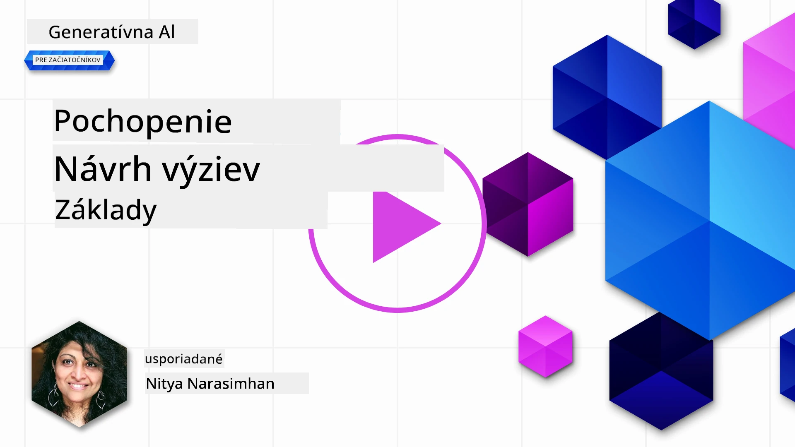
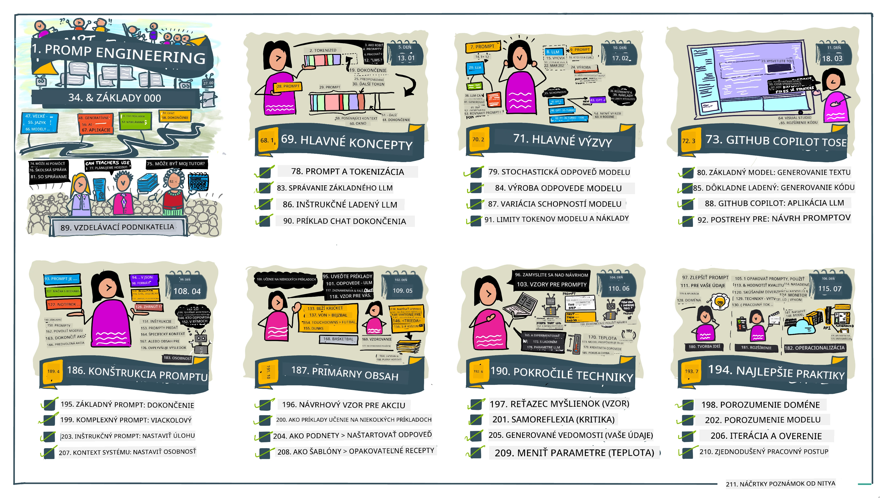
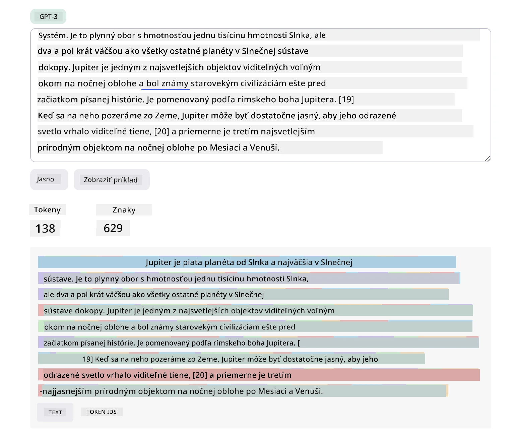
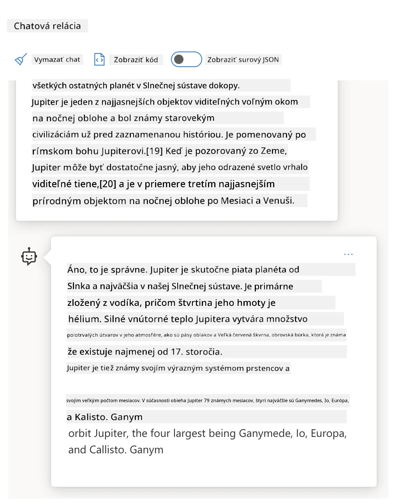
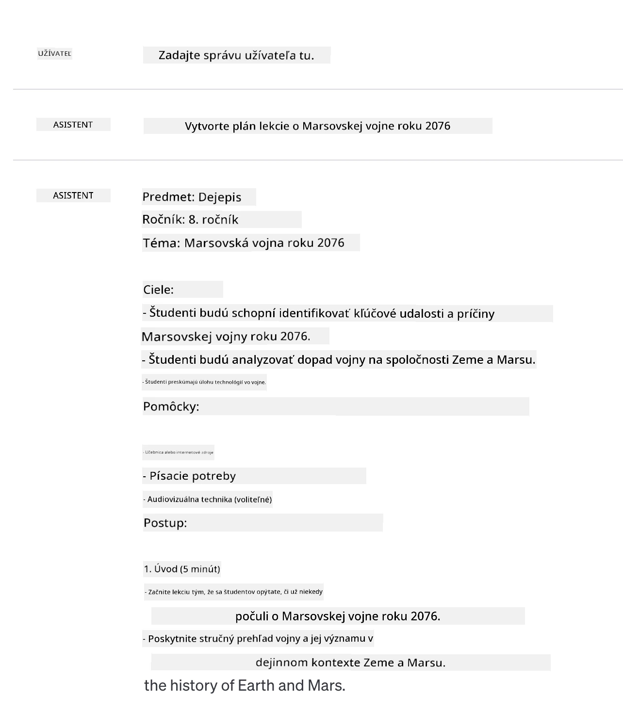
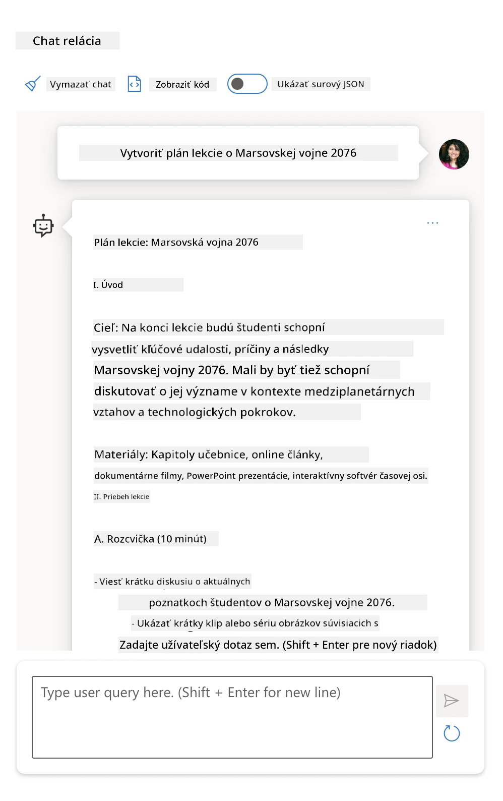
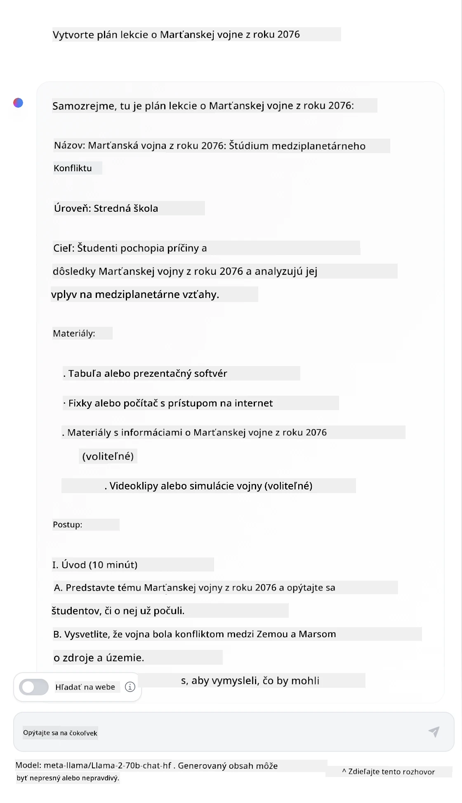

# Základy tvorby promptov

[](https://youtu.be/GElCu2kUlRs?si=qrXsBvXnCW12epb8)

## Úvod
Tento modul pokrýva základné koncepty a techniky pre vytváranie efektívnych promptov v generatívnych AI modeloch. Spôsob, akým napíšete svoj prompt pre LLM, je tiež dôležitý. Starostlivo zostavený prompt môže dosiahnuť lepšiu kvalitu odpovede. Ale čo presne znamenajú pojmy ako _prompt_ a _tvorba promptov_? A ako môžem zlepšiť prompt _vstup_, ktorý posielam LLM? Na tieto otázky sa pokúsime odpovedať v tejto kapitole a nasledujúcej.

_Generatívna AI_ je schopná vytvárať nový obsah (napríklad text, obrázky, zvuk, kód a pod.) v reakcii na požiadavky používateľov. Dosahuje to pomocou _veľkých jazykových modelov_ ako séria GPT od OpenAI („Generative Pre-trained Transformer“), ktoré sú trénované na používanie prirodzeného jazyka a kódu.

Používatelia môžu teraz s týmito modelmi interagovať pomocou známych paradigiem, ako je chat, bez potreby technických znalostí alebo školenia. Modely sú _promptovo založené_ – používatelia posielajú textový vstup (prompt) a dostanú späť AI odpoveď (doplnenie). Potom môžu „konverzovať s AI“ iteratívne, v niekoľkých kolách, zjemňovať svoj prompt, až kým odpoveď nebude vyhovovať ich očakávaniam.

„Prompty“ sa tak stávajú primárnym _programovacím rozhraním_ pre generatívne AI aplikácie, ktoré modelom hovoria, čo majú robiť, a ovplyvňujú kvalitu vrátených odpovedí. „Tvorba promptov“ je rýchlo rastúca študijná oblasť, ktorá sa zameriava na _návrh a optimalizáciu_ promptov, aby sa dodávali konzistentné a kvalitné odpovede v škálovateľnom rozsahu.

## Ciele učenia

V tejto lekcii sa naučíme, čo je tvorba promptov, prečo je dôležitá a ako môžeme vytvárať efektívnejšie prompty pre daný model a cieľ aplikácie. Pochopíme základné koncepty a najlepšie postupy tvorby promptov – a zoznámime sa s interaktívnym prostredím Jupyter Notebooks „sandbox“, kde môžeme vidieť tieto koncepty aplikované na reálne príklady.

Na konci tejto lekcie budeme vedieť:

1. Vysvetliť, čo je tvorba promptov a prečo je dôležitá.
2. Popísať komponenty promptu a ich využitie.
3. Naučiť sa najlepšie postupy a techniky tvorby promptov.
4. Aplikovať naučené techniky na reálne príklady pomocou OpenAI endpointu.

## Kľúčové pojmy

Tvorba promptov: Prax navrhovania a zdokonaľovania vstupov na vedenie AI modelov k požadovaným výstupom.

Tokenizácia: Proces rozdelenia textu na menšie jednotky, nazývané tokeny, ktoré model dokáže pochopiť a spracovať.

Inštrukčne ladené LLM: Veľké jazykové modely (LLM), ktoré boli doladené špecifickými inštrukciami za účelom zlepšenia presnosti a relevantnosti odpovedí.

## Sandbox na učenie

Tvorba promptov je v súčasnosti viac umením než vedou. Najlepším spôsobom, ako si zlepšiť intuíciu, je _praktizovať viac_ a prijať prístup pokusu a omylu, ktorý spája odbornosť v danej oblasti aplikácie s odporúčanými technikami a optimalizáciami špecifickými pre model.

Jupyter Notebook, ktorý sprevádza túto lekciu, poskytuje _sandbox_ prostredie, kde si môžete vyskúšať, čo ste sa naučili – priamo počas štúdia alebo ako súčasť záverečnej úlohy. Na vykonanie cvičení budete potrebovať:

1. **Kľúč API Azure OpenAI** – služobný endpoint pre nasadený LLM.
2. **Python Runtime** – v ktorom je možné Notebook spustiť.
3. **Lokálne premenné prostredia** – _teraz dokončite kroky [Nastavenia](./../00-course-setup/02-setup-local.md?WT.mc_id=academic-105485-koreyst), aby ste boli pripravení_.

Notebook prichádza s _začiatočnými_ cvičeniami – ale ste povzbudzovaní pridať si vlastné časti _Markdown_ (popis) a _Kód_ (požiadavky promptov), aby ste si mohli vyskúšať viac príkladov alebo nápadov a rozvíjať intuitívne zručnosti návrhu promptov.

## Ilustrovaný sprievodca

Chcete získať veľký prehľad o tom, čo táto lekcia pokrýva, ešte pred tým, než sa do nej pustíte? Pozrite si tento ilustrovaný sprievodca, ktorý vám poskytne prehľad o hlavnej téme a kľúčových bodoch na zamyslenie v každom z nich. Plán lekcie vás prevedie od pochopenia základných konceptov a výziev po ich riešenie pomocou relevantných techník a najlepších postupov tvorby promptov. Upozorňujeme, že sekcia „Pokročilé techniky“ v tomto sprievodcovi sa vzťahuje na obsah pokrytý v _nasledujúcej_ kapitole tohto učebného plánu.



## Naš startup

Teraz si povedzme, ako sa _táto téma_ vzťahuje k nášmu startupu so zámerom [priniesť AI inovácie do vzdelávania](https://educationblog.microsoft.com/2023/06/collaborating-to-bring-ai-innovation-to-education?WT.mc_id=academic-105485-koreyst). Chceme budovať AI-poháňané aplikácie _personalizovaného učenia_ – tak si premyslime, ako by rôzni používatelia našej aplikácie mohli „navrhovať“ prompty:

- **Administrátori** môžu požiadať AI o _analýzu dát kurikula na identifikáciu medzier vo výučbe_. AI môže zhrnúť výsledky alebo ich vizualizovať pomocou kódu.
- **Učitelia** môžu požiadať AI o _generovanie plánu lekcie pre cieľové publikum a tému_. AI môže zostaviť personalizovaný plán vo vopred určenom formáte.
- **Študenti** môžu požiadať AI o _doučovanie v zložitej téme_. AI môže teraz viesť študentov pomocou lekcií, nápoved a príkladov prispôsobených ich úrovni.

To je len špička ľadovca. Pozrite si [Prompty pre vzdelávanie](https://github.com/microsoft/prompts-for-edu/tree/main?WT.mc_id=academic-105485-koreyst) – open-source knižnicu promptov zostavenú vzdelávacími expertmi – aby ste získali širší prehľad o možnostiach! _Skúste spustiť niektoré z týchto promptov v sandboxe alebo pomocou OpenAI Playground a pozrite, čo sa stane!_

<!--
LESSON TEMPLATE:
Táto jednotka by mala pokrývať základný koncept č. 1.
Posilniť koncept príkladmi a odkazmi.

KONCEPT č. 1:
Tvorba promptov.
Definujte to a vysvetlite, prečo je to potrebné.
-->

## Čo je tvorba promptov?

Lekciu sme začali definovaním **tvorby promptov** ako procesu _navrhovania a optimalizácie_ textových vstupov (promptov) na dosiahnutie konzistentných a kvalitných odpovedí (doplnení) pre daný cieľ aplikácie a model. Môžeme to považovať za dvojkrokový proces:

- _navrhnúť_ počiatočný prompt pre daný model a cieľ
- _iteratívne vylepšovať_ prompt na zlepšenie kvality odpovede

Je to nevyhnutne proces pokusu a omylu, ktorý vyžaduje intuíciu používateľa a úsilie na dosiahnutie optimálnych výsledkov. Prečo je to teda dôležité? Aby sme odpovedali na túto otázku, musíme najskôr pochopiť tri pojmy:

- _tokenizácia_ = ako model „vidí“ prompt
- _základné LLM_ = ako základný model „spracúva“ prompt
- _inštrukčne ladené LLM_ = ako model teraz môže vidieť „úlohy“

### Tokenizácia

LLM vidí prompt ako _sekvenciu tokenov_, kde rôzne modely (alebo verzie modelu) môžu ten istý prompt tokenizovať rôznymi spôsobmi. Keďže LLM sú trénované na tokenoch (a nie na surovom texte), spôsob, akým sa prompty tokenizujú, má priamy vplyv na kvalitu vytvorenej odpovede.

Pre lepšiu predstavu o tom, ako tokenizácia funguje, skúste nástroje ako [OpenAI Tokenizer](https://platform.openai.com/tokenizer?WT.mc_id=academic-105485-koreyst) uvedený nižšie. Skopírujte tam svoj prompt a pozrite sa, ako sa premení na tokeny, venujte pozornosť tomu, ako sa spracovávajú medzery a interpunkcia. Upozorňujeme, že tento príklad ukazuje starší LLM (GPT-3) – skúsenosť s novším modelom môže viesť k inému výsledku.



### Koncept: Základné modely

Keď je prompt tokenizovaný, primárnou funkciou ["základného LLM"](https://blog.gopenai.com/an-introduction-to-base-and-instruction-tuned-large-language-models-8de102c785a6?WT.mc_id=academic-105485-koreyst) (alebo základného modelu) je predpovedať token v tejto sekvencii. Keďže LLM sú trénované na obrovských textových datasetoch, majú dobré povedomie o štatistických vzťahoch medzi tokenmi a dokážu túto predpoveď vykonať s istou mierou istoty. Upozorňujeme, že nerozumejú _významu_ slov v promte alebo tokene; vidia len vzor, ktorý môžu „doplniť“ ďalšou predpoveďou. Môžu pokračovať v predpovedaní sekvencie, až kým ich nezastaví zásah používateľa alebo nejaká vopred stanovená podmienka.

Chcete vidieť, ako funguje doplnenie na základe promptu? Vložte vyššie uvedený prompt do Azure OpenAI Studio [_Chat Playground_](https://oai.azure.com/playground?WT.mc_id=academic-105485-koreyst) so štandardným nastavením. Systém je nastavený tak, aby považoval prompty za požiadavky na informácie – takže by ste mali vidieť doplnenie, ktoré vyhovuje tomuto kontextu.

Ale čo keď používateľ chce vidieť niečo konkrétne, čo vyhovuje určitým kritériám alebo cieľu úlohy? Práve tu prichádzajú do hry _inštrukčne ladené_ LLM.



### Koncept: Inštrukčne ladené LLM

[Inštrukčne ladený LLM](https://blog.gopenai.com/an-introduction-to-base-and-instruction-tuned-large-language-models-8de102c785a6?WT.mc_id=academic-105485-koreyst) začína so základným modelom a doladí ho pomocou príkladov alebo vstupno-výstupných párov (napr. viackolové „správy“), ktoré môžu obsahovať jasné inštrukcie – a odpoveď AI sa snaží túto inštrukciu dodržať.

Používa techniky ako Reinforcement Learning with Human Feedback (RLHF), ktoré môžu trénovať model na _dodržiavanie inštrukcií_ a _učiť sa z spätnej väzby_, aby produkoval odpovede, ktoré sú praktickejšie a viac relevantné pre cieľ používateľa.

Skúsme to – vráťte sa k vyššie uvedenému promptu, ale teraz zmeňte _systémovú správu_ tak, aby dala nasledujúcu inštrukciu ako kontext:

> _Zhrň obsah, ktorý máte k dispozícii, pre žiaka druhej triedy. Výsledok udržte v jednom odstavci s 3-5 odrážkami._

Vidíte, že výsledok je teraz prispôsobený požadovanému cieľu a formátu? Učiteľ môže túto odpoveď priamo použiť vo svojich prezentáciách pre tú triedu.


## Prečo potrebujeme tvorbu promptov?

Keď už vieme, ako LLM spracúvajú prompty, porozprávajme sa o _tom, prečo_ potrebujeme tvorbu promptov. Odpoveď spočíva v tom, že súčasné LLM predstavujú niekoľko výziev, ktoré robia dosiahnutie _spoľahlivých a konzistentných doplnení_ náročnejším bez investovania úsilia do tvorby a optimalizácie promptov. Napríklad:

1. **Odpovede modelov sú stochastické.** _Ten istý prompt_ pravdepodobne vyprodukuje rôzne odpovede s rôznymi modelmi alebo verziami modelu. Môže dokonca vyprodukovať rôzne výsledky s _tým istým modelom_ v rôznom čase. _Techniky tvorby promptov nám môžu pomôcť minimalizovať tieto variácie tým, že poskytujú lepšie zábrany_.

1. **Modely môžu vymýšľať odpovede.** Modely sú predtrénované na _veľkých, ale konečných_ datasetoch, čo znamená, že nemajú vedomosti o konceptoch mimo rozsahu tréningu. Výsledkom môže byť, že vytvoria doplnenia, ktoré sú nepresné, smyšlené alebo priamo protirečia známym faktom. _Techniky tvorby promptov pomáhajú používateľom takéto vymýšľanie identifikovať a zmierniť, napríklad tým, že AI požiadajú o citácie alebo odôvodnenie_.

1. **Schopnosti modelov sa budú líšiť.** Novšie modely alebo generácie modelov budú mať bohatšie schopnosti, ale tiež prinášajú jedinečné zvláštnosti a kompromisy v nákladoch a komplexnosti. _Tvorba promptov nám pomôže vyvinúť najlepšie postupy a pracovné postupy, ktoré abstrahujú rozdiely a prispôsobujú sa požiadavkám jednotlivých modelov škálovateľným a bezproblémovým spôsobom_.

Pozrime sa na to v praxi v OpenAI alebo Azure OpenAI Playground:

- Použite ten istý prompt s rôznymi nasadeniami LLM (napr. OpenAI, Azure OpenAI, Hugging Face) – videli ste variácie?
- Použite ten istý prompt opakovane s _tým istým_ nasadením LLM (napr. Azure OpenAI playground) – ako sa tieto variácie líšili?

### Príklad vymýšľania odpovedí

V tomto kurze používame termín **„vymýšľanie (“fabrication“)“** na označenie javu, keď LLM niekedy generujú faktograficky nesprávne informácie v dôsledku obmedzení v ich tréningu alebo iných okolností. Môžete sa s tým stretnúť aj pod pojmom _„halucinácie“_ v populárnych článkoch alebo vedeckých prácach. Avšak dôrazne odporúčame používať termín _„vymýšľanie“_, aby sme náhodou neantropomorfizovali správanie pripisovaním ľudskej vlastnosti strojovo riadenému výsledku. Toto tiež posilňuje [zásady zodpovednej AI](https://www.microsoft.com/ai/responsible-ai?WT.mc_id=academic-105485-koreyst) z hľadiska terminológie, vyhýbajúc sa výrazom, ktoré môžu byť v niektorých kontextoch považované za nevhodné alebo neinkluzívne.

Chcete si spraviť predstavu, ako vymýšľanie funguje? Predstavte si prompt, ktorý inštruuje AI generovať obsah k neexistujúcej téme (aby ste sa uistili, že nie je v tréningovom datasete). Napríklad – vyskúšal som tento prompt:

> **Prompt:** vygeneruj plán lekcie o Marťianskej vojne v roku 2076.
Webové vyhľadávanie mi ukázalo, že existovali fiktívne príbehy (napr. televízne seriály alebo knihy) o marťanských vojnách – ale nijaké z roku 2076. Zdravý rozum nám tiež hovorí, že rok 2076 je _v budúcnosti_ a preto sa nemôže spájať so skutočnou udalosťou.

Tak čo sa stane, keď tento prompt spustíme u rôznych poskytovateľov LLM?

> **Odpoveď 1**: OpenAI Playground (GPT-35)



> **Odpoveď 2**: Azure OpenAI Playground (GPT-35)



> **Odpoveď 3**: : Hugging Face Chat Playground (LLama-2)



Ako sa očakávalo, každý model (alebo verzia modelu) generuje mierne odlišné odpovede vďaka stochastickému správaniu a rozdielom v schopnostiach modelov. Napríklad jeden model cielený na 8. triedu, zatiaľ čo iný predpokladá študenta strednej školy. Ale všetky tri modely vytvorili odpovede, ktoré by mohli presvedčiť neinformovaného používateľa, že udalosť bola skutočná.

Techniky prompt engineering ako _metaprompting_ a nastavenie _temperature_ môžu do istej miery znížiť výrobu nepravdivých informácií modelom. Nové _architektúry_ prompt engineering tiež plynulo integrujú nové nástroje a techniky do toku promptu, aby zmiernili alebo znížili tieto efekty.

## Prípadová štúdia: GitHub Copilot

Záverom tejto sekcie si prejdime, ako sa prompt engineering používa v reálnych riešeniach na príklade jednej prípadovej štúdie: [GitHub Copilot](https://github.com/features/copilot?WT.mc_id=academic-105485-koreyst).

GitHub Copilot je váš „AI parťák programátor“ – prevádza textové prompty na dokončenia kódu a je integrovaný do vášho vývojového prostredia (napr. Visual Studio Code) pre plynulý zážitok používateľa. Ako dokumentujú nasledujúce blogy, najskoršia verzia bola založená na modeli OpenAI Codex – inžinieri rýchlo pochopili potrebu doladenia modelu a vyvinuli lepšie techniky prompt engineering na zlepšenie kvality kódu. V júli predstavili [vylepšený AI model, ktorý ide nad rámec Codexu](https://github.blog/2023-07-28-smarter-more-efficient-coding-github-copilot-goes-beyond-codex-with-improved-ai-model/?WT.mc_id=academic-105485-koreyst) pre ešte rýchlejšie návrhy.

Prečítajte si blogy v poradí, aby ste sledovali ich učebný proces.

- **Máj 2023** | [GitHub Copilot sa zlepšuje v rozpoznávaní vášho kódu](https://github.blog/2023-05-17-how-github-copilot-is-getting-better-at-understanding-your-code/?WT.mc_id=academic-105485-koreyst)
- **Máj 2023** | [Inside GitHub: Práca s LLM za GitHub Copilot](https://github.blog/2023-05-17-inside-github-working-with-the-llms-behind-github-copilot/?WT.mc_id=academic-105485-koreyst).
- **Jún 2023** | [Ako písať lepšie prompty pre GitHub Copilot](https://github.blog/2023-06-20-how-to-write-better-prompts-for-github-copilot/?WT.mc_id=academic-105485-koreyst).
- **Júl 2023** | [GitHub Copilot ide nad rámec Codexu s vylepšeným AI modelom](https://github.blog/2023-07-28-smarter-more-efficient-coding-github-copilot-goes-beyond-codex-with-improved-ai-model/?WT.mc_id=academic-105485-koreyst)
- **Júl 2023** | [Sprievodca vývojára prompt engineering a LLM](https://github.blog/2023-07-17-prompt-engineering-guide-generative-ai-llms/?WT.mc_id=academic-105485-koreyst)
- **Sep 2023** | [Ako vybudovať podnikateľskú LLM aplikáciu: Lekcie z GitHub Copilot](https://github.blog/2023-09-06-how-to-build-an-enterprise-llm-application-lessons-from-github-copilot/?WT.mc_id=academic-105485-koreyst)

Môžete tiež prezerať ich [inžiniersky blog](https://github.blog/category/engineering/?WT.mc_id=academic-105485-koreyst) pre ďalšie príspevky ako [tento](https://github.blog/2023-09-27-how-i-used-github-copilot-chat-to-build-a-reactjs-gallery-prototype/?WT.mc_id=academic-105485-koreyst), ktorý ukazuje, ako sa tieto modely a techniky _aplikujú_ pri tvorbe reálnych aplikácií.

---

## Tvorba promptu

Videli sme, prečo je prompt engineering dôležitý – teraz si rozoberme, ako sa prompt _stavia_, aby sme mohli vyhodnotiť rôzne techniky na efektívnejšie navrhovanie promptov.

### Základný prompt

Začnime so základným promptom: textovým vstupom zaslaným modelu bez ďalšieho kontextu. Tu je príklad – keď pošleme prvé slová americkej národnej hymny do OpenAI [Completion API](https://platform.openai.com/docs/api-reference/completions?WT.mc_id=academic-105485-koreyst), okamžite _dokončí_ odpoveď ďalšími riadkami, čo ilustruje základné predikčné správanie.

| Prompt (Vstup)    | Dokončenie (Výstup)                                                                                                                      |
| :---------------- | :----------------------------------------------------------------------------------------------------------------------------------------- |
| Oh say can you see | Znie to, akoby ste začínali text piesne „The Star-Spangled Banner“, národnej hymny USA. Celý text znie takto ...                            |

### Komplexný prompt

Teraz pridáme ku základnému promptu kontext a inštrukcie. [Chat Completion API](https://learn.microsoft.com/azure/ai-services/openai/how-to/chatgpt?WT.mc_id=academic-105485-koreyst) nám umožňuje zostaviť komplexný prompt ako súbor _správ_ obsahujúcich:

- páry vstup/výstup, ktoré odrážajú vstup používateľa a odpoveď asistenta,
- systémovú správu nastavujúcu kontext pre správanie alebo charakter asistenta.

Žiadosť teraz vyzerá takto, kde _tokenizácia_ efektívne zachytáva relevantné informácie z kontextu a konverzácie. Zmena systémového kontextu môže mať preto podobný vplyv na kvalitu dokončení ako poskytované vstupy používateľa.

```python
response = openai.chat.completions.create(
    model="gpt-3.5-turbo",
    messages=[
        {"role": "system", "content": "You are a helpful assistant."},
        {"role": "user", "content": "Who won the world series in 2020?"},
        {"role": "assistant", "content": "The Los Angeles Dodgers won the World Series in 2020."},
        {"role": "user", "content": "Where was it played?"}
    ]
)
```

### Inštrukčný prompt

V predchádzajúcich príkladoch bol používateľský prompt jednoduchá textová otázka, ktorú bolo možné interpretovať ako dopyt po informáciách. Pri _inštrukčných_ promptoch môžeme tento text použiť na podrobnejšie špecifikovanie úlohy a tým poskytnúť modelu lepšie usmernenie. Tu je príklad:

| Prompt (Vstup)                                                                                                                                                                                                                         | Dokončenie (Výstup)                                                                                                        | Typ inštrukcie      |
| :------------------------------------------------------------------------------------------------------------------------------------------------------------------------------------------------------------------------------------- | :------------------------------------------------------------------------------------------------------------------------- | :------------------ |
| Napíš popis Občianskej vojny                                                                                                                                                                                                           | _vrátil jednoduchý odsek_                                                                                                 | Jednoduchý          |
| Napíš popis Občianskej vojny. Uveď kľúčové dátumy a udalosti a opíš ich význam                                                                                                                                                         | _vrátil odsek, po ktorom nasleduje zoznam kľúčových dátumov s popismi_                                                     | Komplexný           |
| Napíš popis Občianskej vojny v 1 odseku. Uveď 3 odrážky s kľúčovými dátumami a ich významom. Uveď ďalšie 3 odrážky s dôležitými historickými osobnosťami a ich príspevkami. Výstup vráť vo formáte JSON  | _vracia podrobnejšie údaje v textovom poli, formátované ako JSON, ktorý môžete skopírovať do súboru a podľa potreby overiť_ | Komplexný. Formátovaný. |

## Primárny obsah

V uvedených príkladoch bol prompt stále pomerne otvorený, čo umožnilo LLM rozhodnúť, ktorá časť jeho predtrénovaného datasetu je relevantná. So vzorcom dizajnu _primárny obsah_ sa vstupný text rozdeľuje na dve časti:

- inštrukcia (akcia),
- relevantný obsah (ktorý ovplyvňuje akciu).

Tu je príklad, kde inštrukcia znie „zhrň to v 2 vetách“.

| Prompt (Vstup)                                                                                                                                                                                                                                                                                                                                                                                                                                                                                                                                                                                                                                                                                         | Dokončenie (Výstup)                                                                                                                                                                                                                                                                           |
| :--------------------------------------------------------------------------------------------------------------------------------------------------------------------------------------------------------------------------------------------------------------------------------------------------------------------------------------------------------------------------------------------------------------------------------------------------------------------------------------------------------------------------------------------------------------------------------------------------------------------------------------------------------------------------------------------- | :---------------------------------------------------------------------------------------------------------------------------------------------------------------------------------------------------------------------------------------------------------------------------------------------- |
| Jupiter je piata planéta od Slnka a najväčšia v Slnečnej sústave. Je to plynný obor s hmotnosťou iba tisícinu Slnka, no dvakrát a pol ťažší než všetky ostatné planéty Slnečnej sústavy dokopy. Jupiter je jeden z najsvietivejších objektov viditeľných voľným okom na nočnej oblohe a bol známy starovekým civilizáciám už pred zaznamenanou históriou. Je pomenovaný po rímskom bohu Jupiterovi.[19] Z pohľadu Zeme môže byť Jupiter natoľko jasný, že jeho odrazené svetlo vrhá viditeľné tiene,[20] a je v priemere tretím najsvietivejším prírodným objektom na nočnej oblohe po Mesiaci a Venuši. <br/> **Zhrň to v 2 krátkych vetách** | Jupiter, piata planéta od Slnka, je najväčšia v Slnečnej sústave a je známa ako jeden z najsvietivejších objektov na nočnej oblohe. Pomenovaná po rímskom bohovi Jupiterovi, je to plynný obor s hmotnosťou dvakrát a pol väčšou ako všetky ostatné planéty dohromady. |

Segment primárneho obsahu možno využiť rôznymi spôsobmi na efektívnejšie inštrukcie:

- **Príklady** – namiesto priameho inštruovania modelu mu poskytneme príklady požadovaných výstupov a necháme ho, aby odvodil vzor.
- **Náznaky** – nasledujú po inštrukcii ako „návnada“, ktorá pripraví dokončenie a usmerní model k relevantnejším odpovediam.
- **Šablóny** – opakovateľné „recepty“ na prompty s miestami na doplnenie (premennými), ktoré možno prispôsobiť konkrétnym dátam pre dané použitie.

Poďme si ich ukázať v praxi.

### Použitie príkladov

Tento prístup využíva primárny obsah na „nakŕmenie modelu“ príkladmi želaných výstupov pre danú inštrukciu, aby model odviedol vzor požadovaného výstupu. Podľa počtu príkladov rozlišujeme zero-shot prompting, one-shot prompting, few-shot prompting a pod.

Prompt teraz pozostáva z troch častí:

- popis úlohy,
- niekoľko príkladov želaného výstupu,
- začiatok nového príkladu (ktorý implicitne opisuje ďalšiu úlohu).

| Typ učenia  | Prompt (Vstup)                                                                                                                                    | Dokončenie (Výstup)       |
| :---------- | :------------------------------------------------------------------------------------------------------------------------------------------------ | :------------------------- |
| Zero-shot   | „The Sun is Shining“. Prelož do španielčiny                                                                                                      | „El Sol está brillando“.   |
| One-shot    | „The Sun is Shining“ => „El Sol está brillando“. <br> „It’s a Cold and Windy Day“ =>                                                              | „Es un día frío y ventoso“.|
| Few-shot    | Hráč bežal po metách => Baseball <br/> Hráč zahral esák => Tenis <br/> Hráč dal šesťku => Kriket <br/> Hráč spravil slam-dunk =>                    | Basketbal                  |
|             |                                                                                                                                                   |                           |

Všimnite si, že pri zero-shot sme museli uviesť explicitnú inštrukciu („Prelož do španielčiny“), no pri one-shot sa táto inštrukcia odviedla z príkladu. Few-shot ukazuje, že pridanie viacerých príkladov umožňuje modelom presnejšie odvodiť vzory bez ďalších inštrukcií.

### Náznaky v promptoch

Ďalšia technika využívania primárneho obsahu je poskytnutie _náznakov_ namiesto príkladov. Tu modelu „naznačujeme“ smerovanie tým, že _začneme mu to_ útržkom, ktorý reflektuje požadovaný formát odpovede. Model potom „berie náznak“ a pokračuje v danom smere.

| Počet náznakov | Prompt (Vstup)                                                                                                                                                                                                                                                                                                                                                                                | Dokončenie (Výstup)                                                                                                                                                                                                                                                                                        |
| :------------- | :-------------------------------------------------------------------------------------------------------------------------------------------------------------------------------------------------------------------------------------------------------------------------------------------------------------------------------------------------------------------------------------------- | :--------------------------------------------------------------------------------------------------------------------------------------------------------------------------------------------------------------------------------------------------------------------------------------------------------- |
| 0              | Jupiter je piata planéta od Slnka a najväčšia v Slnečnej sústave. Je to plynný obor s hmotnosťou iba tisícinu Slnka, no dvakrát a pol ťažší než všetky ostatné planéty Slnečnej sústavy dokopy. Jupiter je jeden z najsvietivejších objektov viditeľných voľným okom na nočnej oblohe, a bol známy starovekým civilizáciám už pred zaznamenanou históriou. <br/>**Zhrň toto**                                       | Jupiter je najväčšia planéta v našej Slnečnej sústave a piata od Slnka. Je to plynný obor s hmotnosťou 1/1000 Slnka, ale je ťažší než všetky ostatné planéty dohromady. Staroveké civilizácie poznali Jupiter už dlho a je ľahko viditeľný na nočnej oblohe.                                                        |
| 1              | Jupiter je piata planéta od Slnka a najväčšia v slnečnej sústave. Je to plynný obor s hmotnosťou jednu tisícinu hmotnosti Slnka, ale dvojnásobne a pol vyššou ako všetky ostatné planéty v slnečnej sústave dokopy. Jupiter je jeden z najjasnejších objektov viditeľných voľným okom na nočnej oblohe a bol známy starovekým civilizáciám už pred zaznamenanou históriou. <br/>**Zhrnutie** <br/> Čo sme sa naučili je, že Jupiter | je piatou planétou od Slnka a najväčšou v slnečnej sústave. Je to plynný obor s hmotnosťou jednu tisícinu hmotnosti Slnka, ale dvojnásobne a pol vyššou ako všetky ostatné planéty dokopy. Je ľahko viditeľný voľným okom a je známy od staroveku.                        |
| 2              | Jupiter je piata planéta od Slnka a najväčšia v slnečnej sústave. Je to plynný obor s hmotnosťou jednu tisícinu hmotnosti Slnka, ale dvojnásobne a pol vyššou ako všetky ostatné planéty v slnečnej sústave dokopy. Jupiter je jeden z najjasnejších objektov viditeľných voľným okom na nočnej oblohe a bol známy starovekým civilizáciám už pred zaznamenanou históriou. <br/>**Zhrnutie** <br/> Top 3 fakty, ktoré sme sa naučili:         | 1. Jupiter je piatou planétou od Slnka a najväčšou v slnečnej sústave. <br/> 2. Je to plynný obor s hmotnosťou jednu tisícinu hmotnosti Slnka...<br/> 3. Jupiter je viditeľný voľným okom od starovekých čias ...                                                                       |
|                |                                                                                                                                                                                                                                                                                                                                                                                                                                                              |                                                                                                                                                                                                                                                                                                           |

### Šablóny výziev

Šablóna výzvy je _preddefinovaný recept na výzvu_, ktorý môže byť uložený a opakovane použitý podľa potreby, aby sa dosiahla konzistentnejšia používateľská skúsenosť vo veľkom meradle. V najjednoduchšej forme je to zbierka príkladov výziev ako [tento od OpenAI](https://platform.openai.com/examples?WT.mc_id=academic-105485-koreyst), ktorý poskytuje interaktívne časti výzvy (správy používateľa a systému) a formát požiadavky riadený API - pre podporu opätovného použitia.

V zložitejšej podobe ako [tento príklad od LangChain](https://python.langchain.com/docs/concepts/prompt_templates/?WT.mc_id=academic-105485-koreyst) obsahuje _zástupné symboly_, ktoré môžu byť nahradené údajmi z rôznych zdrojov (vstup používateľa, systémový kontext, externé zdroje dát atď.) na dynamickú tvorbu výzvy. To nám umožňuje vytvoriť knižnicu opakovane použiteľných výziev, ktoré môžu **programovo** zabezpečiť konzistentné používateľské skúsenosti vo veľkom.

Nakoniec je skutočná hodnota šablón v možnosti vytvárať a publikovať _knižnice výziev_ pre vertikálne aplikačné domény - kde je šablóna výzvy _optimalizovaná_ tak, aby reflektovala kontext špecifický pre aplikáciu alebo príklady, ktoré robia odpovede relevantnejšími a presnejšími pre cieľové používateľské publikum. Repozitár [Prompts For Edu](https://github.com/microsoft/prompts-for-edu?WT.mc_id=academic-105485-koreyst) je skvelým príkladom tohto prístupu, zhromažďujúc knižnicu výziev pre vzdelávaciu sféru s dôrazom na kľúčové ciele ako plánovanie hodín, návrh osnov, doučovanie študentov a pod.

## Podporný obsah

Ak uvažujeme o konštrukcii výzvy ako o zložení inštrukcie (úlohy) a cieľa (primárneho obsahu), potom _sekundárny obsah_ je ako dodatočný kontext, ktorý poskytujeme na **ovplyvnenie výstupu určitým spôsobom**. Môže ísť o ladacie parametre, pokyny na formátovanie, taxonómie tém a pod., ktoré môžu pomôcť modelu _prispôsobiť_ svoju odpoveď tak, aby vyhovovala očakávaným cieľom používateľa.

Napríklad: Ak máme katalóg kurzov s rozsiahlymi metadátami (názov, popis, úroveň, značky metadát, lektor atď.) k všetkým dostupným kurzom v osnovách:

- môžeme definovať pokyn „zhrnúť katalóg kurzov na jeseň 2023“
- môžeme použiť primárny obsah na poskytnutie niekoľkých príkladov požadovaného výstupu
- môžeme použiť sekundárny obsah na identifikáciu top 5 záujmových „značiek“.

Model tak môže poskytnúť zhrnutie v tvare ukázanom v príkladoch - no ak má výsledok viacero značiek, uprednostní identifikovaných 5 značiek zo sekundárneho obsahu.

---

<!--
ŠABLÓNA HODINY:
Táto jednotka by mala pokryť základný koncept #1.
Posilnite koncept príkladmi a odkazmi.

KONCEPT #3:
Techniky inžinierstva výziev.
Aké sú základné techniky inžinierstva výziev?
Ilustrujte to niekoľkými cvičeniami.
-->

## Najlepšie praktiky pre výzvy

Teraz, keď vieme, ako možno výzvy _konštruovať_, môžeme začať premýšľať o tom, ako ich _navrhnúť_ tak, aby odrážali najlepšie praktiky. Môžeme to rozdeliť na dve časti - mať správny _postoj_ a používať správne _techniky_.

### Postoj pri inžinierstve výziev

Inžinierstvo výziev je proces pokus-omyl, takže majte na pamäti tri široké usmerňujúce faktory:

1. **Dôležitý je kontext domény.** Presnosť a relevantnosť odpovede závisí od _domény_, v ktorej daná aplikácia alebo používateľ pôsobí. Použite svoju intuíciu a odborné znalosti domény na ďalšie **prispôsobenie techník**. Napríklad definujte _osobnosti špecifické pre doménu_ vo svojich systémových výzvach alebo používajte _šablóny špecifické pre doménu_ vo výzvach používateľov. Poskytnite sekundárny obsah odrážajúci kontexty domény alebo použite _signály a príklady špecifické pre doménu_ na usmernenie modelu k známym vzorcom používania.

2. **Dôležité je pochopenie modelu.** Vieme, že modely sú štatistické (stochastické) podľa povahy. Ale implementácie modelov sa môžu líšiť podľa použitého trénovacieho datasetu (predtrénované vedomosti), schopností, ktoré poskytujú (napr. API či SDK), a typu obsahu, na ktorý sú optimalizované (kód, obrázky, text). Pochopte silné a slabé stránky svojho modelu a použite tieto vedomosti na _prioritizovanie úloh_ alebo tvorbu _prispôsobených šablón_ optimalizovaných pre schopnosti modelu.

3. **Dôležitá je iterácia a validácia.** Modely sa rýchlo vyvíjajú, rovnako ako techniky inžinierstva výziev. Ako expert v doméne možno máte vlastný kontext alebo kritériá špecifické pre vašu aplikáciu, ktoré nemusia platiť všeobecne. Použite nástroje a techniky inžinierstva výziev na "rýchly štart" konštrukcie výziev, potom výsledky iterujte a validujte s pomocou vlastnej intuície a odbornosti. Zaznamenávajte si poznatky a vytvorte **znalostnú databázu** (napr. knižnice výziev), ktorú môžu iní používať ako základ pre rýchlejšie iterácie v budúcnosti.

## Najlepšie praktiky

Pozrime sa teraz na bežné najlepšie praktiky, ktoré odporúčajú odborníci z [OpenAI](https://help.openai.com/en/articles/6654000-best-practices-for-prompt-engineering-with-openai-api?WT.mc_id=academic-105485-koreyst) a [Azure OpenAI](https://learn.microsoft.com/azure/ai-services/openai/concepts/prompt-engineering#best-practices?WT.mc_id=academic-105485-koreyst).

| Čo                                | Prečo                                                                                                                                                                                                                                             |
| :-------------------------------- | :------------------------------------------------------------------------------------------------------------------------------------------------------------------------------------------------------------------------------------------------ |
| Vyhodnoťte najnovšie modely.      | Nové generácie modelov pravdepodobne ponúkajú vylepšené funkcie a vyššiu kvalitu - no môžu mať tiež vyššie náklady. Vyhodnoťte ich vplyv, potom rozhodnite o migrácii.                                                                            |
| Oddelte inštrukcie a kontext       | Skontrolujte, či váš model/poskytovateľ definuje _delimiter-y_ na jasnejšie oddelenie inštrukcií, primárneho a sekundárneho obsahu. To môže pomôcť modelom presnejšie prideľovať váhy tokenom.                                                       |
| Buďte špecifickí a jasní           | Poskytnite viac detailov o požadovanom kontexte, výsledku, dĺžke, formáte, štýle atď. To zlepší kvalitu aj konzistenciu odpovedí. Recepty zachyťte v opakovane použiteľných šablónach.                                                             |
| Buďte opisní, používajte príklady  | Modely môžu reagovať lepšie na prístup „ukáž a povedz“. Začnite s `zero-shot` prístupom, kedy dáte inštrukciu (bez príkladov), potom skúste `few-shot` ako zdokonalenie s niekoľkými príkladmi požadovaného výstupu. Použite analógie.               |
| Použite signály na naštartovanie odpovedí | Nakopnite ho k požadovanému výsledku tak, že mu dáte niekoľko vedúcich slov alebo fráz, ktoré môže použiť ako východiskový bod pre odpoveď.                                                                                                           |
| Opakovanie                        | Niekedy budete musieť modelu niečo zopakovať. Dajte inštrukcie pred a po primárnom obsahu, použite inštrukciu a signál atď. Iterujte a validujte, čo funguje najlepšie.                                                                            |
| Poradie má význam                | Poradie, v akom poskytujete informácie modelu, môže ovplyvniť výstup, dokonca aj v učebných príkladoch, vďaka efektu nedávnej informácie. Vyskúšajte rôzne možnosti, čo funguje najlepšie.                                                           |
| Doprajte modelu „únik“           | Dajte modelu možnosť _náhradnej_ odpovede, ktorú môže poskytnúť, ak nemôže splniť úlohu z nejakého dôvodu. To znižuje pravdepodobnosť generovania falošných či vymyslených odpovedí.                                                                |
|                                   |                                                                                                                                                                                                                                                   |

Ako pri každej najlepšej praxi, pamätajte, že _vaša skúsenosť sa môže líšiť_ v závislosti od modelu, úlohy a domény. Použite tieto odporúčania ako východiskový bod a iterujte, kým nenájdete to, čo vám najlepšie vyhovuje. Neustále prehodnocujte svoj proces inžinierstva výziev, ako sa objavujú nové modely a nástroje, so zameraním na škálovateľnosť procesu a kvalitu odpovedí.

<!--
ŠABLÓNA HODINY:
Táto jednotka by mala poskytnúť výzvu s kódom, ak je to vhodné.

VÝZVA:
Odkaz na Jupyter Notebook s iba komentármi kódu v inštrukciách (sekcie kódu sú prázdne).

RIEŠENIE:
Odkaz na kópiu toho Noteboku s vyplnenými výzvami a spustenými ukážkami, čo by mohol byť jeden príklad.
-->

## Zadanie

Gratulujeme! Dospeli ste na koniec lekcie! Je čas vyskúšať niektoré z týchto konceptov a techník na reálnych príkladoch!

Pre naše zadanie použijeme Jupyter Notebook s cvičeniami, ktoré môžete riešiť interaktívne. Môžete tiež rozšíriť Notebook vlastnými Markdown a Kódovými bunkami, aby ste samostatne preskúmali nápady a techniky.

### Na začiatok, zforkujte repozitár, potom

- (Odporúčané) Spustite GitHub Codespaces
- (Alternatívne) Naklonujte repozitár do svojho lokálneho zariadenia a používajte ho s Docker Desktop
- (Alternatívne) Otvorte Notebook v preferovanom prostredí pre Notebooky.

### Ďalej nakonfigurujte svoje premenné prostredia

- Skopírujte súbor `.env.copy` v koreňovom adresári repo do `.env` a vypíšte hodnoty `AZURE_OPENAI_API_KEY`, `AZURE_OPENAI_ENDPOINT` a `AZURE_OPENAI_DEPLOYMENT`. Potom sa vráťte do sekcie [Learning Sandbox](../../../04-prompt-engineering-fundamentals), aby ste sa naučili, ako na to.

### Potom otvorte Jupyter Notebook

- Vyberte runtime kernel. Ak používate možnosti 1 alebo 2, jednoducho vyberte predvolený Python 3.10.x kernel, ktorý poskytuje vývojové prostredie.

Ste pripravení spustiť cvičenia. Upozorňujeme, že tu nie sú správne ani nesprávne odpovede - ide o skúmanie možností pokusom-omylom a budovanie intuície pre to, čo funguje pre konkrétny model a aplikačnú doménu.

_Z tohto dôvodu v tejto lekcii nie sú segmenty s riešením kódu. Namiesto toho bude Notebook obsahovať Markdown bunky s názvom „Moje riešenie:“, ktoré ukážu jeden príklad výstupu pre referenciu._

 <!--
ŠABLÓNA HODINY:
Zhrňte sekciu a uveďte zdroje pre samostatné štúdium.
-->

## Kontrola vedomostí

Ktorá z nasledujúcich výziev je dobrá výzva podľa rozumných najlepších praktík?

1. Ukáž mi obrázok červeného auta
2. Ukáž mi obrázok červeného auta značky Volvo a modelu XC90 zaparkovaného pri útesu pri západe slnka
3. Ukáž mi obrázok červeného auta značky Volvo a modelu XC90

Odpoveď: 2, je to najlepšia výzva, pretože poskytuje detaily o tom „čo“ a ide do špecifík (nie len akékoľvek auto, ale konkrétna značka a model) a tiež popisuje celkové prostredie. 3 je nasledujúca najlepšia, keďže obsahuje tiež veľa popisu.

## 🚀 Výzva

Skúste využiť techniku „signál“ s výzvou: Dokonči vetu „Ukáž mi obrázok červeného auta značky Volvo a “. Čo odpovie a ako by ste to zlepšili?

## Výborná práca! Pokračujte v učení

Chcete sa dozvedieť viac o rôznych konceptoch inžinierstva výziev? Navštívte [stránku s ďalším štúdiom](https://aka.ms/genai-collection?WT.mc_id=academic-105485-koreyst), kde nájdete ďalšie skvelé zdroje na túto tému.

Presuňte sa na Lekciu 5, kde sa pozrieme na [pokročilé techniky výziev](../05-advanced-prompts/README.md?WT.mc_id=academic-105485-koreyst)!

---

<!-- CO-OP TRANSLATOR DISCLAIMER START -->
**Zrieknutie sa zodpovednosti**:
Tento dokument bol preložený pomocou AI prekladateľskej služby [Co-op Translator](https://github.com/Azure/co-op-translator). Aj keď sa snažíme o presnosť, prosím majte na pamäti, že automatizované preklady môžu obsahovať chyby alebo nepresnosti. Pôvodný dokument v jeho rodnom jazyku by mal byť považovaný za autoritatívny zdroj. Pre dôležité informácie sa odporúča profesionálny ľudský preklad. Neručíme za žiadne nedorozumenia alebo nesprávne interpretácie vyplývajúce z použitia tohto prekladu.
<!-- CO-OP TRANSLATOR DISCLAIMER END -->