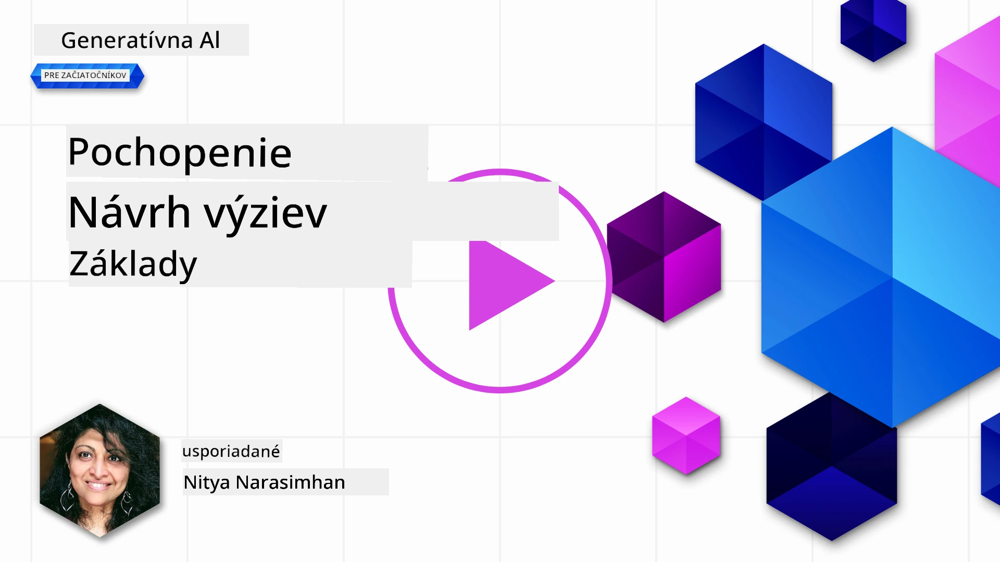
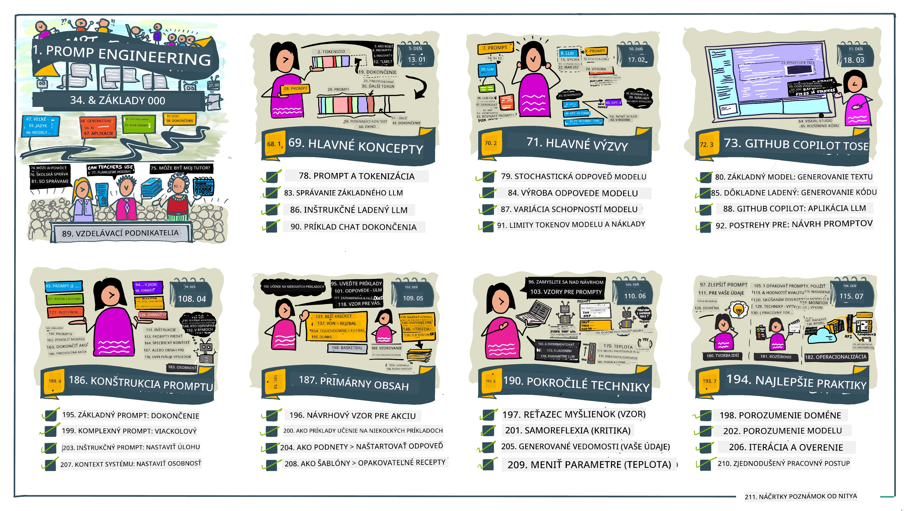
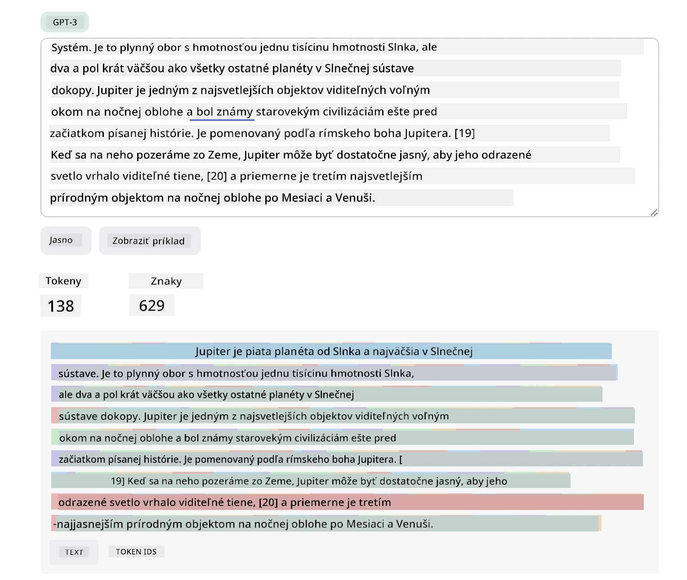
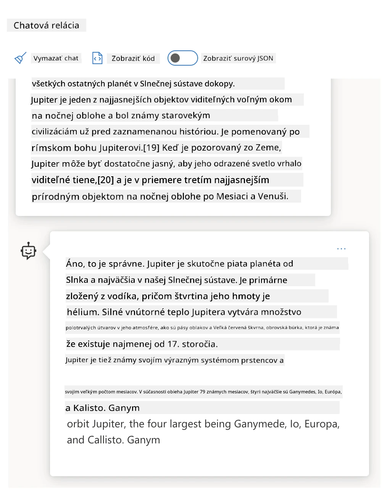
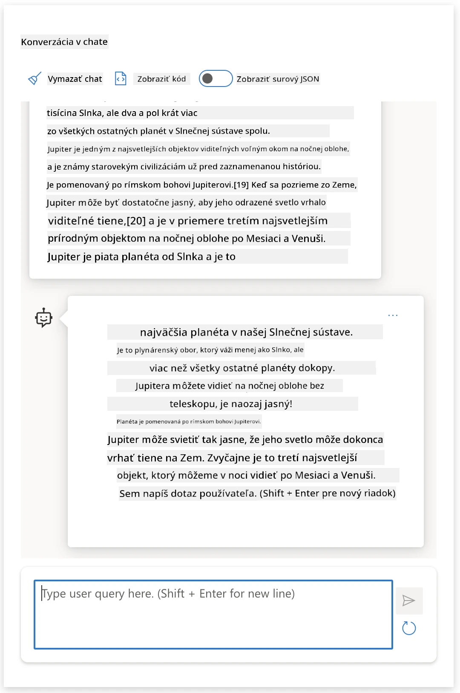
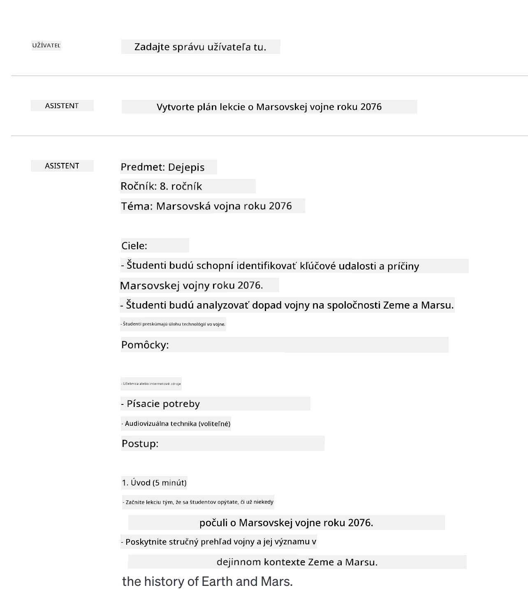
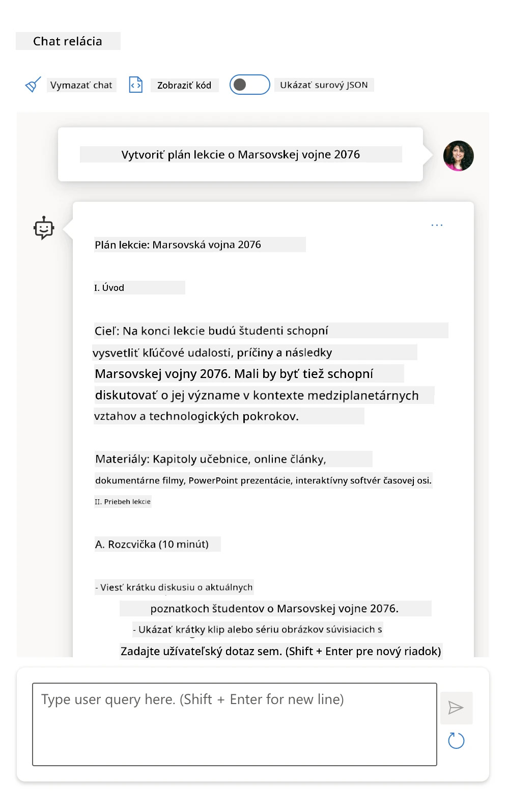
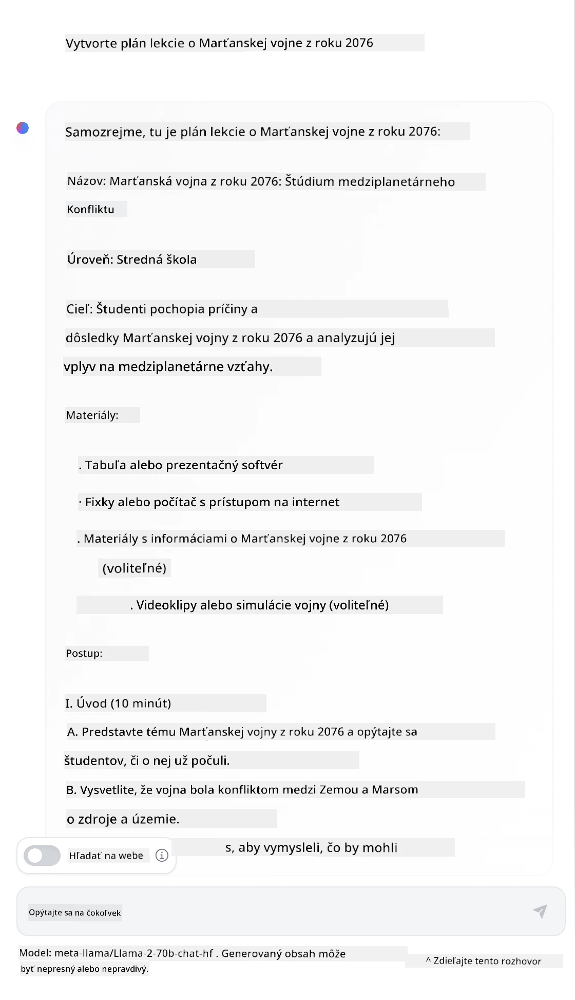

# Základy tvorby promptov

[](https://youtu.be/GElCu2kUlRs?si=qrXsBvXnCW12epb8)

## Úvod
Tento modul pokrýva základné koncepty a techniky na tvorbu efektívnych promptov v generatívnych AI modeloch. Spôsob, akým formulujete svoj prompt pre LLM, je tiež dôležitý. Starostlivo vytvorený prompt môže priniesť lepšiu kvalitu odpovede. Čo však presne znamenajú pojmy ako _prompt_ a _tvorba promptov_? A ako zlepšiť _vstupný prompt_, ktorý posielam LLM? Na tieto otázky sa pokúsime odpovedať v tejto kapitole a nasledujúcej.

_Generatívna AI_ je schopná vytvárať nový obsah (napr. text, obrázky, zvuk, kód a pod.) na základe požiadaviek používateľa. Dosahuje to pomocou _veľkých jazykových modelov_ ako séria GPT od OpenAI („Generative Pre-trained Transformer“), ktoré sú trénované na prácu s prirodzeným jazykom a kódom.

Používatelia teraz môžu s týmito modelmi komunikovať pomocou známych paradigiem, ako je chat, bez potreby technických znalostí alebo tréningu. Modely sú _promptové_ - používatelia posielajú textový vstup (prompt) a získajú späť odpoveď AI (dokončenie). Potom môžu s AI iteratívne „chatovať“ v viacstupňových rozhovoroch, upravovať svoj prompt, až kým odpoveď nevyhovuje ich očakávaniam.

„Prompty“ sa teraz stávajú hlavným _programovacím rozhraním_ pre generatívne AI aplikácie, ktoré modelom povedia, čo majú robiť, a ovplyvňujú kvalitu vrátených odpovedí. „Tvorba promptov“ je rýchlo rastúca oblasť štúdia, ktorá sa zameriava na _návrh a optimalizáciu_ promptov na zabezpečenie konzistentných a kvalitných odpovedí v škálovateľnom rozsahu.

## Ciele učenia

V tejto lekcii sa naučíme, čo je tvorba promptov, prečo je dôležitá a ako môžeme vytvárať efektívnejšie prompty pre daný model a cieľ aplikácie. Pochopíme základné koncepty a osvedčené postupy tvorby promptov - a naučíme sa o interaktívnom prostredí Jupyter Notebooks „sandbox“, kde si tieto koncepty môžeme vyskúšať na reálnych príkladoch.

Na konci tejto lekcie budeme schopní:

1. Vysvetliť, čo je tvorba promptov a prečo je dôležitá.
2. Opísať komponenty promptu a spôsob ich použitia.
3. Naučiť sa osvedčené postupy a techniky tvorby promptov.
4. Použiť naučené techniky na reálne príklady s využitím koncového bodu OpenAI.

## Kľúčové pojmy

Tvorba promptov: Praktika navrhovania a zdokonaľovania vstupov na nasmerovanie AI modelov k produkcii požadovaných výstupov.
Tokenizácia: Proces prevodu textu na menšie jednotky nazývané tokeny, ktoré model dokáže rozumieť a spracovať.
Instruction-Tuned LLMs: Veľké jazykové modely, ktoré boli dolaďované špecifickými inštrukciami na zlepšenie presnosti a relevantnosti odpovedí.

## Výučbové prostredie (sandbox)

Tvorba promptov je momentálne skôr umením ako vedou. Najlepším spôsobom, ako si zlepšiť intuíciu, je _viac cvičiť_ a použiť prístup pokus-omyl, ktorý kombinuje odborné znalosti v danej oblasti s odporúčanými technikami a optimalizáciami špecifickými pre model.

Jupyter Notebook, ktorý dopĺňa túto lekciu, poskytuje _sandbox_ prostredie, kde si môžete vyskúšať naučené - priebežne alebo ako súčasť výzvy s kódom na konci. Na vykonanie cvičení budete potrebovať:

1. **Kľúč Azure OpenAI API** - koncový bod služby pre nasadený LLM.
2. **Python Runtime** - v ktorom je možné Notebook spustiť.
3. **Lokálne premenné prostredia** - _dokončite teraz kroky v [SETUPE](./../00-course-setup/02-setup-local.md?WT.mc_id=academic-105485-koreyst), aby ste boli pripravení_.

Notebook obsahuje _základné_ cvičenia - ale ste povzbudzovaní, aby ste pridávali vlastné sekcie _Markdown_ (popis) a _Code_ (požiadavky promptov) na vyskúšanie ďalších príkladov alebo nápadov - a budovanie intuície v návrhu promptov.

## Ilustrovaný sprievodca

Chcete vidieť celkový obraz toho, čo táto lekcia pokrýva, skôr ako sa do toho pustíte? Prezrite si tento ilustrovaný sprievodca, ktorý vám dá predstavu o hlavných témach a kľúčových bodoch na zamyslenie. Plán lekcie vás prevedie od pochopenia základných konceptov a výziev až po riešenie pomocou relevantných techník tvorby promptov a najlepších postupov. Upozorňujeme, že sekcia „Pokročilé techniky“ v tomto sprievodcovi odkazuje na obsah v _nasledujúcej_ kapitole tohto kurikula.



## Náš startup

Teraz si povedzme, ako sa _téma_ vzťahuje na našu misiu startupu priniesť [inovácie AI do vzdelávania](https://educationblog.microsoft.com/2023/06/collaborating-to-bring-ai-innovation-to-education?WT.mc_id=academic-105485-koreyst). Chceme budovať AI poháňané aplikácie _personalizovaného vzdelávania_ - preto sa zamyslime, ako by rôzni používatelia našej aplikácie mohli „navrhovať“ prompty:

- **Administrátori** by mohli požiadať AI o _analýzu údajov učebných osnov na identifikáciu medzier v pokrytí_. AI vie výsledky zhrnúť alebo ich vizualizovať pomocou kódu.
- **Učitelia** by mohli požiadať AI o _vytvorenie plánu lekcie pre cieľové publikum a tému_. AI dokáže zostaviť personalizovaný plán vo vopred určenom formáte.
- **Študenti** by mohli požiadať AI o _doučovanie v ťažkom predmete_. AI ich teraz môže vedením lekcií, nápovedami a príkladmi prispôsobiť ich úrovni.

To je len špička ľadovca. Pozrite si [Prompty pre vzdelávanie](https://github.com/microsoft/prompts-for-edu/tree/main?WT.mc_id=academic-105485-koreyst) - open-source knižnicu promptov spravovanú odborníkmi na vzdelávanie - aby ste získali širšiu predstavu o možnostiach! _Vyskúšajte spustiť niektoré z týchto promptov v sandbokse alebo v OpenAI Playground a uvidíte, čo sa stane!_

<!--
ŠABLÓNA LEKCIE:
Táto jednotka by mala pokryť základný koncept č. 1.
Posilniť koncept príkladmi a odkazmi.

KONCEPT č. 1:
Tvorba promptov.
Definovať a vysvetliť, prečo je potrebná.
-->

## Čo je tvorba promptov?

Tento kurz sme začali definíciou **tvorby promptov** ako proces _navrhovania a optimalizácie_ textových vstupov (promptov) na dosiahnutie konzistentných a kvalitných odpovedí (dokončení) pre daný cieľ a model. Môžeme to považovať za proces v dvoch krokoch:

- _navrhnúť_ počiatočný prompt pre daný model a cieľ
- _vylepšiť_ prompt iteratívne na zlepšenie kvality odpovede

Je to nevyhnutne proces pokus-omyl vyžadujúci používateľskú intuíciu a úsilie na dosiahnutie optimálnych výsledkov. Prečo je to dôležité? Na odpoveď najprv potrebujeme pochopiť tri koncepty:

- _Tokenizácia_ = ako model „vidí“ prompt
- _Základné LLM_ = ako základný model „spracováva“ prompt
- _Instruction-Tuned LLMs_ = ako model teraz vidí „úlohy“

### Tokenizácia

LLM vidí prompty ako _sekvenciu tokenov_, pričom rôzne modely (alebo verzie modelu) môžu ten istý prompt tokenizovať rôznymi spôsobmi. Keďže LLM sú trénované na tokenoch (a nie na surovom texte), spôsob tokenizácie promptu priamo ovplyvňuje kvalitu generovanej odpovede.

Pre lepšiu predstavu o fungovaní tokenizácie vyskúšajte nástroje ako [OpenAI Tokenizer](https://platform.openai.com/tokenizer?WT.mc_id=academic-105485-koreyst) zobrazený nižšie. Skopírujte svoj prompt a pozrite sa, ako sa prevádza na tokeny, pričom venujte pozornosť spracovaniu medzier a interpunkcie. Poznámka: tento príklad ukazuje starší LLM (GPT-3) - pri použití novšieho modelu môže byť výsledok iný.



### Koncept: Základné modely (Foundation Models)

Po tokenizácii promptu je hlavným úlohou ["Základného LLM"](https://blog.gopenai.com/an-introduction-to-base-and-instruction-tuned-large-language-models-8de102c785a6?WT.mc_id=academic-105485-koreyst) (alebo základného modelu) predpovedať token v tejto sekvencii. Keďže LLM sú trénované na obrovských textových dátach, dobre poznajú štatistické vzťahy medzi tokenmi a dokážu túto predpoveď vykonať s istotou. Poznámka: nerozumejú _významu_ slov v promte alebo tokene; vidia len vzor, ktorý môžu „dokončiť“ svojou ďalšou predpoveďou. Pokračujú v predpovedaní sekvencie, až kým ich nezastaví používateľ alebo neprebehne predom stanovená podmienka.

Chcete vidieť, ako funguje dokončenie na základe promptu? Zadajte vyššie uvedený prompt do [Microsoft Foundry playground](https://ai.azure.com?WT.mc_id=academic-105485-koreyst) s predvolenými nastaveniami. Systém je nastavený tak, aby považoval prompty za požiadavky na informácie - takže uvidíte dokončenie, ktoré zodpovedá tomuto kontextu.

Čo však ak používateľ chce vidieť niečo špecifické, čo spĺňa nejaké kritériá alebo cieľ úlohy? Práve tu prichádzajú do hry _instruction-tuned_ LLM.



### Koncept: Instruction-Tuned LLMs

[Instruction-Tuned LLM](https://blog.gopenai.com/an-introduction-to-base-and-instruction-tuned-large-language-models-8de102c785a6?WT.mc_id=academic-105485-koreyst) vychádza zo základného modelu a dolaďuje ho na základe príkladov alebo vstupno-výstupných párov (napr. viacstupňových „ správ“), ktoré môžu obsahovať jasné inštrukcie - a odpoveď AI sa snaží túto inštrukciu dodržať.

Používa techniky ako učenie posilňovaním s ľudskou spätnou väzbou (RLHF), ktoré model naučia _dodržiavať inštrukcie_ a _učiť sa zo spätnej väzby_, aby produkoval odpovede vhodnejšie pre praktické použitie a relevantnejšie pre používateľské ciele.

Skúste to - vráťte sa k vyššie uvedenému promptu, ale teraz zmeňte _systémovú správu_ tak, aby poskytla nasledujúcu inštrukciu ako kontext:

> _Zhrňte poskytnutý obsah pre žiaka 2. triedy. Výsledok by mal byť v jednom odstavci s 3-5 odrážkami._

Všimnite si, ako je výsledok teraz upravený tak, aby odrážal požadovaný cieľ a formát? Učiteľ ho môže priamo použiť vo svojich slidoch pre danú triedu.



## Prečo potrebujeme tvorbu promptov?

Teraz, keď vieme, ako LLM spracúvajú prompty, povedzme si, _prečo_ potrebujeme tvorbu promptov. Odpoveď spočíva v tom, že súčasné LLM predstavujú množstvo výziev, ktoré robia _spoľahlivé a konzistentné dokončenia_ ťažšie dosiahnuteľným bez úsilia na konštrukciu a optimalizáciu promptu. Napríklad:

1. **Odpovede modelu sú stochastické.** _Ten istý prompt_ pravdepodobne vyprodukuje rôzne odpovede s rôznymi modelmi alebo verziami modelu. A môže dokonca priniesť rôzne výsledky so _stejným modelom_ v rôznych časoch. _Techniky tvorby promptov nám pomáhajú minimalizovať tieto variácie tým, že poskytujú lepšie ohraničenia_.

1. **Modely môžu vymýšľať odpovede.** Modely sú predtrénované na _veľkých, ale konečných_ dátových súboroch, takže postrádajú znalosti o konceptoch mimo rozsahu tréningu. V dôsledku toho môžu generovať dokončenia, ktoré sú nepresné, vymyslené alebo priamo protirečia známym faktom. _Techniky tvorby promptov pomáhajú používateľom identifikovať a zmierňovať takéto vymýšľanie napr. pýtaním sa AI na zdroje alebo zdôvodnenie_.

1. **Schopnosti modelov sa budú líšiť.** Novšie modely alebo generácie modelov budú mať bohatšie schopnosti, ale zároveň prinášajú jedinečné zvláštnosti a kompromisy v nákladoch a zložitosti. _Tvorba promptov nám pomáha vyvíjať osvedčené postupy a pracovné postupy, ktoré abstrahujú rozdiely a prispôsobujú sa požiadavkám konkrétneho modelu škálovateľným a bezproblémovým spôsobom_.

Pozrime sa na to prakticky v OpenAI alebo Azure OpenAI Playground:

- Použite rovnaký prompt s rôznymi nasadeniami LLM (napr. OpenAI, Azure OpenAI, Hugging Face) - videli ste rozdiely?
- Použite rovnaký prompt viackrát so _stejným_ nasadením LLM (napr. Azure OpenAI playground) - ako sa tieto variácie líšili?

### Príklad „vymýšľania“ informácií

V tomto kurze používame termín **„vymýšľanie“** na označenie javu, keď LLM niekedy generujú fakticky nesprávne informácie kvôli obmedzeniam ich tréningu alebo iným faktorom. Môžete to tiež poznať ako _„halucinácie“_ v populárnych článkoch alebo vedeckých prácach. Silne však odporúčame používať výraz _„vymýšľanie“_, aby sme sa náhodou nezľudšťovali správanie a nepripisovali strojom ľudské vlastnosti. Tým tiež podporujeme [zásady zodpovedného AI](https://www.microsoft.com/ai/responsible-ai?WT.mc_id=academic-105485-koreyst) z hľadiska terminológie a odstraňujeme výrazy, ktoré môžu byť v niektorých kontextoch považované za nevhodné alebo nevylučujúce.

Chcete vedieť, ako funguje vymýšľanie? Predstavte si prompt, ktorý inštruuje AI generovať obsah pre neexistujúcu tému (aby ste zabezpečili, že nie je v tréningovej množine). Napríklad som skúšal tento prompt:

> **Prompt:** vygeneruj plán lekcie o Marsovskej vojne v roku 2076.

Webové vyhľadávanie mi ukázalo, že existujú fiktívne opisy (napr. televízne seriály alebo knihy) o Marsovských vojnách - ale žiadne z roku 2076. Bežný zdravý rozum nám tiež hovorí, že rok 2076 je _v budúcnosti_, a preto nemôže byť spojený s reálnou udalosťou.


Čo sa teda stane, keď spustíme tento prompt s rôznymi poskytovateľmi LLM?

> **Odpoveď 1**: OpenAI Playground (GPT-35)



> **Odpoveď 2**: Azure OpenAI Playground (GPT-35)



> **Odpoveď 3**: : Hugging Face Chat Playground (LLama-2)



Ako sa očakávalo, každý model (alebo verzia modelu) generuje mierne odlišné odpovede vďaka stochastickému správaniu a variáciám schopností modelu. Napríklad jeden model cieli na publikum 8. triedy, zatiaľ čo iný predpokladá študenta strednej školy. Avšak všetky tri modely vytvorili odpovede, ktoré by mohli presvedčiť neinformovaného používateľa, že udalosť bola reálna.

Techniky promptového inžinierstva ako _metaprompting_ a _nastavenie teploty_ môžu do určitej miery znížiť tvorbu nepravdivých informácií modelom. Nové architektúry promptového inžinierstva tiež bezproblémovo integrujú nové nástroje a techniky do toku promptu, aby zmiernili alebo znížili niektoré z týchto efektov.

## Prípadová štúdia: GitHub Copilot

Zakončime túto časť pohľadom na to, ako sa promptové inžinierstvo používa v reálnych riešeniach, pozretím jednej prípadovej štúdie: [GitHub Copilot](https://github.com/features/copilot?WT.mc_id=academic-105485-koreyst).

GitHub Copilot je váš "AI dvojitý programátor" - premení textové promptové vstupy na dokončenia kódu a je integrovaný do vášho vývojového prostredia (napr. Visual Studio Code) pre plynulý používateľský zážitok. Ako je zdokumentované v sérii blogov nižšie, najskoršia verzia bola založená na modeli OpenAI Codex - pričom inžinieri rýchlo pochopili potrebu doladiť model a vyvinúť lepšie techniky promptového inžinierstva, aby sa zlepšila kvalita kódu. V júli predstavili [vylepšený AI model, ktorý presahuje Codex](https://github.blog/2023-07-28-smarter-more-efficient-coding-github-copilot-goes-beyond-codex-with-improved-ai-model/?WT.mc_id=academic-105485-koreyst), aby poskytol ešte rýchlejšie návrhy.

Prečítajte si príspevky v poradí, aby ste sledovali ich vzdelávaciu cestu.

- **Máj 2023** | [GitHub Copilot sa zlepšuje v porozumení vášho kódu](https://github.blog/2023-05-17-how-github-copilot-is-getting-better-at-understanding-your-code/?WT.mc_id=academic-105485-koreyst)
- **Máj 2023** | [Inside GitHub: Práca s LLM za GitHub Copilot](https://github.blog/2023-05-17-inside-github-working-with-the-llms-behind-github-copilot/?WT.mc_id=academic-105485-koreyst).
- **Jún 2023** | [Ako písať lepšie prompty pre GitHub Copilot](https://github.blog/2023-06-20-how-to-write-better-prompts-for-github-copilot/?WT.mc_id=academic-105485-koreyst).
- **Júl 2023** | [.. GitHub Copilot presahuje Codex s vylepšeným AI modelom](https://github.blog/2023-07-28-smarter-more-efficient-coding-github-copilot-goes-beyond-codex-with-improved-ai-model/?WT.mc_id=academic-105485-koreyst)
- **Júl 2023** | [Sprievodca vývojára promptovým inžinierstvom a LLM](https://github.blog/2023-07-17-prompt-engineering-guide-generative-ai-llms/?WT.mc_id=academic-105485-koreyst)
- **Sep 2023** | [Ako zostaviť podnikateľskú aplikáciu LLM: Lekcie z GitHub Copilot](https://github.blog/2023-09-06-how-to-build-an-enterprise-llm-application-lessons-from-github-copilot/?WT.mc_id=academic-105485-koreyst)

Môžete tiež prehliadať ich [Inžiniersky blog](https://github.blog/category/engineering/?WT.mc_id=academic-105485-koreyst) pre ďalšie príspevky ako [tento](https://github.blog/2023-09-27-how-i-used-github-copilot-chat-to-build-a-reactjs-gallery-prototype/?WT.mc_id=academic-105485-koreyst), ktorý ukazuje, ako sa tieto modely a techniky _aplikujú_ na riadenie reálnych aplikácií.

---

<!--
ŠABLÓNA LEKCIE:
Táto jednotka by mala pokrývať základný koncept #2.
Posilniť koncept príkladmi a odkazmi.

KONCEPT #2:
Návrh promptu.
Ilustrované na príkladoch.
-->

## Konštrukcia promptu

Videli sme, prečo je promptové inžinierstvo dôležité - teraz pochopme, ako sú prompty _konštruované_, aby sme mohli hodnotiť rôzne techniky pre efektívnejší návrh promptov.

### Základný prompt

Začnime so základným promptom: textovým vstupom poslaným modelu bez iného kontextu. Tu je príklad - keď odošleme prvé niekoľko slov americkej národnej hymny do OpenAI [Completion API](https://platform.openai.com/docs/api-reference/completions?WT.mc_id=academic-105485-koreyst), okamžite doplní odpoveď ďalšími riadkami, ilustrujúc základné prediktívne správanie.

| Prompt (vstup)      | Dokončenie (výstup)                                                                                                                    |
| :----------------- | :----------------------------------------------------------------------------------------------------------------------------------- |
| Oh say can you see | Vypadá to, že začínate spev „The Star-Spangled Banner,“ národnej hymny Spojených štátov. Celé texty sú...                              |

### Zložitý prompt

Teraz pridajme kontext a inštrukcie k základnému promptu. [Chat Completion API](https://learn.microsoft.com/azure/ai-foundry/openai/how-to/chatgpt?WT.mc_id=academic-105485-koreyst) nám umožňuje skonštruovať zložitý prompt ako kolekciu _správ_ s:

- Pár vstupov/výstupov odrážajúcich vstup _používateľa_ a odpoveď _asistenta_.
- Systémová správa nastavujúca kontext pre správanie alebo osobnosť asistenta.

Požiadavka je teraz v nasledujúcej forme, kde _tokenizácia_ efektívne zachytáva relevantné informácie z kontextu a konverzácie. Zmena systémového kontextu môže mať rovnaký vplyv na kvalitu doplnení ako zadané vstupy používateľa.

```python
response = client.responses.create(
    model="gpt-5-mini",
    input=[
        {"role": "system", "content": "You are a helpful assistant."},
        {"role": "user", "content": "Who won the world series in 2020?"},
        {"role": "assistant", "content": "The Los Angeles Dodgers won the World Series in 2020."},
        {"role": "user", "content": "Where was it played?"}
    ]
)
```

### Instrukčný prompt

V príkladoch vyššie bol používateľský prompt jednoduchá textová požiadavka, ktorú je možné interpretovať ako žiadosť o informácie. Pri _instrukčných_ promptoch môžeme použiť tento text na podrobnejšie špecifikovanie úlohy a poskytnúť lepšie smerovanie AI. Tu je príklad:

| Prompt (vstup)                                                                                                                                                                                                                             | Dokončenie (výstup)                                                                                   | Typ inštrukcie  |
| :------------------------------------------------------------------------------------------------------------------------------------------------------------------------------------------------------------------------------------- | :----------------------------------------------------------------------------------------------------- | :-------------- |
| Napíš popis občianskej vojny                                                                                                                                                                                                             | _vrátil jednoduchý odsek_                                                                              | Jednoduchý      |
| Napíš popis občianskej vojny. Uveď kľúčové dátumy a udalosti a opíš ich význam                                                                                                                                                            | _vrátil odsek, za ktorým nasledoval zoznam kľúčových dátumov s popismi_                                  | Zložitý         |
| Napíš popis občianskej vojny v 1 odseku. Uveď 3 bodčeky s dôležitými dátumami a ich významom. Uveď ďalšie 3 bodčeky s významnými historickými osobnosťami a ich prínosmi. Výstup vráť ako JSON súbor                                    | _vracia rozsiahlejšie detaily v textovom poli, formátované ako JSON, ktoré môžete skopírovať a validovať_ | Zložitý. Formátovaný. |

## Primárny obsah

V príkladoch vyššie bol prompt stále dosť otvorený a umožňoval LLM rozhodnúť, ktorá časť jeho predtrénovaných dát je relevantná. Pri návrhovom vzore _primárneho obsahu_ je vstupný text rozdelený na dve časti:

- inštrukciu (akciu)
- relevantný obsah (ktorý ovplyvňuje akciu)

Tu je príklad, kde je inštrukcia "zhrň toto do 2 viet".

| Prompt (vstup)                                                                                                                                                                                                                                                                                                                                                                                                                                                                                                                                                                                                                                                                                    | Dokončenie (výstup)                                                                                                                                                                                                                                                                       |
| :------------------------------------------------------------------------------------------------------------------------------------------------------------------------------------------------------------------------------------------------------------------------------------------------------------------------------------------------------------------------------------------------------------------------------------------------------------------------------------------------------------------------------------------------------------------------------------------------------------------------------------------------------------------------------------------------ | :------------------------------------------------------------------------------------------------------------------------------------------------------------------------------------------------------------------------------------------------------------------------------------------ |
| Jupiter je piata planéta od Slnka a najväčšia v slnečnej sústave. Je to plynový obor s hmotnosťou tisíckrát menšou než Slnko, ale dvojnásobne väčšou ako všetky ostatné planéty slnečnej sústavy spolu. Jupiter je jedným z najsvetlejších objektov viditeľných voľným okom na nočnej oblohe a bol známy starovekým civilizáciám už pred zaznamenanou históriou. Je pomenovaný podľa rímskeho boha Jupitera.[19] Keď sa naň pozeráme zo Zeme, môže byť dosť jasný na to, aby jeho odrazené svetlo vrhalo viditeľné tiene,[20] a je priemerne tretím najsvetlejším prírodným objektom na nočnej oblohe po Mesiaci a Venuši. <br/> **Zhrň toto v 2 krátkych vetách** | Jupiter, piata planéta od Slnka, je najväčšou v slnečnej sústave a je známy ako jeden z najsvetlejších objektov na nočnej oblohe. Pomenovaný podľa rímskeho boha Jupitera, je to plynový obor, ktorého hmotnosť je dvojnásobná ako hmotnosť všetkých ostatných planét slnečnej sústavy spolu. |

Segment primárneho obsahu možno využiť rôznymi spôsobmi pre efektívnejšie inštrukcie:

- **Príklady** - namiesto explicitného povedania modelu, čo má robiť, dajte mu príklady toho, čo má robiť, a nechajte ho odvodiť vzorec.
- **Návody** - nasledujte inštrukciu "návodom", ktorý pripravuje dokončenie a vedie model k relevantnejším odpovediam.
- **Šablóny** - toto sú opakovateľné 'recepty' na prompty s zástupnými znakmi (premennými), ktoré možno prispôsobiť údajom pre konkrétne prípady použitia.

Preskúmajme tieto spôsoby v praxi.

### Použitie príkladov

Tento prístup využíva primárny obsah na "nakŕmenie modelu" príkladmi požadovaného výstupu pre danú inštrukciu a necháva model odvodiť vzorec pre požadovaný výstup. Na základe počtu dodaných príkladov môžeme mať zero-shot promptovanie, one-shot promptovanie, few-shot promptovanie, atď.

Prompt teraz pozostáva z troch komponentov:

- Popis úlohy
- Niekoľko príkladov požadovaného výstupu
- Začiatok nového príkladu (čo sa stáva implicitným popisom úlohy)

| Typ učenia  | Prompt (vstup)                                                                                                                             | Dokončenie (výstup)        |
| :---------- | :---------------------------------------------------------------------------------------------------------------------------------------- | :------------------------- |
| Zero-shot  | "The Sun is Shining". Prelož do španielčiny                                                                                               | "El Sol está brillando".   |
| One-shot   | "The Sun is Shining" => ""El Sol está brillando". <br> "It's a Cold and Windy Day" =>                                                      | "Es un día frío y ventoso".|
| Few-shot   | Hráč bežal po metách => Baseball <br/> Hráč dal eso => Tennis <br/> Hráč dal šesťku => Cricket <br/> Hráč dal smeč =>                      | Basketbal                  |
|            |                                                                                                                                          |                            |

Všimnite si, že sme museli poskytnúť explicitnú inštrukciu ("Prelož do španielčiny") pri zero-shot promptovaní, ale tá sa odvádza pri one-shot promptovaní. Few-shot príklad ukazuje, ako pridanie viacerých príkladov umožňuje modelom robiť presnejšie závery bez ďalších inštrukcií.

### Návody promptu

Ďalšou technikou použitia primárneho obsahu je poskytnúť _návody_ namiesto príkladov. V tomto prípade modelu dáme jemné nasmerovanie správnym smerom tým, že ho _naštartujeme_ úryvkom, ktorý odráža požadovaný formát odpovede. Model potom "berie návod", aby v tomto duchu pokračoval.

| Počet návodov | Prompt (vstup)                                                                                                                                                                                                                                                                                                                                                                                                                                            | Dokončenie (výstup)                                                                                                                                                                                                                                                                                      |
| :------------ | :-------------------------------------------------------------------------------------------------------------------------------------------------------------------------------------------------------------------------------------------------------------------------------------------------------------------------------------------------------------------------------------------------------------------------------------------------------- | :------------------------------------------------------------------------------------------------------------------------------------------------------------------------------------------------------------------------------------------------------------------------------------------------------- |
| 0             | Jupiter je piata planéta od Slnka a najväčšia v slnečnej sústave. Je to plynový obor s hmotnosťou tisíckrát menšou než Slnko, ale dvojnásobne väčšou ako všetky ostatné planéty slnečnej sústavy spolu. Jupiter je jedným z najsvetlejších objektov viditeľných voľným okom na nočnej oblohe a bol známy starovekým civilizáciám už pred zaznamenanou históriou. <br/>**Zhrň toto**                                                               | Jupiter je najväčšia planéta v našej slnečnej sústave a piata od Slnka. Je to plynový obor s hmotnosťou 1/1000 hmotnosti Slnka, ale je ťažší ako všetky ostatné planéty spolu. Staroveké civilizácie poznali Jupitera už dávno a je ľahko viditeľný na nočnej oblohe.            |
| 1             | Jupiter je piata planéta od Slnka a najväčšia v slnečnej sústave. Je to plynový obor s hmotnosťou tisíckrát menšou než Slnko, ale dvojnásobne väčšou ako všetky ostatné planéty slnečnej sústavy spolu. Jupiter je jedným z najsvetlejších objektov viditeľných voľným okom na nočnej oblohe a bol známy starovekým civilizáciám už pred zaznamenanou históriou. <br/>**Zhrň toto** <br/> Čo sme sa dozvedeli o Jupitri | je piata planéta od Slnka a najväčšia v slnečnej sústave. Je to plynový obor s hmotnosťou tisíckrát menšou než Slnko, ale dvojnásobne väčšou ako všetky ostatné planéty spolu. Je ľahko viditeľný voľným okom a je známy od staroveku.                                 |

| 2              | Jupiter je piata planéta od Slnka a najväčšia v Slnečnej sústave. Je to plynného obra s hmotnosťou tisícinu hmotnosti Slnka, ale dvojnásobne a pol väčšou ako všetky ostatné planéty Slnečnej sústavy dokopy. Jupiter je jedným z najsvetlejších objektov viditeľných voľným okom na nočnej oblohe a je známy starovekým civilizáciám od nepamäti. <br/>**Zhrnutie** <br/> Top 3 fakty, ktoré sme sa naučili:         | 1. Jupiter je piata planéta od Slnka a najväčšia v Slnečnej sústave. <br/> 2. Je to plynného obra s hmotnosťou tisícinu hmotnosti Slnka...<br/> 3. Jupiter je viditeľný voľným okom už od staroveku ...                                                                       |
|                |                                                                                                                                                                                                                                                                                                                                                                                                                                                              |                                                                                                                                                                                                                                                                                                           |

### Šablóny výziev

Šablóna výzvy je _preddefinovaný recept na výzvu_, ktorý sa dá uložiť a podľa potreby opätovne použiť na zabezpečenie konzistentnejších používateľských skúseností v širšom meradle. V najjednoduchšej forme je to iba zbierka príkladov výziev ako [tento od OpenAI](https://cookbook.openai.com/examples/gpt4-1_prompting_guide?WT.mc_id=academic-105485-koreyst), ktorá poskytuje interaktívne súčasti výzvy (správy používateľa a systému) a formát požiadavky riadený API – na podporu opätovného použitia.

V zložitejšej forme ako [tento príklad od LangChain](https://python.langchain.com/docs/concepts/prompt_templates/?WT.mc_id=academic-105485-koreyst) obsahuje _zástupné symboly_, ktoré môžu byť nahradené dátami z rôznych zdrojov (vstup používateľa, kontext systému, externé zdroje dát atď.) na dynamické vytvorenie výzvy. To nám umožňuje vytvoriť knižnicu opätovne použiteľných výziev, ktoré môžu byť použité na programovo **riadenie konzistentných používateľských skúseností** v škále.

Skutočná hodnota šablón spočíva v schopnosti vytvárať a publikovať _knižnice výziev_ pre vertikálne aplikačné oblasti – kde je šablóna výzvy teraz _optimalizovaná_ tak, aby odrážala kontext alebo príklady špecifické pre aplikáciu, ktoré robia odpovede relevantnejšie a presnejšie pre cieľovú používateľskú skupinu. Repozitár [Prompts For Edu](https://github.com/microsoft/prompts-for-edu?WT.mc_id=academic-105485-koreyst) je skvelým príkladom tohto prístupu, zbierajúcim knižnicu výziev pre oblasť vzdelávania s dôrazom na kľúčové ciele ako plánovanie hodín, návrh osnov, doučovanie študentov atď.

## Podporný obsah

Ak uvažujeme o tvorbe výzvy ako o inštrukcii (úlohe) a cieli (primárnom obsahu), potom _sekundárny obsah_ je ako dodatočný kontext, ktorý poskytujeme na **ovplyvnenie výstupu určitým spôsobom**. Môžu to byť nastavovacie parametre, inštrukcie na formátovanie, taxonómie tém atď., ktoré môžu modelu pomôcť _prispôsobiť_ odpoveď na želané používateľské ciele alebo očakávania.

Napríklad: Ak máme katalóg kurzov s rozsiahlymi metadátami (názov, popis, úroveň, označenia metadát, inštruktor atď.) o všetkých dostupných kurzoch v osnovách:

- môžeme definovať inštrukciu „zhrnúť katalóg kurzov na jeseň 2023“
- môžeme použiť primárny obsah na poskytnutie niekoľkých príkladov požadovaného výstupu
- môžeme použiť sekundárny obsah na identifikáciu top 5 „značiek“ záujmu.

Teraz môže model poskytnúť zhrnutie v formáte zobrazenom na príkladoch – ale ak má výsledok viacero značiek, môže uprednostniť 5 značiek identifikovaných v sekundárnom obsahu.

---

<!--
ŠABLÓNA HODINY:
Táto jednotka by mala pokryť základný koncept č. 1.
Posilni koncept príkladmi a referenciami.

KONCEPT Č. 3:
Techniky promptového inžinierstva.
Aké sú základné techniky promptového inžinierstva?
Ilustruj ich na niekoľkých cvičeniach.
-->

## Najlepšie postupy pri tvorbe výziev

Keď už vieme, ako sa výzvy _konštruujú_, môžeme začať premýšľať o tom, ako ich _navrhnúť_ tak, aby odrážali najlepšie praktiky. Môžeme o tom uvažovať v dvoch častiach – mať správny _postoj_ a uplatniť správne _techniky_.

### Postoj pri promptovom inžinierstve

Promptové inžinierstvo je proces pokus-omyl, preto majte na pamäti tri široké vodítka:

1. **Porozumenie doméne je dôležité.** Presnosť a relevantnosť odpovedí závisí od _domény_, v ktorej aplikácia alebo používateľ pôsobí. Uplatnite svoju intuíciu a odbornosť v doméne na ďalšie **prispôsobenie techník**. Napríklad definujte _osobnosti špecifické pre doménu_ v systémových výzvach alebo použite _šablóny špecifické pre doménu_ v používateľských výzvach. Poskytnite sekundárny obsah, ktorý odráža kontext špecifický pre doménu, alebo použite _doménové signály a príklady_ na usmernenie modelu k známym vzorom používania.

2. **Porozumenie modelu je dôležité.** Vieme, že modely sú z princípu stochastické. Ale implementácie modelov sa tiež môžu líšiť v závislosti od použitého tréningového datasetu (predtrénované znalosti), možností, ktoré poskytujú (napr. cez API alebo SDK) a typu obsahu, pre ktorý sú optimalizované (napr. kód vs. obrázky vs. text). Pochopte silné stránky a obmedzenia modelu, ktorý používate, a tieto znalosti využite na _prioritizáciu úloh_ alebo vytváranie _prispôsobených šablón_ optimalizovaných pre schopnosti modelu.

3. **Iterácia a validácia sú dôležité.** Modely sa rýchlo vyvíjajú a rovnako aj techniky promptového inžinierstva. Ako odborník v doméne môžete mať špecifický kontext alebo kritériá pre _vašu_ konkrétnu aplikáciu, ktoré nemusia platiť pre širšiu komunitu. Používajte nástroje a techniky promptového inžinierstva na „rýchly začiatok“ tvorby výziev, potom iterujte a validujte výsledky pomocou vlastnej intuície a odbornosti v doméne. Zaznamenávajte svoje poznatky a vytvárajte **bázu znalostí** (napr. knižnice výziev), ktoré môžu byť základom pre ďalších na rýchlejšie iterácie v budúcnosti.

## Najlepšie praktiky

Teraz sa pozrieme na bežné najlepšie praktiky odporúčané odborníkmi z [OpenAI](https://help.openai.com/en/articles/6654000-best-practices-for-prompt-engineering-with-openai-api?WT.mc_id=academic-105485-koreyst) a [Azure OpenAI](https://learn.microsoft.com/azure/ai-foundry/openai/concepts/prompt-engineering#best-practices?WT.mc_id=academic-105485-koreyst).

| Čo                               | Prečo                                                                                                                                                                                                                                              |
| :-------------------------------- | :---------------------------------------------------------------------------------------------------------------------------------------------------------------------------------------------------------------------------------------------- |
| Testujte najnovšie modely.       | Nové generácie modelov pravdepodobne prinášajú vylepšené funkcie a kvalitu – ale môžu tiež znamenať vyššie náklady. Otestujte ich dopad a potom spravte rozhodnutia o migrácii.                                                                 |
| Oddelujte inštrukcie a kontext   | Skontrolujte, či váš model/províder definuje _delimitery_ na jasnejšie rozlíšenie inštrukcií, primárneho a sekundárneho obsahu. To môže modelom pomôcť presnejšie priradiť váhy tokenom.                                                         |
| Buďte špecifickí a jasní         | Poskytnite viac detailov o želanom kontexte, výsledku, dĺžke, formáte, štýle a pod. To zlepší kvalitu aj konzistenciu odpovedí. Zachyťte recepty v opätovne použiteľných šablónach.                                                            |
| Buďte popisní, používajte príklady | Modely môžu lepšie reagovať na prístup „ukáž a povedz“. Začnite s `zero-shot` prístupom, kde dáte inštrukciu (bez príkladov), potom skúste `few-shot` ako doladenie tým, že poskytnete niekoľko príkladov želaného výstupu. Používajte analógie.          |
| Používajte signály na naštartovanie dokončení | Nasmerujte model k želanému výsledku tým, že mu dáte pár úvodných slov alebo fráz, ktoré môže použiť ako východisko pre odpoveď.                                                                                                               |
| Dajte to dvakrát                   | Niekedy je potrebné modelu zopakovať inštrukcie. Dajte inštrukcie pred a po primárnom obsahu, použite inštrukciu a signál, atď. Iterujte a validujte, čo funguje najlepšie.                                                                     |
| Poradie je dôležité               | Poradie, v akom informácie predstavujete modelu, môže ovplyvniť výstup, dokonca aj v učebných príkladoch, vďaka efektu recency. Skúšajte rôzne možnosti a uvidíte, čo funguje najlepšie.                                                          |
| Dajte modelu „únikový“ variant    | Dajte modelu _náhradnú_ odpoveď, ktorú môže použiť, ak z akéhokoľvek dôvodu nemôže dokončiť úlohu. To môže znížiť pravdepodobnosť generovania nepravdivých alebo vymyslených odpovedí.                                                           |
|                                   |                                                                                                                                                                                                                                                   |

Ako pri každej najlepšej praxi, majte na pamäti, že _váš výsledok sa môže líšiť_ v závislosti od modelu, úlohy a domény. Použite tieto rady ako východiskový bod a iterujte, aby ste našli to, čo pre vás najlepšie funguje. Neustále prehodnocujte svoj proces promptového inžinierstva, ako sa objavujú nové modely a nástroje, so zameraním na škálovateľnosť procesu a kvalitu odpovedí.

<!--
ŠABLÓNA HODINY:
Táto jednotka by mala obsahovať výzvu na napísanie kódu, ak je to vhodné

VÝZVA:
Odkaz na Jupyter Notebook s inštrukciami iba v komentároch kódu (sekcie s kódom sú prázdne).

RIEŠENIE:
Odkaz na kópiu tohto Notebooku s vyplnenými a spustenými promptmi, ukazujúcimi jeden príklad výstupu.
-->

## Úloha

Gratulujeme! Dostali ste sa na koniec lekcie! Je čas otestovať niektoré z týchto konceptov a techník na reálnych príkladoch!

Na našu úlohu budeme používať Jupyter Notebook s cvičeniami, ktoré môžete interaktívne dokončiť. Môžete ho tiež rozšíriť o vlastné bunky s Markdownom a Kódom na skúmanie nápadov a techník samostatne.

### Na začiatok forkni repozitár, potom

- (Odporúčané) Spustiť GitHub Codespaces
- (Alternatívne) Klonovať repozitár do svojho zariadenia a použiť ho s Docker Desktop
- (Alternatívne) Otvoriť Notebook vo vašom preferovanom prostredí pre Notebooky.

### Ďalej nakonfiguruj svoje environmentálne premenné

- Skopírovať súbor `.env.copy` z koreňa repozitára do `.env` a vyplniť hodnoty `AZURE_OPENAI_API_KEY`, `AZURE_OPENAI_ENDPOINT` a `AZURE_OPENAI_DEPLOYMENT`. Potom sa vráť na [sekciu Learning Sandbox](#výučbové-prostredie-sandbox), aby si sa naučil ako na to.

### Ďalej otvor Jupyter Notebook

- Vyber runtime kernel. Ak používaš možnosti 1 alebo 2, jednoducho vyber predvolený Python 3.10.x kernel poskytnutý vývojárskym kontajnerom.

Si pripravený spustiť cvičenia. Poznámka: Tu nie sú žiadne _správne a nesprávne_ odpovede – len skúmanie možností pomocou pokusov a omylov a budovanie intuície pre to, čo funguje pre daný model a aplikačnú doménu.

_Z tohoto dôvodu v tejto lekcii nie sú segmenty s riešením kódu. Namiesto toho bude Notebook obsahovať bunky s názvom "Moje riešenie:", ktoré ukazujú jeden príklad výstupu na referenciu._

 <!--
ŠABLÓNA HODINY:
Zabaľ túto sekciu s resumé a zdrojmi na samostatné štúdium.
-->

## Kontrola vedomostí

Ktorá z nasledujúcich výziev je dobrá výzva podľa rozumných najlepších praktík?

1. Ukáž mi obrázok červeného auta
2. Ukáž mi obrázok červeného auta značky Volvo model XC90 zaparkovaného pri útesu so západom slnka
3. Ukáž mi obrázok červeného auta značky Volvo model XC90

A: 2, je to najlepšia výzva, pretože poskytuje detaily o "čom", ide do špecifík (nie hocijaké auto, ale konkrétna značka a model), a tiež popisuje celkové prostredie. 3 je ďalšia najlepšia, pretože tiež obsahuje veľa popisu.

## 🚀 Výzva

Skúste využiť techniku „cue“ vo výzve: Dokonč vetu „Ukáž mi obrázok červeného auta značky Volvo a ". Čo odpovie a ako by ste to vylepšili?

## Skvelá práca! Pokračujte v učení

Chcete sa dozvedieť viac o rôznych konceptoch promptového inžinierstva? Navštívte [stránku ďalšieho štúdia](https://aka.ms/genai-collection?WT.mc_id=academic-105485-koreyst), kde nájdete ďalšie skvelé zdroje o tejto téme.

Prejdite na Lekciu 5, kde sa pozrieme na [pokročilé techniky promptovania](../05-advanced-prompts/README.md?WT.mc_id=academic-105485-koreyst)!

---

<!-- CO-OP TRANSLATOR DISCLAIMER START -->
**Vyhlásenie o zodpovednosti**:
Tento dokument bol preložený pomocou AI prekladateľskej služby [Co-op Translator](https://github.com/Azure/co-op-translator). Hoci sa snažíme o presnosť, vezmite prosím na vedomie, že automatické preklady môžu obsahovať chyby alebo nepresnosti. Pôvodný dokument v jeho natívnom jazyku by mal byť považovaný za autoritatívny zdroj. Pre kritické informácie sa odporúča profesionálny ľudský preklad. Nie sme zodpovední za žiadne nedorozumenia alebo nesprávne interpretácie vyplývajúce z použitia tohto prekladu.
<!-- CO-OP TRANSLATOR DISCLAIMER END -->