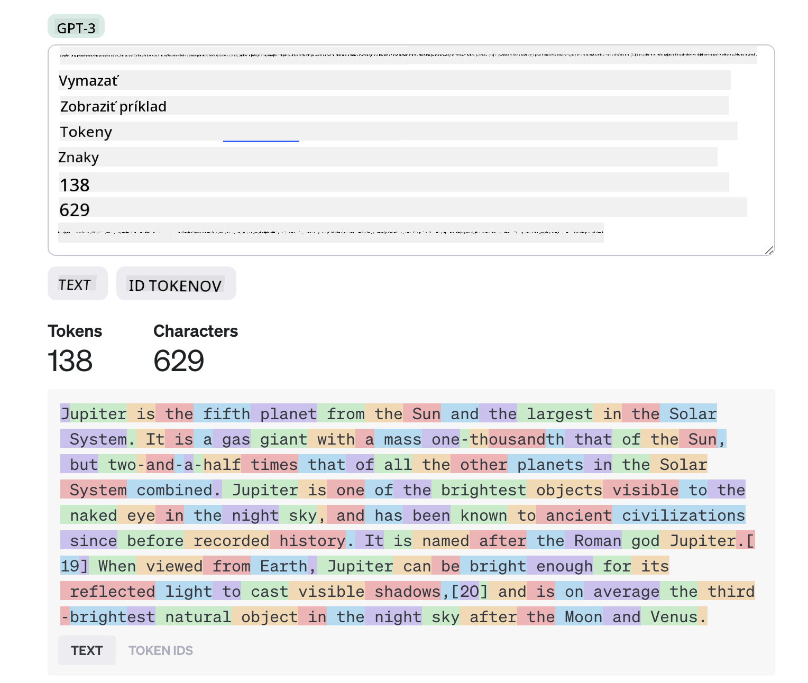
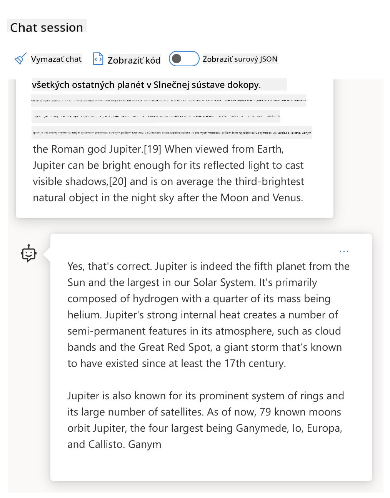
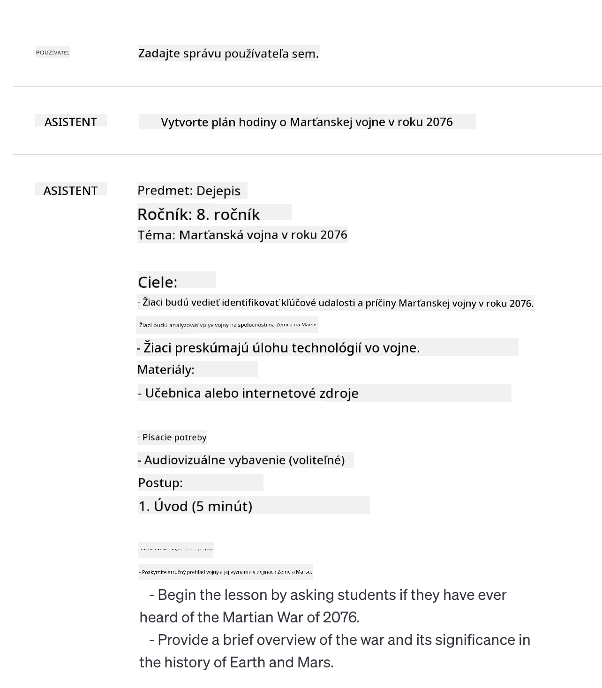
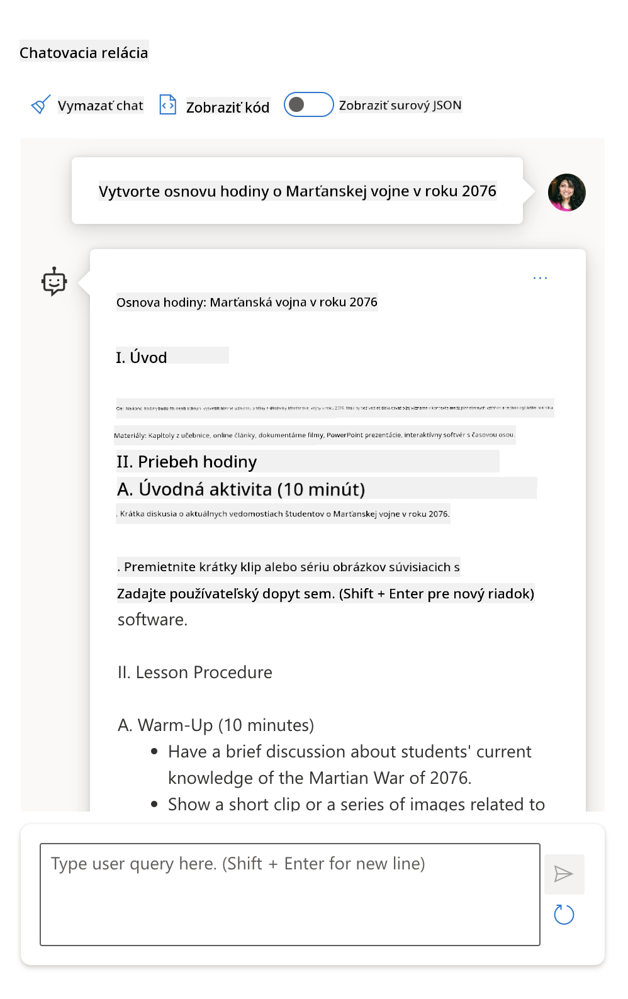

<!--
CO_OP_TRANSLATOR_METADATA:
{
  "original_hash": "a45c318dc6ebc2604f35b8b829f93af2",
  "translation_date": "2025-07-09T10:58:54+00:00",
  "source_file": "04-prompt-engineering-fundamentals/README.md",
  "language_code": "sk"
}
-->
# Základy návrhu promptov

[](https://aka.ms/gen-ai-lesson4-gh?WT.mc_id=academic-105485-koreyst)

## Úvod  
Tento modul pokrýva základné koncepty a techniky na tvorbu efektívnych promptov v generatívnych AI modeloch. Spôsob, akým napíšete prompt pre LLM, tiež zohráva dôležitú úlohu. Starostlivo vytvorený prompt môže priniesÅ¥ lepÅ¡iu kvalitu odpovede. Ale Äo presne znamenajú pojmy ako _prompt_ a _prompt engineering_? A ako zlepÅ¡iÅ¥ prompt _vstup_, ktorý posielam LLM? Na tieto otázky sa pokúsime odpovedaÅ¥ v tejto kapitole a nasledujúcej.

_Generatívna AI_ je schopná vytváraÅ¥ nový obsah (napr. text, obrázky, zvuk, kód a pod.) na základe požiadaviek používateľa. Dosahuje to pomocou _Large Language Models_ ako séria GPT od OpenAI (â€Generative Pre-trained Transformer“), ktoré sú trénované na prácu s prirodzeným jazykom a kódom.

Používatelia môžu teraz s týmito modelmi komunikovaÅ¥ pomocou známych formátov, ako je chat, bez potreby technických znalostí alebo Å¡kolení. Modely sú _prompt-based_ – používatelia posielajú textový vstup (prompt) a dostávajú späť odpoveÄ AI (completion). Môžu potom s AI â€chatovať“ iteratívne, v niekoľkých kolách, a upravovaÅ¥ prompt, kým odpoveÄ nebude vyhovovaÅ¥ ich oÄakávaniam.

â€Prompty“ sa tak stávajú hlavným _programovacím rozhraním_ pre generatívne AI aplikácie, ktoré modelom hovoria, Äo majú robiÅ¥, a ovplyvňujú kvalitu vrátených odpovedí. â€Prompt Engineering“ je rýchlo rastúca oblasÅ¥, ktorá sa zameriava na _návrh a optimalizáciu_ promptov, aby sa dosahovali konzistentné a kvalitné odpovede vo veľkom meradle.

## Ciele uÄenia

V tejto lekcii sa nauÄíme, Äo je Prompt Engineering, preÄo je dôležitý a ako môžeme vytváraÅ¥ efektívnejÅ¡ie prompty pre daný model a cieľ aplikácie. Pochopíme základné koncepty a osvedÄené postupy v návrhu promptov – a zoznámime sa s interaktívnym prostredím Jupyter Notebooku, kde si tieto koncepty môžeme vyskúšaÅ¥ na reálnych príkladoch.

Na konci lekcie budeme vedieť:

1. VysvetliÅ¥, Äo je prompt engineering a preÄo je dôležitý.  
2. Opísať zložky promptu a ich použitie.  
3. NauÄiÅ¥ sa osvedÄené postupy a techniky prompt engineeringu.  
4. AplikovaÅ¥ nauÄené techniky na reálne príklady pomocou OpenAI endpointu.

## KľúÄové pojmy

Prompt Engineering: Prax navrhovania a dolaÄovania vstupov, ktoré vedú AI modely k produkcii požadovaných výstupov.  
Tokenizácia: Proces rozdelenia textu na menšie jednotky, nazývané tokeny, ktoré model dokáže spracovať a pochopiť.  
Instruction-Tuned LLMs: Veľké jazykové modely (LLM), ktoré boli doladené pomocou špecifických inštrukcií na zlepšenie presnosti a relevantnosti odpovedí.

## UÄebné prostredie (Learning Sandbox)

Prompt engineering je zatiaľ skôr umením než vedou. Najlepší spôsob, ako si zlepÅ¡iÅ¥ intuíciu, je _viac cviÄiÅ¥_ a prijaÅ¥ prístup pokus-omyl, ktorý kombinuje odborné znalosti v danej oblasti s odporúÄanými technikami a optimalizáciami Å¡pecifickými pre model.

Jupyter Notebook, ktorý je súÄasÅ¥ou tejto lekcie, poskytuje _sandbox_ prostredie, kde si môžete vyskúšaÅ¥, Äo sa nauÄíte – priebežne alebo ako súÄasÅ¥ závereÄnej úlohy. Na spustenie cviÄení budete potrebovaÅ¥:

1. **Azure OpenAI API kľúÄ** – endpoint služby pre nasadený LLM.  
2. **Python Runtime** – prostredie, v ktorom sa Notebook spustí.  
3. **Lokálne premenné prostredia** – _teraz dokonÄite kroky v [SETUP](./../00-course-setup/SETUP.md?WT.mc_id=academic-105485-koreyst), aby ste boli pripravení_.

Notebook obsahuje _Å¡tartovacie_ cviÄenia – ale odporúÄame pridaÅ¥ si vlastné sekcie _Markdown_ (popis) a _Code_ (požiadavky promptov), aby ste mohli skúšaÅ¥ viac príkladov alebo nápadov a budovaÅ¥ si intuíciu pre návrh promptov.

## Ilustrovaný sprievodca

Chcete získaÅ¥ prehľad o tom, Äo táto lekcia pokrýva, eÅ¡te predtým, než sa do nej pustíte? Pozrite si tento ilustrovaný sprievodca, ktorý vám poskytne predstavu o hlavných témach a kľúÄových bodoch, nad ktorými sa môžete zamyslieÅ¥. Plán lekcie vás prevedie od pochopenia základných konceptov a výziev až po ich rieÅ¡enie pomocou relevantných techník prompt engineeringu a osvedÄených postupov. Upozorňujeme, že sekcia â€PokroÄilé techniky“ v tomto sprievodcovi sa týka obsahu, ktorý je pokrytý v _nasledujúcej_ kapitole tohto kurzu.


## Naša startupová misia

Teraz si povedzme, ako sa _táto téma_ vzÅ¥ahuje na naÅ¡u misiu startupu, ktorou je [priniesÅ¥ AI inovácie do vzdelávania](https://educationblog.microsoft.com/2023/06/collaborating-to-bring-ai-innovation-to-education?WT.mc_id=academic-105485-koreyst). Chceme vytváraÅ¥ AI aplikácie pre _personalizované uÄenie_ – tak si predstavme, ako by rôzni používatelia naÅ¡ej aplikácie mohli â€navrhovať“ prompty:

- **Administrátori** môžu požiadaÅ¥ AI o _analýzu dát uÄebných osnov na identifikáciu medzier v pokrytí_. AI môže zhrnúť výsledky alebo ich vizualizovaÅ¥ pomocou kódu.  
- **UÄitelia** môžu požiadaÅ¥ AI o _vytvorenie plánu hodiny pre cieľovú skupinu a tému_. AI môže zostaviÅ¥ personalizovaný plán v požadovanom formáte.  
- **Å tudenti** môžu požiadaÅ¥ AI o _douÄovanie v nároÄnom predmete_. AI ich môže viesÅ¥ lekciami, nápovedami a príkladmi prispôsobenými ich úrovni.

To je len Å¡piÄka ľadovca. Pozrite si [Prompts For Education](https://github.com/microsoft/prompts-for-edu/tree/main?WT.mc_id=academic-105485-koreyst) – open-source knižnicu promptov zostavenú odborníkmi na vzdelávanie – aby ste získali Å¡irší prehľad o možnostiach! _Vyskúšajte niektoré z týchto promptov v sandboxe alebo v OpenAI Playground a uvidíte, Äo sa stane!_

<!--  
LESSON TEMPLATE:  
This unit should cover core concept #1.  
Reinforce the concept with examples and references.

CONCEPT #1:  
Prompt Engineering.  
Define it and explain why it is needed.  
-->

## ÄŒo je Prompt Engineering?

Lekciu sme zaÄali definíciou **Prompt Engineering** ako procesu _navrhovania a optimalizácie_ textových vstupov (promptov), ktoré prinášajú konzistentné a kvalitné odpovede (completions) pre daný cieľ aplikácie a model. Môžeme to vnímaÅ¥ ako dvojstupňový proces:

- _navrhnúť_ poÄiatoÄný prompt pre daný model a cieľ  
- _iteratívne dolaÄovaÅ¥_ prompt, aby sa zlepÅ¡ila kvalita odpovede

Toto je nevyhnutne proces pokus-omyl, ktorý vyžaduje používateľskú intuíciu a úsilie na dosiahnutie optimálnych výsledkov. PreÄo je to teda dôležité? Na odpoveÄ musíme najprv pochopiÅ¥ tri koncepty:

- _Tokenizácia_ = ako model â€vidí“ prompt  
- _Základné LLM_ = ako základný model â€spracováva“ prompt  
- _Instruction-Tuned LLM_ = ako model teraz dokáže rozpoznaÅ¥ â€Ãºlohy“

### Tokenizácia

LLM vníma prompty ako _sekvenciu tokenov_, priÄom rôzne modely (alebo verzie modelu) môžu ten istý prompt tokenizovaÅ¥ rôzne. KeÄže LLM sú trénované na tokenoch (a nie na surovom texte), spôsob tokenizácie promptu priamo ovplyvňuje kvalitu generovanej odpovede.

Aby ste získali predstavu, ako tokenizácia funguje, vyskúšajte nástroje ako [OpenAI Tokenizer](https://platform.openai.com/tokenizer?WT.mc_id=academic-105485-koreyst) uvedený nižšie. Skopírujte svoj prompt a pozrite sa, ako sa rozdelí na tokeny, venujte pozornosť tomu, ako sa spracovávajú medzery a interpunkcia. Upozorňujeme, že tento príklad ukazuje starší LLM (GPT-3) – pri novšom modeli môže byť výsledok odlišný.



### Koncept: Základné modely (Foundation Models)

KeÄ je prompt tokenizovaný, hlavnou funkciou ["Base LLM"](https://blog.gopenai.com/an-introduction-to-base-and-instruction-tuned-large-language-models-8de102c785a6?WT.mc_id=academic-105485-koreyst) (alebo základného modelu) je predpovedaÅ¥ Äalší token v sekvencii. KeÄže LLM sú trénované na obrovských textových dátach, majú dobrý prehľad o Å¡tatistických vzÅ¥ahoch medzi tokenmi a dokážu túto predpoveÄ urobiÅ¥ s istou istotou. Treba vÅ¡ak poznamenaÅ¥, že nerozumejú _významu_ slov v prompte alebo tokene; vidia len vzor, ktorý môžu â€dokonÄiť“ ÄalÅ¡ou predpoveÄou. Môžu pokraÄovaÅ¥ v predpovedaní sekvencie, kým ich nezastaví používateľ alebo nejaká prednastavená podmienka.

Chcete vidieÅ¥, ako funguje dokonÄovanie na základe promptu? Zadajte vyÅ¡Å¡ie uvedený prompt do Azure OpenAI Studio [_Chat Playground_](https://oai.azure.com/playground?WT.mc_id=academic-105485-koreyst) s predvolenými nastaveniami. Systém je nastavený tak, aby považoval prompty za požiadavky na informácie – takže by ste mali vidieÅ¥ odpoveÄ, ktorá zodpovedá tomuto kontextu.

Ale Äo ak používateľ chce vidieÅ¥ nieÄo konkrétne, Äo spĺňa nejaké kritériá alebo cieľ úlohy? Tu prichádzajú do hry _instruction-tuned_ LLM.



### Koncept: Instruction Tuned LLM

[Instruction Tuned LLM](https://blog.gopenai.com/an-introduction-to-base-and-instruction-tuned-large-language-models-8de102c785a6?WT.mc_id=academic-105485-koreyst) vychádza zo základného modelu a doladí ho pomocou príkladov alebo vstupno-výstupných párov (napr. viackolových â€správ“), ktoré obsahujú jasné inÅ¡trukcie – a odpoveÄ AI sa snaží tieto inÅ¡trukcie dodržaÅ¥.

Používa techniky ako Reinforcement Learning with Human Feedback (RLHF), ktoré model nauÄia _dodržiavaÅ¥ inÅ¡trukcie_ a _uÄiÅ¥ sa z spätnej väzby_, aby produkoval odpovede lepÅ¡ie prispôsobené praktickým aplikáciám a relevantnejÅ¡ie pre používateľské ciele.

Vyskúšajme to – vráťte sa k vyššie uvedenému promptu, ale teraz zmeňte _systémovú správu_ tak, aby obsahovala nasledujúcu inštrukciu ako kontext:

> _Zhrň obsah, ktorý dostaneÅ¡, pre žiaka druhého roÄníka. Výsledok udrž na jeden odsek s 3-5 odrážkami._

Vidíte, ako je výsledok teraz prispôsobený požadovanému cieľu a formátu? UÄiteľ môže túto odpoveÄ priamo použiÅ¥ vo svojich prezentáciách pre danú triedu.


## PreÄo potrebujeme Prompt Engineering?

KeÄ už vieme, ako LLM spracovávajú prompty, poÄme sa pozrieÅ¥ na to, _preÄo_ potrebujeme prompt engineering. OdpoveÄ spoÄíva v tom, že súÄasné LLM predstavujú niekoľko výziev, ktoré sÅ¥ažujú dosiahnutie _spoľahlivých a konzistentných odpovedí_ bez vynaloženia úsilia na tvorbu a optimalizáciu promptov. Napríklad:

1. **Odpovede modelu sú náhodné.** _Ten istý prompt_ pravdepodobne vygeneruje rôzne odpovede pri rôznych modeloch alebo verziách modelu. A môže dokonca priniesÅ¥ rôzne výsledky pri _tom istom modeli_ v rôznych Äasoch. _Techniky prompt engineeringu nám pomáhajú minimalizovaÅ¥ tieto odchýlky lepšími pravidlami_.

2. **Modely môžu vymýšľaÅ¥ odpovede.** Modely sú predtrénované na _veľkých, ale koneÄných_ dátach, Äo znamená, že nemajú vedomosti o konceptoch mimo rozsah tréningu. Výsledkom môžu byÅ¥ odpovede, ktoré sú nepresné, vymyslené alebo priamo protireÄia známym faktom. _Techniky prompt engineeringu pomáhajú používateľom identifikovaÅ¥ a zmierniÅ¥ takéto vymýšľanie napr. žiadosÅ¥ou o citácie alebo zdôvodnenie_.

3. **Schopnosti modelov sa líšia.** NovÅ¡ie modely alebo generácie modelov majú bohatÅ¡ie schopnosti, ale prinášajú aj Å¡pecifické zvláštnosti a kompromisy v nákladoch a zložitosti. _Prompt engineering nám pomáha vyvíjaÅ¥ osvedÄené postupy a pracovné postupy, ktoré abstrahujú tieto rozdiely a prispôsobujú sa Å¡pecifickým požiadavkám modelu Å¡kálovateľným a plynulým spôsobom_.

Pozrime sa na to v praxi v OpenAI alebo Azure OpenAI Playground:

- Použite ten istý prompt s rôznymi nasadeniami LLM (napr. OpenAI, Azure OpenAI, Hugging Face) – videli ste rozdiely?  
- Použite ten istý prompt opakovane s _tým istým_ nasadením LLM (napr. Azure OpenAI playground) – ako sa tieto odpovede líšili?

### Príklad vymýšľania (Fabrications)

V tomto kurze používame pojem **â€fabrication“** na oznaÄenie javu, keÄ LLM niekedy generujú fakticky nesprávne informácie kvôli obmedzeniam v tréningu alebo iným faktorom. Tento jav ste možno poÄuli aj pod názvom _â€halucinácie“_ v populárnych Älánkoch alebo vedeckých prácach. My vÅ¡ak dôrazne odporúÄame používaÅ¥ termín _â€fabrication“_, aby sme sa vyhli antropomorfizácii správania a nepripisovali stroju ľudské vlastnosti. Tým tiež podporujeme [zásady zodpovednej AI](https://www.microsoft.com/ai/responsible-ai?WT.mc_id=academic-105485-koreyst) z hľadiska terminológie, vyhýbajúc sa výrazom, ktoré môžu byÅ¥ v niektorých kontextoch považované za nevhodné alebo neinkluzívne.

Chcete si urobiť predstavu, ako funguje vymýšľanie? Predstavte si prompt, ktorý inštruuje AI vytvoriť obsah o neexistujúcej téme (aby ste sa uistili, že sa nenachádza v tréningovej množine). Napríklad – vyskúšal som tento prompt:
# Plán lekcie: Marsianská vojna v roku 2076

## Ciele lekcie
- PochopiÅ¥ príÄiny a priebeh Marsianskej vojny v roku 2076
- Analyzovať hlavné udalosti a ich dopad na ľudstvo a Mars
- DiskutovaÅ¥ o technologických a spoloÄenských zmenách vyvolaných vojnou

## Úvod (10 minút)
- Predstavenie témy: Čo bola Marsianská vojna?
- Krátky prehľad historického kontextu pred rokom 2076
- Otázky na zamyslenie: PreÄo by mohlo dôjsÅ¥ k vojne medzi Zemou a Marsom?

## Hlavná ÄasÅ¥ (30 minút)
### PríÄiny vojny
- Politické napätie medzi Zemou a Marsom
- Zdroje a kontrola nad Marsom
- Vývoj technológií a zbrojenia

### Priebeh vojny
- KľúÄové bitky a udalosti
- Použité zbrane a taktiky
- Úloha medziplanetárnych spojenectiev

### Dôsledky vojny
- Dopad na civilné obyvateľstvo a infraštruktúru
- Zmeny v medziplanetárnej politike
- Technologický pokrok a jeho využitie po vojne

## Diskusia a záver (15 minút)
- Otvorená diskusia: Mohla sa vojna vyhnúť? Ako?
- Reflexia: ÄŒo sa môžeme nauÄiÅ¥ z Marsianskej vojny?
- Zhrnutie hlavných bodov lekcie

## Domáca úloha
- Napísať krátku esej o tom, ako by sa mohla vyvíjať budúcnosť Marsu po vojne
- PripraviÅ¥ prezentáciu o jednej z technológií použitých poÄas Marsianskej vojny
Webové vyhľadávanie mi ukázalo, že existujú fiktívne príbehy (napr. televízne seriály alebo knihy) o martianskych vojnách – ale žiadne z roku 2076. Zdravý rozum nám tiež hovorí, že rok 2076 je _v budúcnosti_ a preto nemôže byÅ¥ spojený so skutoÄnou udalosÅ¥ou.

ÄŒo sa teda stane, keÄ spustíme tento prompt u rôznych poskytovateľov LLM?

> **OdpoveÄ 1**: OpenAI Playground (GPT-35)



> **OdpoveÄ 2**: Azure OpenAI Playground (GPT-35)



> **OdpoveÄ 3**: : Hugging Face Chat Playground (LLama-2)


Ako sa dalo oÄakávaÅ¥, každý model (alebo verzia modelu) generuje mierne odliÅ¡né odpovede vÄaka stochastickému správaniu a rozdielom v schopnostiach modelu. Napríklad jeden model cieli na publikum ôsmeho roÄníka, zatiaľ Äo iný predpokladá Å¡tudenta strednej Å¡koly. No vÅ¡etky tri modely vytvorili odpovede, ktoré by mohli presvedÄiÅ¥ neinformovaného používateľa, že udalosÅ¥ bola skutoÄná.

Techniky prompt engineeringu ako _metaprompting_ a _nastavenie teploty_ môžu do urÄitej miery znížiÅ¥ tvorbu nepravdivých informácií modelom. Nové _architektúry_ prompt engineeringu tiež bezproblémovo integrujú nové nástroje a techniky do toku promptu, aby zmiernili alebo znížili niektoré z týchto efektov.

## Prípadová štúdia: GitHub Copilot

Záverom tejto sekcie si ukážeme, ako sa prompt engineering používa v reálnych riešeniach na príklade jednej prípadovej štúdie: [GitHub Copilot](https://github.com/features/copilot?WT.mc_id=academic-105485-koreyst).

GitHub Copilot je váš â€AI parťák programátor“ – prevádza textové prompty na dokonÄenia kódu a je integrovaný do vášho vývojového prostredia (napr. Visual Studio Code) pre plynulý používateľský zážitok. Ako je zdokumentované v sérii blogov nižšie, najskorÅ¡ia verzia bola založená na modeli OpenAI Codex – priÄom inžinieri rýchlo pochopili potrebu doladiÅ¥ model a vyvinúť lepÅ¡ie techniky prompt engineeringu na zlepÅ¡enie kvality kódu. V júli predstavili [vylepÅ¡ený AI model, ktorý presahuje Codex](https://github.blog/2023-07-28-smarter-more-efficient-coding-github-copilot-goes-beyond-codex-with-improved-ai-model/?WT.mc_id=academic-105485-koreyst) pre eÅ¡te rýchlejÅ¡ie návrhy.

PreÄítajte si príspevky v poradí, aby ste sledovali ich uÄebnú cestu.

- **Máj 2023** | [GitHub Copilot sa zlepšuje v porozumení vášho kódu](https://github.blog/2023-05-17-how-github-copilot-is-getting-better-at-understanding-your-code/?WT.mc_id=academic-105485-koreyst)
- **Máj 2023** | [Inside GitHub: Práca s LLM za GitHub Copilot](https://github.blog/2023-05-17-inside-github-working-with-the-llms-behind-github-copilot/?WT.mc_id=academic-105485-koreyst)
- **Jún 2023** | [Ako písať lepšie prompty pre GitHub Copilot](https://github.blog/2023-06-20-how-to-write-better-prompts-for-github-copilot/?WT.mc_id=academic-105485-koreyst)
- **Júl 2023** | [GitHub Copilot presahuje Codex s vylepšeným AI modelom](https://github.blog/2023-07-28-smarter-more-efficient-coding-github-copilot-goes-beyond-codex-with-improved-ai-model/?WT.mc_id=academic-105485-koreyst)
- **Júl 2023** | [Sprievodca vývojára prompt engineeringom a LLM](https://github.blog/2023-07-17-prompt-engineering-guide-generative-ai-llms/?WT.mc_id=academic-105485-koreyst)
- **Sep 2023** | [Ako vytvoriť podnikateľskú LLM aplikáciu: Lekcie z GitHub Copilot](https://github.blog/2023-09-06-how-to-build-an-enterprise-llm-application-lessons-from-github-copilot/?WT.mc_id=academic-105485-koreyst)

Môžete tiež prezeraÅ¥ ich [inžiniersky blog](https://github.blog/category/engineering/?WT.mc_id=academic-105485-koreyst) pre ÄalÅ¡ie príspevky ako [tento](https://github.blog/2023-09-27-how-i-used-github-copilot-chat-to-build-a-reactjs-gallery-prototype/?WT.mc_id=academic-105485-koreyst), ktorý ukazuje, ako sa tieto modely a techniky _aplikujú_ na tvorbu reálnych aplikácií.

---

<!--
LESSON TEMPLATE:
Táto jednotka by mala pokryť základný koncept #2.
Posilniť koncept príkladmi a odkazmi.

KONCEPT #2:
Návrh promptu.
Ilustrované príkladmi.
-->

## Konštrukcia promptu

Videli sme, preÄo je prompt engineering dôležitý – teraz si vysvetlíme, ako sa prompty _konÅ¡truujú_, aby sme mohli vyhodnotiÅ¥ rôzne techniky pre efektívnejší návrh promptov.

### Základný prompt

ZaÄnime so základným promptom: textovým vstupom zaslaným modelu bez ÄalÅ¡ieho kontextu. Tu je príklad – keÄ poÅ¡leme prvé slová americkej národnej hymny do OpenAI [Completion API](https://platform.openai.com/docs/api-reference/completions?WT.mc_id=academic-105485-koreyst), model okamžite _dokonÄí_ odpoveÄ Äalšími riadkami, Äo ilustruje základné predikÄné správanie.

| Prompt (vstup)     | DokonÄenie (výstup)                                                                                                                        |
| :----------------- | :----------------------------------------------------------------------------------------------------------------------------------------- |
| Oh say can you see | Zdá sa, že zaÄínate text piesne â€The Star-Spangled Banner“, národnej hymny Spojených Å¡tátov. Celý text je ... |

### Zložitý prompt

Teraz pridajme ku základnému promptu kontext a inštrukcie. [Chat Completion API](https://learn.microsoft.com/azure/ai-services/openai/how-to/chatgpt?WT.mc_id=academic-105485-koreyst) nám umožňuje vytvoriť zložitý prompt ako kolekciu _správ_ s:

- pármi vstup/výstup odrážajúcimi vstup používateľa a odpoveÄ asistenta.
- systémovou správou, ktorá nastavuje kontext správania alebo osobnosti asistenta.

ŽiadosÅ¥ má teraz nasledujúcu formu, kde _tokenizácia_ efektívne zachytáva relevantné informácie z kontextu a konverzácie. Zmena systémového kontextu môže maÅ¥ rovnaký vplyv na kvalitu dokonÄení ako samotné vstupy používateľa.

```python
response = openai.chat.completions.create(
    model="gpt-3.5-turbo",
    messages=[
        {"role": "system", "content": "You are a helpful assistant."},
        {"role": "user", "content": "Who won the world series in 2020?"},
        {"role": "assistant", "content": "The Los Angeles Dodgers won the World Series in 2020."},
        {"role": "user", "content": "Where was it played?"}
    ]
)
```

### InÅ¡trukÄný prompt

V predchádzajúcich príkladoch bol prompt jednoduchý textový dopyt, ktorý sa dal interpretovaÅ¥ ako žiadosÅ¥ o informácie. Pri _inÅ¡trukÄných_ promptoch môžeme použiÅ¥ text na podrobnejÅ¡ie Å¡pecifikovanie úlohy a poskytnúť AI lepÅ¡ie usmernenie. Tu je príklad:

| Prompt (vstup)                                                                                                                                                                                                                         | DokonÄenie (výstup)                                                                                                        | Typ inÅ¡trukcie     |
| :------------------------------------------------------------------------------------------------------------------------------------------------------------------------------------------------------------------------------------- | :------------------------------------------------------------------------------------------------------------------------- | :----------------- |
| Napíš popis ObÄianskej vojny                                                                                                                                                                                                           | _vrátil jednoduchý odsek_                                                                                                  | Jednoduchý         |
| Napíš popis ObÄianskej vojny. UveÄ kľúÄové dátumy a udalosti a popíš ich význam                                                                                                                                                         | _vrátil odsek nasledovaný zoznamom kľúÄových dátumov udalostí s popismi_                                                    | Zložitý            |
| Napíš popis ObÄianskej vojny v 1 odseku. UveÄ 3 odrážky s kľúÄovými dátumami a ich významom. UveÄ ÄalÅ¡ie 3 odrážky s významnými historickými osobnosÅ¥ami a ich prínosmi. Výstup vráť vo formáte JSON | _vracia podrobnejÅ¡ie informácie v textovom poli, formátované ako JSON, ktoré môžete skopírovaÅ¥ do súboru a podľa potreby overiÅ¥_ | Zložitý. Formátovaný.|

## Primárny obsah

V predchádzajúcich príkladoch bol prompt stále pomerne otvorený, Äo umožňovalo LLM rozhodnúť, ktorá ÄasÅ¥ jeho predtrénovaných dát je relevantná. Pri návrhovom vzore _primárny obsah_ je vstupný text rozdelený na dve Äasti:

- inštrukcia (akcia)
- relevantný obsah (ktorý ovplyvňuje akciu)

Tu je príklad, kde inÅ¡trukcia znie â€zhrň toto do 2 viet“.

| Prompt (vstup)                                                                                                                                                                                                                                                                                                                                                                                                                                                                                                                                                                                                                                                                                      | DokonÄenie (výstup)                                                                                                                                                                                                                                                                             |
| :-------------------------------------------------------------------------------------------------------------------------------------------------------------------------------------------------------------------------------------------------------------------------------------------------------------------------------------------------------------------------------------------------------------------------------------------------------------------------------------------------------------------------------------------------------------------------------------------------------------------------------------------------------------------------------------------------- | :---------------------------------------------------------------------------------------------------------------------------------------------------------------------------------------------------------------------------------------------------------------------------------------------- |
| Jupiter je piata planéta od Slnka a najväÄÅ¡ia v SlneÄnej sústave. Je to plynný obor s hmotnosÅ¥ou tisícinu hmotnosti Slnka, no dvojnásobne väÄÅ¡ou ako vÅ¡etky ostatné planéty SlneÄnej sústavy dokopy. Jupiter je jedným z najsvetlejších objektov viditeľných voľným okom na noÄnej oblohe a je známy starovekým civilizáciám eÅ¡te pred zaznamenanou históriou. Je pomenovaný po rímskom bohu Jupiterovi.[19] KeÄ sa naň pozeráme zo Zeme, môže byÅ¥ dostatoÄne jasný na to, aby jeho odrazené svetlo vrhalo viditeľné tiene,[20] a je v priemere tretím najsvetlejším prírodným objektom na noÄnej oblohe po Mesiaci a VenuÅ¡i. <br/> **Zhrň toto do 2 krátkych viet** | Jupiter, piata planéta od Slnka, je najväÄÅ¡ia v SlneÄnej sústave a je známa ako jeden z najsvetlejších objektov na noÄnej oblohe. Pomenovaná po rímskom bohu Jupiterovi, je to plynný obor s hmotnosÅ¥ou dvojnásobnou ako vÅ¡etky ostatné planéty SlneÄnej sústavy dokopy. |

Segment primárneho obsahu možno využiť rôznymi spôsobmi na efektívnejšie inštrukcie:

- **Príklady** – namiesto explicitného povedania modelu, Äo má robiÅ¥, mu dajte príklady a nechajte ho odvodiÅ¥ vzor.
- **Náznaky** – nasledujte inÅ¡trukciu â€náznakom“, ktorý pripraví dokonÄenie a nasmeruje model k relevantnejším odpovediam.
- **Å ablóny** – opakovateľné â€recepty“ na prompty s zástupnými znakmi (premennými), ktoré možno prispôsobiÅ¥ dátami pre konkrétne prípady použitia.

PoÄme si ich ukázaÅ¥ v praxi.

### Použitie príkladov

Toto je prístup, kde použijete primárny obsah na â€nakÅ•menie modelu“ príkladmi požadovaného výstupu pre danú inÅ¡trukciu a necháte ho odvodiÅ¥ vzor požadovaného výstupu. Podľa poÄtu poskytnutých príkladov môžeme maÅ¥ zero-shot prompting, one-shot prompting, few-shot prompting a pod.

Prompt teraz pozostáva z troch Äastí:

- Popis úlohy
- Niekoľko príkladov požadovaného výstupu
- ZaÄiatok nového príkladu (ktorý sa stáva implicitným popisom úlohy)

| Typ uÄenia   | Prompt (vstup)                                                                                                                                        | DokonÄenie (výstup)         |
| :----------- | :---------------------------------------------------------------------------------------------------------------------------------------------------- | :-------------------------- |
| Zero-shot    | â€The Sun is Shining“. Prelož do Å¡panielÄiny                                                                                                         | â€El Sol está brillando“.    |
| One-shot     | â€The Sun is Shining“ => â€El Sol está brillando“. <br> â€It's a Cold and Windy Day“ =>                                                                 | â€Es un día frío y ventoso“. |
| Few-shot     | The player ran the bases => Baseball <br/> The player hit an ace => Tennis <br/> The player hit a six => Cricket <br/> The player made a slam-dunk => | Basketball                  |
|              |                                                                                                                                                       |                             |

VÅ¡imnite si, že pri zero-shot prompting sme museli explicitne uviesÅ¥ inÅ¡trukciu (â€Prelož do Å¡panielÄiny“), ale v one-shot príklade sa už inÅ¡trukcia odvádza. Few-shot príklad ukazuje, ako pridanie viacerých príkladov umožňuje modelom robiÅ¥ presnejÅ¡ie závery bez Äalších inÅ¡trukcií.

### Náznaky promptu

ÄalÅ¡ou technikou využitia primárneho obsahu je poskytnúť _náznaky_ namiesto príkladov. V tomto prípade modelu â€naznaÄujeme“ správnym zaÄiatkom, ktorý odráža požadovaný formát odpovede. Model potom â€berie náznak“ a pokraÄuje v rovnakom Å¡týle.

| PoÄet náznakov | Prompt (vstup)                                                                                                                                                                                                                                                                                                                                                                                                                                               | DokonÄenie (výstup)                                                                                                                                                                                                                                                                                       |
| :------------- | :----------------------------------------------------------------------------------------------------------------------------------------------------------------------------------------------------------------------------------------------------------------------------------------------------------------------------------------------------------------------------------------------------------------------------------------------------------- | :-------------------------------------------------------------------------------------------------------------------------------------------------------------------------------------------------------------------------------------------------------------------------------------------------------- |
| 0              | Jupiter je piata planéta od Slnka a najväÄÅ¡ia v SlneÄnej sústave. Je to plynný obor s hmotnosÅ¥ou tisícinu hmotnosti Slnka, no dvojnásobne väÄÅ¡ou ako vÅ¡etky ostatné planéty SlneÄnej sústavy dokopy. Jupiter je jedným z najsvetlejších objektov viditeľných voľným okom na noÄnej oblohe, a je známy starovekým civilizáciám eÅ¡te pred zaznamenanou históriou.

**Zhrňte toto**                                       | Jupiter je najväÄÅ¡ia planéta v naÅ¡ej slneÄnej sústave a piata od Slnka. Je to plynný obor s hmotnosÅ¥ou 1/1000 hmotnosti Slnka, no je Å¥ažší ako vÅ¡etky ostatné planéty dokopy. Staroveké civilizácie poznali Jupiter už dávno a je ľahko viditeľný na noÄnej oblohe. |
| 1              | Jupiter je piata planéta od Slnka a najväÄÅ¡ia v slneÄnej sústave. Je to plynný obor s hmotnosÅ¥ou jednej tisíciny hmotnosti Slnka, no váži dvakrát a pol viac ako vÅ¡etky ostatné planéty v slneÄnej sústave dokopy. Jupiter je jedným z najsvetlejších objektov viditeľných voľným okom na noÄnej oblohe a bol známy starovekým civilizáciám už pred zaznamenanou históriou. <br/>**Zhrňte toto** <br/> ÄŒo sme sa nauÄili je, že Jupiter | je piata planéta od Slnka a najväÄÅ¡ia v slneÄnej sústave. Je to plynný obor s hmotnosÅ¥ou jednej tisíciny hmotnosti Slnka, no váži dvakrát a pol viac ako vÅ¡etky ostatné planéty dokopy. Je ľahko viditeľný voľným okom a je známy od staroveku.                        |
| 2              | Jupiter je piata planéta od Slnka a najväÄÅ¡ia v slneÄnej sústave. Je to plynný obor s hmotnosÅ¥ou jednej tisíciny hmotnosti Slnka, no váži dvakrát a pol viac ako vÅ¡etky ostatné planéty v slneÄnej sústave dokopy. Jupiter je jedným z najsvetlejších objektov viditeľných voľným okom na noÄnej oblohe a bol známy starovekým civilizáciám už pred zaznamenanou históriou. <br/>**Zhrňte toto** <br/> Top 3 fakty, ktoré sme sa nauÄili:         | 1. Jupiter je piata planéta od Slnka a najväÄÅ¡ia v slneÄnej sústave. <br/> 2. Je to plynný obor s hmotnosÅ¥ou jednej tisíciny hmotnosti Slnka...<br/> 3. Jupiter je viditeľný voľným okom už od staroveku ...                                                                       |
|                |                                                                                                                                                                                                                                                                                                                                                                                                                                                              |                                                                                                                                                                                                                                                                                                           |

### Šablóny promptov

Å ablóna promptu je _preddefinovaný recept na prompt_, ktorý možno uložiÅ¥ a podľa potreby opakovane použiÅ¥, aby sa zabezpeÄila konzistentnejÅ¡ia používateľská skúsenosÅ¥ vo veľkom meradle. V najjednoduchÅ¡ej podobe je to zbierka príkladov promptov ako [tento od OpenAI](https://platform.openai.com/examples?WT.mc_id=academic-105485-koreyst), ktorý poskytuje interaktívne komponenty promptu (správy používateľa a systému) a formát požiadavky riadený API – na podporu opätovného použitia.

V zložitejÅ¡ej podobe, ako napríklad [tento príklad od LangChain](https://python.langchain.com/docs/concepts/prompt_templates/?WT.mc_id=academic-105485-koreyst), obsahuje _zástupné symboly_, ktoré možno nahradiÅ¥ údajmi z rôznych zdrojov (vstup používateľa, kontext systému, externé zdroje dát atÄ.) na dynamické generovanie promptu. To nám umožňuje vytvoriÅ¥ knižnicu opakovane použiteľných promptov, ktoré možno **programovo** použiÅ¥ na zabezpeÄenie konzistentnej používateľskej skúsenosti vo veľkom meradle.

SkutoÄná hodnota Å¡ablón spoÄíva v možnosti vytváraÅ¥ a publikovaÅ¥ _knižnice promptov_ pre vertikálne aplikaÄné oblasti – kde je Å¡ablóna promptu _optimalizovaná_ tak, aby odrážala kontext alebo príklady Å¡pecifické pre danú aplikáciu, Äím sa odpovede stávajú relevantnejšími a presnejšími pre cieľové publikum. Repozitár [Prompts For Edu](https://github.com/microsoft/prompts-for-edu?WT.mc_id=academic-105485-koreyst) je skvelým príkladom tohto prístupu, ktorý zhromažÄuje knižnicu promptov pre vzdelávaciu oblasÅ¥ so zameraním na kľúÄové ciele ako plánovanie lekcií, návrh uÄebných osnov, douÄovanie Å¡tudentov a pod.

## Podporný obsah

Ak uvažujeme o konÅ¡trukcii promptu ako o inÅ¡trukcii (úlohe) a cieli (primárnom obsahu), potom _sekundárny obsah_ je ako dodatoÄný kontext, ktorý poskytujeme na **ovplyvnenie výstupu urÄitým spôsobom**. Môžu to byÅ¥ ladacie parametre, inÅ¡trukcie na formátovanie, taxonómie tém a podobne, ktoré pomáhajú modelu _prispôsobiÅ¥_ odpoveÄ tak, aby vyhovovala požadovaným cieľom alebo oÄakávaniam používateľa.

Napríklad: Ak máme katalóg kurzov s rozsiahlymi metadátami (názov, popis, úroveň, znaÄky metadát, lektor atÄ.) o vÅ¡etkých dostupných kurzoch v uÄebnom pláne:

- môžeme definovaÅ¥ inÅ¡trukciu â€zhrnúť katalóg kurzov na jeseň 2023“
- môžeme použiť primárny obsah na poskytnutie niekoľkých príkladov požadovaného výstupu
- môžeme použiÅ¥ sekundárny obsah na identifikáciu top 5 â€znaÄiek“ záujmu.

Model potom môže poskytnúť zhrnutie vo formáte podľa uvedených príkladov – ale ak má výsledok viacero znaÄiek, môže uprednostniÅ¥ 5 znaÄiek identifikovaných v sekundárnom obsahu.

---

<!--
ŠABLÓNA LEKCIE:
Táto jednotka by mala pokryÅ¥ základný koncept Ä. 1.
Posilniť koncept príkladmi a odkazmi.

KONCEPT Č. 3:
Techniky prompt engineeringu.
Aké sú základné techniky prompt engineeringu?
Ilustrujte to niekoľkými cviÄeniami.
-->

## Najlepšie postupy pri promptovaní

KeÄ už vieme, ako možno prompt _konÅ¡truovaÅ¥_, môžeme zaÄaÅ¥ premýšľaÅ¥ o tom, ako ich _navrhnúť_ tak, aby odrážali najlepÅ¡ie postupy. Môžeme to rozdeliÅ¥ na dve Äasti – maÅ¥ správny _postoj_ a aplikovaÅ¥ správne _techniky_.

### Postoj k prompt engineeringu

Prompt engineering je proces pokusov a omylov, preto majte na pamäti tri základné usmerňujúce faktory:

1. **Dôležité je porozumenie domény.** PresnosÅ¥ a relevantnosÅ¥ odpovede závisí od _domény_, v ktorej aplikácia alebo používateľ pôsobí. Použite svoju intuíciu a odborné znalosti v danej oblasti na ÄalÅ¡ie **prispôsobenie techník**. Napríklad definujte _osobnosti Å¡pecifické pre doménu_ v systémových promptoch alebo používajte _Å¡ablóny Å¡pecifické pre doménu_ v používateľských promptoch. Poskytnite sekundárny obsah, ktorý odráža kontext Å¡pecifický pre doménu, alebo použite _doménové signály a príklady_ na nasmerovanie modelu k známym vzorom použitia.

2. **Dôležité je porozumenie modelu.** Vieme, že modely sú z podstaty stochastické. Implementácie modelov sa však môžu líšiť podľa použitého tréningového datasetu (predtrénované znalosti), schopností, ktoré poskytujú (napr. cez API alebo SDK) a typu obsahu, na ktorý sú optimalizované (napr. kód vs. obrázky vs. text). Pochopte silné a slabé stránky modelu, ktorý používate, a využite tieto poznatky na _prioritizáciu úloh_ alebo vytváranie _prispôsobených šablón_ optimalizovaných pre schopnosti modelu.

3. **Dôležitá je iterácia a validácia.** Modely sa rýchlo vyvíjajú, rovnako ako techniky prompt engineeringu. Ako odborník v danej oblasti môžete maÅ¥ Äalší kontext alebo kritériá pre _vaÅ¡u_ konkrétnu aplikáciu, ktoré nemusia platiÅ¥ pre Å¡irÅ¡iu komunitu. Používajte nástroje a techniky prompt engineeringu na â€rýchly Å¡tart“ konÅ¡trukcie promptov, potom iterujte a validujte výsledky pomocou vlastnej intuície a odborných znalostí. Zaznamenávajte svoje poznatky a vytvorte **databázu znalostí** (napr. knižnice promptov), ktorú môžu ostatní použiÅ¥ ako novú východiskovú bázu pre rýchlejÅ¡ie iterácie v budúcnosti.

## Najlepšie postupy

Pozrime sa teraz na bežné najlepÅ¡ie postupy, ktoré odporúÄajú odborníci z [OpenAI](https://help.openai.com/en/articles/6654000-best-practices-for-prompt-engineering-with-openai-api?WT.mc_id=academic-105485-koreyst) a [Azure OpenAI](https://learn.microsoft.com/azure/ai-services/openai/concepts/prompt-engineering#best-practices?WT.mc_id=academic-105485-koreyst).

| ÄŒo                              | PreÄo                                                                                                                                                                                                                                               |
| :-------------------------------- | :------------------------------------------------------------------------------------------------------------------------------------------------------------------------------------------------------------------------------------------------ |
| Vyhodnocujte najnovšie modely.       | Nové generácie modelov pravdepodobne prinášajú vylepšené funkcie a kvalitu – môžu však tiež znamenať vyššie náklady. Vyhodnoťte ich dopad a potom sa rozhodnite o migrácii.                                                                                |
| Oddelujte inÅ¡trukcie a kontext   | Skontrolujte, Äi váš model/poskytovateľ definuje _delimitery_ na jasnejÅ¡ie rozlíšenie inÅ¡trukcií, primárneho a sekundárneho obsahu. To pomáha modelom presnejÅ¡ie priraÄovaÅ¥ váhy tokenom.                                                         |
| BuÄte konkrétni a jasní             | Poskytnite viac detailov o požadovanom kontexte, výsledku, dĺžke, formáte, Å¡týle atÄ. To zlepší kvalitu aj konzistenciu odpovedí. ZachyÅ¥te recepty v opakovane použiteľných Å¡ablónach.                                                          |
| BuÄte popisní, používajte príklady      | Modely môžu lepÅ¡ie reagovaÅ¥ na prístup â€ukáž a povedz“. ZaÄnite s `zero-shot` prístupom, kde dáte inÅ¡trukciu (bez príkladov), potom skúste `few-shot` ako doladenie, kde poskytnete niekoľko príkladov požadovaného výstupu. Používajte analógie. |
| Používajte signály na naÅ¡tartovanie dokonÄení | Podporte model k požadovanému výsledku tým, že mu dáte niekoľko úvodných slov alebo fráz, ktoré môže použiÅ¥ ako východiskový bod pre odpoveÄ.                                                                                                               |
| Opakujte, ak treba                       | Niekedy je potrebné modelu nieÄo zopakovaÅ¥. Dajte inÅ¡trukcie pred a po primárnom obsahu, použite inÅ¡trukciu a signál, atÄ. Iterujte a validujte, Äo funguje najlepÅ¡ie.                                                         |
| Poradie má význam                     | Poradie, v akom modelu prezentujete informácie, môže ovplyvniÅ¥ výstup, dokonca aj v príkladoch na uÄenie, kvôli efektu nedávnosti. Vyskúšajte rôzne možnosti, aby ste zistili, Äo funguje najlepÅ¡ie.                                                               |
| Dajte modelu â€východisko“           | Poskytnite modelu _náhradnú_ odpoveÄ, ktorú môže použiÅ¥, ak z nejakého dôvodu nedokáže úlohu dokonÄiÅ¥. To znižuje pravdepodobnosÅ¥ generovania nepravdivých alebo vymyslených odpovedí.                                                         |
|                                   |                                                                                                                                                                                                                                                   |

Ako pri každom najlepÅ¡om postupe, pamätajte, že _výsledky sa môžu líšiÅ¥_ v závislosti od modelu, úlohy a domény. Používajte ich ako východiskový bod a iterujte, aby ste naÅ¡li, Äo vám najviac vyhovuje. Neustále prehodnocujte svoj proces prompt engineeringu, keÄ sa objavujú nové modely a nástroje, so zameraním na Å¡kálovateľnosÅ¥ procesu a kvalitu odpovedí.

<!--
ŠABLÓNA LEKCIE:
Táto jednotka by mala obsahovať kódovú výzvu, ak je to vhodné.

VÃZVA:
Odkaz na Jupyter Notebook, kde sú v inštrukciách len komentáre kódu (sekcie kódu sú prázdne).

RIEÅ ENIE:
Odkaz na kópiu toho istého Notebooku s vyplnenými promptmi a spusteným kódom, ukazujúcim jeden príklad výstupu.
-->

## Zadanie

Gratulujeme! Dostali ste sa na koniec lekcie! Je Äas otestovaÅ¥ niektoré z týchto konceptov a techník na reálnych príkladoch!

Pre naÅ¡e zadanie budeme používaÅ¥ Jupyter Notebook s cviÄeniami, ktoré môžete interaktívne dokonÄiÅ¥. Notebook si môžete tiež rozšíriÅ¥ o vlastné Markdown a kódové bunky, aby ste si mohli samostatne skúmaÅ¥ nápady a techniky.

### Na zaÄiatok si forknete repozitár, potom

- (OdporúÄané) Spustite GitHub Codespaces
- (Alternatívne) Klonujte repozitár do svojho lokálneho zariadenia a používajte ho s Docker Desktop
- (Alternatívne) Otvorte Notebook vo vašom preferovanom prostredí pre spúšťanie Notebookov.

### Äalej nastavte svoje premenné prostredia

- Skopírujte súbor `.env.copy` v koreňovom adresári repozitára do `.env` a vyplňte hodnoty `AZURE_OPENAI_API_KEY`, `AZURE_OPENAI_ENDPOINT` a `AZURE_OPENAI_DEPLOYMENT`. Potom sa vráťte do sekcie [Learning Sandbox](../../../04-prompt-engineering-fundamentals/04-prompt-engineering-fundamentals), kde sa nauÄíte, ako na to.

### Potom otvorte Jupyter Notebook

- Vyberte runtime kernel. Ak používate možnosti 1 alebo 2, jednoducho vyberte predvolený Python 3.10.x kernel poskytovaný vývojárskym kontajnerom.

Ste pripravení spustiÅ¥ cviÄenia. Upozorňujeme, že tu neexistujú _správne a nesprávne_ odpovede – ide o skúmanie možností metódou pokus-omyl a budovanie intuície, Äo funguje pre daný model a aplikaÄnú doménu.

_Preto v tejto lekcii nie sú žiadne segmenty s rieÅ¡ením kódu. Namiesto toho budú v Notebooku Markdown bunky s názvom â€Moje rieÅ¡enie:“, ktoré ukážu jeden príklad výstupu na referenciu._

 <!--
ŠABLÓNA LEKCIE:
Zhrňte sekciu a pridajte zdroje na samostatné štúdium.
-->

## Kontrola vedomostí

Ktorý z nasledujúcich promptov je dobrý a zodpovedá rozumným najlepším praktikám?

1. Ukáž mi obrázok Äerveného auta
2. Ukáž mi obrázok Äerveného auta znaÄky Volvo a modelu XC90 zaparkovaného pri útesu pri západe slnka
3. Ukáž mi obrázok Äerveného auta znaÄky Volvo a modelu XC90

OdpoveÄ: 2, je to najlepší prompt, pretože poskytuje detaily o â€Äom“ a ide do Å¡pecifík (nie len akékoľvek auto, ale konkrétna znaÄka a model) a zároveň popisuje celkové prostredie. 3 je druhý najlepší, pretože tiež obsahuje veľa popisu.

## 🚀 Výzva

Skúste využiÅ¥ techniku â€signálu“ s promptom: DokonÄi vetu â€Ukáž mi obrázok Äerveného auta znaÄky Volvo a “. ÄŒo odpovie a ako by ste to vylepÅ¡ili?

## Skvelá práca! PokraÄujte v uÄení

Chcete sa dozvedieÅ¥ viac o rôznych konceptoch prompt engineeringu? NavÅ¡tívte [stránku s pokraÄujúcim vzdelávaním](https://aka.ms/genai-collection?WT.mc_id=academic-105485-koreyst), kde nájdete ÄalÅ¡ie skvelé zdroje na túto tému.

Prejdite na Lekciu 5, kde sa pozrieme na [pokroÄilé techniky promptovania](../05-advanced-prompts/README.md?WT.mc_id=academic-105485-koreyst)!

**Vyhlásenie o zodpovednosti**:  
Tento dokument bol preložený pomocou AI prekladateľskej služby [Co-op Translator](https://github.com/Azure/co-op-translator). Aj keÄ sa snažíme o presnosÅ¥, prosím, majte na pamäti, že automatizované preklady môžu obsahovaÅ¥ chyby alebo nepresnosti. Originálny dokument v jeho pôvodnom jazyku by mal byÅ¥ považovaný za autoritatívny zdroj. Pre kritické informácie sa odporúÄa profesionálny ľudský preklad. Nie sme zodpovední za akékoľvek nedorozumenia alebo nesprávne interpretácie vyplývajúce z použitia tohto prekladu.