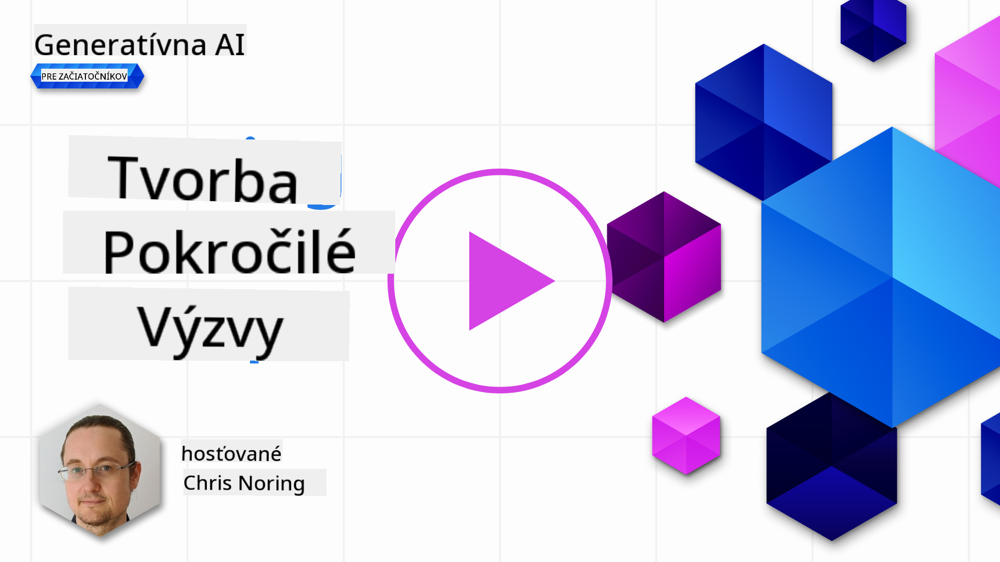

<!--
CO_OP_TRANSLATOR_METADATA:
{
  "original_hash": "b2651fb16bcfbc62b8e518751ed90fdb",
  "translation_date": "2025-10-17T21:52:11+00:00",
  "source_file": "05-advanced-prompts/README.md",
  "language_code": "sk"
}
-->
# Vytváranie pokročilých promptov

[](https://youtu.be/BAjzkaCdRok?si=NmUIyRf7-cDgbjtt)

Zhrňme si niektoré poznatky z predchádzajúcej kapitoly:

> Prompt _engineering_ je proces, ktorým **usmerňujeme model k relevantnejším odpovediam** poskytovaním užitočnejších inštrukcií alebo kontextu.

Existujú dva kroky pri písaní promptov: konštrukcia promptu, kde poskytujeme relevantný kontext, a _optimalizácia_, teda postupné zlepšovanie promptu.

V tomto bode už máme základné pochopenie toho, ako písať prompty, ale potrebujeme ísť hlbšie. V tejto kapitole prejdete od skúšania rôznych promptov k pochopeniu, prečo je jeden prompt lepší ako druhý. Naučíte sa, ako konštruovať prompty podľa základných techník, ktoré sa dajú aplikovať na akýkoľvek LLM.

## Úvod

V tejto kapitole sa budeme venovať nasledujúcim témam:

- Rozšírenie vašich znalostí o prompt engineeringu aplikovaním rôznych techník na vaše prompty.
- Konfigurácia vašich promptov na zmenu výstupu.

## Ciele učenia

Po dokončení tejto lekcie budete schopní:

- Aplikovať techniky prompt engineeringu, ktoré zlepšujú výsledok vašich promptov.
- Vykonávať prompting, ktorý je buď variabilný alebo deterministický.

## Prompt engineering

Prompt engineering je proces vytvárania promptov, ktoré produkujú požadovaný výsledok. Prompt engineering nie je inžinierska disciplína, ale skôr súbor techník, ktoré môžete aplikovať na dosiahnutie požadovaného výsledku.

### Príklad promptu

Pozrime sa na základný prompt, ako je tento:

> Vygeneruj 10 otázok o geografii.

V tomto prompte vlastne aplikujete súbor rôznych techník promptovania.

Rozložme si to.

- **Kontext**, špecifikujete, že by to malo byť o "geografii".
- **Obmedzenie výstupu**, chcete maximálne 10 otázok.

### Obmedzenia jednoduchého promptovania

Možno dosiahnete požadovaný výsledok, možno nie. Otázky sa vygenerujú, ale geografia je veľká téma a možno nedosiahnete to, čo chcete, z nasledujúcich dôvodov:

- **Veľká téma**, neviete, či to bude o krajinách, hlavných mestách, riekach a podobne.
- **Formát**, čo ak chcete, aby otázky boli naformátované určitým spôsobom?

Ako vidíte, pri vytváraní promptov je veľa vecí, ktoré treba zvážiť.

Doteraz sme videli jednoduchý príklad promptu, ale generatívna AI je schopná oveľa viac, aby pomohla ľuďom v rôznych rolách a odvetviach. Poďme preskúmať niektoré základné techniky.

### Techniky promptovania

Najprv musíme pochopiť, že promptovanie je _emergentná_ vlastnosť LLM, čo znamená, že to nie je funkcia zabudovaná do modelu, ale skôr niečo, čo objavujeme pri používaní modelu.

Existujú niektoré základné techniky, ktoré môžeme použiť na promptovanie LLM. Poďme ich preskúmať.

- **Zero-shot prompting**, ide o najzákladnejšiu formu promptovania. Je to jediný prompt, ktorý žiada odpoveď od LLM na základe jeho tréningových dát.
- **Few-shot prompting**, tento typ promptovania usmerňuje LLM poskytovaním 1 alebo viacerých príkladov, na ktoré sa môže spoľahnúť pri generovaní odpovede.
- **Chain-of-thought**, tento typ promptovania učí LLM, ako rozložiť problém na kroky.
- **Generated knowledge**, na zlepšenie odpovede promptu môžete poskytnúť generované fakty alebo znalosti navyše k vášmu promptu.
- **Least to most**, podobne ako chain-of-thought, táto technika spočíva v rozdelení problému na sériu krokov a následnom požiadaní o vykonanie týchto krokov v poradí.
- **Self-refine**, táto technika spočíva v kritike výstupu LLM a následnom požiadaní o jeho zlepšenie.
- **Maieutic prompting**, tu chcete zabezpečiť, že odpoveď LLM je správna, a požiadate ho, aby vysvetlilo rôzne časti odpovede. Ide o formu self-refine.

### Zero-shot prompting

Tento štýl promptovania je veľmi jednoduchý, pozostáva z jediného promptu. Táto technika je pravdepodobne to, čo používate, keď začínate učiť sa o LLM. Tu je príklad:

- Prompt: "Čo je algebra?"
- Odpoveď: "Algebra je odvetvie matematiky, ktoré skúma matematické symboly a pravidlá na manipuláciu s týmito symbolmi."

### Few-shot prompting

Tento štýl promptovania pomáha modelu poskytovaním niekoľkých príkladov spolu s požiadavkou. Pozostáva z jediného promptu s dodatočnými dátami špecifickými pre úlohu. Tu je príklad:

- Prompt: "Napíš báseň v štýle Shakespeara. Tu je niekoľko príkladov Shakespearových sonetov:
  Sonet 18: 'Mám ťa prirovnať k letnému dňu? Si krajší a miernejší...'
  Sonet 116: 'Nech mi nie je prekážkou spojenie pravých myslí. Láska nie je láskou, ktorá sa mení, keď sa mení...'
  Sonet 132: 'Tvoje oči milujem, a ony, akoby ma ľutovali, poznajúc tvoje srdce, mučia ma pohŕdaním,...'
  Teraz napíš sonet o kráse mesiaca."
- Odpoveď: "Na oblohe mesiac jemne žiari, v striebristom svetle, ktoré vrhá svoju jemnú milosť,..."

Príklady poskytujú LLM kontext, formát alebo štýl požadovaného výstupu. Pomáhajú modelu pochopiť konkrétnu úlohu a generovať presnejšie a relevantnejšie odpovede.

### Chain-of-thought

Chain-of-thought je veľmi zaujímavá technika, pretože ide o vedenie LLM cez sériu krokov. Myšlienka je inštruovať LLM takým spôsobom, aby pochopilo, ako niečo urobiť. Zvážte nasledujúci príklad, s a bez chain-of-thought:

    - Prompt: "Alice má 5 jabĺk, hodí 3 jablká, dá 2 Bobovi a Bob jej jedno vráti, koľko jabĺk má Alice?"
    - Odpoveď: 5

LLM odpovie 5, čo je nesprávne. Správna odpoveď je 1 jablko, podľa výpočtu (5 -3 -2 + 1 = 1).

Ako môžeme naučiť LLM, aby to urobilo správne?

Skúsme chain-of-thought. Aplikácia chain-of-thought znamená:

1. Dajte LLM podobný príklad.
1. Ukážte výpočet a ako ho správne vypočítať.
1. Poskytnite pôvodný prompt.

Tu je postup:

- Prompt: "Lisa má 7 jabĺk, hodí 1 jablko, dá 4 jablká Bartovi a Bart jej jedno vráti:
  7 -1 = 6
  6 -4 = 2
  2 +1 = 3  
  Alice má 5 jabĺk, hodí 3 jablká, dá 2 Bobovi a Bob jej jedno vráti, koľko jabĺk má Alice?"
  Odpoveď: 1

Všimnite si, ako píšeme podstatne dlhšie prompty s ďalším príkladom, výpočtom a potom pôvodným promptom, a dospejeme k správnej odpovedi 1.

Ako vidíte, chain-of-thought je veľmi silná technika.

### Generated knowledge

Mnohokrát, keď chcete zostaviť prompt, chcete to urobiť pomocou údajov vašej vlastnej spoločnosti. Chcete, aby časť promptu pochádzala od spoločnosti a druhá časť by mala byť skutočný prompt, ktorý vás zaujíma.

Ako príklad, takto môže vyzerať váš prompt, ak ste v poisťovníctve:

```text
{{company}}: {{company_name}}
{{products}}:
{{products_list}}
Please suggest an insurance given the following budget and requirements:
Budget: {{budget}}
Requirements: {{requirements}}
```

Vyššie vidíte, ako je prompt zostavený pomocou šablóny. V šablóne je niekoľko premenných, označených `{{variable}}`, ktoré budú nahradené skutočnými hodnotami z API spoločnosti.

Tu je príklad, ako by prompt mohol vyzerať po nahradení premenných obsahom z vašej spoločnosti:

```text
Insurance company: ACME Insurance
Insurance products (cost per month):
- Car, cheap, 500 USD
- Car, expensive, 1100 USD
- Home, cheap, 600 USD
- Home, expensive, 1200 USD
- Life, cheap, 100 USD

Please suggest an insurance given the following budget and requirements:
Budget: $1000
Requirements: Car, Home, and Life insurance
```

Spustenie tohto promptu cez LLM vyprodukuje odpoveď ako táto:

```output
Given the budget and requirements, we suggest the following insurance package from ACME Insurance:
- Car, cheap, 500 USD
- Home, cheap, 600 USD
- Life, cheap, 100 USD
Total cost: $1,200 USD
```

Ako vidíte, navrhuje aj životné poistenie, čo by nemalo. Tento výsledok naznačuje, že musíme optimalizovať prompt tým, že ho zmeníme, aby bol jasnejší v tom, čo môže povoliť. Po niekoľkých _pokusoch a omyloch_ dospejeme k nasledujúcemu promptu:

```text
Insurance company: ACME Insurance
Insurance products (cost per month):
- type: Car, cheap, cost: 500 USD
- type: Car, expensive, cost: 1100 USD
- type: Home, cheap, cost: 600 USD
- type: Home, expensive, cost: 1200 USD
- type: Life, cheap, cost: 100 USD

Please suggest an insurance given the following budget and requirements:
Budget: $1000 restrict choice to types: Car, Home
```

Všimnite si, ako pridanie _type_ a _cost_ a tiež použitie kľúčového slova _restrict_ pomáha LLM pochopiť, čo chceme.

Teraz dostaneme nasledujúcu odpoveď:

```output
Given the budget and requirements, we suggest the Car, Cheap insurance product which costs 500 USD per month.
```

Cieľom tohto príkladu bolo ukázať, že aj keď používame základnú techniku ako _generated knowledge_, stále musíme vo väčšine prípadov optimalizovať prompt, aby sme dosiahli požadovaný výsledok.

### Least-to-most

Myšlienka Least-to-most promptovania je rozdelenie väčšieho problému na podproblémy. Týmto spôsobom pomáhate usmerniť LLM, ako "zdolať" väčší problém. Dobrým príkladom môže byť dátová veda, kde môžete požiadať LLM, aby rozdelil problém takto:

> Prompt: Ako vykonať dátovú analýzu v 5 krokoch?

Vaša AI asistentka odpovie:

1. Zber dát
1. Čistenie dát
1. Analýza dát
1. Vizualizácia dát
1. Prezentácia dát

### Self-refine, kritika výsledkov

Pri generatívnych AI a LLM nemôžete dôverovať výstupu. Musíte ho overiť. Napokon, LLM vám len prezentuje, čo je najpravdepodobnejšia vec, ktorú povedať, nie čo je správne. Preto je dobrý nápad požiadať LLM, aby samo seba kritizovalo, čo nás vedie k technike self-refine.

Ako to funguje, je nasledovné:

1. Počiatočný prompt, ktorý žiada LLM vyriešiť problém
1. LLM odpovie
1. Kritizujete odpoveď a požiadate AI o zlepšenie
1. LLM odpovie znova, tentoraz zohľadňujúc kritiku a navrhne riešenia, ktoré vymyslelo

Tento proces môžete opakovať toľkokrát, koľko chcete.

Tu je príklad použitia tejto techniky:

> Prompt: "Vytvor Python Web API s routami products a customers"

AI odpoveď:

```python
import flask
app = Flask(__name__)

@app.route('/products')
def products():
    return 'Products'

@app.route('/customers')
def customers():
    return 'Customers'
```

> Prompt: navrhni 3 vylepšenia vyššie uvedeného kódu

AI odpoveď:

```text
Sure, here are three suggestions to improve the code:

Import the correct module: The first line should import Flask instead of flask. The correct import statement should be from flask import Flask.

Add a main function: Add a if __name__ == '__main__': block to the end of the file to run the application when the file is executed.

Use f-strings: Use f-strings to format the return statements in the route functions. For example, return 'Products' can be changed to return f'This is the {request.path} page'.
```

```python
from flask import Flask, request

app = Flask(__name__)

@app.route('/products')
def products():
    return f'This is the {request.path} page'

@app.route('/customers')
def customers():
    return f'This is the {request.path} page'

if __name__ == '__main__':
    app.run()
```

Ako vidíte, vyššie uvedená odpoveď AI zlepšuje prvý navrhnutý kód vďaka kritike prvej odpovede.

### Maieutic prompting

Maieutic prompting je technika podobná self-refine, ale ide skôr o to, aby LLM vysvetlilo samo seba. Cieľom je znížiť nekonzistencie vo výstupe LLM, aby sa zabezpečilo, že dosiahne správnu odpoveď. Postup, ktorý treba dodržiavať, je:

1. Požiadajte LLM, aby odpovedalo na otázku
1. Pre každú časť odpovede požiadajte LLM, aby ju vysvetlilo podrobnejšie.
1. Ak sú nekonzistencie, vyraďte časti, ktoré sú nekonzistentné.

Opakujte kroky 2 a 3, kým neprejdete všetky časti a nebudete spokojní s odpoveďou.

Tu je príklad promptu:

> prompt: Ako môžem vytvoriť krízový plán na zmiernenie pandémie v 5 krokoch?
> LLM odpoveď:

```text
1. Identify the risks
1. Identify the stakeholders
1. Identify the resources
1. Identify the actions
1. Identify the communication channels
```

Identifikovalo 5 krokov, ale môžeme určiť, či je to správne? Poďme požiadať LLM, aby vysvetlilo každý krok podrobnejšie:

> prompt: Vysvetli prvý krok podrobnejšie, aké sú riziká pandémie podrobne?

```text
The risks are the following:

- Loss of life
- Loss of business
- Loss of reputation
- Loss of customers
- Loss of employees
```

V tomto bode chceme zabezpečiť, že LLM je správne, takže ho požiadame, aby vysvetlilo prvé riziko podrobnejšie a dúfame, že je konzistentné s vyššie uvedenou odpoveďou:

> prompt: V pandémii, ktoré je najväčšie riziko a prečo?

```text
The biggest risk is loss of life because it's the most important thing to protect.
```

> Aké sú dve najväčšie riziká v pandémii?

```text
The two biggest risks are loss of life and loss of business.
```

V tomto bode je LLM konzistentné a spomína "život" a "biznis" ako dve najväčšie riziká. Teraz môžeme pokračovať na ďalší krok a cítiť sa pomerne istí. Avšak, nemali by sme slepo dôverovať LLM, vždy by sme mali overiť výstup.

## Variabilita výstupu

LLM sú zo svojej podstaty nedeterministické, čo znamená, že dostanete rôzne výsledky zakaždým, keď spustíte ten istý prompt. Skúste napríklad nasledujúci prompt:

> "Vygeneruj kód pre Python Web API"

```python
# Import necessary modules
import flask
from flask import request, jsonify

# Create a Flask app
app = flask.Flask(__name__)

# Create a route for the API
@app.route('/api', methods=['GET'])
def api():
    # Get the data from the request
    data = request.args

    # Process the data
    result = process_data(data)

    # Return the result as JSON
    return jsonify(result)

# Function to process the data
def process_data(data):
    # Do something with the data
    result = data + 1

    # Return the result
    return result

# Run the app
if __name__ == '__main__':
    app.run()

```

Spustenie toho istého promptu znova generuje mierne odlišnú odpoveď:

```python
#import necessary packages
import flask
from flask import request, jsonify

#create the Flask application
app = flask.Flask(__name__)
app.config["DEBUG"] = True

#create a list of books
books = [
    {'id': 0,
     'title': 'A Fire Upon the Deep',
     'author': 'Vernor Vinge',
     'first_sentence': 'The coldsleep itself was dreamless.',
     'year_published': '1992'},
    {'id': 1,
     'title': 'The Ones Who Walk Away From Omelas',
     'author': 'Ursula K. Le Guin',
     'first_sentence': 'With a clamor of bells that set the swallows soaring, the Festival of Summer came to the city Omelas, bright-towered by the sea.',
     'published': '1973'},
    {'id': 2,
     'title': 'Dhalgren',
     'author': 'Samuel R. Delany',
     'first_sentence': 'to wound the autumnal city.',
     'published': '1975'}
]

#create an endpoint for the API
@app.route('/', methods=['GET'])
def home():
    return '''<h1>Books API</h1>
<p>A prototype API for retrieving books.</p>'''

#create an endpoint to return all books
@app.route('/api/v1/resources/books/all', methods=['GET'])
def api_all():
    return jsonify(books)

#create an endpoint to return a single book
@app.route('/api/v1/resources/books', methods=['GET'])
def api_id():
    #check if an ID was provided as part of the URL
    #if ID is provided, assign it to a variable
    #if no ID is provided, display an error
    if 'id' in request.args:
        id = int(request.args['id'])
    else:
        return "Error: No id field provided. Please specify an id."

    #create an empty list for our results
    results = []

    #loop through the data and match results that fit the requested ID
    #IDs are unique, but other fields might return many results
    for book in books:
        if book['id'] == id:
            results.append(book)

    #use the jsonify function from Flask to convert our list of
    #Python dictionaries to the JSON format
    return jsonify(results)

app.run()
```

> Je variabilný výstup problém?

Záleží na tom, čo sa snažíte dosiahnuť. Ak chcete konkrétnu odpoveď, potom je to problém. Ak vám nevadí variabilný výstup, ako napríklad "Vygeneruj akékoľvek 3 otázky o geografii", potom to nie je problém.

### Použitie teploty na variabilitu výstupu

Dobre, rozhodli sme sa, že chceme obmedziť výstup, aby bol predvídateľnejší, teda viac deterministický. Ako to urobiť?

Teplota je hodnota medzi 0 a 1, kde 0 je najviac deterministická a 1 je najviac variabilná. Predvolená hodnota je 0.7. Pozrime sa, čo sa stane pri dvoch spusteniach toho istého promptu s teplotou nastavenou na 0.1:

> "Vygeneruj kód pre Python Web API"

```python
#import necessary libraries
import flask
from flask import request, jsonify

#create an instance of the Flask class
app = flask.Flask(__name__)

#create an endpoint for the API
@app.route('/api/v1/endpoint', methods=['GET'])
def api_endpoint():
    #get the request data
    data = request.get_json()

    #process the data
    result = process_data(data)

    #return the result
    return jsonify(result)

#function to process the data
def process_data(data):
    #process the data
    result = {'result': 'success'}

    #return the result
    return result

#run the Flask app
if __name__ == '__main__':
    app.run()

```

Spustenie promptu znova nám dáva tento výsledok:

```python
#import necessary libraries
import flask
from flask import request, jsonify

#create a Flask app
app = flask.Flask(__name__)

#create a route for the API
@app.route('/api', methods=['GET'])
def api_call():
    #get the data from the request
    data = request.get_json()

    #process the data
    result = process_data(data)

    #return the result
    return jsonify(result)

#define the process_data function
def process_data(data):
    #do something with the data
    result = data + 1

    #return the result
    return result

#run the app
if __name__ == '__main__':
    app.run()

```

Medzi týmito dvoma výstupmi je len malý rozdiel. Tentoraz urobme opak, nastavme teplotu na 0.9:

```python
# Import necessary libraries
import flask
from flask import request, jsonify

# Create a Flask app
app = flask.Flask(__name__)

# Create a route for the API
@app.route('/api', methods=['GET'])
def api_call():
    # Get the data from the request
    data = request.args

    # Process the data
    result = process_data(data)

    # Return the result
    return jsonify(result)

# Function to process the data
def process_data(data):
    # Do something with the data
    result = data + 1

    # Return the result
    return result

# Run the app
if __name__ == '__main__':
    app.run()

```

a druhý pokus s hodnotou teploty 0.9:

```python
import flask
from flask import request, jsonify

# create the Flask app
app = flask.Flask(__name__)
app.config['DEBUG'] = True

# create some test data
books = [
    {'id': 0, 'title': 'A Fire Upon The Deep', 'author': 'Vernor Vinge', 'first_sentence': 'The coldsleep itself was dreamless.', 'year_published': '1992'},
    {'id': 1, 'title': 'The Ones Who Walk Away From Omelas', 'author': 'Ursula K. Le Guin', 'first_sentence': 'With a clamor of bells that set the swallows soaring, the Festival of Summer came to the city Omelas, bright-towered by the sea.', 'published': '1973'},
    {'id': 2, 'title': 'Dhalgren', 'author': 'Samuel R. Delany', 'first_sentence': 'to wound the autumnal city.', 'published': '1975'}
]

# create an endpoint
@app.route('/', methods=['GET'])
def home():
    return '''<h1>Welcome to our book API!</h1>'''

@app.route('/api/v1/resources/books

```

Ako vidíte, výsledky nemohli byť rozmanitejšie.

> Všimnite si, že existuje viac parametrov, ktoré môžete zmeniť na ovplyvnenie výstupu, ako napríklad top-k, top-p, penalizácia opakovania, penalizácia dĺžky a penalizácia rozmanitosti, ale tieto sú mimo rozsah tejto učebnej osnovy.

## Dobré praktiky

Existuje mnoho praktík, ktoré môžete použiť na dosiahnutie požadovaného výsledku. Ako budete používať prompting častejšie, nájdete svoj vlastný štýl.

Okrem techník, ktoré sme prebrali, existujú niektoré dobré praktiky, ktoré je vhodné zvážiť pri práci s LLM.

Tu sú niektoré dobré praktiky, ktoré je vhodné zvážiť:

- **Špecifikujte kontext**. Kontext je dôležitý, čím viac môžete špecifikovať, ako napríklad oblasť, tému atď., tým lepšie.
- Obmedzte výstup. Ak chcete konkrétny počet položiek alebo konkrétnu dĺžku, špecifikujte to.
- **Špecifikujte čo a ako**. Nezabudnite uviesť, čo chcete a ako to chcete, napríklad "Vytvorte Python Web API s trasami products a customers, rozdeľte ho do 3 súborov".
- **Používajte šablóny**. Často budete chcieť obohatiť svoje prompty údajmi z vašej spoločnosti. Používajte šablóny na tento účel. Šablóny môžu obsahovať premenné, ktoré nahradíte skutočnými údajmi.
- **Píšte správne**. LLM vám môže poskytnúť správnu odpoveď, ale ak píšete správne, dostanete lepšiu odpoveď.

## Zadanie

Tu je kód v Pythone, ktorý ukazuje, ako vytvoriť jednoduché API pomocou Flask:

```python
from flask import Flask, request

app = Flask(__name__)

@app.route('/')
def hello():
    name = request.args.get('name', 'World')
    return f'Hello, {name}!'

if __name__ == '__main__':
    app.run()
```

Použite AI asistenta, ako je GitHub Copilot alebo ChatGPT, a aplikujte techniku "self-refine" na zlepšenie kódu.

## Riešenie

Pokúste sa vyriešiť zadanie pridaním vhodných promptov do kódu.

> [!TIP]
> Formulujte prompt na požiadanie o zlepšenie, je dobré obmedziť počet zlepšení. Môžete tiež požiadať o zlepšenie konkrétnym spôsobom, napríklad architektúra, výkon, bezpečnosť atď.

[Riešenie](../../../05-advanced-prompts/python/aoai-solution.py)

## Kontrola vedomostí

Prečo by som mal použiť chain-of-thought prompting? Ukážte mi 1 správnu odpoveď a 2 nesprávne odpovede.

1. Naučiť LLM, ako vyriešiť problém.
1. B, Naučiť LLM nájsť chyby v kóde.
1. C, Inštruovať LLM, aby prišlo s rôznymi riešeniami.

A: 1, pretože chain-of-thought je o tom, ako ukázať LLM, ako vyriešiť problém poskytnutím série krokov, podobných problémov a spôsobov, akými boli vyriešené.

## 🚀 Výzva

Práve ste použili techniku self-refine v zadaní. Vezmite akýkoľvek program, ktorý ste vytvorili, a zvážte, aké zlepšenia by ste chceli aplikovať. Teraz použite techniku self-refine na aplikáciu navrhovaných zmien. Čo si myslíte o výsledku, je lepší alebo horší?

## Skvelá práca! Pokračujte vo svojom vzdelávaní

Po dokončení tejto lekcie si pozrite našu [kolekciu Generative AI Learning](https://aka.ms/genai-collection?WT.mc_id=academic-105485-koreyst), aby ste pokračovali v rozširovaní svojich znalostí o generatívnej AI!

Prejdite na Lekciu 6, kde aplikujeme naše znalosti o Prompt Engineering [vytvorením aplikácií na generovanie textu](../06-text-generation-apps/README.md?WT.mc_id=academic-105485-koreyst).

---

**Zrieknutie sa zodpovednosti**:  
Tento dokument bol preložený pomocou služby AI prekladu [Co-op Translator](https://github.com/Azure/co-op-translator). Hoci sa snažíme o presnosť, prosím, berte na vedomie, že automatizované preklady môžu obsahovať chyby alebo nepresnosti. Pôvodný dokument v jeho rodnom jazyku by mal byť považovaný za autoritatívny zdroj. Pre kritické informácie sa odporúča profesionálny ľudský preklad. Nenesieme zodpovednosť za akékoľvek nedorozumenia alebo nesprávne interpretácie vyplývajúce z použitia tohto prekladu.