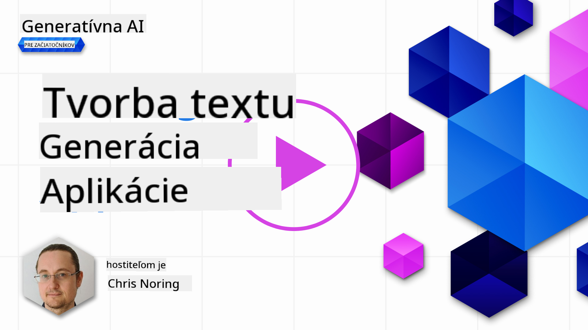

<!--
CO_OP_TRANSLATOR_METADATA:
{
  "original_hash": "ce8224073b86b728ed52b19bed7932fd",
  "translation_date": "2025-07-09T12:07:24+00:00",
  "source_file": "06-text-generation-apps/README.md",
  "language_code": "sk"
}
-->
# Tvorba aplikácií na generovanie textu

[](https://aka.ms/gen-ai-lesson6-gh?WT.mc_id=academic-105485-koreyst)

> _(Kliknite na obrázok vyššie pre zobrazenie videa k tejto lekcii)_

Doteraz ste v tomto kurze videli základné pojmy ako prompt a dokonca celú disciplínu nazývanú „prompt engineering“. Mnohé nástroje, s ktorými môžete komunikovať, ako ChatGPT, Office 365, Microsoft Power Platform a ďalšie, vás podporujú v používaní promptov na dosiahnutie cieľa.

Ak chcete takúto funkcionalitu pridať do aplikácie, musíte pochopiť pojmy ako prompt, completion a vybrať si knižnicu, s ktorou budete pracovať. Presne to sa naučíte v tejto kapitole.

## Úvod

V tejto kapitole sa naučíte:

- Zoznámiť sa s knižnicou openai a jej základnými konceptmi.
- Vytvoriť aplikáciu na generovanie textu pomocou openai.
- Pochopiť, ako používať pojmy ako prompt, temperature a tokens na tvorbu aplikácie na generovanie textu.

## Ciele učenia

Na konci tejto lekcie budete vedieť:

- Vysvetliť, čo je aplikácia na generovanie textu.
- Vytvoriť aplikáciu na generovanie textu pomocou openai.
- Nakonfigurovať aplikáciu tak, aby používala viac alebo menej tokenov a tiež meniť hodnotu temperature pre rôznorodý výstup.

## Čo je aplikácia na generovanie textu?

Bežne, keď vytvárate aplikáciu, má nejaké rozhranie, napríklad:

- Príkazové rozhranie. Konzolové aplikácie sú typické aplikácie, kde zadávate príkaz a aplikácia vykoná úlohu. Napríklad `git` je aplikácia založená na príkazoch.
- Užívateľské rozhranie (UI). Niektoré aplikácie majú grafické užívateľské rozhranie (GUI), kde klikáte na tlačidlá, zadávate text, vyberáte možnosti a podobne.

### Konzolové a UI aplikácie majú obmedzenia

Porovnajte to s aplikáciou založenou na príkazoch, kde zadávate príkaz:

- **Je obmedzená**. Nemôžete zadať ľubovoľný príkaz, len tie, ktoré aplikácia podporuje.
- **Jazykovo špecifická**. Niektoré aplikácie podporujú viacero jazykov, ale štandardne sú vytvorené pre konkrétny jazyk, aj keď môžete pridať podporu ďalších jazykov.

### Výhody aplikácií na generovanie textu

Čím sa teda aplikácia na generovanie textu líši?

V takejto aplikácii máte väčšiu flexibilitu, nie ste obmedzení na súbor príkazov alebo konkrétny vstupný jazyk. Namiesto toho môžete používať prirodzený jazyk na interakciu s aplikáciou. Ďalšou výhodou je, že už pracujete so zdrojom dát, ktorý bol trénovaný na obrovskom množstve informácií, zatiaľ čo tradičná aplikácia môže byť limitovaná tým, čo je v databáze.

### Čo môžem vytvoriť s aplikáciou na generovanie textu?

Môžete vytvoriť mnoho vecí, napríklad:

- **Chatbot**. Chatbot odpovedajúci na otázky o témach, ako je vaša firma a jej produkty, môže byť veľmi užitočný.
- **Pomocník**. LLM sú skvelé na veci ako zhrnutie textu, získavanie poznatkov z textu, tvorbu textov ako životopisy a podobne.
- **Asistent pre kódovanie**. Podľa použitého jazykového modelu môžete vytvoriť asistenta, ktorý pomáha písať kód. Napríklad môžete použiť produkty ako GitHub Copilot alebo ChatGPT na pomoc s písaním kódu.

## Ako začať?

Potrebujete nájsť spôsob, ako sa integrovať s LLM, čo zvyčajne znamená tieto dve možnosti:

- Použiť API. Tu vytvárate webové požiadavky s vaším promptom a dostávate späť generovaný text.
- Použiť knižnicu. Knižnice zjednodušujú volania API a uľahčujú ich používanie.

## Knižnice/SDK

Existuje niekoľko známych knižníc na prácu s LLM, napríklad:

- **openai**, táto knižnica uľahčuje pripojenie k vášmu modelu a odosielanie promptov.

Potom sú tu knižnice, ktoré pracujú na vyššej úrovni, napríklad:

- **Langchain**. Langchain je známy a podporuje Python.
- **Semantic Kernel**. Semantic Kernel je knižnica od Microsoftu podporujúca jazyky C#, Python a Java.

## Prvá aplikácia s openai

Pozrime sa, ako môžeme vytvoriť našu prvú aplikáciu, aké knižnice potrebujeme, koľko je potrebné a podobne.

### Inštalácia openai

Existuje mnoho knižníc na interakciu s OpenAI alebo Azure OpenAI. Môžete použiť rôzne programovacie jazyky ako C#, Python, JavaScript, Java a ďalšie. My sme si vybrali knižnicu `openai` pre Python, takže použijeme `pip` na jej inštaláciu.

```bash
pip install openai
```

### Vytvorenie zdroja

Musíte vykonať nasledujúce kroky:

- Vytvorte si účet na Azure [https://azure.microsoft.com/free/](https://azure.microsoft.com/free/?WT.mc_id=academic-105485-koreyst).
- Získajte prístup k Azure OpenAI. Prejdite na [https://learn.microsoft.com/azure/ai-services/openai/overview#how-do-i-get-access-to-azure-openai](https://learn.microsoft.com/azure/ai-services/openai/overview#how-do-i-get-access-to-azure-openai?WT.mc_id=academic-105485-koreyst) a požiadajte o prístup.

  > [!NOTE]
  > V čase písania je potrebné požiadať o prístup k Azure OpenAI.

- Nainštalujte Python <https://www.python.org/>
- Vytvorte Azure OpenAI Service zdroj. Pozrite si tento návod, ako [vytvoriť zdroj](https://learn.microsoft.com/azure/ai-services/openai/how-to/create-resource?pivots=web-portal?WT.mc_id=academic-105485-koreyst).

### Nájdenie API kľúča a endpointu

Teraz musíte knižnici `openai` povedať, aký API kľúč má použiť. Na nájdenie API kľúča prejdite do sekcie „Keys and Endpoint“ vášho Azure OpenAI zdroja a skopírujte hodnotu „Key 1“.


Keď máte tieto informácie skopírované, nastavme knižnice, aby ich používali.

> [!NOTE]
> Odporúča sa oddeliť API kľúč od kódu. Môžete to urobiť pomocou premenných prostredia.
>
> - Nastavte premennú prostredia `OPENAI_API_KEY` na váš API kľúč.
>   `export OPENAI_API_KEY='sk-...'`

### Nastavenie konfigurácie pre Azure

Ak používate Azure OpenAI, takto nastavíte konfiguráciu:

```python
openai.api_type = 'azure'
openai.api_key = os.environ["OPENAI_API_KEY"]
openai.api_version = '2023-05-15'
openai.api_base = os.getenv("API_BASE")
```

Vyššie nastavujeme:

- `api_type` na `azure`. To hovorí knižnici, aby používala Azure OpenAI a nie OpenAI.
- `api_key`, čo je váš API kľúč nájdený v Azure Portáli.
- `api_version`, verzia API, ktorú chcete použiť. V čase písania je najnovšia verzia `2023-05-15`.
- `api_base`, endpoint API. Nájdete ho v Azure Portáli vedľa vášho API kľúča.

> [!NOTE] > `os.getenv` je funkcia, ktorá číta premenné prostredia. Môžete ju použiť na čítanie premenných ako `OPENAI_API_KEY` a `API_BASE`. Nastavte tieto premenné vo vašom termináli alebo pomocou knižnice ako `dotenv`.

## Generovanie textu

Na generovanie textu použijeme triedu `Completion`. Tu je príklad:

```python
prompt = "Complete the following: Once upon a time there was a"

completion = openai.Completion.create(model="davinci-002", prompt=prompt)
print(completion.choices[0].text)
```

V uvedenom kóde vytvoríme objekt completion, zadáme model, ktorý chceme použiť, a prompt. Potom vypíšeme vygenerovaný text.

### Chat completions

Doteraz ste videli, ako používame `Completion` na generovanie textu. Existuje však aj trieda `ChatCompletion`, ktorá je vhodnejšia pre chatboty. Tu je príklad jej použitia:

```python
import openai

openai.api_key = "sk-..."

completion = openai.ChatCompletion.create(model="gpt-3.5-turbo", messages=[{"role": "user", "content": "Hello world"}])
print(completion.choices[0].message.content)
```

Viac o tejto funkcionalite v nasledujúcej kapitole.

## Cvičenie – vaša prvá aplikácia na generovanie textu

Teraz, keď sme sa naučili nastaviť a nakonfigurovať openai, je čas vytvoriť vašu prvú aplikáciu na generovanie textu. Postupujte podľa týchto krokov:

1. Vytvorte virtuálne prostredie a nainštalujte openai:

   ```bash
   python -m venv venv
   source venv/bin/activate
   pip install openai
   ```

   > [!NOTE]
   > Ak používate Windows, zadajte `venv\Scripts\activate` namiesto `source venv/bin/activate`.

   > [!NOTE]
   > Nájdenie vášho Azure OpenAI kľúča: Prejdite na [https://portal.azure.com/](https://portal.azure.com/?WT.mc_id=academic-105485-koreyst), vyhľadajte `Open AI`, vyberte `Open AI resource`, potom `Keys and Endpoint` a skopírujte hodnotu `Key 1`.

1. Vytvorte súbor _app.py_ a vložte do neho nasledujúci kód:

   ```python
   import openai

   openai.api_key = "<replace this value with your open ai key or Azure OpenAI key>"

   openai.api_type = 'azure'
   openai.api_version = '2023-05-15'
   openai.api_base = "<endpoint found in Azure Portal where your API key is>"
   deployment_name = "<deployment name>"

   # add your completion code
   prompt = "Complete the following: Once upon a time there was a"
   messages = [{"role": "user", "content": prompt}]

   # make completion
   completion = openai.chat.completions.create(model=deployment_name, messages=messages)

   # print response
   print(completion.choices[0].message.content)
   ```

   > [!NOTE]
   > Ak používate Azure OpenAI, musíte nastaviť `api_type` na `azure` a `api_key` na váš Azure OpenAI kľúč.

   Mali by ste vidieť výstup podobný tomuto:

   ```output
    very unhappy _____.

   Once upon a time there was a very unhappy mermaid.
   ```

## Rôzne typy promptov pre rôzne účely

Teraz ste videli, ako generovať text pomocou promptu. Dokonca máte program, ktorý beží a môžete ho upravovať na generovanie rôznych typov textu.

Prompt môžete použiť na rôzne úlohy, napríklad:

- **Generovanie typu textu**. Napríklad môžete generovať báseň, otázky do kvízu a podobne.
- **Vyhľadávanie informácií**. Môžete použiť prompt na vyhľadanie informácií, napríklad „Čo znamená CORS vo webovom vývoji?“.
- **Generovanie kódu**. Môžete generovať kód, napríklad regulárny výraz na validáciu emailov alebo rovno celú aplikáciu, napríklad webovú aplikáciu.

## Praktickejší príklad: generátor receptov

Predstavte si, že máte doma suroviny a chcete niečo uvariť. Na to potrebujete recept. Recepty môžete hľadať cez vyhľadávač alebo použiť LLM.

Môžete napísať prompt takto:

> „Ukáž mi 5 receptov na jedlo s nasledujúcimi ingredienciami: kuracie mäso, zemiaky a mrkva. Pre každý recept uveď všetky použité ingrediencie.“

Na základe tohto promptu môžete dostať odpoveď podobnú:

```output
1. Roasted Chicken and Vegetables:
Ingredients:
- 4 chicken thighs
- 2 potatoes, cut into cubes
- 2 carrots, cut into cubes
- 2 tablespoons olive oil
- 2 cloves garlic, minced
- 1 teaspoon dried thyme
- 1 teaspoon dried oregano
- Salt and pepper, to taste

2. Chicken and Potato Stew:
Ingredients:
- 2 tablespoons olive oil
- 1 onion, diced
- 2 cloves garlic, minced
- 2 chicken breasts, cut into cubes
- 2 potatoes, cut into cubes
- 2 carrots, cut into cubes
- 1 teaspoon dried oregano
- 1 teaspoon dried thyme
- 1 cup chicken broth
- Salt and pepper, to taste

3. Chicken and Potato Bake:
Ingredients:
- 2 tablespoons olive oil
- 2 chicken breasts, cut into cubes
- 2 potatoes, cut into cubes
- 2 carrots, cut into cubes
- 1 onion, diced
- 2 cloves garlic, minced
- 1 teaspoon dried oregano
- 1 teaspoon dried thyme
- 1 cup chicken broth
- Salt and pepper, to taste

4. Chicken and Potato Soup:
Ingredients:
- 2 tablespoons olive oil
- 1 onion, diced
- 2 cloves garlic, minced
- 2 chicken breasts, cut into cubes
- 2 potatoes, cut into cubes
- 2 carrots, cut into cubes
- 1 teaspoon dried oregano
- 1 teaspoon dried thyme
- 4 cups chicken broth
- Salt and pepper, to taste

5. Chicken and Potato Hash:
Ingredients:
- 2 tablespoons olive oil
- 2 chicken breasts, cut into cubes
- 2 potatoes, cut into cubes
- 2 carrots, cut into cubes
- 1 onion, diced
- 2 cloves garlic, minced
- 1 teaspoon dried oregano
```

Tento výsledok je skvelý, viem, čo variť. V tomto bode by mohli byť užitočné tieto vylepšenia:

- Filtrovať ingrediencie, ktoré nemám rád alebo na ktoré som alergický.
- Vytvoriť nákupný zoznam, ak doma nemám všetky ingrediencie.

Pre tieto prípady pridajme ďalší prompt:

> „Prosím, odstráň recepty s cesnakom, pretože som naň alergický, a nahraď ho niečím iným. Tiež prosím vytvor nákupný zoznam pre recepty, berúc do úvahy, že doma už mám kuracie mäso, zemiaky a mrkvu.“

Teraz máte nový výsledok, konkrétne:

```output
1. Roasted Chicken and Vegetables:
Ingredients:
- 4 chicken thighs
- 2 potatoes, cut into cubes
- 2 carrots, cut into cubes
- 2 tablespoons olive oil
- 1 teaspoon dried thyme
- 1 teaspoon dried oregano
- Salt and pepper, to taste

2. Chicken and Potato Stew:
Ingredients:
- 2 tablespoons olive oil
- 1 onion, diced
- 2 chicken breasts, cut into cubes
- 2 potatoes, cut into cubes
- 2 carrots, cut into cubes
- 1 teaspoon dried oregano
- 1 teaspoon dried thyme
- 1 cup chicken broth
- Salt and pepper, to taste

3. Chicken and Potato Bake:
Ingredients:
- 2 tablespoons olive oil
- 2 chicken breasts, cut into cubes
- 2 potatoes, cut into cubes
- 2 carrots, cut into cubes
- 1 onion, diced
- 1 teaspoon dried oregano
- 1 teaspoon dried thyme
- 1 cup chicken broth
- Salt and pepper, to taste

4. Chicken and Potato Soup:
Ingredients:
- 2 tablespoons olive oil
- 1 onion, diced
- 2 chicken breasts, cut into cubes
- 2 potatoes, cut into cubes
- 2 carrots, cut into cubes
- 1 teaspoon dried oregano
- 1 teaspoon dried thyme
- 4 cups chicken broth
- Salt and pepper, to taste

5. Chicken and Potato Hash:
Ingredients:
- 2 tablespoons olive oil
- 2 chicken breasts, cut into cubes
- 2 potatoes, cut into cubes
- 2 carrots, cut into cubes
- 1 onion, diced
- 1 teaspoon dried oregano

Shopping List:
- Olive oil
- Onion
- Thyme
- Oregano
- Salt
- Pepper
```

To sú vaše päť receptov bez cesnaku a zároveň máte nákupný zoznam s ohľadom na to, čo už doma máte.

## Cvičenie – vytvorte generátor receptov

Keď sme si prešli scenár, napíšme kód, ktorý zodpovedá tomuto scenáru. Postupujte podľa týchto krokov:

1. Použite existujúci súbor _app.py_ ako východiskový bod.
1. Nájdite premennú `prompt` a zmeňte jej obsah na nasledujúci:

   ```python
   prompt = "Show me 5 recipes for a dish with the following ingredients: chicken, potatoes, and carrots. Per recipe, list all the ingredients used"
   ```

   Ak teraz spustíte kód, mali by ste vidieť výstup podobný tomuto:

   ```output
   -Chicken Stew with Potatoes and Carrots: 3 tablespoons oil, 1 onion, chopped, 2 cloves garlic, minced, 1 carrot, peeled and chopped, 1 potato, peeled and chopped, 1 bay leaf, 1 thyme sprig, 1/2 teaspoon salt, 1/4 teaspoon black pepper, 1 1/2 cups chicken broth, 1/2 cup dry white wine, 2 tablespoons chopped fresh parsley, 2 tablespoons unsalted butter, 1 1/2 pounds boneless, skinless chicken thighs, cut into 1-inch pieces
   -Oven-Roasted Chicken with Potatoes and Carrots: 3 tablespoons extra-virgin olive oil, 1 tablespoon Dijon mustard, 1 tablespoon chopped fresh rosemary, 1 tablespoon chopped fresh thyme, 4 cloves garlic, minced, 1 1/2 pounds small red potatoes, quartered, 1 1/2 pounds carrots, quartered lengthwise, 1/2 teaspoon salt, 1/4 teaspoon black pepper, 1 (4-pound) whole chicken
   -Chicken, Potato, and Carrot Casserole: cooking spray, 1 large onion, chopped, 2 cloves garlic, minced, 1 carrot, peeled and shredded, 1 potato, peeled and shredded, 1/2 teaspoon dried thyme leaves, 1/4 teaspoon salt, 1/4 teaspoon black pepper, 2 cups fat-free, low-sodium chicken broth, 1 cup frozen peas, 1/4 cup all-purpose flour, 1 cup 2% reduced-fat milk, 1/4 cup grated Parmesan cheese

   -One Pot Chicken and Potato Dinner: 2 tablespoons olive oil, 1 pound boneless, skinless chicken thighs, cut into 1-inch pieces, 1 large onion, chopped, 3 cloves garlic, minced, 1 carrot, peeled and chopped, 1 potato, peeled and chopped, 1 bay leaf, 1 thyme sprig, 1/2 teaspoon salt, 1/4 teaspoon black pepper, 2 cups chicken broth, 1/2 cup dry white wine

   -Chicken, Potato, and Carrot Curry: 1 tablespoon vegetable oil, 1 large onion, chopped, 2 cloves garlic, minced, 1 carrot, peeled and chopped, 1 potato, peeled and chopped, 1 teaspoon ground coriander, 1 teaspoon ground cumin, 1/2 teaspoon ground turmeric, 1/2 teaspoon ground ginger, 1/4 teaspoon cayenne pepper, 2 cups chicken broth, 1/2 cup dry white wine, 1 (15-ounce) can chickpeas, drained and rinsed, 1/2 cup raisins, 1/2 cup chopped fresh cilantro
   ```

   > NOTE, váš LLM nie je deterministický, takže výsledky sa môžu pri každom spustení líšiť.

   Skvelé, pozrime sa, ako môžeme veci vylepšiť. Chceme, aby bol kód flexibilný, aby sa dali meniť ingrediencie aj počet receptov.

1. Zmeňme kód nasledovne:

   ```python
   no_recipes = input("No of recipes (for example, 5): ")

   ingredients = input("List of ingredients (for example, chicken, potatoes, and carrots): ")

   # interpolate the number of recipes into the prompt an ingredients
   prompt = f"Show me {no_recipes} recipes for a dish with the following ingredients: {ingredients}. Per recipe, list all the ingredients used"
   ```

   Testovacie spustenie kódu môže vyzerať takto:

   ```output
   No of recipes (for example, 5): 3
   List of ingredients (for example, chicken, potatoes, and carrots): milk,strawberries

   -Strawberry milk shake: milk, strawberries, sugar, vanilla extract, ice cubes
   -Strawberry shortcake: milk, flour, baking powder, sugar, salt, unsalted butter, strawberries, whipped cream
   -Strawberry milk: milk, strawberries, sugar, vanilla extract
   ```

### Vylepšenie pridaním filtra a nákupného zoznamu

Teraz máme funkčnú aplikáciu, ktorá dokáže vytvárať recepty a je flexibilná, pretože závisí od vstupov používateľa, ako je počet receptov a použité ingrediencie.

Na ďalšie vylepšenie pridáme:

- **Filtrovanie ingrediencií**. Chceme vedieť filtrovať ingrediencie, ktoré nemáme radi alebo na ktoré sme alergickí. Na to môžeme upraviť existujúci prompt a pridať na jeho koniec filter, napríklad takto:

  ```python
  filter = input("Filter (for example, vegetarian, vegan, or gluten-free): ")

  prompt = f"Show me {no_recipes} recipes for a dish with the following ingredients: {ingredients}. Per recipe, list all the ingredients used, no {filter}"
  ```

  Tu sme pridali `{filter}` na koniec promptu a zároveň zachytávame hodnotu filtra od používateľa.

  Príklad vstupu pri spustení programu môže vyzerať takto:

  ```output
  No of recipes (for example, 5): 3
  List of ingredients (for example, chicken, potatoes, and carrots): onion,milk
  Filter (for example, vegetarian, vegan, or gluten-free): no milk

  1. French Onion Soup

  Ingredients:

  -1 large onion, sliced
  -3 cups beef broth
  -1 cup milk
  -6 slices french bread
  -1/4 cup shredded Parmesan cheese
  -1 tablespoon butter
  -1 teaspoon dried thyme
  -1/4 teaspoon salt
  -1/4 teaspoon black pepper

  Instructions:

  1. In a large pot, sauté onions in butter until golden brown.
  2. Add beef broth, milk, thyme, salt, and pepper. Bring to a boil.
  3. Reduce heat and simmer for 10 minutes.
  4. Place french bread slices on soup bowls.
  5. Ladle soup over bread.
  6. Sprinkle with Parmesan cheese.

  2. Onion and Potato Soup

  Ingredients:

  -1 large onion, chopped
  -2 cups potatoes, diced
  -3 cups vegetable broth
  -1 cup milk
  -1/4 teaspoon black pepper

  Instructions:

  1. In a large pot, sauté onions in butter until golden brown.
  2. Add potatoes, vegetable broth, milk, and pepper. Bring to a boil.
  3. Reduce heat and simmer for 10 minutes.
  4. Serve hot.

  3. Creamy Onion Soup

  Ingredients:

  -1 large onion, chopped
  -3 cups vegetable broth
  -1 cup milk
  -1/4 teaspoon black pepper
  -1/4 cup all-purpose flour
  -1/2 cup shredded Parmesan cheese

  Instructions:

  1. In a large pot, sauté onions in butter until golden brown.
  2. Add vegetable broth, milk, and pepper. Bring to a boil.
  3. Reduce heat and simmer for 10 minutes.
  4. In a small bowl, whisk together flour and Parmesan cheese until smooth.
  5. Add to soup and simmer for an additional 5 minutes, or until soup has thickened.
  ```

  Ako vidíte, recepty obsahujúce mlieko boli odstránené. Ak ste napríklad laktózovo intolerantní, možno budete chcieť filtrovať aj recepty so syrom, takže je potrebné byť presný.

- **Vytvorenie nákupného zoznamu**. Chceme vytvoriť nákupný zoznam s ohľadom na to, čo už doma máme.

  Túto funkcionalitu môžeme vyriešiť buď jedným promptom, alebo rozdeliť do dvoch promptov. Skúsme druhý prístup. Navrhujeme pridať ďalší prompt, ale aby to fungovalo, musíme výsledok prvého promptu použiť ako kontext pre druhý prompt.

  Nájdite časť kódu, ktorá vypisuje výsledok z prvého promptu, a pridajte pod ňu nasledujúci kód:

  ```python
  old_prompt_result = completion.choices[0].message.content
  prompt = "Produce a shopping list for the generated recipes and please don't include ingredients that I already have."

  new_prompt = f"{old_prompt_result} {prompt}"
  messages = [{"role": "user", "content": new_prompt}]
  completion = openai.Completion.create(engine=deployment_name, messages=messages, max_tokens=1200)

  # print response
  print("Shopping list:")
  print(completion.choices[0].message.content)
  ```

  Všimnite si nasledovné:

  1. Vytvárame nový prompt tak, že k nemu pridávame výsledok z prvého promptu:

     ```python
     new_prompt = f"{old_prompt_result} {prompt}"
     ```
  1. Vytvoríme nový request, pričom zohľadníme aj počet tokenov, o ktoré sme žiadali v prvom promptu, takže tentokrát nastavíme `max_tokens` na 1200.

     ```python
     completion = openai.Completion.create(engine=deployment_name, prompt=new_prompt, max_tokens=1200)
     ```

     Keď tento kód spustíme, dostaneme nasledujúci výstup:

     ```output
     No of recipes (for example, 5): 2
     List of ingredients (for example, chicken, potatoes, and carrots): apple,flour
     Filter (for example, vegetarian, vegan, or gluten-free): sugar


     -Apple and flour pancakes: 1 cup flour, 1/2 tsp baking powder, 1/2 tsp baking soda, 1/4 tsp salt, 1 tbsp sugar, 1 egg, 1 cup buttermilk or sour milk, 1/4 cup melted butter, 1 Granny Smith apple, peeled and grated
     -Apple fritters: 1-1/2 cups flour, 1 tsp baking powder, 1/4 tsp salt, 1/4 tsp baking soda, 1/4 tsp nutmeg, 1/4 tsp cinnamon, 1/4 tsp allspice, 1/4 cup sugar, 1/4 cup vegetable shortening, 1/4 cup milk, 1 egg, 2 cups shredded, peeled apples
     Shopping list:
     -Flour, baking powder, baking soda, salt, sugar, egg, buttermilk, butter, apple, nutmeg, cinnamon, allspice
     ```

## Vylepšite svoje nastavenie

To, čo máme zatiaľ, je funkčný kód, ale existujú niektoré úpravy, ktoré by sme mali urobiť, aby sme veci ešte zlepšili. Niektoré z nich sú:

- **Oddeliť tajné údaje od kódu**, napríklad API kľúč. Tajné údaje nepatria priamo do kódu a mali by byť uložené na bezpečnom mieste. Na oddelenie tajných údajov od kódu môžeme použiť environmentálne premenné a knižnice ako `python-dotenv`, ktoré ich načítajú zo súboru. Takto by to vyzeralo v kóde:

  1. Vytvorte súbor `.env` s nasledujúcim obsahom:

     ```bash
     OPENAI_API_KEY=sk-...
     ```

     
> Poznámka, pre Azure je potrebné nastaviť nasledujúce environmentálne premenné:

     ```bash
     OPENAI_API_TYPE=azure
     OPENAI_API_VERSION=2023-05-15
     OPENAI_API_BASE=<replace>
     ```

     V kóde by ste environmentálne premenné načítali takto:

     ```python
     from dotenv import load_dotenv

     load_dotenv()

     openai.api_key = os.environ["OPENAI_API_KEY"]
     ```

- **Slovo o dĺžke tokenov**. Mali by sme zvážiť, koľko tokenov potrebujeme na vygenerovanie požadovaného textu. Tokeny stoja peniaze, preto by sme mali byť tam, kde sa dá, šetrní s ich počtom. Napríklad, môžeme prompt formulovať tak, aby sme použili menej tokenov?

  Na zmenu počtu použitých tokenov môžete použiť parameter `max_tokens`. Ak chcete použiť napríklad 100 tokenov, urobíte to takto:

  ```python
  completion = client.chat.completions.create(model=deployment, messages=messages, max_tokens=100)
  ```

- **Experimentovanie s teplotou**. Teplota je parameter, o ktorom sme zatiaľ nehovorili, no je dôležitý pre to, ako náš program funguje. Čím vyššia je hodnota teploty, tým náhodnejší bude výstup. Naopak, čím nižšia teplota, tým predvídateľnejší výstup. Rozmýšľajte, či chcete mať vo výstupe variabilitu alebo nie.

  Na zmenu teploty použite parameter `temperature`. Ak chcete použiť teplotu 0.5, urobíte to takto:

  ```python
  completion = client.chat.completions.create(model=deployment, messages=messages, temperature=0.5)
  ```

  > Poznámka, čím bližšie k 1.0, tým rozmanitejší výstup.

## Zadanie

Pre toto zadanie si môžete vybrať, čo chcete vytvoriť.

Tu je niekoľko návrhov:

- Vylepšite aplikáciu na generovanie receptov. Hrajte sa s hodnotami teploty a promptami a zistite, čo všetko dokážete vytvoriť.
- Vytvorte „študijného kamaráta“. Táto aplikácia by mala vedieť odpovedať na otázky o nejakej téme, napríklad Python. Môžete mať prompty ako „Čo je určitá téma v Pythone?“ alebo prompt, ktorý povie „ukáž mi kód pre určitú tému“ a podobne.
- História bot, oživte históriu, nechajte bota hrať určitú historickú postavu a pýtajte sa ho otázky o jeho živote a dobe.

## Riešenie

### Študijný kamarát

Nižšie je základný prompt, pozrite sa, ako ho môžete použiť a upraviť podľa seba.

```text
- "You're an expert on the Python language

    Suggest a beginner lesson for Python in the following format:

    Format:
    - concepts:
    - brief explanation of the lesson:
    - exercise in code with solutions"
```

### História bot

Tu je niekoľko promptov, ktoré môžete použiť:

```text
- "You are Abe Lincoln, tell me about yourself in 3 sentences, and respond using grammar and words like Abe would have used"
- "You are Abe Lincoln, respond using grammar and words like Abe would have used:

   Tell me about your greatest accomplishments, in 300 words"
```

## Overenie vedomostí

Čo robí parameter teplota?

1. Riadi, ako náhodný bude výstup.
1. Riadi, aká veľká bude odpoveď.
1. Riadi, koľko tokenov sa použije.

## 🚀 Výzva

Pri práci na zadaní skúste meniť teplotu, nastavte ju na 0, 0.5 a 1. Pamätajte, že 0 znamená najmenej variabilný výstup a 1 najviac. Ktorá hodnota najlepšie funguje pre vašu aplikáciu?

## Skvelá práca! Pokračujte v učení

Po dokončení tejto lekcie si pozrite našu [kolekciu Generative AI Learning](https://aka.ms/genai-collection?WT.mc_id=academic-105485-koreyst), kde môžete ďalej rozvíjať svoje znalosti o Generatívnej AI!

Prejdite na Lekciu 7, kde sa pozrieme na to, ako [vytvárať chatovacie aplikácie](../07-building-chat-applications/README.md?WT.mc_id=academic-105485-koreyst)!

**Vyhlásenie o zodpovednosti**:  
Tento dokument bol preložený pomocou AI prekladateľskej služby [Co-op Translator](https://github.com/Azure/co-op-translator). Hoci sa snažíme o presnosť, prosím, majte na pamäti, že automatizované preklady môžu obsahovať chyby alebo nepresnosti. Originálny dokument v jeho pôvodnom jazyku by mal byť považovaný za autoritatívny zdroj. Pre kritické informácie sa odporúča profesionálny ľudský preklad. Nie sme zodpovední za akékoľvek nedorozumenia alebo nesprávne interpretácie vyplývajúce z použitia tohto prekladu.