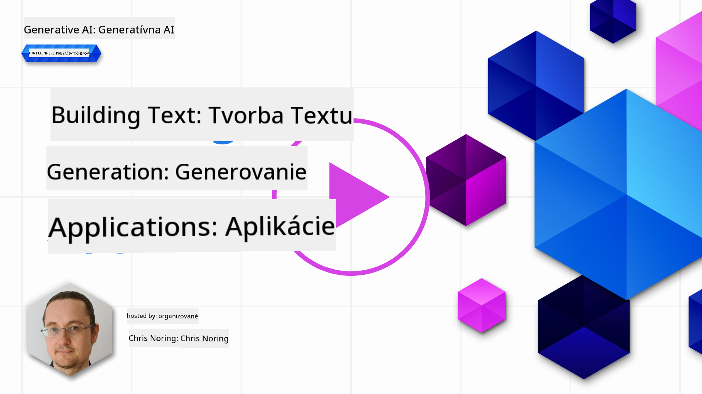

<!--
CO_OP_TRANSLATOR_METADATA:
{
  "original_hash": "5ec6c92b629564538ef397c550adb73e",
  "translation_date": "2025-05-19T17:18:14+00:00",
  "source_file": "06-text-generation-apps/README.md",
  "language_code": "sk"
}
-->
# Budovanie aplikácií na generovanie textu

[](https://aka.ms/gen-ai-lesson6-gh?WT.mc_id=academic-105485-koreyst)

> _(Kliknite na obrázok vyššie, aby ste si pozreli video tejto lekcie)_

Doteraz ste v rámci tohto kurzu videli, že existujú základné koncepty ako prompty a dokonca celá disciplína nazývaná "prompt engineering". Mnoho nástrojov, s ktorými môžete interagovať, ako ChatGPT, Office 365, Microsoft Power Platform a ďalšie, vás podporuje v používaní promptov na dosiahnutie niečoho.

Aby ste mohli pridať takúto skúsenosť do aplikácie, musíte pochopiť koncepty ako prompty, dokončenia a vybrať si knižnicu, s ktorou budete pracovať. Presne to sa naučíte v tejto kapitole.

## Úvod

V tejto kapitole sa naučíte:

- O knižnici openai a jej základných konceptoch.
- Vytvoriť aplikáciu na generovanie textu pomocou openai.
- Pochopiť, ako používať koncepty ako prompt, teplota a tokeny na vytvorenie aplikácie na generovanie textu.

## Ciele učenia

Na konci tejto lekcie budete schopní:

- Vysvetliť, čo je aplikácia na generovanie textu.
- Vytvoriť aplikáciu na generovanie textu pomocou openai.
- Nastaviť svoju aplikáciu tak, aby používala viac alebo menej tokenov a tiež meniť teplotu pre rôznorodý výstup.

## Čo je aplikácia na generovanie textu?

Zvyčajne, keď vytvárate aplikáciu, má nejaké rozhranie ako nasledujúce:

- Na príkazoch založené. Konzolové aplikácie sú typické aplikácie, kde zadáte príkaz a vykoná sa úloha. Napríklad `git` je aplikácia založená na príkazoch.
- Užívateľské rozhranie (UI). Niektoré aplikácie majú grafické užívateľské rozhrania (GUIs), kde klikáte na tlačidlá, zadávate text, vyberáte možnosti a ďalšie.

### Konzolové a UI aplikácie sú obmedzené

Porovnajte to s aplikáciou založenou na príkazoch, kde zadáte príkaz:

- **Je obmedzená**. Nemôžete zadať len akýkoľvek príkaz, len tie, ktoré aplikácia podporuje.
- **Jazykovo špecifická**. Niektoré aplikácie podporujú mnoho jazykov, ale predvolene je aplikácia vytvorená pre konkrétny jazyk, aj keď môžete pridať podporu ďalších jazykov.

### Výhody aplikácií na generovanie textu

Ako sa teda líši aplikácia na generovanie textu?

V aplikácii na generovanie textu máte väčšiu flexibilitu, nie ste obmedzení na súbor príkazov alebo konkrétny vstupný jazyk. Namiesto toho môžete používať prirodzený jazyk na interakciu s aplikáciou. Ďalšou výhodou je, že keďže už interagujete so zdrojom dát, ktorý bol vyškolený na obrovskom korpuse informácií, tradičná aplikácia môže byť obmedzená na to, čo je v databáze.

### Čo môžem vytvoriť s aplikáciou na generovanie textu?

Existuje mnoho vecí, ktoré môžete vytvoriť. Napríklad:

- **Chatbot**. Chatbot, ktorý odpovedá na otázky o témach, ako je vaša spoločnosť a jej produkty, by mohol byť dobrým riešením.
- **Pomocník**. LLMs sú skvelé v veciach ako sumarizácia textu, získavanie poznatkov z textu, produkcia textu ako životopisov a ďalšie.
- **Asistent kódu**. V závislosti od jazykového modelu, ktorý používate, môžete vytvoriť asistenta kódu, ktorý vám pomôže písať kód. Napríklad, môžete použiť produkt ako GitHub Copilot aj ChatGPT, aby vám pomohol písať kód.

## Ako môžem začať?

No, musíte nájsť spôsob, ako integrovať s LLM, čo zvyčajne zahŕňa nasledujúce dva prístupy:

- Použiť API. Tu konštruujete webové požiadavky s vaším promptom a dostanete späť generovaný text.
- Použiť knižnicu. Knižnice pomáhajú zapúzdriť API volania a uľahčiť ich používanie.

## Knižnice/SDKs

Existuje niekoľko známych knižníc na prácu s LLM, ako napríklad:

- **openai**, táto knižnica uľahčuje pripojenie k vášmu modelu a posielanie promptov.

Potom sú tu knižnice, ktoré fungujú na vyššej úrovni ako:

- **Langchain**. Langchain je dobre známy a podporuje Python.
- **Semantic Kernel**. Semantic Kernel je knižnica od Microsoftu, ktorá podporuje jazyky C#, Python a Java.

## Prvá aplikácia pomocou openai

Pozrime sa, ako môžeme vytvoriť našu prvú aplikáciu, aké knižnice potrebujeme, koľko je potrebné a tak ďalej.

### Inštalácia openai

Existuje mnoho knižníc na interakciu s OpenAI alebo Azure OpenAI. Je možné použiť rôzne programovacie jazyky ako C#, Python, JavaScript, Java a ďalšie. Rozhodli sme sa použiť knižnicu `openai` Python, takže ju nainštalujeme pomocou `pip`.

```bash
pip install openai
```

### Vytvorenie zdroja

Musíte vykonať nasledujúce kroky:

- Vytvorte si účet na Azure [https://azure.microsoft.com/free/](https://azure.microsoft.com/free/?WT.mc_id=academic-105485-koreyst).
- Získajte prístup k Azure OpenAI. Prejdite na [https://learn.microsoft.com/azure/ai-services/openai/overview#how-do-i-get-access-to-azure-openai](https://learn.microsoft.com/azure/ai-services/openai/overview#how-do-i-get-access-to-azure-openai?WT.mc_id=academic-105485-koreyst) a požiadajte o prístup.

  > [!NOTE]
  > V čase písania je potrebné požiadať o prístup k Azure OpenAI.

- Nainštalujte Python <https://www.python.org/>
- Vytvorte zdroj služby Azure OpenAI. Pozrite si tento návod, ako [vytvoriť zdroj](https://learn.microsoft.com/azure/ai-services/openai/how-to/create-resource?pivots=web-portal?WT.mc_id=academic-105485-koreyst).

### Nájsť API kľúč a endpoint

V tomto bode musíte oznámiť svojej knižnici `openai`, aký API kľúč použiť. Aby ste našli svoj API kľúč, prejdite do sekcie "Keys and Endpoint" vo vašom Azure OpenAI zdroji a skopírujte hodnotu "Key 1".


Teraz, keď máte tieto informácie skopírované, poďme poučiť knižnice, aby ich používali.

> [!NOTE]
> Stojí za to oddeliť váš API kľúč od vášho kódu. Môžete to urobiť pomocou premenných prostredia.
>
> - Nastavte premennú prostredia `OPENAI_API_KEY` to your API key.
>   `export OPENAI_API_KEY='sk-...'`

### Nastavenie konfigurácie Azure

Ak používate Azure OpenAI, tu je návod, ako nastaviť konfiguráciu:

```python
openai.api_type = 'azure'
openai.api_key = os.environ["OPENAI_API_KEY"]
openai.api_version = '2023-05-15'
openai.api_base = os.getenv("API_BASE")
```

Vyššie nastavujeme nasledujúce:

- `api_type` to `azure`. This tells the library to use Azure OpenAI and not OpenAI.
- `api_key`, this is your API key found in the Azure Portal.
- `api_version`, this is the version of the API you want to use. At the time of writing, the latest version is `2023-05-15`.
- `api_base`, this is the endpoint of the API. You can find it in the Azure Portal next to your API key.

> [!NOTE] > `os.getenv` is a function that reads environment variables. You can use it to read environment variables like `OPENAI_API_KEY` and `API_BASE`. Set these environment variables in your terminal or by using a library like `dotenv`.

## Generate text

The way to generate text is to use the `Completion` trieda. Tu je príklad:

```python
prompt = "Complete the following: Once upon a time there was a"

completion = openai.Completion.create(model="davinci-002", prompt=prompt)
print(completion.choices[0].text)
```

V kóde vyššie vytvoríme objekt dokončenia a zadáme model, ktorý chceme použiť, a prompt. Potom vytlačíme generovaný text.

### Dokončenia chatu

Doteraz ste videli, ako sme používali `Completion` to generate text. But there's another class called `ChatCompletion`, ktorý je viac vhodný pre chatboty. Tu je príklad jeho použitia:

```python
import openai

openai.api_key = "sk-..."

completion = openai.ChatCompletion.create(model="gpt-3.5-turbo", messages=[{"role": "user", "content": "Hello world"}])
print(completion.choices[0].message.content)
```

Viac o tejto funkcii v nadchádzajúcej kapitole.

## Cvičenie - vaša prvá aplikácia na generovanie textu

Teraz, keď sme sa naučili, ako nastaviť a nakonfigurovať openai, je čas vytvoriť vašu prvú aplikáciu na generovanie textu. Na vytvorenie vašej aplikácie postupujte podľa týchto krokov:

1. Vytvorte virtuálne prostredie a nainštalujte openai:

   ```bash
   python -m venv venv
   source venv/bin/activate
   pip install openai
   ```

   > [!NOTE]
   > Ak používate Windows, zadajte `venv\Scripts\activate` instead of `source venv/bin/activate`.

   > [!NOTE]
   > Locate your Azure OpenAI key by going to [https://portal.azure.com/](https://portal.azure.com/?WT.mc_id=academic-105485-koreyst) and search for `Open AI` and select the `Open AI resource` and then select `Keys and Endpoint` and copy the `Key 1` hodnotu.

1. Vytvorte súbor _app.py_ a dajte mu nasledujúci kód:

   ```python
   import openai

   openai.api_key = "<replace this value with your open ai key or Azure OpenAI key>"

   openai.api_type = 'azure'
   openai.api_version = '2023-05-15'
   openai.api_base = "<endpoint found in Azure Portal where your API key is>"
   deployment_name = "<deployment name>"

   # add your completion code
   prompt = "Complete the following: Once upon a time there was a"
   messages = [{"role": "user", "content": prompt}]

   # make completion
   completion = openai.chat.completions.create(model=deployment_name, messages=messages)

   # print response
   print(completion.choices[0].message.content)
   ```

   > [!NOTE]
   > Ak používate Azure OpenAI, musíte nastaviť `api_type` to `azure` and set the `api_key` na váš Azure OpenAI kľúč.

   Mali by ste vidieť výstup ako nasledujúci:

   ```output
    very unhappy _____.

   Once upon a time there was a very unhappy mermaid.
   ```

## Rôzne typy promptov, na rôzne veci

Teraz ste videli, ako generovať text pomocou promptu. Dokonca máte program, ktorý môžete modifikovať a meniť na generovanie rôznych typov textu.

Prompty môžu byť použité na rôzne úlohy. Napríklad:

- **Generovať typ textu**. Napríklad, môžete generovať báseň, otázky pre kvíz atď.
- **Vyhľadávať informácie**. Môžete použiť prompty na vyhľadávanie informácií, ako je nasledujúci príklad 'Čo znamená CORS vo webovom vývoji?'.
- **Generovať kód**. Môžete použiť prompty na generovanie kódu, napríklad vývoj regulárneho výrazu používaného na overenie e-mailov alebo prečo nie generovať celý program, ako webovú aplikáciu?

## Praktickejší prípad použitia: generátor receptov

Predstavte si, že máte doma ingrediencie a chcete niečo uvariť. Na to potrebujete recept. Spôsob, ako nájsť recepty, je použiť vyhľadávač alebo môžete použiť LLM.

Mohli by ste napísať prompt ako:

> "Ukáž mi 5 receptov na jedlo s nasledujúcimi ingredienciami: kuracie mäso, zemiaky a mrkva. Na recept uveďte všetky použité ingrediencie"

Na základe vyššie uvedeného promptu môžete dostať odpoveď podobnú:

```output
1. Roasted Chicken and Vegetables:
Ingredients:
- 4 chicken thighs
- 2 potatoes, cut into cubes
- 2 carrots, cut into cubes
- 2 tablespoons olive oil
- 2 cloves garlic, minced
- 1 teaspoon dried thyme
- 1 teaspoon dried oregano
- Salt and pepper, to taste

2. Chicken and Potato Stew:
Ingredients:
- 2 tablespoons olive oil
- 1 onion, diced
- 2 cloves garlic, minced
- 2 chicken breasts, cut into cubes
- 2 potatoes, cut into cubes
- 2 carrots, cut into cubes
- 1 teaspoon dried oregano
- 1 teaspoon dried thyme
- 1 cup chicken broth
- Salt and pepper, to taste

3. Chicken and Potato Bake:
Ingredients:
- 2 tablespoons olive oil
- 2 chicken breasts, cut into cubes
- 2 potatoes, cut into cubes
- 2 carrots, cut into cubes
- 1 onion, diced
- 2 cloves garlic, minced
- 1 teaspoon dried oregano
- 1 teaspoon dried thyme
- 1 cup chicken broth
- Salt and pepper, to taste

4. Chicken and Potato Soup:
Ingredients:
- 2 tablespoons olive oil
- 1 onion, diced
- 2 cloves garlic, minced
- 2 chicken breasts, cut into cubes
- 2 potatoes, cut into cubes
- 2 carrots, cut into cubes
- 1 teaspoon dried oregano
- 1 teaspoon dried thyme
- 4 cups chicken broth
- Salt and pepper, to taste

5. Chicken and Potato Hash:
Ingredients:
- 2 tablespoons olive oil
- 2 chicken breasts, cut into cubes
- 2 potatoes, cut into cubes
- 2 carrots, cut into cubes
- 1 onion, diced
- 2 cloves garlic, minced
- 1 teaspoon dried oregano
```

Tento výsledok je skvelý, viem, čo variť. V tomto bode, čo by mohlo byť užitočné vylepšenie, je:

- Odstránenie ingrediencií, ktoré nemám rád alebo som na ne alergický.
- Vytvorenie nákupného zoznamu, v prípade, že nemám všetky ingrediencie doma.

Pre vyššie uvedené prípady pridajme ďalší prompt:

> "Prosím, odstráňte recepty s cesnakom, pretože som naň alergický, a nahraďte ho niečím iným. Taktiež, prosím, vytvorte nákupný zoznam pre recepty, s ohľadom na to, že už mám doma kuracie mäso, zemiaky a mrkvu."

Teraz máte nový výsledok, konkrétne:

```output
1. Roasted Chicken and Vegetables:
Ingredients:
- 4 chicken thighs
- 2 potatoes, cut into cubes
- 2 carrots, cut into cubes
- 2 tablespoons olive oil
- 1 teaspoon dried thyme
- 1 teaspoon dried oregano
- Salt and pepper, to taste

2. Chicken and Potato Stew:
Ingredients:
- 2 tablespoons olive oil
- 1 onion, diced
- 2 chicken breasts, cut into cubes
- 2 potatoes, cut into cubes
- 2 carrots, cut into cubes
- 1 teaspoon dried oregano
- 1 teaspoon dried thyme
- 1 cup chicken broth
- Salt and pepper, to taste

3. Chicken and Potato Bake:
Ingredients:
- 2 tablespoons olive oil
- 2 chicken breasts, cut into cubes
- 2 potatoes, cut into cubes
- 2 carrots, cut into cubes
- 1 onion, diced
- 1 teaspoon dried oregano
- 1 teaspoon dried thyme
- 1 cup chicken broth
- Salt and pepper, to taste

4. Chicken and Potato Soup:
Ingredients:
- 2 tablespoons olive oil
- 1 onion, diced
- 2 chicken breasts, cut into cubes
- 2 potatoes, cut into cubes
- 2 carrots, cut into cubes
- 1 teaspoon dried oregano
- 1 teaspoon dried thyme
- 4 cups chicken broth
- Salt and pepper, to taste

5. Chicken and Potato Hash:
Ingredients:
- 2 tablespoons olive oil
- 2 chicken breasts, cut into cubes
- 2 potatoes, cut into cubes
- 2 carrots, cut into cubes
- 1 onion, diced
- 1 teaspoon dried oregano

Shopping List:
- Olive oil
- Onion
- Thyme
- Oregano
- Salt
- Pepper
```

To je vašich päť receptov, bez zmienky o cesnaku a tiež máte nákupný zoznam s ohľadom na to, čo už máte doma.

## Cvičenie - vytvorte generátor receptov

Teraz, keď sme si zahrali scénár, napíšme kód, aby zodpovedal demonštrovanému scénáru. Postupujte podľa týchto krokov:

1. Použite existujúci súbor _app.py_ ako východiskový bod
1. Nájdite premennú `prompt` a zmeňte jej kód na nasledujúci:

   ```python
   prompt = "Show me 5 recipes for a dish with the following ingredients: chicken, potatoes, and carrots. Per recipe, list all the ingredients used"
   ```

   Ak teraz spustíte kód, mali by ste vidieť výstup podobný:

   ```output
   -Chicken Stew with Potatoes and Carrots: 3 tablespoons oil, 1 onion, chopped, 2 cloves garlic, minced, 1 carrot, peeled and chopped, 1 potato, peeled and chopped, 1 bay leaf, 1 thyme sprig, 1/2 teaspoon salt, 1/4 teaspoon black pepper, 1 1/2 cups chicken broth, 1/2 cup dry white wine, 2 tablespoons chopped fresh parsley, 2 tablespoons unsalted butter, 1 1/2 pounds boneless, skinless chicken thighs, cut into 1-inch pieces
   -Oven-Roasted Chicken with Potatoes and Carrots: 3 tablespoons extra-virgin olive oil, 1 tablespoon Dijon mustard, 1 tablespoon chopped fresh rosemary, 1 tablespoon chopped fresh thyme, 4 cloves garlic, minced, 1 1/2 pounds small red potatoes, quartered, 1 1/2 pounds carrots, quartered lengthwise, 1/2 teaspoon salt, 1/4 teaspoon black pepper, 1 (4-pound) whole chicken
   -Chicken, Potato, and Carrot Casserole: cooking spray, 1 large onion, chopped, 2 cloves garlic, minced, 1 carrot, peeled and shredded, 1 potato, peeled and shredded, 1/2 teaspoon dried thyme leaves, 1/4 teaspoon salt, 1/4 teaspoon black pepper, 2 cups fat-free, low-sodium chicken broth, 1 cup frozen peas, 1/4 cup all-purpose flour, 1 cup 2% reduced-fat milk, 1/4 cup grated Parmesan cheese

   -One Pot Chicken and Potato Dinner: 2 tablespoons olive oil, 1 pound boneless, skinless chicken thighs, cut into 1-inch pieces, 1 large onion, chopped, 3 cloves garlic, minced, 1 carrot, peeled and chopped, 1 potato, peeled and chopped, 1 bay leaf, 1 thyme sprig, 1/2 teaspoon salt, 1/4 teaspoon black pepper, 2 cups chicken broth, 1/2 cup dry white wine

   -Chicken, Potato, and Carrot Curry: 1 tablespoon vegetable oil, 1 large onion, chopped, 2 cloves garlic, minced, 1 carrot, peeled and chopped, 1 potato, peeled and chopped, 1 teaspoon ground coriander, 1 teaspoon ground cumin, 1/2 teaspoon ground turmeric, 1/2 teaspoon ground ginger, 1/4 teaspoon cayenne pepper, 2 cups chicken broth, 1/2 cup dry white wine, 1 (15-ounce) can chickpeas, drained and rinsed, 1/2 cup raisins, 1/2 cup chopped fresh cilantro
   ```

   > POZNÁMKA, váš LLM je nedeterministický, takže môžete dostať rôzne výsledky zakaždým, keď spustíte program.

   Skvelé, pozrime sa, ako môžeme veci vylepšiť. Aby sme veci vylepšili, chceme zabezpečiť, aby bol kód flexibilný, takže ingrediencie a počet receptov môžu byť vylepšené a zmenené.

1. Zmeňme kód nasledujúcim spôsobom:

   ```python
   no_recipes = input("No of recipes (for example, 5): ")

   ingredients = input("List of ingredients (for example, chicken, potatoes, and carrots): ")

   # interpolate the number of recipes into the prompt an ingredients
   prompt = f"Show me {no_recipes} recipes for a dish with the following ingredients: {ingredients}. Per recipe, list all the ingredients used"
   ```

   Testovanie kódu môže vyzerať takto:

   ```output
   No of recipes (for example, 5): 3
   List of ingredients (for example, chicken, potatoes, and carrots): milk,strawberries

   -Strawberry milk shake: milk, strawberries, sugar, vanilla extract, ice cubes
   -Strawberry shortcake: milk, flour, baking powder, sugar, salt, unsalted butter, strawberries, whipped cream
   -Strawberry milk: milk, strawberries, sugar, vanilla extract
   ```

### Vylepšenie pridaním filtra a nákupného zoznamu

Teraz máme funkčnú aplikáciu schopnú produkovať recepty a je flexibilná, pretože sa spolieha na vstupy od používateľa, ako počet receptov, ale aj použité ingrediencie.

Na ďalšie vylepšenie chceme pridať nasledujúce:

- **Filtrovanie ingrediencií**. Chceme byť schopní filtrovať ingrediencie, ktoré nemáme radi alebo na ktoré sme alergickí. Aby sme dosiahli túto zmenu, môžeme upraviť náš existujúci prompt a pridať filter podmienku na koniec, ako takto:

  ```python
  filter = input("Filter (for example, vegetarian, vegan, or gluten-free): ")

  prompt = f"Show me {no_recipes} recipes for a dish with the following ingredients: {ingredients}. Per recipe, list all the ingredients used, no {filter}"
  ```

  Vyššie, pridávame `{filter}` na koniec promptu a tiež zachytávame hodnotu filtra od používateľa.

  Príklad vstupu pri spustení programu teraz môže vyzerať takto:

  ```output
  No of recipes (for example, 5): 3
  List of ingredients (for example, chicken, potatoes, and carrots): onion,milk
  Filter (for example, vegetarian, vegan, or gluten-free): no milk

  1. French Onion Soup

  Ingredients:

  -1 large onion, sliced
  -3 cups beef broth
  -1 cup milk
  -6 slices french bread
  -1/4 cup shredded Parmesan cheese
  -1 tablespoon butter
  -1 teaspoon dried thyme
  -1/4 teaspoon salt
  -1/4 teaspoon black pepper

  Instructions:

  1. In a large pot, sauté onions in butter until golden brown.
  2. Add beef broth, milk, thyme, salt, and pepper. Bring to a boil.
  3. Reduce heat and simmer for 10 minutes.
  4. Place french bread slices on soup bowls.
  5. Ladle soup over bread.
  6. Sprinkle with Parmesan cheese.

  2. Onion and Potato Soup

  Ingredients:

  -1 large onion, chopped
  -2 cups potatoes, diced
  -3 cups vegetable broth
  -1 cup milk
  -1/4 teaspoon black pepper

  Instructions:

  1. In a large pot, sauté onions in butter until golden brown.
  2. Add potatoes, vegetable broth, milk, and pepper. Bring to a boil.
  3. Reduce heat and simmer for 10 minutes.
  4. Serve hot.

  3. Creamy Onion Soup

  Ingredients:

  -1 large onion, chopped
  -3 cups vegetable broth
  -1 cup milk
  -1/4 teaspoon black pepper
  -1/4 cup all-purpose flour
  -1/2 cup shredded Parmesan cheese

  Instructions:

  1. In a large pot, sauté onions in butter until golden brown.
  2. Add vegetable broth, milk, and pepper. Bring to a boil.
  3. Reduce heat and simmer for 10 minutes.
  4. In a small bowl, whisk together flour and Parmesan cheese until smooth.
  5. Add to soup and simmer for an additional 5 minutes, or until soup has thickened.
  ```

  Ako vidíte, všetky recepty s mliekom boli vyfiltrované. Ale ak ste laktózovo intolerantní, možno budete chcieť vyfiltrovať aj recepty so syrom, takže je potrebné byť jasný.

- **Vytvorenie nákupného zoznamu**. Chceme vytvoriť nákupný zoznam, s ohľadom na to, čo už máme doma.

  Pre túto funkciu by sme mohli buď skúsiť vyriešiť všetko v jednom promte alebo by sme to mohli rozdeliť na dva prompty. Skúsme druhý prístup. Tu navrhujeme pridať ďalší prompt, ale aby to fungovalo, musíme pridať výsledok prvého promptu ako kontext k druhému promptu.

  Nájdite časť v kóde, ktorá vytlačí výsledok z prvého promptu a pridajte nasledujúci kód nižšie:

  ```python
  old_prompt_result = completion.choices[0].message.content
  prompt = "Produce a shopping list for the generated recipes and please don't include ingredients that I already have."

  new_prompt = f"{old_prompt_result} {prompt}"
  messages = [{"role": "user", "content": new_prompt}]
  completion = openai.Completion.create(engine=deployment_name, messages=messages, max_tokens=1200)

  # print response
  print("Shopping list:")
  print(completion.choices[0].message.content)
  ```

  Všimnite si nasledujúce:

  1. Konštruujeme nový prompt pridaním výsledku z prvého promptu do nového promptu:

     ```python
     new_prompt = f"{old_prompt_result} {prompt}"
     ```

  1. Vytvárame novú požiadavku, ale tiež berieme do úvahy počet tokenov, ktoré sme žiadali v prvom promte, takže tentokrát hovoríme `max_tokens` je 1200.

     ```python
     completion = openai.Completion.create(engine=deployment_name, prompt=new_prompt, max_tokens=1200)
     ```

     Skúšaním tohto kódu teraz dosiahneme nasledujúci výstup:

     ```output
     No of recipes (for example, 5): 2
     List of ingredients (for example, chicken, potatoes, and carrots): apple,flour
     Filter (for example, vegetarian, vegan, or gluten-free): sugar


     -Apple and flour pancakes: 1 cup flour, 1/2 tsp baking powder, 1/2 tsp baking soda, 1/4 tsp salt, 1 tbsp sugar, 1 egg, 1 cup buttermilk or sour milk, 1/4 cup melted butter, 1 Granny Smith apple, peeled and grated
     -Apple fritters: 1-1/2 cups flour, 1 tsp baking powder, 1/4 tsp salt, 1/4 tsp baking soda, 1/4 tsp nutmeg, 1/4 tsp cinnamon, 1/4 tsp allspice, 1/4 cup sugar, 1/4 cup vegetable shortening, 1/4 cup milk, 1 egg, 2 cups shredded, peeled apples
     Shopping list:
     -Flour, baking powder, baking soda, salt, sugar, egg, buttermilk, butter, apple, nutmeg, cinnamon, allspice
     ```

## Vylepšite svoje nastavenie

Čo máme doteraz, je kód, ktorý funguje, ale existujú niektoré úpravy, ktoré by sme mali urobiť, aby sme veci ešte viac vylepšili. Niektoré veci, ktoré by sme mali urobiť, sú:

- **Oddeliť tajomstvá od kódu**, ako API kľúč. Tajomstvá nepatria do kódu a mali by byť uložené na bezpečnom mieste. Na oddelenie tajomstiev od kódu môžeme použiť premenné prostredia a knižnice ako `python-dotenv` to load them from a file. Here's how that would look like in code:

  1. Create a `.env` súbor s nasledujúcim obsahom:

     ```bash
     OPENAI_API_KEY=sk-...
     ```

     > Poznámka, pre Azure, musíte nastaviť nasledujúce premenné prostredia:

     @@CODE_BLOCK_

**Upozornenie**:  
Tento dokument bol preložený pomocou služby AI prekladu [Co-op Translator](https://github.com/Azure/co-op-translator). Aj keď sa snažíme o presnosť, uvedomte si, že automatizované preklady môžu obsahovať chyby alebo nepresnosti. Pôvodný dokument v jeho rodnom jazyku by mal byť považovaný za autoritatívny zdroj. Pre kritické informácie sa odporúča profesionálny ľudský preklad. Nie sme zodpovední za žiadne nedorozumenia alebo nesprávne interpretácie vyplývajúce z použitia tohto prekladu.