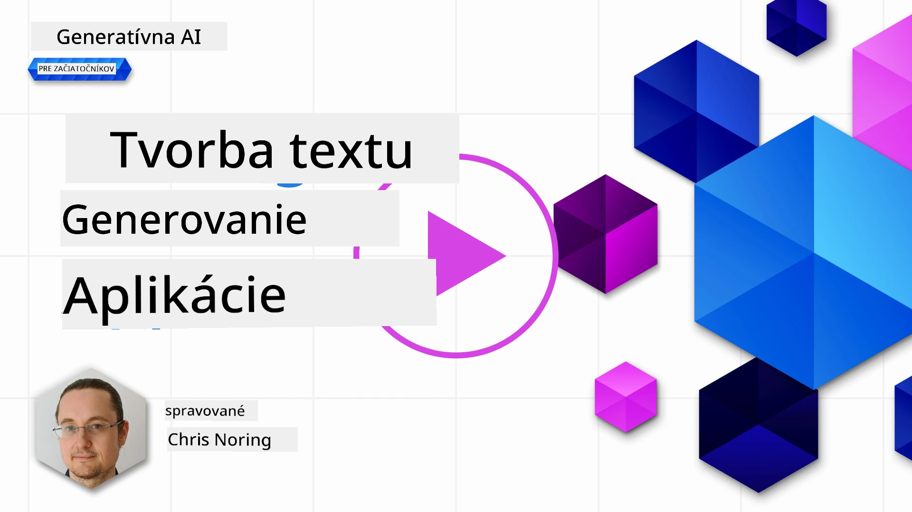

# Vytváranie aplikácií na generovanie textu

[](https://youtu.be/0Y5Luf5sRQA?si=t_xVg0clnAI4oUFZ)

> _(Kliknite na obrázok vyššie pre zobrazenie videa tejto lekcie)_

Doteraz ste v rámci tohto kurzu videli, že existujú základné koncepty ako prompt a dokonca celá disciplína nazývaná "prompt engineering". Mnohé nástroje, s ktorými môžete komunikovať, napríklad ChatGPT, Office 365, Microsoft Power Platform a ďalšie, vás podporujú v používaní promptov na dosiahnutie niečoho.

Aby ste mohli takúto skúsenosť pridať do aplikácie, musíte pochopiť koncepty ako prompty, completions a vybrať knižnicu na prácu s nimi. Presne to sa naučíte v tejto kapitole.

## Úvod

V tejto kapitole sa naučíte:

- Spoznáte knižnicu openai a jej základné koncepty.
- Vytvoríte aplikáciu na generovanie textu pomocou openai.
- Pochopíte, ako použiť koncepty ako prompt, temperature a tokens na vytvorenie aplikácie na generovanie textu.

## Ciele učenia

Na konci tejto lekcie budete schopní:

- Vysvetliť, čo je aplikácia na generovanie textu.
- Vytvoriť aplikáciu na generovanie textu pomocou openai.
- Nastaviť svoju aplikáciu tak, aby používala viac alebo menej tokenov a tiež meniť teplotu pre rôznorodý výstup.

## Čo je to aplikácia na generovanie textu?

Zvyčajne, keď vytvárate aplikáciu, má nejaké rozhranie, napríklad takéto:

- Príkazové rozhranie. Konzolové aplikácie sú typické aplikácie, kde napíšete príkaz a vykoná sa nejaká úloha. Napríklad `git` je aplikácia založená na príkazoch.
- Užívateľské rozhranie (UI). Niektoré aplikácie majú grafické užívateľské rozhranie (GUI), kde klikáte na tlačidlá, zadávate text, vyberáte možnosti a podobne.

### Konzolové a UI aplikácie sú obmedzené

Porovnajte to s aplikáciou založenou na príkazoch, kde zadávate príkaz:

- **Je to obmedzené**. Nemôžete zadať akýkoľvek príkaz, len tie, ktoré aplikácia podporuje.
- **Jazykovo špecifické**. Niektoré aplikácie podporujú viacero jazykov, ale predvolene je aplikácia vytvorená pre konkrétny jazyk, aj keď môžete pridať podporu ďalších jazykov.

### Výhody aplikácií na generovanie textu

Ako sa teda líši aplikácia na generovanie textu?

V aplikácii na generovanie textu máte väčšiu flexibilitu, nie ste viazaní na súbor príkazov alebo konkrétny vstupný jazyk. Namiesto toho môžete použiť prirodzený jazyk na interakciu s aplikáciou. Ďalšou výhodou je, že už komunikujete so zdrojom dát, ktorý bol trénovaný na rozsiahlej zbierke informácií, zatiaľ čo tradičná aplikácia môže byť obmedzená na to, čo je v databáze.

### Čo môžem vytvoriť s aplikáciou na generovanie textu?

Môžete vytvoriť mnoho vecí. Napríklad:

- **Chatbot**. Chatbot odpovedajúci na otázky o témach, ako je vaša spoločnosť a jej produkty, môže byť dobrá voľba.
- **Asistent**. LLM sú skvelé na zhrnutie textu, získavanie poznatkov z textu, tvorbu textov ako životopisy a iné.
- **Asistent pre kódovanie**. V závislosti od použitého jazykového modelu môžete vytvoriť asistenta pre písanie kódu. Napríklad môžete použiť produkty ako GitHub Copilot alebo ChatGPT, aby vám pomohli písať kód.

## Ako môžem začať?

Musíte nájsť spôsob, ako integrovať LLM, čo zvyčajne zahŕňa tieto dve prístupy:

- Použiť API. Tu vytvárate webové požiadavky so svojím promptom a získavate späť generovaný text.
- Použiť knižnicu. Knižnice zjednodušujú volania API a uľahčujú ich použitie.

## Knižnice/SDK

Existuje niekoľko známych knižníc na prácu s LLM, ako napríklad:

- **openai**, táto knižnica umožňuje ľahké pripojenie k vášmu modelu a odosielanie promptov.

Potom sú tu knižnice, ktoré operujú na vyššej úrovni, napríklad:

- **Langchain**. Langchain je známy a podporuje Python.
- **Semantic Kernel**. Semantic Kernel je knižnica od Microsoftu podporujúca jazyky C#, Python a Java.

## Prvá aplikácia pomocou openai

Pozrime sa, ako môžeme vytvoriť našu prvú aplikáciu, aké knižnice potrebujeme, koľko je potrebné a podobne.

### Inštalácia openai

Existuje mnoho knižníc na interakciu s OpenAI alebo Azure OpenAI. Je možné použiť rôzne programovacie jazyky, ako C#, Python, JavaScript, Java a ďalšie. Rozhodli sme sa použiť Python knižnicu `openai`, a preto použijeme `pip` na jej inštaláciu.

```bash
pip install openai
```

### Vytvorenie zdroja

Musíte vykonať nasledovné kroky:

- Vytvorte si účet na Azure [https://azure.microsoft.com/free/](https://azure.microsoft.com/free/?WT.mc_id=academic-105485-koreyst).
- Získajte prístup k Azure OpenAI. Navštívte [https://learn.microsoft.com/azure/ai-foundry/openai/overview#how-do-i-get-access-to-azure-openai](https://learn.microsoft.com/azure/ai-foundry/openai/overview#how-do-i-get-access-to-azure-openai?WT.mc_id=academic-105485-koreyst) a požiadajte o prístup.

  > [!NOTE]
  > V čase písania je potrebné požiadať o prístup k Azure OpenAI.

- Nainštalujte Python <https://www.python.org/>
- Vytvorte Azure OpenAI Service zdroj. Pozrite si tento návod ako [vytvoriť zdroj](https://learn.microsoft.com/azure/ai-foundry/openai/how-to/create-resource?pivots=web-portal?WT.mc_id=academic-105485-koreyst).

### Nájdite API kľúč a endpoint

Teraz potrebujete povedať knižnici `openai`, aký API kľúč má používať. Na nájdenie API kľúča prejdite do sekcie "Keys and Endpoint" vášho Azure OpenAI zdroja a skopírujte hodnotu "Key 1".


Teraz, keď máte tieto informácie skopírované, nechajme knižnice, aby ich používali.

> [!NOTE]
> Je vhodné oddeliť svoj API kľúč od kódu. Môžete tak urobiť pomocou premenných prostredia.
>
> - Nastavte premennú prostredia `OPENAI_API_KEY` na svoj API kľúč.
>   `export OPENAI_API_KEY='sk-...'`

### Nastavenie konfigurácie Azure

Ak používate Azure OpenAI (teraz súčasť Microsoft Foundry), takto nastavíte konfiguráciu. Používame štandardného klienta `OpenAI` smerujúceho na endpoint Azure OpenAI `/openai/v1/`, ktorý pracuje s Responses API a nevyžaduje `api_version`:

```python
import os
from openai import OpenAI

client = OpenAI(
    api_key=os.environ["AZURE_OPENAI_API_KEY"],
    base_url=f"{os.environ['AZURE_OPENAI_ENDPOINT'].rstrip('/')}/openai/v1/",
)
```

Hore nastavujeme nasledovné:

- `api_key`, to je váš API kľúč nájdený v Azure Portáli alebo Microsoft Foundry portáli.
- `base_url`, to je endpoint vašej Foundry služby s pridaným `/openai/v1/`. Stabilný endpoint v1 funguje naprieč OpenAI a Azure OpenAI bez riadenia `api_version`.

> [!NOTE] > `os.environ` načíta premenné prostredia. Môžete ho použiť na načítanie premenných ako `AZURE_OPENAI_API_KEY` a `AZURE_OPENAI_ENDPOINT`. Nastavte tieto premenné v termináli alebo pomocou knižnice ako `dotenv`.

## Generovanie textu

Text sa generuje použitím Responses API cez metódu `responses.create`. Tu je príklad:

```python
prompt = "Complete the following: Once upon a time there was a"

response = client.responses.create(
    model="gpt-5-mini",  # toto je názov vašeho nasadenia modelu
    input=prompt,
    store=False,
)
print(response.output_text)
```

V hore uvedenom kóde vytvárame odpoveď a zadávame model, ktorý chceme použiť, a prompt. Potom vypisujeme generovaný text cez `response.output_text`.

### Viackolové konverzácie

Responses API je vhodné na generovanie textu na jedno kolo aj pre viackolové chatboty - poskytnete zoznam správ v `input` na vytvorenie konverzácie:

```python
from openai import OpenAI

client = OpenAI(api_key="sk-...")

response = client.responses.create(model="gpt-5-mini", input="Hello world", store=False)
print(response.output_text)
```

Viac o tejto funkcii v nadchádzajúcej kapitole.

## Cvičenie - vaša prvá aplikácia na generovanie textu

Teraz, keď sme sa naučili nastaviť a konfigurovať openai, je čas vytvoriť vašu prvú aplikáciu na generovanie textu. Postupujte podľa týchto krokov:

1. Vytvorte virtuálne prostredie a nainštalujte openai:

   ```bash
   python -m venv venv
   source venv/bin/activate
   pip install openai
   ```

   > [!NOTE]
   > Ak používate Windows, zadajte `venv\Scripts\activate` namiesto `source venv/bin/activate`.

   > [!NOTE]
   > Nájdite svoj Azure OpenAI kľúč tak, že prejdete na [https://portal.azure.com/](https://portal.azure.com/?WT.mc_id=academic-105485-koreyst), vyhľadáte `Open AI`, vyberiete `Open AI resource`, potom vyberiete `Keys and Endpoint` a skopírujete hodnotu `Key 1`.

1. Vytvorte súbor _app.py_ a vložte do neho tento kód:

   ```python
   import os
   from openai import OpenAI

   client = OpenAI(
       api_key="<replace this value with your Azure OpenAI key>",
       base_url="<endpoint found in Azure Portal>/openai/v1/",
   )
   deployment_name = "<deployment name>"

   # pridajte váš kód na dokončenie
   prompt = "Complete the following: Once upon a time there was a"

   # vykonajte požiadavku pomocou API Responses
   response = client.responses.create(model=deployment_name, input=prompt, store=False)

   # vytlačte odpoveď
   print(response.output_text)
   ```

   > [!NOTE]
   > Ak používate čisté OpenAI (nie Azure), použite `client = OpenAI(api_key="<nahraďte túto hodnotu vaším OpenAI kľúčom>")` (bez `base_url`) a namiesto nasadeného názvu modelu dajte názov modelu ako `gpt-5-mini`.

   Mali by ste vidieť výstup ako tento:

   ```output
    very unhappy _____.

   Once upon a time there was a very unhappy mermaid.
   ```

## Rôzne typy promptov pre rôzne úlohy

Teraz ste videli, ako generovať text pomocou promptu. Dokonca máte program, ktorý beží a môžete ho upravovať a meniť na generovanie rôznych typov textov.

Prompty sa dajú použiť na všetky možné úlohy. Napríklad:

- **Generovanie typu textu**. Napríklad môžete generovať báseň, otázky do kvízu a podobne.
- **Vyhľadávanie informácií**. Pomocou promptov môžete hľadať informácie, napríklad "Čo znamená CORS vo webovom vývoji?".
- **Generovanie kódu**. Pomocou promptov môžete generovať kód, napríklad vyvinúť regulárny výraz na validáciu e-mailov alebo rovno vytvoriť celý program, napríklad webovú aplikáciu?

## Praktickejší prípad použitia: generátor receptov

Predstavte si, že máte doma suroviny a chcete niečo uvariť. Potrebujete recept. Jedným zo spôsobov, ako nájsť recepty, je použiť vyhľadávač, alebo môžete použiť LLM.

Môžete napísať prompt takto:

> "Ukáž mi 5 receptov na jedlo so zložkami: kuracie mäso, zemiaky a mrkva. Pre každý recept uveď všetky použité prísady"

Na základe vyššie uvedeného promptu môžete získať odpoveď podobnú:

```output
1. Roasted Chicken and Vegetables:
Ingredients:
- 4 chicken thighs
- 2 potatoes, cut into cubes
- 2 carrots, cut into cubes
- 2 tablespoons olive oil
- 2 cloves garlic, minced
- 1 teaspoon dried thyme
- 1 teaspoon dried oregano
- Salt and pepper, to taste

2. Chicken and Potato Stew:
Ingredients:
- 2 tablespoons olive oil
- 1 onion, diced
- 2 cloves garlic, minced
- 2 chicken breasts, cut into cubes
- 2 potatoes, cut into cubes
- 2 carrots, cut into cubes
- 1 teaspoon dried oregano
- 1 teaspoon dried thyme
- 1 cup chicken broth
- Salt and pepper, to taste

3. Chicken and Potato Bake:
Ingredients:
- 2 tablespoons olive oil
- 2 chicken breasts, cut into cubes
- 2 potatoes, cut into cubes
- 2 carrots, cut into cubes
- 1 onion, diced
- 2 cloves garlic, minced
- 1 teaspoon dried oregano
- 1 teaspoon dried thyme
- 1 cup chicken broth
- Salt and pepper, to taste

4. Chicken and Potato Soup:
Ingredients:
- 2 tablespoons olive oil
- 1 onion, diced
- 2 cloves garlic, minced
- 2 chicken breasts, cut into cubes
- 2 potatoes, cut into cubes
- 2 carrots, cut into cubes
- 1 teaspoon dried oregano
- 1 teaspoon dried thyme
- 4 cups chicken broth
- Salt and pepper, to taste

5. Chicken and Potato Hash:
Ingredients:
- 2 tablespoons olive oil
- 2 chicken breasts, cut into cubes
- 2 potatoes, cut into cubes
- 2 carrots, cut into cubes
- 1 onion, diced
- 2 cloves garlic, minced
- 1 teaspoon dried oregano
```

Tento výsledok je skvelý, viem, čo uvariť. V tomto bode by mohli byť užitočné zlepšenia:

- Filtrovanie ingrediencií, ktoré nemám rád alebo na ktoré som alergický.
- Vytvorenie nákupného zoznamu, keby som doma nemal všetky prísady.

Pre tieto prípady pridajme ďalší prompt:

> "Prosím odstráň recepty s cesnakom, lebo som naň alergický a nahraď ho niečím iným. Tiež prosím vytvor nákupný zoznam pre recepty, pričom ber do úvahy, že už mám doma kuracie mäso, zemiaky a mrkvu."

Teraz máte nový výsledok, a to:

```output
1. Roasted Chicken and Vegetables:
Ingredients:
- 4 chicken thighs
- 2 potatoes, cut into cubes
- 2 carrots, cut into cubes
- 2 tablespoons olive oil
- 1 teaspoon dried thyme
- 1 teaspoon dried oregano
- Salt and pepper, to taste

2. Chicken and Potato Stew:
Ingredients:
- 2 tablespoons olive oil
- 1 onion, diced
- 2 chicken breasts, cut into cubes
- 2 potatoes, cut into cubes
- 2 carrots, cut into cubes
- 1 teaspoon dried oregano
- 1 teaspoon dried thyme
- 1 cup chicken broth
- Salt and pepper, to taste

3. Chicken and Potato Bake:
Ingredients:
- 2 tablespoons olive oil
- 2 chicken breasts, cut into cubes
- 2 potatoes, cut into cubes
- 2 carrots, cut into cubes
- 1 onion, diced
- 1 teaspoon dried oregano
- 1 teaspoon dried thyme
- 1 cup chicken broth
- Salt and pepper, to taste

4. Chicken and Potato Soup:
Ingredients:
- 2 tablespoons olive oil
- 1 onion, diced
- 2 chicken breasts, cut into cubes
- 2 potatoes, cut into cubes
- 2 carrots, cut into cubes
- 1 teaspoon dried oregano
- 1 teaspoon dried thyme
- 4 cups chicken broth
- Salt and pepper, to taste

5. Chicken and Potato Hash:
Ingredients:
- 2 tablespoons olive oil
- 2 chicken breasts, cut into cubes
- 2 potatoes, cut into cubes
- 2 carrots, cut into cubes
- 1 onion, diced
- 1 teaspoon dried oregano

Shopping List:
- Olive oil
- Onion
- Thyme
- Oregano
- Salt
- Pepper
```

To sú vaše päť receptov bez spomenutia cesnaku a tiež máte nákupný zoznam podľa toho, čo už doma máte.

## Cvičenie - vytvorte generátor receptov

Keď sme prešli príkladom, napíšme kód, ktorý zodpovedá demonštrovanému scénaru. Postupujte podľa týchto krokov:

1. Použite existujúci súbor _app.py_ ako východisko.
1. Nájdite premennú `prompt` a zmeňte jej kód na toto:

   ```python
   prompt = "Show me 5 recipes for a dish with the following ingredients: chicken, potatoes, and carrots. Per recipe, list all the ingredients used"
   ```

   Ak teraz spustíte kód, mali by ste vidieť výstup podobný tomuto:

   ```output
   -Chicken Stew with Potatoes and Carrots: 3 tablespoons oil, 1 onion, chopped, 2 cloves garlic, minced, 1 carrot, peeled and chopped, 1 potato, peeled and chopped, 1 bay leaf, 1 thyme sprig, 1/2 teaspoon salt, 1/4 teaspoon black pepper, 1 1/2 cups chicken broth, 1/2 cup dry white wine, 2 tablespoons chopped fresh parsley, 2 tablespoons unsalted butter, 1 1/2 pounds boneless, skinless chicken thighs, cut into 1-inch pieces
   -Oven-Roasted Chicken with Potatoes and Carrots: 3 tablespoons extra-virgin olive oil, 1 tablespoon Dijon mustard, 1 tablespoon chopped fresh rosemary, 1 tablespoon chopped fresh thyme, 4 cloves garlic, minced, 1 1/2 pounds small red potatoes, quartered, 1 1/2 pounds carrots, quartered lengthwise, 1/2 teaspoon salt, 1/4 teaspoon black pepper, 1 (4-pound) whole chicken
   -Chicken, Potato, and Carrot Casserole: cooking spray, 1 large onion, chopped, 2 cloves garlic, minced, 1 carrot, peeled and shredded, 1 potato, peeled and shredded, 1/2 teaspoon dried thyme leaves, 1/4 teaspoon salt, 1/4 teaspoon black pepper, 2 cups fat-free, low-sodium chicken broth, 1 cup frozen peas, 1/4 cup all-purpose flour, 1 cup 2% reduced-fat milk, 1/4 cup grated Parmesan cheese

   -One Pot Chicken and Potato Dinner: 2 tablespoons olive oil, 1 pound boneless, skinless chicken thighs, cut into 1-inch pieces, 1 large onion, chopped, 3 cloves garlic, minced, 1 carrot, peeled and chopped, 1 potato, peeled and chopped, 1 bay leaf, 1 thyme sprig, 1/2 teaspoon salt, 1/4 teaspoon black pepper, 2 cups chicken broth, 1/2 cup dry white wine

   -Chicken, Potato, and Carrot Curry: 1 tablespoon vegetable oil, 1 large onion, chopped, 2 cloves garlic, minced, 1 carrot, peeled and chopped, 1 potato, peeled and chopped, 1 teaspoon ground coriander, 1 teaspoon ground cumin, 1/2 teaspoon ground turmeric, 1/2 teaspoon ground ginger, 1/4 teaspoon cayenne pepper, 2 cups chicken broth, 1/2 cup dry white wine, 1 (15-ounce) can chickpeas, drained and rinsed, 1/2 cup raisins, 1/2 cup chopped fresh cilantro
   ```

   > POZNÁMKA, váš LLM je nedeterministický, takže výsledky sa môžu líšiť pri každom spustení programu.

   Skvelé, pozrime sa, ako to môžeme vylepšiť. Pre vylepšenie chceme zabezpečiť, aby bol kód flexibilný, aby bolo možné meniť ingrediencie aj počet receptov.

1. Zmeňme kód nasledujúcim spôsobom:

   ```python
   no_recipes = input("No of recipes (for example, 5): ")

   ingredients = input("List of ingredients (for example, chicken, potatoes, and carrots): ")

   # vložte počet receptov do výzvy a ingrediencií
   prompt = f"Show me {no_recipes} recipes for a dish with the following ingredients: {ingredients}. Per recipe, list all the ingredients used"
   ```

   Testovacie spustenie kódu môže vyzerať takto:

   ```output
   No of recipes (for example, 5): 3
   List of ingredients (for example, chicken, potatoes, and carrots): milk,strawberries

   -Strawberry milk shake: milk, strawberries, sugar, vanilla extract, ice cubes
   -Strawberry shortcake: milk, flour, baking powder, sugar, salt, unsalted butter, strawberries, whipped cream
   -Strawberry milk: milk, strawberries, sugar, vanilla extract
   ```

### Zlepšenie pridaním filtra a nákupného zoznamu

Teraz máme funkčnú aplikáciu, ktorá vie vytvárať recepty a je flexibilná, pretože závisí od vstupov od používateľa, či už v počte receptov alebo použitých ingredienciách.

Pre ďalšie vylepšenie chceme pridať nasledujúce:

- **Filtrovať ingrediencie**. Chceme byť schopní filtrovať ingrediencie, ktoré nemáme radi alebo na ktoré sme alergickí. Na dosiahnutie tejto zmeny môžeme upraviť existujúci prompt a pridať na koniec podmienku filtra nasledovne:

  ```python
  filter = input("Filter (for example, vegetarian, vegan, or gluten-free): ")

  prompt = f"Show me {no_recipes} recipes for a dish with the following ingredients: {ingredients}. Per recipe, list all the ingredients used, no {filter}"
  ```

  Hore pridávame `{filter}` na koniec promptu a zároveň zachytávame hodnotu filtra od používateľa.

  Príklad vstupu pri spustení programu teraz môže vyzerať takto:

  ```output
  No of recipes (for example, 5): 3
  List of ingredients (for example, chicken, potatoes, and carrots): onion,milk
  Filter (for example, vegetarian, vegan, or gluten-free): no milk

  1. French Onion Soup

  Ingredients:

  -1 large onion, sliced
  -3 cups beef broth
  -1 cup milk
  -6 slices french bread
  -1/4 cup shredded Parmesan cheese
  -1 tablespoon butter
  -1 teaspoon dried thyme
  -1/4 teaspoon salt
  -1/4 teaspoon black pepper

  Instructions:

  1. In a large pot, sauté onions in butter until golden brown.
  2. Add beef broth, milk, thyme, salt, and pepper. Bring to a boil.
  3. Reduce heat and simmer for 10 minutes.
  4. Place french bread slices on soup bowls.
  5. Ladle soup over bread.
  6. Sprinkle with Parmesan cheese.

  2. Onion and Potato Soup

  Ingredients:

  -1 large onion, chopped
  -2 cups potatoes, diced
  -3 cups vegetable broth
  -1 cup milk
  -1/4 teaspoon black pepper

  Instructions:

  1. In a large pot, sauté onions in butter until golden brown.
  2. Add potatoes, vegetable broth, milk, and pepper. Bring to a boil.
  3. Reduce heat and simmer for 10 minutes.
  4. Serve hot.

  3. Creamy Onion Soup

  Ingredients:

  -1 large onion, chopped
  -3 cups vegetable broth
  -1 cup milk
  -1/4 teaspoon black pepper
  -1/4 cup all-purpose flour
  -1/2 cup shredded Parmesan cheese

  Instructions:

  1. In a large pot, sauté onions in butter until golden brown.
  2. Add vegetable broth, milk, and pepper. Bring to a boil.
  3. Reduce heat and simmer for 10 minutes.
  4. In a small bowl, whisk together flour and Parmesan cheese until smooth.
  5. Add to soup and simmer for an additional 5 minutes, or until soup has thickened.
  ```

  Ako vidíte, všetky recepty obsahujúce mlieko boli vytiahnuté. Ak máte laktózovú intoleranciu, možno by ste chceli filtrovať recepty obsahujúce aj syr, preto treba byť jasný.


- **Vytvorte nákupný zoznam**. Chceme vytvoriť nákupný zoznam, berúc do úvahy, čo už máme doma.

  Pre túto funkciu môžeme buď skúsiť vyriešiť všetko v jednom promptu, alebo to rozdeliť do dvoch promptov. Skúsme druhý prístup. Tu navrhujeme pridať ďalší prompt, no aby to fungovalo, musíme pridať výsledok prvého promptu ako kontext do druhého promptu.

  Nájdite časť v kóde, ktorá vypisuje výsledok z prvého promptu a pod ňu pridajte nasledujúci kód:

  ```python
  old_prompt_result = response.output_text
  prompt = "Produce a shopping list for the generated recipes and please don't include ingredients that I already have."

  new_prompt = f"{old_prompt_result} {prompt}"
  response = client.responses.create(model=deployment_name, input=new_prompt, max_output_tokens=1200, store=False)

  # vytlačiť odpoveď
  print("Shopping list:")
  print(response.output_text)
  ```

  Všímajte si nasledujúce:

  1. Konštruujeme nový prompt pridaním výsledku z prvého promptu do nového promptu:

     ```python
     new_prompt = f"{old_prompt_result} {prompt}"
     ```

  1. Vykonáme nový dopyt, pričom berieme do úvahy počet tokenov, ktoré sme požadovali v prvom promte, takže tentokrát nastavujeme `max_output_tokens` na 1200.

     ```python
     response = client.responses.create(model=deployment_name, input=new_prompt, max_output_tokens=1200, store=False)
     ```

     Po vyskúšaní tohto kódu dostávame nasledujúci výstup:

     ```output
     No of recipes (for example, 5): 2
     List of ingredients (for example, chicken, potatoes, and carrots): apple,flour
     Filter (for example, vegetarian, vegan, or gluten-free): sugar


     -Apple and flour pancakes: 1 cup flour, 1/2 tsp baking powder, 1/2 tsp baking soda, 1/4 tsp salt, 1 tbsp sugar, 1 egg, 1 cup buttermilk or sour milk, 1/4 cup melted butter, 1 Granny Smith apple, peeled and grated
     -Apple fritters: 1-1/2 cups flour, 1 tsp baking powder, 1/4 tsp salt, 1/4 tsp baking soda, 1/4 tsp nutmeg, 1/4 tsp cinnamon, 1/4 tsp allspice, 1/4 cup sugar, 1/4 cup vegetable shortening, 1/4 cup milk, 1 egg, 2 cups shredded, peeled apples
     Shopping list:
     -Flour, baking powder, baking soda, salt, sugar, egg, buttermilk, butter, apple, nutmeg, cinnamon, allspice
     ```

## Vylepšite svoje nastavenie

To, čo máme zatiaľ, je funkčný kód, ale existuje niekoľko vylepšení, ktoré by sme mali vykonať, aby sme to ešte zlepšili. Niektoré z nich sú:

- **Oddeliť tajné údaje od kódu**, ako napríklad API kľúč. Tajné údaje nepatria priamo do kódu a mali by byť uložené na bezpečnom mieste. Na oddelenie tajných údajov od kódu môžeme použiť premenné prostredia a knižnice ako `python-dotenv` na ich načítanie zo súboru. Takto by to vyzeralo v kóde:

  1. Vytvorte súbor `.env` s nasledujúcim obsahom:

     ```bash
     OPENAI_API_KEY=sk-...
     ```

     > Poznámka, pre Azure OpenAI v Microsoft Foundry je potrebné namiesto toho nastaviť nasledujúce premenné prostredia:

     ```bash
     AZURE_OPENAI_API_KEY=<replace>
     AZURE_OPENAI_ENDPOINT=<replace>
     AZURE_OPENAI_API_VERSION=2024-10-21
     ```

     V kóde by ste načítali premenné prostredia takto:

     ```python
     import os
     from dotenv import load_dotenv
     from openai import OpenAI

     load_dotenv()

     client = OpenAI(api_key=os.environ["OPENAI_API_KEY"])
     ```

- **Slovo o dĺžke tokenov**. Mali by sme zvážiť, koľko tokenov potrebujeme na generovanie požadovaného textu. Tokeny stoja peniaze, preto by sme mali byť tam, kde je to možné, ekonomickí v počte použitých tokenov. Napríklad, môžeme prompt naformulovať tak, aby sme použili menej tokenov?

  Na zmenu počtu použitých tokenov môžete použiť parameter `max_output_tokens`. Napríklad, ak chcete použiť 100 tokenov, urobíte to takto:

  ```python
  response = client.responses.create(model=deployment, input=prompt, max_output_tokens=100, store=False)
  ```

- **Experimentovanie s teplotou**. Teplota je niečo, čo sme zatiaľ nespomenuli, ale je to dôležitý parameter pre správanie nášho programu. Čím vyššia hodnota teploty, tým náhodnejší bude výstup. Naopak, čím nižšia hodnota teploty, tým predvídateľnejší výstup bude. Zvážte, či chcete v svojom výstupe variabilitu, alebo nie.

  Na zmenu teploty môžete použiť parameter `temperature`. Napríklad, ak chcete použiť teplotu 0.5, urobíte to takto:

  ```python
  response = client.responses.create(model=deployment, input=prompt, temperature=0.5, store=False)
  ```

  > Poznámka, čím bližšie k 1.0, tým je výstup rozmanitejší.

- **Modely na uvažovanie nepoužívajú `temperature`**. Toto je dôležitá zmena pre rok 2026. Aktuálne, nepoužívané modely v Microsoft Foundry sú **modely na uvažovanie** (rodina GPT-5, o-series) – a tie **nepodporujú `temperature` ani `top_p`** (ani `max_tokens`; používajte `max_output_tokens`). Ak pošlete parameter `temperature` do modelu `gpt-5-mini`, dostanete chybu „parameter nie je podporovaný“. Ak chcete vyskúšať príklad teploty vyššie, použite model, ktorý stále podporuje ovládanie sampling - napríklad otvorený model **Llama** ako `Llama-3.3-70B-Instruct` z [Microsoft Foundry model catalog](https://ai.azure.com/catalog/models?WT.mc_id=academic-105485-koreyst), volaný cez endpoint Foundry Models / Azure AI Inference (rovnakým spôsobom ako príklady `githubmodels-*`). Pre modely na uvažovanie ako GPT-5, riadite výstup inak:
  - **Prompt engineering** - jasné inštrukcie, príklady a štruktúrovaný výstup (pozri lekciu [04 - Prompt Engineering](../04-prompt-engineering-fundamentals/README.md?WT.mc_id=academic-105485-koreyst)) robia prácu, ktorú kedysi robili ovládacie prvky sampling.
  - **Ovládanie uvažovania** - parametre ako úsilie uvažovania/obsiahlosť balansujú hĺbku uvažovania oproti latencii a nákladom.

  Stručne: `temperature`/`top_p` sú stále platné u mnohých modelov (Llama, Mistral, Phi, a rodina GPT-4.x - hoci GPT-4.x je postupne zrušený), ale smerovanie je prompt engineering + ovládanie uvažovania na modeloch na uvažovanie, ako je GPT-5.

## Zadanie

Pre toto zadanie si môžete vybrať, čo chcete postaviť.

Tu sú niektoré návrhy:

- Vyladte aplikáciu generátora receptov, aby ste ju ešte viac vylepšili. Hrajte sa s hodnotami teploty a promptami, aby ste videli, čo všetko vymyslíte.
- Vytvorte "študijného kamaráta". Táto aplikácia by mala byť schopná odpovedať na otázky o téme, napríklad Python, môžete mať prompt ako "Čo je určitá téma v Pythone?", alebo prompt, ktorý povie, ukáž mi kód na určitú tému atď.
- Historický bot, oživte históriu, nastavte bota, aby hral určitú historickú postavu a pýtajte sa ho otázky o jej živote a časoch.

## Riešenie

### Študijný kamarát

Nižšie je štartovací prompt, skúste ho použiť a upraviť podľa seba.

```text
- "You're an expert on the Python language

    Suggest a beginner lesson for Python in the following format:

    Format:
    - concepts:
    - brief explanation of the lesson:
    - exercise in code with solutions"
```

### Historický bot

Tu sú niektoré prompty, ktoré môžete použiť:

```text
- "You are Abe Lincoln, tell me about yourself in 3 sentences, and respond using grammar and words like Abe would have used"
- "You are Abe Lincoln, respond using grammar and words like Abe would have used:

   Tell me about your greatest accomplishments, in 300 words"
```

## Kontrola vedomostí

Čo robí pojem teplota?

1. Riadi, ako náhodný je výstup.
1. Riadi, aká veľká je odpoveď.
1. Riadi, koľko tokenov sa použije.

## 🚀 Výzva

Pri práci na zadaní skúste meniť teplotu, nastavte ju na 0, 0.5 a 1. Pamätajte, že 0 znamená najmenej variabilný a 1 najviac. Ktorá hodnota je najlepšia pre vašu aplikáciu?

## Skvelá práca! Pokračujte v učení

Po dokončení tejto lekcie si pozrite našu [kolekciu Generatívneho AI vzdelávania](https://aka.ms/genai-collection?WT.mc_id=academic-105485-koreyst), aby ste naďalej zlepšovali svoje vedomosti o Generatívnej AI!

Prejdite do lekcie 7, kde si pozrieme, ako [vytvárať chatovacie aplikácie](../07-building-chat-applications/README.md?WT.mc_id=academic-105485-koreyst)!

---

<!-- CO-OP TRANSLATOR DISCLAIMER START -->
**Vyhlásenie o zodpovednosti**:
Tento dokument bol preložený pomocou AI prekladateľskej služby [Co-op Translator](https://github.com/Azure/co-op-translator). Hoci sa snažíme o presnosť, vezmite prosím na vedomie, že automatické preklady môžu obsahovať chyby alebo nepresnosti. Pôvodný dokument v jeho natívnom jazyku by mal byť považovaný za autoritatívny zdroj. Pre kritické informácie sa odporúča profesionálny ľudský preklad. Nie sme zodpovední za žiadne nedorozumenia alebo nesprávne interpretácie vyplývajúce z použitia tohto prekladu.
<!-- CO-OP TRANSLATOR DISCLAIMER END -->