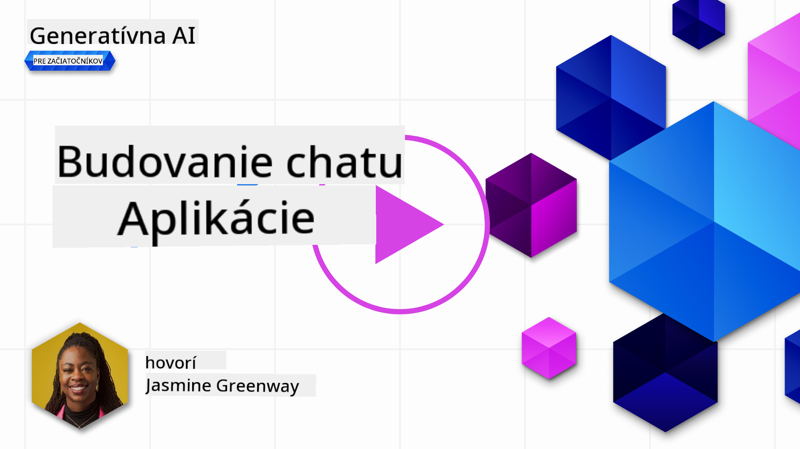
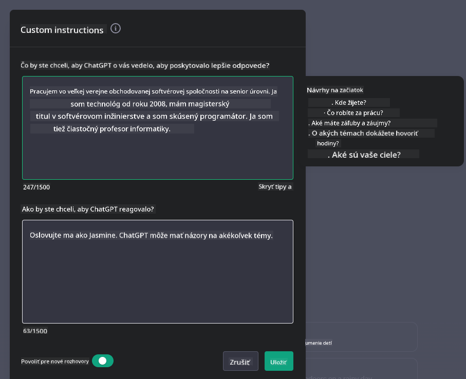
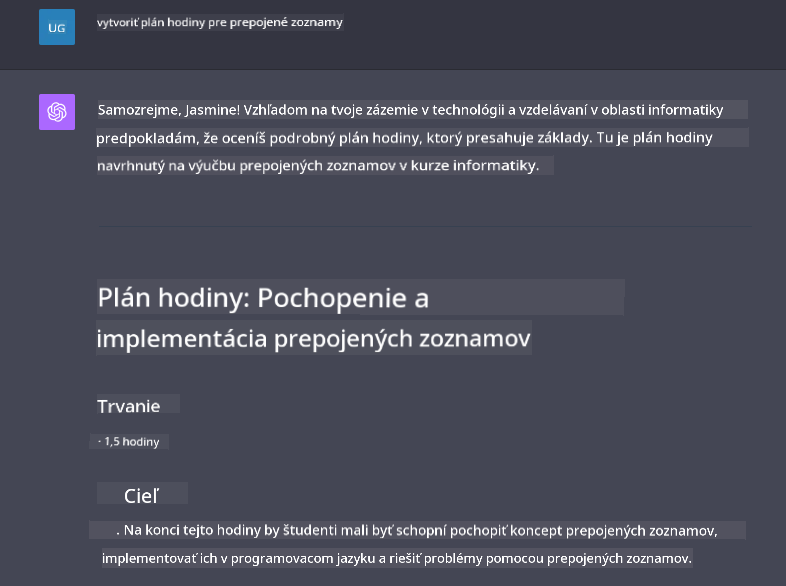

<!--
CO_OP_TRANSLATOR_METADATA:
{
  "original_hash": "ea4bbe640847aafbbba14dae4625e9af",
  "translation_date": "2025-05-19T18:08:58+00:00",
  "source_file": "07-building-chat-applications/README.md",
  "language_code": "sk"
}
-->
# Budovanie chatovacích aplikácií poháňaných generatívnou AI

[](https://aka.ms/gen-ai-lessons7-gh?WT.mc_id=academic-105485-koreyst)

> _(Kliknite na obrázok vyššie a pozrite si video tejto lekcie)_

Teraz, keď sme videli, ako môžeme vytvárať aplikácie na generovanie textu, pozrime sa na chatovacie aplikácie.

Chatovacie aplikácie sa stali súčasťou našich každodenných životov a ponúkajú viac než len prostriedok na neformálnu komunikáciu. Sú neoddeliteľnou súčasťou zákazníckeho servisu, technickej podpory a dokonca aj sofistikovaných poradenských systémov. Je pravdepodobné, že ste nedávno dostali pomoc od chatovacej aplikácie. Ako integrujeme pokročilejšie technológie ako generatívna AI do týchto platforiem, komplexnosť sa zvyšuje a takisto aj výzvy.

Niektoré otázky, ktoré potrebujeme zodpovedať, sú:

- **Vytváranie aplikácie**. Ako efektívne vytvárať a bezproblémovo integrovať tieto aplikácie poháňané AI pre konkrétne prípady použitia?
- **Monitorovanie**. Po nasadení, ako môžeme monitorovať a zabezpečiť, že aplikácie fungujú na najvyššej úrovni kvality, čo sa týka funkčnosti a dodržiavania [šiestich princípov zodpovednej AI](https://www.microsoft.com/ai/responsible-ai?WT.mc_id=academic-105485-koreyst)?

Ako sa posúvame ďalej do veku definovaného automatizáciou a bezproblémovými interakciami človek-stroj, porozumenie tomu, ako generatívna AI transformuje rozsah, hĺbku a prispôsobivosť chatovacích aplikácií sa stáva nevyhnutným. Táto lekcia preskúma aspekty architektúry, ktoré podporujú tieto zložité systémy, ponorí sa do metodológií pre jemné doladenie na úlohy špecifické pre danú doménu a vyhodnotí metriky a úvahy relevantné pre zabezpečenie zodpovedného nasadenia AI.

## Úvod

Táto lekcia pokrýva:

- Techniky na efektívne budovanie a integráciu chatovacích aplikácií.
- Ako aplikovať prispôsobenie a jemné doladenie aplikácií.
- Stratégie a úvahy na efektívne monitorovanie chatovacích aplikácií.

## Ciele učenia

Na konci tejto lekcie budete schopní:

- Opísať úvahy pri budovaní a integrácii chatovacích aplikácií do existujúcich systémov.
- Prispôsobiť chatovacie aplikácie pre konkrétne prípady použitia.
- Identifikovať kľúčové metriky a úvahy na efektívne monitorovanie a udržiavanie kvality chatovacích aplikácií poháňaných AI.
- Zabezpečiť, aby chatovacie aplikácie využívali AI zodpovedne.

## Integrácia generatívnej AI do chatovacích aplikácií

Zvýšenie kvality chatovacích aplikácií prostredníctvom generatívnej AI nie je len o tom, aby boli inteligentnejšie; je to o optimalizácii ich architektúry, výkonu a používateľského rozhrania na poskytovanie kvalitného používateľského zážitku. To zahŕňa skúmanie architektonických základov, integrácií API a úvah o používateľskom rozhraní. Táto sekcia vám má ponúknuť komplexnú cestovnú mapu pre navigáciu v týchto zložitých prostrediach, či už ich zapájate do existujúcich systémov alebo budujete ako samostatné platformy.

Na konci tejto sekcie budete vybavení odbornými znalosťami potrebnými na efektívnu konštrukciu a integráciu chatovacích aplikácií.

### Chatbot alebo chatovacia aplikácia?

Predtým než sa pustíme do budovania chatovacích aplikácií, porovnajme 'chatboty' s 'AI-poháňanými chatovacími aplikáciami', ktoré slúžia na odlišné úlohy a funkcie. Hlavným účelom chatbota je automatizovať konkrétne konverzačné úlohy, ako odpovedanie na často kladené otázky alebo sledovanie balíka. Zvyčajne je riadený logikou založenou na pravidlách alebo komplexnými AI algoritmami. Naopak, AI-poháňaná chatovacia aplikácia je oveľa rozsiahlejšie prostredie navrhnuté na uľahčenie rôznych foriem digitálnej komunikácie, ako sú textové, hlasové a video rozhovory medzi ľudskými používateľmi. Jej definujúcou vlastnosťou je integrácia generatívneho AI modelu, ktorý simuluje nuansované, ľudské rozhovory, generuje odpovede na základe širokej škály vstupov a kontextových podnetov. Chatovacia aplikácia poháňaná generatívnou AI môže zapojiť do otvorených diskusií, prispôsobiť sa meniacim konverzačným kontextom a dokonca produkovať kreatívne alebo komplexné dialógy.

Tabuľka nižšie načrtáva kľúčové rozdiely a podobnosti, aby sme pochopili ich jedinečné úlohy v digitálnej komunikácii.

| Chatbot                               | Chatovacia aplikácia poháňaná generatívnou AI |
| ------------------------------------- | --------------------------------------------- |
| Zamerané na úlohy a založené na pravidlách | Kontextovo vnímavé                             |
| Často integrované do väčších systémov | Môže hostiť jeden alebo viac chatbotov         |
| Obmedzené na naprogramované funkcie   | Zahŕňa generatívne AI modely                   |
| Špecializované a štruktúrované interakcie | Schopné otvorených diskusií                   |

### Využívanie predpripravených funkcií pomocou SDK a API

Pri budovaní chatovacej aplikácie je skvelým prvým krokom posúdenie toho, čo už existuje. Používanie SDK a API na budovanie chatovacích aplikácií je výhodnou stratégiou z rôznych dôvodov. Integráciou dobre dokumentovaných SDK a API strategicky umiestňujete svoju aplikáciu pre dlhodobý úspech, riešenie problémov so škálovateľnosťou a údržbou.

- **Urýchľuje vývojový proces a znižuje režijné náklady**: Spoliehanie sa na predpripravené funkcie namiesto drahého procesu ich vlastného vytvárania vám umožňuje sústrediť sa na iné aspekty vašej aplikácie, ktoré považujete za dôležitejšie, ako napríklad obchodnú logiku.
- **Lepší výkon**: Pri budovaní funkcií od základu si nakoniec položíte otázku "Ako to škáluje? Je táto aplikácia schopná zvládnuť náhly príliv používateľov?" Dobre udržiavané SDK a API často majú zabudované riešenia pre tieto obavy.
- **Jednoduchšia údržba**: Aktualizácie a zlepšenia sú ľahšie spravovateľné, pretože väčšina API a SDK vyžaduje iba aktualizáciu knižnice, keď je vydaná novšia verzia.
- **Prístup k špičkovej technológii**: Využívanie modelov, ktoré boli jemne doladené a trénované na rozsiahlych dátových súboroch, poskytuje vašej aplikácii schopnosti prirodzeného jazyka.

Prístup k funkciám SDK alebo API zvyčajne zahŕňa získanie povolenia na používanie poskytovaných služieb, čo sa často dosahuje použitím unikátneho kľúča alebo autentifikačného tokenu. Použijeme OpenAI Python Library, aby sme preskúmali, ako to vyzerá. Môžete si to tiež vyskúšať sami v nasledujúcom [notebooku pre OpenAI](../../../07-building-chat-applications/python/oai-assignment.ipynb) alebo [notebooku pre Azure OpenAI Services](../../../07-building-chat-applications/python/aoai-assignment.ipynb) pre túto lekciu.

```python
import os
from openai import OpenAI

API_KEY = os.getenv("OPENAI_API_KEY","")

client = OpenAI(
    api_key=API_KEY
    )

chat_completion = client.chat.completions.create(model="gpt-3.5-turbo", messages=[{"role": "user", "content": "Suggest two titles for an instructional lesson on chat applications for generative AI."}])
```

Vyššie uvedený príklad používa model GPT-3.5 Turbo na dokončenie výzvy, ale všimnite si, že API kľúč je nastavený predtým, než tak urobíte. Dostali by ste chybu, ak by ste kľúč nenastavili.

## Používateľský zážitok (UX)

Všeobecné princípy UX platia pre chatovacie aplikácie, ale tu sú niektoré ďalšie úvahy, ktoré sa stávajú obzvlášť dôležitými kvôli komponentom strojového učenia.

- **Mechanizmus na riešenie nejasností**: Generatívne AI modely občas generujú nejasné odpovede. Funkcia, ktorá umožňuje používateľom požiadať o objasnenie, môže byť užitočná, ak sa stretnú s týmto problémom.
- **Udržanie kontextu**: Pokročilé generatívne AI modely majú schopnosť zapamätať si kontext v rámci konverzácie, čo môže byť nevyhnutným prínosom pre používateľský zážitok. Poskytnutie možnosti používateľom kontrolovať a spravovať kontext zlepšuje používateľský zážitok, ale prináša riziko uchovávania citlivých používateľských informácií. Úvahy o tom, ako dlho sa tieto informácie uchovávajú, ako napríklad zavedenie politiky uchovávania, môžu vyvážiť potrebu kontextu proti ochrane súkromia.
- **Personalizácia**: S možnosťou učiť sa a prispôsobovať sa, AI modely ponúkajú individuálny zážitok pre používateľa. Prispôsobenie používateľského zážitku prostredníctvom funkcií ako používateľské profily nielenže robí používateľa pocitom pochopenia, ale tiež pomáha pri hľadaní konkrétnych odpovedí, čím vytvára efektívnejšiu a uspokojivejšiu interakciu.

Jedným z príkladov personalizácie sú nastavenia "Vlastné inštrukcie" v OpenAI's ChatGPT. Umožňuje vám poskytnúť informácie o sebe, ktoré môžu byť dôležitým kontextom pre vaše výzvy. Tu je príklad vlastnej inštrukcie.



Tento "profil" podnecuje ChatGPT vytvoriť plán lekcie o prepojených zoznamoch. Všimnite si, že ChatGPT berie do úvahy, že používateľ môže chcieť podrobnejší plán lekcie na základe jej skúseností.



### Microsoftova systémová správa pre veľké jazykové modely

[Microsoft poskytol usmernenia](https://learn.microsoft.com/azure/ai-services/openai/concepts/system-message#define-the-models-output-format?WT.mc_id=academic-105485-koreyst) pre písanie efektívnych systémových správ pri generovaní odpovedí z LLM rozdelené do 4 oblastí:

1. Definovanie, pre koho je model určený, ako aj jeho schopnosti a obmedzenia.
2. Definovanie formátu výstupu modelu.
3. Poskytnutie konkrétnych príkladov, ktoré demonštrujú zamýšľané správanie modelu.
4. Poskytnutie ďalších behaviorálnych bezpečnostných opatrení.

### Prístupnosť

Či už má používateľ vizuálne, sluchové, motorické alebo kognitívne postihnutie, dobre navrhnutá chatovacia aplikácia by mala byť použiteľná pre všetkých. Nasledujúci zoznam rozdeľuje konkrétne funkcie zamerané na zlepšenie prístupnosti pre rôzne postihnutia používateľov.

- **Funkcie pre vizuálne postihnutie**: Témy s vysokým kontrastom a prispôsobiteľný text, kompatibilita so čítačkou obrazovky.
- **Funkcie pre sluchové postihnutie**: Funkcie text-to-speech a speech-to-text, vizuálne signály pre zvukové oznámenia.
- **Funkcie pre motorické postihnutie**: Podpora navigácie pomocou klávesnice, hlasové príkazy.
- **Funkcie pre kognitívne postihnutie**: Jednoduchšie jazykové možnosti.

## Prispôsobenie a jemné doladenie pre jazykové modely špecifické pre doménu

Predstavte si chatovaciu aplikáciu, ktorá rozumie žargónu vašej firmy a predvída konkrétne dotazy, ktoré jej používateľská základňa bežne má. Existuje niekoľko prístupov, ktoré stojí za zmienku:

- **Využívanie modelov DSL**. DSL znamená jazyk špecifický pre doménu. Môžete využiť tzv. model DSL, ktorý je trénovaný na konkrétnu doménu, aby rozumel jej konceptom a scenárom.
- **Aplikácia jemného doladenia**. Jemné doladenie je proces ďalšieho trénovania vášho modelu s konkrétnymi dátami.

## Prispôsobenie: Používanie DSL

Využívanie jazykových modelov špecifických pre doménu (DSL modely) môže zlepšiť zapojenie používateľov poskytovaním špecializovaných, kontextovo relevantných interakcií. Je to model, ktorý je trénovaný alebo jemne doladený na porozumenie a generovanie textu súvisiaceho s konkrétnym oborom, odvetvím alebo predmetom. Možnosti používania DSL modelu sa môžu líšiť od trénovania jedného od základu po používanie existujúcich prostredníctvom SDK a API. Ďalšou možnosťou je jemné doladenie, ktoré zahŕňa prijatie existujúceho predtrénovaného modelu a prispôsobenie ho pre konkrétnu doménu.

## Prispôsobenie: Aplikácia jemného doladenia

Jemné doladenie sa často zvažuje, keď predtrénovaný model nedokáže dosiahnuť požadovanú úroveň v špecifickej doméne alebo konkrétnej úlohe.

Napríklad, lekárske dotazy sú zložité a vyžadujú veľa kontextu. Keď lekár diagnostikuje pacienta, je to založené na rôznych faktoroch, ako je životný štýl alebo existujúce podmienky, a môže sa dokonca spoliehať na nedávne lekárske časopisy na overenie svojej diagnózy. V takýchto nuansovaných scenároch nemôže byť všeobecný AI chat aplikácia spoľahlivým zdrojom.

### Scenár: lekárska aplikácia

Zvážte chatovaciu aplikáciu navrhnutú na pomoc lekárom poskytovaním rýchlych referencií k liečebným pokynom, interakciám liekov alebo nedávnym výskumným zisteniam.

Všeobecný model môže byť dostatočný na odpovedanie na základné lekárske otázky alebo poskytovanie všeobecných rád, ale môže mať problémy s nasledujúcimi:

- **Vysoko špecifické alebo zložité prípady**. Napríklad, neurológ môže položiť aplikácii otázku: "Aké sú súčasné najlepšie praktiky pre riadenie epilepsie odolnej voči liekom u pediatrických pacientov?"
- **Nedostatok nedávnych pokrokov**. Všeobecný model môže mať problémy poskytnúť aktuálnu odpoveď, ktorá zahŕňa najnovšie pokroky v neurológii a farmakológii.

V takýchto prípadoch jemné doladenie modelu špecializovaným lekárskym dátovým súborom môže výrazne zlepšiť jeho schopnosť zvládnuť tieto zložité lekárske otázky presnejšie a spoľahlivejšie. To si vyžaduje prístup k veľkému a relevantnému dátovému súboru, ktorý predstavuje doménové výzvy a otázky, ktoré je potrebné riešiť.

## Úvahy pre vysokokvalitný AI-poháňaný chatovací zážitok

Táto sekcia načrt

**Upozornenie**:  
Tento dokument bol preložený pomocou služby AI prekladu [Co-op Translator](https://github.com/Azure/co-op-translator). Aj keď sa snažíme o presnosť, upozorňujeme, že automatizované preklady môžu obsahovať chyby alebo nepresnosti. Pôvodný dokument v jeho rodnom jazyku by mal byť považovaný za autoritatívny zdroj. Pre kritické informácie sa odporúča profesionálny ľudský preklad. Nie sme zodpovední za žiadne nedorozumenia alebo nesprávne interpretácie vyplývajúce z použitia tohto prekladu.