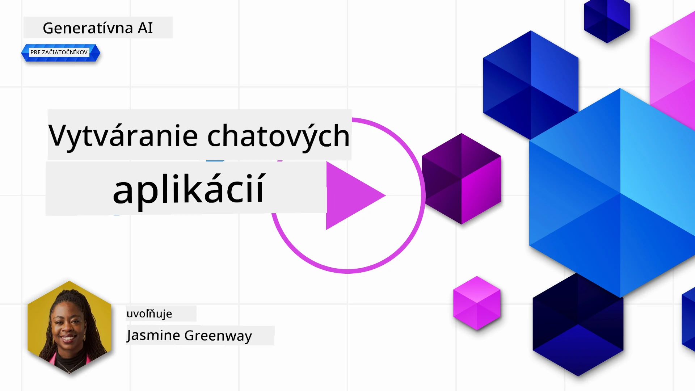
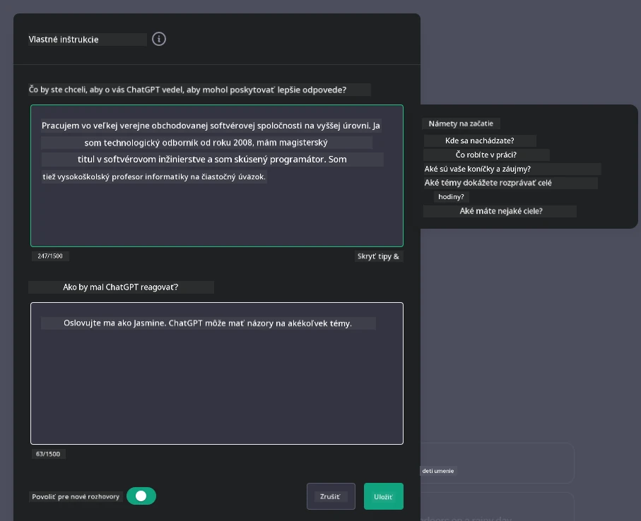
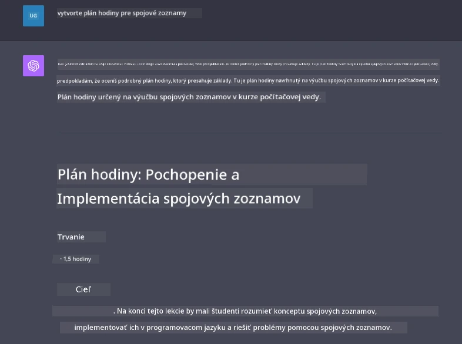

# Budovanie chatovacích aplikácií poháňaných generatívnou AI

[](https://youtu.be/R9V0ZY1BEQo?si=IHuU-fS9YWT8s4sA)

> _(Kliknite na obrázok vyššie pre zobrazenie videa tejto lekcie)_

Teraz, keď sme videli, ako môžeme vytvárať aplikácie na generovanie textu, pozrime sa na chatovacie aplikácie.

Chatovacie aplikácie sa stali súčasťou nášho každodenného života a ponúkajú viac než len prostriedok na bežný rozhovor. Sú neoddeliteľnou súčasťou zákazníckeho servisu, technickej podpory a dokonca aj sofistikovaných poradenských systémov. Je pravdepodobné, že ste si nedávno pomohli pomocou chatovacej aplikácie. Ako do týchto platforiem integrujeme pokročilejšie technológie ako generatívnu AI, zložitosť rastie aj s ňou aj výzvy.

Niektoré otázky, na ktoré potrebujeme odpovede, sú:

- **Budovanie aplikácie**. Ako efektívne vyvíjať a bezproblémovo integrovať tieto aplikácie poháňané AI pre konkrétne použitia?
- **Monitorovanie**. Po nasadení, ako môžeme sledovať a zabezpečiť, že aplikácie fungujú na najvyššej úrovni kvality, či už z hľadiska funkčnosti alebo dodržiavania [šiestich princípov zodpovednej AI](https://www.microsoft.com/ai/responsible-ai?WT.mc_id=academic-105485-koreyst)?

Ako postupujeme ďalej do veku definovaného automatizáciou a bezproblémovou interakciou človek-stroj, pochopenie toho, ako generatívna AI transformuje rozsah, hĺbku a prispôsobivosť chatovacích aplikácií, sa stáva nevyhnutným. Táto lekcia preskúma aspekty architektúry, ktoré podporujú tieto zložité systémy, ponorí sa do metodológií ich doladenia na úlohy špecifické pre konkrétnu oblasť a vyhodnotí metriky a úvahy relevantné na zabezpečenie zodpovedného nasadenia AI.

## Úvod

Táto lekcia pokrýva:

- Techniky na efektívne budovanie a integráciu chatovacích aplikácií.
- Ako aplikovať prispôsobenie a doladenie aplikácií.
- Stratégie a úvahy na efektívne monitorovanie chatovacích aplikácií.

## Ciele učenia

Na konci tejto lekcie budete schopní:

- Popísať úvahy pri budovaní a integrácii chatovacích aplikácií do existujúcich systémov.
- Prispôsobiť chatovacie aplikácie pre konkrétne prípady použitia.
- Identifikovať kľúčové metriky a úvahy na efektívne monitorovanie a udržiavanie kvality chatovacích aplikácií poháňaných AI.
- Zabezpečiť, aby chatovacie aplikácie využívali AI zodpovedne.

## Integrácia generatívnej AI do chatovacích aplikácií

Vylepšenie chatovacích aplikácií prostredníctvom generatívnej AI nespočíva len v ich inteligentnejšom správaní; ide o optimalizáciu ich architektúry, výkonu a užívateľského rozhrania na poskytnutie kvalitného používateľského zážitku. Zahŕňa to skúmanie architektonických základov, integráciu API a úvahy o užívateľskom rozhraní. Táto sekcia si kladie za cieľ poskytnúť vám komplexnú cestovnú mapu pre navigáciu v týchto zložitých oblastiach, či už ich pripájate k existujúcim systémom alebo vytvárate samostatné platformy.

Na konci tejto sekcie budete vybavení odbornými znalosťami potrebnými na efektívnu výstavbu a začlenenie chatovacích aplikácií.

### Chatbot alebo chatovacia aplikácia?

Predtým, než sa pustíme do budovania chatovacích aplikácií, porovnajme si „chatboty“ a „chatovacie aplikácie poháňané AI“, ktoré plnia odlišné úlohy a funkcie. Hlavným účelom chatbota je automatizovať konkrétne konverzačné úlohy, ako je odpovedanie na často kladené otázky alebo sledovanie zásielky. Zvyčajne je riadený pravidlami alebo zložitými AI algoritmami. Naproti tomu chatovacia aplikácia poháňaná AI je oveľa rozsiahlejšie prostredie navrhnuté na uľahčenie rôznych foriem digitálnej komunikácie, ako sú textové, hlasové a video rozhovory medzi ľudskými používateľmi. Jej definujúcou vlastnosťou je integrácia generatívneho AI modelu, ktorý simuluje nuansované, ľudsky pôsobiace rozhovory, generujúc odpovede na základe rôzneho vstupu a kontextových signálov. Chatovacia aplikácia poháňaná generatívnou AI sa môže zapojiť do diskusií otvoreného oboru, prispôsobiť sa vyvíjajúcim sa konverzačným kontextom a dokonca produkovať kreatívny alebo komplexný dialóg.

Nižšie uvedená tabuľka znázorňuje kľúčové rozdiely a podobnosti na lepšie pochopenie ich jedinečných úloh v digitálnej komunikácii.

| Chatbot                               | Chatovacia aplikácia poháňaná generatívnou AI |
| ------------------------------------- | ----------------------------------------------- |
| Zameraný na úlohy a riadený pravidlami | Vedomý si kontextu                             |
| Často integrovaný do väčších systémov   | Môže hostiť jeden alebo viac chatbotov        |
| Obmedzený na programované funkcie        | Zahŕňa modely generatívnej AI                  |
| Špecializované a štruktúrované interakcie | Schopný diskusií otvoreného oboru               |

### Využitie predpripravených funkcií pomocou SDK a API

Pri budovaní chatovacej aplikácie je skvelým prvým krokom posúdenie toho, čo už existuje. Použitie SDK a API na tvorbu chatovacích aplikácií je výhodnou stratégiou z rôznych dôvodov. Integráciou dobre zdokumentovaných SDK a API strategicky pripravujete svoju aplikáciu na dlhodobý úspech, riešiac otázky škálovateľnosti a údržby.

- **Uľahčuje vývojový proces a znižuje režijné náklady**: Spoľahnúť sa na predpripravené funkcie namiesto nákladného procesu ich vlastnej tvorby vám umožňuje sústrediť sa na iné aspekty aplikácie, ktoré môžu byť pre vás dôležitejšie, ako napríklad obchodná logika.
- **Lepší výkon**: Pri tvorbe funkcií od nuly si nakoniec položíte otázku „Ako to škáluje? Je táto aplikácia schopná zvládnuť náhly prílev používateľov?“ Dobre udržiavané SDK a API často obsahujú zabudované riešenia pre tieto obavy.
- **Jednoduchšia údržba**: Aktualizácie a vylepšenia sa ľahšie spravujú, pretože väčšina API a SDK vyžaduje len aktualizáciu knižnice pri vydaní novej verzie.
- **Prístup k najmodernejšej technológii**: Využitie modelov, ktoré boli doladené a trénované na rozsiahlych dátových súboroch, poskytuje vašej aplikácii schopnosti spracovania prirodzeného jazyka.

Prístup k funkciám SDK alebo API zvyčajne zahŕňa získanie povolenia na používanie poskytovaných služieb, často prostredníctvom unikátneho kľúča alebo autentifikačného tokenu. Použijeme Python knižnicu OpenAI, aby sme preskúmali, ako to vyzerá v praxi. Môžete si to vyskúšať aj sami v nasledujúcom [notebooku pre OpenAI](./python/oai-assignment.ipynb?WT.mc_id=academic-105485-koreyst) alebo [notebooku pre Azure OpenAI služby](./python/aoai-assignment.ipynb?WT.mc_id=academic-105485-koreys) pre túto lekciu.

```python
import os
from openai import OpenAI

API_KEY = os.getenv("OPENAI_API_KEY","")

client = OpenAI(
    api_key=API_KEY
    )

response = client.responses.create(model="gpt-4o-mini", input="Suggest two titles for an instructional lesson on chat applications for generative AI.", store=False)
print(response.output_text)
```

Príklad vyššie používa model GPT-4o mini spolu s Responses API na dokončenie promptu, ale všimnite si, že API kľúč je nastavený pred týmto krokom. Bez nastavenia kľúča by ste dostali chybu.

## Užívateľská skúsenosť (UX)

Všeobecné princípy UX platia pre chatovacie aplikácie, ale tu sú niektoré ďalšie úvahy, ktoré sa stávajú obzvlášť dôležitými vzhľadom na zapojené komponenty strojového učenia.

- **Mechanizmus na riešenie nejasností**: Modely generatívnej AI občas generujú nejednoznačné odpovede. Funkcia, ktorá používateľom umožní žiadať o upresnenie, môže byť užitočná, ak na tento problém narazia.
- **Zachovanie kontextu**: Pokročilé modely generatívnej AI dokážu pamätať kontext v rámci rozhovoru, čo môže byť nevyhnutnou zložkou používateľského zážitku. Poskytnutie možnosti používateľom kontrolovať a spravovať kontext zlepšuje UX, ale zároveň prináša riziko ukladania citlivých informácií o používateľovi. Úvahy o tom, ako dlho sú tieto informácie uchovávané, napríklad zavedenie politiky uchovávania, môžu vyvážiť potrebu kontextu a súkromia.
- **Personalizácia**: Vďaka schopnosti učiť sa a prispôsobovať sa ponúkajú AI modely individuálny zážitok pre používateľa. Prispôsobenie UX prostredníctvom funkcií ako používateľské profily nielenže spôsobuje, že sa používateľ cíti pochopený, ale tiež pomáha pri hľadaní špecifických odpovedí, čím vytvára efektívnejšiu a uspokojivejšiu interakciu.

Príkladom personalizácie je nastavenie „Vlastné inštrukcie“ v ChatGPT od OpenAI. Umožňuje vám poskytnúť informácie o sebe, ktoré môžu byť dôležitým kontextom pre vaše prompt.



Tento „profil“ navádza ChatGPT, aby vytvoril plán lekcie o spojených zoznamoch. Všimnite si, že ChatGPT zohľadňuje, že používateľ môže chcieť hlbší plán lekcie na základe svojich skúseností.



### Microsoftov rámec systémových správ pre veľké jazykové modely

[Microsoft poskytol usmernenia](https://learn.microsoft.com/azure/ai-services/openai/concepts/system-message#define-the-models-output-format?WT.mc_id=academic-105485-koreyst) na písanie efektívnych systémových správ pri generovaní odpovedí z LLM rozdelené do 4 oblastí:

1. Definovanie, pre koho model je, ako aj jeho schopnosti a obmedzenia.
2. Definovanie formátu výstupu modelu.
3. Poskytnutie konkrétnych príkladov, ktoré demonštrujú zamýšľané správanie modelu.
4. Poskytnutie ďalších behaviorálnych bezpečnostných opatrení.

### Prístupnosť

Či už používateľ má zrakové, sluchové, motorické alebo kognitívne obmedzenia, dobre navrhnutá chatovacia aplikácia by mala byť použiteľná pre všetkých. Nasledujúci zoznam rozdeľuje špecifické funkcie zamerané na zlepšenie prístupnosti pre rôzne používateľské obmedzenia.

- **Funkcie pre zrakové postihnutie**: Témy s vysokým kontrastom a možnosť zväčšenia textu, kompatibilita s čítačkami obrazovky.
- **Funkcie pre sluchové postihnutie**: Funkcie prevodu textu na reč a reči na text, vizuálne signály pre audio upozornenia.
- **Funkcie pre motorické postihnutie**: Podpora navigácie klávesnicou, hlasové príkazy.
- **Funkcie pre kognitívne postihnutie**: Možnosti zjednodušeného jazyka.

## Prispôsobenie a doladenie jazykových modelov špecifických pre doménu

Predstavte si chatovaciu aplikáciu, ktorá rozumie žargónu vašej firmy a predvída bežné otázky používateľov. Existuje niekoľko prístupov, ktoré stojí za to spomenúť:

- **Využitie DSL modelov**. DSL znamená „domain specific language“ (jazyk špecifický pre doménu). Môžete využiť takzvaný DSL model trénovaný na konkrétnu doménu, aby rozumel jej konceptom a scenárom.
- **Aplikovanie doladenia**. Doladenie je proces ďalšieho tréningu vášho modelu so špecifickými dátami.

## Prispôsobenie: Použitie DSL

Využitie jazykových modelov špecifických pre doménu (DSL modely) môže zlepšiť angažovanosť používateľov poskytovaním špecializovaných, kontextuálne relevantných interakcií. Je to model, ktorý je trénovaný alebo doladený na rozumenie a generovanie textu súvisiaceho s konkrétnym odborom, priemyslom alebo témou. Možnosti použitia DSL modelu sa môžu líšiť od tréningu od základov až po využitie predexistujúcich modelov cez SDK a API. Ďalšou možnosťou je doladenie, ktoré spočíva v adaptácii existujúceho predtrénovaného modelu na konkrétnu doménu.

## Prispôsobenie: Aplikácia doladenia

Doladenie sa často uvažuje, keď predtrénovaný model nedostačuje v špecifickej doméne alebo na konkrétnu úlohu.

Napríklad lekárske otázky sú zložité a vyžadujú množstvo kontextu. Keď lekár diagnostikuje pacienta, vychádza z rôznych faktorov, ako je životný štýl alebo existujúce ochorenia, a môže sa dokonca spoliehať na nedávne lekárske publikácie na potvrdenie diagnózy. V takýchto jemných situáciách nemôže byť všeobecne určená AI chatovacia aplikácia spoľahlivým zdrojom.

### Scenár: lekárska aplikácia

Predstavte si chatovaciu aplikáciu navrhnutú na pomoc lekárom poskytovaním rýchlych odkazov na liečebné smernice, interakcie liekov alebo najnovšie výskumné poznatky.

Všeobecný model môže byť dostatočný na odpovede na základné lekárske otázky alebo poskytnutie všeobecných rád, ale môže mať problém s nasledujúcim:

- **Veľmi špecifické alebo zložité prípady**. Napríklad neurológ môže aplikácii položiť otázku: „Aké sú súčasné najlepšie postupy na manažment liekmi rezistentnej epilepsie u pediatrických pacientov?“
- **Nedostatok najnovších poznatkov**. Všeobecný model môže mať problém poskytnúť aktuálnu odpoveď, ktorá zahŕňa najnovší pokrok v neurológii a farmakológii.

V takýchto prípadoch môže doladenie modelu so špecializovaným medicínskym datasetom významne zlepšiť jeho schopnosť presnejšie a spoľahlivejšie riešiť tieto zložité lekárske požiadavky. To vyžaduje prístup k veľkému a relevantnému datasetu, ktorý reprezentuje výzvy a otázky špecifické pre danú doménu.

## Úvahy pre vysoce kvalitný AI riadený chatovací zážitok

Táto sekcia načrtáva kritériá pre „vysokokvalitné“ chatovacie aplikácie, ktoré zahrňajú zachytávanie prakticky využiteľných metrík a dodržiavanie rámca, ktorý zodpovedne využíva AI technológiu.

### Kľúčové metriky

Na udržanie vysokej kvality výkonu aplikácie je nevyhnutné sledovať kľúčové metriky a úvahy. Tieto merania nielen zabezpečujú funkčnosť aplikácie, ale posudzujú aj kvalitu AI modelu a používateľský zážitok. Nižšie je zoznam základných, AI a UX metrík, ktoré treba zvážiť.

| Metrika                      | Definícia                                                                                                         | Úvahy pre vývojára chatovej aplikácie                         |
| ----------------------------- | ------------------------------------------------------------------------------------------------------------------ | ------------------------------------------------------------- |
| **Dostupnosť (Uptime)**       | Meria čas, počas ktorého je aplikácia funkčná a prístupná používateľom.                                            | Ako minimalizujete prestoje?                                   |
| **Čas odozvy**                | Čas, ktorý aplikácia potrebuje na odpoveď na požiadavku používateľa.                                              | Ako optimalizujete spracovanie dotazu pre lepší čas odozvy?   |
| **Presnosť**                  | Pomer správne pozitívnych predpovedí ku celkovému počtu pozitívnych predikcií.                                     | Ako overíte presnosť vášho modelu?                            |
| **Zachytenie (Recall, citlivosť)** | Pomer správne pozitívnych predpovedí ku skutočnému počtu pozitív.                                               | Ako budete merať a zlepšovať zachytenie?                      |
| **F1 skóre**                  | Harmonický priemer presnosti a zachytenia, ktorý vyvažuje kompromis medzi oboma.                                   | Aké je vaše cieľové F1 skóre? Ako vyvážite presnosť a zachytenie? |
| **Perplexita**                | Meria, ako dobre pravdepodobnostné rozdelenie predpovedané modelom korešponduje so skutočným rozdelením dát.       | Ako minimalizujete perplexitu?                                |
| **Metriky spokojnosti používateľov** | Meria vnímanie aplikácie používateľom. Často zachytené pomocou prieskumov.                                      | Ako často budete zbierať spätnú väzbu? Ako sa na jej základe prispôsobíte? |
| **Miera chýb**               | Miera, pri ktorej model robí chyby v chápaní alebo výstupe.                                                       | Aké stratégie máte na zníženie miery chýb?                    |
| **Cyklus preškolenia**        | Frekvencia, s akou je model aktualizovaný pre zahrnutie nových dát a poznatkov.                                   | Ako často budete model preškoliť? Čo spustí cyklus preškolenia? |

| **Detekcia anomálií**         | Nástroje a techniky na identifikáciu nezvyčajných vzorov, ktoré nezodpovedajú očakávanému správaniu.                        | Ako budete reagovať na anomálie?                                        |

### Zavádzanie zodpovedných praktík AI v chatovacích aplikáciách

Prístup spoločnosti Microsoft k zodpovednej AI identifikoval šesť princípov, ktoré by mali viesť vývoj a používanie AI. Nižšie sú princípy, ich definície a veci, ktoré by mal vývojár chatu zvážiť a prečo by ich mal brať vážne.

| Princípy               | Definícia spoločnosti Microsoft                         | Úvahy pre vývojára chatu                                             | Prečo je to dôležité                                                                    |
| ---------------------- | ----------------------------------------------------- | ------------------------------------------------------------------ | ---------------------------------------------------------------------------------------- |
| Spravodlivosť          | AI systémy by mali zaobchádzať so všetkými ľuďmi spravodlivo. | Zabezpečte, aby chatová aplikácia nediskriminovala na základe údajov o používateľovi. | Na vybudovanie dôvery a inkluzívnosti medzi používateľmi; vyhýba sa právnym následkom.    |
| Spoľahlivosť a bezpečnosť | AI systémy by mali pracovať spoľahlivo a bezpečne.        | Implementujte testovanie a bezpečnostné opatrenia na minimalizáciu chýb a rizík.    | Zabezpečuje spokojnosť používateľov a predchádza možnej ujme.                            |
| Súkromie a bezpečnosť  | AI systémy by mali byť bezpečné a rešpektovať súkromie.  | Zavádzajte silné šifrovanie a opatrenia na ochranu údajov.           | Na ochranu citlivých údajov používateľov a súlad s legislatívou o ochrane súkromia.      |
| Inkluzívnosť           | AI systémy by mali posilňovať všetkých a zapájať ľudí.   | Navrhnite používateľské rozhranie/UI, ktoré je prístupné a ľahko použiteľné pre rôznorodé publikum. | Zabezpečuje, že širšia škála ľudí môže aplikáciu efektívne používať.                      |
| Transparentnosť        | AI systémy by mali byť zrozumiteľné.                     | Poskytnite jasnú dokumentáciu a zdôvodnenie odpovedí AI.             | Používatelia majú väčšiu dôveru v systém, ak rozumejú, ako sa prijímajú rozhodnutia.    |
| Zodpovednosť           | Ľudia by mali niesť zodpovednosť za AI systémy.           | Zaviesť jasný proces na auditovanie a zlepšovanie rozhodnutí AI.    | Umožňuje neustále zlepšovanie a nápravné opatrenia v prípade chýb.                       |

## Zadanie

Pozrite si [zadanie](../../../07-building-chat-applications/python). Prevedie vás sériou cvičení od spustenia prvých chatových promptov, cez klasifikáciu a zhrnutie textu až po ďalšie. Všímajte si, že zadania sú dostupné v rôznych programovacích jazykoch!

## Skvelá práca! Pokračujte v ceste

Po dokončení tejto lekcie si pozrite našu [kolekciu vzdelávania o generatívnej AI](https://aka.ms/genai-collection?WT.mc_id=academic-105485-koreyst), aby ste naďalej zlepšovali svoje znalosti o generatívnej AI!

Prejdite na Lekciu 8, kde uvidíte, ako môžete začať [budovať vyhľadávacie aplikácie](../08-building-search-applications/README.md?WT.mc_id=academic-105485-koreyst)!

---

<!-- CO-OP TRANSLATOR DISCLAIMER START -->
**Vyhlásenie o zodpovednosti**:
Tento dokument bol preložený pomocou AI prekladateľskej služby [Co-op Translator](https://github.com/Azure/co-op-translator). Hoci sa snažíme o presnosť, vezmite prosím na vedomie, že automatické preklady môžu obsahovať chyby alebo nepresnosti. Pôvodný dokument v jeho natívnom jazyku by mal byť považovaný za autoritatívny zdroj. Pre kritické informácie sa odporúča profesionálny ľudský preklad. Nie sme zodpovední za žiadne nedorozumenia alebo nesprávne interpretácie vyplývajúce z použitia tohto prekladu.
<!-- CO-OP TRANSLATOR DISCLAIMER END -->