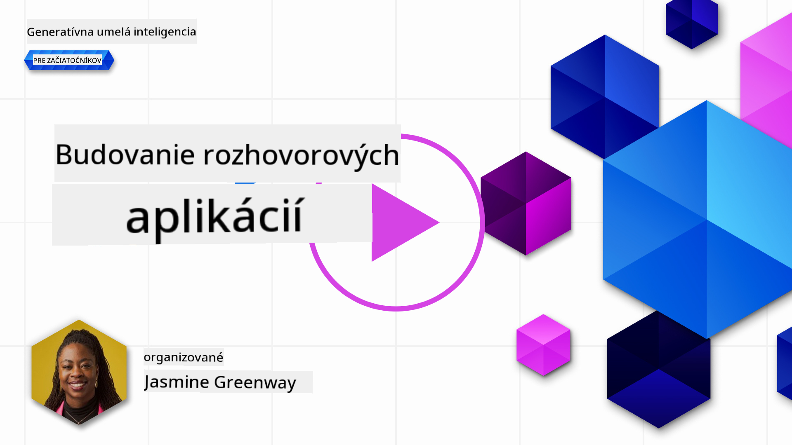
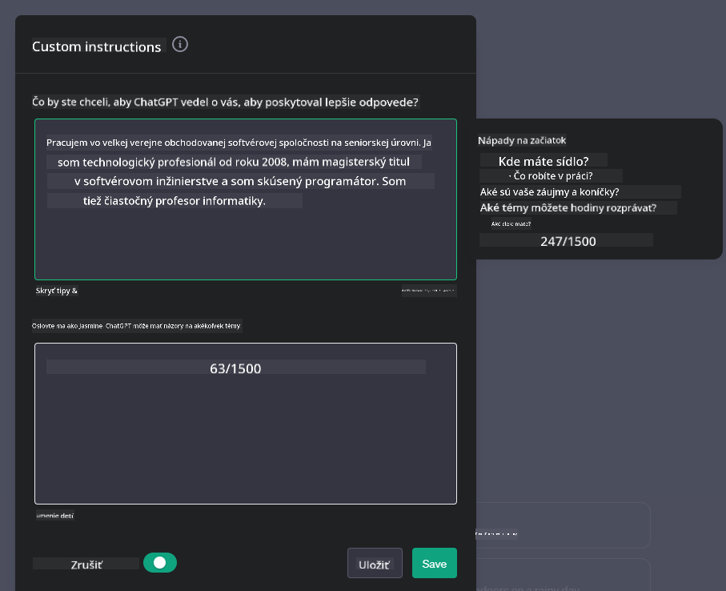
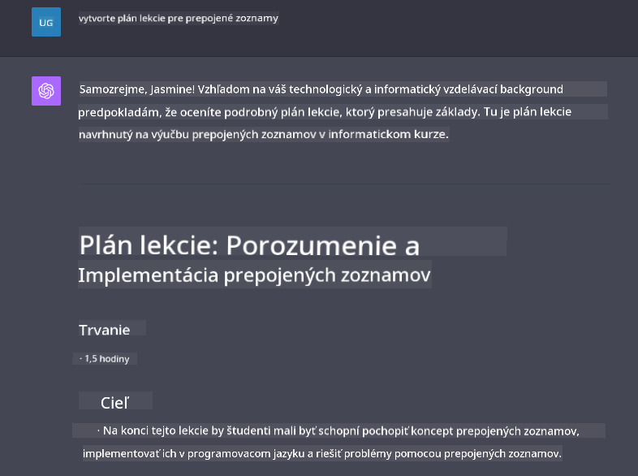

<!--
CO_OP_TRANSLATOR_METADATA:
{
  "original_hash": "ea4bbe640847aafbbba14dae4625e9af",
  "translation_date": "2025-06-25T15:55:56+00:00",
  "source_file": "07-building-chat-applications/README.md",
  "language_code": "sk"
}
-->
# Budovanie chatových aplikácií s generatívnou AI

[](https://aka.ms/gen-ai-lessons7-gh?WT.mc_id=academic-105485-koreyst)

> _(Kliknite na obrázok vyššie, aby ste si pozreli video tejto lekcie)_

Teraz, keď sme videli, ako môžeme vytvárať aplikácie na generovanie textu, pozrime sa na chatové aplikácie.

Chatové aplikácie sa stali súčasťou našich každodenných životov a ponúkajú viac než len prostriedok na neformálnu konverzáciu. Sú neoddeliteľnou súčasťou zákazníckeho servisu, technickej podpory a dokonca aj sofistikovaných poradenských systémov. Je pravdepodobné, že ste nedávno získali pomoc od chatovej aplikácie. Ako integrujeme pokročilejšie technológie ako generatívnu AI do týchto platforiem, zvyšuje sa ich zložitosť a tiež výzvy.

Niektoré otázky, na ktoré potrebujeme odpovede, sú:

- **Budovanie aplikácie**. Ako efektívne vytvárame a bezproblémovo integrujeme tieto AI poháňané aplikácie pre konkrétne použitia?
- **Monitorovanie**. Po nasadení, ako môžeme monitorovať a zabezpečiť, že aplikácie fungujú na najvyššej úrovni kvality, a to ako z hľadiska funkčnosti, tak aj dodržiavania [šiestich princípov zodpovednej AI](https://www.microsoft.com/ai/responsible-ai?WT.mc_id=academic-105485-koreyst)?

Ako sa posúvame ďalej do veku definovaného automatizáciou a bezproblémovou interakciou medzi človekom a strojom, pochopenie toho, ako generatívna AI transformuje rozsah, hĺbku a prispôsobivosť chatových aplikácií, sa stáva nevyhnutným. Táto lekcia preskúma aspekty architektúry, ktoré podporujú tieto zložité systémy, ponorí sa do metodík pre ich jemné doladenie pre úlohy špecifické pre danú oblasť a zhodnotí metriky a úvahy týkajúce sa zabezpečenia zodpovedného nasadenia AI.

## Úvod

Táto lekcia pokrýva:

- Techniky pre efektívne budovanie a integráciu chatových aplikácií.
- Ako aplikovať prispôsobenie a jemné doladenie aplikácií.
- Stratégie a úvahy na efektívne monitorovanie chatových aplikácií.

## Ciele učenia

Na konci tejto lekcie budete schopní:

- Opísať úvahy pre budovanie a integráciu chatových aplikácií do existujúcich systémov.
- Prispôsobiť chatové aplikácie pre špecifické použitia.
- Identifikovať kľúčové metriky a úvahy na efektívne monitorovanie a udržanie kvality AI poháňaných chatových aplikácií.
- Zabezpečiť, aby chatové aplikácie zodpovedne využívali AI.

## Integrácia generatívnej AI do chatových aplikácií

Zvýšenie úrovne chatových aplikácií prostredníctvom generatívnej AI nie je len o tom, aby boli múdrejšie; je to o optimalizácii ich architektúry, výkonu a používateľského rozhrania na poskytovanie kvalitného používateľského zážitku. To zahŕňa skúmanie architektonických základov, integrácií API a úvah o používateľskom rozhraní. Táto sekcia vám má ponúknuť komplexný plán pre navigáciu týchto zložitých prostredí, či už ich zapájate do existujúcich systémov alebo ich budujete ako samostatné platformy.

Na konci tejto sekcie budete vybavení odbornými znalosťami potrebnými na efektívnu konštrukciu a integráciu chatových aplikácií.

### Chatbot alebo chatová aplikácia?

Predtým, než sa ponoríme do budovania chatových aplikácií, porovnajme 'chatboty' s 'AI poháňanými chatovými aplikáciami', ktoré slúžia rôznym úlohám a funkciám. Hlavným účelom chatbota je automatizovať konkrétne konverzačné úlohy, ako je odpovedanie na často kladené otázky alebo sledovanie balíka. Zvyčajne je riadený logikou založenou na pravidlách alebo zložitými AI algoritmami. Naopak, AI poháňaná chatová aplikácia je oveľa rozsiahlejšie prostredie určené na uľahčenie rôznych foriem digitálnej komunikácie, ako sú textové, hlasové a video chaty medzi ľudskými používateľmi. Jej určujúcou vlastnosťou je integrácia generatívneho AI modelu, ktorý simuluje nuansované, ľudské rozhovory, generuje odpovede na základe širokej škály vstupov a kontextových podnetov. Generatívna AI poháňaná chatová aplikácia môže zapájať sa do diskusií na otvorenom poli, prispôsobovať sa meniacim sa konverzačným kontextom a dokonca produkovať kreatívne alebo zložité dialógy.

Tabuľka nižšie načrtáva kľúčové rozdiely a podobnosti, ktoré nám pomôžu pochopiť ich jedinečné úlohy v digitálnej komunikácii.

| Chatbot                               | Generatívna AI-Poháňaná Chatová Aplikácia |
| ------------------------------------- | -------------------------------------- |
| Zameraný na úlohy a založený na pravidlách | Kontextuálne uvedomelý                  |
| Často integrovaný do väčších systémov | Môže hostiť jeden alebo viac chatbotov |
| Obmedzený na naprogramované funkcie   | Zahŕňa generatívne AI modely           |
| Špecializované a štruktúrované interakcie | Schopný diskusií na otvorenom poli     |

### Využívanie predpripravených funkcií pomocou SDK a API

Pri budovaní chatovej aplikácie je skvelým prvým krokom zhodnotiť, čo už existuje. Používanie SDK a API na budovanie chatových aplikácií je výhodná stratégia z rôznych dôvodov. Integráciou dobre zdokumentovaných SDK a API strategicky umiestňujete svoju aplikáciu na dlhodobý úspech, riešiac škálovateľnosť a údržbu.

- **Urýchľuje vývojový proces a znižuje režijné náklady**: Spoliehaním sa na predpripravené funkcie namiesto nákladného procesu ich budovania sami sa môžete sústrediť na iné aspekty vašej aplikácie, ktoré môžete považovať za dôležitejšie, ako je obchodná logika.
- **Lepší výkon**: Pri budovaní funkcií od nuly sa nakoniec opýtate sami seba "Ako to škáluje? Je táto aplikácia schopná zvládnuť náhly príliv používateľov?" Dobre udržiavané SDK a API často majú zabudované riešenia pre tieto obavy.
- **Jednoduchšia údržba**: Aktualizácie a vylepšenia sa ľahšie spravujú, pretože väčšina API a SDK vyžaduje iba aktualizáciu knižnice, keď je vydaná novšia verzia.
- **Prístup k najmodernejšej technológii**: Využívanie modelov, ktoré boli jemne doladené a vyškolené na rozsiahlych dátových sadách, poskytuje vašej aplikácii schopnosti prirodzeného jazyka.

Prístup k funkčnosti SDK alebo API zvyčajne zahŕňa získanie povolenia na používanie poskytovaných služieb, čo je často prostredníctvom použitia jedinečného kľúča alebo autentifikačného tokenu. Použijeme knižnicu OpenAI Python Library, aby sme preskúmali, ako to vyzerá. Môžete si to tiež vyskúšať sami v nasledujúcom [notebooku pre OpenAI](../../../07-building-chat-applications/python/oai-assignment.ipynb) alebo [notebooku pre Azure OpenAI Services](../../../07-building-chat-applications/python/aoai-assignment.ipynb) pre túto lekciu.

```python
import os
from openai import OpenAI

API_KEY = os.getenv("OPENAI_API_KEY","")

client = OpenAI(
    api_key=API_KEY
    )

chat_completion = client.chat.completions.create(model="gpt-3.5-turbo", messages=[{"role": "user", "content": "Suggest two titles for an instructional lesson on chat applications for generative AI."}])
```

Vyššie uvedený príklad používa model GPT-3.5 Turbo na dokončenie výzvy, ale všimnite si, že pred tým je nastavený API kľúč. Dostali by ste chybu, keby ste kľúč nenastavili.

## Užívateľská skúsenosť (UX)

Všeobecné princípy UX platia pre chatové aplikácie, ale tu sú niektoré ďalšie úvahy, ktoré sa stávajú obzvlášť dôležitými kvôli komponentom strojového učenia.

- **Mechanizmus na riešenie nejednoznačnosti**: Generatívne AI modely občas generujú nejednoznačné odpovede. Funkcia, ktorá umožňuje používateľom požiadať o objasnenie, môže byť užitočná, ak sa stretnú s týmto problémom.
- **Uchovávanie kontextu**: Pokročilé generatívne AI modely majú schopnosť pamätať si kontext v rámci rozhovoru, čo môže byť nevyhnutným prínosom pre používateľskú skúsenosť. Umožnenie používateľom kontrolovať a spravovať kontext zlepšuje používateľskú skúsenosť, ale zavádza riziko uchovávania citlivých informácií používateľa. Úvahy o tom, ako dlho sa tieto informácie uchovávajú, ako je zavedenie politiky uchovávania, môžu vyvážiť potrebu kontextu proti ochrane súkromia.
- **Personalizácia**: S možnosťou učiť sa a prispôsobovať, AI modely ponúkajú individuálny zážitok pre používateľa. Prispôsobenie používateľskej skúsenosti prostredníctvom funkcií ako používateľské profily nielenže umožňuje používateľovi cítiť sa pochopený, ale tiež pomáha pri hľadaní konkrétnych odpovedí, čo vytvára efektívnejšiu a uspokojivejšiu interakciu.

Jedným z príkladov personalizácie je nastavenie "Custom instructions" v OpenAI's ChatGPT. Umožňuje vám poskytnúť informácie o sebe, ktoré môžu byť dôležitým kontextom pre vaše výzvy. Tu je príklad vlastnej inštrukcie.



Tento "profil" vyzýva ChatGPT, aby vytvoril učebný plán o prepojených zoznamoch. Všimnite si, že ChatGPT berie do úvahy, že používateľ môže chcieť podrobnejší učebný plán na základe jej skúseností.



### Microsoftov rámec systémových správ pre veľké jazykové modely

[Microsoft poskytol usmernenia](https://learn.microsoft.com/azure/ai-services/openai/concepts/system-message#define-the-models-output-format?WT.mc_id=academic-105485-koreyst) pre písanie efektívnych systémových správ pri generovaní odpovedí z LLM rozdelené do 4 oblastí:

1. Definovanie, pre koho je model určený, ako aj jeho schopnosti a obmedzenia.
2. Definovanie formátu výstupu modelu.
3. Poskytnutie konkrétnych príkladov, ktoré demonštrujú zamýšľané správanie modelu.
4. Poskytnutie ďalších behaviorálnych ochranných opatrení.

### Prístupnosť

Či už má používateľ vizuálne, sluchové, motorické alebo kognitívne postihnutie, dobre navrhnutá chatová aplikácia by mala byť použiteľná pre všetkých. Nasledujúci zoznam rozdeľuje konkrétne funkcie zamerané na zlepšenie prístupnosti pre rôzne postihnutia používateľov.

- **Funkcie pre zrakové postihnutie**: Vysoko kontrastné témy a nastaviteľný text, kompatibilita so čítačkami obrazovky.
- **Funkcie pre sluchové postihnutie**: Funkcie text-to-speech a speech-to-text, vizuálne nápovedy pre zvukové upozornenia.
- **Funkcie pre motorické postihnutie**: Podpora navigácie pomocou klávesnice, hlasové príkazy.
- **Funkcie pre kognitívne postihnutie**: Možnosti zjednodušeného jazyka.

## Prispôsobenie a jemné doladenie pre jazykové modely špecifické pre danú oblasť

Predstavte si chatovú aplikáciu, ktorá rozumie žargónu vašej spoločnosti a predvída špecifické dotazy, ktoré má jej užívateľská základňa bežne. Existuje niekoľko prístupov, ktoré stojí za zmienku:

- **Využívanie DSL modelov**. DSL znamená doménovo špecifický jazyk. Môžete využiť takzvaný DSL model vyškolený na konkrétnu oblasť na pochopenie jeho konceptov a scenárov.
- **Aplikovať jemné doladenie**. Jemné doladenie je proces ďalšieho tréningu vášho modelu so špecifickými dátami.

## Prispôsobenie: Použitie DSL

Využívanie modelov doménovo špecifických jazykov (DSL modelov) môže zlepšiť zapojenie používateľov a poskytovať špecializované, kontextuálne relevantné interakcie. Je to model, ktorý je vyškolený alebo jemne doladený na pochopenie a generovanie textu súvisiaceho s konkrétnou oblasťou, odvetvím alebo predmetom. Možnosti použitia DSL modelu sa môžu líšiť od tréningu jedného od nuly po použitie existujúcich prostredníctvom SDK a API. Ďalšou možnosťou je jemné doladenie, ktoré zahŕňa prevzatie existujúceho predtrénovaného modelu a jeho prispôsobenie pre konkrétnu oblasť.

## Prispôsobenie: Aplikovať jemné doladenie

Jemné doladenie sa často zvažuje, keď predtrénovaný model nedosahuje výsledky v špecializovanej oblasti alebo konkrétnej úlohe.

Napríklad, lekárske dotazy sú zložité a vyžadujú veľa kontextu. Keď lekársky profesionál diagnostikuje pacienta, je to založené na rôznych faktoroch, ako je životný štýl alebo predchádzajúce podmienky, a môže sa dokonca spoliehať na nedávne lekárske časopisy, aby potvrdil svoju diagnózu. V takýchto nuansovaných scenároch nemôže byť AI chatová aplikácia všeobecného určenia spoľahlivým zdrojom.

### Scenár: lekárska aplikácia

Zvážte chatovú aplikáciu navrhnutú na pomoc lekárom poskytovaním rýchlych odkazov na smernice pre liečbu, interakcie s liekmi alebo nedávne výskumné zistenia.

Model všeobecného určenia môže byť dostatočný na odpovedanie na základné lekárske otázky alebo poskytovanie všeobecných rád, ale môže mať problémy s nasledujúcimi:

- **Veľmi špecifické alebo zložité prípady**. Napríklad neurológ môže požiadať aplikáciu: "Aké sú súčasné najlepšie postupy pre riadenie liekovo rezistentnej epilepsie u pediatrických pacientov?"
- **Chýbajúce nedávne pokroky**. Model všeobecného určenia by mohol mať problém poskytnúť aktuálnu odpoveď, ktorá zahŕňa najnovšie pokroky v neurológii a farmakológii.

V takýchto prípadoch môže jemné doladenie modelu so špecializovanou lekárskou dátovou sadou výrazne zlepšiť jeho schopnosť presne a spoľahlivo riešiť tieto zložité lekárske dotazy. To si vyžaduje prístup k veľkej a relevantnej dátovej sade, ktorá reprezentuje výzvy a otázky špecifické pre danú oblasť, ktoré je potrebné riešiť.

## Úvahy pre vysokokvalitný AI poháňaný chatový zážitok

Táto sekcia načrtáva kritériá pre "vysokokvalitné" chatové aplikácie, ktoré zahŕňajú zachytávanie akčných metrík a dod

**Upozornenie**:  
Tento dokument bol preložený pomocou AI prekladateľskej služby [Co-op Translator](https://github.com/Azure/co-op-translator). Aj keď sa snažíme o presnosť, prosím, uvedomte si, že automatizované preklady môžu obsahovať chyby alebo nepresnosti. Pôvodný dokument v jeho rodnom jazyku by mal byť považovaný za autoritatívny zdroj. Pre kritické informácie sa odporúča profesionálny ľudský preklad. Nezodpovedáme za žiadne nedorozumenia alebo nesprávne interpretácie vyplývajúce z použitia tohto prekladu.