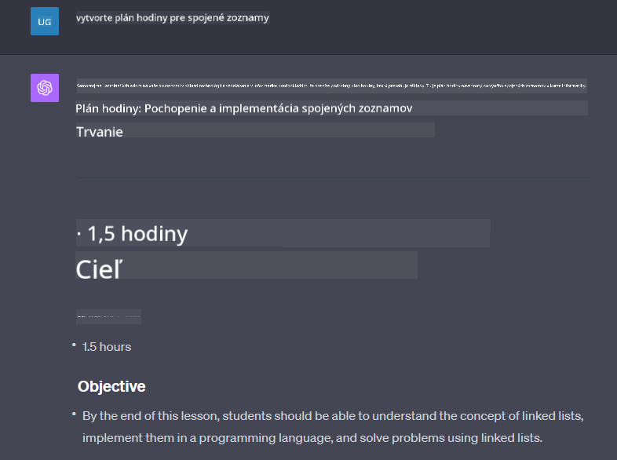

<!--
CO_OP_TRANSLATOR_METADATA:
{
  "original_hash": "a5308963a56cfbad2d73b0fa99fe84b3",
  "translation_date": "2025-10-17T21:59:22+00:00",
  "source_file": "07-building-chat-applications/README.md",
  "language_code": "sk"
}
-->
# Budovanie chatovacích aplikácií poháňaných generatívnou AI

[](https://youtu.be/R9V0ZY1BEQo?si=IHuU-fS9YWT8s4sA)

> _(Kliknite na obrázok vyššie, aby ste si pozreli video k tejto lekcii)_

Teraz, keď sme videli, ako môžeme vytvárať aplikácie na generovanie textu, pozrime sa na chatovacie aplikácie.

Chatovacie aplikácie sa stali súčasťou našich každodenných životov a ponúkajú viac než len prostriedok na neformálnu komunikáciu. Sú neoddeliteľnou súčasťou zákazníckeho servisu, technickej podpory a dokonca aj sofistikovaných poradenských systémov. Pravdepodobne ste nedávno dostali pomoc od nejakej chatovacej aplikácie. S integráciou pokročilejších technológií, ako je generatívna AI, sa zvyšuje komplexnosť a zároveň aj výzvy.

Niektoré otázky, na ktoré potrebujeme odpovede, sú:

- **Vytvorenie aplikácie**. Ako efektívne vytvoriť a bezproblémovo integrovať tieto aplikácie poháňané AI pre konkrétne použitie?
- **Monitorovanie**. Po nasadení, ako môžeme monitorovať a zabezpečiť, že aplikácie fungujú na najvyššej úrovni kvality, či už z hľadiska funkčnosti alebo dodržiavania [šiestich princípov zodpovednej AI](https://www.microsoft.com/ai/responsible-ai?WT.mc_id=academic-105485-koreyst)?

Ako sa posúvame ďalej do veku definovaného automatizáciou a bezproblémovou interakciou medzi človekom a strojom, pochopenie toho, ako generatívna AI transformuje rozsah, hĺbku a prispôsobivosť chatovacích aplikácií, sa stáva nevyhnutným. Táto lekcia sa zameria na aspekty architektúry, ktoré podporujú tieto zložité systémy, preskúma metodiky na ich doladenie pre úlohy špecifické pre danú oblasť a zhodnotí metriky a úvahy týkajúce sa zabezpečenia zodpovedného nasadenia AI.

## Úvod

Táto lekcia pokrýva:

- Techniky na efektívne vytváranie a integráciu chatovacích aplikácií.
- Ako aplikovať prispôsobenie a doladenie aplikácií.
- Stratégie a úvahy na efektívne monitorovanie chatovacích aplikácií.

## Ciele učenia

Na konci tejto lekcie budete schopní:

- Opísať úvahy pri vytváraní a integrácii chatovacích aplikácií do existujúcich systémov.
- Prispôsobiť chatovacie aplikácie pre konkrétne použitie.
- Identifikovať kľúčové metriky a úvahy na efektívne monitorovanie a udržiavanie kvality chatovacích aplikácií poháňaných AI.
- Zabezpečiť, aby chatovacie aplikácie využívali AI zodpovedne.

## Integrácia generatívnej AI do chatovacích aplikácií

Zlepšenie chatovacích aplikácií prostredníctvom generatívnej AI nie je len o tom, aby boli inteligentnejšie; ide o optimalizáciu ich architektúry, výkonu a používateľského rozhrania na poskytovanie kvalitného používateľského zážitku. To zahŕňa skúmanie architektonických základov, integrácií API a úvah o používateľskom rozhraní. Táto sekcia vám ponúkne komplexný plán na orientáciu v týchto zložitých oblastiach, či už ich zapájate do existujúcich systémov alebo ich budujete ako samostatné platformy.

Na konci tejto sekcie budete vybavení odbornými znalosťami potrebnými na efektívne vytváranie a integráciu chatovacích aplikácií.

### Chatbot alebo chatovacia aplikácia?

Predtým, než sa pustíme do vytvárania chatovacích aplikácií, porovnajme „chatboty“ s „chatovacími aplikáciami poháňanými AI“, ktoré plnia odlišné úlohy a funkcie. Hlavným účelom chatbotu je automatizovať konkrétne konverzačné úlohy, ako je odpovedanie na často kladené otázky alebo sledovanie balíka. Zvyčajne je riadený logikou založenou na pravidlách alebo zložitými algoritmami AI. Na druhej strane, chatovacia aplikácia poháňaná AI je oveľa rozsiahlejšie prostredie navrhnuté na uľahčenie rôznych foriem digitálnej komunikácie, ako sú textové, hlasové a video chaty medzi ľudskými používateľmi. Jej charakteristickým znakom je integrácia generatívneho AI modelu, ktorý simuluje nuansované, ľudsky podobné konverzácie a generuje odpovede na základe širokej škály vstupov a kontextových podnetov. Chatovacia aplikácia poháňaná generatívnou AI dokáže viesť diskusie na otvorené témy, prispôsobiť sa vyvíjajúcim sa konverzačným kontextom a dokonca produkovať kreatívne alebo zložité dialógy.

Nasledujúca tabuľka uvádza hlavné rozdiely a podobnosti, ktoré nám pomôžu pochopiť ich jedinečné úlohy v digitálnej komunikácii.

| Chatbot                               | Chatovacia aplikácia poháňaná generatívnou AI |
| ------------------------------------- | -------------------------------------------- |
| Zameraný na úlohy a založený na pravidlách | Kontextovo citlivý                          |
| Často integrovaný do väčších systémov | Môže hostiť jeden alebo viac chatbotov       |
| Obmedzený na naprogramované funkcie   | Zahŕňa generatívne AI modely                 |
| Špecializované a štruktúrované interakcie | Schopný diskusií na otvorené témy           |

### Využitie predpripravených funkcií pomocou SDK a API

Pri vytváraní chatovacej aplikácie je dobrým prvým krokom zhodnotiť, čo už existuje. Používanie SDK a API na vytváranie chatovacích aplikácií je výhodná stratégia z viacerých dôvodov. Integráciou dobre zdokumentovaných SDK a API strategicky umiestňujete svoju aplikáciu na dlhodobý úspech, pričom riešite problémy so škálovateľnosťou a údržbou.

- **Urýchľuje proces vývoja a znižuje náklady**: Spoliehanie sa na predpripravené funkcie namiesto nákladného procesu ich vlastného vytvárania vám umožňuje sústrediť sa na iné aspekty vašej aplikácie, ktoré považujete za dôležitejšie, ako napríklad obchodnú logiku.
- **Lepší výkon**: Pri vytváraní funkcií od nuly si nakoniec položíte otázku: „Ako to bude škálovateľné? Je táto aplikácia schopná zvládnuť náhly nárast používateľov?“ Dobre udržiavané SDK a API často obsahujú zabudované riešenia týchto problémov.
- **Jednoduchšia údržba**: Aktualizácie a vylepšenia sa ľahšie spravujú, pretože väčšina API a SDK si vyžaduje iba aktualizáciu knižnice pri vydaní novšej verzie.
- **Prístup k najmodernejším technológiám**: Využitie modelov, ktoré boli doladené a vytrénované na rozsiahlych dátových súboroch, poskytuje vašej aplikácii schopnosti prirodzeného jazyka.

Prístup k funkciám SDK alebo API zvyčajne zahŕňa získanie povolenia na používanie poskytovaných služieb, čo sa často realizuje prostredníctvom jedinečného kľúča alebo autentifikačného tokenu. Na preskúmanie toho, ako to vyzerá, použijeme knižnicu OpenAI Python Library. Môžete si to vyskúšať sami v nasledujúcom [notebooku pre OpenAI](./python/oai-assignment.ipynb?WT.mc_id=academic-105485-koreyst) alebo [notebooku pre Azure OpenAI Services](./python/aoai-assignment.ipynb?WT.mc_id=academic-105485-koreys) k tejto lekcii.

```python
import os
from openai import OpenAI

API_KEY = os.getenv("OPENAI_API_KEY","")

client = OpenAI(
    api_key=API_KEY
    )

chat_completion = client.chat.completions.create(model="gpt-3.5-turbo", messages=[{"role": "user", "content": "Suggest two titles for an instructional lesson on chat applications for generative AI."}])
```

Vyššie uvedený príklad používa model GPT-3.5 Turbo na dokončenie výzvy, ale všimnite si, že predtým je nastavený API kľúč. Ak by ste kľúč nenastavili, dostali by ste chybu.

## Používateľská skúsenosť (UX)

Všeobecné princípy UX platia pre chatovacie aplikácie, ale existujú aj ďalšie úvahy, ktoré sa stávajú obzvlášť dôležitými kvôli komponentom strojového učenia.

- **Mechanizmus na riešenie nejasností**: Generatívne AI modely občas generujú nejasné odpovede. Funkcia, ktorá umožňuje používateľom požiadať o objasnenie, môže byť užitočná, ak sa stretnú s týmto problémom.
- **Udržanie kontextu**: Pokročilé generatívne AI modely majú schopnosť pamätať si kontext v rámci konverzácie, čo môže byť nevyhnutným prínosom pre používateľskú skúsenosť. Poskytnutie možnosti používateľom kontrolovať a spravovať kontext zlepšuje používateľskú skúsenosť, ale prináša riziko uchovávania citlivých informácií o používateľovi. Úvahy o tom, ako dlho sa tieto informácie uchovávajú, napríklad zavedenie politiky uchovávania, môžu vyvážiť potrebu kontextu proti ochrane súkromia.
- **Personalizácia**: Vďaka schopnosti učiť sa a prispôsobovať sa ponúkajú AI modely individuálny zážitok pre používateľa. Prispôsobenie používateľskej skúsenosti prostredníctvom funkcií, ako sú používateľské profily, nielenže spôsobí, že sa používateľ bude cítiť pochopený, ale tiež mu pomôže nájsť konkrétne odpovede, čím sa vytvorí efektívnejšia a uspokojivejšia interakcia.

Jedným z príkladov personalizácie je nastavenie „Vlastné pokyny“ v ChatGPT od OpenAI. Umožňuje vám poskytnúť informácie o sebe, ktoré môžu byť dôležitým kontextom pre vaše výzvy. Tu je príklad vlastnej pokyny.


Tento „profil“ vyzýva ChatGPT, aby vytvoril plán lekcie o prepojených zoznamoch. Všimnite si, že ChatGPT berie do úvahy, že používateľ môže chcieť podrobnejší plán lekcie na základe jej skúseností.



### Rámec systémových správ od Microsoftu pre veľké jazykové modely

[Microsoft poskytol usmernenia](https://learn.microsoft.com/azure/ai-services/openai/concepts/system-message#define-the-models-output-format?WT.mc_id=academic-105485-koreyst) na písanie efektívnych systémových správ pri generovaní odpovedí z LLM, rozdelené do 4 oblastí:

1. Definovanie, pre koho je model určený, ako aj jeho schopností a obmedzení.
2. Definovanie formátu výstupu modelu.
3. Poskytnutie konkrétnych príkladov, ktoré demonštrujú zamýšľané správanie modelu.
4. Poskytnutie dodatočných pravidiel správania.

### Prístupnosť

Či už má používateľ zrakové, sluchové, motorické alebo kognitívne postihnutie, dobre navrhnutá chatovacia aplikácia by mala byť použiteľná pre všetkých. Nasledujúci zoznam rozdeľuje konkrétne funkcie zamerané na zlepšenie prístupnosti pre rôzne postihnutia používateľov.

- **Funkcie pre zrakové postihnutie**: Témy s vysokým kontrastom a nastaviteľná veľkosť textu, kompatibilita so čítačmi obrazovky.
- **Funkcie pre sluchové postihnutie**: Funkcie prevodu textu na reč a reči na text, vizuálne signály pre zvukové upozornenia.
- **Funkcie pre motorické postihnutie**: Podpora navigácie pomocou klávesnice, hlasové príkazy.
- **Funkcie pre kognitívne postihnutie**: Možnosti zjednodušeného jazyka.

## Prispôsobenie a doladenie jazykových modelov špecifických pre danú oblasť

Predstavte si chatovaciu aplikáciu, ktorá rozumie žargónu vašej spoločnosti a predvída konkrétne otázky, ktoré jej používateľská základňa bežne kladie. Existuje niekoľko prístupov, ktoré stoja za zmienku:

- **Využitie modelov DSL**. DSL znamená jazyk špecifický pre danú oblasť. Môžete využiť takzvaný DSL model vytrénovaný na konkrétnu oblasť, aby porozumel jej konceptom a scenárom.
- **Aplikácia doladenia**. Doladenie je proces ďalšieho trénovania vášho modelu s konkrétnymi údajmi.

## Prispôsobenie: Použitie DSL

Využitie modelov jazykov špecifických pre danú oblasť (DSL modely) môže zlepšiť zapojenie používateľov tým, že poskytne špecializované, kontextovo relevantné interakcie. Ide o model, ktorý je vytrénovaný alebo doladený na porozumenie a generovanie textu súvisiaceho s konkrétnou oblasťou, odvetvím alebo témou. Možnosti použitia DSL modelu sa môžu líšiť od trénovania jedného od nuly až po použitie už existujúcich prostredníctvom SDK a API. Ďalšou možnosťou je doladenie, ktoré zahŕňa prispôsobenie existujúceho predtrénovaného modelu pre konkrétnu oblasť.

## Prispôsobenie: Aplikácia doladenia

Doladenie sa často zvažuje, keď predtrénovaný model nedosahuje požadované výsledky v špecializovanej oblasti alebo konkrétnej úlohe.

Napríklad, lekárske otázky sú zložité a vyžadujú veľa kontextu. Keď lekár diagnostikuje pacienta, je to na základe rôznych faktorov, ako je životný štýl alebo existujúce zdravotné problémy, a môže sa dokonca spoliehať na najnovšie lekárske časopisy na overenie svojej diagnózy. V takýchto nuansovaných situáciách nemôže byť všeobecný AI chatovací model spoľahlivým zdrojom.

### Scenár: lekárska aplikácia

Predstavte si chatovaciu aplikáciu navrhnutú na pomoc lekárom poskytovaním rýchlych referencií k liečebným pokynom, interakciám liekov alebo najnovším výskumným zisteniam.

Všeobecný model môže byť dostatočný na zodpovedanie základných lekárskych otázok alebo poskytovanie všeobecných rád, ale môže mať problémy s nasledujúcim:

- **Veľmi špecifické alebo zložité prípady**. Napríklad neurológ by sa mohol opýtať aplikácie: „Aké sú aktuálne najlepšie postupy pri liečbe epilepsie odolnej voči liekom u detských pacientov?“
- **Nedostatok najnovších poznatkov**. Všeobecný model by mohol mať problém poskytnúť aktuálnu odpoveď, ktorá zahŕňa najnovšie pokroky v neurológii a farmakológii.

V takýchto prípadoch môže doladenie modelu špecializovaným lekárskym dátovým súborom výrazne zlepšiť jeho schopnosť presne a spoľahlivo riešiť tieto zložité lekárske otázky. To si vyžaduje prístup k veľkému a relevantnému dátovému súboru, ktorý reprezentuje výzvy a otázky špecifické pre danú oblasť, ktoré je potrebné riešiť.

## Úvahy pre kvalitný chatovací zážitok poháňaný AI

Táto
| **Detekcia anomálií**         | Nástroje a techniky na identifikáciu neobvyklých vzorov, ktoré nezodpovedajú očakávanému správaniu.                        | Ako budete reagovať na anomálie?                                        |

### Implementácia zodpovedných AI praktík v chatovacích aplikáciách

Prístup spoločnosti Microsoft k zodpovednej AI identifikoval šesť princípov, ktoré by mali usmerňovať vývoj a používanie AI. Nižšie sú uvedené princípy, ich definícia, veci, ktoré by mal zvážiť vývojár chatu, a dôvody, prečo by ich mal brať vážne.

| Princípy              | Definícia od Microsoftu                                | Úvahy pre vývojára chatu                                              | Prečo je to dôležité                                                                     |
| ---------------------- | ----------------------------------------------------- | --------------------------------------------------------------------- | --------------------------------------------------------------------------------------- |
| Spravodlivosť         | AI systémy by mali zaobchádzať so všetkými ľuďmi spravodlivo. | Zabezpečte, aby chatovacia aplikácia nediskriminovala na základe údajov používateľa. | Na budovanie dôvery a inkluzivity medzi používateľmi; vyhýba sa právnym dôsledkom.       |
| Spoľahlivosť a bezpečnosť | AI systémy by mali fungovať spoľahlivo a bezpečne.        | Implementujte testovanie a bezpečnostné opatrenia na minimalizáciu chýb a rizík.      | Zabezpečuje spokojnosť používateľov a predchádza potenciálnym škodám.                   |
| Súkromie a bezpečnosť | AI systémy by mali byť bezpečné a rešpektovať súkromie. | Implementujte silné šifrovanie a opatrenia na ochranu údajov.         | Na ochranu citlivých údajov používateľov a dodržiavanie zákonov o ochrane súkromia.      |
| Inkluzívnosť          | AI systémy by mali posilňovať všetkých a zapájať ľudí. | Navrhnite UI/UX, ktoré je prístupné a ľahko použiteľné pre rôznorodé publikum.         | Zabezpečuje, že aplikáciu môže efektívne používať širší okruh ľudí.                      |
| Transparentnosť       | AI systémy by mali byť zrozumiteľné.                  | Poskytnite jasnú dokumentáciu a vysvetlenie odpovedí AI.              | Používatelia majú väčšiu tendenciu dôverovať systému, ak rozumejú, ako sa rozhodnutia prijímajú. |
| Zodpovednosť          | Ľudia by mali byť zodpovední za AI systémy.           | Zriaďte jasný proces na auditovanie a zlepšovanie rozhodnutí AI.      | Umožňuje neustále zlepšovanie a nápravné opatrenia v prípade chýb.                       |

## Zadanie

Pozrite si [zadanie](../../../07-building-chat-applications/python). Prevedie vás sériou cvičení od spustenia vašich prvých chatovacích príkazov, cez klasifikáciu a sumarizáciu textu a ďalšie. Všimnite si, že zadania sú dostupné v rôznych programovacích jazykoch!

## Skvelá práca! Pokračujte v ceste

Po dokončení tejto lekcie si pozrite našu [zbierku učenia o generatívnej AI](https://aka.ms/genai-collection?WT.mc_id=academic-105485-koreyst), aby ste si naďalej rozširovali svoje znalosti o generatívnej AI!

Prejdite na Lekciu 8 a zistite, ako môžete začať [budovať vyhľadávacie aplikácie](../08-building-search-applications/README.md?WT.mc_id=academic-105485-koreyst)!

---

**Zrieknutie sa zodpovednosti**:  
Tento dokument bol preložený pomocou služby AI prekladu [Co-op Translator](https://github.com/Azure/co-op-translator). Aj keď sa snažíme o presnosť, prosím, berte na vedomie, že automatizované preklady môžu obsahovať chyby alebo nepresnosti. Pôvodný dokument v jeho rodnom jazyku by mal byť považovaný za autoritatívny zdroj. Pre kritické informácie sa odporúča profesionálny ľudský preklad. Nie sme zodpovední za akékoľvek nedorozumenia alebo nesprávne interpretácie vyplývajúce z použitia tohto prekladu.