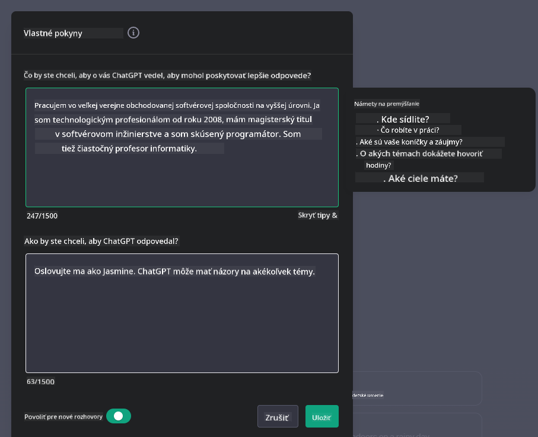

<!--
CO_OP_TRANSLATOR_METADATA:
{
  "original_hash": "ea4bbe640847aafbbba14dae4625e9af",
  "translation_date": "2025-07-09T12:39:02+00:00",
  "source_file": "07-building-chat-applications/README.md",
  "language_code": "sk"
}
-->
# Tvorba chatovacích aplikácií poháňaných generatívnou AI

[](https://aka.ms/gen-ai-lessons7-gh?WT.mc_id=academic-105485-koreyst)

> _(Kliknite na obrázok vyššie pre zobrazenie videa k tejto lekcii)_

Teraz, keď sme videli, ako môžeme vytvárať aplikácie na generovanie textu, pozrime sa na chatovacie aplikácie.

Chatovacie aplikácie sa stali neoddeliteľnou súčasťou nášho každodenného života a ponúkajú viac než len prostriedok na bežný rozhovor. Sú kľúčovou súčasťou zákazníckej podpory, technickej asistencie a dokonca aj sofistikovaných poradenských systémov. Je pravdepodobné, že ste nedávno využili pomoc chatovacej aplikácie. S integráciou pokročilých technológií, ako je generatívna AI, do týchto platforiem rastie aj ich zložitosť a výzvy.

Niektoré otázky, na ktoré potrebujeme odpovede, sú:

- **Tvorba aplikácie**. Ako efektívne vytvoriť a bezproblémovo integrovať tieto AI-poháňané aplikácie pre konkrétne prípady použitia?
- **Monitorovanie**. Po nasadení, ako môžeme sledovať a zabezpečiť, že aplikácie fungujú na najvyššej úrovni kvality, a to nielen z hľadiska funkčnosti, ale aj dodržiavania [šiestich princípov zodpovednej AI](https://www.microsoft.com/ai/responsible-ai?WT.mc_id=academic-105485-koreyst)?

Ako postupujeme do éry definovanej automatizáciou a plynulou interakciou medzi človekom a strojom, je nevyhnutné pochopiť, ako generatívna AI mení rozsah, hĺbku a prispôsobivosť chatovacích aplikácií. Táto lekcia preskúma architektonické aspekty podporujúce tieto zložité systémy, metodológie ich doladenia pre špecifické domény a vyhodnotí metriky a úvahy potrebné na zabezpečenie zodpovedného nasadenia AI.

## Úvod

Táto lekcia pokrýva:

- Techniky efektívnej tvorby a integrácie chatovacích aplikácií.
- Ako aplikovať prispôsobenie a doladenie aplikácií.
- Stratégie a úvahy pre efektívne monitorovanie chatovacích aplikácií.

## Ciele učenia

Na konci tejto lekcie budete schopní:

- Opísať úvahy pri tvorbe a integrácii chatovacích aplikácií do existujúcich systémov.
- Prispôsobiť chatovacie aplikácie pre konkrétne prípady použitia.
- Identifikovať kľúčové metriky a úvahy pre efektívne monitorovanie a udržiavanie kvality AI-poháňaných chatovacích aplikácií.
- Zabezpečiť, aby chatovacie aplikácie využívali AI zodpovedne.

## Integrácia generatívnej AI do chatovacích aplikácií

Vylepšenie chatovacích aplikácií pomocou generatívnej AI nie je len o ich „inteligentnosti“; ide o optimalizáciu ich architektúry, výkonu a používateľského rozhrania tak, aby poskytovali kvalitný používateľský zážitok. To zahŕňa skúmanie architektonických základov, integrácie API a úvahy o používateľskom rozhraní. Táto časť vám poskytne komplexnú cestovnú mapu pre orientáciu v týchto zložitých oblastiach, či už ich pripájate k existujúcim systémom, alebo vytvárate samostatné platformy.

Na konci tejto časti budete vybavení odbornými znalosťami potrebnými na efektívnu tvorbu a integráciu chatovacích aplikácií.

### Chatbot alebo chatovacia aplikácia?

Predtým, než sa pustíme do tvorby chatovacích aplikácií, porovnajme „chatboty“ a „AI-poháňané chatovacie aplikácie“, ktoré plnia odlišné úlohy a funkcie. Hlavným účelom chatbota je automatizovať konkrétne konverzačné úlohy, ako napríklad odpovedanie na často kladené otázky alebo sledovanie zásielky. Zvyčajne je riadený pravidlovou logikou alebo zložitými AI algoritmami. Naopak, AI-poháňaná chatovacia aplikácia je oveľa rozsiahlejšie prostredie navrhnuté na podporu rôznych foriem digitálnej komunikácie, ako sú textové, hlasové a video chaty medzi ľuďmi. Jej charakteristickým znakom je integrácia generatívneho AI modelu, ktorý simuluje nuansované, ľudsky pôsobiace rozhovory a generuje odpovede na základe širokej škály vstupov a kontextových podnetov. Chatovacia aplikácia poháňaná generatívnou AI môže viesť diskusie na otvorené témy, prispôsobovať sa meniacim sa konverzačným kontextom a dokonca vytvárať kreatívny alebo komplexný dialóg.

Nasledujúca tabuľka zhrňuje kľúčové rozdiely a podobnosti, ktoré nám pomôžu pochopiť ich jedinečné úlohy v digitálnej komunikácii.

| Chatbot                               | Chatovacia aplikácia poháňaná generatívnou AI |
| ------------------------------------- | ---------------------------------------------- |
| Zameraný na úlohy a pravidlá          | Vníma kontext                                  |
| Často integrovaný do väčších systémov | Môže hostiť jeden alebo viac chatbotov         |
| Obmedzený na naprogramované funkcie   | Obsahuje generatívne AI modely                 |
| Špecializované a štruktúrované interakcie | Schopný viesť diskusie na otvorené témy        |

### Využitie predpripravených funkcií cez SDK a API

Pri tvorbe chatovacej aplikácie je dobrým prvým krokom zhodnotiť, čo už existuje. Používanie SDK a API na tvorbu chatovacích aplikácií je výhodná stratégia z viacerých dôvodov. Integráciou dobre zdokumentovaných SDK a API strategicky pripravujete svoju aplikáciu na dlhodobý úspech, riešiac otázky škálovateľnosti a údržby.

- **Uľahčuje vývoj a znižuje náklady**: Spoľahnutie sa na predpripravené funkcie namiesto nákladného vývoja vlastných vám umožní sústrediť sa na iné aspekty aplikácie, ktoré môžu byť dôležitejšie, napríklad obchodnú logiku.
- **Lepší výkon**: Pri vývoji funkcií od nuly si nakoniec položíte otázku „Ako to škáluje? Je aplikácia schopná zvládnuť náhly nárast používateľov?“ Dobré SDK a API často obsahujú zabudované riešenia týchto problémov.
- **Jednoduchšia údržba**: Aktualizácie a vylepšenia sa spravujú ľahšie, pretože väčšina API a SDK vyžaduje len aktualizáciu knižnice pri vydaní novej verzie.
- **Prístup k špičkovej technológii**: Využitie modelov, ktoré boli doladené a trénované na rozsiahlych dátových súboroch, poskytuje vašej aplikácii schopnosti spracovania prirodzeného jazyka.

Prístup k funkciám SDK alebo API zvyčajne vyžaduje získanie povolenia na používanie poskytovaných služieb, často prostredníctvom unikátneho kľúča alebo autentifikačného tokenu. Na ukážku použijeme OpenAI Python Library. Môžete si to vyskúšať aj sami v nasledujúcom [notebooku pre OpenAI](../../../07-building-chat-applications/python/oai-assignment.ipynb) alebo [notebooku pre Azure OpenAI Services](../../../07-building-chat-applications/python/aoai-assignment.ipynb) pre túto lekciu.

```python
import os
from openai import OpenAI

API_KEY = os.getenv("OPENAI_API_KEY","")

client = OpenAI(
    api_key=API_KEY
    )

chat_completion = client.chat.completions.create(model="gpt-3.5-turbo", messages=[{"role": "user", "content": "Suggest two titles for an instructional lesson on chat applications for generative AI."}])
```

Príklad vyššie používa model GPT-3.5 Turbo na dokončenie promptu, ale všimnite si, že API kľúč je nastavený pred jeho použitím. Bez nastavenia kľúča by ste dostali chybu.

## Používateľský zážitok (UX)

Všeobecné princípy UX platia aj pre chatovacie aplikácie, no tu sú niektoré ďalšie úvahy, ktoré sú obzvlášť dôležité vzhľadom na zapojené komponenty strojového učenia.

- **Mechanizmus riešenia nejasností**: Generatívne AI modely občas generujú nejednoznačné odpovede. Funkcia, ktorá umožní používateľom požiadať o objasnenie, môže byť užitočná, ak sa s týmto problémom stretnú.
- **Uchovávanie kontextu**: Pokročilé generatívne AI modely majú schopnosť si pamätať kontext v rámci konverzácie, čo môže byť pre používateľský zážitok nevyhnutné. Poskytnutie možnosti používateľom kontrolovať a spravovať kontext zlepšuje UX, ale zároveň prináša riziko uchovávania citlivých informácií. Úvahy o tom, ako dlho sa tieto informácie uchovávajú, napríklad zavedením politiky uchovávania, môžu vyvážiť potrebu kontextu a ochranu súkromia.
- **Personalizácia**: Vďaka schopnosti učiť sa a prispôsobovať sa ponúkajú AI modely individualizovaný zážitok pre používateľa. Prispôsobenie UX cez funkcie ako používateľské profily nielenže používateľa urobí pocit, že je pochopený, ale tiež mu pomáha efektívnejšie nájsť konkrétne odpovede, čím sa zvyšuje efektivita a spokojnosť.

Príkladom personalizácie sú nastavenia „Custom instructions“ v OpenAI ChatGPT. Umožňujú vám poskytnúť informácie o sebe, ktoré môžu byť dôležitým kontextom pre vaše prompt-y. Tu je príklad vlastného nastavenia.



Tento „profil“ podnecuje ChatGPT, aby vytvoril plán lekcie o prepojených zoznamoch. Všimnite si, že ChatGPT zohľadňuje, že používateľka môže chcieť podrobnejší plán lekcie na základe svojich skúseností.


### Microsoftov rámec systémových správ pre veľké jazykové modely

[Microsoft poskytol odporúčania](https://learn.microsoft.com/azure/ai-services/openai/concepts/system-message#define-the-models-output-format?WT.mc_id=academic-105485-koreyst) na písanie efektívnych systémových správ pri generovaní odpovedí z LLM, rozdelené do 4 oblastí:

1. Definovanie, pre koho je model určený, jeho schopností a obmedzení.
2. Definovanie formátu výstupu modelu.
3. Poskytnutie konkrétnych príkladov, ktoré demonštrujú zamýšľané správanie modelu.
4. Poskytnutie dodatočných bezpečnostných opatrení.

### Prístupnosť

Či už má používateľ zrakové, sluchové, motorické alebo kognitívne obmedzenia, dobre navrhnutá chatovacia aplikácia by mala byť použiteľná pre všetkých. Nasledujúci zoznam rozdeľuje konkrétne funkcie zamerané na zlepšenie prístupnosti pre rôzne typy obmedzení.

- **Funkcie pre zrakové postihnutie**: Vysokokontrastné témy a možnosť zväčšenia textu, kompatibilita so čítačkami obrazovky.
- **Funkcie pre sluchové postihnutie**: Funkcie prevodu textu na reč a reči na text, vizuálne upozornenia na zvukové notifikácie.
- **Funkcie pre motorické postihnutie**: Podpora navigácie klávesnicou, hlasové príkazy.
- **Funkcie pre kognitívne postihnutie**: Možnosti zjednodušeného jazyka.

## Prispôsobenie a doladenie pre doménovo špecifické jazykové modely

Predstavte si chatovaciu aplikáciu, ktorá rozumie žargónu vašej firmy a predvída konkrétne otázky, ktoré jej používatelia často kladú. Existuje niekoľko prístupov, ktoré stojí za zmienku:

- **Využitie DSL modelov**. DSL znamená doménovo špecifický jazyk. Môžete využiť tzv. DSL model, ktorý je trénovaný na konkrétnu doménu, aby rozumel jej konceptom a scenárom.
- **Aplikácia doladenia (fine-tuning)**. Doladenie je proces ďalšieho trénovania modelu na špecifických dátach.

## Prispôsobenie: Použitie DSL

Využitie doménovo špecifických jazykových modelov (DSL modelov) môže zvýšiť angažovanosť používateľov tým, že poskytuje špecializované, kontextovo relevantné interakcie. Ide o model, ktorý je trénovaný alebo doladený na porozumenie a generovanie textu súvisiaceho s konkrétnou oblasťou, odvetvím alebo témou. Možnosti použitia DSL modelu sa pohybujú od trénovania od základov až po využitie existujúcich modelov cez SDK a API. Ďalšou možnosťou je doladenie, ktoré spočíva v adaptácii existujúceho predtrénovaného modelu pre konkrétnu doménu.

## Prispôsobenie: Aplikácia doladenia

Doladenie sa často zvažuje, keď predtrénovaný model nestačí v špecializovanej doméne alebo pre konkrétnu úlohu.

Napríklad lekárske otázky sú zložité a vyžadujú veľa kontextu. Keď lekár diagnostikuje pacienta, vychádza z rôznych faktorov, ako je životný štýl alebo predchádzajúce ochorenia, a môže sa dokonca spoliehať na najnovšie lekárske štúdie na potvrdenie diagnózy. V takýchto zložitých situáciách nemôže byť všeobecná AI chatovacia aplikácia spoľahlivým zdrojom.

### Scenár: lekárska aplikácia

Predstavte si chatovaciu aplikáciu navrhnutú na pomoc lekárom tým, že poskytuje rýchle odkazy na liečebné smernice, interakcie liekov alebo najnovšie výskumné zistenia.

Všeobecný model môže byť dostatočný na odpovede na základné lekárske otázky alebo všeobecné rady, ale môže mať problém s:

- **Veľmi špecifickými alebo zložitými prípadmi**. Napríklad neurológ by mohol aplikácii položiť otázku: „Aké sú aktuálne najlepšie postupy pri liečbe farmakorezistentnej epilepsie u detských pacientov?“
- **Nedostatkom najnovších poznatkov**. Všeobecný model môže mať problém poskytnúť aktuálnu odpoveď, ktorá zahŕňa najnovšie pokroky v neurológii a farmakológii.

V takýchto prípadoch môže doladenie modelu so špecializovaným lekárskym datasetom výrazne zlepšiť jeho schopnosť presnejšie a spoľahlivejšie riešiť tieto zložité lekárske otázky. To vyžaduje prístup k veľkému a relevantnému datasetu, ktorý reprezentuje doménovo špecifické výzvy a otázky, ktoré je potrebné riešiť.

## Úvahy pre kvalitný AI-poháňaný chatovací zážitok

Táto časť načrtáva kritériá pre „vysokokvalitné“ chatovacie aplikácie, ktoré zahŕňajú zachytávanie merateľných metrík a dodržiavanie rámca zodpovedného využívania AI technológií.

### Kľúčové metriky

Na udržanie vysokej kvality výkonu aplikácie je nevyhnutné sledovať kľúčové metriky a úvahy. Tieto merania nielen zabezpečujú funkčnosť aplikácie, ale aj hodnotia kvalitu AI modelu a používateľský zážitok. Nižšie je zoznam základných, AI a UX metrík, ktoré treba zvážiť.

| Metrika                      | Definícia                                                                                                             | Úvahy
| **Detekcia anomálií**         | Nástroje a techniky na identifikáciu nezvyčajných vzorov, ktoré nezodpovedajú očakávanému správaniu.                        | Ako budete reagovať na anomálie?                                        |

### Implementácia zodpovedných AI praktík v chatovacích aplikáciách

Prístup Microsoftu k zodpovednej AI identifikoval šesť princípov, ktoré by mali viesť vývoj a používanie AI. Nižšie sú uvedené princípy, ich definícia a veci, ktoré by mal vývojár chatu zvážiť a prečo by ich mal brať vážne.

| Princípy               | Definícia Microsoftu                                | Úvahy pre vývojára chatu                                      | Prečo je to dôležité                                                                     |
| ---------------------- | -------------------------------------------------- | ------------------------------------------------------------- | ---------------------------------------------------------------------------------------- |
| Spravodlivosť          | AI systémy by mali zaobchádzať so všetkými ľuďmi spravodlivo. | Zabezpečiť, aby chatovacia aplikácia nediskriminovala na základe údajov používateľa. | Budovanie dôvery a inkluzivity medzi používateľmi; predchádza právnym problémom.         |
| Spoľahlivosť a bezpečnosť | AI systémy by mali fungovať spoľahlivo a bezpečne. | Zaviesť testovanie a bezpečnostné opatrenia na minimalizáciu chýb a rizík. | Zabezpečuje spokojnosť používateľov a predchádza možným škodám.                           |
| Súkromie a bezpečnosť  | AI systémy by mali byť bezpečné a rešpektovať súkromie. | Použiť silné šifrovanie a opatrenia na ochranu údajov.         | Chráni citlivé údaje používateľov a zabezpečuje súlad s právnymi predpismi o ochrane súkromia. |
| Inkluzívnosť           | AI systémy by mali posilňovať každého a zapájať ľudí. | Navrhnúť UI/UX, ktoré je prístupné a jednoduché na používanie pre rôzne skupiny používateľov. | Zabezpečuje, že aplikáciu môže efektívne používať širšie spektrum ľudí.                   |
| Transparentnosť        | AI systémy by mali byť zrozumiteľné.               | Poskytnúť jasnú dokumentáciu a vysvetlenie AI odpovedí.        | Používatelia viac dôverujú systému, ak rozumejú, ako sa prijímajú rozhodnutia.            |
| Zodpovednosť           | Ľudia by mali byť zodpovední za AI systémy.         | Zaviesť jasný proces auditu a zlepšovania AI rozhodnutí.       | Umožňuje priebežné zlepšovanie a nápravu v prípade chýb.                                |

## Zadanie

Pozrite si [zadanie](../../../07-building-chat-applications/python), ktoré vás prevedie sériou cvičení od spustenia prvých chatovacích príkazov, cez klasifikáciu a zhrnutie textu až po ďalšie úlohy. Všimnite si, že zadania sú dostupné v rôznych programovacích jazykoch!

## Skvelá práca! Pokračujte v ceste

Po dokončení tejto lekcie si pozrite našu [kolekciu Generatívnej AI](https://aka.ms/genai-collection?WT.mc_id=academic-105485-koreyst), kde môžete ďalej rozvíjať svoje znalosti o generatívnej AI!

Prejdite na Lekciu 8 a zistite, ako môžete začať [budovať vyhľadávacie aplikácie](../08-building-search-applications/README.md?WT.mc_id=academic-105485-koreyst)!

**Vyhlásenie o zodpovednosti**:  
Tento dokument bol preložený pomocou AI prekladateľskej služby [Co-op Translator](https://github.com/Azure/co-op-translator). Hoci sa snažíme o presnosť, prosím, majte na pamäti, že automatizované preklady môžu obsahovať chyby alebo nepresnosti. Originálny dokument v jeho pôvodnom jazyku by mal byť považovaný za autoritatívny zdroj. Pre kritické informácie sa odporúča profesionálny ľudský preklad. Nie sme zodpovední za akékoľvek nedorozumenia alebo nesprávne interpretácie vyplývajúce z použitia tohto prekladu.